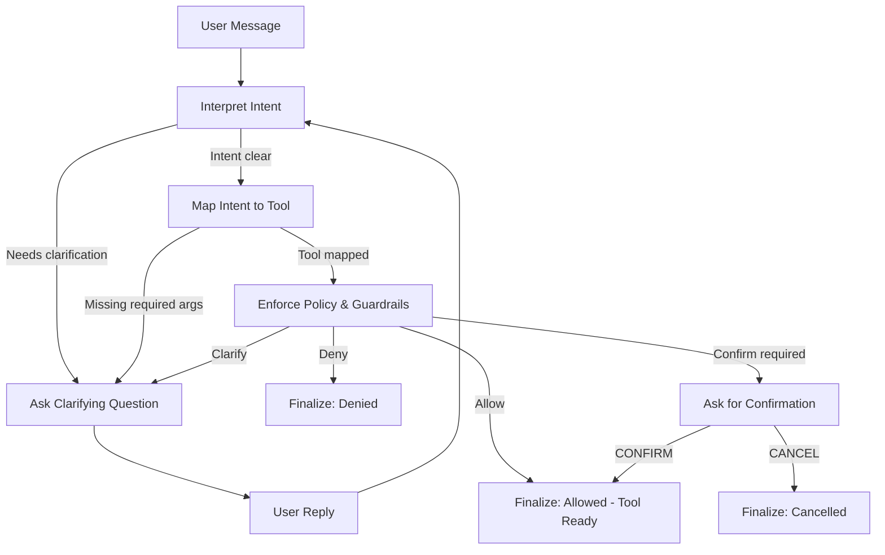
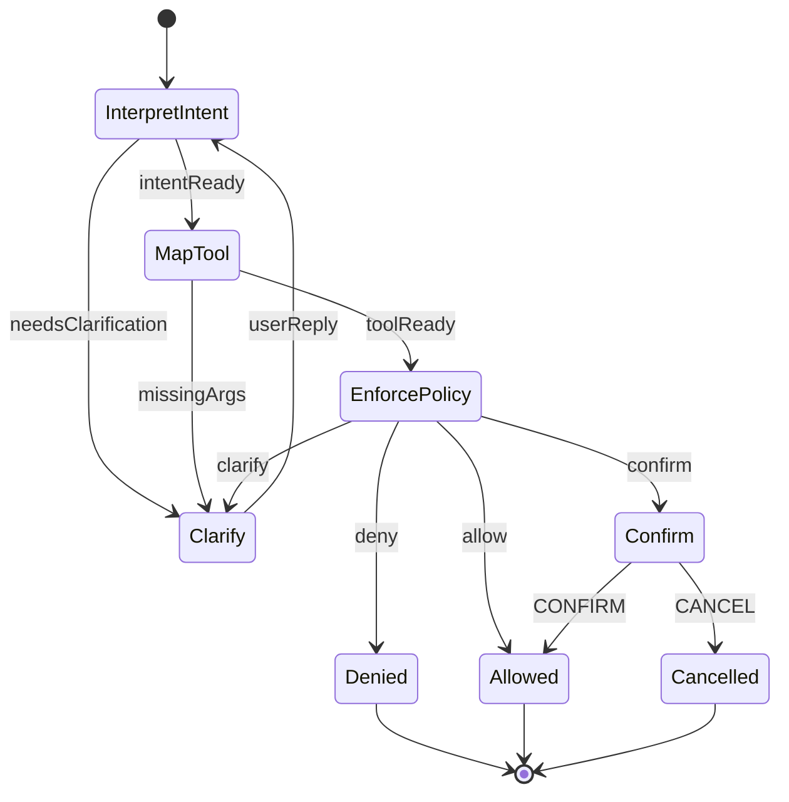

# Agentic AI Mental Model (Backend Engineer View)

## Why Agentic AI exists (the real reason)

Traditional backend systems assume:

* inputs are structured (DTOs)
* user intent is explicit
* actions are deterministic

Human language breaks all three.

Example:

> “Move my bedroom shade halfway”

From a backend perspective, this is a terrible request:

* Which device?
* What does “halfway” mean?
* Is the device online?
* Is the user allowed to control it *right now*?

Agentic AI exists to **bridge messy human intent to strict machine execution**
without turning your backend into chaos.

---

## The core idea (one sentence)

Agentic AI is **a controlled decision-making loop** where an LLM proposes actions, but **your system decides what actually happens**.

If you remember only one thing:

> The LLM is never trusted. It is always supervised.

---

## The agent mental model (mapped to backend concepts)

Think of an agent as **five layers**, not “an AI”.

### 1. Input layer (Controller equivalent)

* Receives raw user input (text, voice → text)
* No assumptions
* No execution

Backend analogy:

* HTTP controller receiving an unvalidated request body

---

### 2. Reasoning layer (Smart service, NOT executor)

This is where the LLM lives.

Responsibilities:

* Interpret intent
* Propose a structured plan
* Ask for clarification if needed

Not allowed to:

* Call APIs directly
* Construct URLs
* Decide permissions

Backend analogy:

* A service that returns a **command object**, not side effects

---

### 3. Intent / Plan layer (DTO boundary — very important)

This is the **contract boundary**.

Output must be:

* Structured
* Typed
* Validatable
* Serializable

Example (conceptual, not final):

```json
Intent:
- action: set_position
- target: bedroom shade
- value: 50
- confidence: 0.92
- needsClarification: false
```

Backend analogy:

* Command DTO in CQRS
* Workflow input in Step Functions

This layer is where **you regain control**.

---

### 4. Execution layer (Dumb, strict, safe)

This layer:

* maps intent → tool
* validates parameters
* enforces policies
* executes APIs

Zero reasoning.
Zero interpretation.

Backend analogy:

* Service + repository + integration layer
* IAM + validation + retries

If this layer is “smart”, your system is unsafe.

---

### 5. Feedback & state layer

Responsibilities:

* Update state
* Log decisions
* Produce user-friendly response
* Trigger follow-ups if needed

Backend analogy:

* Response DTO + audit logs + metrics

---

## What an agent is NOT (important anti-patterns)

* NOT a chatbot with plugins
* NOT "LLM decides everything"
* NOT direct text → HTTP call
* NOT RAG + execution mixed together
* NOT autonomous without guardrails

Most production failures come from violating one of these.

---

## Agent vs workflow engine (key distinction)

You already know workflow engines like:

* AWS Step Functions
* Temporal
* Airflow

Those systems:

* require structured inputs
* fail if inputs are ambiguous

Agentic systems:

* **resolve ambiguity first**
* then behave like a workflow engine

Think of an agent as:

> “A workflow engine with a natural-language preprocessor”

---

## Why this matters for IoT specifically

IoT amplifies risk:

* Physical movement
* Repeated commands
* Device state drift
* Latency and partial failures

This means:

* You must separate *thinking* from *doing*
* You must be able to stop execution at any point
* You must be able to explain *why* something happened

Agentic AI done right gives you that control.

---

## Phase 0 takeaway (lock this in)

If you design this correctly:

* You can swap OpenAI ↔ Anthropic without fear
* You can replay and debug decisions
* You can guarantee safety
* Your backend remains boring (this is good)

If you design this wrong:

* You get unpredictable execution
* Security holes
* Impossible-to-debug behavior

---

## Checkpoint (answer briefly)

1. In this model, **which layer is allowed to call your IoT APIs?**
2. Why is the **Intent/Plan layer** the most important boundary?
3. What would go wrong if the LLM directly constructed HTTP requests?


Perfect — I’ll answer the checkpoint myself, then we’ll continue with **small, low-risk practice projects** and keep the **capstone for the very end**. That’s the right call.

---

## Checkpoint — model answers

### 1. Which layer is allowed to call your IoT APIs?

Only the **Execution layer**.

Why:

* It is dumb, strict, and deterministic
* It enforces validation, authorization, bounds, retries
* It does **zero interpretation**

Every other layer may *suggest* or *plan*, but **only execution performs side effects**.

If the reasoning layer can call APIs, you’ve already lost control.

---

### 2. Why is the Intent / Plan layer the most important boundary?

Because it is the **trust boundary** between:

* untrusted reasoning (LLM output)
* trusted execution (your backend)

This layer:

* freezes intent into a structured object
* makes behavior auditable
* allows validation and policy enforcement
* lets you say “no” safely

Without this boundary, you cannot guarantee safety, replayability, or correctness.

---

### 3. What goes wrong if the LLM directly constructs HTTP requests?

Several things — all bad:

* security: prompt injection can trigger unauthorized APIs
* correctness: malformed URLs, wrong parameters
* reliability: retries, idempotency, timeouts are skipped
* observability: no clean trace of decisions
* compliance: impossible to prove why an action happened

In short:
you turn a reasoning engine into a production incident generator.

---

## Where we are now

You now have the **correct mental model**:

* LLM = proposes
* system = decides
* execution = enforces

This is already more solid than 80% of “agent” implementations online.

---

## Next lesson (starting now)

We move to:

### Phase 1.1 — Designing a rock-solid Intent schema

This is where most agent systems quietly fail, and where we’ll be strict.

In the next message, I’ll:

* define what an intent schema *must* contain
* show good vs bad intent designs
* design a **generic, reusable intent model** (not IoT-specific yet)
* explain how this maps to future tools and graphs

Perfect. We’ll start **Mini-Project 1**, exactly as planned.
No frameworks, no LangChain, no LangGraph, no RAG, no execution.
This is **pure agentic thinking**.

---

# Mini-Project 1

Intent Extraction (Text → Structured Intent, Safely)

## Why this mini-project exists

If you get **intent extraction wrong**, everything else is broken:

* tools won’t be chosen correctly
* validation becomes impossible
* safety guarantees collapse
* workflows turn unpredictable

This mini-project trains the most important instinct:
**never trust raw language, always freeze it into structure first**

---

## Scope (very strict)

What we WILL do:

* take natural language
* convert it into a structured Intent object
* detect ambiguity
* decide whether clarification is needed

What we will NOT do:

* call APIs
* select tools
* use frameworks
* execute anything
* store memory

Think of this as writing a **pure function**.

---

## The problem we are solving

Input:

> “Move my bedroom shade halfway”

Output (conceptually):

* What does the user want?
* On what?
* With what parameters?
* Are we confident?
* Can we proceed safely?

---

## Step 1: Define what an Intent MUST answer

Every intent object must answer these questions:

1. What category of action is this?
2. What is the user trying to do?
3. What is the target?
4. Are all required details present?
5. How confident are we?
6. Is clarification required?

If your intent does not answer these, it is incomplete.

---

## Step 2: Intent categories (start small)

For Mini-Project 1, we define **only two categories**:

1. device_control
2. device_query

We are intentionally NOT adding troubleshooting yet.

---

## Step 3: First-draft Intent schema (language-agnostic)

This is a **design artifact**, not code yet.

Intent

* kind: "device_control" | "device_query"

For device_control:

* action: "open" | "close" | "set_position" | "stop"
* target:

  * room?: string
  * deviceName?: string
* parameters?:

  * position?: number   // 0–100
* confidence: number    // 0.0 – 1.0
* needsClarification: boolean
* clarificationQuestion?: string

For device_query:

* query: "status" | "battery" | "connectivity"
* target:

  * room?: string
  * deviceName?: string
* confidence: number
* needsClarification: boolean
* clarificationQuestion?: string

This schema is intentionally boring.
Boring = safe.

---

## Step 4: Walk through real examples

### Example 1

Input:

> “Move my bedroom shade halfway”

Extracted intent:

* kind: device_control
* action: set_position
* target: { room: "bedroom" }
* parameters: { position: 50 }
* confidence: 0.9
* needsClarification: false

Why confidence is high:

* action is clear
* target is specific
* parameter is inferred safely (halfway → 50)

---

### Example 2

Input:

> “Move the shade”

Extracted intent:

* kind: device_control
* action: set_position
* target: {}
* parameters: {}
* confidence: 0.4
* needsClarification: true
* clarificationQuestion:
  “Which room or device should I control?”

No guessing. No defaults. No execution.

---

### Example 3

Input:

> “Set bedroom shade to 150 percent”

Extracted intent:

* kind: device_control
* action: set_position
* target: { room: "bedroom" }
* parameters: { position: 150 }
* confidence: 0.6
* needsClarification: true
* clarificationQuestion:
  “Shade position must be between 0 and 100. What position would you like?”

Important:

* we do NOT fix the value
* we detect invalid input early

---

### Example 4

Input:

> “Is my bedroom shade open?”

Extracted intent:

* kind: device_query
* query: status
* target: { room: "bedroom" }
* confidence: 0.85
* needsClarification: false

---

## Step 5: Rules you must never break

1. Intent extraction must be side-effect free
2. Never invent missing information
3. Confidence must drop if assumptions are made
4. Clarification beats guessing every time
5. Invalid parameters are still intent, not execution errors

These rules will carry into LangChain and LangGraph later.

---

## Step 6: Mini-Project output (what you should have)

By the end of Mini-Project 1, you conceptually have:

* a clear Intent schema
* a repeatable reasoning pattern
* predictable handling of ambiguity
* zero unsafe behavior

No code yet — this is **design discipline training**.

---

## Checkpoint (I’ll still ask, but I’ll also answer next step)

Answer in your head or short reply:

1. Why do we include `confidence` even though execution doesn’t use it yet?
2. Why is `needsClarification` better than throwing an error?
3. What would break if we auto-defaulted room = “bedroom”?

---

## Next mini-project (coming next)

Mini-Project 2:
**Intent → Tool Mapping (Dry-Run Only)**

You’ll learn:

* how tools differ from intents
* why allowlists matter
* how one intent maps to exactly one execution path

Perfect choice. Using a **different, generic domain** will lock in the pattern so you can reuse it everywhere (IoT, payments, workflows, anything).

We’ll use a **Calendar / Task Scheduling** domain.
It’s simple, familiar, and has zero physical risk.

---

# Mini-Project 2

Intent → Tool Mapping (Dry-Run Only)

## Why this mini-project exists

In Mini-Project 1, we answered:

> “What does the user want?”

In Mini-Project 2, we answer:

> “Which system capability should handle that intent?”

This is where many people accidentally let the LLM:

* pick any API it wants
* invent parameters
* skip validation

We will **not** do that.

---

## Problem we are solving

Input:

* a **validated Intent object** (already extracted)

Output:

* a **single, explicit tool call proposal**
* or a **blocked decision**

Still:

* NO real execution
* NO HTTP calls
* NO frameworks

Think: **command routing**, not execution.

---

## Step 1: Define the domain (Calendar system)

Pretend you are building a calendar backend.

### Supported actions (intentionally limited)

User can:

* create events
* cancel events
* reschedule events
* query events

Anything else is unsupported.

---

## Step 2: Define tools (strict allowlist)

These are the **only** things the system can do.

Tool: createEvent
Inputs:

* title: string
* date: ISO date
* startTime: HH:mm
* durationMinutes: number

Tool: cancelEvent
Inputs:

* eventId: string

Tool: rescheduleEvent
Inputs:

* eventId: string
* newDate: ISO date
* newStartTime: HH:mm

Tool: listEvents
Inputs:

* date?: ISO date

Important:

* If it’s not here, it cannot happen.
* The model does not get to invent tools.

---

## Step 3: Intent schema (calendar version)

Intent

* kind: "calendar_action" | "calendar_query"

For calendar_action:

* action: "create" | "cancel" | "reschedule"
* target:

  * eventId?: string
  * title?: string
* parameters:

  * date?: string
  * startTime?: string
  * durationMinutes?: number
* confidence: number
* needsClarification: boolean
* clarificationQuestion?: string

---

## Step 4: Mapping rules (this is the key skill)

We now write **explicit mapping rules**.

This is NOT done by the LLM.
This is backend logic.

### Rule examples

1. If intent.action === "create"
   → map to createEvent

2. If intent.action === "cancel"
   AND eventId exists
   → map to cancelEvent

3. If intent.action === "cancel"
   AND eventId missing
   → needsClarification

4. If intent.action === "reschedule"
   AND eventId AND new date/time exist
   → map to rescheduleEvent

5. If intent.kind === "calendar_query"
   → map to listEvents

No guessing. No fallback magic.

---

## Step 5: Walkthrough examples

### Example 1

User:

> “Schedule a meeting tomorrow at 10 for 30 minutes”

Intent (from Mini-Project 1):

* action: create
* title: meeting
* date: tomorrow
* startTime: 10:00
* durationMinutes: 30
* needsClarification: false

Tool mapping:

```
tool: createEvent
args:
  title: "meeting"
  date: "2026-01-27"
  startTime: "10:00"
  durationMinutes: 30
```

Dry-run only.

---

### Example 2

User:

> “Cancel my meeting”

Intent:

* action: cancel
* target: {}
* needsClarification: true

Result:

* NO tool mapping
* clarificationQuestion:
  “Which event should I cancel?”

---

### Example 3

User:

> “Move my meeting to Friday”

Intent:

* action: reschedule
* eventId: missing
* newDate: Friday
* needsClarification: true

Result:

* NO tool mapping
* clarificationQuestion:
  “Which event do you want to reschedule?”

---

### Example 4

User:

> “What meetings do I have today?”

Intent:

* kind: calendar_query
* query: list
* date: today

Tool mapping:

```
tool: listEvents
args:
  date: "2026-01-26"
```

---

## Step 6: Important rules (do not forget)

1. Intent ≠ Tool call
2. Mapping logic is deterministic backend code
3. One intent → at most one tool
4. If required args are missing → clarify, don’t guess
5. Tool mapping can fail safely

This is where **safety lives**.

---

## What you’ve learned so far

You can now:

* separate “understanding” from “doing”
* restrict system behavior using allowlists
* prevent random API execution
* explain *why* something cannot be executed

This is the **agentic core**.

---

## Next mini-project

Mini-Project 3:
**Guardrails & Policy Enforcement**

We’ll introduce:

* parameter bounds
* role-based restrictions
* deny-by-default logic
* explicit “blocked” decisions

This is where your system becomes production-grade.

Before we continue, quick check:

Do you want Mini-Project 3 to:

* extend this **calendar example**, or
* switch to a **financial example** (payments/refunds) to stress safety even more?

Good. Finance is the best domain to learn guardrails because mistakes are expensive.

# Mini-Project 3

Guardrails and Policy Enforcement (Financial Domain, Still Dry-Run)

## Why this mini-project exists

In Mini-Project 2, we mapped intent → tool.

Now we add the missing production layer:

Even if intent is correct and a tool is chosen, the system must still ask:

* Is this user allowed to do this?
* Are the parameters safe and valid?
* Is this action high-risk and needs confirmation?
* Is there fraud / abuse risk?
* Is the request ambiguous?

This is where “agentic” becomes “production”.

---

## Domain: Simple Payments System

Assume you have a backend for a wallet/payment product.

Supported tools (allowlist):

Tool: getBalance
Inputs: { userId: string }

Tool: listTransactions
Inputs: { userId: string, fromDate?: string, toDate?: string }

Tool: createTransfer
Inputs: { userId: string, toPayeeId: string, amountCents: number, currency: "AUD", idempotencyKey: string }

Tool: requestRefund
Inputs: { userId: string, transactionId: string, reasonCode: "DUPLICATE" | "FRAUD" | "NOT_RECEIVED" | "OTHER" }

Tool: freezeAccount
Inputs: { userId: string, reason: string }

We still won’t execute. We will only propose tool calls or block.

---

## Step 1: Intent schema (finance)

Intent:

* kind: "balance_query" | "transaction_query" | "transfer" | "refund" | "account_action"
* confidence: number
* needsClarification: boolean
* clarificationQuestion?: string

For transfer:

* toPayee: { payeeId?: string; name?: string }
* amount: { value?: number; currency?: "AUD" }
* riskSignals?: { urgency?: boolean; unusualAmount?: boolean }
* confirmationRequired: boolean

For refund:

* transactionId?: string
* reasonCode?: "DUPLICATE" | "FRAUD" | "NOT_RECEIVED" | "OTHER"
* confirmationRequired: boolean

---

## Step 2: Policy layer (the rules engine)

This is not “AI”. This is backend policy.

We define guardrails as a function:

evaluatePolicy(intent, userContext) -> Decision

Decision:

* status: "allow" | "deny" | "confirm" | "clarify"
* reason: string
* safeToolCall?: { toolName, args }

Key concept:
The LLM can propose, but only policy can allow.

---

## Step 3: Guardrails you must enforce (examples)

### A) Authorization rules

* User can only act on their own userId
* Refunds require the transaction to belong to user
* Transfers require payee to be in allowed payees list (or verified)

### B) Parameter validation

* amount must be > 0
* max transfer per transaction: e.g. $2,000
* max daily transfer: e.g. $5,000
* currency must be AUD
* transactionId must match expected format

### C) Risk-based confirmation (high impact)

Even if allowed, require confirmation when:

* amount > $500
* new payee (never used)
* user says “urgent”, “ASAP”, “right now”
* multiple transfers in short time
* suspicious phrasing (“don’t tell anyone”, “secret”, etc.)

This is how you prevent “oops” and fraud.

### D) Deny-by-default

If something isn’t explicitly supported, deny.

Never “try your best” in finance.

---

## Step 4: Walkthrough scenarios (this is the training)

### Scenario 1: Simple balance query

User: “What’s my balance?”
Intent: balance_query
Tool mapping: getBalance({ userId })
Policy: allow
Dry-run output:

* allow
* tool: getBalance

---

### Scenario 2: Transfer with missing details

User: “Send money to Ahmed”
Intent: transfer (missing amount)
Policy: clarify
Question:
“What amount in AUD should I send to Ahmed?”

No tool.

---

### Scenario 3: High amount transfer

User: “Send $2000 to payee 123”
Intent: transfer amount=2000
Policy:

* if maxPerTx is 2000 and allowed payee exists → confirm (high amount)
  Decision: confirm
  Message:
  “This is a $2,000 transfer. Reply ‘confirm’ to proceed.”

Dry-run output:

* confirm
* tool call prepared but not executed yet

---

### Scenario 4: Amount exceeds limit

User: “Send $10,000 to payee 123”
Policy: deny
Reason:
“Transfer exceeds max per transaction ($2,000).”

No tool.

---

### Scenario 5: Refund request without transaction id

User: “Refund my last payment”
Policy: clarify
Question:
“Which transaction should I refund? Share the transaction ID or pick from your last 5.”

Still no tool.

---

### Scenario 6: Suspicious phrasing

User: “Send $400 to this new account quickly and don’t mention it”
Policy: deny or confirm+escalate depending on risk appetite
Best practice: deny and require manual verification
Decision: deny
Reason:
“Request flagged for safety review.”

Optional tool: freezeAccount (depends on your product)

---

## What you learned in Mini-Project 3

You now understand the most important production truth:

Even a perfect intent and tool mapping is not enough.
Policy is the gatekeeper.

This same pattern will protect your IoT app:

* prevent controlling devices user doesn’t own
* prevent dangerous actions without confirmation
* enforce bounds (0–100)
* block “jailbreak” style instructions

---

## Next mini-project

Mini-Project 4:
Simple workflow with branching and loops (pre-LangGraph)

We’ll build a tiny “workflow engine” conceptually:

interpret → map → policy → (confirm | clarify | deny | allow) → finalize

Good. Both is the correct choice for real agents.

# Mini-Project 4

Workflow With Branching + Loops (Confirm + Clarify, Pre-LangGraph)

## Why this mini-project exists

So far, we did these as separate steps:

* extract intent
* map to tool
* apply policy

Now we connect them into a predictable workflow that can:

* ask a clarification question and continue
* ask for confirmation and continue
* deny safely
* allow safely

This is the core reason LangGraph exists later. We’ll build the concept first.

---

## The workflow states (state machine)

We define a small state machine. Each state is explicit.

States:

1. start
2. interpret_intent
3. clarify_missing_info (loop)
4. map_tool
5. enforce_policy
6. confirm_high_risk (loop)
7. finalize (success/deny)

Key rule:
Each transition is deterministic based on state + data.

---

## Data carried through the workflow (state object)

We keep a single state object:

StateData:

* userMessage: string
* intent?: Intent
* toolProposal?: { toolName, args }
* decision?: { status: allow|deny|clarify|confirm, reason }
* pendingQuestion?: string
* pendingConfirmation?: { toolName, args, summary }
* history: array of { step, notes }

This is your “agent state”. Still no frameworks.

---

## The workflow logic (pseudocode)

handleMessage(userMessage, stateData):

1. interpret_intent
   intent = extractIntent(userMessage)
   if intent.needsClarification:
   state.pendingQuestion = intent.clarificationQuestion
   go to clarify_missing_info

2. map_tool
   toolProposal = mapIntentToTool(intent)
   if toolProposal missing required args:
   state.pendingQuestion = "..." (generated by system rules)
   go to clarify_missing_info

3. enforce_policy
   decision = evaluatePolicy(intent, toolProposal, userContext)
   if decision.status == "deny":
   go to finalize (deny)
   if decision.status == "clarify":
   state.pendingQuestion = decision.reason (question)
   go to clarify_missing_info
   if decision.status == "confirm":
   state.pendingConfirmation = { toolProposal + summary }
   go to confirm_high_risk
   if decision.status == "allow":
   go to finalize (allow with dry-run tool proposal)

4. clarify_missing_info
   output question to user
   wait for next user reply
   loop back to interpret_intent using:

   * original request + new info (in state)

5. confirm_high_risk
   ask: "Reply CONFIRM to proceed or CANCEL"
   wait for next reply
   if confirm:
   go to finalize (allow with tool proposal)
   if cancel:
   go to finalize (cancelled)
   else:
   re-ask once, then finalize (deny/clarify)

6. finalize
   return result (dry-run tool call or denied message)

This is a fully valid agent flow without any framework.

---

## Concrete walkthrough (finance example)

### Turn 1

User: “Send money to Ahmed”
interpret_intent:

* transfer, payee=Ahmed, amount missing
  needsClarification = true

clarify_missing_info:
Assistant: “How much in AUD should I send to Ahmed?”

State now stores:

* original request
* pendingQuestion
* partial intent

### Turn 2

User: “$700”
interpret_intent (with state context):

* transfer, payee=Ahmed, amount=700

map_tool:

* createTransfer(userId, toPayeeId=?, amountCents=70000)

But payeeId missing → clarify (system rule: must resolve payee)

clarify_missing_info:
Assistant: “Which Ahmed? Choose one: Ahmed (payeeId: 12) or Ahmed Khan (payeeId: 19).”

### Turn 3

User: “Ahmed Khan”
map_tool:

* createTransfer(userId, toPayeeId=19, amountCents=70000, idempotencyKey=...)

enforce_policy:

* amount > 500 ⇒ confirm
  confirm_high_risk:
  Assistant: “This will send $700 to Ahmed Khan. Reply CONFIRM to proceed or CANCEL.”

### Turn 4

User: “CONFIRM”
finalize (allow):
Dry-run result:

* tool: createTransfer
* args: { userId, toPayeeId: 19, amountCents: 70000, currency: "AUD", idempotencyKey: "..." }

Still no execution. But the workflow is correct.

---

## What you learned here

You now understand “agent behavior” as:

* a state machine
* with two safe loops:

  * clarify loop (fill missing info)
  * confirm loop (high risk actions)

This is the same pattern we’ll use for IoT:

* clarify: “which room/device?”
* confirm: “this will open all shades, confirm?”

---

## How LangGraph will map to this later

LangGraph nodes ≈ these states:

* interpret node
* map node
* policy node
* clarify node
* confirm node
* finalize node

Edges ≈ these transitions.

So when you later learn LangGraph, it won’t feel new. It will feel like implementing what you already understand.

---

## Next step (we now choose direction)

Now that you understand the workflow, we can do one of these next:

1. Convert this workflow into a proper “design spec” (what you’d hand to a team)
2. Start implementing this workflow in TypeScript without frameworks (pure code)
3. Introduce LangChain basics to show how it plugs into “interpret_intent” and “structured outputs” only

Pick 1/2/3.

Great call. For workflows like this, **a clear flow diagram is the best mental model**.
I’ll give you a **precise, backend-style flowchart**, written in text so it’s **accurate and unambiguous** (this matters later when you implement it or translate it to LangGraph).

---


Perfect — Mermaid is exactly the right choice 👍
Below is a **clean, copy-paste-ready Mermaid diagram** that you can store in Markdown, Notion, GitHub, or record in a video.

This diagram is **1:1 with the agent workflow we designed**.

---

## Agent Workflow (Clarify + Confirm + Policy)

### Mermaid Flowchart




## How to read this diagram (important)

* **Rectangles** = states
* **Arrows** = deterministic transitions
* **Loops** = safe retries (clarify / confirm)
* **Finalize states** = no further execution or reasoning

There is **no arrow that skips policy**
There is **no arrow that executes directly from intent**

This is what makes the system safe.

---

## Same diagram with state labels (closer to LangGraph)

If you want a more “state-machine” style version:



This version maps **almost directly** to how LangGraph nodes and edges work later.

---

## Why this diagram matters (lock this in)

You now have:

* a **recordable visual**
* a **debuggable mental model**
* a **future LangGraph blueprint**
* a **production-safe flow**

Most “agent” tutorials never show this explicitly.
You now understand it better than most people building agents.

---

## What we should do next (very important choice)

Now that the workflow is visually locked, the **best next step** is:

### Option A (recommended)

Implement this workflow in **pure TypeScript** (no LangChain, no LangGraph)
→ you’ll see it’s just clean backend code.

### Option B

Map this diagram **directly into LangGraph nodes and edges**
→ faster intro to frameworks, less code first.

Reply with **A or B**, and we’ll continue step-by-step.


Great. We’ll continue with **Option A**:
**implementing the workflow in pure TypeScript**, exactly like a backend engineer would — no LangChain, no LangGraph, no AI “magic”.

This step is critical because once this feels natural, frameworks will feel trivial.

---

# Mini-Project 5

Pure TypeScript Agent Workflow (Framework-Free)

## Goal of this mini-project

Take the Mermaid diagram you now understand and turn it into:

* clean, readable TypeScript
* explicit states
* deterministic transitions
* zero side effects
* easy to debug

Think of this as writing your **own tiny agent runtime**.

---

## Step 1: Define core types (foundation)

We start by defining **data contracts**.
This is where most agent systems become unsafe if skipped.

### Intent (generic, reused later)

```ts
type Intent =
  | {
      kind: "transfer";
      toPayee?: string;
      amount?: number;
      confidence: number;
      needsClarification: boolean;
      clarificationQuestion?: string;
    }
  | {
      kind: "balance_query";
      confidence: number;
      needsClarification: false;
    };
```

Important:

* Intent is **descriptive**, not executable
* Missing fields are allowed
* No IDs, no permissions here

---

### Tool proposal (still dry-run)

```ts
type ToolCall =
  | {
      tool: "createTransfer";
      args: {
        toPayeeId: string;
        amountCents: number;
      };
    }
  | {
      tool: "getBalance";
      args: {};
    };
```

---

### Policy decision

```ts
type PolicyDecision =
  | { status: "allow"; toolCall: ToolCall }
  | { status: "deny"; reason: string }
  | { status: "clarify"; question: string }
  | { status: "confirm"; summary: string; toolCall: ToolCall };
```

---

### Agent state (this mirrors your diagram)

```ts
type AgentState = {
  userMessage: string;
  intent?: Intent;
  toolCall?: ToolCall;
  pendingQuestion?: string;
  pendingConfirmation?: {
    summary: string;
    toolCall: ToolCall;
  };
};
```

This state object is passed through every step.

---

## Step 2: Implement each state as a pure function

### 1. Interpret intent (mocked logic for now)

```ts
function interpretIntent(message: string): Intent {
  if (message.toLowerCase().includes("balance")) {
    return {
      kind: "balance_query",
      confidence: 0.9,
      needsClarification: false,
    };
  }

  if (message.toLowerCase().includes("send")) {
    return {
      kind: "transfer",
      confidence: 0.7,
      needsClarification: true,
      clarificationQuestion: "How much would you like to send?",
    };
  }

  return {
    kind: "transfer",
    confidence: 0.2,
    needsClarification: true,
    clarificationQuestion: "What would you like to do?",
  };
}
```

Key point:

* This function **never throws**
* It never executes anything
* It is replaceable later by an LLM

---

### 2. Map intent → tool (deterministic)

```ts
function mapIntentToTool(intent: Intent): ToolCall | null {
  if (intent.kind === "balance_query") {
    return { tool: "getBalance", args: {} };
  }

  if (
    intent.kind === "transfer" &&
    intent.toPayee &&
    intent.amount !== undefined
  ) {
    return {
      tool: "createTransfer",
      args: {
        toPayeeId: intent.toPayee,
        amountCents: Math.round(intent.amount * 100),
      },
    };
  }

  return null;
}
```

No guessing.
No defaults.
Null means “cannot proceed”.

---

### 3. Policy enforcement (this is the brain)

```ts
function enforcePolicy(toolCall: ToolCall): PolicyDecision {
  if (toolCall.tool === "createTransfer") {
    const amount = toolCall.args.amountCents;

    if (amount <= 0) {
      return { status: "deny", reason: "Amount must be positive." };
    }

    if (amount > 50000) {
      return {
        status: "confirm",
        summary: "This will send more than $500.",
        toolCall,
      };
    }

    return { status: "allow", toolCall };
  }

  return { status: "allow", toolCall };
}
```

Notice:

* Policy has **final authority**
* LLM suggestions are irrelevant here

---

## Step 3: Glue it together (the workflow engine)

```ts
function handleMessage(
  message: string,
  state: AgentState
): AgentState {
  state.userMessage = message;

  // Interpret
  const intent = interpretIntent(message);
  state.intent = intent;

  if (intent.needsClarification) {
    state.pendingQuestion = intent.clarificationQuestion;
    return state;
  }

  // Map
  const toolCall = mapIntentToTool(intent);
  if (!toolCall) {
    state.pendingQuestion = "I need more information to proceed.";
    return state;
  }

  state.toolCall = toolCall;

  // Policy
  const decision = enforcePolicy(toolCall);

  if (decision.status === "deny") {
    return { ...state, pendingQuestion: decision.reason };
  }

  if (decision.status === "confirm") {
    state.pendingConfirmation = {
      summary: decision.summary,
      toolCall: decision.toolCall,
    };
    return state;
  }

  // Allow
  return state;
}
```

This function is:

* deterministic
* testable
* replayable
* framework-free

This **is** an agent.

---

## Step 4: What we’ve achieved (important)

You now have:

* a real agent workflow
* explicit states
* safe loops (clarify / confirm)
* a clean execution boundary
* zero dependency on AI frameworks

LangChain and LangGraph will **plug into this**, not replace it.

---

## What comes next (natural progression)

Next we should do **Mini-Project 6**:

### Replace `interpretIntent` with:

* structured JSON output
* schema validation
* confidence scoring
* clarification detection

This is where we’ll **introduce LangChain**, but only for:

* intent extraction
* structured outputs

No execution yet.

Before we proceed, quick check:

Do you want the next step to:

1. keep the finance example and upgrade intent extraction, or
2. switch back to IoT now and apply this same engine to devices?

Reply with **1 or 2**.


## Mini-Project 6: Intent extraction with structured JSON + schema validation (finance example)

Goal
Replace the “mock” interpretIntent with a pipeline that produces a validated Intent object every time, using strict JSON + runtime validation. Still dry-run. Still no execution.

What you’ll learn here

* How to define an intent contract (schema) that the model must obey
* How to validate and safely reject/repair invalid model output
* How to force “clarify” instead of guessing
* How this later plugs into LangChain (but we’ll keep it framework-free for now)

---

## Step 1: Define the schema with Zod

```ts
import { z } from "zod";

export const IntentSchema = z.discriminatedUnion("kind", [
  z.object({
    kind: z.literal("balance_query"),
    confidence: z.number().min(0).max(1),
    needsClarification: z.literal(false),
  }),

  z.object({
    kind: z.literal("transfer"),
    confidence: z.number().min(0).max(1),

    // Natural language can be incomplete; we allow optional fields
    toPayee: z.string().optional(),     // name or payee id (we’ll resolve later)
    amount: z.number().positive().optional(), // dollars

    needsClarification: z.boolean(),
    clarificationQuestion: z.string().optional(),
  }),

  z.object({
    kind: z.literal("transaction_query"),
    confidence: z.number().min(0).max(1),
    needsClarification: z.boolean(),
    fromDate: z.string().optional(), // ISO date later
    toDate: z.string().optional(),
    clarificationQuestion: z.string().optional(),
  }),

  z.object({
    kind: z.literal("refund"),
    confidence: z.number().min(0).max(1),
    needsClarification: z.boolean(),
    transactionId: z.string().optional(),
    reasonCode: z.enum(["DUPLICATE", "FRAUD", "NOT_RECEIVED", "OTHER"]).optional(),
    clarificationQuestion: z.string().optional(),
  }),
]);

export type Intent = z.infer<typeof IntentSchema>;
```

Key point
The schema allows incomplete info, but it forces the model to explicitly say needsClarification true and provide a clarificationQuestion when it’s missing required details.

---

## Step 2: Add a “safe parse” wrapper

This ensures your system never crashes on model output.

```ts
export function parseIntent(jsonText: string): { ok: true; intent: Intent } | { ok: false; error: string } {
  try {
    const obj = JSON.parse(jsonText);
    const result = IntentSchema.safeParse(obj);

    if (!result.success) {
      return { ok: false, error: result.error.message };
    }

    return { ok: true, intent: result.data };
  } catch {
    return { ok: false, error: "Invalid JSON" };
  }
}
```

---

## Step 3: Add a post-validator for “clarify correctness”

Schema validation checks shape. You also want behavioral rules like “transfer must have amount and payee unless clarification is required”.

```ts
export function enforceClarifyRules(intent: Intent): Intent {
  if (intent.kind === "transfer") {
    const missingPayee = !intent.toPayee;
    const missingAmount = intent.amount === undefined;

    if (missingPayee || missingAmount) {
      return {
        ...intent,
        confidence: Math.min(intent.confidence, 0.6),
        needsClarification: true,
        clarificationQuestion:
          missingPayee && missingAmount
            ? "Who should I send money to, and how much in AUD?"
            : missingPayee
              ? "Who should I send money to?"
              : "How much in AUD should I send?",
      };
    }
  }

  if (intent.kind === "refund") {
    if (!intent.transactionId) {
      return {
        ...intent,
        confidence: Math.min(intent.confidence, 0.6),
        needsClarification: true,
        clarificationQuestion: "Which transaction do you want to refund? Provide the transaction ID.",
      };
    }
    if (!intent.reasonCode) {
      return {
        ...intent,
        confidence: Math.min(intent.confidence, 0.6),
        needsClarification: true,
        clarificationQuestion: "What is the reason? (DUPLICATE, FRAUD, NOT_RECEIVED, OTHER)",
      };
    }
  }

  return intent;
}
```

Important pattern
Even if the model outputs something “valid”, your system can still force clarify if it’s not actionable.

---

## Step 4: Replace interpretIntent with an LLM-backed function (still framework-free)

Right now, we’ll define the interface and a mock implementation. Later you’ll swap in an actual model call (OpenAI/Anthropic) and later still we’ll wrap it with LangChain.

```ts
type LlmClient = {
  generateIntentJson: (userMessage: string) => Promise<string>;
};

export async function interpretIntentWithLlm(
  userMessage: string,
  llm: LlmClient
): Promise<{ intent: Intent; raw: string }> {
  const raw = await llm.generateIntentJson(userMessage);

  const parsed = parseIntent(raw);
  if (!parsed.ok) {
    // Fail closed: ask clarification rather than guessing
    const fallback: Intent = {
      kind: "transfer",
      confidence: 0.2,
      needsClarification: true,
      clarificationQuestion: "I couldn’t understand that safely. What would you like to do?",
    };
    return { intent: fallback, raw };
  }

  const intent = enforceClarifyRules(parsed.intent);
  return { intent, raw };
}
```

---

## Step 5: The prompt contract for the model (works for any provider)

This is the exact behavior you want from the model: output only JSON, matching the schema, and do not guess.

```ts
export function buildIntentPrompt(userMessage: string): string {
  return `
You are an intent extraction engine for a finance app.

Return ONLY valid JSON. No markdown. No extra text.

You must output exactly one of these shapes:

1) balance_query:
{"kind":"balance_query","confidence":0.0-1.0,"needsClarification":false}

2) transfer:
{"kind":"transfer","toPayee":"string optional","amount":number optional,"confidence":0.0-1.0,"needsClarification":true/false,"clarificationQuestion":"string optional"}

3) transaction_query:
{"kind":"transaction_query","fromDate":"optional","toDate":"optional","confidence":0.0-1.0,"needsClarification":true/false,"clarificationQuestion":"string optional"}

4) refund:
{"kind":"refund","transactionId":"optional","reasonCode":"optional (DUPLICATE|FRAUD|NOT_RECEIVED|OTHER)","confidence":0.0-1.0,"needsClarification":true/false,"clarificationQuestion":"string optional"}

Rules:
- Do NOT guess missing required information.
- If details are missing, set needsClarification=true and ask one precise question in clarificationQuestion.
- Use AUD as assumed currency unless user specifies otherwise.
- Confidence must be lower when the request is ambiguous.

User message:
${JSON.stringify(userMessage)}
`.trim();
}
```

---

## Step 6: Wire it into the existing workflow

Replace your old interpretIntent call with interpretIntentWithLlm.

* interpret_intent state becomes: call LLM → parse → enforceClarifyRules
* everything else stays the same

That’s the whole point: clean boundaries.

---

## Quick test cases you should run (mentally for now)

1. “What’s my balance?”
   Expected: balance_query, needsClarification false

2. “Send $50 to Ahmed”
   Expected: transfer, toPayee “Ahmed”, amount 50, needsClarification false (or true if you want payeeId later)

3. “Send money to Ahmed”
   Expected: transfer, needsClarification true, question asks for amount

4. “Refund my last payment”
   Expected: refund, needsClarification true, asks for transactionId

---

## Next step options

Option A
Add a repair loop: if JSON invalid, ask the model once more to output corrected JSON (still safe, still validated).

Option B
Introduce LangChain just for this intent extraction step (model + prompt + structured output), keeping the rest framework-free.

Do you want A or B next?
