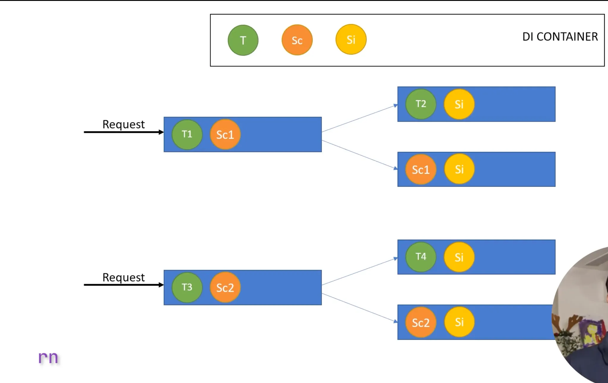

## Middleware

In ASP.NET Core, `Map`, `Use`, and `Run` are all methods that help define middleware components and manage how requests are handled in the pipeline. Each method serves a distinct purpose:

1. **`Use` Middleware**: This is used to add middleware to the pipeline. It processes every request, regardless of its URL path. It does not create conditional branches; the middleware you define will be executed for all incoming requests unless you specifically restrict it.
2. **`Map` Middleware**: This is used to create a conditional branch in the middleware pipeline based on a request’s URL path. It matches a path or a prefix, and within that scope, you can define additional middleware, which will be executed only for requests that match that path.
3. **`Run` Middleware**: This is used to add terminal middleware. Terminal middleware means it ends the request processing, and no subsequent middleware in the pipeline is called. It is often used to handle a request directly, like sending a response.

### 1. **`Use` Middleware:**

- Adds middleware to the pipeline that is executed for **every request**.
- Middleware added via `Use` can either modify the request and response or pass control to the next middleware in the pipeline.

### 2. **`Map` Middleware:**

- Creates a branch in the middleware pipeline based on the request URL.
- It only processes requests that match the provided path prefix. If the path matches, a new pipeline (or branch) is created for that specific route.
- You can chain more middleware inside `Map`, and they will only handle requests that match the path.

### 3. **`Run` Middleware:**

- Adds terminal middleware to the pipeline.
- Once `Run` is called, no further middleware will be executed for the current request.
- It’s typically used to handle requests directly and return a response.

### Example:

Here’s an example demonstrating how to use `Use`, `Map`, and `Run` middleware together in an ASP.NET Core application:

```csharp
csharp
Copy code
public void Configure(IApplicationBuilder app)
{
    // 1. Use middleware for all requests
    app.Use(async (context, next) =>
    {
        // This middleware runs for every request
        Console.WriteLine("Global Middleware: Before Request");
        await next();  // Pass the request to the next middleware
        Console.WriteLine("Global Middleware: After Request");
    });

    // 2. Map middleware for specific path (/admin)
    // When executing this path any middleware below /admin wont be executed
    app.Map("/admin", adminApp =>
    {
        adminApp.Use(async (context, next) =>
        {
            // This middleware runs only for /admin requests
            Console.WriteLine("Admin Middleware: Before Request");
            await next();
            Console.WriteLine("Admin Middleware: After Request");
        });

        adminApp.Run(async context =>
        {
            // This is terminal middleware for the /admin path
            await context.Response.WriteAsync("Welcome to the Admin Area!");
        });
    });

    // 3. Map middleware for another specific path (/api)
    app.Map("/api", apiApp =>
    {
        apiApp.Use(async (context, next) =>
        {
            // This middleware runs only for /api requests
            Console.WriteLine("API Middleware: Before Request");
            await next();
            Console.WriteLine("API Middleware: After Request");
        });

        apiApp.Run(async context =>
        {
            // Terminal middleware for the /api path
            await context.Response.WriteAsync("API Endpoint Reached!");
        });
    });

    // 4. Use middleware for other routes (fallback/default)
    app.Run(async (context) =>
    {
        // This middleware handles all other requests not matching /admin or /api
        await context.Response.WriteAsync("Default Response for Other Routes");
    });
}

```

### Explanation of Each Middleware:

1. **Global Middleware (`Use`)**:
    - The first middleware runs for all requests. It logs the request before and after it is processed by the next middleware.
    - The `next()` method passes control to the next middleware in the pipeline.
2. **Admin Middleware (`Map("/admin")`)**:
    - The `Map` method checks if the request path starts with `/admin`. If it does, it processes the request using the middleware inside the `Map` block.
    - Inside this block, `Use` middleware is applied specifically to the `/admin` path.
    - The `Run` middleware at the end handles requests to `/admin` by returning a response and stopping further processing.
3. **API Middleware (`Map("/api")`)**:
    - Similarly, the `Map("/api")` creates a new branch for requests to `/api`.
    - Inside this block, `Use` middleware logs something before and after processing the request, while `Run` sends a response.
4. **Fallback Middleware (`Run`)**:
    - This `Run` middleware at the end serves as a catch-all for any requests that don’t match `/admin` or `/api`.
    - It sends a default response for any other requests.

### Key Points:

- **`Use`**: Adds middleware for **all** requests.
- **`Map`**: Creates a **branch** in the pipeline based on the request URL (e.g., `/admin` or `/api`).
- **`Run`**: Defines **terminal middleware** that ends the pipeline execution for specific routes, preventing further middleware from being called.

### Use Cases:

- **`Use`**: Use it for general-purpose middleware that should apply to every request, such as logging, authentication, or exception handling.
- **`Map`**: Use it when you want to handle different parts of your application differently, based on the URL path (e.g., API endpoints vs. admin area).
- **`Run`**: Use it when you want to return a response without calling any further middleware (e.g., returning a 404 or a specific message for a given route).

To create a custom `ConsoleLoggerMiddleware` using the `IMiddleware` interface in ASP.NET Core, you'll need to implement the `IMiddleware` interface, which provides a cleaner way to create middleware components by adhering to a specific contract.

The `IMiddleware` interface requires the implementation of the `InvokeAsync` method, which allows you to process requests and responses.

Here’s how you can implement the `ConsoleLoggerMiddleware` using `IMiddleware`:

### Steps:

1. **Create the `ConsoleLoggerMiddleware` class** that implements `IMiddleware`.
2. **Register the middleware** in the dependency injection (DI) container, since `IMiddleware` requires DI to be instantiated.
3. **Use the middleware** in the request pipeline.

### 1. **Create the `ConsoleLoggerMiddleware` Implementing `IMiddleware`**

The `IMiddleware` interface requires that your middleware class implements the `InvokeAsync` method. Here’s how you can do it:

```csharp
csharp
Copy code
public class ConsoleLoggerMiddleware : IMiddleware
{
    // This method handles incoming HTTP requests
    public async Task InvokeAsync(HttpContext context, RequestDelegate next)
    {
        // Log the incoming request details
        Console.WriteLine($"[{DateTime.Now}] Incoming Request: {context.Request.Method} {context.Request.Path}");

        // Call the next middleware in the pipeline
        await next(context);

        // Log the outgoing response details (status code)
        Console.WriteLine($"[{DateTime.Now}] Response sent for: {context.Request.Method} {context.Request.Path} with status code {context.Response.StatusCode}");
    }
}

```

### 2. **Register the Middleware with Dependency Injection**

Since you are using the `IMiddleware` interface, you need to register the `ConsoleLoggerMiddleware` class with the DI container. This is done in the `Program.cs` or `Startup.cs` (depending on your ASP.NET Core version).

### In `Program.cs` (for .NET 6 and later):

```csharp
csharp
Copy code
var builder = WebApplication.CreateBuilder(args);

// Register the ConsoleLoggerMiddleware with DI
builder.Services.AddTransient<ConsoleLoggerMiddleware>();

var app = builder.Build();

// Use the ConsoleLoggerMiddleware in the request pipeline
app.UseMiddleware<ConsoleLoggerMiddleware>();

// Add other middleware
app.MapControllers();

app.Run();

```

### In `Startup.cs` (for .NET Core 5 or earlier):

```csharp
csharp
Copy code
public class Startup
{
    public void ConfigureServices(IServiceCollection services)
    {
        // Register the middleware with DI
        services.AddTransient<ConsoleLoggerMiddleware>();
    }

    public void Configure(IApplicationBuilder app)
    {
        // Use the ConsoleLoggerMiddleware in the request pipeline
        app.UseMiddleware<ConsoleLoggerMiddleware>();

        // Add other middleware like routing and MVC
        app.UseRouting();

        app.UseEndpoints(endpoints =>
        {
            endpoints.MapControllers();
        });
    }
}

```

### 3. **Using the Middleware**

The middleware is now registered with the dependency injection container and the pipeline. When you run the application, it will log request and response details to the console.

### Example of How It Works:

When you make a request to any endpoint, you’ll see logs like the following in the console:

```sql
sql
Copy code
[1/12/2025 10:00:00 AM] Incoming Request: GET /api/values
[1/12/2025 10:00:01 AM] Response sent for: GET /api/values with status code 200

```

### Summary:

- **`IMiddleware` Interface**: By implementing `IMiddleware`, the middleware class can be registered with the DI container, providing a cleaner and more modular way to handle requests.
- **DI Registration**: The middleware must be registered using `AddTransient<ConsoleLoggerMiddleware>()`, which tells ASP.NET Core to use the dependency injection system to create instances of the middleware.
- **Middleware Execution**: In the `InvokeAsync` method, you process requests, call `next(context)` to pass control to the next middleware, and then log the response status code after the request is handled.

This approach allows you to fully leverage dependency injection and modularize your middleware components more effectively.


---



**What is Dependency Injection (DI)?**
--------------------------------------

Dependency Injection (DI) is a **design pattern** used to **inject dependencies into a class rather than creating them inside the class itself**. It promotes **loose coupling, testability, and maintainability** in an application.

DI is a part of **Inversion of Control (IoC)**, where the control of **creating and managing dependencies** is **transferred from the dependent class to an external container** (IoC container).

* * * * *

**Why is Dependency Injection Needed?**
---------------------------------------

Consider a scenario where a class **directly instantiates** another class:

```
public class ProductService
{
    private readonly Logger _logger;

    public ProductService()
    {
        _logger = new Logger(); // Directly creating an instance (Tightly Coupled)
    }
}

```

Problems with this approach: ❌ **Tight Coupling** -- `ProductService` is tightly coupled to `Logger`, making changes difficult.

❌ **Hard to Test** -- Cannot use a mock logger for unit testing.

❌ **Difficult to Manage Dependencies** -- As dependencies grow, managing them becomes harder.

### **Solution: Dependency Injection**

Instead of creating dependencies inside the class, **inject them via constructor**:

```
public class ProductService
{
    private readonly ILogger _logger;

    public ProductService(ILogger logger) // Injecting dependency
    {
        _logger = logger;
    }
}

```

Now, `ProductService` does **not create** `Logger` directly, making it **loosely coupled** and **easier to test**.

* * * * *

**Types of Dependency Injection**
---------------------------------

[ASP.NET](http://ASP.NET) Core supports **three types of Dependency Injection**:

1.  **Constructor Injection** (Most Common)
2.  **Property Injection**
3.  **Method Injection**

* * * * *

**1\. Constructor Injection**
-----------------------------

-   The **dependency is provided via the constructor**.
-   **Most commonly used** because it ensures that the dependency is **always available**.

### **Example**

```
public interface ILogger
{
    void Log(string message);
}

public class ConsoleLogger : ILogger
{
    public void Log(string message)
    {
        Console.WriteLine($"Log: {message}");
    }
}

public class ProductService
{
    private readonly ILogger _logger;

    public ProductService(ILogger logger) // Dependency Injected via Constructor
    {
        _logger = logger;
    }

    public void Process()
    {
        _logger.Log("Processing Order...");
    }
}

```

So in this product services is getting an instance of Console logger as it is implementing the interface ILogger

### **Use Case:**

✅ When a dependency is **mandatory** for the class to function.

✅ Ensures that dependencies **cannot be null** (enforced via constructor).

✅ **Best practice** for injecting dependencies.

* * * * *

**2\. Property Injection**
--------------------------

-   The **dependency is provided via a public property**.
-   Useful when dependency is **optional**.

### **Example**

```
public class ProductService
{
    public ILogger Logger { get; set; }  // Dependency Injected via Property

    public void Process()
    {
        Logger?.Log("Processing Order..."); // Optional Dependency
    }
}

```

### **Use Case:**

✅ When the dependency is **optional** or can be **set later**.

✅ Used in **frameworks** that **autowire properties** (e.g., [ASP.NET](http://ASP.NET) MVC controllers).

❌ **Not recommended** for required dependencies, as it **may not be set**.

* * * * *

**3\. Method Injection**
------------------------

-   The **dependency is provided via a method parameter**.
-   Used when the dependency is **only required in a specific method**.

### **Example**

```
public class ProductService
{
    public void Process(ILogger logger) // Dependency Injected via Method Parameter
    {
        logger.Log("Processing Order...");
    }
}

```

### **Use Case:**

✅ When a dependency is **only needed for a single method**.

✅ Useful for **rarely used dependencies**.

❌ Can lead to **inconsistent state** if not used properly.

* * * * *

**Service Lifetimes in Dependency Injection**
---------------------------------------------

[ASP.NET](http://ASP.NET) Core provides **three service lifetimes** for managing dependencies:

| Lifetime | Description | When to Use? |
| --- | --- | --- |
| **Transient** | A new instance is created every time it is requested. | When the service is **lightweight and stateless**. |
| **Scoped** | A single instance is created **per request** (per HTTP request). | When the service should maintain state **within a request**. |
| **Singleton** | A single instance is created and **shared** throughout the application's lifetime. | When the service should be **global and reused** across requests. |

* * * * *

**1\. Transient (`AddTransient`)**
----------------------------------

-   Creates **a new instance each time** it is requested.
-   **Best for lightweight and stateless services**.

### **Example**

```
builder.Services.AddTransient<IProductService, ProductService>();

```

Each time `IProductService` is requested, a **new instance** of `ProductService` is created.

### **Use Case:**

✅ When the service **does not hold state**.

✅ **Short-lived operations**, such as **utility functions, logging, or calculations**.

❌ Not suitable for **sharing data across requests**.

* * * * *

**2\. Scoped (`AddScoped`)**
----------------------------

-   Creates **one instance per HTTP request**.
-   The instance **remains the same** for the duration of the request.

### **Example**

```
builder.Services.AddScoped<IProductService, ProductService>();

```

If multiple components **within the same request** request `IProductService`, they all get **the same instance**.

### **Use Case:**

✅ Used for **database repositories** (e.g., Entity Framework `DbContext`).

✅ When you need to **maintain state within a request** but **not across requests**.

❌ Not suitable for **sharing data across multiple requests**.

* * * * *

**3\. Singleton (`AddSingleton`)**
----------------------------------

-   **One instance for the entire application lifetime**.
-   **All components share the same instance**.

### **Example**

```
builder.Services.AddSingleton<IProductService, ProductService>();

```

All requests across the application will **share the same instance** of `ProductService`.

### **Use Case:**

✅ **Caching, Configuration, Logging, Services that require expensive initialization**.

✅ When the service should be **shared across multiple requests**.

❌ Not suitable for **storing request-specific or user-specific data**.

* * * * *

**Complete Example in [ASP.NET](http://ASP.NET) Core**
------------------------------------------------------

### **1\. Define Interfaces and Implementations**

```
public interface IProductService
{
    List<string> GetProducts();
}

public class ProductService : IProductService
{
    public List<string> GetProducts()
    {
        return new List<string> { "Laptop", "Smartphone", "Tablet" };
    }
}

```

### **2\. Register Services in `Program.cs`**

```
var builder = WebApplication.CreateBuilder(args);

builder.Services.AddScoped<IProductService, ProductService>();

var app = builder.Build();

```

### **3\. Inject into a Controller**

```
[ApiController]
[Route("api/products")]
public class ProductController : ControllerBase
{
    private readonly IProductService _productService;

    public ProductController(IProductService productService)
    {
        _productService = productService;
    }

    [HttpGet]
    public IActionResult Get()
    {
        var products = _productService.GetProducts();
        return Ok(products);
    }
}

```

* * * * *

**Conclusion**
--------------

-   **Dependency Injection** is a design pattern that helps in **loosely coupling dependencies**.
-   [ASP.NET](http://ASP.NET) Core provides **built-in DI** with **constructor injection, property injection, and method injection**.
-   **Service lifetimes** (`Transient`, `Scoped`, `Singleton`) help manage object creation.

✅ Use **Constructor Injection** for required dependencies.

✅ Use **Property Injection** for optional dependencies.

✅ Use **Method Injection** for dependencies needed **only in specific methods**.

Would you like help implementing DI in a real-world scenario? 🚀

**Understanding Lifetime Scopes in Dependency Injection using GUID**
--------------------------------------------------------------------

To **fully understand how DI lifetimes work**, let's demonstrate them using a **GUID generator**.

Each service **will generate a new GUID** when instantiated, and its behavior will depend on its **lifetime scope**:

✅ **Transient**: Creates a new instance (and GUID) **every time** it is requested.

✅ **Scoped**: Creates a **single instance per request**, but a **new instance for each new request**.

✅ **Singleton**: Creates **one instance for the application's lifetime**, so **the GUID remains the same** throughout.

* * * * *

**Step 1: Define an Interface for GUID Service**
------------------------------------------------

We will define an interface that **exposes a GUID**:

```
public interface IGuidService
{
    Guid GetGuid();
}

```

* * * * *

**Step 2: Implement the Interface for Different Lifetimes**
-----------------------------------------------------------

Each class will generate a **GUID** when instantiated.

### **1️⃣ Transient: New Instance Every Time**

```
public class TransientGuidService : IGuidService
{
    private readonly Guid _guid;

    public TransientGuidService()
    {
        _guid = Guid.NewGuid(); // Generates a new GUID every time
    }

    public Guid GetGuid()
    {
        return _guid;
    }
}

```

### **2️⃣ Scoped: One Instance Per Request**

```
public class ScopedGuidService : IGuidService
{
    private readonly Guid _guid;

    public ScopedGuidService()
    {
        _guid = Guid.NewGuid(); // New GUID for every HTTP request
    }

    public Guid GetGuid()
    {
        return _guid;
    }
}

```

### **3️⃣ Singleton: One Instance for the Whole App**

```
public class SingletonGuidService : IGuidService
{
    private readonly Guid _guid;

    public SingletonGuidService()
    {
        _guid = Guid.NewGuid(); // Created once and reused for all requests
    }

    public Guid GetGuid()
    {
        return _guid;
    }
}

```

* * * * *

**Step 3: Register Services in Dependency Injection (DI)**
----------------------------------------------------------

Inside `Program.cs`, we register the services with their respective lifetimes.

```
var builder = WebApplication.CreateBuilder(args);

builder.Services.AddTransient<IGuidService, TransientGuidService>();
builder.Services.AddScoped<IGuidService, ScopedGuidService>();
builder.Services.AddSingleton<IGuidService, SingletonGuidService>();

var app = builder.Build();

```

* * * * *

**Step 4: Inject Dependencies into a Controller**
-------------------------------------------------

We inject all three **GUID services** into a controller to see how they behave.

```
[ApiController]
[Route("api/guid")]
public class GuidController : ControllerBase
{
    private readonly IGuidService _transientGuid;
    private readonly IGuidService _scopedGuid;
    private readonly IGuidService _singletonGuid;

    public GuidController(
        [FromServices] TransientGuidService transientGuid,
        [FromServices] ScopedGuidService scopedGuid,
        [FromServices] SingletonGuidService singletonGuid)
    {
        _transientGuid = transientGuid;
        _scopedGuid = scopedGuid;
        _singletonGuid = singletonGuid;
    }

    [HttpGet]
    public IActionResult GetGuids()
    {
        return Ok(new
        {
            Transient = _transientGuid.GetGuid(),
            Scoped = _scopedGuid.GetGuid(),
            Singleton = _singletonGuid.GetGuid()
        });
    }
}

```

* * * * *

**Step 5: Understanding the Behavior**
--------------------------------------

Now, let's analyze how GUIDs change based on the lifetime scope.

### **First Request (`GET /api/guid`)**

```
{
    "Transient": "1a2b3c4d-5e6f-7890-1234-56789abcdef0",
    "Scoped": "22334455-6677-8899-aabb-ccddeeff0011",
    "Singleton": "33445566-7788-99aa-bbcc-ddeeff002233"
}

```

-   **Transient**: Always generates a new GUID.
-   **Scoped**: Creates **one GUID for the request**.
-   **Singleton**: Keeps the **same GUID for the application's lifetime**.

### **Second Request (`GET /api/guid`)**

```
{
    "Transient": "99887766-5544-3322-1100-ffeeccddaabb",
    "Scoped": "aa112233-4455-6677-8899-bbccddeeff00",
    "Singleton": "33445566-7788-99aa-bbcc-ddeeff002233"
}

```

-   **Transient** changed again.
-   **Scoped** changed because it's a new request.
-   **Singleton** **remained the same**.

* * * * *

**Summary of Lifetime Scopes**
------------------------------

| Lifetime | GUID Behavior | When to Use? |
| --- | --- | --- |
| **Transient** | New instance (and new GUID) **every time** it is requested | **Stateless services, lightweight objects** |
| **Scoped** | One instance **per HTTP request** | **Database contexts, request-bound services** |
| **Singleton** | One instance **for the whole application** | **Caching, logging, configuration, expensive services** |

* * * * *

**When to Use Each Lifetime?**
------------------------------

| Scenario | Recommended Lifetime |
| --- | --- |
| **Lightweight services** (stateless) | `Transient` |
| **Database repositories (`DbContext`)** | `Scoped` |
| **Caching services** | `Singleton` |
| **Logging services** | `Singleton` |
| **Services that need to maintain user data per request** | `Scoped` |

* * * * *

**Conclusion**
--------------

-   We demonstrated **how DI lifetimes affect service instances** using **GUID generation**.
-   We registered **Transient, Scoped, and Singleton** services.
-   We observed how **each lifetime produces different GUIDs** when requested.

Would you like help implementing this in your project? 🚀

Here's a **class-based dependency injection example** using **Scoped lifetime** in [ASP.NET](http://ASP.NET) Core.

* * * * *

### **1️⃣ Create a Concrete Class (No Interface)**

This class generates a **GUID** when instantiated and keeps it **for the lifetime of a single request**.

```
public class ScopedGuidService
{
    private readonly Guid _guid;

    public ScopedGuidService()
    {
        _guid = Guid.NewGuid();
    }

    public Guid GetGuid()
    {
        return _guid;
    }
}

```

* * * * *

### **2️⃣ Register the Class in Dependency Injection**

Modify `Program.cs` to register the class **without an interface**.

```
var builder = WebApplication.CreateBuilder(args);

builder.Services.AddScoped<ScopedGuidService>(); // Scoped lifetime

var app = builder.Build();

```

* * * * *

### **3️⃣ Inject the Class into a Controller**

Now, inject `ScopedGuidService` **directly** into a controller.

```
[ApiController]
[Route("api/guid")]
public class GuidController : ControllerBase
{
    private readonly ScopedGuidService _scopedGuid;

    public GuidController(ScopedGuidService scopedGuid)
    {
        _scopedGuid = scopedGuid;
    }

    [HttpGet]
    public IActionResult GetGuid()
    {
        return Ok(new
        {
            Scoped = _scopedGuid.GetGuid()
        });
    }
}

```

* * * * *

### **4️⃣ Behavior of Scoped Lifetime**

-   If you **call the API twice within the same request**, the **GUID remains the same**.
-   If you **make a new request**, a **new GUID is generated**.

* * * * *

### **Example Output**

### **First API Call (`GET /api/guid`)**

```
{
    "Scoped": "22334455-6677-8899-aabb-ccddeeff0011"
}

```

### **Second API Call (`GET /api/guid`)**

```
{
    "Scoped": "aa112233-4455-6677-8899-bbccddeeff00"
}

```

✅ **Same GUID within a request**

✅ **New GUID for new requests**

* * * * *

### **When to Use This Approach?**

| Scenario | Class-Based DI? |
| --- | --- |
| **Small projects** (no need for interfaces) | ✅ Yes |
| **Only one implementation is needed** | ✅ Yes |
| **Avoiding unnecessary abstraction** | ✅ Yes |
| **Unit testing or multiple implementations required** | ❌ No, use an interface |

Would you like a **Transient** or **Singleton** version instead? 🚀


---

### **Configurations in [ASP.NET](http://ASP.NET) Core Controllers**

[ASP.NET](http://ASP.NET) Core uses a **configuration system** that allows you to manage settings across different environments (Development, Staging, Production). The configurations are loaded from multiple sources, including **appsettings.json, environment variables, command-line arguments**, and **secrets**.

* * * * *

**1️⃣ Configuration Sources & Precedence**
------------------------------------------

[ASP.NET](http://ASP.NET) Core loads configuration values from **multiple sources in a specific order**. The order of precedence is:

1️⃣ **Command-line arguments**

2️⃣ **Environment variables**

3️⃣ **User secrets (for development only)**

4️⃣ **appsettings.{Environment}.json** (e.g., `appsettings.Development.json`)

5️⃣ **appsettings.json** (Default settings)

6️⃣ **In-memory collection (e.g., `builder.Configuration.AddInMemoryCollection()` for runtime overrides)**

**💡 Higher precedence settings override lower precedence ones.**

For example, an **environment variable** overrides a value from `appsettings.json`.

* * * * *

**2️⃣ How to Use Configuration in a Controller**
------------------------------------------------

First, let's add **appsettings.json** configuration:

### **appsettings.json**

```
{
  "ApplicationSettings": {
    "AppName": "My E-Commerce",
    "Version": "1.0.0"
  }
}

```

Now, **inject** the configuration into a controller:

### **Controller Example**

```
[ApiController]
[Route("api/config")]
public class ConfigController : ControllerBase
{
    private readonly IConfiguration _configuration;

    public ConfigController(IConfiguration configuration)
    {
        _configuration = configuration;
    }

    [HttpGet]
    public IActionResult GetConfig()
    {
        var appName = _configuration["ApplicationSettings:AppName"];
        var version = _configuration["ApplicationSettings:Version"];

        return Ok(new
        {
            AppName = appName,
            Version = version
        });
    }
}

```

### **API Response (`GET /api/config`)**

```
{
  "AppName": "My E-Commerce",
  "Version": "1.0.0"
}

```

* * * * *

**3️⃣ Auto-Reload Configurations (Without Recompiling)**
--------------------------------------------------------

[ASP.NET](http://ASP.NET) Core supports **automatic configuration reload** when `appsettings.json` is modified. This works **without restarting** the application.

### **How to Enable Auto-Reload?**

Modify `Program.cs` like this:

```
var builder = WebApplication.CreateBuilder(args);

// Enable auto-reload
builder.Configuration.AddJsonFile("appsettings.json", optional: false, reloadOnChange: true);

var app = builder.Build();

```

Now, if you update `appsettings.json` while the app is running, the new values are **immediately available** without restarting the application.

* * * * *

**4️⃣ Using Strongly Typed Configuration (Recommended)**
--------------------------------------------------------

Instead of using `_configuration["Key"]`, it's better to bind configuration to **a class**.

### **1️⃣ Create a Strongly Typed Class**

```
public class ApplicationSettings
{
    public string AppName { get; set; }
    public string Version { get; set; }
}

```

### **2️⃣ Bind Configuration in `Program.cs`**

```
builder.Services.Configure<ApplicationSettings>(builder.Configuration.GetSection("ApplicationSettings"));

```

### **3️⃣ Inject into a Controller**

```
public class ConfigController : ControllerBase
{
    private readonly ApplicationSettings _settings;

    public ConfigController(IOptions<ApplicationSettings> options)
    {
        _settings = options.Value;
    }

    [HttpGet]
    public IActionResult GetConfig()
    {
        return Ok(_settings);
    }
}

```

### **Advantages of Strongly Typed Configuration**

✅ **Type safety** (No need for string-based access like `_configuration["AppName"]`)

✅ **Easier to test**

✅ **Auto-reloading still works**

* * * * *

**5️⃣ Environment-Specific Configurations**
-------------------------------------------

[ASP.NET](http://ASP.NET) Core automatically loads `appsettings.{Environment}.json` based on the **ASPNETCORE_ENVIRONMENT** variable.

### **Example**

### **appsettings.Development.json**

```
{
  "ApplicationSettings": {
    "AppName": "My E-Commerce (Dev)",
    "Version": "1.0.0"
  }
}

```

### **Setting the Environment Variable**

On Windows (CMD):

```
set ASPNETCORE_ENVIRONMENT=Development

```

On macOS/Linux (Bash):

```
export ASPNETCORE_ENVIRONMENT=Development

```

💡 If running in **Production**, `appsettings.Production.json` will be loaded instead.

* * * * *

**6️⃣ Other Useful Configuration Sources**
------------------------------------------

### **🛠 Environment Variables**

```
export ApplicationSettings__AppName="My E-Commerce (Env)"

```

💡 Use **`__` (double underscore)** to represent nested keys.

### **🛠 Command-Line Arguments**

```
dotnet run --ApplicationSettings:AppName="My E-Commerce (CLI)"

```

* * * * *

**Conclusion**
--------------

✅ **Precedence:** Command-line args > Environment vars > appsettings.json

✅ **Auto-Reload:** Enabled using `reloadOnChange: true`

✅ **Strongly Typed Binding:** Use `Configure<T>` for cleaner code

✅ **Environment-Specific Configs:** `appsettings.{Environment}.json`

Would you like an example for **secrets management** or **Azure App Configuration**? 🚀

### **When Are Configurations Used in [ASP.NET](http://ASP.NET) Core?**

Configurations in [ASP.NET](http://ASP.NET) Core are used **whenever you need to manage application settings dynamically**. They allow you to separate **hardcoded values** from your code, making the app **more flexible, maintainable, and secure**.

* * * * *

**1️⃣ Common Use Cases for Configurations**
-------------------------------------------

Here are key scenarios where configurations are used:

### **1\. Application Settings (General Configurations)**

Use configurations to store application-level settings like app name, version, and API keys.

✅ **Example** (appsettings.json):

```
{
  "ApplicationSettings": {
    "AppName": "E-Commerce App",
    "Version": "2.0.1"
  }
}

```

✅ **Usage in Controller:**

```
var appName = _configuration["ApplicationSettings:AppName"];

```

* * * * *

### **2\. Connection Strings (Database Configurations)**

Instead of hardcoding database connection strings, store them in configurations.

✅ **Example** (appsettings.json):

```
{
  "ConnectionStrings": {
    "DefaultConnection": "Server=myserver;Database=mydb;User Id=myuser;Password=mypassword;"
  }
}

```

✅ **Usage in `Program.cs` for Dependency Injection:**

```
var connectionString = builder.Configuration.GetConnectionString("DefaultConnection");
builder.Services.AddDbContext<AppDbContext>(options =>
    options.UseSqlServer(connectionString));

```

* * * * *

### **3\. Authentication & Authorization Settings**

Configurations help in managing authentication providers like JWT, OAuth, and API Keys.

✅ **Example** (appsettings.json):

```
{
  "JwtSettings": {
    "Issuer": "<https://myapp.com>",
    "Audience": "<https://myapp.com>",
    "SecretKey": "myverysecuresecretkey"
  }
}

```

✅ **Usage in `Program.cs`:**

```
builder.Services.Configure<JwtSettings>(builder.Configuration.GetSection("JwtSettings"));

```

* * * * *

### **4\. Logging & Monitoring Configuration**

Configure different logging levels for Development, Staging, and Production environments.

✅ **Example** (appsettings.json):

```
{
  "Logging": {
    "LogLevel": {
      "Default": "Warning",
      "Microsoft": "Information"
    }
  }
}

```

✅ **Usage in `Program.cs`:**

```
builder.Logging.AddConfiguration(builder.Configuration.GetSection("Logging"));

```

* * * * *

### **5\. Feature Flags (Toggling Features)**

You can control feature availability without redeploying the application.

✅ **Example** (appsettings.json):

```
{
  "FeatureFlags": {
    "EnableNewCheckout": true
  }
}

```

✅ **Usage in a Controller:**

```
bool isFeatureEnabled = _configuration.GetValue<bool>("FeatureFlags:EnableNewCheckout");
if (isFeatureEnabled)
{
    // Execute new checkout process
}

```

* * * * *

### **6\. External API Keys & Secrets (Secure Configurations)**

Store API keys, third-party credentials, and other sensitive data securely.

✅ **Example** (appsettings.json):

```
{
  "ExternalServices": {
    "StripeApiKey": "sk_live_123456",
    "SendGridApiKey": "SG.xxxxxx"
  }
}

```

✅ **Usage in a Service:**

```
string stripeApiKey = _configuration["ExternalServices:StripeApiKey"];

```

💡 **Best Practice:** Use **environment variables** or **Azure Key Vault** instead of storing secrets in JSON.

* * * * *

### **7\. Email & Notification Configurations**

You can configure SMTP settings or notification services dynamically.

✅ **Example** (appsettings.json):

```
{
  "EmailSettings": {
    "SmtpServer": "smtp.example.com",
    "Port": 587,
    "SenderEmail": "noreply@example.com"
  }
}

```

✅ **Usage in a Service:**

```
var smtpServer = _configuration["EmailSettings:SmtpServer"];

```

* * * * *

### **8\. Caching & Performance Optimization**

Control caching policies and expiration durations via configuration.

✅ **Example** (appsettings.json):

```
{
  "CacheSettings": {
    "ExpirationInMinutes": 10
  }
}

```

✅ **Usage in a Service:**

```
int cacheExpiration = _configuration.GetValue<int>("CacheSettings:ExpirationInMinutes");

```

* * * * *

**2️⃣ Benefits of Using Configurations**
----------------------------------------

✅ **Separation of concerns** -- Keep configurations out of your codebase.

✅ **Flexibility** -- Modify settings without redeploying the app.

✅ **Security** -- Store secrets securely using **environment variables** or **Azure Key Vault**.

✅ **Environment-specific settings** -- Load different configurations for **Development, Staging, and Production**.

✅ **Automatic reload** -- Supports runtime updates without restarting the application.

* * * * *

**3️⃣ Summary**
---------------

🔹 **Configurations** are used whenever we need to manage dynamic settings like **database connections, authentication, API keys, feature flags, caching, and logging**.

🔹 **Precedence:** Command-line args > Environment Variables > appsettings.json

🔹 **Auto-reload:** Enabled using `reloadOnChange: true`

🔹 **Best practice:** Use **strongly typed classes** for better maintainability.

Would you like an example of **environment-based configuration overrides** or **secrets management**? 🚀

---

**Logging in .NET Core**
========================

Logging in **.NET Core** is built-in and can be extended using different **logging providers** (Console, File, Database, Cloud, etc.). It helps developers **track application behavior, debug issues, and analyze performance**.

* * * * *

**1️⃣ Adding Logging in .NET Core**
-----------------------------------

Logging is configured in `Program.cs` using **dependency injection**.

✅ **Basic Logging Setup (Console Logging)**

```
var builder = WebApplication.CreateBuilder(args);

// Add logging
builder.Logging.ClearProviders(); // Clears default providers
builder.Logging.AddConsole(); // Adds Console Logging

var app = builder.Build();
app.MapGet("/", () => "Hello World!");
app.Run();

```

🔹 This setup enables basic console logging.

* * * * *

**2️⃣ Different Logging Providers in .NET Core**
------------------------------------------------

.NET Core supports multiple logging providers:

| **Provider** | **Usage** |
| --- | --- |
| `AddConsole()` | Logs to the console (default) |
| `AddDebug()` | Logs to the debug window (useful in development) |
| `AddEventLog()` | Logs to Windows Event Log (Windows only) |
| `AddEventSourceLogger()` | Logs to Event Tracing for Windows (ETW) |
| `AddFile()` (via Serilog) | Logs to a file |
| `AddSeq()` (via Seq) | Logs to Seq server |
| `AddApplicationInsights()` | Logs to Azure Application Insights |

* * * * *

**3️⃣ Example: Logging to a File (Using Serilog)**
--------------------------------------------------

### **Step 1: Install Serilog Packages**

```
dotnet add package Serilog
dotnet add package Serilog.AspNetCore
dotnet add package Serilog.Sinks.File

```

### **Step 2: Configure Serilog in `Program.cs`**

```
using Serilog;

var builder = WebApplication.CreateBuilder(args);

// Configure Serilog
Log.Logger = new LoggerConfiguration()
    .WriteTo.Console() // Logs to console
    .WriteTo.File("logs/log.txt", rollingInterval: RollingInterval.Day) // Logs to file
    .CreateLogger();

// Add Serilog as the logging provider
builder.Host.UseSerilog();

var app = builder.Build();
app.MapGet("/", () => "Hello World!");
app.Run();

```

📌 **What This Does:**

-   Logs messages to **console** and **file (`logs/log.txt`)**.
-   **Rolling logs** (new log file created daily).
-   **Serilog** replaces the built-in logging.

* * * * *

**4️⃣ Logging Levels in .NET Core**
-----------------------------------

Logging levels control **message severity**:

| **Level** | **Purpose** |
| --- | --- |
| `Trace` | Most detailed logs (debugging low-level issues). |
| `Debug` | Used for debugging during development. |
| `Information` | General app flow details. |
| `Warning` | Indicates potential issues. |
| `Error` | App errors that can be recovered. |
| `Critical` | Severe failures (e.g., database crash). |
| `None` | Disables logging. |

### **Example: Logging with Different Levels**

```
public class SampleService
{
    private readonly ILogger<SampleService> _logger;

    public SampleService(ILogger<SampleService> logger)
    {
        _logger = logger;
    }

    public void Process()
    {
        _logger.LogTrace("This is a Trace log (low-level debugging).");
        _logger.LogDebug("This is a Debug log.");
        _logger.LogInformation("This is an Information log.");
        _logger.LogWarning("This is a Warning log.");
        _logger.LogError("This is an Error log.");
        _logger.LogCritical("This is a Critical error log!");
    }
}

```

📌 **Usage in `Program.cs`:**

```
var builder = WebApplication.CreateBuilder(args);
builder.Services.AddTransient<SampleService>();

var app = builder.Build();

var sampleService = app.Services.GetRequiredService<SampleService>();
sampleService.Process();

app.Run();

```

* * * * *

**5️⃣ Controlling Logging Levels in `appsettings.json`**
--------------------------------------------------------

Instead of hardcoding, configure logging levels dynamically:

✅ **Example `appsettings.json`:**

```
{
  "Logging": {
    "LogLevel": {
      "Default": "Information",
      "Microsoft": "Warning",
      "System": "Error"
    }
  }
}

```

🔹 **How it works:**

-   By default, only **Information** and above logs are captured.
-   `Microsoft` logs only **Warning** and above.
-   `System` logs only **Error** and above.

* * * * *

**6️⃣ Summary**
---------------

🔹 **Logging Providers**: Console, File (Serilog), Database, Cloud.

🔹 **Logging Levels**: `Trace → Debug → Information → Warning → Error → Critical`.

🔹 **Logging to File**: Use **Serilog** for better control.

🔹 **Dynamic Logging Levels**: Configurable via **`appsettings.json`**.

🔹 **Best Practice**: Use `ILogger<T>` for dependency injection.

Would you like an example of logging **to a database or a cloud service**? 🚀

### **Dynamic Logging in .NET**

**Dynamic logging** allows you to **change logging levels at runtime** without restarting or recompiling the application. This helps in **debugging production issues** by increasing log verbosity only when needed.

* * * * *

**1️⃣ How Dynamic Logging Works**
---------------------------------

-   Logging levels are typically set in `appsettings.json`.
-   **Built-in Configuration Reloading** in .NET Core automatically updates logging settings when `appsettings.json` is modified.
-   No need to restart the application---changes take effect **immediately**.

* * * * *

**2️⃣ Example: Dynamic Logging Using `appsettings.json`**
---------------------------------------------------------

### **Step 1: Configure `appsettings.json`**

```
{
  "Logging": {
    "LogLevel": {
      "Default": "Information",
      "Microsoft": "Warning",
      "MyAppNamespace": "Debug"
    }
  }
}

```

-   **`Default: Information`** → Logs `Information` and higher messages.
-   **`Microsoft: Warning`** → Suppresses lower-level logs from Microsoft components.
-   **`MyAppNamespace: Debug`** → Enables detailed logs for a specific namespace.

* * * * *

### **Step 2: Ensure Configuration Reloads Automatically**

Modify `Program.cs` to use **configuration-based logging**:

```
var builder = WebApplication.CreateBuilder(args);

// Enable configuration-based logging
builder.Logging.ClearProviders();
builder.Logging.AddConsole();
builder.Services.Configure<LoggerFilterOptions>(options => options.MinLevel = LogLevel.Information);

var app = builder.Build();
app.Run();

```

✅ **How This Works:**

-   **Logging configuration is read from `appsettings.json`**.
-   **Changes take effect immediately**---no restart needed.

* * * * *

**3️⃣ Testing Dynamic Logging**
-------------------------------

1.  **Run the application.**
2.  **Modify `appsettings.json`**:
    -   Change `"Default": "Information"` → `"Default": "Trace"`
3.  **Save the file** (No restart needed).
4.  **Now, more detailed logs (Trace, Debug) will appear** in the console.

* * * * *

**4️⃣ Using `ILogger` for Dynamic Logging**
-------------------------------------------

Example **service using logging**:

```
public class SampleService
{
    private readonly ILogger<SampleService> _logger;

    public SampleService(ILogger<SampleService> logger)
    {
        _logger = logger;
    }

    public void Process()
    {
        _logger.LogTrace("This is a Trace log (lowest level).");
        _logger.LogDebug("This is a Debug log.");
        _logger.LogInformation("This is an Information log.");
        _logger.LogWarning("This is a Warning log.");
        _logger.LogError("This is an Error log.");
        _logger.LogCritical("This is a Critical log!");
    }
}

```

✅ **Dynamic logging ensures** you see only the logs **relevant at a given time**.

* * * * *

**5️⃣ When to Use Dynamic Logging**
-----------------------------------

🔹 **Production Debugging** -- Increase logging level temporarily to investigate issues.

🔹 **Performance Optimization** -- Avoid unnecessary logging in high-traffic apps.

🔹 **Security** -- Prevent sensitive information from being logged unless needed.

Would you like an example with **Serilog dynamic logging**? 🚀


**Routing, Controllers, and Route Constraints in [ASP.NET](http://ASP.NET) Core**
=================================================================================

In [ASP.NET](http://ASP.NET) Core, **routing** is the process of mapping **incoming HTTP requests** to **controller actions**. This ensures that different URLs correctly invoke the appropriate logic in your application.

* * * * *

**1️⃣ Routing in [ASP.NET](http://ASP.NET) Core**
=================================================

Routing determines **which action method in a controller should handle a request**.

### **Types of Routing:**

1.  **Convention-Based Routing** (Used in MVC apps)
2.  **Attribute-Based Routing** (More flexible and commonly used)
3.  **Endpoint Routing** (Used in minimal APIs and middleware)

* * * * *

**2️⃣ Controllers in [ASP.NET](http://ASP.NET) Core**
-----------------------------------------------------

Controllers handle requests and return responses.

They contain **action methods** that execute business logic.

### **Example: Basic Controller**

```
[Route("api/products")] // Base route
[ApiController] // Enables automatic validation
public class ProductsController : ControllerBase
{
    [HttpGet] // Handles GET requests
    public IActionResult GetProducts()
    {
        var products = new List<string> { "Laptop", "Phone", "Tablet" };
        return Ok(products); // Returns 200 OK with data
    }

    [HttpGet("{id}")] // Handles GET requests with ID
    public IActionResult GetProductById(int id)
    {
        if (id <= 0) return BadRequest("Invalid ID");
        return Ok($"Product {id}");
    }
}

```

✅ **Key Points:**

-   `[Route("api/products")]` → Base route for all actions.
-   `[HttpGet("{id}")]` → Dynamically extracts `{id}` from URL.
-   `Ok()` → Returns **HTTP 200 OK** response.

* * * * *

**3️⃣ Route Constraints in [ASP.NET](http://ASP.NET) Core**
===========================================================

Route constraints restrict values passed in **route parameters**.

### **Common Constraints**

| **Constraint** | **Description** | **Example** |
| --- | --- | --- |
| `int` | Only integers allowed | `{id:int}` |
| `guid` | Only GUID allowed | `{userId:guid}` |
| `alpha` | Only alphabets allowed | `{name:alpha}` |
| `min(x)` | Minimum value allowed | `{age:min(18)}` |
| `max(x)` | Maximum value allowed | `{age:max(100)}` |
| `length(x,y)` | Length range allowed | `{name:length(3,10)}` |
| `regex(pattern)` | Matches regex pattern | `{code:regex(^[A-Za-z]{3}$)}` |

* * * * *

**4️⃣ Example: Using Route Constraints**
----------------------------------------

```
[Route("api/orders")]
[ApiController]
public class OrdersController : ControllerBase
{
    // Only allows integer IDs
    [HttpGet("{id:int}")]
    public IActionResult GetOrder(int id)
    {
        return Ok($"Order {id}");
    }

    // Only allows GUIDs
    [HttpGet("user/{userId:guid}")]
    public IActionResult GetOrdersByUser(Guid userId)
    {
        return Ok($"Orders for User {userId}");
    }

    // Name must be 3 to 10 characters long
    [HttpGet("customer/{name:length(3,10)}")]
    public IActionResult GetCustomerOrders(string name)
    {
        return Ok($"Orders for {name}");
    }
}

```

✅ **How It Works:**

-   `GET /api/orders/5` → **Valid (Integer ID)**
-   `GET /api/orders/test` → **Invalid (Not an integer)**
-   `GET /api/orders/user/550e8400-e29b-41d4-a716-446655440000` → **Valid GUID**
-   `GET /api/orders/customer/Alex` → **Valid (Name length 3-10 characters)**

* * * * *

**5️⃣ Convention-Based Routing (Older Method)**
-----------------------------------------------

Convention-based routing is defined in `Program.cs`.

```
app.UseEndpoints(endpoints =>
{
    endpoints.MapControllerRoute(
        name: "default",
        pattern: "{controller=Home}/{action=Index}/{id?}");
});

```

🔹 **Example Requests:**

-   `/` → Calls `HomeController.Index()`
-   `/products/details/3` → Calls `ProductsController.Details(3)`

* * * * *

**6️⃣ Attribute Routing (Recommended)**
---------------------------------------

Attribute routing is more flexible and **preferred**.

```
[Route("api/users")]
[ApiController]
public class UsersController : ControllerBase
{
    [HttpGet] // Matches "api/users"
    public IActionResult GetUsers() => Ok("All Users");

    [HttpGet("{id:int}")] // Matches "api/users/5"
    public IActionResult GetUserById(int id) => Ok($"User {id}");
}

```

### **Mixing Routes**

```
[Route("api/accounts")]
[ApiController]
public class AccountsController : ControllerBase
{
    [HttpGet("details/{id:int:min(1)}")] // Matches "api/accounts/details/1"
    public IActionResult GetAccount(int id) => Ok($"Account {id}");
}

```

* * * * *

**7️⃣ Custom Route Constraints**
--------------------------------

You can create **custom constraints** if built-in ones don't fit.

### **Example: Custom Constraint for Even Numbers**

```
public class EvenNumberConstraint : IRouteConstraint
{
    public bool Match(HttpContext? httpContext, IRouter? route, string routeKey, RouteValueDictionary values, RouteDirection routeDirection)
    {
        if (values.TryGetValue(routeKey, out var value) && int.TryParse(value?.ToString(), out int number))
        {
            return number % 2 == 0;
        }
        return false;
    }
}

```

### **Register Constraint in `Program.cs`**

```
builder.Services.Configure<RouteOptions>(options =>
{
    options.ConstraintMap.Add("even", typeof(EvenNumberConstraint));
});

```

### **Use the Custom Constraint in a Controller**

```
[HttpGet("get/{id:even}")]
public IActionResult GetEvenNumber(int id)
{
    return Ok($"Even number: {id}");
}

```

✅ **Valid:** `GET /api/get/4`

❌ **Invalid:** `GET /api/get/3`

* * * * *

**🔹 Summary**
==============

### **📌 Routing**

-   **Convention-based routing**: Defined in `Program.cs`, follows a pattern.
-   **Attribute routing**: More flexible, defines routes at the controller/action level.

### **📌 Controllers**

-   Contain action methods handling HTTP requests (`GET`, `POST`, etc.).
-   `[ApiController]` improves API behavior.

### **📌 Route Constraints**

-   Restrict parameter types (`int`, `guid`, `length`, `regex`).
-   Improve **security & correctness**.

### **📌 Custom Constraints**

-   Extend routing with custom validation (e.g., even numbers).

Would you like a **deep dive into custom constraints** or **complex routing setups**? 🚀

### **Model Binding in [ASP.NET](http://ASP.NET) Core**

**Model binding** in [ASP.NET](http://ASP.NET) Core is the process of **binding HTTP request data** (from query strings, form data, route data, or headers) to **method parameters or model properties** in your controllers. It automates the process of converting HTTP request data into strongly typed objects, simplifying data retrieval from requests.

* * * * *

### **How Model Binding Works**

When a request is made to your API or MVC controller, **[ASP.NET](http://ASP.NET) Core** looks for the incoming data in various sources such as:

-   **Query string** (e.g., `?id=1&name=product`)
-   **Route data** (e.g., `api/products/{id}`)
-   **Form data** (e.g., `application/x-www-form-urlencoded` or `multipart/form-data`)
-   **Headers** (e.g., custom headers)
-   **Body** (e.g., JSON or XML in `POST` or `PUT` requests)

[ASP.NET](http://ASP.NET) Core **automatically maps** the data from these sources to the corresponding action parameters or model properties based on their names.

* * * * *

### **1️⃣ Basic Example of Model Binding**

Let's assume you have the following model:

```
public class Product
{
    public int Id { get; set; }
    public string Name { get; set; }
    public decimal Price { get; set; }
}

```

Now, you can use model binding in your controller:

```
[Route("api/products")]
[ApiController]
public class ProductsController : ControllerBase
{
    // Model binding from the request body (POST or PUT request)
    [HttpPost]
    public IActionResult CreateProduct([FromBody] Product product)
    {
        // ASP.NET Core binds the incoming JSON request body to the Product object
        return Ok(product);
    }
}

```

### **Example Request:**

```
POST /api/products
{
    "id": 1,
    "name": "Laptop",
    "price": 1000.00
}

```

**Result:**

[ASP.NET](http://ASP.NET) Core will automatically map the JSON properties (`id`, `name`, `price`) to the `Product` object's properties and pass it to the `CreateProduct` method.

* * * * *

### **2️⃣ Binding from Different Sources**

[ASP.NET](http://ASP.NET) Core can bind model data from different places in the HTTP request:

-   **From Route Parameters:**

    If you use route parameters, [ASP.NET](http://ASP.NET) Core will map them to method parameters.

    **Example:**

    ```
    [HttpGet("{id}")]
    public IActionResult GetProductById(int id)
    {
        return Ok($"Product ID: {id}");
    }

    ```

    **Request:** `GET /api/products/5`

    [ASP.NET](http://ASP.NET) Core will bind `5` to the `id` parameter.

-   **From Query String Parameters:**

    For query strings, you can use the `[FromQuery]` attribute to specify binding.

    **Example:**

    ```
    [HttpGet]
    public IActionResult GetProductByQuery([FromQuery] int id)
    {
        return Ok($"Product ID: {id}");
    }

    ```

    **Request:** `GET /api/products?id=5`

    [ASP.NET](http://ASP.NET) Core binds `id=5` to the `id` parameter.

-   **From Form Data:**

    For form submissions, you can bind to a model using `[FromForm]`.

    **Example:**

    ```
    [HttpPost]
    public IActionResult CreateProduct([FromForm] Product product)
    {
        return Ok(product);
    }

    ```

    **Request:**

    ```
    <form method="post" action="/api/products">
        <input type="text" name="Name" />
        <input type="number" name="Price" />
        <input type="submit" value="Submit" />
    </form>

    ```

    [ASP.NET](http://ASP.NET) Core binds the form values to the `Product` object.

-   **From Header:**

    You can also bind data from request headers.

    **Example:**

    ```
    [HttpGet]
    public IActionResult GetProduct([FromHeader] string userAgent)
    {
        return Ok($"User Agent: {userAgent}");
    }

    ```

* * * * *

### **3️⃣ Customizing Model Binding**

You can customize model binding in several ways:

### **Custom Model Binder**

If you need custom binding logic, you can create a **custom model binder**. This is useful when the incoming data format doesn't match the expected model directly.

**Example:**

```
public class CustomDateBinder : IModelBinder
{
    public Task BindModelAsync(ModelBindingContext bindingContext)
    {
        var value = bindingContext.ValueProvider.GetValue("date").FirstValue;

        if (DateTime.TryParse(value, out DateTime date))
        {
            bindingContext.Result = ModelBindingResult.Success(date);
        }
        else
        {
            bindingContext.Result = ModelBindingResult.Failed();
        }

        return Task.CompletedTask;
    }
}

```

Now, you can use this custom binder in your model:

```
public class Event
{
    [ModelBinder(BinderType = typeof(CustomDateBinder))]
    public DateTime EventDate { get; set; }
}

```

* * * * *

### **4️⃣ Model Binding Validation**

[ASP.NET](http://ASP.NET) Core **automatically validates** model data during binding if you use the `[ApiController]` attribute or manually call `ModelState.IsValid`.

**Example:**

```
[HttpPost]
public IActionResult CreateProduct([FromBody] Product product)
{
    if (!ModelState.IsValid)
    {
        return BadRequest(ModelState);
    }
    return Ok(product);
}

```

If `Product` has validation attributes like `[Required]` or `[Range]`, [ASP.NET](http://ASP.NET) Core checks for those during model binding and adds errors to `ModelState`.

### **Example Model with Validation:**

```
public class Product
{
    [Required]
    public int Id { get; set; }

    [Required]
    [StringLength(100, MinimumLength = 3)]
    public string Name { get; set; }

    [Range(0, 10000)]
    public decimal Price { get; set; }
}

```

### **5️⃣ Using Complex Objects in Model Binding**

You can bind complex objects and collections as well. [ASP.NET](http://ASP.NET) Core handles **nested models** and **collections** seamlessly.

**Example:**

```
public class Order
{
    public int OrderId { get; set; }
    public List<Product> Products { get; set; }
}

```

```
[HttpPost]
public IActionResult CreateOrder([FromBody] Order order)
{
    return Ok(order);
}

```

* * * * *

### **Summary**

-   **Model Binding** simplifies data handling by automatically mapping HTTP request data to method parameters or model properties.
-   It supports binding from **route data**, **query strings**, **form data**, **headers**, and **request body**.
-   You can **validate** and **customize** model binding through **validation attributes** and **custom model binders**.
-   [ASP.NET](http://ASP.NET) Core automatically validates models when using `[ApiController]`.

* * * * *
## Modal Validations & Fluent Validation

**Model Validation in [ASP.NET](http://ASP.NET) Core**
------------------------------------------------------

### **What is Model Validation?**

Model validation in [ASP.NET](http://ASP.NET) Core ensures that incoming request data conforms to expected rules before processing. It works alongside **model binding** to enforce constraints like required fields, valid formats, and value ranges.

[ASP.NET](http://ASP.NET) Core **automatically** validates model data when using `[ApiController]`. If validation fails, the framework returns a `400 Bad Request` response with validation error details.

* * * * *

**1️⃣ How Model Validation Works**
----------------------------------

When a request is sent to an API or MVC controller, [ASP.NET](http://ASP.NET) Core:

1.  **Binds the request data** to the model (model binding).
2.  **Validates the model** based on attributes.
3.  **Populates `ModelState`** with validation errors if any.
4.  **Returns a `400 Bad Request`** response if `[ApiController]` is used and validation fails.

* * * * *

**2️⃣ Basic Example of Model Validation**
-----------------------------------------

### **Model with Validation Attributes**

[ASP.NET](http://ASP.NET) Core uses **data annotations** to enforce validation rules.

```
public class Product
{
    [Required]  // Field must have a value
    public int Id { get; set; }

    [Required(ErrorMessage = "Name is required")]
    [StringLength(100, MinimumLength = 3, ErrorMessage = "Name must be between 3 and 100 characters")]
    public string Name { get; set; }

    [Range(0.01, 10000, ErrorMessage = "Price must be between 0.01 and 10,000")]
    public decimal Price { get; set; }
}

```

### **Controller with Model Validation**

```
[Route("api/products")]
[ApiController]
public class ProductsController : ControllerBase
{
    [HttpPost]
    public IActionResult CreateProduct([FromBody] Product product)
    {
        if (!ModelState.IsValid)
        {
            return BadRequest(ModelState); // Returns validation errors
        }

        return Ok(product);
    }
}

```

### **Example Request**

### ✅ **Valid Request**

```
POST /api/products
{
    "id": 1,
    "name": "Laptop",
    "price": 999.99
}

```

**Response:** `200 OK`

### ❌ **Invalid Request (Missing Name)**

```
POST /api/products
{
    "id": 1,
    "price": 999.99
}

```

**Response:** `400 Bad Request`

```
{
    "Name": ["Name is required"]
}

```

* * * * *

**3️⃣ Common Validation Attributes**
------------------------------------

[ASP.NET](http://ASP.NET) Core provides several built-in validation attributes:

| Attribute | Description | Example |
| --- | --- | --- |
| `[Required]` | Field cannot be null/empty | `[Required] public string Name { get; set; }` |
| `[StringLength]` | Limits string length | `[StringLength(50)]` |
| `[MinLength]` / `[MaxLength]` | Min/Max characters allowed | `[MinLength(3)]` |
| `[Range]` | Limits numeric values | `[Range(1, 100)]` |
| `[RegularExpression]` | Enforces regex patterns | `[RegularExpression(@"\\d{3}-\\d{2}-\\d{4}")]` |
| `[EmailAddress]` | Ensures valid email | `[EmailAddress]` |
| `[Phone]` | Ensures valid phone number | `[Phone]` |
| `[Compare]` | Compares two properties | `[Compare("Password")]` |

* * * * *

**4️⃣ Custom Validation Attributes**
------------------------------------

If built-in attributes aren't enough, you can create **custom validation attributes**.

### **Example: Custom Validation for Price**

```
public class PriceValidationAttribute : ValidationAttribute
{
    protected override ValidationResult IsValid(object value, ValidationContext validationContext)
    {
        if (value is decimal price && price < 0)
        {
            return new ValidationResult("Price cannot be negative");
        }
        return ValidationResult.Success;
    }
}

```

### **Apply Custom Attribute to Model**

```
public class Product
{
    [PriceValidation]
    public decimal Price { get; set; }
}

```

* * * * *

**5️⃣ Fluent Validation (Alternative to Data Annotations)**
-----------------------------------------------------------

Instead of attributes, **FluentValidation** provides a more flexible way to validate models.

### **Step 1: Install FluentValidation**

Run:

```
dotnet add package FluentValidation.AspNetCore

```

### **Step 2: Create a Validator**

```
using FluentValidation;

public class ProductValidator : AbstractValidator<Product>
{
    public ProductValidator()
    {
        RuleFor(p => p.Name).NotEmpty().Length(3, 100);
        RuleFor(p => p.Price).GreaterThan(0).WithMessage("Price must be greater than zero");
    }
}

```

### **Step 3: Register FluentValidation in `Program.cs`**

```
builder.Services.AddControllers().AddFluentValidation(fv =>
{
    fv.RegisterValidatorsFromAssemblyContaining<ProductValidator>();
});

```

Now, when an invalid request is sent, FluentValidation automatically handles validation.

* * * * *

**6️⃣ Model Validation and `IValidatableObject`**
-------------------------------------------------

You can also implement `IValidatableObject` for **complex validation** that involves multiple fields.

### **Example: Ensuring Discount is Valid**

```
public class Product : IValidatableObject
{
    public decimal Price { get; set; }
    public decimal Discount { get; set; }

    public IEnumerable<ValidationResult> Validate(ValidationContext validationContext)
    {
        if (Discount > Price)
        {
            yield return new ValidationResult("Discount cannot be greater than Price", new[] { "Discount" });
        }
    }
}

```

* * * * *

**7️⃣ Disabling Automatic Validation**
--------------------------------------

If `[ApiController]` is used, validation happens automatically. To disable it, remove `[ApiController]` or handle validation manually.

Example:

```
[HttpPost]
public IActionResult CreateProduct(Product product)
{
    if (!TryValidateModel(product))
    {
        return BadRequest(ModelState);
    }

    return Ok(product);
}

```

* * * * *

**8️⃣ Summary**
---------------

✅ **Model validation** ensures incoming request data is valid.

✅ **Data annotations** (`[Required]`, `[Range]`, etc.) provide built-in validation.

✅ **Custom validation** can be done using custom attributes or `IValidatableObject`.

✅ **FluentValidation** provides a flexible alternative.

✅ `[ApiController]` automatically handles validation and returns `400 Bad Request`.

* * * * *

**Fluent Validation in [ASP.NET](http://ASP.NET) Core**
=======================================================

**1️⃣ What is Fluent Validation?**
----------------------------------

FluentValidation is a **library** for handling model validation in [ASP.NET](http://ASP.NET) Core. Unlike **data annotations**, it allows you to define validation rules **separately** using a **fluent API**, making the validation logic more readable, testable, and maintainable.

🔹 **Why Use FluentValidation?**

✔ **Separation of Concerns** → Validation rules are separate from models.

✔ **More Flexible** → Supports complex conditions, collections, dependency injection.

✔ **Better Error Messages** → Customizable and more readable.

✔ **Unit Testing Friendly** → Easier to test than data annotations.

* * * * *

**2️⃣ How to Add FluentValidation in [ASP.NET](http://ASP.NET) Core**
---------------------------------------------------------------------

### **Step 1: Install FluentValidation Package**

Run the following command to install the FluentValidation package:

```
dotnet add package FluentValidation.AspNetCore

```

### **Step 2: Create a Model**

Example: **Product Model**

```
public class Product
{
    public string Name { get; set; }
    public decimal Price { get; set; }
    public int Stock { get; set; }
}

```

### **Step 3: Create a Fluent Validator**

Create a separate class to define validation rules.

```
using FluentValidation;

public class ProductValidator : AbstractValidator<Product> // Registers product modal to use
{
    public ProductValidator()
    {
        RuleFor(p => p.Name)
            .NotEmpty().WithMessage("Product Name is required")
            .Length(3, 100).WithMessage("Product Name must be between 3 and 100 characters");

        RuleFor(p => p.Price)
            .GreaterThan(0).WithMessage("Price must be greater than zero");

        RuleFor(p => p.Stock)
            .GreaterThanOrEqualTo(0).WithMessage("Stock cannot be negative");
    }
}

```

### **Step 4: Register FluentValidation in `Program.cs`**

Modify `Program.cs` to register FluentValidation:

```
using FluentValidation;
using FluentValidation.AspNetCore;

var builder = WebApplication.CreateBuilder(args);

// Add controllers and FluentValidation
builder.Services.AddControllers()
    .AddFluentValidation(fv => fv.RegisterValidatorsFromAssemblyContaining<ProductValidator>());

var app = builder.Build();
app.UseAuthorization();
app.MapControllers();
app.Run();

```

### **Step 5: Use Fluent Validation in Controller**

Modify the controller to use model validation:

```
[Route("api/products")]
[ApiController]
public class ProductsController : ControllerBase
{
    [HttpPost]
    public IActionResult CreateProduct([FromBody] Product product)
    {
        if (!ModelState.IsValid)
        {
            return BadRequest(ModelState); // Returns validation errors
        }

        return Ok(product);
    }
}

```

### **Step 6: Send API Requests**

✅ **Valid Request**

```
POST /api/products
{
    "name": "Laptop",
    "price": 999.99,
    "stock": 10
}

```

🟢 Response: `200 OK`

❌ **Invalid Request (Missing Name & Negative Stock)**

```
POST /api/products
{
    "price": 999.99,
    "stock": -5
}

```

🔴 Response: `400 Bad Request`

```
{
    "Name": ["Product Name is required"],
    "Stock": ["Stock cannot be negative"]
}

```

* * * * *

**3️⃣ Fluent Validation Use Cases**
-----------------------------------

### **1️⃣ Complex Conditional Validation**

You can apply rules **only when certain conditions are met**.

🔹 **Example:** Allow `Discount` only if `Price` is above $100.

```
RuleFor(p => p.Discount)
    .GreaterThan(0).When(p => p.Price > 100)
    .WithMessage("Discount is only allowed for products above $100");

```

* * * * *

### **2️⃣ Validating Nested Objects**

FluentValidation can validate **nested models**.

🔹 **Example:** A product has a nested `Category` object.

```
public class Product
{
    public string Name { get; set; }
    public decimal Price { get; set; }
    public Category Category { get; set; }
}

public class Category
{
    public string CategoryName { get; set; }
}

```

### **Validator for Category**

```
public class CategoryValidator : AbstractValidator<Category>
{
    public CategoryValidator()
    {
        RuleFor(c => c.CategoryName)
            .NotEmpty().WithMessage("Category Name is required");
    }
}

```

### **Validator for Product**

```
public class ProductValidator : AbstractValidator<Product>
{
    public ProductValidator()
    {
        RuleFor(p => p.Name).NotEmpty();
        RuleFor(p => p.Price).GreaterThan(0);
        RuleFor(p => p.Category).SetValidator(new CategoryValidator());
    }
}

```

Now, if `CategoryName` is empty, FluentValidation will return a **validation error**.

* * * * *

### **3️⃣ Validating Collections (Lists)**

FluentValidation supports validation on **lists of objects**.

🔹 **Example:** A product has multiple tags.

```
public class Product
{
    public string Name { get; set; }
    public List<string> Tags { get; set; }
}

```

### **Validator for List**

```
RuleForEach(p => p.Tags)
    .NotEmpty().WithMessage("Each tag must have a value");

```

* * * * *

### **4️⃣ Custom Validation Rules**

You can create **custom validation rules** when built-in rules are not enough.

🔹 **Example:** Ensure `Price` is a multiple of 5.

```
RuleFor(p => p.Price)
    .Must(price => price % 5 == 0)
    .WithMessage("Price must be a multiple of 5");

```

* * * * *

### **5️⃣ Using Dependency Injection in Validation**

FluentValidation allows injecting **services** inside validators.

🔹 **Example:** Check if a `Product` already exists in the database.

### **Step 1: Inject Service**

```
public class ProductValidator : AbstractValidator<Product>
{
    private readonly IProductService _productService;

    public ProductValidator(IProductService productService)
    {
        _productService = productService;

        RuleFor(p => p.Name)
            .MustAsync(async (name, cancellation) =>
                !await _productService.ProductExists(name))
            .WithMessage("Product already exists");
    }
}

```

### **Step 2: Register Validator in `Program.cs`**

```
builder.Services.AddScoped<IProductService, ProductService>();
builder.Services.AddScoped<IValidator<Product>, ProductValidator>();

```

Now, FluentValidation will **check the database** before allowing a product to be added.

* * * * *

**4️⃣ Summary**
---------------

✅ FluentValidation provides a **cleaner**, **more flexible** approach than **data annotations**.

✅ It supports **complex conditions**, **nested models**, **collections**, and **dependency injection**.

✅ It **automatically integrates** with [ASP.NET](http://ASP.NET) Core controllers.

✅ It allows **custom validation** logic (e.g., checking the database).

## Modal Validations & Fluent Validation

**Model Validation in [ASP.NET](http://ASP.NET) Core**
------------------------------------------------------

### **What is Model Validation?**

Model validation in [ASP.NET](http://ASP.NET) Core ensures that incoming request data conforms to expected rules before processing. It works alongside **model binding** to enforce constraints like required fields, valid formats, and value ranges.

[ASP.NET](http://ASP.NET) Core **automatically** validates model data when using `[ApiController]`. If validation fails, the framework returns a `400 Bad Request` response with validation error details.

* * * * *

**1️⃣ How Model Validation Works**
----------------------------------

When a request is sent to an API or MVC controller, [ASP.NET](http://ASP.NET) Core:

1.  **Binds the request data** to the model (model binding).
2.  **Validates the model** based on attributes.
3.  **Populates `ModelState`** with validation errors if any.
4.  **Returns a `400 Bad Request`** response if `[ApiController]` is used and validation fails.

* * * * *

**2️⃣ Basic Example of Model Validation**
-----------------------------------------

### **Model with Validation Attributes**

[ASP.NET](http://ASP.NET) Core uses **data annotations** to enforce validation rules.

```
public class Product
{
    [Required]  // Field must have a value
    public int Id { get; set; }

    [Required(ErrorMessage = "Name is required")]
    [StringLength(100, MinimumLength = 3, ErrorMessage = "Name must be between 3 and 100 characters")]
    public string Name { get; set; }

    [Range(0.01, 10000, ErrorMessage = "Price must be between 0.01 and 10,000")]
    public decimal Price { get; set; }
}

```

### **Controller with Model Validation**

```
[Route("api/products")]
[ApiController]
public class ProductsController : ControllerBase
{
    [HttpPost]
    public IActionResult CreateProduct([FromBody] Product product)
    {
        if (!ModelState.IsValid)
        {
            return BadRequest(ModelState); // Returns validation errors
        }

        return Ok(product);
    }
}

```

### **Example Request**

### ✅ **Valid Request**

```
POST /api/products
{
    "id": 1,
    "name": "Laptop",
    "price": 999.99
}

```

**Response:** `200 OK`

### ❌ **Invalid Request (Missing Name)**

```
POST /api/products
{
    "id": 1,
    "price": 999.99
}

```

**Response:** `400 Bad Request`

```
{
    "Name": ["Name is required"]
}

```

* * * * *

**3️⃣ Common Validation Attributes**
------------------------------------

[ASP.NET](http://ASP.NET) Core provides several built-in validation attributes:

| Attribute | Description | Example |
| --- | --- | --- |
| `[Required]` | Field cannot be null/empty | `[Required] public string Name { get; set; }` |
| `[StringLength]` | Limits string length | `[StringLength(50)]` |
| `[MinLength]` / `[MaxLength]` | Min/Max characters allowed | `[MinLength(3)]` |
| `[Range]` | Limits numeric values | `[Range(1, 100)]` |
| `[RegularExpression]` | Enforces regex patterns | `[RegularExpression(@"\\d{3}-\\d{2}-\\d{4}")]` |
| `[EmailAddress]` | Ensures valid email | `[EmailAddress]` |
| `[Phone]` | Ensures valid phone number | `[Phone]` |
| `[Compare]` | Compares two properties | `[Compare("Password")]` |

* * * * *

**4️⃣ Custom Validation Attributes**
------------------------------------

If built-in attributes aren't enough, you can create **custom validation attributes**.

### **Example: Custom Validation for Price**

```
public class PriceValidationAttribute : ValidationAttribute
{
    protected override ValidationResult IsValid(object value, ValidationContext validationContext)
    {
        if (value is decimal price && price < 0)
        {
            return new ValidationResult("Price cannot be negative");
        }
        return ValidationResult.Success;
    }
}

```

### **Apply Custom Attribute to Model**

```
public class Product
{
    [PriceValidation]
    public decimal Price { get; set; }
}

```

* * * * *

**5️⃣ Fluent Validation (Alternative to Data Annotations)**
-----------------------------------------------------------

Instead of attributes, **FluentValidation** provides a more flexible way to validate models.

### **Step 1: Install FluentValidation**

Run:

```
dotnet add package FluentValidation.AspNetCore

```

### **Step 2: Create a Validator**

```
using FluentValidation;

public class ProductValidator : AbstractValidator<Product>
{
    public ProductValidator()
    {
        RuleFor(p => p.Name).NotEmpty().Length(3, 100);
        RuleFor(p => p.Price).GreaterThan(0).WithMessage("Price must be greater than zero");
    }
}

```

### **Step 3: Register FluentValidation in `Program.cs`**

```
builder.Services.AddControllers().AddFluentValidation(fv =>
{
    fv.RegisterValidatorsFromAssemblyContaining<ProductValidator>();
});

```

Now, when an invalid request is sent, FluentValidation automatically handles validation.

* * * * *

**6️⃣ Model Validation and `IValidatableObject`**
-------------------------------------------------

You can also implement `IValidatableObject` for **complex validation** that involves multiple fields.

### **Example: Ensuring Discount is Valid**

```
public class Product : IValidatableObject
{
    public decimal Price { get; set; }
    public decimal Discount { get; set; }

    public IEnumerable<ValidationResult> Validate(ValidationContext validationContext)
    {
        if (Discount > Price)
        {
            yield return new ValidationResult("Discount cannot be greater than Price", new[] { "Discount" });
        }
    }
}

```

* * * * *

**7️⃣ Disabling Automatic Validation**
--------------------------------------

If `[ApiController]` is used, validation happens automatically. To disable it, remove `[ApiController]` or handle validation manually.

Example:

```
[HttpPost]
public IActionResult CreateProduct(Product product)
{
    if (!TryValidateModel(product))
    {
        return BadRequest(ModelState);
    }

    return Ok(product);
}

```

* * * * *

**8️⃣ Summary**
---------------

✅ **Model validation** ensures incoming request data is valid.

✅ **Data annotations** (`[Required]`, `[Range]`, etc.) provide built-in validation.

✅ **Custom validation** can be done using custom attributes or `IValidatableObject`.

✅ **FluentValidation** provides a flexible alternative.

✅ `[ApiController]` automatically handles validation and returns `400 Bad Request`.

* * * * *

**Fluent Validation in [ASP.NET](http://ASP.NET) Core**
=======================================================

**1️⃣ What is Fluent Validation?**
----------------------------------

FluentValidation is a **library** for handling model validation in [ASP.NET](http://ASP.NET) Core. Unlike **data annotations**, it allows you to define validation rules **separately** using a **fluent API**, making the validation logic more readable, testable, and maintainable.

🔹 **Why Use FluentValidation?**

✔ **Separation of Concerns** → Validation rules are separate from models.

✔ **More Flexible** → Supports complex conditions, collections, dependency injection.

✔ **Better Error Messages** → Customizable and more readable.

✔ **Unit Testing Friendly** → Easier to test than data annotations.

* * * * *

**2️⃣ How to Add FluentValidation in [ASP.NET](http://ASP.NET) Core**
---------------------------------------------------------------------

### **Step 1: Install FluentValidation Package**

Run the following command to install the FluentValidation package:

```
dotnet add package FluentValidation.AspNetCore

```

### **Step 2: Create a Model**

Example: **Product Model**

```
public class Product
{
    public string Name { get; set; }
    public decimal Price { get; set; }
    public int Stock { get; set; }
}

```

### **Step 3: Create a Fluent Validator**

Create a separate class to define validation rules.

```
using FluentValidation;

public class ProductValidator : AbstractValidator<Product> // Registers product modal to use
{
    public ProductValidator()
    {
        RuleFor(p => p.Name)
            .NotEmpty().WithMessage("Product Name is required")
            .Length(3, 100).WithMessage("Product Name must be between 3 and 100 characters");

        RuleFor(p => p.Price)
            .GreaterThan(0).WithMessage("Price must be greater than zero");

        RuleFor(p => p.Stock)
            .GreaterThanOrEqualTo(0).WithMessage("Stock cannot be negative");
    }
}

```

### **Step 4: Register FluentValidation in `Program.cs`**

Modify `Program.cs` to register FluentValidation:

```
using FluentValidation;
using FluentValidation.AspNetCore;

var builder = WebApplication.CreateBuilder(args);

// Add controllers and FluentValidation
builder.Services.AddControllers()
    .AddFluentValidation(fv => fv.RegisterValidatorsFromAssemblyContaining<ProductValidator>());

var app = builder.Build();
app.UseAuthorization();
app.MapControllers();
app.Run();

```

### **Step 5: Use Fluent Validation in Controller**

Modify the controller to use model validation:

```
[Route("api/products")]
[ApiController]
public class ProductsController : ControllerBase
{
    [HttpPost]
    public IActionResult CreateProduct([FromBody] Product product)
    {
        if (!ModelState.IsValid)
        {
            return BadRequest(ModelState); // Returns validation errors
        }

        return Ok(product);
    }
}

```

### **Step 6: Send API Requests**

✅ **Valid Request**

```
POST /api/products
{
    "name": "Laptop",
    "price": 999.99,
    "stock": 10
}

```

🟢 Response: `200 OK`

❌ **Invalid Request (Missing Name & Negative Stock)**

```
POST /api/products
{
    "price": 999.99,
    "stock": -5
}

```

🔴 Response: `400 Bad Request`

```
{
    "Name": ["Product Name is required"],
    "Stock": ["Stock cannot be negative"]
}

```

* * * * *

**3️⃣ Fluent Validation Use Cases**
-----------------------------------

### **1️⃣ Complex Conditional Validation**

You can apply rules **only when certain conditions are met**.

🔹 **Example:** Allow `Discount` only if `Price` is above $100.

```
RuleFor(p => p.Discount)
    .GreaterThan(0).When(p => p.Price > 100)
    .WithMessage("Discount is only allowed for products above $100");

```

* * * * *

### **2️⃣ Validating Nested Objects**

FluentValidation can validate **nested models**.

🔹 **Example:** A product has a nested `Category` object.

```
public class Product
{
    public string Name { get; set; }
    public decimal Price { get; set; }
    public Category Category { get; set; }
}

public class Category
{
    public string CategoryName { get; set; }
}

```

### **Validator for Category**

```
public class CategoryValidator : AbstractValidator<Category>
{
    public CategoryValidator()
    {
        RuleFor(c => c.CategoryName)
            .NotEmpty().WithMessage("Category Name is required");
    }
}

```

### **Validator for Product**

```
public class ProductValidator : AbstractValidator<Product>
{
    public ProductValidator()
    {
        RuleFor(p => p.Name).NotEmpty();
        RuleFor(p => p.Price).GreaterThan(0);
        RuleFor(p => p.Category).SetValidator(new CategoryValidator());
    }
}

```

Now, if `CategoryName` is empty, FluentValidation will return a **validation error**.

* * * * *

### **3️⃣ Validating Collections (Lists)**

FluentValidation supports validation on **lists of objects**.

🔹 **Example:** A product has multiple tags.

```
public class Product
{
    public string Name { get; set; }
    public List<string> Tags { get; set; }
}

```

### **Validator for List**

```
RuleForEach(p => p.Tags)
    .NotEmpty().WithMessage("Each tag must have a value");

```

* * * * *

### **4️⃣ Custom Validation Rules**

You can create **custom validation rules** when built-in rules are not enough.

🔹 **Example:** Ensure `Price` is a multiple of 5.

```
RuleFor(p => p.Price)
    .Must(price => price % 5 == 0)
    .WithMessage("Price must be a multiple of 5");

```

* * * * *

### **5️⃣ Using Dependency Injection in Validation**

FluentValidation allows injecting **services** inside validators.

🔹 **Example:** Check if a `Product` already exists in the database.

### **Step 1: Inject Service**

```
public class ProductValidator : AbstractValidator<Product>
{
    private readonly IProductService _productService;

    public ProductValidator(IProductService productService)
    {
        _productService = productService;

        RuleFor(p => p.Name)
            .MustAsync(async (name, cancellation) =>
                !await _productService.ProductExists(name))
            .WithMessage("Product already exists");
    }
}

```

### **Step 2: Register Validator in `Program.cs`**

```
builder.Services.AddScoped<IProductService, ProductService>();
builder.Services.AddScoped<IValidator<Product>, ProductValidator>();

```

Now, FluentValidation will **check the database** before allowing a product to be added.

* * * * *

**4️⃣ Summary**
---------------

✅ FluentValidation provides a **cleaner**, **more flexible** approach than **data annotations**.

✅ It supports **complex conditions**, **nested models**, **collections**, and **dependency injection**.

✅ It **automatically integrates** with [ASP.NET](http://ASP.NET) Core controllers.

✅ It allows **custom validation** logic (e.g., checking the database).

### **SPA Template in [ASP.NET](http://ASP.NET) Core**

[ASP.NET](http://ASP.NET) Core provides a built-in **Single Page Application (SPA) template** to integrate frontend frameworks like **React, Angular, and Vue** with a .NET backend. These templates help developers build full-stack applications using **.NET for APIs and JavaScript frameworks for UI**.

* * * * *

**1️⃣ Installing and Using SPA Templates in .NET**
--------------------------------------------------

To create an SPA project in **[ASP.NET](http://ASP.NET) Core**, use the following command:

### **📌 Angular SPA**

```
dotnet new angular -o MyAngularApp

```

### **📌 React SPA**

```
dotnet new react -o MyReactApp

```

These commands generate an **[ASP.NET](http://ASP.NET) Core backend** with an **Angular or React frontend**, set up with proper configurations.

* * * * *

**2️⃣ Structure of a .NET SPA Project**
---------------------------------------

A generated SPA project has the following structure:

```
MyReactApp/
│── ClientApp/          # Frontend (React/Angular/Vue)
│── Controllers/        # API Controllers (C# Backend)
│── Properties/
│── Startup.cs          # Configures Middleware & Services
│── Program.cs          # Entry point for the app
│── appsettings.json    # Configuration settings
│── MyReactApp.csproj   # Project file

```

🔹 The **ClientApp/** folder contains the **React/Angular app**, managed separately using **Node.js and npm**.

🔹 The **Controllers/** folder holds the **[ASP.NET](http://ASP.NET) Core Web API controllers** for backend operations.

* * * * *

**3️⃣ Configuring SPA in `Startup.cs` ([ASP.NET](http://ASP.NET) Core 6+ in `Program.cs`)**
-------------------------------------------------------------------------------------------

To ensure the SPA is correctly served, update the middleware in `Program.cs`:

```
using Microsoft.AspNetCore.Builder;
using Microsoft.AspNetCore.Hosting;
using Microsoft.Extensions.DependencyInjection;
using Microsoft.Extensions.Hosting;

var builder = WebApplication.CreateBuilder(args);

// Add services to the container.
builder.Services.AddControllersWithViews();
builder.Services.AddSpaStaticFiles(configuration =>
{
    configuration.RootPath = "ClientApp/build"; // React build folder
});

var app = builder.Build();

if (!app.Environment.IsDevelopment())
{
    app.UseSpaStaticFiles();
}

app.UseRouting();

app.UseEndpoints(endpoints =>
{
    endpoints.MapControllers();
});

app.UseSpa(spa =>
{
    spa.Options.SourcePath = "ClientApp";

    if (app.Environment.IsDevelopment())
    {
        spa.UseProxyToSpaDevelopmentServer("<http://localhost:3000>"); // React Dev Server
    }
});

app.Run();

```

### **🔹 Explanation**

-   **`UseSpaStaticFiles()`** → Serves static frontend files (used in production).
-   **`UseSpa()`** → Configures the **SPA middleware** to serve the frontend.
-   **`UseProxyToSpaDevelopmentServer()`** → Ensures **React/Angular's dev server** is used in development.

* * * * *

**4️⃣ Running the .NET SPA Application**
----------------------------------------

### **🔹 Step 1: Restore & Build .NET Backend**

```
dotnet restore
dotnet build

```

### **🔹 Step 2: Install Frontend Dependencies**

```
cd ClientApp
npm install

```

### **🔹 Step 3: Run the Full Application**

```
dotnet run

```

OR

```
cd ClientApp
npm start

```

📌 This starts the **backend** at `https://localhost:5001` and the **React/Angular frontend** at `http://localhost:3000` (or `4200` for Angular).

* * * * *

**5️⃣ When to Use the .NET SPA Template?**
------------------------------------------

✅ **When you need a .NET backend** with a **React/Angular/Vue frontend**.

✅ **When you want a pre-configured setup** to serve the SPA with .NET Core.

✅ **When building full-stack applications** with API + UI together.

* * * * *

**6️⃣ Conclusion**
------------------

The **[ASP.NET](http://ASP.NET) Core SPA template** simplifies the integration of **React, Angular, and Vue** with a .NET backend. It includes **preconfigured middleware**, a **proxy setup for development**, and an **optimized build process** for production.

Would you like a **deployment guide** for a .NET + SPA app? 🚀

**Using `HttpClient` in .NET**
==============================

`HttpClient` is a powerful class in .NET used to **send HTTP requests** and **receive responses** from APIs. It supports **GET, POST, PUT, DELETE**, and other HTTP methods while handling **asynchronous network communication** efficiently.

* * * * *

**1️⃣ Why Use `HttpClient`?**
-----------------------------

✅ **Asynchronous & Non-Blocking** -- Improves performance in web applications.

✅ **Reusability** -- Can be configured globally to prevent unnecessary instantiations.

✅ **Supports Headers & Authentication** -- Easily adds headers like `Authorization`, `Accept`, etc.

✅ **Handles JSON Serialization** -- Works well with `System.Text.Json` or `Newtonsoft.Json`.

* * * * *

**2️⃣ Basic Usage of `HttpClient`**
-----------------------------------

The simplest way to use `HttpClient` is by **creating an instance** and making a request.

### **🔹 Sending a GET Request**

```
using System;
using System.Net.Http;
using System.Threading.Tasks;

class Program
{
    static async Task Main()
    {
        using HttpClient client = new HttpClient();

        string url = "<https://jsonplaceholder.typicode.com/posts/1>";
        HttpResponseMessage response = await client.GetAsync(url);

        if (response.IsSuccessStatusCode)
        {
            string content = await response.Content.ReadAsStringAsync();
            Console.WriteLine(content);
        }
        else
        {
            Console.WriteLine($"Error: {response.StatusCode}");
        }
    }
}

```

### **🔹 Explanation**

-   Creates an `HttpClient` instance.
-   Calls `GetAsync(url)` to fetch data from an API.
-   Reads the response as a string using `ReadAsStringAsync()`.

* * * * *

**3️⃣ Making a POST Request (Sending JSON Data)**
-------------------------------------------------

To send data using **POST**, we must serialize an object into **JSON** and send it in the request body.

```
using System;
using System.Net.Http;
using System.Text;
using System.Text.Json;
using System.Threading.Tasks;

class Program
{
    static async Task Main()
    {
        using HttpClient client = new HttpClient();

        string url = "<https://jsonplaceholder.typicode.com/posts>";

        var postData = new
        {
            title = "Hello World",
            body = "This is a test post.",
            userId = 1
        };

        string json = JsonSerializer.Serialize(postData);
        HttpContent content = new StringContent(json, Encoding.UTF8, "application/json");

        HttpResponseMessage response = await client.PostAsync(url, content);

        if (response.IsSuccessStatusCode)
        {
            string responseContent = await response.Content.ReadAsStringAsync();
            Console.WriteLine(responseContent);
        }
        else
        {
            Console.WriteLine($"Error: {response.StatusCode}");
        }
    }
}

```

### **🔹 Explanation**

-   **Serializes** an object to JSON.
-   Creates an `HttpContent` object with **UTF-8 encoding** and `application/json` content type.
-   Uses `PostAsync()` to send data.

* * * * *

**4️⃣ Using `HttpClientFactory` (Recommended for .NET Core & .NET 6+)**
-----------------------------------------------------------------------

📌 **Why use `HttpClientFactory`?**

🔹 Avoids **socket exhaustion** caused by multiple `HttpClient` instances.

🔹 Manages **connection pooling** and **retries automatically**.

🔹 Supports **dependency injection** in [ASP.NET](http://ASP.NET) Core.

### **🔹 Step 1: Register `HttpClientFactory` in `Program.cs`**

```
var builder = WebApplication.CreateBuilder(args);

builder.Services.AddHttpClient(); // Registers HttpClientFactory

var app = builder.Build();

```

### **🔹 Step 2: Inject and Use `HttpClient` in a Service**

```
using System.Net.Http;
using System.Text.Json;
using System.Threading.Tasks;

public class ApiService
{
    private readonly HttpClient _httpClient;

    public ApiService(HttpClient httpClient)
    {
        _httpClient = httpClient;
    }

    public async Task<string> GetPostAsync()
    {
        var response = await _httpClient.GetAsync("<https://jsonplaceholder.typicode.com/posts/1>");

        if (response.IsSuccessStatusCode)
        {
            return await response.Content.ReadAsStringAsync();
        }

        return "Error fetching data";
    }
}

```

### **🔹 Step 3: Register `ApiService` in `Program.cs`**

```
builder.Services.AddHttpClient<ApiService>(); // Registers service with HttpClient

```

### **🔹 Step 4: Inject `ApiService` into a Controller**

```
[ApiController]
[Route("[controller]")]
public class PostsController : ControllerBase
{
    private readonly ApiService _apiService;

    public PostsController(ApiService apiService)
    {
        _apiService = apiService;
    }

    [HttpGet]
    public async Task<IActionResult> Get()
    {
        var result = await _apiService.GetPostAsync();
        return Ok(result);
    }
}

```

📌 **Now, calling `/posts` in the browser fetches data using `HttpClientFactory` efficiently!** 🚀

* * * * *

**5️⃣ Handling Authentication with `HttpClient`**
-------------------------------------------------

You may need to **add authentication headers**, such as **Bearer Tokens** for APIs.

```
client.DefaultRequestHeaders.Authorization =
    new System.Net.Http.Headers.AuthenticationHeaderValue("Bearer", "your-token");

```

📌 This sets an `Authorization` header for secure API calls.

* * * * *

**6️⃣ When to Use `HttpClient` vs. `HttpClientFactory`**
--------------------------------------------------------

| Scenario | Use `HttpClient` | Use `HttpClientFactory` |
| --- | --- | --- |
| Small console applications | ✅ Yes | ❌ No |
| [ASP.NET](http://ASP.NET) Core Web APIs | ❌ No | ✅ Yes |
| Multiple API calls in a loop | ❌ No | ✅ Yes (better connection management) |
| Authentication & Headers | ✅ Yes | ✅ Yes |

🔹 **Use `HttpClientFactory` in [ASP.NET](http://ASP.NET) Core** for **better performance and efficiency**.

🔹 **Use `HttpClient` directly** in **small apps** where performance isn't critical.

* * * * *

**7️⃣ Summary**
---------------

✅ **`HttpClient`** is used to call APIs with GET, POST, PUT, DELETE.

✅ **`HttpClientFactory`** (recommended for [ASP.NET](http://ASP.NET) Core) manages `HttpClient` instances efficiently.

✅ Supports **authentication headers**, **JSON serialization**, and **error handling**.

✅ **Dependency Injection** makes `HttpClient` usage easier in [ASP.NET](http://ASP.NET) Core.

Would you like an example of **retry policies** for handling API failures? 😊

**Named Client in `HttpClientFactory`**
---------------------------------------

A **Named Client** is a feature in `HttpClientFactory` that allows you to **define and configure multiple `HttpClient` instances** with different settings in an [ASP.NET](http://ASP.NET) Core application.

* * * * *

**1️⃣ Why Use Named Clients?**
------------------------------

✅ **Custom Configuration** -- Each client can have **different base addresses, headers, timeouts**, etc.

✅ **Better Management** -- Easily maintain and reuse specific configurations for different APIs.

✅ **Predefined Settings** -- Avoid hardcoding API URLs and settings across the application.

* * * * *

**2️⃣ How to Use Named Clients?**
---------------------------------

### **🔹 Step 1: Register Named Clients in `Program.cs`**

In **`Program.cs`**, register multiple named clients using `AddHttpClient()`.

```
var builder = WebApplication.CreateBuilder(args);

builder.Services.AddHttpClient("GitHub", client =>
{
    client.BaseAddress = new Uri("<https://api.github.com/>");
    client.DefaultRequestHeaders.Add("User-Agent", "HttpClientFactory-Sample");
    client.DefaultRequestHeaders.Add("Accept", "application/vnd.github.v3+json");
});

builder.Services.AddHttpClient("JsonPlaceholder", client =>
{
    client.BaseAddress = new Uri("<https://jsonplaceholder.typicode.com/>");
});

var app = builder.Build();

```

📌 **Here, we defined two named clients** -- one for GitHub API and one for JsonPlaceholder API.

* * * * *

### **🔹 Step 2: Inject `IHttpClientFactory` in a Service**

Create a service that **retrieves and uses** the named clients.

```
using System.Net.Http;
using System.Threading.Tasks;

public class ApiService
{
    private readonly IHttpClientFactory _httpClientFactory;

    public ApiService(IHttpClientFactory httpClientFactory)
    {
        _httpClientFactory = httpClientFactory;
    }

    public async Task<string> GetGitHubReposAsync()
    {
        var client = _httpClientFactory.CreateClient("GitHub");
        var response = await client.GetAsync("users/octocat/repos");

        if (response.IsSuccessStatusCode)
        {
            return await response.Content.ReadAsStringAsync();
        }

        return "Error fetching GitHub data";
    }

    public async Task<string> GetPostsAsync()
    {
        var client = _httpClientFactory.CreateClient("JsonPlaceholder");
        var response = await client.GetAsync("posts");

        if (response.IsSuccessStatusCode)
        {
            return await response.Content.ReadAsStringAsync();
        }

        return "Error fetching posts";
    }
}

```

📌 **Here, we use `CreateClient("GitHub")` and `CreateClient("JsonPlaceholder")`** to fetch data from different APIs.

* * * * *

### **🔹 Step 3: Inject `ApiService` into a Controller**

```
[ApiController]
[Route("[controller]")]
public class ApiController : ControllerBase
{
    private readonly ApiService _apiService;

    public ApiController(ApiService apiService)
    {
        _apiService = apiService;
    }

    [HttpGet("github")]
    public async Task<IActionResult> GetGitHubData()
    {
        var result = await _apiService.GetGitHubReposAsync();
        return Ok(result);
    }

    [HttpGet("posts")]
    public async Task<IActionResult> GetJsonPlaceholderPosts()
    {
        var result = await _apiService.GetPostsAsync();
        return Ok(result);
    }
}

```

📌 **Now, calling `/api/github` fetches GitHub repositories, and `/api/posts` fetches blog posts.** 🚀

* * * * *

**3️⃣ When to Use Named Clients?**
----------------------------------

| Scenario | Use Named Client? |
| --- | --- |
| Multiple APIs with **different settings** | ✅ Yes |
| Need **custom headers** per API | ✅ Yes |
| Want to **avoid hardcoding** API URLs | ✅ Yes |
| Calling only **one API** in the app | ❌ No (Use Typed Client instead) |

* * * * *

**4️⃣ Summary**
---------------

✅ **Named Clients** allow configuring multiple `HttpClient` instances with different settings.

✅ Use `IHttpClientFactory.CreateClient("name")` to fetch the required client.

✅ It helps manage API requests efficiently without hardcoded settings.

Would you like to see an example with **retry policies** for handling API failures? 😊

## **Polly – Resiliency and** Fault Handling with `HttpClient` **in .NET**

**Polly** is a .NET library that helps implement **resiliency strategies** like **retries, circuit breakers, and timeouts** to handle transient failures in `HttpClient`. When calling external APIs, network failures, timeouts, or server errors (e.g., `5xx` status codes) can occur, and Polly ensures that your application can gracefully recover.

---

## **1️⃣ Why Use Polly?**

✅ **Handles Transient Failures** – Automatic retries for temporary API failures.

✅ **Prevents API Overload** – Circuit breaker stops requests if failures persist.

✅ **Improves Reliability** – Ensures smooth application experience even if APIs fail temporarily.

✅ **Configurable Policies** – Define custom retry logic, delays, and fallbacks.

---

## **2️⃣ How to Integrate Polly with `HttpClientFactory`?**

Polly integrates seamlessly with `HttpClientFactory`, allowing you to define **resiliency policies** for API calls.

### **🔹 Step 1: Install Polly NuGet Package**

Run the following command in the **.NET CLI**:

```
dotnet add package Microsoft.Extensions.Http.Polly

```

Or using **Package Manager Console**:

```
Install-Package Microsoft.Extensions.Http.Polly

```

---

### **🔹 Step 2: Register `HttpClient` with Polly Policies in `Program.cs`**

In **`Program.cs`**, register an `HttpClient` and define Polly policies.

```csharp
using Polly;
using Polly.Extensions;
using Polly.Retry;
using Polly.Timeout;
using Polly.CircuitBreaker;

var builder = WebApplication.CreateBuilder(args);

// Define Polly policies
var retryPolicy = Policy
    .Handle<HttpRequestException>() // Retry on network failures
    .OrResult<HttpResponseMessage>(r => !r.IsSuccessStatusCode) // Retry on non-success status codes
    .WaitAndRetryAsync(3, retryAttempt => TimeSpan.FromSeconds(Math.Pow(2, retryAttempt))); // Exponential backoff

var circuitBreakerPolicy = Policy
    .Handle<HttpRequestException>()
    .OrResult<HttpResponseMessage>(r => !r.IsSuccessStatusCode)
    .CircuitBreakerAsync(2, TimeSpan.FromSeconds(10)); // Open circuit after 2 failures, resets after 10 seconds

var timeoutPolicy = Policy
    .TimeoutAsync<HttpResponseMessage>(5); // Timeout after 5 seconds

// Register HttpClient with Polly policies
builder.Services.AddHttpClient("ResilientClient", client =>
{
    client.BaseAddress = new Uri("https://api.example.com/");
})
.AddPolicyHandler(retryPolicy) // Add retry policy
.AddPolicyHandler(circuitBreakerPolicy) // Add circuit breaker
.AddPolicyHandler(timeoutPolicy); // Add timeout policy

var app = builder.Build();
app.Run();

```

📌 **Here, we defined three Polly policies:**

- **Retry Policy** → Retries failed requests up to 3 times with exponential backoff.
- **Circuit Breaker Policy** → Stops API calls if failures persist, allowing recovery time.
- **Timeout Policy** → Cancels requests that exceed 5 seconds.

---

### **🔹 Step 3: Inject `HttpClient` and Use It in a Service**

Create a service that uses the `ResilientClient` with Polly policies.

```csharp
public class ResilientApiService
{
    private readonly HttpClient _httpClient;

    public ResilientApiService(IHttpClientFactory httpClientFactory)
    {
        _httpClient = httpClientFactory.CreateClient("ResilientClient");
    }

    public async Task<string> GetDataAsync()
    {
        try
        {
            var response = await _httpClient.GetAsync("data");
            response.EnsureSuccessStatusCode();
            return await response.Content.ReadAsStringAsync();
        }
        catch (HttpRequestException ex)
        {
            return $"Request failed: {ex.Message}";
        }
    }
}

```

📌 **This service:**

- Uses the `HttpClient` with Polly **resiliency strategies**.
- Retries failed requests automatically.
- Stops API calls temporarily if failures persist (**circuit breaker**).
- Cancels requests if they exceed **5 seconds**.

---

### **🔹 Step 4: Use Service in a Controller**

```csharp
[ApiController]
[Route("api/[controller]")]
public class ResilientController : ControllerBase
{
    private readonly ResilientApiService _apiService;

    public ResilientController(ResilientApiService apiService)
    {
        _apiService = apiService;
    }

    [HttpGet("data")]
    public async Task<IActionResult> GetData()
    {
        var result = await _apiService.GetDataAsync();
        return Ok(result);
    }
}

```

📌 **Now, calling `/api/resilient/data` will automatically handle failures, retries, and timeouts!** 🚀

---

## **3️⃣ When to Use Polly in `HttpClient`?**

| Scenario | Use Polly? |
| --- | --- |
| API may have **temporary failures** | ✅ Yes |
| Need **automatic retries** for API calls | ✅ Yes |
| API is **slow or times out sometimes** | ✅ Yes |
| Want to **prevent overload** on the API | ✅ Yes (Circuit Breaker) |
| API calls **must always succeed immediately** | ❌ No (Polly introduces delays) |

---

## **4️⃣ Summary**

✅ **Polly** helps handle transient failures with **retry, timeout, and circuit breaker** policies.

✅ Easily integrates with `HttpClientFactory` using `.AddPolicyHandler()`.

✅ Improves **API reliability** by automatically retrying failed requests.

✅ Prevents unnecessary API calls using the **Circuit Breaker pattern**.

Would you like to see an **example with bulkhead isolation** to limit concurrent API requests? 😊