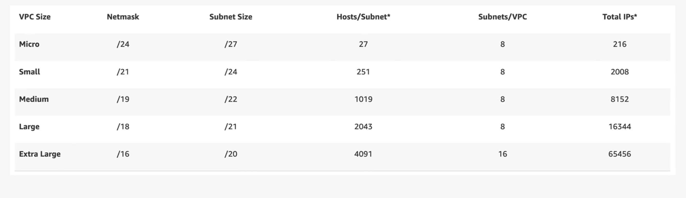
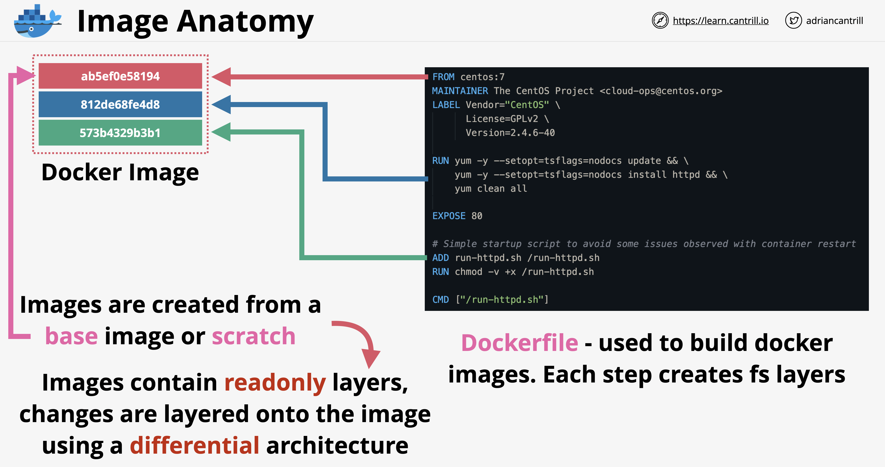
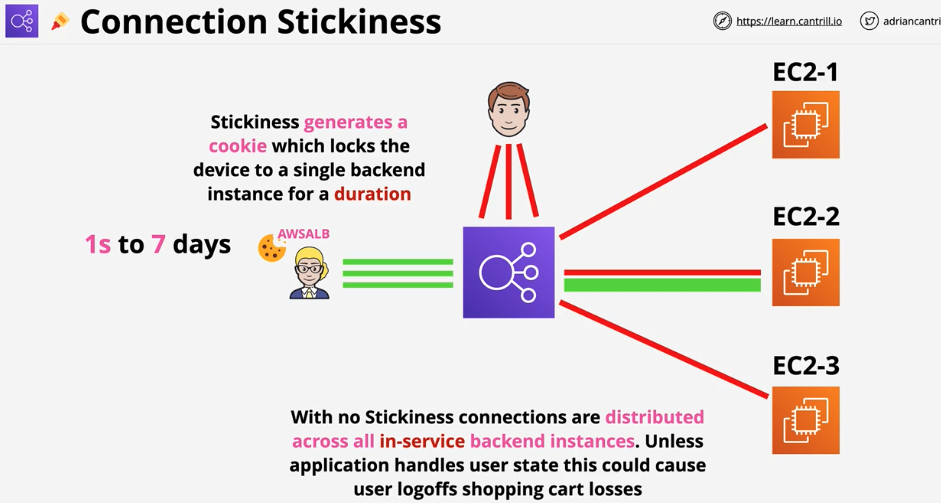

# 1. DVA-C02 Notes

> These are my personal notes from Adrian Cantrill's (DVA-C02) course.
****
**Table of Contents**

- [1.1. Cloud Computing Fundamentals](#11-cloud-computing-fundamentals)
- [1.2. AWS-Fundamentals](#12-aws-fundamentals)
- [1.3. IAM-Accounts-AWS-Organizations](#13-iam-accounts-aws-organizations)
- [1.4. Simple-Storage-Service-(S3)](#14-simple-storage-service-s3)
- [1.5. Virtual-Private-Cloud-VPC](#15-virtual-private-cloud-vpc)
- [1.6. Elastic-Cloud-Compute-EC2](#16-elastic-cloud-compute-ec2)
- [1.7. Containers-and-ECS](#17-containers-and-ecs)
- [1.8. Advanced-EC2](#18-advanced-ec2)
- [1.9. Route-53](#19-route-53)
- [1.10. Relational-Database-Service-RDS](#110-relational-database-service-rds)
- [1.11. Network-Storage-EFS](#111-network-storage-efs)
- [1.12. HA-and-Scaling](#112-ha-and-scaling)
- [1.12. CI/CD](#112-ci/cd)
- [1.13. Serverless-and-App-Services](#113-serverless-and-app-services)
- [1.14. CDN-and-Optimization](#114-cdn-and-optimization)
- [1.15. Advanced-VPC](#115-advanced-vpc)
- [1.16. Hybrid-and-Migration](#116-hybrid-and-migration)
- [1.17. Security-Deployment-Operations](#117-security-deployment-operations)
- [1.18. NoSQL-and-DynamoDB](#118-nosql-and-dynamodb)

---

## 1.1. Cloud Computing Fundamentals

Cloud computing provides

1. On-Demand Self-Service: Provision and terminate using a UI/CLI without
   human interaction.
2. Broad Network Access: Access services over any networks on any devices using
   standard protocols and methods.
3. Resource Pooling: Economies of scale, cheaper service.
4. Rapid Elasticity: Scale up and down automatically in response to system load.
5. Measured Service: Usage is measured. Pay only for what you consume.

### 1.1.1. Public vs Private vs Multi Cloud

- Public Cloud: using 1 public cloud such as AWS, Azure, Google Cloud.
- Private Cloud: using on-premises real cloud. Must meet 5 requirements.
- Multi-Cloud: using more than 1 public cloud in one deployment.
- Hybrid Cloud: using public and private clouds in one environment
  - This is **NOT** using Public Cloud and Legacy on-premises hardware.

### 1.1.2. Cloud Service Models

The _Infrastructure Stack_ or _Application Stack_ contains multiple components
that make up the total service. There are parts that **you** manage as well
as portions the **vendor** manages. The portions the vendor manages and you
are charged for is the **unit of consumption**

1. On-Premises: The individual manages all components from data to facilities.
   Provides the most flexibility, but also most IT intensive.
2. Data Center Hosting: Place equipment in a building managed by a vendor.
   You pay for the facilities only.
3. Infrastructure as a Service (IaaS): Vendor manages facilities and everything
   else related to servers up to the OS. You pay per second or minute for the OS
   used to the vendor. Lose some flexibility, but big risk reductions.
4. Platform as a Service (PaaS): Good for running an application only. The
   unit of consumption is the runtime environment. You manage the application
   and the data, but the vendor manges all else.
5. Software as a Service (SaaS): You consume the software as a service. This
   can be Outlook or Netflix. There are almost no risks or additional costs, but
   very little control.

There are additional services such as _Function as a Service_,
_Container as a Service_, and _DataBase as a Service_ which be explained later.

---

## 1.2. AWS-Fundamentals

### AWS Support Plans

- Basic (free)
- Developer (one user, general guidance)
- Business (multiple users, personal guidance)
- Enterprise (Technical account manager)

### 1.2.1. Public vs Private Services

Refers to the networking only, not permissions.

- Public Internet: AWS is a public cloud platform and connected to the public
  internet. It is not on the public internet, but is next to it.
- AWS Public Zone: Attached to the Public Internet.
  S3 Bucket is hosted in the Public Zone, not all services are.
  Just because you connect to a public service,
  that does not mean you have permissions to access it.
- AWS Private Zone: No direct connectivity is allowed between the AWS Private
  Zone and the public cloud unless this is configured for that service.
  This is done by taking a part of the private service and projecting it into the
  AWS public zone which allows public internet to make inbound or outbound
  connections.

### 1.2.2. AWS Global Infrastructure

#### 1.2.2.1. Regions

AWS Region is an area of the world they have selected for a full deployment of
AWS infrastructure.

Areas such as countries or states

- Ohio
- California
- Singapore
- Beijing
- London
- Paris

AWS can only deploy regions as fast as their planning allows.
Regions are often not near their customers.

#### 1.2.2.2. AWS Edge Locations

Local distribution points. Useful for services such as Netflix so they can store
data closer to customers for low latency high speed transfers.

If a customer wants to access data stored in Brisbane, they will stream data
from the Sydney Region through an Edge Location hosted in Brisbane.

#### 1.2.2.3. AWS Management

Regions are connected together with high speed networking.
Some services such as EC2 need to be selected in a region.
Some services are global such as IAM

#### 1.2.2.4. Region's 3 Benefits

- Geographical Separation
  - Useful for natural disasters
  - Provide isolated fault domain
  - Regions are 100% isolated
- Geopolitical Separation
  - Different laws change how things are accessed
  - Stability from political events
- Location Control
  - Tune architecture for performance
  - Duplicate infrastructure at closer points to customers

### 1.2.3. Regions and AZs

Region Name: Asia Pacific (Sydney)
Region Code: ap-southeast-2

AWS will provide between 2 and 6 AZs per region.
AZs are isolated compute, storage, networking, power, and facilities.
Components are allowed to distribute load and resilience by using multiple zones.

AZs are connected to each other with high speed redundant networks.

#### 1.2.3.1. Service Resilience

1. Globally Resilient: IAM or Route 53. No way for them to go down. Data is
   replicated throughout multiple regions.
2. Region Resilient: Operate as separate services in each region. Generally
   replicate data to multiple AZs in that region.
3. AZ Resilient: Run from a single AZ. It is possible for hardware to fail in an
   AZ and the service to keep running because of redundant equipment, but should
   not be relied on.

### 1.2.4. AWS Default VPC

Great question! Let’s break down **VPC (Virtual Private Cloud)** and **AWS Default VPC** in simple terms.

---

### **What is a VPC?**

A **Virtual Private Cloud (VPC)** is a virtual network dedicated to your AWS account. It allows you to launch AWS resources (like EC2 instances, RDS databases, etc.) in a logically isolated section of the AWS Cloud. Think of it as your own private data center within AWS.

#### **Key Features of a VPC:**

1. **Isolation:** Resources in one VPC are isolated from resources in other VPCs.
2. **Custom Networking:** You can define your own IP address range, subnets, route tables, and gateways.
3. **Security:** Use security groups and network ACLs to control inbound and outbound traffic.
4. **Connectivity:** Connect your VPC to the internet, other VPCs, or your on-premises network.

---

### **Components of a VPC**

Here are the main components that make up a VPC:

1. **Subnets:** A subnet is a range of IP addresses in your VPC. Subnets can be public (accessible from the internet) or private (not accessible from the internet).
2. **Route Tables:** Define how traffic is routed within your VPC.
3. **Internet Gateway (IGW):** Allows communication between your VPC and the internet.
4. **NAT Gateway:** Allows private subnets to access the internet while remaining private.
5. **Security Groups:** Act as virtual firewalls for your instances to control inbound and outbound traffic.
6. **Network ACLs (NACLs):** Stateless firewall rules for controlling traffic at the subnet level.
7. **VPC Peering:** Connects two VPCs to allow communication between them.

---

### **What is a Default VPC?**

When you create an AWS account, AWS automatically creates a **Default VPC** in each AWS Region. This is a ready-to-use VPC with default configurations, making it easy to launch resources without needing to set up a custom VPC.

#### **Features of a Default VPC:**

1. **Pre-Configured Subnets:** The Default VPC includes a public subnet in each Availability Zone (AZ) in the region.
2. **Internet Gateway:** Attached by default, allowing instances in the Default VPC to access the internet.
3. **Public IP Addresses:** Instances launched in the Default VPC are automatically assigned a public IP address.
4. **Route Table:** A default route table is created with a route to the internet via the Internet Gateway.
5. **Security Group:** A default security group is created, allowing all inbound traffic from resources within the same security group and all outbound traffic.

---

### **Default VPC vs. Custom VPC**

| Feature             | Default VPC                  | Custom VPC                          |
| ------------------- | ---------------------------- | ----------------------------------- |
| **Creation**        | Automatically created by AWS | Manually created by the user        |
| **Subnets**         | Public subnets in each AZ    | User-defined public/private subnets |
| **Internet Access** | Enabled by default           | Must configure Internet Gateway     |
| **Public IPs**      | Automatically assigned       | User-defined                        |
| **Use Case**        | Quick deployments, testing   | Production workloads, custom setups |

---

### **When to Use a Default VPC**

- **Quick Start:** Ideal for beginners or when you need to quickly launch resources.
- **Testing:** Great for testing and development environments.
- **Temporary Workloads:** Suitable for short-term or non-critical workloads.

---

### **When to Use a Custom VPC**

- **Production Workloads:** For critical applications requiring fine-grained control over networking.
- **Complex Architectures:** When you need multiple subnets, NAT gateways, or VPC peering.
- **Security Compliance:** For environments requiring strict security and isolation.

---

#### 1.2.4.1. Default VPC Facts

VPC CIDR - defines start and end ranges of the VPC.
IP CIDR of a default VPC is always: **172.31.0.0/16**

Configured to have one subnet in each AZ in the region by default.

Subnets are given one section of the IP ranges for the default service.
They are configured to provide anything that is deployed inside those subnets with public IPv4 addresses.

In general do not use the Default VPC in a region because it is not flexible.

Default VPC is large because it uses the /16 range.
A subnet is smaller such as /20
The higher the / number is, the smaller the grouping.

Two /17's will fit into a /16, sixteen /20 subnets can fit into one /16.

---

### **Default VPC Configuration**

#### **1. IP Address Range (CIDR Block)**

- The Default VPC is assigned a **/16 CIDR block**.
- This means the VPC has **65,536 private IP addresses** available.
- The default CIDR block for a Default VPC is typically:
  ```
  172.31.0.0/16
  ```
  - This range includes IPs from `172.31.0.0` to `172.31.255.255`.
- So it is the same IP range for each Region and each region’s AZs gets one subnet per AZ with /20 CIDR Block
- An AZ can have more than one subnet but just the default VPC has one subnet per AZ
- A default VPC can be deleted and recreated

---

#### **2. Subnets**

- The Default VPC includes **one subnet in each Availability Zone (AZ)** in the region.
- Each subnet is assigned a **/20 CIDR block**.
  - This means each subnet has **4,096 private IP addresses**.
  - The subnet CIDR blocks are derived from the VPC’s CIDR block (`172.31.0.0/16`).
  - Example subnet ranges:
    ```
    172.31.0.0/20
    172.31.16.0/20
    172.31.32.0/20
    ```
  - These subnets are spread across different AZs in the region.

---

#### Example: Default VPC in `us-east-1` (3 AZs)

If `us-east-1` has three Availability Zones, the subnets might look like this:

| AZ         | Subnet CIDR Block |
| ---------- | ----------------- |
| us-east-1a | 172.31.0.0/20     |
| us-east-1b | 172.31.16.0/20    |
| us-east-1c | 172.31.32.0/20    |

Each subnet can host EC2 instances, RDS databases, or other AWS resources, and since it’s a Default VPC, all instances automatically get public IPs and internet access via an Internet Gateway.

#### **3. Internet Gateway (IGW)**

- A Default VPC automatically comes with an **Internet Gateway (IGW)** attached.
- The IGW allows resources in the VPC to communicate with the internet.
- It also enables instances in public subnets to have public IP addresses.

---

#### **4. Route Table**

- The Default VPC has a **main route table** with the following routes:
  - A route for **local traffic** within the VPC:
    ```
    Destination: 172.31.0.0/16
    Target: local
    ```
  - A route for **internet-bound traffic**:
    ```
    Destination: 0.0.0.0/0
    Target: igw-xxxxxxxx (Internet Gateway)
    ```

---

#### **5. Public IP Address Assignment**

- Instances launched in the Default VPC are automatically assigned a **public IP address** (if the subnet is configured to do so).
- This makes it easy to access instances directly from the internet.

---

#### **6. Security Group**

- A **default security group** is created in the Default VPC.
- The default security group allows:
  - **All inbound traffic** from other instances associated with the same security group.
  - **All outbound traffic** to any destination.

---

#### **7. Network ACL (NACL)**

- A **default network ACL** is created in the Default VPC.
- The default NACL allows:
  - **All inbound traffic**.
  - **All outbound traffic**.

---

### **Default VPC vs. Custom VPC Subnet Ranges**

| Feature                  | Default VPC                   | Custom VPC                         |
| ------------------------ | ----------------------------- | ---------------------------------- |
| **VPC CIDR Block**       | `172.31.0.0/16`               | User-defined (e.g., `10.0.0.0/16`) |
| **Subnet CIDR Block**    | `/20` (e.g., `172.31.0.0/20`) | User-defined (e.g., `/24`)         |
| **Subnet Type**          | Public (by default)           | User-defined (public or private)   |
| **Internet Gateway**     | Automatically attached        | Manually attached                  |
| **Public IP Assignment** | Enabled by default            | User-defined                       |

---

### **How to Check Your Default VPC Configuration**

1. **Go to the VPC Dashboard:**
   - Open the AWS Management Console and navigate to the **VPC Dashboard**.
2. **View Your Default VPC:**
   - Under **Your VPCs**, you’ll see the Default VPC with the CIDR block `172.31.0.0/16`.
3. **Check Subnets:**
   - Under **Subnets**, you’ll see the subnets associated with the Default VPC (e.g., `172.31.0.0/20`, `172.31.16.0/20`, etc.).
4. **View Route Tables:**
   - Under **Route Tables**, check the main route table for the Default VPC.
5. **Check Internet Gateway:**
   - Under **Internet Gateways**, you’ll see the IGW attached to the Default VPC.

---

### **Why Use the Default VPC?**

- **Quick Start:** Ideal for beginners or temporary workloads.
- **Simplicity:** No need to configure subnets, route tables, or IGW manually.
- **Public Access:** Instances are automatically assigned public IPs, making them accessible from the internet.

---

### **When to Avoid the Default VPC**

- **Production Workloads:** Use a custom VPC for better control and security.
- **Complex Architectures:** If you need private subnets, NAT gateways, or VPC peering.
- **Compliance Requirements:** Custom VPCs allow stricter security configurations.

---

### **Example: Launching an EC2 Instance in the Default VPC**

1. Go to the **EC2 Dashboard**.
2. Click **Launch Instance**.
3. Choose an AMI and instance type.
4. In the **Network Settings**, select the Default VPC and one of its subnets.
5. Configure the security group to allow SSH (port 22) or HTTP (port 80) access.
6. Launch the instance. It will automatically get a public IP address.

---

### **Best Practices for Default VPC**

1. **Use for Testing Only:** Avoid using the Default VPC for production workloads.
2. **Monitor Public Access:** Be cautious about exposing instances to the internet.
3. **Backup and Delete:** If you don’t need the Default VPC, consider deleting it to avoid accidental usage.
4. **Use Custom VPCs for Production:** For better control over networking and security.

---

### 1.2.5. Elastic Compute Cloud (EC2)

Default compute service. Provides access to virtual machines called instances.

#### 1.2.5.1. Infrastructure as as Service (IaaS)

The unit of consumption is an instance.
An EC2 instance is configured to launch into a single VPC subnet.
Private service by default, public access must be configured.
The VPC needs to support public access. If you use a custom VPC then you must
handle the networking on your own.

EC2 deploys into one AZ. If it fails, the instance fails.

Different sizes and capabilities. All use On-Demand Billing - Per second.
Only pay for what you consume.

Local on-host storage or **Elastic Block Storage**

Pricing based on:

- CPU
- Memory
- Storage
- Networking

Extra cost for any commercial software the instance deploys with.

#### 1.2.5.2. Running State

Charged for all four categories.

- Running on a physical host using CPU.
- Using memory even with no processing.
- OS and its data are stored on disk, which is allocated to you.
- Networking is always ready to transfer information.

#### 1.2.5.3. Stopped State

Charged for EBS storage only.

- No CPU resources are being consumed
- No memory is being used
- Networking is not running
- Storage is allocated to the instance for the OS together with any applications.

#### 1.2.5.4. Terminated State

No charges, deletes the disk and prevents all future charges.

#### 1.2.5.5. AMI (Server Image)

AMI can be used to create an instance or can be created from an instance.
AMIs in one region are not available from other regions.

Contains:

- Permissions: controls which accounts can and can't use the AMI.

  - Public - Anyone can launch it.

  - Owner - Implicit allow, only the owner can use it to spin up new instances

  - Explicit - Owner grants access to AMI for specific AWS accounts

- Root Volume: contains the **Boot Volume**

- Block Device Mapping: links the volumes that the AMI has and
  how they're presented to the operating system. Determines which volume is a
  boot volume and which volume is a data volume.

#### 1.2.5.6. Connecting to EC2

AMI Types:

- Amazon Quick Start AMIs
- AWS Marketplace AMIs
- Community AMIs
- Private AMIs

- Windows using RDP (Remote Desktop Protocol), Port 3389
- Linux SSH protocol, Port 22

Login to the instance using an SSH key pair.
Private Key - Stored on local machine to initiate connection.
Public Key - AWS places this key on the instance.

### 1.2.6. S3 (Default Storage Service)

Global Storage platform. Runs from all regions and is a public service.
Can be accessed anywhere from the internet with an unlimited amount of users.

This should be the default storage platform

S3 is an object storage, not file, or block storage.
You can't mount an S3 Bucket.

#### 1.2.6.1. Objects

Can be thought of a file. Two main components:

- Object Key: File name in a bucket
- Value: Data or contents of the object
  - Zero bytes to 5 TB

Other components:

- Version ID
- Metadata
- Access Control
- Sub resources

#### 1.2.6.2. Buckets

- Created in a specific AWS Region.
- Data has a primary home region. Will not leave this region unless told.
- Blast Radius = Region
- Unlimited number of Objects
- Name is globally unique
- All objects are stored within the bucket at the same level.

If the objects name starts with a slash such as `/old/Koala1.jpg` the UI will
present this as a folder. In actuality this is not true, there are no folders.

### 1.2.7. CloudFormation Basics

CloudFormation templates can be used to create, update, modify, and delete infrastructure.

They can be written in YAML or JSON. An example is provided below.

```YAML
## This is not mandatory unless a description is added
AWSTemplateFormatVersion: "version date"

## Give details as to what this template does.
## If you use this section, it MUST immediately follow the AWSTemplateFormatVersion.
Description:
  A sample template

## Can control the command line UI. The bigger your template, the more likely
## this section is needed
Metadata:
  template metadata

## Prompt the user for more data. Name of something, size of instance,
## data validation
Parameters:
  set of parameters

## Another optional section. Allows lookup tables, not used often
Mappings:
  set of mappings

## Decision making in the template. Things will only occur if a condition is met.
## Step 1: create condition
## Step 2: use the condition to do something else in the template
Conditions:
  set of conditions

Transform:
  set of transforms

## The only mandatory field of this section
Resources:
  set of resources

## Once the template is finished it can return data or information.
## Could return the admin or setup address of a word press blog.
Outputs:
  set of outputs
```

### 1.2.8. Resources

An example which creates an EC2 instance

```YAML
Resources:
  Instance: ## Logical Resource
    Type: 'AWS::EC2::Instance' ## This is what will be created
    Properties: ## Configure the resources in a particular way
      ImageId: !Ref LatestAmiId
      Instance Type: !Ref Instance Type
      KeyName: !Ref Keyname
```

Once a template is created, AWS will make a stack. This is a living and active
representation of a template. One template can create infinite amount of stacks.

For any **Logical Resources** in the stack,
CF will make a corresponding **Physical Resources** in your AWS account.

It is cloud formations job to keep the logical and physical resources in sync.

A template can be updated and then used to update the same stack.

### 1.2.9. CloudWatch Basics

Collects and manages operational data on your behalf.

Three products in one

- Metrics: data relating to AWS products, apps, on-prem solutions
- Logs: collection, monitoring
- Events: event hub
  - If an AWS service does something, CW events can perform another action
  - Generate an event to do something at a certain time of day or time of week.

#### 1.2.9.1. Namespace

Container for monitoring data.
Naming can be anything so long as it's not `AWS/service` such as `AWS/EC2`.
This is used for all metric data of that service

**Data point ** : the thing the cloud watch is recording. A unit of measure

#### 1.2.9.2. Metric

Time ordered set of data points such as:

- CPU Usage
- Network IN/OUT
- Disk IO

This is not for a specific server. This could get things from different servers.

Anytime CPU Utilization is reported, the **datapoint** will report:

- Timestamp = 2019-12-03
- Value = 98.3

**Dimensions** could be used to get metrics for a specific instance or type of instance, among others. They separate data points for different **things** or
**perspectives** within the same metric.

**Resolution** period at which the metric is recorded

#### 1.2.9.3. Alarms

Has two states `ok` or `alarm`. A notification could be sent to an SNS topic or an action could be performed based on an alarm state.
Third state can be insufficient data state. Not a problem, just wait.

### 1.2.10. Shared Responsibility Model

AWS: Responsible for security **OF** the cloud

Customer: Responsible for security **IN** the cloud

### 1.2.11. High Availability (HA), Fault-Tolerance (FT) and Disaster Recovery (DR)

#### 1.2.11.1. High Availability (HA)

- Aims to **ensure** an agreed level of operational **performance**, usually
  **uptime**, for a **higher than normal period**
- Instead of diagnosing the issue, if you have a process ready to replace it, it can be fixed quickly and probably in an automated way.
- Spare infrastructure ready to switch customers over to in the event of a disaster to minimize downtime
- User disruption is not ideal, but is allowed
  - The user might have a small disruption or might need to log back in.
- Maximizing a system's uptime
  - 99.9% (Three 9's) = 8.7 hours downtime per year.
  - 99.999 (Five 9's) = 5.26 minutes downtime per year.

#### 1.2.11.2. Fault-Tolerance (FT)

- System can **continue operating properly**
  in the event of the **failure of some** (one or more faults within) of its
  **components**
- Fault tolerance is much more complicated than high availability and more
  expensive. Outages must be minimized and the system needs levels of
  redundancy.
- An airplane is an example of system that needs Fault Tolerance. It has
  more engines than it needs so it can operate through failure.

Example:
A patient is waiting for a life saving surgery and is under anesthetic.
While being monitored, the life support system is dosing medicine.
This type of system cannot only be highly available, even a movement of
interruption is deadly.

#### 1.2.11.3. Disaster Recovery (DR)

- Set of policies, tools and procedures to **enable the recovery** or
  **continuation** of **vital** technology infrastructure and systems
  **following a natural or human-induced disaster**.
- DR can largely be automated to eliminate the time for recovery and errors.

This involves:

- Pre-planning
  - Ensure plans are in place for extra hardware
  - Do not store backups at the same site as the system
- DR Processes
  - Cloud machines ready when needed

This is designed to keep the crucial and non replaceable parts of the
system in place.

Used when HA and FT don't work.

### 1.2.12. Domain Name System (DNS)

DNS is a discovery service. Translates machines into humans and vice-versa.
It is a huge database and has to be distributed.

Parts of the DNS system

- DNS Client: Piece of software running on the OS for a device you're using.
- Resolver: Software on your device or server which queries DNS on your behalf.
- Zone: A part of the DNS database.
  - This would be amazon.com
  - What the data is, its substance
- Zone file: physical database for a zone
  - How physically that data is stored
- Nameserver: where zone files are hosted

Steps:

Find the Nameserver which hosts a particular zone file.
Query that Nameserver for a record that is in that zone file.
It then passes the information back to the DNS client.

#### 1.2.12.1. DNS Root

The starting point of DNS.
DNS names are read right to left with multiple parts separated by periods.

`www.netflix.com.`

The last period is assumed to be there in a browser when it's not present.
The DNS Root is hosted on DNS Root Servers (13). These are hosted
by 12 major companies.

**Root Hints** is a pointer to the DNS Root servers provided by the OS vendor

Process

1. DNS client asks DNS Resolver for IP address of a given DNS name.
2. Using the Root Hints file, the DNS Resolver communicates with one or
   more of the root servers to access the root zone and begin the process
   of finding the IP address.

The Root Zone is organized by IANA (Internet Assigned Numbers Authority).
Their job is to manage the contents of the root zone. IANA is in charge
of the DNS system because they control the root zone.

#### 1.2.12.2. DNS Hierarchy

Assuming a laptop is querying DNS directly for www.amazon.com and using
a root hints file to know how to access a root server and query the root zone.

- When something is trusted in DNS, it is an **authority**.
- One piece can be authoritative for root.
- One piece can be authoritative for amazon.com
- The root zone is the start and the only thing trusted in DNS.
- The root zone can delegate a part of itself to another zone or entity.
- That someone else then becomes authoritative for just the part that's delegated.
- The root zone is just a database of the top level domains.

The top level domains are the only thing immediately to the left of the root in a DNS name.

- `.com` or `.org` are generic top level domains (gTLD)
- `.uk` is a country code top level domain (ccTLD)

**Registry** maintains the zones for a TLD (e.g .ORG)
**Registrar** has relationships with the .org TLD zone manager
allowing domain registration

### 1.2.13. Route53 Fundamentals

- Registers domains
- Can host zone files on managed nameservers
- This is a global service, no need to pick a region
- Globally Resilience
  - Can operate with failure in one or more regions

#### 1.2.13.1. Register Domains

Has relationships with all major registries (registrar)

- Route 53 will check with the top level domain to see if the name is available
- Route 53 creates a zone file for the domain to be registered
- Allocates nameservers for that zone
  - Generally four of these for one individual zone
  - This is a hosted zone
  - The zone file will be put on these four managed nameservers
- Route 53 will communicate with the `.org` registry and add the nameserver records
  into the zone file for that top level domain.
  - This is done with a nameserver record (NS).

#### 1.2.13.2. Route53 Details

**Zone files** in AWS
Hosted on four managed name servers

- Can be **public** or **private** (linked to one or more VPCs)

### 1.2.14. DNS Record

- Nameserver (NS): Allows delegation to occur in the DNS.
- A and AAAA Records: Maps the host to a v4 or v6 host type respectively. Most of the time
  you will make both types of record, A and AAAA.
- CNAME Record Type: Allows DNS shortcuts to reduce admin overhead.
  CNAMES cannot point directly to an IP address, only another name.
- MX records: How emails are sent. They have two main parts:
  - Priority: Lower values for the priority field are higher priority.
  - Value - If it is just a host, it will not have a dot on the right. It is assumed
    to be part of the same zone as the host. - If you include a dot on the right, it is a **_fully qualified domain name_**
- TXT Record: Allows you to add arbitrary text to a domain.
  One common usage is to prove domain ownership.

#### 1.2.14.1. TTL - Time To Live

This is a numeric setting on DNS records in seconds.
Allows the admin to specify how long the query can be stored
at the resolver server.
If you need to upgrade the records, it is smart to lower the TTL value first.

Getting the answer from an Authoritative Source is known as an
**Authoritative Answer**.

If another client queries the same thing, they will get back a
**Non-Authoritative** response.

---

## 1.3. IAM-Accounts-AWS-Organizations

### 1.3.1. IAM Identity Policies

Identity Policies are attached to AWS Identities which are
IAM users, IAM groups, and IAM roles. These are a set of security statements
that ALLOW or DENY access to AWS resources.

When an identity attempts to access AWS resources, that identity needs
to prove who it is to AWS, a process known as **Authentication**.
Once authenticated, that identity is known as an **authenticated identity**

## **Types of IAM Policies**

AWS IAM uses different types of policies to define permissions:

1. **Identity-Based Policies**

   - Attached to users, groups, or roles.
   - Control access to AWS resources.
   - Examples: Managed policies, inline policies.

2. **Resource-Based Policies**

   - Attached to AWS resources (like S3 buckets, SNS topics).
   - Define who can access the resource and what actions they can perform.

3. **Permissions Boundaries**

   - A managed policy that acts as a permission boundary for an IAM user or role.
   - Restricts the maximum permissions an entity can have.

4. **Service Control Policies (SCPs)**

   - Applied at the AWS Organization level to enforce restrictions on accounts within an AWS Organization.
   - Cannot grant permissions but can restrict them.

5. **Session Policies**
   - Temporary policies associated with session-based access (e.g., AWS STS AssumeRole).
   - Limits permissions during a temporary session.

---

#### 1.3.1.1. Statement Components

- Statement ID (SID): Optional field that should help describe
  - The resource you're interacting
  - The actions you're trying to perform
- Effect: is either `allow` or `deny`.
  - It is possible to be allowed and denied at the same time
- Action are formatted `service:operation`. There are three options:
  - specific individual action
  - wildcard as an action
  - list of multiple independent actions
- Resource: similar to action except for format `arn:aws:s3:::catgifs`

Example:

```json
{
  "Effect": "Deny",
  "Action": "s3:DeleteObject",
  "Resource": "arn:aws:s3:::my-bucket/*"
}
```

### **Key Elements of a Policy Statement**

1.  **Effect**:

    - The **Effect** can be either `Allow` or `Deny`.
      - **Allow**: Grants the specified permissions.
      - **Deny**: Explicitly denies the permissions, overriding any other `Allow` statements.

2.  **Action**:

    - Defines what actions are allowed or denied.
    - Actions are AWS service operations like `s3:ListBucket`, `ec2:StartInstances`, `lambda:InvokeFunction`, etc.
    - Can be a single action or an array of actions.
    - Wildcards `*` can be used to allow/deny all actions for a particular service.
    - Actions should alway match the resource

3.  **Resource**:

    - Specifies the AWS resources to which the policy applies.
    - A **Resource ARN (Amazon Resource Name)** is used to identify the specific AWS resource.
    - Wildcards `*` can be used to match multiple resources.
    - Resource cannot be in the form of array, every statement has only one resource it is referring to.
    - Example ARN for S3 bucket: `arn:aws:s3:::example-bucket/*`

4.  **Condition**:

    - Specifies conditions that must be met for the policy to be effective.
    - Conditions are key-value pairs and support operators like `StringEquals`, `StringLike`, etc.
    - Example: `aws:RequestTag/Environment` must be `Production`.

5.  **Principal**:

    - Defines who the policy is for. It can specify users, roles, or AWS services.
    - It can be an array of identities
    - This is only required in **resource-based policies** (such as for S3 or Lambda) and on Trust policy of a Role.
    - In **identity-based policies**, the principal is implicit because the policy is attached to an identity.

---

### **Possible Values for Each Element**

#### **1\. Effect**

- `Allow`: Grants permissions.
- `Deny`: Explicitly denies permissions.

#### **2\. Action**

- AWS service actions (e.g., `s3:ListBucket`, `ec2:StartInstances`).
- Wildcard (`*`) to apply to all actions of a service (e.g., `s3:*` to allow all S3 actions).

**Example Actions:**

- `s3:ListBucket`
- `ec2:DescribeInstances`
- `lambda:InvokeFunction`

#### **3\. Resource**

- **ARN Format**: `arn:aws:<service>:<region>:<account-id>:<resource-type>/<resource-id>`

  For example:

  - S3 Bucket ARN: `arn:aws:s3:::example-bucket`
  - EC2 Instance ARN: `arn:aws:ec2:us-west-2:123456789012:instance/i-1234567890abcdef0`
  - Lambda Function ARN: `arn:aws:lambda:us-east-1:123456789012:function:my-function`

- **Wildcards**: You can use wildcards (`*`) to apply to multiple resources.

  - S3 Bucket with all objects: `arn:aws:s3:::example-bucket/*`
  - EC2 instances: `arn:aws:ec2:us-west-2:123456789012:instance/*`

#### **4\. Condition**

- Conditions define when a policy should apply. Common operators are:

  - `StringEquals`: Matches exact string values.
  - `StringLike`: Matches string values using wildcard characters (`*`).
  - `NumericEquals`: Matches numeric values.
  - `DateEquals`: Matches date values.**Example Condition**:

  ```
  "Condition": {
    "StringEquals": {
      "aws:RequestTag/Environment": "Production"
    }
  }

  ```

#### **5\. Principal**

- **AWS IAM User or Role ARN**:
  - For example: `arn:aws:iam::123456789012:user/ExampleUser`
  - For a role: `arn:aws:iam::123456789012:role/ExampleRole`
- **Service Principals** (AWS services that can assume the role):
  - EC2: `ec2.amazonaws.com`
  - Lambda: `lambda.amazonaws.com`
- **Federated Identity** (for identity providers like Google, Facebook, or Active Directory):
  - Example: `cognito-identity.amazonaws.com`

**Example Principal Formats**:

- IAM User:\
  `arn:aws:iam::123456789012:user/ExampleUser`

- IAM Role:\
  `arn:aws:iam::123456789012:role/ExampleRole`

- AWS Service (e.g., EC2):\
  `ec2.amazonaws.com`

- Federated User (via AWS Cognito Identity Pool):\
  `cognito-identity.amazonaws.com`

---

#### 1.3.1.2. Priority Level

- Explicit Deny: Denies access to a particular resource cannot be overruled.
- Explicit Allow: Allows access so long there is not an explicit deny.
- Default Deny (Implicit): IAM identities start off with no resource access.

## **Summary of IAM Policy Evaluation**

| Order | Policy Type             | Effect                                         |
| ----- | ----------------------- | ---------------------------------------------- |
| 1️⃣    | Explicit Deny           | **Always wins** (Overrides all other policies) |
| 2️⃣    | Explicit Allow          | Granted only if no deny exists                 |
| 3️⃣    | Default (Implicit Deny) | Applies if no policy allows the action         |

### **What is a Permission Boundary in AWS IAM?**

A **permission boundary** is an advanced IAM feature that **restricts the maximum permissions an IAM user or role can have**. It acts as an upper limit, preventing a user or role from exceeding certain permissions, even if other policies grant them.

---

### **How It Works**

- **Without a Permission Boundary**: A user or role gets all permissions assigned through identity-based policies.
- **With a Permission Boundary**: Even if a policy grants access, the user/role **cannot exceed** what the boundary allows.

**🔹 Example:**\
A user has an identity-based policy allowing full access to **S3 and EC2**, but a **permission boundary** only allows access to **S3**.\
✅ **User can access S3**\
❌ **User cannot access EC2** (even though their identity policy allows it)

---

### **Key Facts About Permission Boundaries**

1.  **They apply only to IAM users and roles, not groups.**
2.  **They don't grant permissions; they only restrict them.**
3.  **They work alongside identity-based policies.** Both must allow an action for it to be permitted.
4.  **Useful for controlling privilege escalation** when delegating admin tasks.

---

### **Example JSON of a Permission Boundary**

This boundary **allows only S3 actions**, even if another policy tries to grant more permissions:

```
{
    "Version": "2012-10-17",
    "Statement": [
        {
            "Effect": "Allow",
            "Action": "s3:*",
            "Resource": "*"
        }
    ]
}
```

If a policy tries to grant EC2 access, the boundary **blocks** it.

---

### **When to Use Permission Boundaries**

✅ **For delegated administration** -- Restrict IAM users who manage other users.\
✅ **For limiting third-party access** -- Ensure vendors don't get excessive permissions.\
✅ **For creating least privilege access** -- Prevent users from escalating their permissions.

#### 1.3.1.3. Inline Policies and Managed Policies

- Inline Policy: grants access and assigned on each accounts individually.
- Managed Policy (best practice): one policy is applied to all users at once.

# Inline vs. Managed Policies in AWS IAM

AWS Identity and Access Management (IAM) allows you to control access to your AWS resources using policies. These policies come in two main forms: **inline policies** and **managed policies**.

## Managed Policies

- **Definition:**  
  Managed policies are standalone policies that you can create and manage independently from the IAM identities (users, groups, or roles) to which they are attached.

- **Types:**

  - **AWS Managed Policies:** Predefined by AWS and maintained by AWS to help you quickly set up permissions based on common use cases.
  - **Customer Managed Policies:** Created and managed by you, providing the flexibility to define custom permissions tailored to your organization's needs.

- **Advantages:**
  - **Reusability:** Can be attached to multiple IAM entities.
  - **Ease of Management:** A single change in a managed policy automatically propagates to all attached entities.
  - **Consistency:** Ensures uniform permissions across different users, groups, or roles.

## Inline Policies

- **Definition:**  
  Inline policies are policies that are embedded directly into a specific IAM user, group, or role. They are tightly coupled with that particular entity.

- **Characteristics:**

  - **Specificity:** Designed for one-off or unique permission sets that you want to apply only to a single IAM entity.
  - **Non-reusability:** Cannot be reused or attached to other identities. If the identity is deleted, the inline policy is also removed.

- **Use Cases:**
  - When you need a policy that is uniquely tailored to a specific user, group, or role.
  - When you want to ensure that the policy is directly associated with the identity and is not inadvertently applied elsewhere.

## Key Differences

- **Reusability:**

  - _Managed Policies_ can be attached to multiple IAM entities.
  - _Inline Policies_ are bound to a single IAM entity.

- **Management:**

  - _Managed Policies_ offer centralized management, making updates easier and more consistent across entities.
  - _Inline Policies_ require individual management for each IAM entity.

- **Use Cases:**
  - Use _Managed Policies_ when you need to apply the same set of permissions to multiple users, groups, or roles.
  - Use _Inline Policies_ for specialized, entity-specific permissions that should not be reused.

---

### 1.3.2. IAM Users

Identity used for anything requiring **long-term** AWS access

- Humans
- Applications
- Service Accounts

If you can name a thing to use the AWS account, this is an IAM user.

### Principal

In AWS IAM (Identity and Access Management), a **principal** is an entity that can make a request to perform an action on AWS resources. A principal must authenticate itself before it can be authorized to perform actions.

### **Types of Principals**

1.  **IAM Users** -- Individuals who have AWS access with credentials (username/password or access keys).
2.  **IAM Roles** -- Temporary identities assumed by services, applications, or users.
3.  **Federated Users** -- Identities authenticated via an external identity provider (IdP) like Google, Okta, or Active Directory.
4.  **AWS Services** -- AWS services (e.g., Lambda, EC2) assuming roles to interact with other AWS resources.

### **Example of a Principal in a Policy**

In an AWS IAM policy, a principal is specified in the `Principal` element:

```
{
  "Version": "2012-10-17",
  "Statement": {
    "Effect": "Allow",
    "Principal": {
      "AWS": "arn:aws:iam::123456789012:user/ExampleUser"
    },
    "Action": "s3:ListBucket",
    "Resource": "arn:aws:s3:::example-bucket"
  }
}

```

the **Principal** element is **optional** in IAM **identity-based policies**, but it is **required** in **resource-based policies**.

### **When is the `Principal` Element Required?**

- **Resource-based policies (S3, SNS, SQS, etc.)** → **Required**

  - Since these policies define **who** can access the resource, you must specify a principal.
  - Example: Allowing a specific IAM user to access an S3 bucket.

- **AssumeRole policies (Trust Policies)** → **Required**

  - When an IAM Role is assumed, you must specify the entity that can assume it.

### **When is the `Principal` Element Not Needed?**

- **Identity-based policies (IAM Users, Groups, and Roles)** → **Not Required**
  - These policies apply directly to the IAM identity, so specifying `Principal` is unnecessary.
  - Example: A policy that allows an IAM user to list all S3 buckets.

When a **principal** wants to **request** to perform an action,
it will **authenticate** against an identity within IAM. An IAM user is an
identity which can be used in this way.

There are two ways to authenticate:

- Username and Password
- Access Keys (CLI)

Once the **Principal** has authenticated, it becomes an **authenticated identity**

#### 1.3.2.1. Amazon Resource Name (ARN)

Uniquely identify resources within any AWS accounts.

This allows you to refer to a single or group of resources.
This prevents individual resources from the same account but in
different regions from being confused.

ARN generally follows the same format:

```bash
arn:partition:service:region:account-id:resource-id

arn:partition:service:region:account-id:resource-type/resource-id

arn:partition:service:region:account-id:resource-type:resource-id
```

- partition: almost always `aws` unless it is china `aws-cn`
- region: can be a double colon (::) if that doesn't matter
- account-id: the account that owns the resource
  - EC2 needs this
  - S3 does not need account-id because its globally unique
- resource-type/id: changes based on the resource

An example that leads to confusion:

- arn:aws:s3:::catgifs
  - This references an actual bucket
- arn:aws:s3:::catgifs/\*
  - This refers to objects in that bucket, but not the bucket itself.

These two ARNs do not overlap

#### 1.3.2.2. IAM FACTS

- 5,000 IAM users per account
- IAM user can be a member of 10 groups

### 1.3.3. IAM Groups

Containers for users. **You cannot login to IAM groups** They have no
credentials of their own. Used solely for management of IAM users.

Groups bring two benefits

1. Effective administrative style management of users based on the team
2. Groups can have Inline and Managed policies attached.

AWS merges all of the policies from all groups the user is in together.

- The 5000 IAM user limit applies to groups.
- There is **no all users** IAM group.
  - You can create a group and add all users into that group, but it needs to be
    created and managed on your own.
- No Nesting: You cannot have groups within groups.
- 300 Group Limit per account. This can be fixed with a support ticket.

### **Limits on IAM Groups and Users per Group**

- **Max IAM Groups per AWS Account:** **300**
- **Max IAM Users per Group:** **300**
- **IAM Users per AWS Account:** **5,000**
- **IAM Groups a User Can Belong To:** **10**

**Resource Policy** A bucket can have a policy associated with that bucket.
It does so by referencing the identity using an ARN (Amazon Reference Name).
A policy on a resource can reference IAM users and IAM roles by the ARN.
A bucket can give access to one or more users or one or more roles.

**IMPORTANT❗**

- **GROUPS ARE NOT A TRUE IDENTITY**
  **THEY CAN'T BE REFERENCED AS A PRINCIPAL IN A POLICY**

- An S3 Resource cannot grant access to a group, it is not an identity.
  Groups are used to allow permissions to be assigned to IAM users.

### 1.3.4. IAM Roles

### **What Are IAM Roles?**

An **IAM role** in AWS is an identity with a **set of permissions** that determine what actions are allowed or denied. IAM roles are primarily used to provide **temporary security credentials** to AWS services, users, or applications without requiring permanent credentials such as access keys.

Unlike IAM users, roles **do not have long-term credentials**. Instead, they are assumed by a **principal** (e.g., an IAM user, an AWS service, or an application) to perform actions on AWS resources. This temporary access helps increase security and avoids embedding sensitive credentials in code.

---

### **How IAM Roles Work**

IAM roles work based on **assumed roles** and **temporary security credentials**. Here's how the process flows:

1.  **Creating the Role**: You define a role with specific **permissions** (like S3 access) and set a **trust policy** that defines **who** (which AWS entity or user) can assume the role.

2.  **Assuming the Role**: When a user, service, or application assumes the role, AWS **Security Token Service (STS)** generates temporary credentials that last for a specific duration (usually 15 minutes to 12 hours).

3.  **Using the Role**: Once assumed, the principal (IAM user, service, or app) can access the AWS resources as defined by the role's permissions, and once the credentials expire, they must re-assume the role to get new temporary credentials.

---

### **Key Elements of IAM Roles**

1.  **Trust Policy**:\
    The **trust policy** defines **who** can assume the role (the principal). This is necessary because IAM roles are **assumed by trusted entities**. For example, an EC2 instance or a Lambda function might need a role to access S3 buckets.

    **Example Trust Policy (Allowing EC2 to Assume Role)**:

```
    {
        "Version": "2012-10-17",
        "Statement": [
            {
                "Effect": "Allow",
                "Principal": {
                    "Service": "ec2.amazonaws.com"
                },
                "Action": "sts:AssumeRole"
            }
        ]
    }
```

2.  **Permissions Policy**:\
    Once the role is assumed, the **permissions policy** attached to the role defines the actions that are allowed or denied. This could include actions like accessing S3, DynamoDB, or EC2 instances. These permissions are **temporary** and expire after a specified duration.

    **Example Permissions Policy (Allowing EC2 to Access S3)**:

```
{
     "Version": "2012-10-17",
     "Statement": [
         {
             "Effect": "Allow",
             "Action": "s3:GetObject",
             "Resource": "arn:aws:s3:::example-bucket/*"
         }
     ]
 }
```

### **Defining an IAM Role for EC2 and Lambda to Access S3 and Lambda Function**

In this scenario, we need to create an IAM role that allows both **EC2** and **Lambda** to access:

1.  An **S3 bucket**.
2.  A **Lambda function** (to invoke a Lambda function).

The role must be able to be **assumed by both EC2 and Lambda** and have permissions for both **S3 access** and **Lambda invocation**.

---

### **Step 1: Create the Trust Policy**

The trust policy defines who can assume the role. In this case, the role must allow **both EC2 and Lambda** to assume it.

**Trust Policy (Allow EC2 and Lambda to Assume the Role):**

```
{
  "Version": "2012-10-17",
  "Statement": [
    {
      "Effect": "Allow",
      "Principal": {
        "Service": [
          "ec2.amazonaws.com",
          "lambda.amazonaws.com"
        ]
      },
      "Action": "sts:AssumeRole"
    }
  ]
}
```

### **Step 2: Attach the Permissions Policy**

The permissions policy grants the actual permissions for both EC2 and Lambda to access the S3 bucket and invoke a Lambda function. We'll define permissions for both actions:

- **S3 Access**: Allowing both EC2 and Lambda to read from (and optionally write to) an S3 bucket.
- **Lambda Invocation**: Allowing Lambda to invoke other Lambda functions.

**Permissions Policy (S3 Access and Lambda Invocation):**

```
{
  "Version": "2012-10-17",
  "Statement": [
    {
      "Effect": "Allow",
      "Action": [
        "s3:GetObject",    // Allow read access to S3 bucket
        "s3:PutObject"     // Allow write access to S3 bucket (optional, depending on use case)
      ],
      "Resource": "arn:aws:s3:::example-bucket/*"  // Specify the S3 bucket ARN
    },
    {
      "Effect": "Allow",
      "Action": "lambda:InvokeFunction",  // Allow invoking Lambda functions
      "Resource": "arn:aws:lambda:region:account-id:function:your-lambda-function-name"  // Lambda function ARN
    }
  ]
}
```

### **Step 3: Attach the Trust and Permissions Policies to the Role**

Once the trust policy and permissions policy are defined, attach them to the IAM role. This role can now be assigned to both EC2 instances and Lambda functions.

---

### **Step 4: Attach the Role to EC2 and Lambda**

1.  **For EC2**:\
    When launching the EC2 instance, you can specify this role under the **IAM Role** section. This grants the EC2 instance the necessary permissions to access the S3 bucket and invoke Lambda functions.

2.  **For Lambda**:\
    When creating or updating a Lambda function, specify the same IAM role in the **Execution Role** section to grant it access to the S3 bucket and the ability to invoke another Lambda function.

---

### **When to Use IAM Roles**

1.  **For AWS Services**:

    - **EC2** instances need to interact with S3, DynamoDB, or other services.
    - **Lambda** functions need permissions to invoke other services like SQS, SNS, or write to a DynamoDB table.

2.  **Cross-Account Access**:

    - You can define a role that users or services from other AWS accounts can assume to access your resources.

3.  **Federated Access**:

    - When users authenticate through **federated login** (e.g., Google, SSO, Active Directory), they can assume an IAM role to access AWS resources without creating an IAM user.

4.  **Temporary Credentials for Applications**:

    - Applications running on EC2, Lambda, or ECS can assume IAM roles to obtain temporary credentials, ensuring that sensitive access keys are not hardcoded in the application.

---

### **Advantages of Using IAM Roles**

1.  **No Need for Long-Term Credentials**:\
    IAM roles allow **temporary access** to AWS resources, reducing the risk of long-term credentials being exposed or compromised.

2.  **Security Best Practice**:\
    Temporary credentials from IAM roles automatically expire, reducing the chances of unauthorized access.

3.  **Easier Management**:\
    Instead of managing long-term IAM user credentials, roles allow for easier **delegation of permissions** across services, applications, and users.

4.  **Scalability**:\
    IAM roles are ideal for managing permissions for **automated services** like Lambda, EC2, ECS, and batch jobs without needing manual intervention or key management.

---

### **Tips to Remember IAM Roles**:

- **Roles = Temporary Access**: Unlike users, IAM roles don't have permanent credentials, and you use temporary security credentials.
- **Principal**: The entity that **assumes** the role. It can be an AWS service (EC2, Lambda), another account, or a federated user.
- **STS**: AWS Security Token Service is used to issue **temporary credentials**.
- **Trust & Permissions Policies**: You need both to define **who can assume** the role and **what they can do** once they assume it.
- **Good for services, applications, cross-account access**.

---

### **Sample MCQ Question for AWS Developer Associate Exam**

**Question**:\
Your application is running on an Amazon EC2 instance, and it needs to access an S3 bucket. What is the best way to grant the EC2 instance the required permissions securely?

**A)** Store the IAM user's access key and secret key in the application's environment variables.\
**B)** Embed the IAM user's access key and secret key in the application code.\
**C)** Attach an IAM role with appropriate S3 permissions to the EC2 instance.\
**D)** Create an IAM user for the EC2 instance and manually manage access keys.

**Answer**:\
**C)** Attach an IAM role with appropriate S3 permissions to the EC2 instance.

**Explanation**:\
IAM roles are the most secure way to grant permissions to AWS services like EC2 because they provide temporary credentials that are automatically rotated and do not require embedding access keys in your application.

Every time the **Temporary Security Credentials** are used, the access
is checked against the **Permissions Policy**. If you change the policy, the
permissions of the temp credentials also change.

Roles are real identities and can be referenced within resource policies.

Secure Token Service (sts:AssumeRole) this is what generates the temporary
security credentials (TSC).

### 1.3.5. When to use IAM Roles

Lambda Execution Role.
For a given lambda function, you cannot determine the number of principals
which suggested a Role might be the ideal identity to use.

- Trust Policy: to trust the Lambda Service
- Permission Policy: to grant access to AWS services.

When this is run, it uses the sts:AssumeRole to generate keys to
CloudWatch and S3.

It is better when possible to use an IAM Role versus attaching a policy.

#### 1.3.5.1. Emergency or out of the usual situations

Break Glass Situation - There is a key for something the team does not
normally have access to. When you break the glass, you must have a reason
to do.
A role can have an Emergency Role which will allow further access if
its really needed.

#### 1.3.5.2. Adding AWS into existing corp environment

You may have an existing identity provider you are trying to allow access to.
This may offer SSO (Single Sign On) or over 5000 identities.
This is useful to reuse your existing identities for AWS.
External accounts can't be used to access AWS directly.
To solve this, you allow an IAM role in the AWS account to be assumed
by one of the active directories.
**ID Federation** allowing an external service the ability to assume a role.

#### 1.3.5.3. Making an app with 1,000,000 users

**Web Identity Federation** uses IAM roles to allow broader access.
These allow you to use an existing web identity such as google, facebook, or
twitter to grant access to the app.
We can trust these web identities and allow those identities to assume
an IAM role to access web resources such as DynamoDB.
No AWS Credentials are stored on the application.
Can scale quickly and beyond.

#### 1.3.5.4. Cross Account Access

You can use a role in the partner account and use that to upload objects
to AWS resources.

### 1.3.6. AWS Organizations

Without an organization, each AWS account needs it's own set of IAM users
as well as individual payment methods.
If you have more than 5 to 10 accounts, you would want to use an org.

Take a single AWS account **standard AWS account** and create an org.
The standard AWS account then becomes the **master account**.
The master account can invite other existing standard AWS accounts. They will
need to approve their joining to the org.

When standard AWS accounts become part of the org, they
become **member accounts**.
Organizations can only have one **master accounts** and zero or more
**member accounts**

#### 1.3.6.1. Organization Root

This is a container that can hold AWS member accounts or the master account.
It could also contain **organizational units** which can contain other
units or member accounts.

#### 1.3.6.2. Consolidated billing

The individual billing for the member accounts is removed and they pass their
billing to the master account.
Inside an AWS organization, you get a single monthly bill for the master
account which covers all the billing for each users.
Can offer a discount with consolidation of reservations and volume discounts

#### 1.3.6.3. Create new accounts in an org

Adding accounts in an organization is easy with only an email needed.
You no longer need IAM users in each accounts. You can use IAM roles
to change these.
It is best to have a single AWS account only used for login.
Some enterprises may use an AWS account while smaller ones may use the master.

#### 1.3.6.4. Role Switching

Allows you to switch between accounts from the command line

### 1.3.7. Service Control Policies

Can be used to restrict what member accounts in an org can do.

JSON policy document that can be attached:

- To the org as a whole by attaching to the root container.
- A specific Organizational Unit
- A specific member only.

The master account cannot be restricted by SCPs which means this
should not be used because it is a security risk.

SCPs limit what the account, **including root** can do inside that account.
They don't grant permissions themselves, just act as a barrier.

#### 1.3.7.1. Allow List vs Deny List

Deny list is the default.

When you enable SCP on your org, AWS applies `FullAWSAccess`. This means
SCPs have no effect because nothing is restricted. It has zero influence
by themselves.

```json
{
  "Version": "2012-10-17",
  "Statement": {
    "Effect": "Allow",
    "Action": "*",
    "Resource": "*"
  }
}
```

SCPs by themselves don't grant permissions. When SCPs are enabled,
there is an implicit deny.

You must then add any services you want to Deny such as `DenyS3`

```json
{
  "Version": "2012-10-17",
  "Statement": {
    "Effect": "Deny",
    "Action": "s3:*",
    "Resource": "*"
  }
}
```

**Deny List** is a good default because it allows for the use of growing
services offered by AWS. A lot less admin overhead.

**Allow List** allows you to be conscience of your costs.

- To begin, you must remove the `FullAWSAccess` list
- Then, specify which services need to be allowed access.
- Example `AllowS3EC2` is below

```json
{
  "Version": "2012-10-17",
  "Statement": [
    {
      "Effect": "Allow",
      "Action": ["s3:*", "ec2:*"],
      "Resource": "*"
    }
  ]
}
```

### 1.3.8. CloudWatch Logs

This is a public service, this can be used from AWS VPC or on premise
environment.

This allows to **store**, **monitor** and **access** logging data.

- This is a piece of information data and a timestamp
- Can be more fields, but at least these two

Comes with some AWS Integrations.
Security is provided with IAM roles or Service roles
Can generate metrics based on logs **metric filter**

### **Detailed Explanation of CloudWatch Features, When and How to Use Them**

Amazon CloudWatch provides a variety of monitoring features to track the performance and health of your AWS resources, applications, and services. Below are the main CloudWatch features, their use cases, and how you can implement them, including the integration of CloudWatch Logs for a **.NET Web API** application.

---

### **1\. CloudWatch Metrics**

**What is it?** CloudWatch **Metrics** allow you to monitor the performance of AWS resources and custom applications. AWS services like EC2, Lambda, S3, RDS, etc., automatically send metrics to CloudWatch.

**When to use it:**

- To track the performance and health of your AWS resources.
- To monitor predefined metrics (like CPU utilization, disk I/O, network traffic) for EC2 instances or RDS.
- To define **custom metrics** for your application, such as request count, error rate, or response time.

**How to use it:**

- **Predefined metrics**: AWS services (e.g., EC2, Lambda, S3) automatically send metrics to CloudWatch.
- **Custom metrics**: You can send custom application metrics (e.g., in your .NET Web API) using the AWS SDK or AWS CLI.

**Use Case Example for .NET Web API**:

- **Scenario**: You want to track the number of requests per endpoint, response time, and error rate for your .NET Web API.
- **Steps**:
  - Install the **AWS SDK** for .NET.
  - Publish custom metrics like the request count or average response time to CloudWatch.

```
using Amazon.CloudWatch;
using Amazon.CloudWatch.Model;

var cloudWatchClient = new AmazonCloudWatchClient(Amazon.RegionEndpoint.USEast1);

// Create custom metric
PutMetricDataRequest request = new PutMetricDataRequest
{
    Namespace = "MyApp",
    MetricData = new List<MetricDatum>
    {
        new MetricDatum
        {
            MetricName = "RequestCount",
            Unit = StandardUnit.Count,
            Value = 1
        },
        new MetricDatum
        {
            MetricName = "ResponseTime",
            Unit = StandardUnit.Milliseconds,
            Value = 100
        }
    }
};

cloudWatchClient.PutMetricDataAsync(request);

```

**Tip to Remember**: You can define custom metrics to monitor application-specific data, and CloudWatch will automatically collect and visualize them.

---

### **2\. CloudWatch Logs**

**What is it?** CloudWatch Logs allows you to store and analyze log files from your applications, systems, and AWS services. Logs can be captured from resources such as EC2, Lambda, or custom applications.

**When to use it:**

- When you need to **store application logs**, such as error logs, request logs, or access logs.
- For **debugging**, tracking application behavior, and gaining insights into user activity.
- When you want to store **operational logs** from AWS services, such as security logs or API calls.

**How to use it:**

1.  **Install AWS SDK for .NET** in your Web API project.
2.  Configure **CloudWatch Logs** to send logs to CloudWatch.
3.  Use the **CloudWatch Logs client** to send logs from your .NET application.

**Use Case Example for .NET Web API**:

- **Scenario**: You want to log errors or important events in your .NET Web API and send those logs to CloudWatch for monitoring.
- **Steps**:
  - Install the **AWS SDK for .NET** in your Web API project.
  - Set up a **CloudWatch Log Group** and **Log Stream** in the AWS Management Console.
  - Send log data to CloudWatch using the SDK.

Example of logging to CloudWatch from a .NET Web API:

```
using Amazon.CloudWatchLogs;
using Amazon.CloudWatchLogs.Model;

public class CloudWatchLogger
{
    private static AmazonCloudWatchLogsClient cloudWatchLogsClient = new AmazonCloudWatchLogsClient(Amazon.RegionEndpoint.USEast1);
    private static string logGroupName = "MyWebApiLogs";
    private static string logStreamName = "MyStream";

    public static void LogToCloudWatch(string message)
    {
        var request = new PutLogEventsRequest
        {
            LogGroupName = logGroupName,
            LogStreamName = logStreamName,
            LogEvents = new List<InputLogEvent>
            {
                new InputLogEvent
                {
                    Message = message,
                    Timestamp = DateTime.UtcNow
                }
            }
        };

        cloudWatchLogsClient.PutLogEventsAsync(request).Wait();
    }
}

```

This code sends log messages to a specific log group and stream in CloudWatch.

**Tip to Remember**: CloudWatch Logs allow you to store logs for debugging and operational insights. You can also set retention policies to keep logs for a specific period.

---

### **3\. CloudWatch Alarms**

**What is it?** CloudWatch Alarms allow you to set thresholds for specific metrics and trigger notifications or automated actions when those thresholds are breached.

**When to use it:**

- To receive notifications when critical metrics (e.g., CPU usage, memory usage, error rates) exceed certain thresholds.
- To **automate actions** based on the state of a metric (e.g., scale resources, restart an instance, trigger a Lambda function).

**How to use it:**

1.  Define a **CloudWatch Alarm** for a specific metric, such as CPU utilization for an EC2 instance.
2.  Set the threshold (e.g., CPU > 80% for 5 minutes).
3.  Specify an action (e.g., trigger an SNS notification, auto-scaling, etc.).

**Use Case Example**:

- **Scenario**: You want to be alerted if the CPU utilization of an EC2 instance exceeds 80% for 5 minutes.
- **Steps**:
  - Create a CloudWatch Alarm to monitor the `CPUUtilization` metric for the EC2 instance.
  - Set the threshold to trigger an SNS notification.

```
using Amazon.CloudWatch;
using Amazon.CloudWatch.Model;

var cloudWatchClient = new AmazonCloudWatchClient(Amazon.RegionEndpoint.USEast1);

var alarmRequest = new PutMetricAlarmRequest
{
    AlarmName = "HighCPUAlarm",
    MetricName = "CPUUtilization",
    Namespace = "AWS/EC2",
    Statistic = Statistic.Maximum,
    Dimensions = new List<Dimension> {
        new Dimension { Name = "InstanceId", Value = "i-1234567890abcdef0" }
    },
    Period = 300,
    Threshold = 80,
    ComparisonOperator = ComparisonOperator.GreaterThanThreshold,
    EvaluationPeriods = 1,
    AlarmActions = new List<string> { "arn:aws:sns:us-east-1:123456789012:HighCPUAlert" }
};

cloudWatchClient.PutMetricAlarmAsync(alarmRequest);

```

---

### **4\. CloudWatch Dashboards**

**What is it?** CloudWatch Dashboards allow you to visualize your metrics and logs in a unified view with customizable charts, graphs, and text.

**When to use it:**

- When you want to create custom **visualizations** of your metrics (e.g., a dashboard for monitoring system health).
- To display **multiple metrics** from different services or applications on a single dashboard.

**How to use it:**

- Use the AWS Management Console to create a **CloudWatch Dashboard**.
- Add widgets (graphs, numbers, text) that show metrics like EC2 CPU utilization, S3 request count, or custom application metrics.

**Use Case Example**:

- **Scenario**: You want to create a dashboard that shows the status of your application (e.g., EC2 instance health, error rates, response time).
- **Steps**:
  - Use the AWS Console to create a **Dashboard**.
  - Add **widgets** to show metrics such as EC2 health, Lambda error count, and response times.

---

### **5\. CloudWatch Events (Amazon EventBridge)**

**What is it?** CloudWatch Events (now Amazon EventBridge) allows you to automate responses to changes in your AWS environment by capturing and routing events to other services.

**When to use it:**

- When you need to **automate responses** to certain system events (e.g., stop an EC2 instance when it exceeds a threshold).
- For **event-driven architectures**, where actions (e.g., invoking a Lambda function) are triggered based on events.

**How to use it:**

- Define an **Event Rule** for specific events (e.g., an EC2 instance state change or an RDS instance failover).
- Configure the rule to trigger a response, such as invoking a Lambda function.

---

### **Summary: When and How to Use CloudWatch**

- **Metrics**: Use for tracking performance data for AWS resources and custom applications.
- **Logs**: Use for storing and analyzing application or system logs.
- **Alarms**: Use for setting up alerts when thresholds are breached (e.g., high CPU usage).
- **Dashboards**: Use for creating customized views to visualize multiple metrics and logs.
- **Events (EventBridge)**: Use for automating actions in response to system events.

---

### **Use Case Example**: Logging from a .NET Web API to CloudWatch

1.  **Setup**: Use the AWS SDK to configure CloudWatch in your .NET Web API.
2.  **Send Logs**: Use the `PutLogEvents` API to send logs from the Web API to CloudWatch.
3.  **Monitor**: Set up CloudWatch Dashboards to monitor logs and metrics (e.g., error rates, request counts).
4.  **Automate**: Set up CloudWatch Alarms to notify you if there are spikes in errors or response time.

By integrating CloudWatch with your .NET Web API, you can gain better visibility into your application's health and performance, and automate responses when issues occur.

---

### **What is a Log Stream in CloudWatch?**

A **Log Stream** is a sequence of log events that share the same source and are grouped together in a container within an **Amazon CloudWatch Log Group**. Each log event represents a single unit of log data, such as a line in a log file or a single entry of information, and the log stream provides a way to organize and group these events.

### **Key Concepts**

1.  **Log Group**: A log group is a collection of log streams that share the same retention, monitoring, and access control settings. Log groups are used to organize log data and ensure that logs from the same source or application are grouped together. For example, logs from a WebApplication called Insta and have log streams from EC2 instances and Lambda functions and containers from the same application.

2.  **Log Stream**: A log stream is a sequence of log events from the same source, such as a specific EC2 instance, a Lambda function execution, or a specific application component. Each log stream is part of a log group.

    - **Log Stream Example**: If you have a web application running on multiple EC2 instances, each instance could send logs to its own log stream within a log group called `MyAppLogs`.

### **When is a Log Stream Created?**

- A **new log stream** is created each time an application, service, or resource writes log data to CloudWatch.
- For instance, **each Lambda invocation** will create a new log stream under the corresponding Lambda log group.
- For **EC2 instances**, if you configure an EC2 instance to send logs to CloudWatch, each instance will have its own log stream.

### **Log Stream Structure**

A log stream consists of **log events** that are ordered by time. Each log event contains:

1.  **Timestamp**: When the log event occurred.
2.  **Message**: The actual log message (e.g., error details, status messages, etc.).

For example:

- **Log Group**: `/aws/lambda/MyLambdaFunction`
  - **Log Stream**: `2023/03/15/[$LATEST]abcd1234`
    - **Log Event**: "Function execution started"
    - **Log Event**: "Processed request successfully"
  - **Log Stream**: `2023/03/15/[$LATEST]efgh5678`
    - **Log Event**: "Function execution started"
    - **Log Event**: "Processed request successfully"

### **Key Differences Between Log Group and Log Stream**

| **Attribute**          | **Log Group**                                                                     | **Log Stream**                                                              |
| ---------------------- | --------------------------------------------------------------------------------- | --------------------------------------------------------------------------- |
| **Definition**         | A container for organizing log streams, with shared settings (retention, access). | A sequence of log events from the same source.                              |
| **Purpose**            | Organizes and manages multiple log streams.                                       | Stores log data from a single source (e.g., EC2 instance, Lambda function). |
| **Structure**          | Can contain one or more log streams.                                              | Contains individual log events from the same source.                        |
| **Retention Settings** | Retention policy is set at the log group level (e.g., 30 days).                   | Inherits retention settings from the log group.                             |
| **Access Control**     | Access is managed at the log group level (via IAM policies).                      | Inherits access control from the log group.                                 |
| **Region**             | Region-specific (stored in the region where the log group is created).            | Region-specific (tied to the region of the log group).                      |
| **Naming**             | Has a meaningful name (e.g., `/aws/lambda/MyAppLogs`).                            | Typically has a unique name (e.g., instance ID or Lambda invocation).       |
| **Example**            | `/aws/lambda/MyAppLogs`                                                           | `i-1234567890abcdef0-logs` (EC2 log stream)                                 |

---

### **Difference Between CloudWatch Alarms and Amazon EventBridge**

---

### **3\. Use Cases**

- **CloudWatch Alarms**:

  - **Monitor Metrics**: Alarms are primarily used for monitoring performance metrics.
  - **Auto-Scaling**: Trigger actions like **Auto Scaling** when resource utilization exceeds predefined thresholds.
  - **Operational Health**: Use alarms for alerting on resource performance (e.g., high CPU usage, low disk space).
  - **Cost Management**: Use alarms for **cost monitoring** to alert you if your usage exceeds a certain threshold.

  **Example Use Case**:\
  Trigger an alarm when your **EC2 instance**'s CPU utilization exceeds **80%** for more than 5 minutes. Automatically **scale up** your EC2 instances if the threshold is breached.

- **EventBridge**:

  - **Event-Driven Workflows**: Automate actions across services in response to events. For example, when a **new order** is placed in your system, trigger a series of actions like sending an email, updating inventory, and notifying the fulfillment system.
  - **Multi-Region Automation**: Coordinate workflows across multiple regions or accounts.
  - **Custom Events**: EventBridge allows you to send custom events from your applications and trigger actions in response to those events.
  - **Integration with SaaS Applications**: EventBridge can integrate with external SaaS applications like Zendesk, Shopify, etc., and route events based on changes in those external systems.

  **Example Use Case**:\
  An **AWS Lambda function** is invoked when an event is generated by **EC2** indicating that an instance has been **terminated**. The Lambda function might trigger an action to notify an administrator or start a backup process.

---

### **4\. Event vs Metric-Based**

- **CloudWatch Alarms**:

  - Work on **metric data** that is collected at regular intervals (e.g., every 1 minute or 5 minutes).
  - You set **thresholds** based on the metrics.
  - **Metric**-based actions are triggered only when **data points** exceed or fall below a specific threshold.

- **EventBridge**:

  - Responds to **events** that happen in real-time, such as the creation of an S3 object, state change of an EC2 instance, or a custom event from your application.
  - **Event-driven** actions can be triggered almost **immediately** when an event occurs.

---

### **5\. Action Triggers**

- **CloudWatch Alarms**:

  - Can trigger actions like:
    - **Sending a notification** (via SNS).
    - **Auto scaling** (for EC2).
    - **Stopping, starting, or rebooting EC2 instances**.
    - **Triggering Lambda functions** or executing Systems Manager Automation documents.

- **EventBridge**:

  - Can trigger a broader range of **targets** and **actions**, such as:
    - **Lambda functions** (for custom processing).
    - **SNS/SQS** (to notify or queue messages).
    - **Step Functions** (to orchestrate workflows).
    - **Kinesis streams** (to send data for real-time processing).
    - **DynamoDB Streams** (to update databases).

---

### **CloudWatch Alarms vs EventBridge -- Key Differences**

| **Feature**                   | **CloudWatch Alarms**                                                 | **EventBridge**                                                                |
| ----------------------------- | --------------------------------------------------------------------- | ------------------------------------------------------------------------------ |
| **Primary Function**          | Monitors metrics and triggers actions based on thresholds.            | Responds to events and triggers actions in an event-driven architecture.       |
| **Event Type**                | Metric-based (e.g., CPU utilization, request count).                  | Event-based (e.g., EC2 instance state change, S3 object upload).               |
| **Use Case**                  | Performance monitoring, auto-scaling, resource health.                | Automation workflows, cross-service orchestration, custom events.              |
| **Response Time**             | Can trigger actions based on predefined thresholds (e.g., 5 minutes). | Real-time response to events.                                                  |
| **Scope**                     | Mostly used for AWS resource metrics (e.g., EC2, RDS).                | Can integrate with multiple AWS services and third-party systems (SaaS).       |
| **Action Triggers**           | Notification, auto-scaling, EC2 actions, Lambda invocations.          | Lambda functions, SNS, SQS, Step Functions, Kinesis, etc.                      |
| **Cross-Service Integration** | Limited to AWS services.                                              | Broad integration across AWS services, custom events, and third-party systems. |

---

#### 1.3.8.1. Architecture of CloudWatch Logs

It is a regional service for example for : `us-east-1`

Need logging sources such as external APIs or databases. This sends
information as **log events**. These are stored in **log streams**. This is a
sequence of log events from the same source.

**Log Groups** are containers for multiple logs streams of the same
type of logging. This also stores configuration settings such as
retention settings and permissions.

Once the settings are defined on a log group, they apply to all log streams
in that log group. Metric filters are also applied on the log groups. `(metrics filters are something where it will look for a pattern
in the log and increment a specific metric accordingly, which can then on go and invoke an alarm as well)`

### **Logs and Metrics storage for Global Services**

### **Example: CloudFront Logs and Metrics**

Let's say you are using **Amazon CloudFront**, a global content delivery network (CDN) service, and you want to store its logs and metrics in **us-east-1**.

1.  **CloudWatch Logs**:\
    When you enable logging for **CloudFront**, the logs are stored in **us-east-1** (or any other region you choose) as CloudWatch logs. You can then analyze these logs using **CloudWatch Logs Insights** or create metrics to monitor the health and performance of your CloudFront distribution.

2.  **CloudWatch Metrics**:\
    Metrics related to CloudFront (e.g., requests, cache hit ratio) are also stored regionally. You can create a **CloudWatch Dashboard** in **us-east-1** to visualize and monitor these metrics.

3.  **Cross-Region Monitoring**:\
    To monitor CloudFront metrics across regions, you can use **CloudWatch Cross-Region Dashboards** to combine data from multiple regions and get a global view.

---

### **Tip to Remember:**

- **Logs and metrics for global services** (like CloudFront or Route 53) are still **stored regionally**.
- You can **aggregate, visualize, and analyze** these logs and metrics across regions using **CloudWatch Dashboards** or **CloudWatch Metric Streams** for global access.

### 1.3.9. CloudTrail Essentials

Cloud trail is a regional service.

Concerned with who did what. It is to take into account who did what, did someone created an s3 bucket did some dropped an EC2 instance
just like it says who did what

Logs API calls or activities as **CloudTrail Event**

Stores the last 90 days of events in the **Event History**. This is enabled
by default and is no additional cost.

To customize the service you need to create a new **trail**.
Two types of events. Default only logs Management Events

### **What is AWS CloudTrail?**

**AWS CloudTrail** is a **service that enables governance, compliance, and operational and risk auditing** of your AWS account. It records all **API calls** made within your AWS account, whether the calls are made through the AWS Management Console, AWS CLI, AWS SDKs, or other AWS services. CloudTrail provides you with a **history of API calls** to your AWS resources, making it easy to track user activity and API usage.

CloudTrail is an essential tool for auditing, monitoring, and troubleshooting your AWS environment by capturing every interaction with AWS resources.

---

### **Core Features of AWS CloudTrail**

1.  **API Activity Logging**:

    - CloudTrail records API calls made to AWS services, capturing who made the request, what actions were performed, when, and from where.
    - The recorded API calls can include management actions, data plane actions, and other service interactions.

    **Example**:

    - A user or service making an API call to **EC2** to start an instance (`RunInstances` API action).
    - A Lambda function calling the **S3** service to list objects (`ListObjects` API action).

2.  **Event History**:

    - CloudTrail creates a log of **events** that detail the request and response for each API call. Events include information such as:
      - The **API call** made.
      - **Who** made the request (IAM user, service, or role).
      - The **source IP address** from which the request was made.
      - The **status** of the request (e.g., success or failure).
      - The **parameters** of the request.

3.  **CloudTrail Event Types**:
    ❗️IMPORTANT
    - **Management Events**: These events provide information on management operations (e.g., creating or deleting resources like EC2 instances, S3 buckets).
    - **Data Events**: These events capture the data plane operations (e.g., accessing an S3 object, invoking a Lambda function).
    - **Insight Events**: CloudTrail Insights detects unusual API activity in your AWS account, helping you identify potentially malicious or anomalous activity.
4.  **Log File Integrity**:

    - CloudTrail supports **log file integrity validation**, ensuring that logs have not been tampered with. This is essential for security and compliance.

5.  **Event Storage**:

    - CloudTrail logs are **stored** in **Amazon S3** buckets. You can choose where you want the logs to be stored and how long they are retained.
    - CloudTrail also supports **log file encryption** for added security, using **AWS KMS** to encrypt log data at rest.

6.  **CloudTrail Insights**:

    - CloudTrail Insights automatically detects unusual activity based on a pattern of normal API calls. For example, it can detect sudden spikes in resource creation or unusual API call frequency.
    - Insights help you identify potential security incidents or misconfigurations early.

7.  **Cross-Region and Cross-Account**:

    - CloudTrail supports **cross-region logging**, meaning you can aggregate logs from multiple regions into a central location.
    - **Cross-account** logging allows you to monitor AWS activity from multiple accounts and aggregate the logs centrally.

---

### **How AWS CloudTrail Works**

1.  **Configuration**:

    - You can enable **CloudTrail** logging for your AWS account directly from the AWS Management Console.
    - You can configure **Trail** settings, specify the **log storage destination** (S3 bucket), and choose whether to capture **management events**, **data events**, or both.

2.  **Recording API Calls**:

    - Once configured, CloudTrail logs every **API call** made by an IAM user, role, or service within your account.
    - Events are recorded and sent to your S3 bucket (or to CloudWatch Logs, if configured).

3.  **Log Aggregation**:

    - CloudTrail can aggregate logs from **multiple regions** and **multiple accounts** into a central location. This is particularly useful for managing large organizations with many AWS accounts.
    - It supports **multiple trails**, allowing you to track different types of events in different regions or accounts.

4.  **Log Analysis**:

    - Once the logs are stored in S3, you can analyze them using AWS tools like **Amazon Athena**, **AWS Lambda**, or even **CloudWatch Logs Insights**.
    - You can search logs for specific events, troubleshoot errors, and analyze the activity across your AWS environment.

5.  **Security and Compliance**:

    - CloudTrail helps in **compliance audits** by providing detailed logs of all API activity. For instance, organizations can use it to track changes to security-sensitive resources like IAM policies, security groups, or KMS keys.
    - You can monitor CloudTrail logs for **unauthorized access attempts**, failed API calls, or unusual behavior.

---

### **Typical Use Cases of AWS CloudTrail**

1.  **Security and Compliance Auditing**:

    - CloudTrail allows you to continuously monitor user activities and API calls, which is critical for ensuring compliance with security standards like **HIPAA**, **GDPR**, and **PCI-DSS**.
    - It helps in **auditing** changes to resources (e.g., users or roles modifying security groups or deleting databases) and tracking **unauthorized access** attempts.

2.  **Troubleshooting and Debugging**:

    - CloudTrail helps you debug issues in your application or infrastructure. For example, if a deployment fails, you can look up the exact API calls that caused the failure and the error messages returned.
    - By analyzing the events, you can pinpoint resource misconfigurations or permissions issues.

3.  **Change Management**:

    - CloudTrail logs all changes to resources in your environment, such as the creation, modification, or deletion of resources (e.g., EC2 instances, Lambda functions). This is useful for tracking who made what changes and when.

4.  **Security Incident Detection**:

    - With **CloudTrail Insights**, you can detect unusual API activity, such as unauthorized attempts to access resources, or spikes in API call frequency that could indicate a potential security breach.

5.  **Monitoring API Usage**:

    - CloudTrail allows you to track the usage of **AWS APIs** to monitor which services are being used most frequently, who is making the requests, and from where. This helps in cost optimization and ensuring that resources are being used appropriately.

---

### **Setting Up CloudTrail**

Here are the basic steps to set up **AWS CloudTrail**:

1.  **Enable CloudTrail**:

    - Go to the **CloudTrail Console** and click **Create trail**.
    - Choose a **trail name** and specify the **S3 bucket** for storing log files.
    - Optionally, choose to send logs to **CloudWatch Logs** for real-time monitoring.

2.  **Configure Event Logging**:

    - Choose to capture **management events** (e.g., create, delete, update) and/or **data events** (e.g., access to S3 objects, DynamoDB operations).
    - Enable **log file validation** for integrity.

3.  **Review and Confirm**:

    - Review the configuration settings and confirm the trail creation.
    - CloudTrail will start recording API calls based on your settings.

---

### **Security Features in CloudTrail**

1.  **Log File Integrity Validation**:

    - CloudTrail supports **integrity validation** to ensure that logs have not been tampered with. This is critical for ensuring the authenticity and security of audit logs.

2.  **Encryption**:

    - Logs stored in **Amazon S3** can be encrypted using **AWS KMS** (Key Management Service) to ensure data security.

3.  **Access Control**:

    - Access to CloudTrail logs can be controlled using **IAM policies**. You can restrict who can view logs, modify settings, or delete trails.

---

### **Sample MCQ Question for AWS Developer Associate Exam**

**Question:**\
Which of the following actions can AWS CloudTrail perform for your AWS account?

**A)** Tracks only the successful API calls in your AWS account.\
**B)** Provides a history of API calls made on your AWS account, including who made the request, when, and from where.\
**C)** Collects and stores only EC2-related logs.\
**D)** Automatically scales EC2 instances based on API calls.

**Answer:**\
**B)** Provides a history of API calls made on your AWS account, including who made the request, when, and from where.

**Explanation:**\
CloudTrail records all API calls in your AWS account, including who made the request, when, from where, and the parameters of the API call, providing a comprehensive history of all interactions with AWS services.

---

Let me know if you need more clarification or further details on CloudTrail!

#### 1.3.9.1. CloudTrail Trail

### CloudTrail Logs for Global Services\*\*

For **global services**, CloudTrail still records API calls and logs them into **region-specific CloudTrail trails**. Most often, **CloudTrail logs for global services** are stored in the **us-east-1 region** (default region for global services). This is because **CloudTrail** typically stores logs in a **region-specific log group** in your S3 bucket, regardless of the global nature of the service.

#### **Example: CloudFront Logs in CloudTrail**

- **CloudFront**, despite being a global service, will have its logs stored in a **CloudWatch log group** in the **region** that you configure for logging. You can choose to send **CloudFront logs to CloudWatch logs** for analysis and monitoring.
- The logs for CloudFront in **us-east-1** will store API activity that involves operations such as **creating a distribution**, **invalidating cache**, or **accessing a CloudFront distribution**.

Most services log events in the region they occur. The trail then must be
a one region trail in that region or an all region trail to log that event.

A small number of services log events globally to one region. Global services
such as IAM or STS or CloudFront always log their events to `us-east-1`

A trail must have this enabled to have this logged.

AWS services are largely split into regional services or global services.

When the services log, they log in the region they are created or
to `us-east-1` if they are a global service.

by default cloud trail expires in 90 days but
A trail can store events in an S3 bucket as a compressed JSON file indefinetely. It can
also use CloudWatch Logs to output the data.

CloudTrail products can create an organizational trail. This allows a single
management point for all the APIs and management events for that org.

#### 1.3.9.2. CloudTrail Exam PowerUp

- It is enabled by default for 90 days without S3
- Trails are how you configure S3 and CWLogs
- Management events are only saved by default
- Data events have to be enabled manually
- IAM, STS, CloudFront are Global Service events and log to `us-east-1`
  - Trail must be enabled to do this
- NOT REALTIME - There is a delay. Approximately 15 minute delay

#### 1.3.9.3. CloudTrail Pricing

<https://aws.amazon.com/cloudtrail/pricing/>

---

## 1.4. Simple-Storage-Service-(S3)

### 1.4.1. S3 Security

**S3 is private by default!** The only identity which has any initial
access to an S3 bucket is the account root user of the account which owns that
bucket.

#### 1.4.1.1. S3 Bucket Policy

This is a **resource policy**

- controls who has access to that resource
- can allow or deny access from different accounts
- can allow or deny anonymous principals
  - this is explicitly declared in the bucket policy itself.

Different from an **identity policy**

- controls what that identity can access
- can only be attached to identities in your own account
  - no way of giving an identity in another account access to a bucket.

Each bucket can only have one policy, but it can have multiple statements.

When we make the principal of the S3 bucket resource policy as "\*" and the action is "s3:GetObject" it allows anonymous access to everyone

#### 1.4.1.2. ACLs (Legacy)

A way to apply a subresource to objects and buckets.
These are legacy and AWS does not recommend their use.
They are inflexible and allow simple permissions.

#### 1.4.1.3. S3 Exam PowerUp

When to use Identity Policy or Bucket Policy:

Identity

- Controlling high mix of different resources.
  - Not every service supports resource policies.
- Want to manage permissions all in one place, use IAM.
- Must have access to all accounts accessing the information.

Bucket

- Managing permissions on a specific product.
- If you need anonymous or cross account access.

ACLs: NEVER - unless you must.

### 1.4.2. S3 Static Hosting

Normal access is via AWS APIs.
This allows access via HTTP using a web browser.

When you enable static website hosting you need two HTML files:

- index document
  - default page returned from a website
  - entry point for most websites
- error document
  - similar to index, but only when something goes wrong

Static website hosting creates a **website endpoint**.

This is influenced by the bucket name and region it is in.
This cannot be changed.

You can use a custom domain for a bucket, but then the bucket name matters.
The name of the bucket must match the domain.

#### 1.4.2.1. Offloading

Instead of using EC2 to host an entire website, the compute service
can generate a HTML file which points to the resources hosted on a static
bucket. This ensures the media is retrieved from S3 and not EC2.

#### 1.4.2.2. Out-of-band pages

This may be an error page to display maintenance if the server goes offline.
We could then change our DNS and move customers to a backup website on S3.

#### 1.4.2.3. S3 Pricing

- Cost to store data, per GB / month fee
  - Prorated for less than a GB or month.
- Data transfer fee
  - Data in is always free
  - Data out is a per GB charge
- Each operation has a cost per 1000 operations.
  - Can add up for static website hosting with many requests.

### 1.4.3. Object Versioning and MFA Delete

Without Versioning:

- Each object is identified solely by the object key, it's name.
- If you modify an object, the original of that object is replaced.
- The attribute, **ID of object**, is set to **null**.

Versioning

- This is off by default.
- Once it is turned on, it cannot be turned off.
- Versioning can be suspended (paused) and enabled again.
- This allows for multiple versions of objects within a bucket.
- Objects which would modify objects **generate a new version** instead.

The latest or current version is always returned when an object version
is not requested.

When an object is deleted, AWS puts a **delete marker** on the object
and hides all previous versions. You could delete this marker to enable
the item.

To delete an object, you must delete all the versions of that object
using their version marker.

#### 1.4.3.1. MFA Delete

Enabled within version configuration in a bucket.
This means MFA is required to change bucket versioning state.
MFA is required to delete versions of an object.

In order to change a version state or delete a particular version of an object,
you need to provide the serial number of your MFA token as well as the code
it generates. These are concatenated and passed with any API calls.

### 1.4.4. S3 Performance Optimization

Single PUT Upload

- Objects uploaded to S3 are sent as a single stream like a single blob of file by default.
- If the stream fails, the upload fails and requires a restart of the transfer.
- Single PUT upload up to 5GB

Multipart Upload

- Data is broken up into smaller parts.
- The minimum data size is 100 MB.
- Upload can be split into maximum of 10,000 parts.
  - Each part can range between 5MB and 5GB.
  - Last leftover part can be smaller than 5MB as needed.
- Parts can fail in isolation and restart in isolation.
- The risk of uploading large amounts of data is reduced.
- Improves transfer rate to be the speed of all parts.

S3 Accelerated Transfer

- Off by default.
- Uses the network of AWS edge locations to speed up transfer.
- Bucket name cannot contain periods.
- Name must be DNS compatible.
- Benefits improve the larger the location and distance.
  - The worse the start, the better the performance benefits.

### 1.4.5. Encryption 101

#### 1.4.5.1. Encryption at Rest

- An example is a password on a laptop
  - If the laptop is stolen, the data is already encrypted and useless.
- Commonly within cloud environments. Even if someone could
  find and access the base storage device, they can't do anything with it.
- Only one entity involved

#### 1.4.5.2. Encryption in Transit

- An encryption tunnel outside the raw data.
- Anyone looking from the outside will only see a stream of scrambled data.
- Used when there are multiple parties or systems at play.

#### 1.4.5.3. Terms

- plaintext: unencrypted data not limited to text
- key: a password
- ciphertext: encrypted data generated by an algorithm from plaintext and a key

#### 1.4.5.4. Symmetric Encryption

The key is handed from one entity to another before the data.
This is difficult because the key needs to be transferred securely.
If the data is time sensitive, the key needs to be arranged beforehand.

#### 1.4.5.5. Asymmetric Encryption

- public key: cannot decrypt data but can generate ciphertext
- private key: can decrypt data encrypted by the public key

The public key is uploaded to cloud storage.
The data is encrypted and sent back to the original entity.
The private key can decrypt the data.

This is secure because stolen public keys can only encrypt data.
Private keys must be handled securely.

#### 1.4.5.6. Signing

Encryption by itself does not prove who encrypted the data.

1. An entity can sign a message with their private key
2. Their public key is hosted in an accessible location.
3. The receiving party can use the public key to confirm who sent the message.

#### 1.4.5.7. Steganography

Encryption is obvious when used. There is no denying that the
data was encrypted. Someone could force you to decrypt the data packet.

A file can be hidden in an image or other file. If it difficult
to find the message unless you know what to look for.

One party would take another party's public key and encrypt some data to create
ciphertext. That ciphertext can be hidden in another file so long as both
parties know how the data will be hidden.

### 1.4.6. Key Management Service (KMS)

- Regional service
  - Every region is isolated when using KMS.
- Public service
  - Occupies the AWS public zone and can be connected to from anywhere.
- Create, store, and manage keys.
  - Can handle both symmetric and asymmetric keys.
- KMS can perform cryptographic operations itself.
- Keys never leave KMS.
- Keys use **Federal Information Processing Standard (FIPS) 140-2 (L2)** security standard.
  - Some features are compliant with Level 3.
  - All features are compliant with Level 2.

#### 1.4.6.1. CMKs - Customer Master Keys

- Managed by KMS and used within cryptographic operations.
- AWS services, applications, and the user can all use them.
- Think of them as a container for the actual physical master keys.
- These are all backed by **physical** key material.
- You can generate or import the key material.
- CMKs can be used to encrypt or decrypt data up to **4KB of data**.

It is logical and key contains

- Key ID: unique identifier for the key
- Creation Date
- Key Policy: a type of resource policy
- Description
- State of the Key: active or not

#### 1.4.6.2. Data Encryption Key (DEK)

- Generated by KMS using the CMK and `GenerateDataKey` operation.
- Used to encrypt data larger than 4KB in size.
- Linked to a specific CMK so KMS can tell that a specific DEK was
  generated with a specific CMK.

KMS does not store the DEK, once provided to a user or service, it is
discarded. KMS doesn't actually perform the encryption or decryption
of data using the DEK or anything past generating them.

When the DEK is generated, KMS provides two version.

- Plaintext Version - This can be used immediately.
- Ciphertext Version - Encrypted version of the DEK.
  - This is encrypted by the CMK that generated it.
  - In the future it can be decrypted by KMS using the CMK assuming
    you have the permissions.

Architecture

1. DEK is generated right before something is encrypted.
2. The data is encrypted with the plaintext version of the DEK.
3. Discard the plaintext data version of the DEK.
4. The encrypted DEK is stored next to the ciphertext generated earlier.

##### Key Rotation

Key rotation in AWS Key Management Service (KMS) is a practice used to periodically change the cryptographic keys used to encrypt and decrypt data. This is a critical part of maintaining the security and integrity of your encrypted data. Here's a detailed overview:

What is Key Rotation?

- Definition: Key rotation involves periodically replacing old encryption keys with new ones. In AWS KMS, this means generating a new key version and updating the encryption and decryption processes to use the new key while retaining the ability to decrypt data encrypted with older keys.

- Purpose: Key rotation helps mitigate the risk of key compromise and ensures that encryption practices remain secure over time. Regularly rotating keys limits the impact of any potential security vulnerabilities or breaches.

##### How Key Rotation Works in AWS KMS

- Automatic Key Rotation:

  - AWS KMS supports automatic key rotation for customer-managed keys (CMKs). When enabled, AWS KMS automatically rotates the key material of a CMK every year.
  - Process: When the key is rotated, AWS KMS generates new cryptographic material for the CMK. The old key material is still retained, allowing you to decrypt data encrypted with the previous key versions.

- Manual Key Rotation:

  - For keys that you manage manually, you need to handle the rotation process yourself. This involves creating new keys, updating your applications to use the new keys, and securely managing or archiving the old keys.
  - Process: You typically create a new CMK and update your encryption and decryption processes to use the new key. You also need to update your key policies and any relevant IAM roles or policies that reference the old key.

- Steps to Enable Automatic Key Rotation
- Access KMS Console: Open the AWS Management Console and navigate to the KMS section.
- Select the CMK: Choose the customer-managed key (CMK) for which you want to enable automatic rotation.
- Enable Rotation: In the key details page, find the option for key rotation and enable it. AWS KMS will then handle the key rotation automatically on an annual basis.
-

#### 1.4.6.3. KMS Key Concepts

- Customer Master Keys (CMK) are isolated to a region.
  - Never leave the region or KMS.
  - You Cannot extract a CMK.
- AWS managed CMKs
  - Created automatically by AWS when using a service such
    as S3 which uses KMS for encryption.
- Customer managed CMKS
  - Created explicitly by the customer.
  - Much more more configurable, for example the key policy can be edited.
  - Can allow other AWS accounts access to CMKS

All CMKs support key rotation.

- AWS automatically rotates the keys every 1095 days (3 years)
- Customer managed keys rotate every year.

CMK itself contains:

- Current backing key, physical material used to encrypt and decrypt
- Previous backing keys created from rotating that material

KMS can create an alias which is a shortcut to a particular CMK.
Aliases are also per region. You can create a `MyApp1` alias in all regions
but they would be separate aliases, and in each region it would be pointing
potentially at a different CMK.

#### 1.4.6.4. Key Policy (resource policy)

- It is like a bucket resource policy
- Every CMK has one.
- Customer managed CMKs can adjust the policy.
- Unlike other policies, KMS has to be explicitly told that keys trust the AWS
  account that they're in even its own account.
- The trust isn't automatic so be careful when adjusting key policies.
- You always need a key policy in place so the key trusts the account and so
  that the account can manage it by applying IAM permission policies to IAM users
  in that account.
- In order for IAM to work, IAM is trusted by the account, and the account
  needs to be trusted by the key.
- It sets up this chain of trust from the key to the account to IAM and then
  to an IAM user, if they're granted any identity permissions.

### 1.4.7. KMS Key Demo

Linux/macOS commands

```bash
aws kms encrypt \
    --key-id alias/catrobot \
    --plaintext fileb://battleplans.txt \
    --output text \
    --query CiphertextBlob \
    --profile iamadmin-general | base64 \
    --decode > not_battleplans.enc
```

```bash
aws kms decrypt \
    --ciphertext-blob fileb://not_battleplans.enc \
    --output text \
    --profile iamadmin-general \
    --query Plaintext | base64 --decode > decryptedplans.txt
```

### 1.4.8. Object Encryption

Buckets aren't encrypted, **objects are**.
Multiple objects in a bucket can use a different encryption methods.

Two main methods of encryption S3 is capable of supporting.
Both types are encryption at rest. Data sent from a user to S3 is automatically
encrypted in transit outside of these methods.

Client-Side encryption

- Objects being encrypted by the client before they leave.
- Data being sent the whole time it is sent as cypher text.
- AWS has no way to see into the data.
- The encryption burden is on the customer and not AWS.

Server-Side encryption

- Data is encrypted in transit using HTTPS
- Data inside the tunnel is still in its original unencrypted form.
- Data reaches S3 server in plain text form.
- After S3 sees the data, it is then encrypted.
- AWS will handle some or all of these processes.

#### 1.4.8.1. SSE-C (Server-side encryption with customer provided keys)

- Customer is responsible for the keys themselves.
- S3 services manages the actual encryption and decryption
  - Offloads CPU requirements for encryption.
- Customer still needs to generate and manage the key.
- S3 will see the unencrypted object throughout this process.

SSE-C Encryption Steps

1. When placing an object in S3, you provide encryption key and plaintext object
2. Once the key and object arrive, it is encrypted.
3. A hash of the key is taken and attached to the object.
   The hash can identify if the specific key was used to encrypt the object.
4. The key is then discarded after the hash is taken.
5. The encrypted and one-way hash are stored persistently on storage.

To decrypt the object, you must tell S3 which object to decrypt and provide
it with the key used to encrypt it. If the key that you supply is correct,
the proper hash, S3 will decrypt the object, discard the key, and return the
plaintext version of the object.

#### 1.4.8.2. SSE-S3 AES256 (Server-side encryption w/ Amazon S3 managed keys)

AWS handles both the encryption and decryption process as well as the
key generation and management. This provides very little control over how
the keys are used, but has little admin overhead.

SSE-S3 Encryption Steps

1. When putting data into S3, only need to provide plaintext.
2. S3 generates fully managed and rotated **master key** automatically.
3. Object generates a key specific for each object that is uploaded.
4. The master key is used to encrypt the specific object key, and the
   unencrypted version of that key is discarded.
5. The encrypted file and encrypted key are stored side by side in S3.

Three Problems with this method:

- Not good for regulatory environment where keys and access must be controlled.
- No way to control key material rotation.
- No role separation. A full S3 admin can decrypt data and open objects.

#### 1.4.8.3. SSE-KMS (Server-side encryption w/ customer master keys stored in AWS KMS)

Much like SSE-S3, where AWS handles both the keys and encryption process.
KMS handles the master key and not S3. The first time an object is uploaded,
S3 works with KMS to create an AWS managed CMK. This is the default key
which gets used in the future.

Every time an object is uploaded, S3 uses a dedicated key to encrypt that object
and that key is a data encryption key which KMS generates using the CMK.
The CMK does not need to be managed by AWS and can be a customer managed CMK.

SSE-KMS Encryption Steps

1. S3 is provided a plaintext version of the data encryption key as well
   as an encrypted version.
2. The data is encrypted with the plaintext key and the key discarded.
3. The encrypted key is stored alongside the encrypted object.

When uploading an object, you can create and use a customer managed CMK. This
allows the user to control the permissions and the usage of the key material.
In regulated industries, this is reason enough to use SSE-KMS
You can also add logging and see any calls against this key from CloudTrail.

The best benefit is the role separation. To decrypt any object, you need
access to the CMK that was used to generate the unique key that encrypted them.
The CMK is used to decrypt the data encryption key for that object.
That decrypted data encryption key is used to decrypt the object itself.
If you don't have access to KMS, you don't have access to the object.

### 1.4.9. S3 Object Storage Classes

Picking a storage class can be done while uploading a specific object.
The default is S3 standard. Once an object is uploaded to a specific class,
it can be easily changed as long as some conditions are met.

Objects in S3 are stored in a specific region.

#### 1.4.9.1. S3 Standard

- Default AWS storage class that's used in S3, should be user default as well.
- S3 Standard is region resilient, and can tolerate the failure of an AZ.
- Objects are replicated to at least 3+ AZs when they are uploaded.
- 99999999999% durability
- 99.99% availability
- Offers low latency and high throughput.
- No minimums, delays, or penalties.
- Billing is storage fee, data transfer fee, and request based charge.

All of the other storage classes trade some of these compromises for another.

#### 1.4.9.2. S3 Standard-IA

- Designed for less frequent rapid access when it is needed.
- Cheaper rate to store data you will rarely need, but if you do need it, you
  need it quickly.
- ~54% cheaper than S3 standard.
- Minimum 128KB charge for each object.
  - Cost benefits might be negated for smaller objects.
- 30 days minimum duration charge per object.
- Retrieval fee for every GB of data retrieved from this class.
- 99.9% availability, slightly lower than standard S3.

Designed for data that isn't accessed often, long term storage, backups,
disaster recovery files. The requirement for data to be safe is most important.

don't use it for temporary data, frequently accessed

#### 1.4.9.3. One Zone-IA

- Designed for data that is accessed less frequently but needed quickly.
- 80% of the base cost of Standard-IA.
- Same minimum size and duration fee as Standard-IA
- Data is only stored in a single AZ, no 3+ AZ replication.
- 99.5% availability, lower than Standard-IA

Great choice for secondary copies of primary data or backup copies.

If data is easily creatable from a primary data set, this would be a great
place to store the output from another data set.

for eample for replica copies, don't use it for only copy of the data only replica, dont use it for frequently accessed data either

#### 1.4.9.4. S3 Glacier

- No immediate access to objects, retrieval in minutes or hours.
- Make a request to access objects then after a duration, you get access.
  - Retrieval time anywhere from 1 min - 12 hrs
- Secure, durable, and low cost storage for archival data.
- 17% of the base cost of S3 standard
- 99999999999% durability
- 99.99% availability
- 3+ AZ replication
- 40KB minimum object capacity charge
- 90 days minimum storage duration charge.

Retrieval methods:

- Expedited: 1 - 5 minutes, but is the most expensive
- Standard: 3 - 5 hours to restore.
- Bulk: 5 - 12 hours. Has the lowest cost and is good for a large set of data.

#### 1.4.9.5. S3 Glacier Deep Archive

- Designed for long term backups and as a tape-drive replacement.
- 4.3% of the base cost of S3 standard
- 180 days minimum storage duration charge.
- Standard retrieval within 12 hours, bulk retrieval in 48 hours.
- Cannot use to make data public or download normally.

#### 1.4.9.6. S3 Intelligent-Tiering

- Combination of standard and standard IA.
- Uses automation to remove overhead of moving objects.
- Additional fee of $0.0025 per 1,000 objects tracked.
- If an object is not accessed for 30 days, it will move into Standard-IA.

This is good for objects that are unknown their access pattern.

### 1.4.10. Object Lifecycle Management

Intelligent-Tiering is used for objects where access patterns is unknown.
A lifecycle configuration is a set of **rules** that consists of **actions**.

#### 1.4.10.1. Transition Actions

Change the storage class over time such as:

- Move an object from S3 to IA after 90 days
- After 180 days move to Glacier
- After one year move to Deep Archive

Objects must flow downwards, they can't flow in the reverse direction.

#### 1.4.10.2. Expiration Actions

Once an object has been uploaded and changed, you can purge older versions
after 90 days to keep costs down.

### 1.4.11. S3 Replication

There are two types of S3 replication available.

- Cross-Region Replication (CRR)
  - Allows the replication of objects from a source bucket to a destination
    bucket in **different** AWS regions.
- Same-Region Replication (SRR)
  - Allows the replication of objects from a source bucket to a destination
    bucket in the **same** AWS region.

Architecture for both is similar, only difference is if both buckets are
in the same account or different accounts.

The replication configuration is applied to the source bucket and configures
S3 to replicate from this source bucket to a destination bucket.
It also configures the IAM role to use for the replication process.
The role is configured to allow the S3 service to assume it based on
its trust policy. The role's permission policy allows it to read objects on the
source bucket and replicate them to the destination bucket.

When different accounts are used, the role is not by default trusted
by the destination account. If configuring between accounts, you must
add a bucket policy on the destination account to allow the IAM role from
the source account access to the bucket.

#### 1.4.11.1. S3 Replication Options

- Which objects are replicated.
  - Default is all source objects, but can select a smaller subset of objects.
- Select which storage class the destination bucket will use.
  - Default is the same type of storage, but this can be changed.
- Define the ownership of the objects.
  - The default is they will be owned by the same account as the source bucket.
  - If the buckets are in different accounts, the objects in the destination
    could be owned by the source account and not allowed access.
- Replication Time Control (RTC)
  - Adds a guaranteed level of SLA within 15 minutes for extra cost.
  - This is useful for buckets that must be in sync the whole time.

#### 1.4.11.2. Important Replication Tips

- Replication is not retroactive.
  - If you enable replication on a bucket that already has objects, the old
    objects will not be replicated.
- Both buckets must have versioning enabled.
- It is a one way replication process only.
- Replication by default can handle objects that are unencrypted or SSE-S3.
  - With configuration it can handle SSE-KMS, but KMS requires more
    configuration to work.
  - It cannot replicate objects with SSE-C because AWS does not have the keys
    necessary.
- Source bucket owner needs permissions to objects. If you grant cross-account
  access to a bucket. It is possible the source bucket account will not own
  some of those objects.
- Will not replicate system events, glacier, or glacier deep archive.
- No deletes are replicated.

#### 1.4.11.3. Why use replication

SRR - Log Aggregation
SRR - Sync production and test accounts
SRR - Resilience with strict sovereignty requirements
CRR - Global resilience improvements
CRR - Latency reduction

### 1.4.12. S3 Presigned URL

A way to give another person or application access to a object inside an S3
bucket using your credentials in a safe way.

IAM admin can make a request to S3 to generate a presigned URL by providing:

- security credentials
- bucket name
- object key
- expiry date and time
- indicate how the object or bucket will be accessed

S3 will create a presigned URL and return it. This URL will have encoded inside
it the details that IAM admin provided. It will be configured to expire at
a certain date and time as requested by the IAM admin user.

#### 1.4.12.1. S3 Presigned URL Exam PowerUp

- You can create a presigned URL for an object you have do not have access to.
  The object will not allow access because your user does not have access.
- When using the URL the permission that you have access to, match the identity
  that generated it at the moment the item is being accessed.
- If you get an access deny it means the ID never had access, or lost it.
- Don't generate presigned URLs with an IAM role.
  - The role will likely expire before the URL does.

### 1.4.13. S3 Select and Glacier Select

This provides a ways to retrieve parts of objects and not the entire object.

If you retrieve a 5TB object, it takes time and consumes 5TB of data.
Filtering at the client side doesn't reduce this cost.

S3 and Glacier select lets you use SQL-like statements to select part of the
object which is returned in a filtered way.
The filtering happens at the S3 service itself saving time and data.

---

## 1.5. Virtual-Private-Cloud-VPC

### 1.5.1. Networking Refresher

#### 1.5.1.1. IPv4 - RFC 791 (1981)

Dotted decimal notation for human readability.

- 4 numbers from 0 to 255 separated by a period.
- Octet are the numbers between the period.

There are just over 4 billion addresses.
This was not very flexible because it was either too small or large for
some corporations. Some IP addresses was always left unused.

#### 1.5.1.2. Classful Addressing

- Class A range
  - Starts at `0.0.0.0` and ends at `127.255.255.255`.
  - Split into 128 class A networks
  - Handed out to large companies
- Class B Range
  - Half the range of class A.
  - Starts at `128.0.0.0` and ends at `191.255.255.255`.
- Class C Range
  - Half of range class B
  - Starts at `192.0.0.0` and ends at `223.255.255.255`.

#### 1.5.1.3. Internet / Private IPs - RFC1918

These can't communicate over the internet and are used internally only

- One class A network: `10.0.0.0` - `10.255.255.255`
- 16 Class B networks: `172.16.0.0` - `172.31.255.255`
- 256 Class C networks: `192.168.0.0` - `192.168.255.255`

#### 1.5.1.4. Classless inter-domain routing (CIDR)

CIDR networks are represented by the starting IP address of the network
called the network address and the prefix.

CIDR Example: `10.0.0.0/16`

- `10.0.0.0` is the first address on the network
- /16 is the size of the network called the prefix.
  - The bigger the prefix, the smaller the network
  - The smaller the prefix, the bigger the network.
- /16 provides 65,536 addresses.
- `10.0.0.0/17` and `10.0.128.0/17` are each half of the original example.
  - This is called **subnetting**

#### 1.5.1.5. IP address notations to remember

- `0.0.0.0/0` means all IP addresses
- `10.0.0.0/8` means 10.ANYTHING - Class A
- `10.0.0.0/16` means 10.0.ANYTHING - Class B
- `10.0.0.0/24` means 10.0.0.ANYTHING - Class C
- `10.0.0.0/32` means only 1 IP address

`10.0.0.0/16` is the equivalent of `1234` as a password. You should consider
other ranges that people might use to ensure it does not overlap.

#### 1.5.1.6. Packets

Contains:

- source IP address
- destination IP address
- data the source IP wants to communicate with the destination IP.

TCP and UDP are protocols built on top of IP.

- TCPIP means TCP running with IP
- UDPIP means UDP running with IP

TCP/UDP Segment has a source and destination port number.
This allows devices to have multiple conversations at the same time.
In AWS when data goes through network devices, filters can be set based on
IP addresses and port numbers.

#### 1.5.1.7. IPv6 - RFC 8200 (2017)

`2001:0db8:28ac:0000:0000:82ae:3910:7334`

The value is hex and there are two octets per spacing or one hextet.
The redundant zeros can be removed to create:

`2001:0db8:28ac:0:0:82ae:3910:7334`

or you can remove them all entirely once per address

`2001:0db8:28ac::82ae:3910:7334`

Each address is 128 bits long. They are addressed by the start of the network
and the prefix.
Since each grouping is 16 values, we can multiple the groups by this to achieve
the prefix.

`2001:0db8:28ac::/48` really means the network starts at
`2001:0db8:28ac:0000:0000:0000:0000:0000` and finishes at
`2001:0db8:28ac:ffff:ffff:ffff:ffff:ffff`

`::/0` represents all IPv6 addresses

### 1.5.2. VPC Sizing and Structure

VPC Consideration

- What size should the VPC be. This will limit the use.
- Are there any networks we can't use?
- Be mindful of ranges other VPCs use or are used in other cloud environments
- Try to predict the future uses.
- VPC structure with tiers and resilience (availability) zones
- VPC min /28 network (16 IP)
- VPC max /16 (65456 IP)
- Avoid common range 10.0 or 10.1, include up to 10.10
  - Suggest starting of 10.16 for a nice clean base 2 number.

Reserve 2+ network ranges per region being used per account.
Think of the highest region you will operate in and add extra as a buffer.

An example using 4 AWS accounts.

- Regions with 2 ranges in each Region
  - 3 regions in US
  - 1 region in Europe
  - 1 region in AUS
- Total of 40 ranges, 10 ranges for each account.



#### 1.5.2.1. How to size VPC

A subnet is located in one availability zone.
Try to split each subnet into tiers (web, application, db, spare).
Since each Region has at least 3 AZ's, it is a good practice to start
splitting the network into 4 different AZs.

since we need 4 tiers meaning 4 subnets for each AZ meaining 4 subnets x 4 AZs = 16 subnets

and since we had selected a Netmask of /16 and want a 16 subnets divided in it so 2^4 is 16 so we need to borrow 4 bits making /16 -> /20 which will be each subnet size

Taking a /16 subnet and splitting it 16 ways will make each a /20.


so lets say you have a VPC network of VPC 10.16.0.0/16 in the region us-east-1

for 4AZs you have /20 subnets for each tier meaning 16 subnets

but for the 3 AZ in the above picture we are not using the last 4 subnets

### **FOR Developer Associate exam You Don't Need to Focus On:**

- You **don't need to dive deeply into advanced VPC design** principles, such as multi-AZ resilience or CIDR block design (e.g., splitting subnets in a /16 range).
- You **don't need to master advanced topics** like **VPC Traffic Mirroring**, **Transit Gateways**, or **Direct Connect**, as these are typically more relevant to **networking architects** and not specifically required for a developer exam.

### 1.5.3. Advantages of Custom VPC

- Regional Isolated and Resilient Service.
  - Operates from all AZs in that region
- Allows isolated networks inside AWS.
- Nothing IN or OUT of a VPC without explicit configuration meaning network boundary.
  - Isolated blast radius. Any problems are limited to that VPC or anything
    connected to it.
- Custom VPC are opposite to default VPC allowing Flexible configuration
- Hybrid networking to allow connection to other cloud or on-prem networking.
- Default or Dedicated Tenancy. This refers to how the hardware is configured.
  - Default allows on a per resource decision later on.
  - Dedicated locks any resourced created in that VPC to be on dedicated
    hardware which comes at a cost premium.

In the context of **VPC** (Virtual Private Cloud) and the **AWS Developer Associate (DVA-CO2)** exam, the terms **Default Tenancy** and **Dedicated Tenancy** refer to how **EC2 instances** are placed on hardware, and this choice impacts the **type of hardware** (shared or dedicated) that AWS uses for your resources.

### **Default Tenancy**:

- **Default Tenancy** means that the instances you launch in your VPC will run on **shared hardware**. AWS uses its pool of **shared physical servers** to run EC2 instances, and multiple customers' EC2 instances may share the same physical hardware.

  - **Key Point**: The physical server is **shared** with other customers, but each EC2 instance remains logically isolated.
  - **Cost**: Default Tenancy is **less expensive**, as you're utilizing shared infrastructure.

- **When to Use Default Tenancy**:

  - You should choose **Default Tenancy** for most use cases, especially when you don't have specific requirements for dedicated hardware. For instance, if you are running web applications, batch jobs, or development environments, **Default Tenancy** is sufficient and more cost-effective.

### **Dedicated Tenancy**:

- **Dedicated Tenancy** means that the EC2 instances you launch in your VPC will run on **dedicated hardware**. Each EC2 instance will be placed on **physically isolated** servers that are not shared with any other customer.

  - **Key Point**: This **locks** all EC2 instances in that VPC to be run on dedicated physical hardware.
  - **Cost**: **Dedicated Tenancy** comes at a **cost premium** because AWS uses physically dedicated hardware to run your EC2 instances. The pricing is higher to compensate for this dedicated physical infrastructure.

#### 1.5.3.1. Custom VPC Facts

- VPC can use IPv4 private and public IPs
- the private CIDR block is the main method of IP communication for a VPC
- by default everything uses private IP
- public IPs are used only when you want to communicate with the public internet or AWS public zone or you want to allow communication to them from public internet
- VPC is allocated 1 mandatory private IPv4 CIDR block
- Allocated 1 mandatory private IPv4 CIDR blocks
  <span style='color:red'>!Important</span>
  - it has a restriction that it can be a
    - Min /28 prefix (16 IP)
    - Max /16 prefix (65,536 IP)
    - CIDR Block range of VPC in AWS is always between /28 to /16
    - and address is usually 10.0.0.0
- Can add secondary IPv4 Blocks after creation.
  - Max of 5, can be increased with a support ticket

!IMPORTANT

- When thinking of VPC, think of it has a pool of private IPv4 addresses and optionally it can
  use public addresses when needed.

VPC can be optionally configured to use IPV6 by assigning Single assigned IPv6 /56 CIDR block

- Still being matured, not everything works the same as IPv4.
- With increasing use of IPv6, this should be added as a default
- Range is either allocated by AWS as in you have no choice on which range
  to use, or you can select to use your own IPv6 addresses which you own.
- you cannot pick a block
- IPv6 does not have a concept private addresses, they are all routed as public by default.

#### 1.5.3.2. DNS provided by R53

AWS VPC also has fully featured DNS provided by R53

- Available on the base IP address of the VPC + 2.
  If the VPC is `10.0.0.0` then the DNS IP will be `10.0.0.2`

Two options that manage how DNS works in a VPC: <span style='color:red'>!Important</span>

- Edit DNS hostnames (enableDNSHostName setting)

  - if enabled you can assign DNS hostname to public IPs of instances in VPC
  - If true, instances with public IPs in a VPC are given public DNS hostnames.
  - If false, this is not available.

- Edit DNS resolution (enableDNSSupport) : this indicates whether or not DNS is enable in VPC
  - If true, instances in the VPC can use the DNS IP address.
  - If false, this is not available.

At this state lets say you have create a VPC with 10.16.0.0/16 CIDR assigned it AWS provided IPv6 and enabled the enableDNSHostname and enableDNSResolution Setting meaning you have


### 1.5.4. VPC Subnets Facts

- Subnets are where services run from VPC
- AZ Resilient subnetwork of a VPC. it is contained in an AZ
  - If the AZ fails, the subnet and services also fail.
  - High availability needs multiple components into different AZs.
- 1 subnet can only have 1 AZ and 1 subnet can never be in more than AZs
- 1 AZ can have zero or many subnets.
- A subnet by default IPv4 networking and is allocated a IPv4
- IPv4 CIDR is a subset of the VPC CIDR block. it has to be in the range of VPC
  - Cannot overlap with any other subnets in that VPC
- Subnet can optionally be allocated IPv6 CIDR block. as long as VPC is also enabled for IPv6. it is by default assigned a /64 IPv6 subnet which is a subset of /65 VPC and
  - (256 /64 subnets can fit in the /56 VPC)
- Subnets can communicate with other subnets in the VPC by default.

#### 1.5.4.1. Reserved IP addresses

There are five IP addresses within every VPC subnet that you cannot use.
Whatever size of the subnet, the IP addresses are five less than you expect.

If using `10.16.16.0/20` (`10.16.16.0` - `10.16.31.255`)

Unusable address

- Network address: `10.16.16.0` starting address
- Network + 1: `10.16.16.1` - used by VPC Router
- Network + 2: `10.16.16.2` - Reserved for DNS
- Network + 3: `10.16.16.3` - Reserved for future AWS use
- Broadcast Address: `10.16.31.255` (Last IP in subnet)

#### 1.5.4.2. DHCP Options Set

VPC has a configuration object assigned to it to a VPC

This is how computing devices receive IP addresses automatically. There is
one options set applied to a VPC at one time and this configuration flows
through to subnets.

- This can be changed, can create new ones, but you cannot edit one.
- If you want to change the settings
  - You can create a new one
  - Change the VPC allocation to the new one
  - Delete the old one

#### 1.5.4.3. IP allocation Options at subnet level

- You can choose whether resources deployed in the subnet be Auto Assign public IPv4 address, you have to enable it manually it is disabled by default for custom VPC
  - This will create a public IP address in addition to their private subnet.
  - This is needed to make the instance in subnet public.
- Auto Assign IPv6 address
  - For this to work, the subnet and VPC need an allocation of addresses.

this is what you have now subnets with a setting enabled to assign public IPv6 address by default for any instance created in them only IPv6


Q. Even if auto assigned public IPv6 to instances in subnet it cannot talk to internet unless connected to an internet gateway right

###### ChatGPT said:

Yes, that's correct! Even if instances in a subnet are **auto-assigned public IPv6 addresses**, they **cannot access the internet** unless the subnet is connected to an **Internet Gateway (IGW)**.

### **Explanation:**

When you launch an EC2 instance within a **VPC** and configure it to be assigned a **public IPv6 address**, the instance gets an **IPv6 address** that is publicly routable. However, having a public IPv6 address alone does not allow the instance to communicate with the internet. The key requirement for any internet-bound traffic is having an **Internet Gateway** (IGW) attached to your VPC.

Also when you assign a public IP to an instance the OS on the instance does not know the public IP it only knows the private IP, the VPC will have a record of matching the private IP with the public IP

---

Q. Can an instance in one subnet of an AZ of a VPC can communicate with an instance of a other subnet of a diiferent AZ of the same VPC by default?

###### ChatGPT said:

Yes, by default, **instances in different subnets** within the same **VPC** (even if they are in different **Availability Zones (AZs)**) can **communicate** with each other.

### **Explanation:**

In **Amazon VPC**, **subnets** within the same **VPC** are able to communicate with each other by default, regardless of whether the subnets are in the **same AZ** or **different AZs**.

### **Why is this possible?**

- **Default VPC Behavior**: When you create a **VPC** in AWS, it comes with a **default route table** that allows **internal communication** between all subnets within that VPC. This means that **instances in different subnets within the same VPC** can reach each other without needing additional routing configurations.

- **Local Routing**: AWS automatically includes a **local route** in the route tables for all subnets within a VPC. The **local route** ensures that traffic destined for another subnet within the same VPC is routed correctly, regardless of whether the destination is in the same AZ or a different AZ.

- **Private Communication**: Instances in different subnets of the same VPC communicate privately using **private IP addresses**. The communication does not require any internet access, NAT gateways, or public IPs, as long as the security groups and NACLs allow traffic between the instances.

### **Example:**

Let's say you have the following setup in your VPC:

- **Subnet 1** (AZ-1): `10.0.1.0/24`

  - Instance 1: `10.0.1.10`

- **Subnet 2** (AZ-2): `10.0.2.0/24`

  - Instance 2: `10.0.2.10`

- **Route Tables**: By default, both subnets have routes allowing **local traffic** within the VPC.

Since **local routing** is enabled and there are no restrictive security group or NACL rules preventing communication, **Instance 1** in **Subnet 1** can **communicate with Instance 2** in **Subnet 2** over the **private IP addresses** (e.g., `10.0.1.10` to `10.0.2.10`).

### **Security Groups and NACLs**

While **default routing** allows communication, it's important to ensure that:

- **Security Groups** allow the desired traffic between the instances.

  - For example, if **Instance 1** needs to communicate with **Instance 2**, you would need to ensure that the **Security Group** of **Instance 1** allows outbound traffic to the **Security Group** of **Instance 2**, and vice versa.

- **Network Access Control Lists (NACLs)** don't block traffic between subnets. By default, NACLs allow all inbound and outbound traffic. If custom NACLs are used, they need to be configured to allow the necessary traffic.

### **Key Takeaways**:

- **Yes**, instances in different subnets (even across different AZs) within the same VPC can **communicate** by default.
- The default **route tables** allow **local routing** within the VPC, meaning traffic can flow freely between subnets.
- Communication depends on **security group settings** and **NACL configurations**, so ensure they allow traffic as needed.

### **Exam Power-Up**:

- **VPC Communication**: **Instances within a VPC**, even if they are in **different subnets** or **different Availability Zones**, can **communicate by default**.
- **Security Groups** and **NACLs**: Ensure that **Security Groups** and **NACLs** allow the necessary traffic for your instances to communicate.
- **Routing**: The **default route table** includes a **local route**, so no custom routing is needed to communicate within the same VPC.

---

### 1.5.5. VPC Routing and Internet Gateway

- It is a network + 1 address
- VPC Router is a highly available device available in every VPC which moves traffic from somewhere to somewhere else.
- Router has a network interface in every subnet in the VPC. (network + 1 address)
- By default without any other configuration a VPC router simply routes traffic between subnets.

- it is controllable with route table
- Route tables defines what the VPC router will do with traffic when data leaves that subnet.
- A VPC is created with a main route table. If you don't associate a custom
  route table with a subnet, it uses the main route table of the VPC.

- If you do associate a custom route table you create with a subnet, then the
  main route table is disassociated. A subnet can only have one route table
  associated at a time,
- but a route table can be associated by many subnets.

#### 1.5.5.1. Route Tables

When traffic leaves the subnet that this route table is associated with, the
VPC router reviews the IP packets looking for the destination address.
The traffic will try to match the route against the route table.
If one route is matched that is selected but if it is matched to a route that is a network address or a more than one routes found as a match, the prefix(/16 or /32) is used as a priority.
The higher the prefix, the more specific the route, thus higher priority.

- after route match the target will say local or simething else
  If the target says local, that means the destination is in the VPC itself.
  Local route can never be updated, they're always present and the local route
  always takes priority. This is the exception to the prefix rule.

#### 1.5.5.2. Internet Gateway

A managed service that allows gateway traffic between the VPC and the internet
or AWS Public Zones (S3, SQS, SNS, etc.)

- Regional resilient gateway attached to a VPC.
- no IGW for each AZ, One IGW will cover all AZ's in a region the VPC is using.
- A VPC can have either:
  - No IGW and be entirely private.
  - One IGW
- IGW can be created and attached to no VPC.
- but can only be attached to one VPC at a time
- the IGW runs from the border of the VPC of the AWS public zone which allows instances or services in VPC assigned with the Public IP addresses to communicate the AWS public zone or the internet or to be communicated from the internet

---

> To allow instances in your VPC to communicate with the internet, you need to attach an **Internet Gateway (IGW)** to the **VPC** and configure the **route tables** to ensure that the traffic is correctly routed. Here's how you can **create and assign an Internet Gateway (IGW)** and **configure the route table** for the VPC subnet.

### **Steps to Create and Assign an Internet Gateway (IGW) and Configure Route Table:**

---

### **1\. Create an Internet Gateway (IGW)**

1.  **Open the VPC Console**:

    - Go to the **VPC Dashboard** in the AWS Management Console.

2.  **Create an Internet Gateway**:

    - In the **VPC Dashboard**, on the left side, click on **Internet Gateways** under **Virtual Private Cloud**.
    - Click on the **Create internet gateway** button.

3.  **Name the Internet Gateway** (optional):

    - Give the **Internet Gateway** a name for easy identification.
    - For example: **MyInternetGateway**.

4.  **Create the IGW**:

    - Click **Create** to create the Internet Gateway.

---

### **2\. Attach the Internet Gateway to the VPC**

Once the **Internet Gateway** is created, you need to **attach it** to your **VPC**.

1.  **Select the IGW**:

    - In the **Internet Gateways** section of the VPC dashboard, select the **Internet Gateway** that you just created.

2.  **Attach to VPC**:

    - Click on the **Actions** button at the top and select **Attach to VPC**.
    - In the dialog box, select the **VPC** you want to attach the IGW to (typically the default VPC or your custom VPC).
    - Click **Attach**.

---

### **3\. Update Route Table to Enable Internet Access**

After attaching the **Internet Gateway** to the VPC, you need to configure the **route table** for the subnets that require **internet access**.

1.  **Open the Route Tables**:

    - Go to the **Route Tables** section in the VPC dashboard.

2.  **Select the Route Table for the Subnet**:

    - Choose the route table associated with the subnet where you want to provide **internet access** (typically the **public subnet**). By default, this might be the **main route table** for the VPC.

3.  **Edit Routes**:

    - Click on the **Routes** tab and then click on the **Edit routes** button.

4.  **Add a Route for Internet Traffic**:

    - Click **Add route**.
    - In the **Destination** field, enter `0.0.0.0/0` for IPv4 traffic or `::/0` for IPv6 traffic to indicate the default route for all internet-bound traffic.
    - In the **Target** field, select **Internet Gateway** (IGW) from the dropdown list.
    - Choose the **Internet Gateway** you created (for example, **MyInternetGateway**).

5.  **Save the Route**:

    - Click **Save routes** to apply the changes.

    Now, any traffic destined for the **internet** from this subnet will be routed through the **Internet Gateway**.

---

### **4\. Ensure Security Group and NACL Configuration**

For instances in the **subnet** to access the internet, ensure the following:

- **Security Groups**:

  - Your instance's **Security Group** should allow **outbound traffic** to the internet. By default, security groups allow all outbound traffic.
  - If you have custom security groups, ensure that they allow outbound traffic on ports like **HTTP (80)** and **HTTPS (443)**.

- **Network Access Control Lists (NACLs)**:

  - Ensure that the **NACLs** associated with the subnet do not block outbound internet traffic. The default NACL allows all inbound and outbound traffic, but if you have custom NACLs, make sure to permit **inbound and outbound traffic** on the required ports.

---

### **5\. Assign Public IP (for EC2 Instances)**

- If you want your **EC2 instances** in the **public subnet** to have direct internet access, you need to ensure that they are assigned **public IP addresses**.
- When launching **EC2 instances**, choose the **Auto-assign Public IP** option to ensure that they receive a **public IPv4 address** (for IPv4 traffic) or **public IPv6 address** (for IPv6 traffic).

---

### **Summary of Steps**:

1.  **Create an Internet Gateway (IGW)** in the **VPC Console**.
2.  **Attach the IGW** to the **VPC**.
3.  **Update the route table** associated with the **public subnet** to route traffic to the IGW.
    - For IPv4: Add `0.0.0.0/0` route pointing to the **Internet Gateway**.
    - For IPv6: Add `::/0` route pointing to the **Internet Gateway**.
4.  Ensure **Security Groups** and **NACLs** allow the necessary internet-bound traffic.
5.  Assign **public IPs** to the EC2 instances that need internet access.

---

### **Example Route Table (for Public Subnet)**

| Destination   | Target               |
| ------------- | -------------------- |
| `10.0.0.0/16` | **Local**            |
| `0.0.0.0/0`   | **Internet Gateway** |
| `::/0`        | **Internet Gateway** |

---

### **Exam Power-Up**:

- **Internet Gateway**: To allow internet access for instances in a VPC, you need to **attach an Internet Gateway** (IGW) to the VPC.
- **Route Tables**: Ensure that the **route table** of your **public subnet** includes a route for `0.0.0.0/0` (IPv4) or `::/0` (IPv6) pointing to the **Internet Gateway**.
- **Security**: Check **Security Groups** and **NACLs** to allow internet-bound traffic and ensure proper configuration for outbound connections.

#### 1.5.5.3. Using IGW

Let's break down this example to understand how **Network Address Translation (NAT)** works when an EC2 instance with both **private and public IP addresses** communicates with the internet via an **Internet Gateway (IGW)**.

---

### **Scenario Overview:**

- You have an EC2 instance with the following configuration:
  - **Private IP**: `10.16.16.20`
  - **Public IP**: `43.250.192.20`
- The **public IP address** (`43.250.192.20`) is not directly connected to the EC2 instance. Instead, the **Internet Gateway (IGW)** manages the communication and **NATs** the traffic between the **private IP address** and the **public IP address**.

### **Step-by-Step Breakdown**:

---

### **1. EC2 Instance's Private IP Address**

- The EC2 instance has a **private IP address** of `10.16.16.20`, which is used for **communication within the VPC**.
- When the EC2 instance sends traffic to the internet (e.g., to fetch a Linux update), it uses its **private IP address** (`10.16.16.20`) as the **source address** in the packet.
- **Important**: The **private IP address** (`10.16.16.20`) is **not routable** on the **public internet** because private IP ranges (like `10.0.0.0/8`, `192.168.0.0/16`) are not visible to the internet. This is where the **Internet Gateway (IGW)** comes into play.

---

### **2. EC2 Sends a Request to the Linux Update Server**

- The EC2 instance wants to communicate with a **Linux update server** on the internet. It creates a **packet** with the following details:

  - **Source IP**: `10.16.16.20` (the private IP of the EC2 instance)
  - **Destination IP**: The **IP address** of the Linux update server (e.g., `ubuntu.com`).

- At this point, the packet's source IP address is still the EC2 instance’s **private IP** (`10.16.16.20`), which cannot be routed on the internet.

- the destination address is checked on the route table when it doesnot match any local it is routed to the default address 0.0.0.0 which is connected to the IGW

---

### **3. Internet Gateway (IGW) Modifies the Packet**

- The **packet** from the EC2 instance is sent to the **Internet Gateway (IGW)**, which is attached to the VPC.
- The **IGW** checks the **private IP address** (`10.16.16.20`) in the packet. Since the **private IP** cannot be routed on the internet, the **IGW** performs **Network Address Translation (NAT)**.

  - The **IGW** **replaces** the **private IP address** (`10.16.16.20`) in the packet header with the **public IP address** (`43.250.192.20`) of the EC2 instance.
  - The modified packet now has:
    - **Source IP**: `43.250.192.20` (the public IP address of the EC2 instance)
    - **Destination IP**: `ubuntu.com` (the IP address of the Linux update server)

- The **IGW** forwards the modified packet to the internet, where it is **routed** to the Linux update server.

---

### **4. Linux Update Server Responds**

- The **Linux update server** (e.g., `ubuntu.com`) receives the request from the EC2 instance and sends back the **response** (e.g., the updated Linux package).

  - The **destination IP** of the server’s response is `43.250.192.20`, which is the **public IP** of the EC2 instance.

- Since the response is sent to the **public IP address** (`43.250.192.20`), it can be routed back through the **internet**.

---

### **5. IGW Receives the Response and Modifies the Packet**

- The response packet arrives at the **Internet Gateway (IGW)**.
  - The **IGW** recognizes that the destination IP address is the **public IP address** of the EC2 instance (`43.250.192.20`), and it knows that the EC2 instance uses this **public IP** for outbound traffic.
- The **IGW** **modifies the packet** again:
  - It replaces the **destination IP** (`43.250.192.20`) with the **private IP address** (`10.16.16.20`) of the EC2 instance.
  - Now, the packet is ready to be sent to the EC2 instance, using its **private IP** (`10.16.16.20`).

---

### **6. EC2 Instance Receives the Response**

- The response packet is forwarded to the EC2 instance with the destination IP address of its **private IP** (`10.16.16.20`).
- The EC2 instance processes the response (e.g., the Linux update is applied).

---

### **What Happens with IPv6?**

If the EC2 instance uses an **IPv6 address**, the process is slightly different:

- The **Internet Gateway (IGW)** does not perform **NAT** for **IPv6** addresses because **IPv6 addresses are globally routable**.
  - **IPv6 packets** can directly communicate with the **internet** without needing to be modified by the IGW.
  - The EC2 instance can communicate directly with the internet using its **public IPv6 address**.

---

### **Key Points in This Example**:

- **NAT by IGW**: The **Internet Gateway (IGW)** **replaces** the **private IP address** of the EC2 instance (`10.16.16.20`) with its **public IP address** (`43.250.192.20`) when the instance sends traffic to the internet.
- **Private IP Visibility**: The **private IP address** (`10.16.16.20`) is **not visible** on the public internet. Only the **public IP address** (`43.250.192.20`) is seen by external servers.
- **Internet Gateway (IGW)**: The **IGW** facilitates this translation (NAT) and ensures that **inbound and outbound** traffic for the EC2 instance is properly routed.
- **IPv6**: For **IPv6**, the **IGW does not modify the packet**. The EC2 instance can use its **public IPv6 address** directly for internet communication.

---

### **Summary of the Process:**

1. The EC2 instance creates a packet using its **private IP address** (`10.16.16.20`).
2. The packet is sent to the **Internet Gateway (IGW)**.
3. The **IGW** replaces the **private IP** with the **public IP** (`43.250.192.20`) and forwards it to the internet.
4. The internet server responds to the **public IP** (`43.250.192.20`).
5. The **IGW** receives the response and **replaces the public IP** with the **private IP** (`10.16.16.20`).
6. The EC2 instance receives the response and processes the update.

---

### **Exam Power-Up**:

- **NAT by IGW**: The **Internet Gateway (IGW)** performs **NAT** by replacing the **private IP** of the EC2 instance with the **public IP** when it communicates with the internet.
- **IPv6**: With **IPv6**, the **IGW** does not need to perform NAT, as **IPv6 addresses** are globally routable.
- **Security**: The **private IP** of an EC2 instance is **never exposed** to the public internet, and only the **public IP** is visible to external servers.

Let me know if you need any more details or examples!

#### 1.5.5.4. Bastion Host / Jumpbox

Essetially It is an instance in a public subnet inside a VPC.
These are used to allow incoming management connections.
Once connected, you can then go on to access internal only VPC resources.
Used as a management point or as an entry point for a private only VPC.

This is an inbound management point. Can be configured to only allow
specific IP addresses or to authenticate with SSH. It can also integrate
with your on premise identification service.

It is like only entry point to your private VPC only way to communicate the VPC

---

So this is what we have now, three web subnets enabled to have a public IPv4 assigned to any instances launched in them and have a IGW attached to the VPC and then a route table associated to the three web subnets replacing the default main route table, the new route table has default ipv4 and ipv6 routes pointing to IGW


---

### 1.5.6. Network Access Control List (NACL)

Network Access Control Lists (NACLs) are a type of security filter
(like firewalls) which can filter traffic as it enters or leaves a subnet.

NACLs are stateless firewall(no memory of request and response, request is usually from an ephermal port to the dedicated port and response is from a dedicated port to ephermal port and since we are unaware of what that ephermal port could be we have to allow outbond to All from the server perspective)

All VPCs have a default NACL, this is associated with all subnets of that VPC
by default, every subnet has a NACL
NACLs are used when traffic enters or leaves a subnet.
Since they are attached to a subnet and not a resource, they only filter
data as it crosses in or out. Connections within the subnet are not effected
If two EC2 instances in a Subnet communicate, the NACL does nothing because
it is not involved.

NACLs have an inbound (effect incoming data) and outbound(effect outgoing) sets of rules.

When a specific rule set has been called, the one with the lowest
rule number first.
As soon as one rule is matched, the processing stops for
that particular piece of traffic.

The action can be for the traffic to **allow** or **deny** the traffic.

Each rule has the following fields related to traffic

- type
- protocol: tcp, udp, or icmp
- port range
- Inbound rule: Source - who traffic is from
- Outbound rule: Destination - who traffic is destined to

> Examples port numbers
>
> - ssh: tcp port 22
> - http: tcp port 80
> - https: tcp port 443
> - ping traffic: icmp

the rules are checked in order. If more than one rule match, then the first rule will be prioritized either allow or deny.

The rule at the bottom with `*` is the **implicit deny**
This cannot be edited and is defaulted on each rule list.
If no other rules match the traffic being evaluated, it will be denied.

#### 1.5.6.1. NACLs example below

- Bob wants to view a blog using https(tcp/443)
- We need a NACL rule to allow TCP on port 443.
- All IP communication has two parts
  - Initiation
  - Response
- Bob is initiating a connection to the server to ask for a webpage to a dedicated from ephermal port
- Server will respond to an **Ephemeral** port
- Bob talks to the webserver connecting to a port on that server (tcp/443)
  - This is a well known port number
- Bob's PC tells the server it can talk to back to Bob on a specific **Ephemeral** port
  - Wide range from port 1024, 65535 which Bob's laptop will choose at random
  - That response is outbound traffic for the server
- When using NACLs, you must add an outbound port for the response traffic
  as well as the inbound port. This is the ephemeral port.
- If the webserver is not managing the apps server, it may communicate
  back on a different port.
- This back and forth communication can be hard to configure for.


#### 1.5.6.2. NACL Exam PowerUp

- when you create a NACL, they are by default when created are not associated with any subnets
- At the initialisation of a new Custom NACL by default they will have two rules to deny all inbound and outbound traffics
- NACLs are stateless
  - Initiation and response traffic are separate streams requiring two rules.
- NACLs are attached to subnets and only filter data as it crosses the
  subnet boundary. Two EC2 instances in the same subnet will not check against
  the NACLs when moving data.
- Can explicitly allow and deny traffic. If you need to block one particular
  thing, you need to use NACLs.
- They only see IPs, ports, protocols, and other network connections.
  No logical resources can be changed with them.
- NACLs cannot be assigned to specific AWS resources.
- NACLs can be used with security groups to add explicit deny (Bad IPs/nets)
- One subnet can only be assigned to one NACL at a time.

NACLs are processed in order starting at the lowest rule number until
it gets to the catch all. A rule with a lower rule number will be processed
before another rule with a higher rule number.

### 1.5.7. Security Groups

### **Security Groups in AWS**

A **Security Group** (SG) is a **virtual firewall** that controls inbound and outbound traffic to **Amazon EC2 instances** and other AWS resources. They operate at the **instance level** and allow you to define rules that specify what traffic is allowed to reach your instances and what traffic can leave them. Unlike NACL attached to a subnet they are attached to a resource itself.

Security Groups are a **core part** of AWS's network security model, helping you control access to your resources based on IP addresses, ports, and protocols.

---

### **Key Characteristics of Security Groups:**

1.  **Stateful**:

    - This means that if you allow an inbound request (e.g., an HTTP request on port 80), the **response** traffic is automatically allowed back, even if you haven't explicitly created an outbound rule.

    - This behavior simplifies configuration since you don't need to create separate outbound rules for responses.

2.  **Instance-Level Security**:

    - Security groups are attached to individual instances. They apply to all interfaces (such as **Elastic Network Interfaces (ENIs)**) attached to that instance.

    - For example, if you have a **Web Server EC2 instance**, you can assign a security group to that instance that allows **HTTP** traffic (port 80) and **SSH** traffic (port 22).

3.  **Default Deny All Inbound Traffic**:

    - **Implicit deny**

    - By default, all inbound traffic to an EC2 instance is **denied**. You must explicitly allow inbound traffic by adding rules in the security group.

    - Outbound traffic is allowed by default, but can also be restricted by modifying outbound rules.

4.  **Allow Rules Only**:

    - Security groups are **allow lists**. You can only **allow** traffic through. You cannot **deny** specific traffic explicitly (unlike **NACLs**, which support both EXPLICIT **allow** and **deny** rules).

5.  **Multiple Security Groups**:

    - An EC2 instance can have **multiple security groups** assigned to it. The instance's traffic must satisfy the rules in **all** attached security groups. If any security group allows a particular type of traffic, that traffic is allowed.

6.  They allow referencing IP/CIDR, logical resources, other SG and itself

7.  <span style='color:red'>!Important</span> : SGs are not attached to subnets not to the instance itself but to the Elastic Network Interface of the instance, even if the UI shows that way


If Bob were to be a bad actor we couldn't explicitly deny him just using SG we would need NACL for that

---

### **Security Group Rules**

#### **Inbound Rules**:

Inbound rules define the traffic that is allowed **into** your EC2 instance. For example, if you are hosting a web application on an EC2 instance, you would allow inbound traffic on **port 80** (HTTP) and **port 443** (HTTPS).

#### **Outbound Rules**:

Outbound rules define the traffic that is allowed **out of** your EC2 instance. By default, all outbound traffic is allowed, but you can configure it to restrict outgoing traffic.

### **Components of a Security Group Rule**:

- **Protocol**: The type of traffic (TCP, UDP, ICMP, etc.).
- **Port Range**: The specific port or range of ports the rule applies to (e.g., port 80 for HTTP, port 443 for HTTPS).
- **Source/Destination**: The IP range or security group that the rule applies to:
  - **Source (Inbound)**: Who can send traffic to the EC2 instance (e.g., `0.0.0.0/0` for all IPs, or a specific IP like `203.0.113.20`).
  - **Destination (Outbound)**: Where the traffic is allowed to go (e.g., `0.0.0.0/0` to allow traffic to anywhere).

#### **Examples of Security Group Rules**:

1.  **Allow HTTP Traffic (Inbound)**:

    - **Protocol**: TCP
    - **Port Range**: 80
    - **Source**: `0.0.0.0/0` (Allows any IP to access your web server)

2.  **Allow SSH Traffic (Inbound)**:

    - **Protocol**: TCP
    - **Port Range**: 22
    - **Source**: `203.0.113.20/32` (Allows only a specific IP to SSH into the EC2 instance)

3.  **Allow Outbound HTTPS Traffic**:

    - **Protocol**: TCP
    - **Port Range**: 443
    - **Destination**: `0.0.0.0/0` (Allows outbound traffic to anywhere on the internet, typically used for secure connections)

---

### **Security Group Use Cases**

1.  **Web Server**:

    - You have an EC2 instance running a **web server** (e.g., Apache or Nginx). You would:
      - **Allow inbound traffic on port 80** (HTTP) and **443** (HTTPS).
      - **Allow outbound traffic** for the server to fetch updates or communicate with other services (such as databases or external APIs).

2.  **Database Server**:

    - You have an EC2 instance running a **database** (e.g., MySQL, PostgreSQL). You would:
      - **Allow inbound traffic on port 3306** (for MySQL) from your application servers (or other trusted sources).
      - **Deny all inbound traffic** from public IP addresses to prevent unauthorized access.

3.  **SSH Access**:

    - You want to allow only a specific person or team to SSH into your EC2 instance:
      - **Allow inbound traffic on port 22 (SSH)** only from a specific IP address or range (e.g., `203.0.113.20/32`).
      - Block any other IP addresses to prevent unauthorized SSH access.

---

### **Example Security Group Configuration**

Let's configure a **Security Group** for a **web server** running on an EC2 instance:

| Rule # | Type     | Protocol    | Port Range | Source            | Action |
| ------ | -------- | ----------- | ---------- | ----------------- | ------ |
| 1      | HTTP     | TCP         | 80         | `0.0.0.0/0`       | Allow  |
| 2      | HTTPS    | TCP         | 443        | `0.0.0.0/0`       | Allow  |
| 3      | SSH      | TCP         | 22         | `203.0.113.20/32` | Allow  |
| 4      | Outbound | All Traffic | All        | `0.0.0.0/0`       | Allow  |

### **Explanation**:

1.  **Inbound Rule 1**: Allows all external users to connect to the web server on **port 80** (HTTP).
2.  **Inbound Rule 2**: Allows all external users to connect to the web server on **port 443** (HTTPS).
3.  **Inbound Rule 3**: Allows **only a specific IP address** (`203.0.113.20/32`) to connect to the EC2 instance on **port 22** (SSH). This restricts SSH access to just one authorized IP.
4.  **Outbound Rule**: Allows the EC2 instance to send traffic to **any destination** (typically to external services or updates).

---

### **Important Notes:**

- **Security Groups are Stateful**: This means that if you allow an inbound connection (e.g., SSH), the response traffic from the instance (outbound) is automatically allowed, even if you don't create an explicit outbound rule for it.

- **Multiple Security Groups**: An instance can be associated with multiple security groups. In this case, the instance will be subject to the combined rules of all the security groups. If any security group allows a type of traffic, the instance will allow that traffic.

- **Default Behavior**: By default, **all inbound traffic is denied**, and **all outbound traffic is allowed**. When you launch an EC2 instance, a default security group is applied, and you can then modify or create a custom security group for finer-grained control.

---

### **Security Group Best Practices**:

1.  **Principle of Least Privilege**: Only open the ports that are necessary for the instance to perform its required function. For example, for a web server, only open **HTTP** and **HTTPS** (ports 80 and 443), not **SSH** or **FTP** unless absolutely required.

2.  **Restrict SSH Access**: Only allow SSH (port 22) from known IP addresses or specific internal sources. It's a best practice to allow SSH only from **your office's IP address** or a **VPN**.

3.  **Use Multiple Security Groups**: You can apply multiple security groups to an instance for different purposes. For example, a **web server security group** can allow traffic on **port 80**, and a **database security group** can restrict access to **port 3306** (MySQL) from the web server.

4.  **Audit and Monitor**: Regularly audit security group rules to ensure that you are not exposing unnecessary ports to the internet.

---

### **Exam Power-Up**:

- **Security Groups**: They are **stateful**, meaning if you allow **inbound traffic**, the corresponding **outbound response** is automatically allowed.
- **Inbound Rules**: By default, **all inbound traffic is denied**. You must explicitly **allow** the necessary traffic (like HTTP or HTTPS) in your security group.
- **Outbound Rules**: By default, **all outbound traffic is allowed**, but you can modify this if you want to restrict outgoing traffic.
- **Principle of Least Privilege**: Only open the necessary ports for communication with your EC2 instances. Restrict access to sensitive services like SSH and databases.

#### 1.5.7.1. SGs vs NACL

- NACLs are used when products cannot use SGs, e.g. NAT Gateways.
- NACLs are used when adding explicit deny, such as bad IPs or bad actors.
- SGs is the default almost everywhere because they are stateful.
- NACLs are associated with a subnet and only filter traffic that crosses
  that boundary. If the resource is in the same subnet, it will not do anything.

### **Security Groups (SG) vs. Network Access Control Lists (NACL)**

Both **Security Groups (SGs)** and **Network Access Control Lists (NACLs)** are used in **Amazon VPC** to control **network traffic**. However, they are used for different purposes, apply to different layers (instances vs. subnets), and have distinct characteristics. Let’s break down their differences in detail:

---

### **1. Overview of Security Groups (SG)**

- **Definition**: Security Groups act as **virtual firewalls** that control inbound and outbound traffic to **EC2 instances** (and other AWS resources that support security groups, such as RDS instances).
- **Scope**: Applied at the **instance level**.
- **Statefulness**: **Stateful**—If you allow inbound traffic to an instance, the response traffic is automatically allowed, even if no explicit outbound rule exists.
- **Default Behavior**:
  - By default, all inbound traffic is **denied**.
  - By default, all outbound traffic is **allowed**.
- **Rules**:
  - Only **allow** rules—You can’t block traffic with a security group; you can only allow certain types of traffic.
  - Rules are defined based on **IP protocol**, **port range**, and **source/destination IP addresses**.

### **2. Overview of Network Access Control Lists (NACL)**

- **Definition**: NACLs are another layer of security at the **subnet level** that control **inbound and outbound traffic** to and from the entire subnet.
- **Scope**: Applied at the **subnet level**. NACLs filter traffic entering and exiting an entire subnet.
- **Statelessness**: **Stateless**—This means both inbound and outbound traffic must be explicitly allowed. Responses to allowed inbound traffic will be blocked unless you also allow the outbound return traffic.
- **Default Behavior**:
  - By default, the **default NACL** allows all inbound and outbound traffic.
  - Custom NACLs can either **allow** or **deny** traffic explicitly.
- **Rules**:
  - **Allow** and **deny** rules—You can **deny** traffic (unlike Security Groups, which can only allow).
  - Rules are defined based on **IP protocol**, **port range**, and **source/destination IP addresses**.

---

### **Key Differences Between Security Groups and NACLs**

| **Feature**               | **Security Groups (SG)**                                                                                                                              | **Network Access Control Lists (NACL)**                                                                                                                                      |
| ------------------------- | ----------------------------------------------------------------------------------------------------------------------------------------------------- | ---------------------------------------------------------------------------------------------------------------------------------------------------------------------------- |
| **Scope**                 | Instance level (e.g., EC2, RDS)                                                                                                                       | Subnet level (affects all instances within the subnet)                                                                                                                       |
| **Stateful/Stateless**    | **Stateful**: Responses to allowed inbound traffic are automatically allowed.                                                                         | **Stateless**: You must allow both inbound and outbound traffic explicitly.                                                                                                  |
| **Default Behavior**      | - Default: All inbound traffic **denied**<br> - Default: All outbound traffic **allowed**                                                             | - Default: All inbound and outbound traffic **allowed** (for default NACL)                                                                                                   |
| **Traffic Type**          | Only **allow** rules—can't deny traffic directly.                                                                                                     | **Allow** and **deny** rules—can block traffic.                                                                                                                              |
| **Rules**                 | - Rules apply to **inbound** and **outbound** traffic for instances.<br> - You can specify rules based on **IP address**, **port**, and **protocol**. | - Rules apply to **inbound** and **outbound** traffic for entire subnet.<br> - Can specify **allow** and **deny** rules based on **IP address**, **port**, and **protocol**. |
| **Application**           | Primarily used to secure specific **instances** like EC2, RDS, etc.                                                                                   | Primarily used to secure the **entire subnet**.                                                                                                                              |
| **Multiple Assignments**  | An instance can be associated with **multiple security groups**.                                                                                      | A subnet can only have **one NACL** associated at a time.                                                                                                                    |
| **Rule Processing Order** | Rules are **evaluated in any order**. No particular sequence is necessary.                                                                            | Rules are **evaluated in order** (lower number rules take precedence).                                                                                                       |
| **IP Range Control**      | Allows rules for specific IP ranges (e.g., `10.0.0.0/24`).                                                                                            | Allows rules for specific IP ranges (e.g., `10.0.0.0/24`).                                                                                                                   |

---

### **Use Case Scenarios:**

1. **Security Group Use Case:**

   - **Web Server**: You have an EC2 instance running a web server. You would assign a security group to that instance that:
     - **Allows inbound traffic on port 80** (HTTP) and **443** (HTTPS) for **web access**.
     - **Allows outbound traffic** for the web server to send requests to external services, such as a database or other APIs.

2. **NACL Use Case:**
   - **Subnet Security**: You have multiple instances in a **private subnet** where you want to ensure only certain traffic is allowed in and out of the entire subnet.
     - **Inbound Rule**: Allow traffic from **trusted sources** (e.g., `0.0.0.0/0` for HTTP or HTTPS, but only specific sources for SSH).
     - **Outbound Rule**: Allow outbound traffic for updates or communication to specific external services, while blocking any other outbound traffic.

---

### **Example Security Group and NACL Configuration**

#### **Security Group Rules for a Web Server:**

| Rule # | Type     | Protocol    | Port Range | Source           | Action |
| ------ | -------- | ----------- | ---------- | ---------------- | ------ |
| 100    | HTTP     | TCP         | 80         | `0.0.0.0/0`      | Allow  |
| 110    | HTTPS    | TCP         | 443        | `0.0.0.0/0`      | Allow  |
| 120    | SSH      | TCP         | 22         | `192.168.1.1/32` | Allow  |
| 130    | Outbound | All Traffic | All        | `0.0.0.0/0`      | Allow  |

#### **NACL Rules for a Private Subnet:**

| Rule # | Type  | Protocol | Port Range | Source      | Action |
| ------ | ----- | -------- | ---------- | ----------- | ------ |
| 100    | Allow | TCP      | 80         | `0.0.0.0/0` | Allow  |
| 110    | Allow | TCP      | 443        | `0.0.0.0/0` | Allow  |
| 120    | Deny  | All      | All        | `0.0.0.0/0` | Deny   |

- **Security Group Example**:

  - This security group allows **HTTP** (port 80) and **HTTPS** (port 443) traffic from **anywhere** (`0.0.0.0/0`) and **SSH** access (port 22) only from a specific IP (`192.168.1.1/32`).
  - The security group also allows **all outbound traffic** for the EC2 instance.

- **NACL Example**:
  - The NACL allows inbound **HTTP** and **HTTPS** traffic from **anywhere** (`0.0.0.0/0`), but denies all other traffic from and to the subnet.

---

### **Key Differences at a Glance:**

| **Aspect**                   | **Security Groups**                                  | **NACLs**                                                   |
| ---------------------------- | ---------------------------------------------------- | ----------------------------------------------------------- |
| **Scope**                    | Instance level (applies to individual instances)     | Subnet level (applies to all instances in subnet)           |
| **Stateful/Stateless**       | **Stateful**—response traffic is allowed by default  | **Stateless**—responses must be explicitly allowed          |
| **Rule Types**               | Only **Allow** rules                                 | **Allow** and **Deny** rules                                |
| **Order of Rule Evaluation** | No specific order (rules are evaluated in any order) | **Rules are processed in order** (lower rule numbers first) |
| **Multiple Assignment**      | Can be associated with multiple instances            | A subnet can only be associated with one NACL at a time     |
| **Application**              | Used for fine-grained instance-level access control  | Used for broad subnet-level traffic control                 |

---

### **Which Should You Use?**

- **Security Groups** are typically used to control access to **individual EC2 instances** and are most commonly applied for specifying which traffic should be allowed to reach each instance (for example, allowing HTTP/HTTPS access to a web server).
- **NACLs** are usually used for **subnet-level** security, providing broader control over traffic entering or leaving a subnet (for example, allowing or blocking all traffic to and from a specific subnet).

In most cases, **Security Groups** are used to control **instance-level access**, while **NACLs** provide an additional layer of protection and filtering at the **subnet level**.

---

### **Exam Power-Up**:

- **Security Groups** are **stateful**, so you don’t need to add rules for response traffic. They only **allow** traffic (no **deny** rules).
- **NACLs** are **stateless**, so both **inbound** and **outbound** rules need to be configured explicitly. They support both **allow** and **deny** rules.
- **Security Groups** operate at the **instance level**, while **NACLs** work at the **subnet level**.
- **NACLs** are ideal for controlling broader traffic patterns at the subnet level, while **Security Groups** are better for managing instance-specific access.

Let me know if you need further clarification or examples!

---

### SG Logical referencing


#### SG Self referencing


It is used in a case where in you would want instances with the same SGs to communicate with each other

---

### **Can EC2 Instances in Different VPCs Communicate with Each Other Using Security Groups?**

By default, instances in different **VPCs** cannot directly communicate with each other, even if they have the same **Security Group (SG)** assigned. However, **Security Groups** allow communication only within the **same VPC** or **via explicit VPC peering** or other mechanisms such as **VPC Transit Gateway** or **PrivateLink**.

### **1\. Same VPC Communication with Security Groups:**

If both instances are in **the same VPC**, then yes, they can communicate with each other if you assign the same **Security Group (SG)** to both instances, or if you configure the **inbound rules** of the security group of one instance to allow traffic from the **SG** of the other instance.

**Example (Same VPC)**:

- **Instance 1**: In **VPC1**, associated with **SG1**.
- **Instance 2**: In **VPC1**, also associated with **SG1**.

Since the instances are in the same VPC and have the same **SG1** assigned, they can communicate with each other without additional setup, as long as the security group rules allow the necessary inbound and outbound traffic between them.

---

### **2\. Different VPC Communication:**

When instances are in **different VPCs**, they **cannot** communicate using **Security Groups** alone. **Security Groups** in AWS are **local** to a VPC, meaning they apply only to resources within the same VPC.

#### **Why can't instances in different VPCs communicate using Security Groups?**

- **Security Groups** are designed to control access at the **instance level** and are scoped to the VPC. They do not allow communication between instances in different VPCs unless you explicitly set up a **VPC peering connection** or another method of inter-VPC communication.

### **Options to Enable Communication Between Instances in Different VPCs:**

If you want to enable communication between instances in **VPC1** and **VPC2**, you need to use one of the following methods:

---

#### **1\. VPC Peering**

**VPC Peering** allows instances in **two different VPCs** to communicate with each other as if they are in the same VPC. To allow traffic between instances in VPC1 and VPC2 using **Security Groups**, you would:

- **Set up a VPC Peering Connection** between VPC1 and VPC2.
- **Update Route Tables** in both VPCs to route traffic to the peering connection.
- **Modify Security Groups** in both VPCs to allow traffic from the peered VPC's IP range or security group.

**Steps for VPC Peering**:

1.  **Create a VPC Peering Connection** between VPC1 and VPC2.
2.  **Update Route Tables** in both VPCs to route traffic destined for the other VPC through the peering connection.
3.  **Update Security Groups** to allow inbound traffic from the peered VPC's IP range (or security group).

---

#### **2\. VPC Transit Gateway**

A **VPC Transit Gateway** allows communication between multiple VPCs and acts as a central hub for inter-VPC traffic. This is useful if you have multiple VPCs and need them to communicate with each other.

---

#### **3\. AWS PrivateLink**

**AWS PrivateLink** enables private communication between VPCs without needing to route traffic over the public internet. This method is used primarily for **service-based communication**, such as connecting to AWS services or custom services that are exposed in your VPC.

---

### **Example Scenario with VPC Peering:**

Let's say you have two VPCs, **VPC1** and **VPC2**. You want the instances in **VPC1** and **VPC2** to communicate with each other, and they both have the same security group assigned (**SG1**).

**Steps for Setup**:

1.  **Create a VPC Peering Connection**:

    - Establish a peering connection between **VPC1** and **VPC2**.

2.  **Update Route Tables**:

    - Add routes in **VPC1**'s route table to route traffic destined for **VPC2** through the peering connection.
    - Similarly, add routes in **VPC2**'s route table to route traffic destined for **VPC1** through the peering connection.

3.  **Update Security Group Rules**:

    - Modify **SG1** in **VPC1** to allow inbound traffic from the **IP range** or **Security Group** of **VPC2**.
    - Modify **SG1** in **VPC2** to allow inbound traffic from the **IP range** or **Security Group** of **VPC1**.

Once the peering connection is established and the route tables and security groups are updated, the instances in **VPC1** and **VPC2** can communicate with each other.

---

### **Summary:**

- **Same VPC**: If the instances are in the **same VPC**, they can communicate with each other using **Security Groups**, as long as the rules allow traffic between the instances, regardless of whether they are assigned the same or different security groups.
- **Different VPCs**: **Security Groups** alone cannot enable communication between instances in **different VPCs**. You must use a **VPC Peering Connection**, **VPC Transit Gateway**, or **AWS PrivateLink** to enable communication between VPCs. Once you establish inter-VPC connectivity, you can use **Security Groups** to allow traffic between instances in different VPCs.

---

### **Exam Power-Up**:

- **Security Groups** apply to resources within the **same VPC**. If instances are in different VPCs, you cannot use **Security Groups** alone to allow communication.
- **VPC Peering**, **Transit Gateway**, and **PrivateLink** are the key methods to enable **inter-VPC communication**.
- Always ensure that **Route Tables** and **Security Group rules** are configured correctly when enabling communication between instances in different VPCs.

---

### 1.5.8. Network Address Translation (NAT) Gateway

Set of different processes that can address IP packets by changing
their source or destination addresses.

**IP masquerading**, hides CIDR block behind one IP. Only one public IP for many private IPs.

This allows many IPv4
addresses to use one public IP for **outgoing** internet access.
Incoming connections don't work. Outgoing connections can get a response
returned.

### **NAT Gateway in AWS**

A **NAT Gateway (Network Address Translation Gateway)** is a managed **AWS service** that allows **instances in private subnets** within a **VPC** to access the **internet** or **AWS public services** (such as **S3** or **EC2** metadata) while **keeping their private IP addresses hidden** from the public internet.

#### **How NAT Gateway Works**:

- **Outbound Traffic**: NAT Gateway allows **private instances** in a **private subnet** to initiate **outbound traffic** to the **internet** (such as accessing S3 buckets or downloading updates) by **translating** their **private IP addresses** to a **public IP address**.
- **Inbound Traffic**: However, **NAT Gateway only supports one-way communication**, meaning **private instances** can access the internet, but the internet **cannot initiate connections** to private instances. This is because the NAT Gateway only **modifies the source IP** for outgoing traffic, so responses are routed back through the NAT Gateway and sent to the private instance.

### **Key Characteristics of NAT Gateway**:

1.  **Private Instances Can Access the Internet**:

    - Instances in private subnets use the **NAT Gateway** to access public resources such as **S3**, **EC2**, or **software updates**.
    - The **NAT Gateway** provides a **public IP address** for the outgoing requests, but the **private IP address** of the instance remains hidden.

2.  **One-Way Communication**:

    - NAT Gateway allows **outbound communication** from **private instances** to the internet, but **it does not allow inbound communication** from the internet to the private instance.

3.  **Highly Available**:

    - A **NAT Gateway** is a **managed AWS service** that is **highly available** within an Availability Zone (AZ). However, to make it **AZ-resilient**, you would typically deploy a **NAT Gateway in each AZ** where private subnets exist.

4.  **Cost**:

    - NAT Gateways incur charges based on the **amount of data processed** and the **duration the NAT Gateway is running**.

---

### **Difference Between NAT Gateway, IGW, Static NAT, and IP Masquerading**

Here's a comparison of **NAT Gateway** with other networking technologies:

| **Feature**                     | **NAT Gateway**                                                  | **Internet Gateway (IGW)**                                 | **Static NAT**                                         | **IP Masquerading**                                                            |
| ------------------------------- | ---------------------------------------------------------------- | ---------------------------------------------------------- | ------------------------------------------------------ | ------------------------------------------------------------------------------ |
| **Purpose**                     | Allows private instances to access the internet                  | Allows public and private instances to access the internet | Maps a single public IP to a single private IP         | Hides the private IP addresses of instances by replacing them with a public IP |
| **One-way Communication**       | **Yes** -- Outbound traffic only                                 | **Yes** -- Both inbound and outbound traffic               | **No** -- Bi-directional traffic (1:1 mapping)         | **Yes** -- Outbound traffic only (commonly used in firewalls)                  |
| **Network Address Translation** | **Dynamic (uses a pool of IPs)**                                 | **None (used for direct access)**                          | **Static (1:1 mapping)**                               | **Dynamic (replaces private IP with a public IP)**                             |
| **Used For**                    | Private instances needing internet access                        | Public instances needing internet access                   | Mapping a single public IP to a private IP             | Hiding private IP addresses for outbound traffic                               |
| **Traffic Direction**           | Outbound only from private instances                             | Both inbound and outbound                                  | Bi-directional (static mapping)                        | Outbound traffic only                                                          |
| **Scale**                       | Scales automatically but may incur higher costs for high traffic | Doesn't scale in the same way, tied to the VPC             | Manual configuration and typically limited by NAT size | Typically used in firewalls or low-traffic situations                          |
| **Availability**                | Highly available within an Availability Zone                     | Must be manually configured and associated with a VPC      | Not a managed service in AWS; requires custom setup    | Often configured in custom firewalls or EC2 instances                          |

---

### **Use Case: Private Instances in a Private Subnet Needing Internet Access**

Let's assume you have an AWS setup where:

- **Private Subnet**: Contains EC2 instances (e.g., application servers) that **need access to the internet** to **download software updates**, **fetch patches**, or **access public services** like **AWS S3**.
- **Public Subnet**: Contains a **NAT Gateway** that provides internet access to instances in the private subnet.
- **Internet Gateway (IGW)**: The **NAT Gateway** in the public subnet uses the **Internet Gateway** to send traffic to the internet.

#### **Step-by-Step Process for Internet Access via NAT Gateway**:

1.  **Private Subnet**:

    - EC2 instances in the **private subnet** (e.g., `10.0.2.0/24`) are not directly connected to the internet.
    - These instances **need access to the internet** to download software updates from an external repository (e.g., Linux updates or application dependencies).

2.  **Public Subnet**:

    - In the **public subnet** (e.g., `10.0.1.0/24`), you have a **NAT Gateway** with a **public IP address**. The NAT Gateway is used to route outbound traffic from the **private subnet** to the internet.
    - The **Internet Gateway (IGW)** is attached to the VPC, allowing the **NAT Gateway** to send traffic to the **AWS public zone** (e.g., **S3** buckets or internet sites).

3.  **NAT Gateway Setup**:

    - The **NAT Gateway** allows **instances in the private subnet** to access the internet **via the public IP of the NAT Gateway**.
    - The **private instances** initiate requests to the **NAT Gateway**, which then **translates the private IP addresses** to the **public IP address** of the NAT Gateway for internet-bound traffic.

4.  **Route Table Configuration**:

    - **Private Subnet Route Table**:
      - All traffic destined for the internet (`0.0.0.0/0`) is routed through the **NAT Gateway** in the **public subnet**.
    - **Public Subnet Route Table**:
      - The **NAT Gateway** routes traffic to the **Internet Gateway (IGW)** to access the internet.

5.  **Communication**:

    - The private EC2 instance sends a request (e.g., to download software) to the **NAT Gateway**.
    - The **NAT Gateway** replaces the private IP address with its public IP and sends the request to the **Internet Gateway**.
    - The **Internet Gateway** forwards the request to the **AWS public zone** (e.g., **S3** or external service).
    - The requested data or software updates are returned to the **NAT Gateway**.
    - The **NAT Gateway** sends the response back to the private EC2 instance, with the private IP address of the EC2 instance used for routing the return traffic.

#### **Architecture Diagram**:

```
|----------------------|              |----------------------|              |------------------|
| Private Subnet       |              | Public Subnet        |              | AWS Public Zone |
| (EC2 Instances)      | <--------->  | (NAT Gateway)        | <------->     | (S3, Internet)  |
| (Private IPs)        |              | (Public IP)          |              |------------------|
|----------------------|              |----------------------|
    ↑  (Outbound)               ↑ (NAT Traffic)               ↑ (Internet Access)
    (Software Update)           (Internet Gateway)

```


---

### **Key Points:**

- **One-Way Communication**: With a **NAT Gateway**, **private instances** in private subnets can **access the internet** for tasks like **software updates** or **downloading files**. However, **the internet cannot initiate connections** to the private instances.
- **NAT Gateway vs IGW**: While an **Internet Gateway (IGW)** provides **two-way communication** (allowing instances in public subnets to both send and receive traffic from the internet), a **NAT Gateway** is used only for **one-way communication** from **private subnets to the internet**.
- **Use Case**: Private instances requiring internet access for **software updates** can use a **NAT Gateway** in a public subnet, which in turn uses the **Internet Gateway (IGW)** to connect to the public AWS zone (e.g., **S3**).

---

### **Exam Power-Up**:

- **NAT Gateway**: A **NAT Gateway** allows private instances to access the internet, but it **does not allow** the internet to initiate connections to private instances. It is used primarily for **one-way communication**.
- **Internet Gateway (IGW)**: A **NAT Gateway** uses an **Internet Gateway (IGW)** to route traffic to public AWS services (like **S3**).
- **Private Subnet Internet Access**: When private instances need internet access (for updates or services), you use a **NAT Gateway** located in a **public subnet** with access to the **Internet Gateway**.

## **Facts**

- It is initialised in a public Subnet since it would need a Public IP
- Must run from a public subnet to allow for public IP address.
  - Internet Gateway subnets configure to allocate public IPv4 addresses
    and default routes for those subnets pointing at the IGW.
- Uses Elastic IPs (Static IPv4 Public)
  - Don't change
  - Allocated to your account
- <span style='color:red'>!Important:</span> AZ resilient service , but HA in that AZ.
  - If that AZ fails, there is no recovery.
- For a fully region resilient service, you must deploy one NATGW in each AZ
  with a Route Table for private subnets in each AZ with NATGW as target.
- IG is fully resiliant.
- It can get costly with more AZ
- They are managed by AWS, you can add more than one NAT in a single public subnet and can have private subnets route table to route to them seperately to increase the bandwidth
- NAT instance is limited by capabilities of the instance it is running on and that instance is also general purpose, so won't offer the same level of custom design performance as NAT Gateway.
- NAT instance is single instance running in single AZ it'll fail if EC2 hardware fails, network fails, storage fails or AZ itself fails.
- NAT Gateway has benefit over NAT instance, inside one AZ it is highly available.
- You can connect to NAT instance just like any other instance, you can use them as Bastion host or can use them for port forwarding.
- With NAT Gateway it is not possible, it is managed service. NAT Gateway cannot be used as Bastion host and it cannot do port forwarding.
- You cannot use SG with NAT instance, you can only use NACLs.
- NAT is not required for IPv6. Inside AWS all IPv6 addresses are publicly routable. IG works with all IPv6 addresses directly.
- That means if you choose to make an instance in private subnet that have a default IPv6 route to IG, it'll become public instance.
- Managed service, scales up to 45 Gbps. Can deploy multiple NATGW to increase
  bandwidth.
- AWS charges on usage per hour and data volume processed.

NATGW cannot do port forwarding or be a bastion server. In that case it might
be necessary to run a NAT EC2 instance instead.

Fully resiliant NAT Gateway


using EC2 as NAT instance is not recommandabe but possible if you want a cheap option


IPv6 does not make sense with NAT since they are publically routable by default, if you still want to use it you can route the default to NAT and then to IG but not required


### Steps for NAT Gateway setup

- Have a public Subnet (connected to IG and have public IPs allocation enabled)
- Create a new NAT Gateway in a public Subnet being assigned an Elastic IP
- Having an instance in a private subnet with no public IPv4 and no access to the internet
- Create a route table to have the default route pointing to the NAT gateway in public subnet
- Associate the new route table to the private subnet where the instance is running
- Instance should now have an internet access.

---

## 1.6. Elastic-Cloud-Compute-EC2

EC2 provides Infrastructure as a Service (IaaS Product)

### 1.6.1. Virtualization 101

Servers are configured in three sections without virtualization.

- CPU hardware
- Kernel
  - Operating system
  - Runs in **privileged mode** and can interact with the hardware directly.
- User Mode
  - Runs applications.
  - Can make a **system call** to the Kernel to interact with the hardware.
  - If an app tries to interact with the hardware without a system call, it
    will cause a system error and can crash the server or at minimum the app.

#### 1.6.1.1. Emulated Virtualization - Software Virtualization

Host OS operated on the HW and included a hypervisor (HV).
SW ran in privileged mode and had full access to the HW.
Guest OS wrapped in a VM and had devices mapped into their OS to emulate real
HW. Drivers such as graphics cards were all SW emulated to allow the process
to run properly.

The guest OS still believed they were running on real HW and tried
to take control of the HW. The areas were not real and only allocated
space to them for the moment.

The HV performs **binary translation**.
System calls are intercepted and translated in SW on the way. The guest OS needs
no modification, but slows down a lot.

#### 1.6.1.2. Para-Virtualization

Guest OS are modified and run in HV containers, except they do not use slow
binary translation. The OS is modified to change the **system calls** to
**user calls**. Instead of calling on the HW, they call on the HV using
**hypercalls**. Areas of the OS call the HV instead of the HW.

#### 1.6.1.3. Hardware Assisted Virtualization

The physical HW itself is virtualization aware. The CPU has specific
functions so the HV can come in and support. When guest OS tries to run
privileged instructions, they are trapped by the CPU and do not halt
the process. They are redirected to the HV from the HW.

What matters for a VM is the input and output operations such
as network transfer and disk IO. The problem is multiple OS try to access
the same piece of hardware but they get caught up on sharing.

#### 1.6.1.4. SR-IOV (Singe Route IO virtualization)

Allows a network or any card to present itself as many mini cards.
As far as the HV is concerned, they are real dedicated cards for their
use. No translation needs to be done by the HV. The physical card
handles it all. In EC2 this feature is called **enhanced networking**.

### 1.6.2. EC2 Architecture and Resilience

EC2 instances are virtual machines run on physical hosts on AWS datacenters.

### **Types of EC2 Instances**

1.  **On-Demand Instances**:

    - **Pay-per-use**: You pay for EC2 instances by the second or hour, depending on the instance type.

    - This is flexible but generally more expensive than Reserved Instances.

    - Useful for **short-term** or **unpredictable workloads**.

2.  **Reserved Instances**:

    - Reserved Instances offer a **discounted hourly rate** in exchange for a **commitment** to use EC2 for a **1- or 3-year term**.

    - You can choose between **Standard Reserved Instances** (with a long commitment) and **Convertible Reserved Instances** (which allow flexibility to change instance types).

3.  **Spot Instances**:

    - **Unused EC2 capacity** is available at a **discounted price** compared to On-Demand pricing.

    - Spot Instances can be **terminated by AWS** if the demand for resources increases.

    - Useful for **fault-tolerant applications** and **big data processing**.

4.  **Dedicated Hosts**:

    - EC2 instances run on **dedicated physical servers** rather than shared infrastructure.

    - **Licensing**: You can bring your own **licenses** for software (such as Windows or SQL Server) and optimize costs.

5.  **Dedicated Instances**:

    - Similar to **Dedicated Hosts**, but the instance is not **tied to a physical host**.

    - Instances are physically isolated but still run in a shared **rack**.

- AZ resilient service. They run within only one AZ system.
  - You can't access them cross zone.

EC2 host contains

- Local hardware such as CPU and memory
- Also have temporary instance store
  - If instance moves hosts, the storage is lost.
- Can use remote storage, Elastic Block Store (EBS).
  - EBS allows you to allocate volumes of persistent storage to instances
    within the same AZ.
- 2 types of networking
  - Storage networking
  - Data networking

### EC2 Networking (ENI)

When instances are provisioned within a specific subnet within a VPC
A primary elastic network interface is provisioned in a subnet which
maps to the physical hardware on the EC2 host. Subnets are also within
one specific AZ. Instances can have multiple network interfaces, even within
different subnets so long as they're within the same AZ.

### **Elastic Network Interface (ENI) in AWS**

An **Elastic Network Interface (ENI)** is a **virtual network interface** that can be attached to an **EC2 instance** in **Amazon Web Services (AWS)**. It provides a way to connect your EC2 instances to your **VPC** (Virtual Private Cloud), and it supports a wide variety of networking configurations, enabling complex architectures such as multi-network interfaces or highly available systems.

### **Key Concepts of ENI**

- **Virtual Network Interface**: An ENI acts as a virtual network adapter, much like a physical network card that you would attach to an on-premise server.
- **Can Be Attached to EC2 Instances**: ENIs are attached to **EC2 instances** within a **VPC**, enabling the instance to communicate over the network.
- **Supports Multiple IPs**: An ENI can have multiple IP addresses (both **IPv4** and **IPv6**) and support **multiple private IP addresses**, making it a flexible and powerful networking tool.
- **Highly Configurable**: You can attach or detach ENIs from instances, assign Elastic IPs (EIP), configure security groups, and even create them separately from EC2 instances.

### **Types of ENIs**

1.  **Primary ENI** (Primary Network Interface):

    - Every EC2 instance comes with a **primary ENI**, which is automatically created when the instance is launched.
    - The primary ENI is always **attached to the instance** and typically has a **private IP address**.
    - It is the **default network interface** used by the EC2 instance for network communication.

2.  **Secondary ENI** (Additional Network Interface):

    - You can attach additional **secondary ENIs** to your EC2 instances for advanced networking configurations, such as **multiple network interfaces** or separating traffic based on its purpose (e.g., management, data, etc.).
    - Secondary ENIs allow you to have multiple **private IP addresses** and **multiple security groups**.

---

### **Key Features of ENIs**

1.  **Multiple Private IPs**:

    - You can assign **multiple private IP addresses** to a single ENI. This can be useful for multi-homing (assigning multiple addresses to the same instance), hosting multiple websites, or managing network segmentation.

2.  **Elastic IP (EIP)**:

    - **Elastic IPs** can be assigned to an ENI (secondary network interface) to provide a **static, public IP** address for communication with the internet.
    - You can associate or disassociate an EIP with an ENI at any time.

3.  **Security Groups**:

    - Each **ENI** can be associated with one or more **security groups**, which define the traffic allowed to and from the interface.
    - You can use different security groups for the primary ENI and secondary ENIs to isolate traffic for different purposes (e.g., management traffic vs. data traffic).

4.  **Network Isolation**:

    - You can configure **multiple ENIs** within a **VPC** to create **network isolation**. For instance, you could have one ENI for private communication (internal network) and another for public-facing traffic (internet or external network).

5.  **Static Routing**:

    - ENIs can be used in **static routing** configurations. You can route traffic between different ENIs, create **subnet-to-subnet communication**, or even create **highly available systems** with failover capabilities by attaching ENIs to different instances.

6.  **Attachment and Detachment**:

    - ENIs can be **attached** to and **detached** from EC2 instances at runtime. This provides flexibility in reconfiguring network setups or moving network interfaces between instances in the event of failure.

7.  **IPv6 Support**:

    - ENIs support **IPv6 addresses** as well. This allows you to assign **IPv6 addresses** to EC2 instances in a VPC and communicate over **IPv6** with both private and public resources.

---

### **Use Cases of ENIs**

1.  **Multi-Homed Instances**:

    - You can assign **multiple ENIs** to an instance to segregate network traffic between different types of communication, such as separating management traffic from application traffic or isolating **private subnets** from **public subnets**.

2.  **High Availability**:

    - By attaching **secondary ENIs** to your EC2 instance and assigning **Elastic IPs** (EIP) to them, you can implement **high availability** architectures where **failover** occurs if one ENI or instance becomes unavailable.

3.  **Multiple Security Groups**:

    - When an instance has **multiple ENIs**, each ENI can be assigned **different security groups**. This allows you to configure **granular access control** for specific traffic types (e.g., internal management traffic can have one set of security group rules, and public-facing web traffic can have another).

4.  **Virtual Private Gateways**:

    - You can create **VPN connections** between on-premises environments and AWS. The **secondary ENI** can be used for the **VPN traffic**, keeping it separate from the rest of the instance's data traffic.

5.  **Elastic Load Balancer (ELB)**:

    - If you use an **Application Load Balancer (ALB)** or **Network Load Balancer (NLB)**, instances can have multiple **secondary ENIs** and be part of a load balancing configuration with **separate security groups** to isolate the management and public-facing traffic.

6.  **Network Security**:

    - Using **ENIs** with separate security groups, you can ensure that **internal communication** between EC2 instances in a private subnet is restricted and isolated from public-facing traffic.

---

### **EC2 ENI Exam Power-Up**:

- **ENI (Elastic Network Interface)**: A virtual network interface attached to EC2 instances for managing network traffic.
- **Primary ENI**: The default network interface for an EC2 instance, with the instance's **primary private IP**.
- **Secondary ENI**: Additional network interfaces attached to instances for specialized traffic and multi-homing (more than one network).
- **Elastic IPs** can be assigned to secondary ENIs for **public internet access**.
- **Security Groups** can be assigned to individual **ENIs**, allowing flexible control over network access for different traffic types.

---

### **Ways to Connect to an EC2 Instance**

You can connect to an **Amazon EC2 instance** in several ways depending on the operating system, configuration, and whether the instance has a **GUI**. Let's break down the different methods for connecting to an EC2 instance and go through **SSH setup** (for Linux/Unix-based systems) and **RDP (Remote Desktop Protocol)** (for Windows-based systems).

### **1. SSH (Secure Shell) - For Linux/Unix-based EC2 Instances**

**SSH** is a **secure method** for accessing Linux/Unix-based EC2 instances. It is the most commonly used method for managing EC2 instances running **Linux-based operating systems** (e.g., Ubuntu, Amazon Linux, CentOS).

#### **Prerequisites for SSH Setup**:

1. **Key Pair**:
   - When you launch an EC2 instance, you must associate an **SSH key pair** with the instance. The key pair consists of a **public key** (stored by AWS) and a **private key** (stored securely by you).
   - You will need the **private key** file (`.pem`) to connect to the instance via SSH.
2. **Public IP or Elastic IP**:

   - The instance must have a **public IP address** (either automatically assigned or an **Elastic IP**) if you intend to connect from outside AWS.
   - If the instance is in a **private subnet**, you cannot directly SSH into it unless there is a **bastion host** (jump box) or a **VPN** that connects you to the VPC.

3. **Security Group**:

   - Ensure the EC2 instance’s **Security Group** allows **inbound SSH traffic on port 22** from your IP address (or IP range). If you're unsure, you can allow all IPs (`0.0.0.0/0`) temporarily, but it's **highly recommended** to restrict access to only trusted IP addresses.

4. **Private Key File (.pem)**:
   - You need the **private key file** (the `.pem` file) that was generated when the key pair was created. This private key allows you to authenticate securely to the EC2 instance.

#### **SSH Steps**:

1. **Ensure your private key file has the correct permissions**:

   ```bash
   chmod 400 /path/to/your-key.pem
   ```

   This ensures that your private key file is not publicly viewable by others.

2. **Connect to the instance** using the **SSH command**:

   - The basic SSH command format is:
     ```bash
     ssh -i /path/to/your-key.pem ec2-user@<Public_IP_of_Your_Instance>
     ```
     - Replace `/path/to/your-key.pem` with the path to your **private key file**.
     - Replace `<Public_IP_of_Your_Instance>` with the **public IP address** of your EC2 instance.
     - For **Ubuntu** instances, the default user is `ubuntu` instead of `ec2-user`:
       ```bash
       ssh -i /path/to/your-key.pem ubuntu@<Public_IP_of_Your_Instance>
       ```

3. **Accept the prompt** to connect and add the instance to your known hosts (first-time connection).

4. You should now be logged into your EC2 instance and have a **command-line interface** to interact with it.

#### **Common SSH Issues**:

- **Permission Denied (publickey)**: This typically occurs if your **private key** is not associated with the EC2 instance, or the instance is not correctly configured to allow SSH.
  - Double-check that you're using the correct **key pair** and ensure the **Security Group** allows SSH traffic.
- **Timeouts**: This may indicate a network issue, such as the EC2 instance not having a **public IP address** or the **Security Group** blocking your connection.

---

### **2. RDP (Remote Desktop Protocol) - For Windows EC2 Instances**

**RDP** is the primary method for connecting to **Windows-based EC2 instances**. With RDP, you get full access to the **Windows GUI** (Graphical User Interface) of the EC2 instance.

#### **Prerequisites for RDP Setup**:

1. **Key Pair**:

   - When launching a Windows EC2 instance, you still need to use an **SSH key pair** to retrieve the **Administrator password** for the instance.

2. **Public IP or Elastic IP**:

   - Similar to SSH, the Windows instance needs to have a **public IP** (or **Elastic IP**) assigned, and the **Security Group** should allow **RDP** access on **port 3389** from your IP.

3. **Security Group**:
   - The **Security Group** of the EC2 instance should allow **inbound traffic on port 3389** (RDP). Ensure that the rule allows traffic from your IP or range of IPs.
4. **Administrator Password**:
   - To log in via RDP, you'll need the **Windows Administrator password**, which can be retrieved using the **private key file** when launching the instance.

#### **RDP Setup Steps**:

1. **Obtain the Windows Administrator Password**:

   - After your instance is launched, use the **AWS Console** to retrieve the Administrator password:
     - Go to the **EC2 Dashboard** > **Instances** > select your Windows instance.
     - Click **Actions** > **Get Windows Password**.
     - Upload your **private key file (.pem)** and click **Decrypt Password**. This will give you the **Administrator password**.

2. **Connect to the Windows Instance via RDP**:

   - Open **Remote Desktop Connection** (on your local machine):

     - For Windows: Open **Remote Desktop Connection** (search for `mstsc`).
     - For MacOS: Use the **Microsoft Remote Desktop** app from the App Store.

   - Enter the **Public IP** or **Elastic IP** of your EC2 instance and click **Connect**.

3. **Enter Administrator Credentials**:
   - When prompted, enter the **Administrator username** (typically `Administrator`) and the **password** you obtained earlier.
   - Click **OK** and you should be logged into the Windows desktop of your EC2 instance.

#### **Common RDP Issues**:

- **RDP connection timeout**: This can happen if the **Security Group** does not allow RDP traffic (port 3389), or if the instance does not have a **public IP**.
- **Incorrect credentials**: Ensure you're using the correct **Administrator password** that was retrieved using your private key file.

---

### **3. EC2 Instance Connect (For Linux Instances)**

**EC2 Instance Connect** is an **AWS-native tool** for connecting to **Linux EC2 instances** without needing SSH keys. It's particularly useful if you don't have the private key or prefer a browser-based method.

#### **Prerequisites**:

1. **Security Group**: Ensure the instance’s **Security Group** allows inbound SSH (port 22).
2. **IAM Permissions**: You need the **IAM permissions** to use EC2 Instance Connect.

#### **Steps**:

1. Open the **EC2 Console** and select your instance.
2. Click on **Connect** and choose **EC2 Instance Connect**.
3. Click **Connect**, and AWS will open a terminal in the browser for you to interact with the instance directly.

---

### **4. Systems Manager Session Manager (No SSH/RDP)**

**AWS Systems Manager (SSM) Session Manager** allows you to connect to EC2 instances **without needing SSH** or **RDP** access. This method is secure and eliminates the need for an open **SSH port** or **RDP port**.

#### **Prerequisites**:

1. **SSM Agent**: The **SSM agent** must be installed and running on your EC2 instance.
2. **IAM Role**: The EC2 instance must have an **IAM role** with the **SSM permissions** (`AmazonSSMManagedInstanceCore`).

#### **Steps**:

1. Go to the **EC2 Console**, select the instance, and click **Connect**.
2. Choose **Session Manager** from the **Connect** options, and click **Connect**.
3. You will be connected to the instance directly from the console.

---

### **Key Differences Between SSH and RDP**

| **Feature**        | **SSH (Linux)**                 | **RDP (Windows)**                          |
| ------------------ | ------------------------------- | ------------------------------------------ |
| **Protocol**       | SSH (Port 22)                   | RDP (Port 3389)                            |
| **Access Method**  | Command-line interface          | Graphical user interface (GUI)             |
| **Platform**       | Linux/Unix-based EC2 instances  | Windows-based EC2 instances                |
| **Authentication** | Private key (`.pem` file)       | Administrator password (retrieved via EC2) |
| **GUI Access**     | No (Command-line only)          | Yes (Graphical interface)                  |
| **Security**       | Encrypted, requires private key | Encrypted, requires RDP client credentials |

---

### **Exam Power-Up**:

- **SSH** is the standard method for accessing **Linux EC2 instances**, and you need a **private key file** (`.pem`) for authentication. Make sure the **Security Group** allows inbound traffic on **port 22**.
- **RDP** is used for **Windows EC2 instances** to access the **GUI**. You need the **Administrator password** (retrieved with the key pair) and the **Security Group** must allow inbound traffic on **port 3389**.
- For **Linux EC2 instances**, you can also use **EC2 Instance Connect** as an alternative to SSH, and **Session Manager** can be used for both Linux and Windows instances if you have the right IAM permissions.

---

### **Scenario: Connecting to an EC2 Instance in a Private Subnet via VPN**

In your scenario, you have an EC2 instance running in a **private subnet** within a **VPC**. You want to connect to that EC2 instance through a **VPN**.

To connect to your EC2 instance in the **private subnet** via VPN, you do **not need a NAT Gateway**, **public subnet**, or an **Internet Gateway**. Instead, the following setup is needed:

1.  **VPN Gateway**:

    - **Site-to-Site VPN** or **Client VPN** (AWS VPN solutions) connects your on-premises network or client device (laptop/PC) to your VPC.
    - This provides you with **secure access** to your VPC's private resources, including EC2 instances in **private subnets**.

2.  **Routing**:

    - Ensure that the **VPN connection** is properly routed. When you set up the VPN, you need to make sure the **VPN Gateway** routes traffic to your **private subnet** in the VPC.
    - You can modify the **route table** in the private subnet to ensure that the VPN connection is correctly routed to the EC2 instances in the private subnet.

3.  **Security Groups and NACLs**:

    - Ensure that the **Security Groups** and **Network Access Control Lists (NACLs)** for the EC2 instance in the private subnet allow traffic from the IP range of the VPN (either from the on-premises VPN gateway or your client device's VPN IP address).

#### **For NAT Gateway and Public Subnet (Not Required for VPN Access)**:

- **NAT Gateway** and **public subnet** are only needed if you want EC2 instances in the **private subnet** to access the **internet** (for updates, patches, etc.). **NAT is not required for VPN access**.

- **Internet Gateway (IG)** is only required for instances in **public subnets** that need to connect to the internet (e.g., for public-facing web servers or when instances in a public subnet need to download updates). For **VPN traffic**, the IG is not required unless you're using it for general internet access.

### **Typical Architecture for Private Subnet with VPN Access**

- **Private Subnet**: Contains your EC2 instances. These instances don't have direct access to the internet but can be accessed via the VPN connection.
- **VPN Gateway**: AWS-managed or customer-managed VPN that connects your on-premises network or device to the VPC.
- **Route Tables**: The route table for the private subnet needs to have routes that direct traffic destined for your on-premises network through the VPN connection.
- **Security Groups**: Ensure the EC2 instance security group allows traffic from your VPN's IP range.

---

### **Exam Power-Up**:

- **VPN**: **Site-to-Site VPN** and **Client VPN** are AWS solutions for securely connecting your on-premises network or personal device to an AWS VPC.
- **Private Subnet**: EC2 instances in **private subnets** can be accessed securely via a **VPN**, without the need for **NAT Gateway** or **Internet Gateway**.
- **NAT Gateway**: Only required for **private instances** to access the **internet** (for updates, patches, etc.).
- **Public Subnet and IG**: Only needed for **publicly accessible** resources in your VPC.

---

### Instance relocation

An instance runs on a specific host. If you restart the instance
it will stay on that host until either:

- The host fails or is taken down by AWS
- The instance is stopped and then started, different than restarted.

The instance will be relocated to another host in the same AZ. Instances
cannot move to different AZs. Everything about their hardware is locked within
one specific AZ.
A migration is taking a **copy** of an instance and moving it to a different AZ.

In general instances of the same type and generation will occupy the same host.
The only difference will generally be their size.

### 1.6.3. EC2 Instance Types

### **EC2 Instance Types: When to Use Which**

AWS EC2 instances come in various types, each designed for different use cases. Here's a simple breakdown to help you understand when to use each type:

---

### **1\. General Purpose (T, M)**

**Purpose**: Balanced resources (CPU, memory, storage) for everyday workloads.

- **When to Use**: Ideal for **web servers**, **small to medium databases**, **development/test environments**, and **low-cost applications**.

- **Example Use Case**: Hosting a **basic website** or running a **small database**.

- **Types**:

  - **T-series (e.g., t3)**: **Burstable** performance for low-cost, steady-state workloads (e.g., small websites, small databases).
  - **M-series (e.g., m5)**: **Balanced** CPU and memory for regular applications that don't require heavy computation or large memory.

---

### **2\. Compute Optimized (C)**

**Purpose**: High CPU performance for compute-intensive tasks.

- **When to Use**: Great for tasks that need a lot of **processing power** (e.g., **media processing**, **scientific modeling**, **gaming**, **batch processing**).

- **Example Use Case**: Running **high-performance compute (HPC)** applications like **video encoding** or **scientific simulations**.

- **Types**:

  - **C-series (e.g., c5)**: Optimized for **CPU-heavy applications** where you need more processing power than general-purpose instances (e.g., media transcoding, rendering).

---

### **3\. Memory Optimized (R, X)**

**Purpose**: High memory (RAM) for handling large datasets in memory.

- **When to Use**: Use for workloads that need large amounts of memory like **in-memory databases**, **data processing**, and **real-time big data analytics**.

- **Example Use Case**: Running **large-scale data analytics**, **in-memory caches**, or **NoSQL databases** like **Redis**.

- **Types**:

  - **R-series (e.g., r5)**: Ideal for **memory-intensive applications** such as **big data analysis** and **in-memory databases**.
  - **X-series (e.g., x1e)**: Used for workloads requiring **massive memory** like **high-performance computing** or large **SAP HANA** applications.

---

### **4\. Accelerated Computing (P, G, F)**

**Purpose**: Instances with **hardware accelerators** like **GPU** and **FPGA** to speed up specific workloads.

- **When to Use**: Use for workloads that require hardware **acceleration**, such as **machine learning**, **AI**, and **video rendering**.

- **Example Use Case**: Running **deep learning** algorithms or **high-end gaming** applications that need **GPU support**.

- **Types**:

  - **P-series (e.g., p3)**: **GPU instances** designed for **machine learning** and **AI training**.
  - **G-series (e.g., g4ad)**: Optimized for **graphic-heavy applications** like **video rendering** or **gaming**.
  - **F-series (e.g., f1)**: Instances with **FPGAs** for custom hardware acceleration, useful for specialized workloads like **financial simulations**.

---

### **5\. Storage Optimized (H, I, D)**

**Purpose**: Instances with **high storage capacity** and fast **local storage** for I/O-heavy tasks.

- **When to Use**: Perfect for workloads that need **high-speed storage**, such as **data warehousing**, **big data analytics**, and **high-performance databases**.

- **Example Use Case**: Running **ElasticSearch** for log analytics or **high-performance databases** that require **low-latency disk operations**.

- **Types**:

  - **H-series (e.g., h1)**: Instances with **high storage density** and **fast local storage** for workloads like **distributed file systems** or **big data applications**.
  - **I-series (e.g., i3)**: Optimized for **extremely fast storage** (ideal for **high-throughput databases**).
  - **D-series (e.g., d2)**: Designed for **massive storage** in **data warehousing** or **big data** applications with **local storage**.

---

### **Quick Memory Aid**:

- **General Purpose**: Balanced for typical workloads (T for bursty, M for steady).
- **Compute Optimized**: High **CPU** power for processing-intensive tasks (e.g., media rendering, scientific modeling).
- **Memory Optimized**: More **RAM** for **data-heavy** apps like in-memory databases or big data processing.
- **Accelerated Computing**: Uses **GPU/FPGA** for **AI, ML**, and **gaming** workloads.
- **Storage Optimized**: High-speed **local storage** for I/O-heavy tasks (e.g., databases, data warehousing).

---

### EC2 Instance Type Initials

1.  **T - General Purpose**\
    **Mnemonic**: "**T**ake it easy"

    - T stands for "Take it easy," meaning it's for general, everyday workloads where you don't need heavy performance.

2.  **M - General Purpose**\
    **Mnemonic**: "**M**ix it up"

    - M stands for "Mix it up," since the **M-series** is a balanced general-purpose option (good for a mix of workloads).

3.  **C - Compute Optimized**\
    **Mnemonic**: "**C**runch the numbers"

    - C stands for "Crunch the numbers," which means high CPU performance, great for **compute-heavy tasks** like gaming or media processing.

4.  **R - Memory Optimized**\
    **Mnemonic**: "**R**eally big brain"

    - R stands for "Really big brain," referring to **large memory-intensive tasks** like databases or big data processing.

5.  **X - Memory Optimized**\
    **Mnemonic**: "**X**tra memory"

    - X stands for "Extra memory," suitable for tasks that require **extremely large memory** like **SAP HANA** or high-performance computing.

6.  **P - Accelerated Computing**\
    **Mnemonic**: "**P**ower up with GPU"

    - P stands for "Power up with GPU," designed for **machine learning** and **AI** tasks using **GPU acceleration**.

7.  **G - Accelerated Computing**\
    **Mnemonic**: "**G**raphics rendering"

    - G stands for "Graphics rendering," used for **gaming** or **graphic-intensive applications**.

8.  **F - Accelerated Computing**\
    **Mnemonic**: "**F**ast FPGA"

    - F stands for "Fast FPGA," referring to instances with **FPGAs** for specialized, hardware-accelerated tasks like financial simulations.

9.  **H - Storage Optimized**\
    **Mnemonic**: "**H**igh storage"

    - H stands for "High storage," designed for **data-heavy applications** that require **high disk throughput**, like big data processing.

10. **I - Storage Optimized**\
    **Mnemonic**: "**I**ntense I/O"

- I stands for "Intense I/O," used for workloads that require **high IOPS** (e.g., large databases or analytics).

1.  **D - Storage Optimized**\
    **Mnemonic**: "**D**eep data storage"

- D stands for "Deep data storage," ideal for **large storage volumes** with **high throughput**, perfect for **data warehousing**.

---

### **Quick Mnemonic to Remember the Initials**:

- **T**ake it easy,
- **M**ix it up,
- **C**runch the numbers,
- **R**eally big brain,
- **X**tra memory,
- **P**ower up with GPU,
- **G**raphics rendering,
- **F**ast FPGA,
- **H**igh storage,
- **I**ntense I/O,
- **D**eep data storage.

---

---

### **Quick Story for Visualization**:

Imagine you're in a **Tech Mansion**:

- You start in the **General Room** where everything is balanced (**T**ake it easy, **M**ix it up).
- You move into the **Crunching Room** where people are solving complex problems (**C**runch the numbers).
- Then, into the **Brain Room** where everyone is thinking and using **big memory** (**R**eally big brain, **X**tra memory).
- The **Power Room** has **super-fast GPUs** (**P**ower up with GPU).
- The **Graphics Room** is where people design games and visuals (**G**raphics rendering).
- The **Fast Room** has **FPGA** chips helping finance simulations (**F**ast FPGA).
- Next, you check out the **Storage Room**, where data is stored in huge volumes: **High Storage** (**H**igh storage), **Intense I/O** (**I**ntense I/O), and **Deep Data Storage** (**D**eep data storage).

---

### **Exam Power-Up**:

- **T-series**: **Burstable performance** for low-cost and steady-state applications.
- **C-series**: **High CPU performance** for compute-heavy workloads (e.g., rendering, simulations).
- **R-series and X-series**: **Memory-heavy instances** for large-scale data processing and in-memory databases.
- **P, G, F-series**: **GPU/FPGA instances** for AI, deep learning, and gaming workloads.
- **I, H, D-series**: **Storage-optimized instances** for high-speed storage and high-performance databases.

#### 1.6.3.1. Naming Scheme

R5dn.8xlarge - whole thing is the instance type. When in doubt give the
full instance type

- 1st char: Instance family.
- 2nd char: Instance generation. Generally always select the newest generation.
- char after period: Instance size. Memory and CPU considerations.
  - Often easier to scale system with a larger number of smaller instance sizes.
- 3rd char - before period: additional capabilities
  - a: amd cpu
  - d: NVMe storage
  - n: network optimized
  - e: extra capacity for ram or storage

### 1.6.4. Storage Refresher

- **Instance Store**
  - Direct (local) attached storage
  - Super fast
  - Ephemeral storage or temporary storage
  - allocated to host, will be lost when restarted on when the host is changed
- **Elastic Block Store (EBS)**
  - Network attached storage
  - Volumes delivered over the network
  - Persistent storage lives on past the lifetime of the instance

#### 1.6.4.1. Three types of storage

### **Types of Storage in AWS**

AWS offers three primary types of storage for different use cases: **Block Storage**, **File Storage**, and **Object Storage**. Each of these types has distinct characteristics and is used in different scenarios. Let's break down each type and how they work:

---

### **1. Block Storage**

**Definition**:

- **Block Storage** is the most common type of storage used for **databases**, **virtual machines**, and **boot volumes**. It works by presenting storage as blocks that are managed by the operating system.

**How It Works**:

- Block storage is presented to the **operating system (OS)** as a collection of **blocks**, which are raw storage areas without any predefined structure. The operating system can format these blocks into file systems (e.g., **NTFS** for Windows or **EXT3/EXT4** for Linux) and mount them as **drives** or **volumes**.
- You can attach this storage to instances (e.g., EC2 instances) as **EBS volumes**, and you can **boot an EC2 instance** from an **EBS volume** if the volume is configured as the root volume.

**Examples**:

- **EBS (Elastic Block Store)** in AWS: EBS volumes provide block-level storage for EC2 instances. You can attach multiple EBS volumes to an instance and use them to store data or use them as boot volumes for the instance.
- **Spinning Hard Disks or SSDs**: This could be a physical disk (e.g., HDD or SSD) connected directly to a server or a virtual disk in the cloud (EBS in AWS).

**When to Use**:

- Use block storage for **databases**, **virtual machine storage**, or **boot volumes** in instances that require fast, consistent read/write operations.

---

### **2. File Storage**

**Definition**:

- **File Storage** provides a way to store files in a **hierarchical structure**. It’s akin to using a **network file share** where you access files by their **file path**.

**How It Works**:

- In **file storage**, data is stored in **directories** and **subdirectories** (just like on a traditional file system). You access data by **navigating** the structure, which is typically organized in **folders**.
- File storage systems often use protocols like **NFS (Network File System)** or **SMB (Server Message Block)** to enable file sharing across different servers or operating systems.
- You **cannot boot** an operating system directly from file storage, and it is **not mountable** to EC2 instances the same way as block storage.

**Examples**:

- **Amazon EFS (Elastic File System)**: EFS is a scalable file storage service for EC2 instances. It allows multiple instances to access the same file share concurrently, making it ideal for **shared file storage**.
- **Windows File Servers**: If you’ve used a file server in your local network, that would be an example of file storage.

**When to Use**:

- Use file storage for workloads that require **shared file systems** or when you need to store data that can be organized hierarchically with directories (e.g., media files, documents, or logs).

---

### **3. Object Storage**

**Definition**:

- **Object Storage** is designed for storing a large number of **objects** (files) and allows you to access these objects using a unique **key**. Each object is stored as a **flat collection** and is typically identified by a **key-value pair**.

**How It Works**:

- In object storage, data is stored as **objects**. Each object consists of:
  - **The object itself** (which can be any type of data, such as a document, image, or video).
  - **Metadata** (additional information about the object like size, type, and creation date).
  - **A unique key** (used to access the object).
- Object storage does not organize data into a hierarchical directory structure. Instead, each object is stored in a flat namespace, and to access it, you need to know the **key** (essentially the "name" of the object).
- You **cannot mount** or **boot** from object storage. It is purely for **data storage** and **retrieval**.

**Examples**:

- **Amazon S3 (Simple Storage Service)**: S3 is the most widely used object storage service in AWS. It is designed for storing and retrieving any amount of data (e.g., images, videos, backups) over the web. S3 scales well and allows for concurrent access to objects from multiple sources.

**When to Use**:

- Use object storage for **large-scale data storage** (e.g., storing backups, media files, logs) or for applications that need to **scale horizontally** and **simultaneously** access a large number of objects. Object storage is ideal for applications like **data lakes**, **content delivery** (media), and **backup storage**.

---

### **Comparison: Block vs File vs Object Storage**

| **Feature**       | **Block Storage**                      | **File Storage**                            | **Object Storage**                                                 |
| ----------------- | -------------------------------------- | ------------------------------------------- | ------------------------------------------------------------------ |
| **Access Method** | Direct access to blocks (low-level)    | Access files via directories and paths      | Access objects by their key (flat namespace)                       |
| **Structure**     | No predefined structure (raw blocks)   | Hierarchical (directories & subdirectories) | Flat (no directory structure, just objects)                        |
| **Mountable**     | Yes, can be mounted (e.g., EBS on EC2) | Yes, as network file share (e.g., EFS)      | No, objects are accessed via API or URL                            |
| **Bootable**      | Yes, can boot from a block volume      | No, cannot boot from file storage           | No, cannot boot from object storage                                |
| **Use Cases**     | Databases, boot volumes, VM storage    | Shared file storage, home directories       | Large-scale data storage, media files, backups                     |
| **Scalability**   | Typically limited by the disk size     | Can scale with systems like EFS             | Extremely scalable, designed for large datasets                    |
| **Performance**   | Fast I/O operations, low latency       | Moderate performance for file systems       | High throughput for object access, often slower than block storage |

---

### **Summary for Easy Remembering**:

- **Block Storage**: Think of it like a hard drive where you can store raw data. It’s **used for virtual machines**, **databases**, or **boot volumes**. You format it into a file system.
- **File Storage**: Think of it like a network file share (NFS or SMB), where you organize files into **folders**. It’s **used for shared storage** that multiple systems can access, but **you can’t boot from it**.
- **Object Storage**: Think of it as a flat collection of objects, where you store files as **objects** and access them using a **unique key**. It’s **great for storing large amounts of data** (like images, videos, backups) and can scale very well.

---

### **Exam Power-Up**:

- **Block Storage**: **EBS** is block storage, useful for databases and boot volumes, providing low-latency access to raw data.
- **File Storage**: **EFS** is file storage, useful for shared file systems with directories and multiple access points.
- **Object Storage**: **S3** is object storage, perfect for scalable, durable, and easily accessible storage for large amounts of data.

Let me know if you need more detailed explanations or examples!

#### 1.6.4.2. Storage Performance

- IO Block Size: Determines how to split up the data.
- IOPS: How many reads or writes a system can accommodate per second.
- Throughput: End rate achieved, expressed in MB/s (megabyte per second).

### **IOPS (Input/Output Operations Per Second) and Throughput in Terms of EBS**

When working with **EBS (Elastic Block Store)** in AWS, **IOPS** and **Throughput** are two important metrics that define the performance characteristics of an EBS volume. They measure how fast the volume can handle read/write operations and the data transfer speed.

Let's break down what each of these terms means and how they apply to EBS volumes:

---

### **1\. IOPS (Input/Output Operations Per Second)**

**Definition**:

- **IOPS** refers to the **number of read and write operations** that an EBS volume can handle per second.
- It is a measure of how many **random input/output operations** (read/write operations) can occur in one second.

**How it works**:

- **Higher IOPS** means the volume can handle more frequent **random read/write operations**. For example, this is crucial for workloads that require frequent access to small chunks of data, such as **databases** (e.g., **MySQL**, **Oracle**) and **transactional applications**.
- **IOPS** can be critical for **database performance**, as high IOPS ensures that the database can handle many transactions at once without slowing down.

**Example**:

- **A 10 GB EBS volume** might have a **base IOPS of 30 IOPS**, but you can configure it to burst to **up to 3000 IOPS** if you need more performance for transactional workloads.

**Types of EBS Volumes with IOPS**:

- **Provisioned IOPS (io1 and io2)**: These volumes allow you to **provision** a specific number of IOPS (e.g., **1000 IOPS**, **5000 IOPS**) for workloads that need consistent and high-performance storage.
- **General Purpose SSD (gp2, gp3)**: These volumes provide **bursting** IOPS based on volume size (e.g., **3 IOPS per GB** of storage). **gp3** allows you to provision up to **16,000 IOPS** independently of the volume size.

**When to Use IOPS**:

- Use **high IOPS volumes** (like **io1** and **io2**) for **databases** (e.g., **SQL Server**, **Oracle**, **MongoDB**) or **any application that requires low-latency, high-speed access to small pieces of data**.

---

### **2\. Throughput**

**Definition**:

- **Throughput** refers to the **amount of data** that can be transferred to and from an EBS volume per second, measured in **MB/s** (megabytes per second).
- Unlike IOPS, which is focused on how many operations can occur, **throughput** measures how much **data** can be read or written per second.

**How it works**:

- **Higher throughput** is important for **sequential I/O operations**, where you are dealing with **large chunks of data** at a time, such as **media files**, **big data analytics**, or **data backups**.
- Throughput is typically more important for workloads like **data warehousing** or **large-scale data processing**.

**Example**:

- A **Volume with 250 MB/s throughput** could transfer 250 megabytes of data every second.

**Types of EBS Volumes with Throughput**:

- **Throughput Optimized HDD (st1)** and **Cold HDD (sc1)**: These are ideal for **high-throughput, sequential workloads** like **data logging**, **data warehousing**, and **large file processing**.
- **Provisioned IOPS SSD (io1/io2)**: While **io1/io2** volumes are designed for high IOPS, they also provide **higher throughput** compared to general-purpose SSDs.
- **General Purpose SSD (gp2, gp3)**: These volumes provide **balanced IOPS** and **throughput**, ideal for most use cases, but **gp3** allows for higher **throughput provisioning** (up to **1,000 MB/s**).

**When to Use Throughput**:

- Use volumes with **high throughput** for **sequential I/O workloads**, such as **video processing**, **log processing**, or **large-scale data transfers** that need high **data transfer rates**.

---

### **Summary**:

- **IOPS**: Measures how many read/write operations your volume can handle per second. Important for **random access** workloads like **databases**.
- **Throughput**: Measures how much data can be transferred to/from your volume per second. Important for **sequential access** workloads like **big data analytics** or **media processing**.

---

### **Exam Power-Up**:

- **IOPS**: High IOPS is best for **random I/O** operations (databases, transactional systems).
- **Throughput**: High throughput is best for **sequential I/O** operations (big data processing, streaming, log processing).
- **EBS Types**:
  - **io1/io2**: High IOPS and throughput, ideal for high-performance workloads.
  - **gp3**: Balanced performance, good for general workloads.
  - **st1/sc1**: High throughput, great for sequential workloads.

---

### 1.6.5. Elastic Block Store (EBS)

- Allocate block storage **volumes** to instances.
- Volumes are isolated to one AZ.
  - The data is highly available and resilient for that AZ.
  - All of the data is replicated within that AZ. The entire AZ must have
    a major fault to go down.
- Two physical storage types available (SSD/HDD)
- Varying level of performance (IOPS, T-put)
- Billed as GB/month.
  - If you provision a 1TB for an entire month, you're billed as such.
  - If you have half of the data, you are billed for half of the month.
- Four types of volumes, each with a dominant performance attribute.
  - General purpose SSD (gp2)
  - Provisioned IOPS SSD (io1)
    - maximum IOPS such as databases
  - T-put optimized HDD (st1)
    - maximum t-put for logs or media storage
  - Cold HDD (sc1)

### **Types of EBS Volumes, Mnemonics, and Billing Explanation**

Here's a breakdown of **EBS (Elastic Block Store) volumes**, how to easily remember them, and how they're billed. I'll also explain **burstable IOPS** and **Multi-Attach** EBS.

---

### **Types of EBS Volumes**

There are **5 primary types** of EBS volumes, and each is optimized for different use cases:

---

### **1\. General Purpose SSD (gp2 and gp3)**

- **Purpose**: Provides **balanced performance** for a variety of workloads.
- **Use Cases**: **Boot volumes**, **small to medium-sized databases**, and **development/test environments**.
- **Performance**:
  - **gp3** allows **provisioning IOPS** and **throughput** independently, making it a more flexible and performant option than **gp2**.

**Mnemonic**: "**G**eneral **P**urpose (GP), **G**reat **P**rice"

- GP stands for **General Purpose**. These volumes are great for **everyday tasks** and are **cost-effective**.

**Billing**:

- **gp2**: Billed based on **storage** (per GB-month) and **IOPS** (automatically burstable to 3,000 IOPS).
- **gp3**: Billed based on **storage**, **IOPS**, and **throughput**. You can **provision** IOPS and throughput independently.

---

### **2\. Provisioned IOPS SSD (io1 and io2)**

- **Purpose**: Optimized for **high-performance, low-latency applications** that require **high IOPS** and **consistent performance**.
- **Use Cases**: **Databases**, **transactional systems**, **critical workloads** like **NoSQL databases** (e.g., **Cassandra**).
- **Performance**:
  - **io1**: Can be provisioned up to **64,000 IOPS**.
  - **io2**: Offers **higher durability** and up to **256,000 IOPS**.

**Mnemonic**: "**I**ncredible **O**utstanding **1**/2 Performance"

- io stands for **I/O-intensive applications**. **1/2** is for **io1/io2**, which are **provisioned** for consistent, high IOPS performance.

**Billing**:

- Billed based on **provisioned storage** (per GB-month), **IOPS** (provisioned), and **throughput**.

---

### **3\. Throughput Optimized HDD (st1)**

- **Purpose**: Optimized for **high-throughput, sequential workloads**.
- **Use Cases**: **Big data processing**, **data warehousing**, **log processing**.
- **Performance**: Up to **500 MB/s throughput** and **40,000 IOPS**.

**Mnemonic**: "**S**equential **T**hroughput (ST)"

- ST stands for **Sequential Throughput**, designed for tasks that require **fast data transfer**.

**Billing**:

- Billed based on **storage** (per GB-month) and **throughput** (per MB transferred). No charge for IOPS.

---

### **4\. Cold HDD (sc1)**

- **Purpose**: Designed for **low-cost storage** for infrequent access data.
- **Use Cases**: **Archival storage**, **backup**, and **log storage**.
- **Performance**: Lower throughput than **st1**, providing **250 MB/s throughput** and **12,000 IOPS**.

**Mnemonic**: "**S**tored **C**old (SC)"

- SC stands for **Stored Cold**, optimized for **infrequent access** or **archival** data.

**Billing**:

- Billed based on **storage** (per GB-month) and **throughput** (per MB transferred).

---

### **5\. Magnetic (Standard)** _(Legacy)_

- **Purpose**: Low-cost storage for workloads that don't require high performance.
- **Use Cases**: Older workloads, backup, and archives that don't require fast access.
- **Performance**: Moderate throughput and IOPS.

**Mnemonic**: "**M**agical **S**tandard"

- **M** stands for **Magnetic** storage. It's **magical** for **legacy** workloads.

**Billing**:

- Billed based on **storage** (per GB-month). This volume is mostly **phased out** in favor of SSD-based options.

---

### **Burstable IOPS**:

- **Burstable IOPS** refers to the ability of certain EBS volumes (especially **gp2** and **gp3**) to handle **IOPS bursts** beyond the baseline IOPS for short periods of time.
  - **gp2** automatically bursts to **3,000 IOPS** when the instance requires additional performance. It has a **baseline IOPS** of **3 IOPS per GB** of storage, but it can **burst** up to **3,000 IOPS** if needed (i.e., during peak activity).
  - **gp3** allows you to **provision IOPS** directly and can burst up to **16,000 IOPS**.

**How Burstable IOPS Works**:

- **Bursty IOPS** means that, during normal usage, an EBS volume might not need to perform as many I/O operations (hence, the baseline IOPS is low), but when the system requires it (e.g., a spike in user activity), the volume **bursts** to a higher IOPS rate for a short period of time.
- **gp2 volumes** accumulate **IOPS credits** when not in heavy use, and these credits are spent during burst activity. Once the credits are exhausted, the volume will revert to its baseline performance.

---

### **Multi-Attach EBS**

- **Multi-Attach** allows you to attach a single **EBS volume** to **multiple EC2 instances** in the same **Availability Zone** (AZ).
- This feature is **available only for io1 and io2 volumes**, which are high-performance SSD volumes.

**Use Case**:

- **Multi-Attach** is useful for applications that require shared access to the same data from **multiple EC2 instances** simultaneously. This is commonly used in **clustered applications** such as **Apache Hadoop** or **Oracle RAC**.
- It allows **high availability** and **redundancy**, as multiple instances can access the same volume if one instance goes down.

**Limitations**:

- **Write Conflicts**: Only one EC2 instance can write to the volume at a time. **Read operations** can be done by all instances, but you need to manage **write access** to avoid conflicts.

---

### **How EBS Volumes Are Billed**

EBS volumes are billed based on several factors, depending on the type:

- **Provisioned Storage**: You are billed for the amount of storage you provision (in GB per month).
- **IOPS** (for io1/io2): You are billed for the **IOPS** you provision for io1 and io2 volumes (in IOPS per month).
- **Throughput**: For throughput-based volumes (st1, sc1, and gp3), you are billed for the throughput you provision (in MB per second).
- **Snapshot Storage**: If you take snapshots of your EBS volumes, you are billed for the **snapshot storage** used.

---

### **Quick Mnemonic for EBS Volume Types**:

1.  **gp2, gp3** -- "**G**eneral **P**urpose" -- Balanced performance, good for most workloads.
2.  **io1, io2** -- "**I**ncredible **O**utstanding IOPS" -- High IOPS for **high-performance apps**.
3.  **st1** -- "**S**equential **T**hroughput" -- Best for **high throughput** applications like data warehousing.
4.  **sc1** -- "**S**tored **C**old" -- For **cold storage** and infrequent access.
5.  **magnetic** -- "**M**agical **S**tandard" -- Legacy, **low-cost storage**.

---

### **Summary of Key Points**:

- **Burstable IOPS** is a feature in volumes like **gp2** and **gp3** that allows them to temporarily burst their IOPS beyond the baseline.
- **Multi-Attach** allows an **io1** or **io2** volume to be attached to **multiple EC2 instances** for high-availability applications, but only one instance can write to the volume at any given time.
- **Billing** is based on **storage** (per GB), **IOPS** (for **io1/io2**), and **throughput** (for **st1, sc1, gp3**).

---

### **Exam Power-Up**:

- **EBS Types**: **gp3** (General Purpose), **io1/io2** (High IOPS), **st1/sc1** (High throughput for big data), and **magnetic** (legacy).
- **Burstable IOPS**: **gp2** volumes can burst to **3,000 IOPS** based on credit accumulation.
- **Multi-Attach**: Available only for **io1/io2 volumes**, allowing them to be attached to **multiple EC2 instances** in the same AZ.

Let me know if you'd like more examples or clarification!

#### 1.6.5.4. EBS Exam Power Up

- Volumes are created in an AZ, isolated in that AZ.
- If an AZ fails, the volume is impacted.
- Highly available and resilient in that AZ. The only reason for failure is
  if the whole AZ fails.
- Generally one volume to one instance, except **io1** with multi-attach
- Has a GB/m fee regardless of instance state.
- EBS maxes at 80k IOPS per instance and 64k vol (io1)
- Max 2375 MB/s per instance, 1000 MiB/s (vol) (io1)

### 1.6.6. EC2 Instance Store

- Local **block storage** attached to an instance.
- Physically connected to **one EC2 host**.
  - They are isolated to that one specific host.
  - Only Instances on that host can access them.
- Highest storage performance in AWS much higher than EBS as they are physically attached.
- Included in instance price, use it or lose it.
- **Can be attached ONLY at launch. Cannot be attached later.**. CANNOT ADD LATER
- Can be attached to more than one instance from the same host.
- These are ephermal storage (meaning if instance is moved between host) it will lose the data
- Each instance has a collection of volumes that are
  locked to that specific host. If the instance moves, the data doesn't.

Instances can move between hosts for many reasons:

- If an instance is stopped and started, that migrates hosts.
- If a host undergoes AWS maintenance, it will be wiped.
- If you change the type of an instance, these will be lost.
- If a physical hardware fails, then the data is gone.

The number, size, and performance of instance store volumes vary based on the
type of instance used. Some instances do not have any instance store volumes
at all.

#### 1.6.6.1. Instance Store Exam PowerUp

- Instance store volumes are local to EC2 host.
- Can only be added at launch time. Cannot be added later.
- Any data on instance store data is lost if it gets moved, or resized.
- Highest data performance in all of AWS.
- You pay for it anyway, it's included in the price.
- TEMPORARY

### 1.6.7. EBS vs Instance Store

If the read/write can be handled by EBS, that should be default.

When to use EBS

- Highly available and reliable in an AZ. Can self correct against HW issues.
- Persist independently from EC2 instances.
  - Can be removed or reattached.
  - You can terminated instance and keep the data.
- Multi-attach feature of **io1**
  - Can create a multi shared volume.
- Region resilient backups.
- Require up to 64,000 IOPS and 1,000 MiB/s per volume
- Require up to 80,000 IOPS and 2,375 MB/s per instance

When to use Instance Store

- Great value, they're included in the cost of an instance.
- More than 80,000 IOPS and 2,375 MB/s
- If you need temporary storage, or can handle volatility.
- Stateless services, where the server holds nothing of value.
- Rigid lifecycle link between storage and the instance.
  - This ensures the data is erased when the instance goes down.

### **9\. Key Differences at a Glance**

| **Feature**          | **EBS (Elastic Block Store)**                                         | **Instance Store**                                           |
| -------------------- | --------------------------------------------------------------------- | ------------------------------------------------------------ |
| **Persistence**      | Persistent (data remains when instance stops)                         | Ephemeral (data lost when instance stops/terminates)         |
| **Durability**       | Highly durable (99.999% durability)                                   | Low durability (data is lost if instance fails)              |
| **Performance**      | Varies by volume type (gp2, io1, etc.)                                | High-performance, low-latency access                         |
| **Use Cases**        | Databases, boot volumes, persistent storage                           | Temporary storage, scratch space, high-speed cache           |
| **Billing**          | Based on storage size, IOPS, and throughput                           | Free with the EC2 instance (if instance store is available)  |
| **Volume Size**      | Up to **16 TiB** (depends on volume type)                             | Limited by instance type size (depends on the instance type) |
| **Snapshot Support** | Yes, EBS snapshots can be taken and restored                          | No snapshot support                                          |
| **Attachability**    | Can be attached to multiple instances (with Multi-Attach for io1/io2) | Tied to the instance, cannot be detached                     |

---

### 1.6.8. EBS Snapshots, restore, and fast snapshot restore

- Efficient way to backup EBS volumes to S3.
  - The data becomes region resilient.
- Can be used to migrate data between hosts.

Snapshots are incremental volume copies to S3.
The first is a **full copy** of `data` on the volume. This can take some time. (meaning if the EBS is 40 GB and you used 10GB of data snapshot will be done for 10GB only)
EBS won't be impacted, but will take time in the background.
Future snaps are incremental(only saves the new change), consume less space and are quicker to perform.

If you delete an incremental snapshot, it moves data to ensure subsequent
snapshots will work properly.

Volumes can be created (restored) from snapshots.
Snapshots can be used to move EBS volumes between AZs.
Snapshots can be used to migrate data between volumes.

#### 1.6.8.1. Snapshot and volume performance

- When creating a new EBS volume without a snapshot, the performance is
  available immediately.
- When restoring from S3, performs **Lazy Restore**
  - If you restore a volume, it will transfer it slowly in the background.
  - If you attempt to read data that hasn't been restored yet, it will
    immediately pull it from S3, but this will achieve lower levels of performance
    than reading from EBS directly.
  - You can force a read of every block all data immediately using DD.

<span style='color:red'>!Important: </span>
Fast Snapshot Restore (FSR) allows for immediate restoration.
You can create 50 of these FSRs per region. When you enable it on
a snapshot, you pick the snapshot specifically and the AZ that you want to be
able to do instant restores to. Each combination of Snapshot and AZ counts
as one FSR set. You can have 50 FSR sets per region.
FSR is not free and can get expensive with lost of different snapshots.

#### 1.6.8.2. Snapshot Consumption and Billing

### **1\. Billing for EBS Snapshots**

#### **Storage Cost**:

- **Snapshots are billed based on the amount of data stored** in them, which is **measured in GB per month**.
- The cost is calculated for the total amount of **data** stored in the snapshot, not just the volume size. If you create multiple snapshots, you are charged based on the total data that has been backed up.

#### **Incremental Snapshots**:

- Snapshots are **incremental**: After the first snapshot, **only the changes** (deltas) are saved. This means that if you take a snapshot of a volume, the first snapshot will contain the entire volume, and subsequent snapshots will only store the data that has changed.
- **Example**:
  - First snapshot: Entire 100 GB EBS volume is backed up.
  - Second snapshot: Only the **changes** made to the volume (e.g., 10 GB) since the last snapshot will be saved.
  - The **cost is based on the total size of the snapshot data**, so the second snapshot will only cost for **10 GB** of changes, not the entire 100 GB again.

#### **Snapshot Storage Pricing**:

- **Snapshot storage** is billed at a rate of **per GB-month** of storage.
  - **Example**: If you have a snapshot that is 50 GB, you will be billed for 50 GB of snapshot storage, regardless of how many snapshots you take.
- **Retention**: The cost continues as long as the snapshot is stored, even if the data in the snapshot hasn't changed. If you delete a snapshot, you stop paying for its storage.

---

#### 1.6.8.3. EBS Encryption

### **EBS Encryption and How It Works**

**EBS (Elastic Block Store)** encryption provides **data security** for your data at rest, in transit, and during the snapshot process. It ensures that the **data stored on EBS volumes** is encrypted and protected from unauthorized access.

---

### **Key Concepts of EBS Encryption**

1. **Data at Rest**:

   - **Encryption** ensures that the data **stored on the EBS volume** is secured and cannot be accessed without proper decryption keys.

2. **Data in Transit**:

   - **Encryption in transit** protects data as it moves between the **EC2 instance** and the **EBS volume** over the network.

3. **Snapshot Encryption**:

   - When you create a snapshot of an encrypted EBS volume, the snapshot itself is automatically encrypted.

4. **Automatic Encryption**:
   - EBS encryption is fully integrated into **AWS services**, and you don’t need to manage encryption manually. AWS handles the key management and encryption/decryption process for you.

---

### **How EBS Encryption Works**

#### **1. Volume Encryption**

- **EBS volumes** can be encrypted using **AWS Key Management Service (KMS)** keys.
- When you create a **new EBS volume**, you have the option to enable **encryption**:
  - By default, EBS volumes use the **AWS-managed KMS key** (`aws/ebs`).
  - You can also specify a **customer-managed KMS key** for more control over the encryption process.

#### **2. How Encryption is Implemented**:

- When you enable encryption for an EBS volume, all data written to the volume is **automatically encrypted** before it is stored.
- Encryption happens at the **block level**, meaning that **all data**, including the operating system, applications, and files, is encrypted.

**Key Management**:

- **KMS keys** are used for both **encryption** and **decryption**. You can use **AWS-managed keys** or create your own **customer-managed keys** (CMKs) for **additional control** over key usage and policies.

- **AWS KMS** provides **centralized management** of encryption keys. It allows you to define policies for who can use the keys and when the keys can be used.

#### **3. Data Access and Encryption Process**:

- **When data is written** to the encrypted EBS volume, the data is automatically encrypted before it’s stored.
- **When data is read** from the encrypted EBS volume, it is automatically decrypted before it’s provided to the EC2 instance.

---

### **EBS Encryption Features**

1. **Seamless Integration with EC2**:

   - **EBS encryption** works seamlessly with EC2 instances, meaning you don’t need to make any changes to your EC2 instances to access encrypted volumes.
   - EC2 instances that are using **encrypted EBS volumes** can access the data without needing additional decryption steps.

2. **Encryption for Snapshots**:

   - **Snapshots of encrypted EBS volumes** are automatically encrypted as well. When you create a snapshot, the snapshot data is encrypted with the same key used for the original volume.
   - If you copy an **encrypted snapshot**, the copy will also be encrypted by default.

3. **Support for Different Volume Types**:

   - Encryption can be applied to all types of EBS volumes, including:
     - **General Purpose SSD (gp2/gp3)**
     - **Provisioned IOPS SSD (io1/io2)**
     - **Throughput Optimized HDD (st1)**
     - **Cold HDD (sc1)**

4. **Volume Attachment and Encryption**:

   - If you attach an **encrypted EBS volume** to an EC2 instance, the volume will remain encrypted.
   - If you copy an encrypted volume to another region or AZ, the destination volume will automatically be encrypted as well, using either the same or a different encryption key.

5. **Cross-Region Snapshot Copying**:
   - When copying a snapshot of an encrypted EBS volume to another **region**, the snapshot will remain encrypted.
   - You can either copy it with the same encryption key or specify a new **KMS key** for the destination region.

---

### **Key Management for EBS Encryption**

- **AWS-managed keys**: By default, EBS encryption uses the **AWS-managed KMS key** (`aws/ebs`), which is created and managed by AWS. You don’t need to worry about managing these keys yourself.
- **Customer-managed keys (CMKs)**: If you require more control, you can create your own **CMKs** using **AWS KMS**. You can define key policies, control who can use the key, and even define **rotation policies** for key management.

---

### **How to Enable EBS Encryption**

1. **At Volume Creation**:
   - When creating an EBS volume, you can enable encryption by selecting the **Encryption checkbox**. You can then either use the default AWS-managed key or a **customer-managed KMS key**.
2. **For Existing Volumes**:
   - You **cannot enable encryption on an existing volume** directly. However, you can:
     - Create a snapshot of the unencrypted volume.
     - Copy the snapshot and enable encryption.
     - Create a new encrypted EBS volume from the encrypted snapshot.

---

### **EBS Encryption Billing**

1. **Costs for Encryption**:

   - **EBS encryption** does **not** incur additional charges. You only pay for the storage (in GB per month) of the encrypted volume and the associated snapshots.
   - The cost for **KMS** is also a consideration: using **AWS-managed keys** is free, but if you use **customer-managed keys (CMKs)**, you may incur charges for KMS operations, such as **key usage** and **requests**.

2. **Snapshot Storage**:
   - **Encrypted snapshots** are billed the same as non-encrypted snapshots, based on the **snapshot size** (per GB per month), not the encryption status.

---

### **Limitations and Considerations**:

- **Performance Impact**: There is **no performance overhead** when using EBS encryption. The encryption and decryption are performed by the hardware and software, and the performance is nearly identical to an unencrypted volume.
- **No Support for Instance Store Volumes**: EBS encryption only works for **EBS volumes**, not for **instance store volumes**, as instance store volumes are ephemeral (temporary) and not persistent.

- **Compatibility with Instance Types**: Encryption works with **all EC2 instance types** without needing additional configuration.

---

### **EBS Encryption Use Case Example**:

- **Scenario**: You are running a **financial application** on an EC2 instance, and you want to ensure that all sensitive data on the attached **EBS volumes** is encrypted for security compliance.
  - **Solution**: Enable **EBS encryption** at the time of volume creation using **AWS-managed keys** or a **customer-managed KMS key**. This ensures that all data stored on the EBS volume is encrypted at rest and during transit between the EC2 instance and the EBS volume. Additionally, the snapshots you create for backups will also be encrypted.

---

### **Summary**

- **EBS encryption** ensures that data stored on EBS volumes is encrypted **at rest** and **in transit**.
- You can **enable encryption** when creating new volumes or snapshots and choose between **AWS-managed keys** or **customer-managed keys** for more control.
- **Encrypted snapshots** are automatically created when you take a snapshot of an encrypted volume, ensuring consistent security for backups.
- There’s no additional charge for encryption itself, but there may be charges for **KMS key usage** if you use customer-managed keys.

---

### **Exam Power-Up**:

- **EBS Encryption**: Ensures **data security** at rest and in transit using **KMS** keys.
- **AWS-managed Keys** are used by default, but you can use **customer-managed keys** for more control.
- **Snapshots** of encrypted EBS volumes are automatically encrypted and stored securely.

- AWS accounts can be set to encrypt EBS volumes by default with a default CMK key.
  - It will use the default CMK unless a different one is chosen.
  - Each volume uses 1 unique DEK (data encryption key)
  - Snapshots and future volume use the same DEK
- Can't change a volume to NOT be encrypted.
  - You could mount an unencrypted volume and copy things over but you can't
    change the original volume.
- The OS itself isn't aware of the encryption, there is no performance loss.
  - The volume itself is encrypted using AES256
  - This occurs between the EC2 host and the EBS system itself.
  - The OS does not see any encryption. It simply writes data out and reads
    data in from a disk.
  - If an exam question does not use AES256, or it suggests you need an OS to
    encrypt or hold the keys, then you need to perform full disk encryption
    at the operating system level.

### Can an Encrypted EBS Volume Be Decrypted to Its Original Form?

No, once an EBS volume is encrypted, it cannot be decrypted directly back to its original, unencrypted state. However, there are ways to move data from an encrypted volume to an unencrypted one using a process that involves creating snapshots and copying volumes, but this is not the same as decrypting the volume itself.

### **Method 1: Copy the Snapshot to an Unencrypted Volume**

1.  **Take a Snapshot**:

    - Create a **snapshot** of the encrypted volume. The snapshot will be encrypted because it is a backup of the encrypted volume.

2.  **Copy the Snapshot** to an Unencrypted Volume:

    - **Copy** the encrypted snapshot and during the copy process, **you have the option to disable encryption**.

    - This will create a **new, unencrypted snapshot** of the data.

3.  **Create an Unencrypted Volume**:

    - From the newly copied (unencrypted) snapshot, you can **create a new EBS volume** that is unencrypted.

4.  **Attach the New Unencrypted Volume**:

    - You can now **attach the unencrypted volume** to your EC2 instance and access the data without encryption.

### **Method 2: Use AWS Data Migration Tools**

You can also use **AWS DataSync** or other **migration tools** to copy the data from an encrypted EBS volume to an unencrypted EBS volume.

### **Steps**:

- **Create an unencrypted volume** and **use AWS DataSync** to migrate the data from the encrypted volume to the unencrypted volume.

---

### 1.6.9. EC2 Network Interfaces, Instance IPs and DNS

An EC2 instance starts with at least one ENI - elastic network interface.
optionally you can attach more ENIs, An instance may have ENIs in separate subnets, but everything must be
within one AZ.

When you launch an instance with Security Groups, they are on the
network interface and not the instance.

#### 1.6.9.1. Elastic Network Interface (ENI)

Has these properties

- MAC address - this is the hardware address of the interface, it is visible inside OS
- Primary IPv4 private address
  - From the range of the subnet the ENI is within.
  - Will be static and not change for the lifetime of the instance
    - `10.16.0.10`
  - Given a DNS name that is associated with the address.
    - `ip-10-16-0-10.ec2.internal`
    - Only resolvable inside the VPC and always points at private IP address
  - 1 elastic IP adresses per private IPV4 address
- 0 or more secondary private IP addresses
- Gets 0 or 1 public IPv4 address (3.89.7.136)
  - The instance must manually be set to receive an IPv4 address or spun into a
    subnet which automatically allocates an IPv4.
    This is a dynamic IP that is not fixed.
    If you stop an instance the address is removed.
    When you start up again, it is given a brand new IPv4 address.
    Restarting the instance will not change the IP address.
    Changing between EC2 hosts will change the address.
    This will be allocated a public DNS name. The Public DNS name will resolve to
    the primary private IPv4 address of the instance if inside the VPC.
    Outside of the VPC, the DNS will resolve to the public IP address.
    This allows one single DNS name for an instance, and allows traffic to resolve
    to an internal address inside the VPC and the public will resolve to a public
    IP address.
- 1 elastic IP per private IPv4 address
  - Can have 1 public elastic interface per private IP address on this interface.
    - This is allocated to your AWS account.
    - Can associate with a private IP on the primary ENI interface or secondary ENI interface.
    - **If you are using a public IPv4 and assign an elastic IP to the instance, the original public IPv4
      address will be lost. There is no way to recover the original address.**
    - If you remove the elastic IP it will get a **new** public IPv4 but **not** the original one.
- 0 or more IPv6 address on the interface
  - These are by default public addresses.
- Security groups
  - Applied to network interfaces.
  - Will impact all IP addresses on that interface.
  - If you need different IP addresses impacted by different security
    groups, then you need to make multiple interfaces and apply different
    security groups to those interfaces.
- Source / destination checks
  - If traffic is on the interface, it will be discarded if it is not
    from going to or coming from one of the IP addresses

Secondary Network interfaces function in all the same ways as primary interfaces except
you can detach interfaces and move them to other EC2 instances.

## Elastic IP (EIP) in AWS

An Elastic IP (EIP) in AWS is a static, public IPv4 address designed for dynamic cloud computing.
It allows you to have a fixed IP address that can be easily associated with your AWS resources, such as EC2 instances, and can be reassigned as needed.

### Key Features and Uses

- **Static IP Address**: Unlike regular public IP addresses that can change when you stop and start an instance,
  an Elastic IP address remains the same until you choose to release it. This is useful for scenarios where you need a consistent IP address for applications or services.

- **Dynamic Association**: You can quickly remap an Elastic IP address to another instance if, for example,
  your current instance fails or needs to be replaced. This makes it easier to handle failovers and maintenance.

- **Cost**: AWS provides one Elastic IP per account for free, but additional EIPs come with a small cost.
  Additionally, if an EIP is not associated with an instance or if you have more than one EIP associated with a running instance, you might incur extra charges.

- **Use Cases**: Common use cases for Elastic IPs include:
  - Providing a fixed IP address for applications hosted on EC2 instances
  - Ensuring consistent IP addresses for DNS records
  - Facilitating failover strategies by quickly redirecting traffic to a new instance

### Summary

Overall, Elastic IPs are a useful tool for maintaining stable network connections and handling dynamic resource management in AWS environments.

#### 1.6.9.2. ENI Exam PowerUp

- Usually the MAC addresses aer static and are used in licensing but in AWS as you can move the Network interfaces
- Secondary ENI + MAC = Licensing
- Legacy software is licensed using a mac address.
  - If you provision a secondary ENI to a specific license, you can move
    around the license to different EC2 instances.
- Multi homed (subnets) management and data.
  - Different security groups are attached to different interfaces.
- The OS doesn't see the IPv4 public address. (this is performed by NAT)
- You always configure the private IPv4 private address on the interface.
- Never configure an OS with a public IPv4 address.
- IPv4 Public IPs are Dynamic, starting and stopping will kill it.

Public DNS for a given instance will resolve to the primary private IP
address in a VPC. ** If you have instance to instance communication** within
the VPC, it will never leave the VPC. It does not need to touch the internet
gateway.

### 1.6.10. Amazon Machine Image (AMI)

### **Amazon Machine Image (AMI) Overview**

An **Amazon Machine Image (AMI)** is a **pre-configured template** that contains all the software configuration needed to launch an EC2 instance. AMIs allow you to launch multiple EC2 instances with the same configuration, making it easy to replicate environments and maintain consistency across instances.

---

### **Key Features of AMIs:**

1.  **Types of AMIs**:

    - **Amazon-provided AMIs**: These are provided by AWS and come pre-configured with common operating systems (e.g., Amazon Linux, Ubuntu, Windows).
    - **Community AMIs**: These are publicly shared AMIs created by other AWS users or developers.
    - **Marketplace AMIs**: These are provided by third-party vendors and may include commercial software (like **licensed software**, databases, etc.). They have **additional costs** for the AMI and the software.

2.  **Regional Nature of AMIs**:

    - AMIs are **regional**: Each AMI is specific to a **region** and has a **unique AMI ID** in each region. This means that an AMI available in **US East (N. Virginia)** will have a different ID than the one in **EU (Frankfurt)**.
    - **AMI cannot be directly used across regions**. However, AMIs can be **copied** between regions.

3.  **Permissions and Access Control**:

    - **Default permissions**: By default, only the **owner (AWS account)** can use the AMI.
    - You can **change the permissions** of the AMI:
      - Set the AMI as **public**, allowing any AWS user to launch an instance from the AMI.
      - Set the AMI as **private**, restricting access to specific **AWS accounts**.
    - Permissions control who can use the AMI and launch EC2 instances from it.

4.  **Creating and Using AMIs**:

    - **Launch an instance**: When you launch an EC2 instance, you are using an AMI. The instance inherits the software configuration and settings of the AMI.
    - **Create an AMI from an EC2 instance**: You can create an AMI from an existing EC2 instance, which captures the current configuration of that instance, including the operating system, software, and any custom configurations. This process is called **"baking"** an AMI.

---

### **AMI Lifecycle**:

Here's the **step-by-step lifecycle** of how an AMI is created and used:

#### **1\. Launch (Initial Launch)**:

- When you launch an EC2 instance, the instance is launched from an AMI.
- **EBS volumes** are created and attached to the EC2 instance using **block IDs**:
  - For example:
    - **BOOT volume**: `/dev/xvda` (the root volume).
    - **DATA volume**: `/dev/xvdf` (additional data storage volume).
- These volumes contain the necessary operating system files, application files, and data.

#### **2\. Configure (Customizing the Instance)**:

- After launching the instance, you can customize it to suit your needs:
  - **Install applications** (e.g., a web server, database).
  - **Attach additional EBS volumes** for data storage.
  - **Modify configurations** (e.g., networking, security settings).
  - **Update the instance** (software patches, OS updates, etc.).
- You may install software, adjust configurations, and make the instance ready for your use case.

#### **3\. Create an AMI**:

- Once the instance is configured and you are satisfied with its setup, you can create an **AMI** from it.
- The AMI contains:
  - **Permissions**: Who can use the AMI, whether it is public or private.
  - **EBS Snapshots**: When you create an AMI, AWS takes **snapshots** of the attached EBS volumes. The **first snapshot** is a **full snapshot**, and **subsequent snapshots** are **incremental**, containing only the changes since the last snapshot.
  - **Block Device Mapping**: The block device mapping stores which device IDs correspond to which snapshots (for example, `/dev/xvda` might point to a snapshot of the root volume, and `/dev/xvdf` might point to a snapshot of a data volume).

#### **4\. Launch (Second Launch)**:

- When you **launch a new EC2 instance from the AMI**, AWS uses the snapshots referenced in the AMI's block device mapping to create new **EBS volumes** in the same **Availability Zone (AZ)**.
  - The volumes are created using the same data and block mapping as the original instance, ensuring that the new instance is identical to the one the AMI was created from.
  - The new instance will have the same **software configurations** and **attached EBS volumes** as the original instance.

---

### **Additional AMI Features**:

1.  **AMI Copies Between Regions**:

    - You can **copy an AMI** to another region. This is useful if you want to replicate the same environment in different geographical regions or ensure that an AMI is available in multiple regions for disaster recovery or scalability.
    - The copied AMI will have a new **AMI ID** in the destination region.

2.  **AMI Cannot Be Edited**:

    - Once an AMI is created, it **cannot be edited**. If you need to make changes to the AMI, you would:
      - Launch an instance from the AMI.
      - Make the necessary changes to the instance.
      - Create a **new AMI** from the updated instance.

3.  **AMI and Billing**:

    - **Billing for AMIs** is based on the **storage capacity of the EBS snapshots** that the AMI references.
      - You are billed for the **EBS snapshot storage** used by the AMI, not for the AMI itself.
    - **Copying AMIs** between regions incurs additional costs, as you are charged for the **storage** in the new region and for **data transfer** between regions.

---

### **AMI Exam Power-Ups**:

- **AMI Types**: Amazon provides **AMI** templates, community AMIs, and AMIs from the **AWS Marketplace** (which may include commercial software).
- **Regional**: AMIs are **regional**; each region has a **unique AMI ID**.
- **Permissions**: By default, only your account can use the AMI. You can make it **public** or share it with specific AWS accounts.
- **AMI Creation**: AMIs are created from **EC2 instances**, and **EBS snapshots** are created for each attached volume.
- **Incremental Snapshots**: EBS snapshots in AMIs are **incremental** after the first full snapshot.
- **AMI Copying**: AMIs can be copied between regions, but the copied AMI will have a new **AMI ID**.
- **Billing**: You are billed for the **storage** used by the **EBS snapshots** referenced by the AMI.

---

### **Summary**:

- An **Amazon Machine Image (AMI)** is a pre-configured image of an EC2 instance that includes an OS, applications, and configurations.
- **AMI lifecycle** includes **launching an instance**, **configuring it**, **creating an AMI**, and **launching new instances** from that AMI.
- **AMI permissions** control access to the image, and you can **copy AMIs across regions**.
- **AMI creation** involves **EBS snapshots**, which are **incremental**, and you're billed for the **EBS snapshot storage**.

---

### **Exam Power-Up**:

- **AMI**: Template to launch EC2 instances, includes **OS** and configurations.
- **Snapshots**: **Full snapshot** initially, followed by **incremental snapshots**.
- **Regional AMI**: Each **AMI is region-specific** and has a **unique ID** in each region.
- **Billing**: Billed based on **EBS snapshot storage**.

---

### 1.6.11. EC2 Pricing Models

#### 1.6.11.1. On-Demand Instances

- Hourly rate based on OS, size, options, etc
- Billed in seconds (60s min) or hourly
  - Depends on the OS
- Default pricing model
- No long-term commitments or upfront payments
- New or uncertain application requirements
- Short-term, spiky, or unpredictable workloads which can't tolerate disruption.

#### 1.6.11.2. Spot Instances

lets say a user is using on demand EC2 instance on a Host but it has a capacity for another 4, AWS sells this spot at a discounted rate
as spot instances

Up to 90% off on-demand, but depends on the spare capacity.
You can set a maximum hourly rate in a certain AZ in a certain region.
If the max price you set is above the spot price, you pay only that spot
price for the duration that you consume that instance.
As the spot price increases, you pay more.
Once this price increases past your maximum, it will terminate the instance.
Great for data analytics when the process can occur later at a lower use time.

#### 1.6.11.3. Reserved Instance

Up to 75% off on-demand.
The trade off is commitment.
You're buying capacity in advance for 1 or 3 years.
Flexibility on how to pay

- All up front
- Partial upfront
- No upfront

Best discounts are for 3 years all up front.
Reserved in region, or AZ with capacity reservation.
Reserved instances takes priority for AZ capacity.
Can perform scheduled reservation when you can commit to specific time windows.

Great if you have a known stead state usage, email usage, domain server.
Cheapest option with no tolerance for disruption.

### 1.6.12. Instance Status Checks and Autorecovery

Every instance has two high level per instance status checks

- System Status Checks
  - Failure of this check could indicate SW or HW problems of the EC2
    service or the host.
- Instance Status Checks
  - Specific to the file system or has a corrupted Kernel.

Autorecovery can kick in and help,

- Recover this instance
  - can be a number of steps depending on the failure
- Stop this instance
- Terminate this instance
  - useful in a cluster
- Reboot this instance

### Termination protection

> <span style='color:red'> !Important: </span> Attribute to remember `disableApiTermination`

# Disabling EC2 Termination Protection

Termination protection in AWS EC2 helps prevent accidental termination of instances. If you need to disable this feature, follow the steps below.

## Using AWS CLI

### Disable Termination Protection

To disable termination protection on an EC2 instance, use the following command. Replace `INSTANCE_ID` with your instance's ID.

```bash
aws ec2 modify-instance-attribute --instance-id INSTANCE_ID --no-disable-api-termination
aws ec2 describe-instance-attribute --instance-id INSTANCE_ID --attribute disableApiTermination
```

### 1.6.13. Horizontal and Vertical Scaling

#### 1.6.13.1. Vertical Scaling

As customer load increases, the server may need to grow to handle more data.
The server can increase in capacity, but this will require a reboot.

- Often times vertical scaling can only occur during planned outages.
- Larger instances also carry a **$ premium** compared to smaller instances.
- Instance size is an upper cap on performance.
- No application modification is needed.
  - Works for all applications, even monoliths (all code in one app)

#### 1.6.13.2. Horizontal Scaling

As the customer load increases, this adds additional capacity.
Instead of one running copy of an application, you can have multiple versions
running on each server.
This requires a load balancer.

> A load balancer is an _appliance_ that sits in between your servers -- in this case instances -- and your customers.

When customers try to access an application, the load balancer ensures the
servers get equal parts of the load.

- Sessions are everything.
  - When you log into youtube, netflix or your email, the state of your interaction with that application is called a _session_.
- With horizontal scaling you can shift between instances equally.
- This requires either _application support_ or _off-host_ sessions.
  - If you use off-host sessions, then your session data is stored in another place, an external database.
  - This means that the servers are what's called **stateless**, they are just dump instances of your application.
  - The application does not care which instance you are connected to because your session is externally hosted somewhere else.

#### 1.6.13.3. Benefits of Horizontal Scaling

- No disruption while scaling up or down.
- No real limits to scaling.
- Uses smaller instances is less expensive.
- Allows for better granularity.

### 1.6.14. Instance Metadata

### **Instance Metadata in AWS EC2**

**Instance metadata** is a **service** provided by **AWS EC2 instances** that allows the **instance** to access information about its environment. This information can be useful for configuration management, instance management, or retrieving data related to the EC2 instance that it wouldn’t normally have access to.

### **What is Instance Metadata?**

- **Instance metadata** refers to the data or information related to the **EC2 instance** itself. It contains configuration details about the instance, including networking, instance-specific settings, and user data that were provided when the instance was launched.
- This data is available **only from within the instance**, which means that only the instance itself can access this metadata by querying a special **metadata endpoint**.

---

### **How to Access Instance Metadata**

- Instance metadata is available at the following URL from within the instance:
  ```
  http://169.254.169.254/latest/meta-data/
  ```
  - The `169.254.169.254` IP address is a **link-local** address, meaning that it is only accessible from the instance itself (not from outside the instance or the VPC).
  - By accessing the URL above, you can retrieve instance-specific details such as **instance ID**, **instance type**, **network interfaces**, **user data**, and more.
- **Access method**: To access metadata, you can use **curl** (from the EC2 instance), like so:
  ```bash
  curl http://169.254.169.254/latest/meta-data/
  ```

---

### **Key Components of Instance Metadata**

1. **Instance Identity Metadata**:

   - The instance identity metadata provides information such as the **instance ID**, **AMI ID**, **instance type**, and **region**. This allows an EC2 instance to know its identity and details about the environment.

   **Examples**:

   - `instance-id`: The unique ID of the EC2 instance (e.g., `i-0123456789abcdef0`).
   - `ami-id`: The ID of the Amazon Machine Image (AMI) the instance was launched from.
   - `instance-type`: The EC2 instance type (e.g., `t2.micro`).
   - `region`: The AWS region in which the instance is running (e.g., `us-east-1`).

2. **Network Metadata**:

   - This section provides information about the instance’s **networking configuration**, including **private IP addresses**, **public IP addresses** (if assigned), **subnet IDs**, **VPC IDs**, and **security groups**.

   **Examples**:

   - `local-ipv4`: The **private IP address** of the instance.
   - `public-ipv4`: The **public IP address** of the instance (if it has one).
   - `security-groups`: The names of the **security groups** the instance belongs to.

3. **User Data**:

   - **User data** is data passed to the instance during its launch. This can include **scripts** or other configuration data that can be used to **configure the instance** automatically.
   - User data is commonly used for tasks like **automatic application deployment** or **instance configuration** upon startup.

   **Example**:

   - `user-data`: A base64-encoded string or script that is passed when the instance is launched (e.g., a bash script to install software).

4. **IAM Role Metadata**:

   - If the EC2 instance is associated with an **IAM role**, metadata is available about the **role**, including the **permissions** granted by the role and the temporary **credentials** the instance can use to access AWS services.

   **Examples**:

   - `iam/info`: Contains details about the IAM role attached to the instance.
   - `iam/security-credentials/<role-name>`: Contains the **temporary security credentials** (access keys, secret keys, and session tokens) used by the EC2 instance to access AWS resources.

5. **Block Device Metadata**:

   - Metadata about the **block devices** attached to the EC2 instance is also available. This includes information about the root volume, additional volumes, and the device mapping to the EBS volumes.

   **Example**:

   - `block-device-mapping`: Information on block devices attached to the instance, such as the device name and volume ID.

---

### **Important Points About Instance Metadata**

1. **No Authentication or Encryption**:

   - Instance metadata is **not authenticated** or **encrypted**. This means that **any process running within the instance** can access it.
   - **Security risk**: If an attacker gains access to an EC2 instance, they can potentially access the instance metadata and use the **IAM role credentials** to make unauthorized API requests.

2. **Firewall Restrictions**:

   - You can restrict access to instance metadata by configuring the **instance's firewall** (e.g., iptables or AWS security groups). By default, the metadata is available at the `169.254.169.254` address, but access to this can be blocked if necessary.
   - **AWS recommends** using **instance metadata service v2 (IMDSv2)**, which requires the instance to use **session tokens** to access metadata, improving security.

3. **Instance Metadata Service v2 (IMDSv2)**:

   - **IMDSv2** was introduced to improve security by requiring that metadata requests be made using **session tokens**. This adds an additional layer of protection against certain types of attacks, such as **Server-Side Request Forgery (SSRF)**.
   - IMDSv2 is **recommended** for all EC2 instances, and you can enforce it when launching or modifying EC2 instances.

   **Example of IMDSv2**:

   - First, you make a **metadata request** to receive a **token**:
     ```bash
     curl -X PUT http://169.254.169.254/latest/api/token -H "X-aws-ec2-metadata-token-ttl-seconds: 21600"
     ```
   - Then, use the **token** for further metadata requests:
     ```bash
     curl -H "X-aws-ec2-metadata-token: <token>" http://169.254.169.254/latest/meta-data/
     ```

4. **Metadata Caching**:
   - Instance metadata is typically **cached** to improve performance, meaning that repeated requests to the same metadata endpoint will return the same response without hitting the instance metadata service again.

---

### **Common Use Cases for Instance Metadata**

1. **Instance Configuration**:

   - Applications running inside an EC2 instance can access the **instance metadata** to configure themselves based on instance-specific details like the **instance ID**, **AMI ID**, or **region**.

2. **Dynamic User Data Scripts**:

   - You can access **user data** through instance metadata to **configure the instance on startup**, such as running a script that installs software or modifies configurations.

3. **Accessing IAM Role Credentials**:

   - EC2 instances can retrieve **temporary IAM role credentials** from the metadata service. These credentials allow the instance to make AWS API calls on behalf of the IAM role and access other AWS resources, such as **S3 buckets**, **DynamoDB**, or **CloudWatch logs**.

4. **Monitoring and Logging**:
   - Tools that monitor EC2 instances can query the **instance metadata** to collect instance-specific information such as **instance type**, **availability zone**, or **hostname** for generating instance-level metrics.

---

### **Summary**

- **Instance metadata** is a service provided by EC2 to allow **instances** to access data about themselves (e.g., **instance ID**, **networking**, **user data**, **IAM roles**, etc.).
- It is **not encrypted** or **authenticated**, meaning anyone with access to the instance can read the metadata. It can be restricted using firewall settings or **IMDSv2**.
- Metadata is available through a special **link-local** address (`169.254.169.254`), and it’s crucial for **configuring** and **managing** EC2 instances programmatically.

---

### **Exam Power-Up**:

- **Instance Metadata**: Accessible from inside the instance, contains data about the **instance's environment**.
- **IMDSv2**: Use **session tokens** for improved security and to prevent unauthorized metadata access.
- **IAM Role Credentials**: Can be retrieved from instance metadata to access AWS resources securely.
- **User Data**: Scripts or configuration data provided at launch time to configure instances automatically.

---

## 1.7. Containers-and-ECS

### 1.7.1. Intro to Containers

Virtualization Problems

If you run an EC2 virtual machine with Nitro Hypervisor, 4 GB ram, and 40 GB disk,
the OS can consume 60-70% of the disk and much of the available memory. leaving relatively little for the application running

Lets say if your VM is using the same OS type as the Host OST then having installed a VM with the same OS is duplication and waste of resource

so the questiuon is it worth it to install a new VM just for isolation

the answer is no

Containers leverage the similarities of multiple guest OS by removing duplicate
resources. This allows applications to run in their own isolated environments.

### **Containerization in Detail**

**Containerization** is a technology that allows you to package an application and its dependencies into a **container**, which is a lightweight, portable, and consistent environment for running the application. Containers isolate the application and its environment from the host system, ensuring that the application runs in the same way regardless of where it is deployed.

Containers are often used in modern software development and cloud computing for their flexibility, portability, and efficiency.

---

### **Key Characteristics of Containerization**

1.  **Lightweight**:

    - Unlike **virtual machines (VMs)**, containers share the **host OS kernel**, which makes them much more lightweight. Containers only need to package the **application and its dependencies**, rather than an entire OS, which allows for faster startup times and less overhead.

2.  **Isolation**:

    - Each container is isolated from the others and from the host system, ensuring that applications running in containers do not interfere with each other. However, unlike VMs, containers do not require a separate OS instance, which makes them more efficient.

3.  **Portability**:

    - Containers are designed to be **portable** across environments. Since they encapsulate the application and all of its dependencies, you can move them between different cloud providers, on-premises systems, or different development and production environments without any changes.

4.  **Consistency**:

    - Containers ensure **consistency** across environments. Developers can create a containerized application in their local environment, and the container will run the same way in development, staging, and production environments. This avoids the common "works on my machine" problem.

5.  **Scalability**:

    - Containers allow you to easily scale applications up or down. Using container orchestration tools like **Kubernetes** or **Docker Swarm**, you can manage clusters of containers and automate the deployment, scaling, and management of applications.

6.  **Fast Deployment**:

    - Containers can be started and stopped much faster than VMs because they don't need to boot up an entire operating system. This leads to faster deployment and more efficient resource usage.

---

### **Problems with Virtual Machines (VMs)**

Virtual Machines have been a popular method for virtualization, but they come with some challenges and inefficiencies that containers solve.

1.  **Heavy Overhead**:

    - Each VM includes a full operating system along with the application and its dependencies. This makes VMs **resource-heavy**. Every VM requires its own OS instance, leading to **higher storage, memory, and CPU consumption**.

2.  **Slower Startup Times**:

    - Starting a VM requires booting up an entire operating system, which can take a significant amount of time. Containers, on the other hand, can start in a matter of seconds.

3.  **Inefficient Resource Utilization**:

    - VMs often have **over-provisioned resources**, meaning that they might use more resources than necessary. Each VM runs its own OS and allocates fixed amounts of CPU, memory, and disk space, even if they aren't fully utilized.

4.  **Complex Management**:

    - Managing **VMs** can become complex, especially at scale. You need to manage separate **OS instances** on each VM, apply patches, update OSs, and ensure security across many VMs. Containers, being lightweight, reduce the complexity of managing environments.

5.  **Portability Issues**:

    - VMs are **less portable** than containers because they depend on the hypervisor and the underlying hardware or infrastructure. Moving a VM to a different host or cloud environment might require extra configuration or adjustments.

---

### **Differences Between Containers and Virtual Machines**

Here's a comparison of containers and VMs based on several key factors:

| **Factor**                | **Containers**                                            | **Virtual Machines**                                           |
| ------------------------- | --------------------------------------------------------- | -------------------------------------------------------------- |
| **Architecture**          | Containers share the **host OS kernel**.                  | VMs include their own **guest OS** along with the application. |
| **Size**                  | Containers are **lightweight** (only app + dependencies). | VMs are **heavy** (OS + application).                          |
| **Startup Time**          | Containers can start in **seconds**.                      | VMs can take **minutes** to start.                             |
| **Resource Overhead**     | Containers have **minimal overhead**.                     | VMs have higher overhead due to separate OSs.                  |
| **Portability**           | Containers are highly **portable** between environments.  | VMs are **less portable** across different systems.            |
| **Isolation**             | Containers are isolated at the **application** level.     | VMs provide **full isolation** at the OS level.                |
| **Scalability**           | Containers are **easier to scale** (e.g., Kubernetes).    | Scaling VMs requires more resources and management.            |
| **Management Complexity** | Easier to manage due to **fewer resources**.              | Managing VMs can be **complex** and resource-intensive.        |

---

### **Docker and Its Role in Containerization**

**Docker** is a popular **open-source platform** that automates the process of building, packaging, and deploying applications in containers. It provides a standardized way of managing containers, and it is the most widely used containerization tool.

**Docker** simplifies containerization by providing several key features:

1.  **Docker Images**:

    - Docker images are read-only templates that include everything needed to run an application (code, libraries, dependencies, etc.). Docker images are the foundation of Docker containers.

2.  **Docker Containers**:

    - A **container** is a running instance of a Docker image. Containers are isolated from each other and the host system, making them lightweight and portable.

3.  **Dockerfile**:

    - A **Dockerfile** is a script used to build a Docker image. It contains instructions for setting up the application, including installing dependencies, copying files, setting environment variables, etc.

4.  **Docker Engine**:

    - The **Docker Engine** is the runtime that runs and manages containers. It is responsible for pulling images from a registry (e.g., Docker Hub), running containers, and managing their lifecycle.

5.  **Docker Hub**:

    - **Docker Hub** is a cloud-based registry that contains pre-built Docker images. Users can pull these images or upload their own for sharing or distribution.

---

### **Advantages of Using Docker**

1.  **Consistency Across Environments**:

    - Docker ensures that the application will run the same way in development, testing, and production, eliminating the **"it works on my machine"** issue.

2.  **Isolation**:

    - Docker containers provide **process isolation**, meaning that different applications can run in containers without interfering with each other or with the host system.

3.  **Portability**:

    - Since containers encapsulate all dependencies, they are highly **portable**. You can move containers between different systems, cloud providers, or environments without modification.

4.  **Fast Deployment**:

    - Docker containers are lightweight and can be deployed and scaled much faster than VMs, making them suitable for **microservices** and **CI/CD** workflows.

5.  **Efficiency**:

    - Containers are **more efficient** than VMs in terms of resource usage. They share the host OS kernel, which allows them to run with lower overhead and faster startup times.

---

### **Container vs VM Use Cases**

- **Containers** are well-suited for:

  - **Microservices architecture**: Where applications are broken down into small, independent services.

  - **CI/CD workflows**: Containers allow for consistent testing, building, and deployment environments.

  - **Cloud-native applications**: Containers can be easily orchestrated and scaled using tools like **Kubernetes**.

- **VMs** are still ideal for:

  - **Legacy applications**: Older software that requires full OS isolation.

  - **Running multiple operating systems**: If you need to run different OS types (Windows, Linux, etc.) on the same physical hardware.

  - **Highly secure environments**: If you need stronger isolation between applications or services, VMs provide full isolation at the OS level.

---

### **Summary**

- **Containers** are lightweight, portable, and provide process-level isolation, which makes them ideal for microservices, cloud-native apps, and CI/CD pipelines.

- **VMs** are more resource-intensive and provide **full OS isolation**, making them suitable for legacy applications, environments needing multiple OS types, or higher security needs.

- **Docker** is the most popular platform for containerization and simplifies the process of building, managing, and deploying containers.

---

### **Exam Power-Up**:

- **Containers**: Lightweight, **fast** startup, **portable**, great for **microservices** and **CI/CD**.

- **VMs**: Resource-heavy, **slower** startup, used for legacy applications or when **OS-level isolation** is needed.

- **Docker**: **Automates containerization** and helps with **image management**, making containers easy to deploy, scale, and manage.

Let me know if you need further clarification on containers, VMs, or Docker!

#### 1.7.1.1. Image Anatomy

Like VM are running copy of their EBS volumes similarly Containers are running copy of their Docker Image

A Docker image is composed of multiple independent layers. Docker images are stacks of these layers and not a single, monolithic disk image. Docker images are created initially using a _docker file_.
Each line in a docker file is processed one by one and each line creates a new filesystem layer inside the docker image it creates.
Images are created from scratch or a base image.
Images contain read only layers, images are layer onto images.



##### 1.7.1.1.1. What are images used for

1. A docker image is actually how we create a docker container. In fact a docker container is just a running copy of a docker image with one crucial difference: a docker container has an additional _read/write_ file system layer. File system layers -- the layers that make up the docker image -- by default are _read_ only; they never change after they are created. And so, the special read/write layer is added which allows containers to run. If you have lots of containers with very similar base structures, they will share the parts that overlap. The other layers are reused between containers. one image can be used to create many containers and only thing that differs these containers are their file system the read/write layer.

2. The reuse architecture that is offered by the way containers do their disk images scales really well. Disk space when you have lots of containers is minimized because of this layered architecture. The base layer -- the OS -- they are generally made available by the OS vendors through something called a _container registry_ and a popular one is _docker hub_.

#### 1.7.1.2. Container Registry

A container registry or hub is a hub of container images. (not dockerfile), container images are biult using docker files. As a developer or solution architect, you use a dockerfile to create a container image. Then you upload that image to a private/public repository such as the docker hub. In the case of a public hub, other people will likely do the same including vendors of the base OS such as the CentOS example shown above. From there, these container images can then be deployed to docker hosts, which are just services running a container engine (e.g. docker).

A docker host can run many containers based on or more images. A single image can be used to generate containers on many docker hosts.
Dockerfile can create a container image where it gets stored
in the container registry.

#### 1.7.1.3. Container Key Concepts

- Docker files are used to build Docker images
- And Docker images are used to run the Docker Containers
- Containers are portable and always run as expected.
  - Anywhere there is a compatible host, it will run exactly as you intended.
- Containers are lightweight, use the host OS for the heavy lifting.
  - File system layers are shared when possible.
- Containers only run the application and environment it needs to run.
- Ports need to be **exposed** to allow outside access from the host and beyond.
- Application stacks can be multi container meaning a DB container, the application container itself the backend container and so on... and you can compose that all using docker compose.

### **Difference Between Docker Compose and Dockerfile**

**Dockerfile** and **Docker Compose** are two important components in Docker that help in containerization, but they serve different purposes. Let's break down what each one does and how they are used.

---

### **1\. Dockerfile**

A **Dockerfile** is a script that contains a series of instructions used to build a **Docker image**. It defines the environment in which your application runs by specifying the **base image**, **software dependencies**, configuration settings, and application files that need to be included in the image.

#### **Key Points of a Dockerfile:**

- **Defines the environment** for the application by specifying the base image (e.g., a Linux-based image or a language-specific image like Python or Node.js).

- **Installs dependencies** like libraries or tools that the application needs.

- **Copies files** from the host system into the image (e.g., application code, configuration files).

- **Sets configurations** like environment variables, ports to expose, and commands to run when the container starts.

#### **Example Dockerfile:**

Let's assume we want to create a Docker image for a **Node.js** application.

```
# Use an official Node.js runtime as a parent image
FROM node:14

# Set the working directory inside the container
WORKDIR /usr/src/app

# Copy the current directory contents into the container at /usr/src/app
COPY . .

# Install any needed dependencies
RUN npm install

# Make the app available on port 8080
EXPOSE 8080

# Define the command to run the app
CMD ["node", "app.js"]

```

- **FROM node:14**: This sets the base image as a Node.js image with version 14.

- **WORKDIR**: This sets the working directory inside the container.

- **COPY . .**: Copies files from the host into the container.

- **RUN npm install**: Installs the Node.js dependencies.

- **EXPOSE 8080**: Specifies that the application will listen on port 8080.

- **CMD**: The default command to run when the container starts (`node app.js`).

When you build this Dockerfile with the `docker build` command, a **Docker image** is created based on the instructions.

---

### **2\. Docker Compose**

**Docker Compose** is a tool for defining and running multi-container Docker applications. It allows you to specify all your application services (e.g., web server, database, cache) in a **YAML configuration file** (`docker-compose.yml`), which makes it easier to manage multi-container setups.

#### **Key Points of Docker Compose:**

- **Defines multi-container applications**: Allows you to define how multiple containers (e.g., a web application and a database) should work together.

- **Simplifies multi-container orchestration**: You don't need to manually configure the inter-container communication (like setting networks, ports, etc.).

- **Can define environment variables, volumes, networks, and dependencies** between services.

#### **Example Docker Compose File:**

Here's an example of using Docker Compose to launch an application with a **Node.js app** and a **MongoDB** database.

```
version: '3'
services:
  web:
    build: .
    ports:
      - "8080:8080"
    depends_on:
      - db
    environment:
      - NODE_ENV=production
  db:
    image: mongo:latest
    volumes:
      - ./data/db:/data/db
    environment:
      - MONGO_INITDB_ROOT_USERNAME=root
      - MONGO_INITDB_ROOT_PASSWORD=password

```

- **web**: This defines the **Node.js application**.

  - **build: .**: It tells Docker Compose to build the Docker image using the `Dockerfile` in the current directory.

  - **ports**: This exposes the application on port 8080 on the host.

  - **depends_on**: Ensures that the `db` service (MongoDB) starts before the `web` service.

  - **environment**: Defines environment variables for the container (e.g., `NODE_ENV`).

- **db**: This defines the **MongoDB service**.

  - **image: mongo:latest**: Uses the official MongoDB image from Docker Hub.

  - **volumes**: Mounts the host directory `./data/db` to `/data/db` inside the container to persist data.

  - **environment**: Sets the root username and password for MongoDB.

#### **How to Run**:

1.  **Dockerfile**: Build the application image first:

    ```
    docker build -t my-node-app .

    ```

2.  **Docker Compose**: Use the `docker-compose.yml` to manage the application and the database:

    ```
    docker-compose up

    ```

This command will spin up two containers:

- **Web container**: Based on the **Node.js Dockerfile**.

- **Database container**: MongoDB, as defined in the `docker-compose.yml` file.

### **Docker Template (Dockerfile + Docker Compose Example)**

Now, let's combine **Dockerfile** and **Docker Compose** into a full example where we spin up a **Node.js app** with a **MongoDB database**.

#### **1\. Dockerfile for Node.js Application:**

```
# Use Node.js image as the base
FROM node:14

# Set working directory
WORKDIR /usr/src/app

# Copy package.json and install dependencies first to leverage caching
COPY package*.json ./
RUN npm install

# Copy the rest of the application code
COPY . .

# Expose port 8080
EXPOSE 8080

# Start the application
CMD ["node", "app.js"]

```

#### **2\. Docker Compose File:**

```
version: '3'
services:
  web:
    build: .
    ports:
      - "8080:8080"
    depends_on:
      - db
    environment:
      - NODE_ENV=production
  db:
    image: mongo:latest
    volumes:
      - ./data/db:/data/db
    environment:
      - MONGO_INITDB_ROOT_USERNAME=root
      - MONGO_INITDB_ROOT_PASSWORD=password

```

#### **3\. Application Code (app.js)**:

```
const express = require('express');
const mongoose = require('mongoose');

const app = express();

// Connect to MongoDB
mongoose.connect('mongodb://root:password@db:27017/mydb', { useNewUrlParser: true, useUnifiedTopology: true })
  .then(() => {
    console.log("Connected to MongoDB!");
  })
  .catch(err => {
    console.error("Error connecting to MongoDB:", err);
  });

// Simple route
app.get('/', (req, res) => {
  res.send('Hello World!');
});

// Start the app
app.listen(8080, () => {
  console.log('App is running on port 8080');
});

```

#### **4\. Build and Run**:

1.  **Build the Docker images**:

    ```
    docker-compose build

    ```

2.  **Run the containers**:

    ```
    docker-compose up

    ```

---

### **How the Process Works**:

1.  **Dockerfile** creates a Docker image for the Node.js application. The application code is copied into the container, dependencies are installed, and the application is exposed on port 8080.

2.  **Docker Compose** defines the entire setup, including both the web application and the MongoDB database. It ensures that MongoDB is available before the web application starts.

3.  **docker-compose up** starts both the containers: one for the Node.js app and one for MongoDB. The app can now connect to the database, and you can access it via `localhost:8080`.

---

### **Summary of Dockerfile vs Docker Compose**

| **Aspect**            | **Dockerfile**                                         | **Docker Compose**                                         |
| --------------------- | ------------------------------------------------------ | ---------------------------------------------------------- |
| **Purpose**           | Defines how to build a single image for an application | Defines and runs multi-container applications              |
| **Scope**             | Configures a single application container              | Manages multiple containers (web, database, etc.)          |
| **Usage**             | Create Docker images for your app                      | Orchestrate multiple containers and services               |
| **File Type**         | `.Dockerfile`                                          | `docker-compose.yml`                                       |
| **Key Functionality** | Installing dependencies, setting up environment        | Defining multi-container environment and interdependencies |
| **Example Use Case**  | Building a container for a web application             | Running a web app and a database together                  |

---

### 1.7.2. Elastic Container Service (ECS) Concepts

- Accepts containers and instructions you provide. It orchestrates where and how to run the containers. It is a managed container-based compute service.

ECS runs into two modes:

1. Using EC2: which uses EC2 as the container host;
2. Using Fargate: this is the serverless way of doing it.

- ECS allows you to create a cluster.
  - Clusters are where containers run from.
- Container images will be located on a registry.
  - AWS provides a registry called **Elastic Container Registry** (ECR). like docker hub
  - Dockerhub can be used as well.
- **Container definition** tell ECS where your container is. It tells ECS which port your container uses (e.g. port 80, which is http). Container definition gives ECS just enough info about a single container.
  - A pointer to which image to use and the ports that will be exposed.
- **Task definitions** (a self contained application) store the resources used by the task.
- The ECS Task Definition is a blueprint for your application. It describes how Docker containers should run in the ECS cluster.
- It can store multiple container a webapp and the database container
  - It also stores the **task role**, an IAM role that allows the task access to other AWS resources.
  - Task role is the way to give containers the permission to access AWS resources
  - A task can include one or more container

> Task roles are the best practice way for giving containers within ECS permissions to access AWS products and services.

### **Amazon ECS (Elastic Container Service)**

**Amazon ECS (Elastic Container Service)** is a fully managed container orchestration service provided by AWS. It allows you to run, manage, and scale **Docker containers** on AWS without needing to manage the underlying infrastructure.

ECS helps in organizing and deploying containerized applications, making it easy to run microservices architectures, batch jobs, and web applications in a **highly scalable** and **resilient** environment.

---

### **Core Concepts of ECS**

Amazon ECS has several key concepts that help you define and manage your containers effectively:

1.  **Container Definition**

2.  **Task**

3.  **Task Role**

4.  **Service**

5.  **Cluster**

Let's go through each of these concepts in detail and explore an example.

---

### **1\. Container Definition**

- **Container Definition** is a part of the ECS **Task Definition**. It specifies the settings and configuration for a container within a task, such as the **Docker image**, **port mappings**, **environment variables**, **log configuration**, **memory**, and **CPU** limits.

- **Example**: When creating a container definition, you define the **image** for your application, memory requirements, and port mappings.

```
{
  "name": "web-container",
  "image": "nginx:latest",
  "cpu": 128,
  "memory": 256,
  "essential": true,
  "portMappings": [
    {
      "containerPort": 80,
      "hostPort": 80
    }
  ]
}

```

This example defines a container that uses the **nginx** image, assigns **128 CPU units**, **256 MiB of memory**, and maps **port 80** inside the container to **port 80** on the host.

---

### **2\. Task**

- A **Task** is the **smallest deployable unit** in ECS. It is a **running instance of a Task Definition**, which can contain **one or more containers**.

- **Task Definition** is a blueprint for a task that describes the Docker containers to run, their resources (memory, CPU), and their environment. ECS uses a task definition to launch tasks on a cluster.

- A **Task** can have multiple containers that interact with each other (e.g., a web server container and a database container).

- **Example**: You create a **Task Definition** and then run it as a **Task** in ECS.

```
{
  "family": "my-task-family",
  "containerDefinitions": [
    {
      "name": "web-container",
      "image": "nginx:latest",
      "memory": 256,
      "cpu": 128,
      "essential": true,
      "portMappings": [
        {
          "containerPort": 80,
          "hostPort": 80
        }
      ]
    }
  ]
}

```

- When you run this task, ECS will create an **instance** of the task that runs the **nginx** container.

---

### **3\. Task Role**

- **Task Role** is an IAM role that grants permissions for containers within a task to interact with other AWS services, such as **S3**, **DynamoDB**, or **SNS**. The task role is applied at the task level and provides the necessary permissions for the containers within that task to access AWS resources securely.

- **Example**: If your ECS containers need to access an S3 bucket, you would define an **IAM Role** that grants permission to access S3 and assign it as the **task role**.

```
{
  "taskRoleArn": "arn:aws:iam::123456789012:role/MyTaskRole"
}

```

This IAM role might have a policy like this to allow access to S3:

```
{
  "Version": "2012-10-17",
  "Statement": [
    {
      "Effect": "Allow",
      "Action": "s3:*",
      "Resource": "arn:aws:s3:::my-bucket/*"
    }
  ]
}

```

---

### **4\. Service**

- An **ECS Service** ensures that a specified number of **tasks** are running and keeps them healthy. If a task crashes or stops, the ECS service automatically replaces it with a new task to meet the desired count.

- **ECS Service** also allows you to define **load balancing** and automatic scaling rules.

- **Example**: Let's say you want to run 3 instances of a web application container using ECS:

```
{
  "serviceName": "my-web-service",
  "taskDefinition": "my-task-family",
  "desiredCount": 3,
  "launchType": "EC2",
  "loadBalancers": [
    {
      "targetGroupArn": "arn:aws:elasticloadbalancing:region:account-id:targetgroup/my-target-group",
      "containerName": "web-container",
      "containerPort": 80
    }
  ],
  "schedulingStrategy": "REPLICA"
}

```

- The **desiredCount** specifies how many tasks the service should maintain (in this case, 3 tasks).

- The service also registers the container with a **load balancer** to distribute traffic.

---

### **5\. Cluster**

- A **Cluster** is a logical grouping of **EC2 instances** or **Fargate instances** (depending on the launch type) that ECS uses to run your tasks and services.

- A cluster contains the **resources** required to run the containers and tasks defined in ECS.

- **ECS Cluster** can either be based on **EC2 instances** or **Fargate** (serverless compute).

- **Example**: When you run an ECS service, the tasks will be deployed across the instances within a cluster. For instance, you may have a cluster named `my-cluster` containing multiple EC2 instances, where your tasks are scheduled.

---

### **Putting It All Together: ECS Example**

Let's say you want to deploy a web application with **two containers** (a web server and a database) in ECS using **EC2 launch type**.

#### **1\. Define the Task Definition**:

```
{
  "family": "my-task",
  "containerDefinitions": [
    {
      "name": "web-container",
      "image": "nginx:latest",
      "memory": 256,
      "cpu": 128,
      "portMappings": [
        {
          "containerPort": 80,
          "hostPort": 80
        }
      ]
    },
    {
      "name": "db-container",
      "image": "postgres:latest",
      "memory": 256,
      "cpu": 128,
      "portMappings": [
        {
          "containerPort": 5432,
          "hostPort": 5432
        }
      ],
      "environment": [
        {
          "name": "POSTGRES_PASSWORD",
          "value": "password"
        }
      ]
    }
  ]
}

```

- This task definition defines two containers: a **web-container** running `nginx` and a **db-container** running `postgres`.

#### **2\. Create the ECS Cluster**:

```
aws ecs create-cluster --cluster-name my-cluster

```

#### **3\. Create the ECS Service**:

```
{
  "serviceName": "my-web-service",
  "taskDefinition": "my-task",
  "desiredCount": 2,
  "cluster": "my-cluster",
  "launchType": "EC2"
}

```

- This ECS service will ensure that **2 instances** of the web service are running in the cluster. It will automatically replace any tasks that fail.

---

### **Summary of ECS Concepts**

- **Container Definition**: Specifies container configuration (image, resources, ports, etc.).

- **Task**: A running instance of a **task definition**; it can contain multiple containers.

- **Task Role**: IAM role that provides permissions for containers within the task to interact with AWS resources.

- **Service**: Ensures that a specific number of tasks are running and maintains high availability.

- **Cluster**: A logical grouping of **EC2 instances** or **Fargate instances** where ECS tasks run.

---

### **Exam Power-Up**:

- **ECS** is a **fully managed service** for orchestrating containers.

- **Task** is the smallest unit in ECS, running one or more containers.

- **Task Definition** is a blueprint, and **Container Definition** is part of it, defining a container's properties.

- **Task Role** is an **IAM role** that allows containers within the task to interact with other AWS services.

- **ECS Service** ensures that a specified number of tasks are running and replaces any failed tasks.

- **Cluster** is a group of instances (EC2 or Fargate) on which ECS tasks are scheduled.

See the [AWS documentation on container definition](https://docs.aws.amazon.com/AmazonECS/latest/APIReference/API_ContainerDefinition.html) and [task definition](https://docs.aws.amazon.com/AmazonECS/latest/APIReference/API_TaskDefinition.html) for more information.

- Task does not scale on its own and it is not highly available.
- ECS **Service** is configured via Service Definition and represents
- how many copies of a task you want to run for scaling and High Availability.

ECS Concepts

- Container defination: So it defines which Image to use and what port to expose (Image and port)
- Task Defination: It contains the Security(Task role) what they can access from AWS, one or more Container(s) Resources or Container defination(s)
- Task role: The Iam role that is assumed by the task to access the AWS resources
- Service- How many copies of Task you want running to achieve HA and HS and put a LoadBalancer on top to handle the incoming load

### 1.7.3. ECS Cluster Types

Modes: Basically what you manage and what you would like AWS to manage

ECS Cluster manages:

- Scheduling and Orchestration
- Cluster manager
- Placement engine

#### 1.7.3.1. EC2 mode

ECS cluster is created within a VPC. It benefits from the multiple AZs that
are within that VPC. which are availabe within VPC

With EC2 mode the EC2 instances are used to run container, when you create the cluster
You specify an initial size which controls the number of EC2 containers which are handled by an **auto scaling group**.
adding more containers or removing when needed

ECS using EC2 mode is not a serverless solution, you need to worry about
capacity and availability for your cluster.

ECS uses container registry and thats where the containers are stored, AWS has their own called ECR or you can use Docker,
While Task and container defination uses images in container registry to deploy the application in the ECS cluster in the EC2 of the ASG group

The container instances are not delivered as a managed service, they
are managed as normal EC2 instances.
You can use spot pricing or prepaid EC2 servers.

#### 1.7.3.2. Fargate mode

Removes more of the management overhead from ECS, no need to manage EC2.
it is like a serverless mode

it still uses the registry, container and task defination what differs is how it host the container

You get a shared pool of resources which are isolated from other customers

**Fargate shared infrastructure** allows all customers
to access from the same pool of resources.

Fargate deployment still uses a cluster with a VPC where AZs are specified.

For ECS tasks, they are injected into the VPC. Each task is given an
_elastic network interface_ which has an IP address within the VPC. They then
run like a VPC resource.

You only pay for the container resources you use.

#### 1.7.3.3. EC2 vs ECS(EC2) vs Fargate

If you already are using containers, use **ECS**.

**EC2 mode** is good for a large workload if you are price conscious.
This allows for spot pricing and prepayment.
pay for EC2 even when not using the container

**Fargate** is great if you:

- Have a large workload but are overhead conscious.
- Have small or burst style workloads.
- Use batch or periodic workloads.
- pay what you consume

---

**ECR**

- Managed Container image registry service
- like Docker hub.. but for AWS
- Each AWS account has a public and private registry
- Each registry can have many repositories
- Each repository can contain many images
- Images can have several tags
- Public = public Read only ... Read/Write require permissions
- Private = permissions required for any R/O or R/W operation

**Benefits**

- Integrated with IAM - Permssions
- Image scanning, basic and enhanced(inspector)
- ECR near realtime metrics for any pushed pull metrics
- API actions = cloudTrail
- Events => EventBridge
- Replication..Cross-Region And Cross-Account

### **ECS Launch Types: EC2 vs Fargate**

Amazon ECS (Elastic Container Service) provides two primary launch types for running containers: **EC2** and **Fargate**. Each launch type offers different levels of control, management, and abstraction for deploying and managing containers. Let's go over the details of each mode, their differences, and when to use which.

---

### **1. EC2 Launch Type (ECS on EC2)**

#### **Overview**:

The **EC2 Launch Type** means that you are responsible for provisioning and managing the EC2 instances (virtual machines) that run your containerized applications. In this mode, ECS runs your containers on top of **EC2 instances** that you control.

#### **How it works**:

- You create and manage an **EC2 cluster** that provides the compute resources (EC2 instances) where your containers will run.
- ECS schedules tasks (containers) on the EC2 instances in your cluster, and you need to manage the lifecycle of these EC2 instances (including scaling, patching, and monitoring).

#### **Key Responsibilities**:

- **EC2 instance management**: You are responsible for managing the EC2 instances (including patching, instance types, scaling, and availability).
- **Cost**: You pay for the EC2 instances you provision (even if they’re idle), and additional ECS charges for running tasks and services.
- **Scaling**: You manage the scaling of your EC2 instances (e.g., adding or removing EC2 instances based on your application needs).

#### **Use Cases for EC2 Launch Type**:

- You need **complete control** over the EC2 instances and want to manage their configuration.
- You have specific requirements for the **EC2 instance type** or need to install custom software on the instances.
- You want to use features like **Elastic Load Balancing** (ELB) with fine-grained control over the instance size, capacity, and scaling.

---

### **2. Fargate Launch Type**

#### **Overview**:

The **Fargate Launch Type** is a serverless compute engine that allows you to run containers without managing the underlying EC2 instances. Fargate abstracts away the infrastructure management, allowing you to focus solely on your containers and the applications running inside them.

#### **How it works**:

- With Fargate, you **don’t manage EC2 instances**. Instead, you define the **CPU** and **memory** requirements for your tasks, and Fargate automatically provisions and manages the compute resources for you.
- You only pay for the **compute resources** (CPU and memory) used by the containers, with no need to provision or manage EC2 instances.

#### **Key Responsibilities**:

- **No instance management**: AWS automatically provisions, manages, and scales the compute resources (virtual machines) based on your container requirements.
- **Cost**: You pay only for the **compute resources** used by your containers (i.e., the CPU and memory allocated to the tasks), which can result in more cost-effective solutions, especially for unpredictable or variable workloads.
- **Scaling**: Fargate automatically handles scaling of containers based on resource usage and demand, without needing to manage infrastructure.

#### **Use Cases for Fargate Launch Type**:

- You prefer to **not manage EC2 instances** and want a simpler, serverless experience.
- You want to **scale quickly and automatically** based on the resource requirements of the containers.
- Ideal for **microservices** or workloads where **you don’t want to worry about infrastructure** and need more **flexibility** for scaling.

---

### **Differences Between EC2 Launch Type (ECS on EC2) and Fargate Launch Type**

| **Feature**             | **EC2 Launch Type (ECS on EC2)**                                     | **Fargate Launch Type**                                                        |
| ----------------------- | -------------------------------------------------------------------- | ------------------------------------------------------------------------------ |
| **Infrastructure**      | You manage EC2 instances (VMs)                                       | AWS manages all the infrastructure for you (serverless)                        |
| **Instance Management** | You manage scaling, patching, and instance health                    | No management of instances. AWS handles the scaling                            |
| **Compute Resources**   | You choose EC2 instances based on your needs                         | You specify CPU and memory requirements for your tasks                         |
| **Cost Model**          | You pay for the EC2 instances, regardless of usage                   | You pay only for the **CPU** and **memory** resources used by the tasks        |
| **Scaling**             | You manage EC2 instance scaling manually                             | Auto-scaling of resources happens automatically with Fargate                   |
| **Flexibility**         | Full control over instance types, OS, and configurations             | Less flexibility, AWS handles the compute environment                          |
| **Use Case**            | Best for applications requiring fine control over the infrastructure | Best for microservices and simpler deployments without managing infrastructure |

---

### **Key Differences Between ECS (EC2 Launch Type) and Fargate**

1. **Instance Management**:

   - **ECS EC2**: You must provision and manage EC2 instances manually. You are responsible for scaling the infrastructure and ensuring that there is enough capacity to run your containers.
   - **Fargate**: You don’t need to manage instances. AWS automatically handles the infrastructure, scaling, and provisioning of compute resources based on your container requirements.

2. **Cost**:

   - **ECS EC2**: You pay for EC2 instances (even when they're idle) and the ECS resources used by the tasks running on those instances.
   - **Fargate**: You only pay for the **CPU** and **memory** resources allocated to your containers (no cost for unused infrastructure). This is often a more **cost-efficient** option for dynamic workloads.

3. **Control**:

   - **ECS EC2**: Provides **full control** over the EC2 instances (e.g., instance type, configuration, OS).
   - **Fargate**: Limited control over the underlying infrastructure, as AWS manages it. You only define the **resource requirements** (CPU, memory) for your containers.

4. **Scaling**:

   - **ECS EC2**: Requires you to manually scale EC2 instances based on demand. You have to set up Auto Scaling or scale manually.
   - **Fargate**: Scaling is handled automatically. Fargate adjusts the resources needed for your containers based on the task definition.

5. **Use Case**:
   - **ECS EC2**: Ideal when you need fine-grained control over the underlying hardware or are running workloads that require specific EC2 instances, software, or configurations.
   - **Fargate**: Best for smaller or medium-sized applications, microservices, or when you don’t want to manage infrastructure. It's also great for dynamic or unpredictable workloads.

---

### **When to Use Which Launch Type**

- **Use ECS EC2 (ECS on EC2)** when:
  - You need **full control over the infrastructure**.
  - You have **specific hardware** or OS requirements.
  - You are running **large-scale, persistent** applications with complex configurations.
  - You need to **manually scale** EC2 instances or apply custom configurations to the underlying EC2 instances.
- **Use Fargate** when:
  - You don’t want to **manage EC2 instances** or the underlying infrastructure.
  - You prefer a **serverless** experience with automatic scaling and compute management.
  - You are running **microservices** or **short-lived applications** where you don’t want to manage scaling.
  - You have **variable workloads** and want to pay only for what you use.

---

### **Example Scenario: Choosing Between EC2 and Fargate**

**Scenario**: You are developing a **web application** with multiple services, and you need to deploy it using ECS.

- If your **web app** requires complex configurations, such as **custom EC2 instance types** (e.g., GPU instances for machine learning), or you need to run specific **OS configurations**, you would choose **ECS EC2**.
- If your application consists of **simple microservices** and you prefer not to manage the underlying infrastructure, you would use **Fargate** to avoid worrying about EC2 instances, scaling, or patching.

---

### **Summary**

- **EC2 Launch Type** provides full control over the infrastructure but requires you to manage EC2 instances and scaling.
- **Fargate Launch Type** abstracts away the infrastructure management, automatically scaling the resources and simplifying container deployment, making it ideal for dynamic applications or microservices.

---

### **Exam Power-Up**:

- **ECS EC2**: You **manage EC2 instances**; useful when you need more control over the environment.
- **Fargate**: **Serverless**; you only manage containers and resource requirements, not the underlying infrastructure.
- **Use Case for ECS EC2**: Full control, persistent workloads, complex configurations.
- **Use Case for Fargate**: Simpler deployments, microservices, serverless architecture.

### **Amazon Elastic Container Registry (ECR)**

**Amazon Elastic Container Registry (ECR)** is a fully managed **Docker container registry** that makes it easy to store, manage, and deploy Docker container images. It is designed to be used with **Amazon ECS** (Elastic Container Service), **Amazon EKS** (Elastic Kubernetes Service), and other containerized applications.

### **Key Features of Amazon ECR**:

1. **Fully Managed**:
   - ECR is **fully managed** by AWS, meaning AWS handles the infrastructure and scaling for you. This eliminates the need to manage your own container registry servers.
2. **Docker Compatibility**:
   - Amazon ECR supports the Docker **CLI** and integrates with **Amazon ECS**, **EKS**, and other container orchestration platforms. You can easily push and pull Docker images to/from ECR using standard Docker commands.
3. **Integrated with AWS**:
   - ECR integrates seamlessly with **IAM** (Identity and Access Management) for **fine-grained access control**, **CloudTrail** for auditing, and **Amazon CloudWatch** for monitoring.
4. **High Availability**:
   - ECR offers **high availability** and **scalability** by storing container images in **multiple AZs (Availability Zones)**, ensuring that images are highly available and resilient to failures.
5. **Security**:

   - ECR uses **encryption** to protect your images, both at rest and in transit, using AWS-managed keys by default. You can also use **customer-managed keys (CMKs)** for additional control over encryption.

6. **Image Scanning**:

   - Amazon ECR supports **image scanning** for vulnerabilities. It automatically scans images for known vulnerabilities, helping you ensure that your containers are secure before deployment.

7. **Lifecycle Policies**:
   - You can define **lifecycle policies** to automate the management of container images. This helps with automatic cleanup of old images that are no longer needed, reducing storage costs.

---

### **Key Concepts of ECR**

1. **Repositories**:

   - A **repository** is a collection of Docker images in ECR. It serves as a storage location where your container images are stored and versioned.
   - ECR supports both **public repositories** (accessible by anyone) and **private repositories** (access controlled).

2. **Images**:

   - An **image** in ECR is a Docker image that contains the application and its dependencies. Images are tagged with version numbers or other tags to differentiate them (e.g., `myapp:latest` or `myapp:v1.0`).

3. **Tags**:

   - Images in ECR can be tagged with **tags** to identify different versions or configurations of a container. You can tag images as `latest`, `v1.0`, `prod`, etc., to easily reference them when pulling or deploying containers.

4. **Push/Pull Operations**:
   - **Pushing** refers to uploading Docker images from your local machine or CI/CD pipeline to ECR.
   - **Pulling** refers to downloading Docker images from ECR to be used in your ECS, EKS, or other container orchestration service.

---

### **How Amazon ECR Works**

1. **Create a Repository**:

   - First, you create a **repository** in ECR. A repository can either be **public** or **private** depending on whether you want the container image to be publicly available or only accessible to authenticated users.

   Example (AWS CLI command to create a private repository):

   ```bash
   aws ecr create-repository --repository-name my-repository
   ```

2. **Push Images to ECR**:

   - After building a Docker image locally, you can **tag** it with the ECR repository URL and then **push** it to ECR.

   Example (steps to push an image to ECR):

   - First, authenticate to the registry:

     ```bash
     aws ecr get-login-password --region us-west-2 | docker login --username AWS --password-stdin <aws_account_id>.dkr.ecr.us-west-2.amazonaws.com
     ```

   - Tag the image:

     ```bash
     docker tag my-image:latest <aws_account_id>.dkr.ecr.us-west-2.amazonaws.com/my-repository:latest
     ```

   - Push the image:
     ```bash
     docker push <aws_account_id>.dkr.ecr.us-west-2.amazonaws.com/my-repository:latest
     ```

3. **Pull Images from ECR**:

   - To deploy a container from an image in ECR, you need to **pull** the image from the repository.

   Example:

   ```bash
   docker pull <aws_account_id>.dkr.ecr.us-west-2.amazonaws.com/my-repository:latest
   ```

4. **Lifecycle Policies**:

   - You can set lifecycle policies for your ECR repositories to automatically delete old images. For example, you can specify that images older than 30 days or with fewer than 10 pulls should be deleted.

   Example:

   ```json
   {
     "rules": [
       {
         "rulePriority": 1,
         "description": "Delete images older than 30 days",
         "action": {
           "type": "expire"
         },
         "filter": {
           "tagStatus": "any",
           "countType": "imageCountMoreThan",
           "countNumber": 30
         }
       }
     ]
   }
   ```

---

### **Security and Permissions**

1. **IAM Integration**:

   - **IAM roles** and **policies** are used to control access to ECR repositories. You can grant permissions for **pushing**, **pulling**, and **managing** repositories at both the **repository** and **image** level.

   Example: An IAM policy to allow pulling from ECR could look like this:

   ```json
   {
     "Version": "2012-10-17",
     "Statement": [
       {
         "Effect": "Allow",
         "Action": "ecr:GetAuthorizationToken",
         "Resource": "*"
       },
       {
         "Effect": "Allow",
         "Action": "ecr:BatchGetImage",
         "Resource": "arn:aws:ecr:us-west-2:123456789012:repository/my-repository"
       },
       {
         "Effect": "Allow",
         "Action": "ecr:BatchCheckLayerAvailability",
         "Resource": "arn:aws:ecr:us-west-2:123456789012:repository/my-repository"
       }
     ]
   }
   ```

2. **Image Scanning**:

   - ECR provides **image scanning** for vulnerabilities, allowing you to check container images for known vulnerabilities before they are used in your applications. This helps ensure that your containers are secure and compliant.

   Example:

   ```bash
   aws ecr start-image-scan --repository-name my-repository --image-id imageTag=latest
   ```

---

### **When to Use Amazon ECR**

- **Storing Container Images**: ECR is ideal when you need a **secure**, **scalable**, and **highly available** solution for storing and managing your Docker container images.
- **Integration with ECS/EKS**: ECR integrates seamlessly with **Amazon ECS** and **Amazon EKS** for deploying and managing containerized applications.
- **Private Repositories**: If you need to keep your container images private but still need to share them between different AWS accounts, ECR provides fine-grained access control.
- **Public Repositories**: If you have open-source projects or public-facing applications that you want to share with the community, ECR supports **public repositories** as well.

---

### **Summary**

- **Amazon ECR** is a **fully managed container registry** for storing and managing Docker images.
- It provides **high availability**, **security**, and **scalability** for your container images, with features like **image scanning**, **encryption**, **IAM integration**, and **lifecycle management**.
- ECR integrates seamlessly with **Amazon ECS**, **EKS**, and other AWS services for deploying containerized applications.

---

### **Exam Power-Up**:

- **Amazon ECR**: Managed **container registry** for storing and managing Docker images.
- **Security**: Supports **IAM** for fine-grained permissions and **image scanning** for vulnerabilities.
- **Public and Private Repositories**: You can have both **private** and **public repositories** in ECR.
- **Lifecycle Policies**: Automatically manage and **expire old images** using lifecycle policies.

---

## 1.8. Advanced-EC2

### 1.8.1. Bootstrapping EC2 using User Data

Bootstrapping is a process where scripts or other config steps can be run when
an instance is first launched. This allows an instance to be brought to service
in a particular configured state.

In systems automation, bootstrapping allows the system to self configure.
In AWS this is **EC2 Build Automation**.

This could perform some software installs and post install configs.

Bootstrapping is done using **user data** and is injected into the instance
in the same way that meta-data is. It is accessed using the meta-data IP.

<http://169.254.169.254/latest/user-data>

Anything you pass in is executed by the instance OS **only once on launch!** It is for launch time configuration only.
It won't execute when you restart the instance, only once at launch

EC2 doesn't validate the user data. You can tell EC2 to pass in trash data
and the data will be injected. The OS needs to understand the user data.

#### 1.8.1.1. Bootstrapping Architecture

An AMI is used to launch an EC2 instance in the usual way to create
an EBS volume that is attached to the EC2 instance. This is based on the
block mapping inside the AMI.

Now the EC2 service provides some user data through to the EC2 instance.
There is SW within the OS designed to look at the metadata IP for any user data.
If it sees any user data, it executes this on launch of that instance.

This is treated like any other script the OS runs. At the end of running
the script, the instance will be in:

- Running state and ready for service.
- lets say user data errors out for some reason, Bad config but still likely running.
  - The instance will probably still pass its checks.
  - It will not be configured as you expected.
  - Because user-data is just passed in an opaque way to OS

#### 1.8.1.2. User Data Key Points

EC2 doesn't know what the user data contains, it's just a block of data.
The user data is not secure, anyone can see what gets passed in. For this
reason it is important not to pass passwords or long term credentials.

**User data is limited to 16 KB in size**. Anything larger than this will
need to pass a script to download the larger set of data.

**User data needs to be in bas-64 encoding**, the UI form on AWS already does that
implicitly but when automating you have to make sure to only feed it the data that is base-64 encoded

User data can be modified if you stop the instance, change the user
data, then restart the instance. This won't be executed since the instance
has already started.

Bad Practise:

- dont use password or credentials in user-data

#### 1.8.1.3. Boot-Time-To-Service-Time

How quickly after you launch an instance is it ready for service?
This includes the time for EC2 to configure the instance and any software
downloads that are needed for the user.
When looking at an AMI, this can be measured in minutes.

AMI baking will front load the time needed by configuring as much as possible.

- Use AMI backing for any part of the process that is time intensive.
- Use bootstrap for the final configuration.

This way you reduce the post-launch time and thus the boot-time-to-service.

#### 1. Check EC2 Instance System Logs for user-data execution

#### For Linux Instances

1. **Connect to the EC2 Instance:**

   - Use SSH to connect to the EC2 instance.

2. **Locate User Data Script Logs:**
   - User data script logs are typically found in the following files:
     - `/var/log/cloud-init-output.log`
     - `/var/log/cloud-init.log`
   - View the logs using commands like `cat` or `tail`:
     ```bash
     sudo cat /var/log/cloud-init-output.log
     ```
     ```bash
     sudo tail -f /var/log/cloud-init-output.log
     ```

#### For Windows Instances

1. **Connect to the EC2 Instance:**

   - Use RDP to connect to the EC2 instance.

2. **View User Data Script Logs:**
   - Logs are often written to the Windows Event Viewer:
     - Open Event Viewer (`eventvwr.msc`).
     - Navigate to `Windows Logs` -> `Application` or `System`.
   - Additionally, check the following file for logs:
     - `C:\ProgramData\Amazon\EC2-Windows\Launch\Log\UserdataExecution.log`

## 2. Check CloudTrail Logs (Optional)

1. **Open the CloudTrail Console:**

   - Go to the [CloudTrail console](https://console.aws.amazon.com/cloudtrail/).

2. **Search for EC2 Events:**

   - Use the event history to search for `RunInstances` or `StartInstances` events related to instance creation and user data execution.

3. **View Event Details:**
   - Click on specific events to view detailed information, which may include user data script contents.

### **AWS::CloudFormation::Init and cfn-init**

**AWS::CloudFormation::Init** is a configuration management tool used within **CloudFormation templates** to automate the installation and configuration of software on Amazon EC2 instances. It's typically used with EC2 instances to specify configuration steps like installing packages, modifying system settings, and configuring services. The helper script **cfn-init** is installed on the EC2 instance to execute these tasks.

Let’s break down the core components and concepts involved:

---

### **1.8.2. AWS::CloudFormation::Init**

The **`AWS::CloudFormation::Init`** section in a CloudFormation template is used to define the configuration that will be applied to an EC2 instance when it is created. The **`cfn-init`** helper script runs the configuration commands on the instance. The key feature of `AWS::CloudFormation::Init` is that it allows you to declare the **desired state** for your EC2 instance.

---

### **What is cfn-init?**

- **`cfn-init`** is a helper script installed on EC2 instances by CloudFormation. It automates the process of **configuring** instances after they are launched.
- It reads the configuration information (such as software installation, file handling, or user creation) from the **metadata** section of the CloudFormation template.

- **Key Features of `cfn-init`**:
  1. **Procedural and Desired State Configuration**: Unlike traditional **user data** scripts, which are purely procedural, `cfn-init` can define a **desired state**. For example, you can specify that a package should always be at a specific version, and `cfn-init` will ensure that the instance maintains that version even after reboots.
  2. **Package Management**: It can install and configure software packages on the EC2 instance, such as Apache, MySQL, or custom applications.
  3. **System Configuration**: You can manage system users, groups, files, and directories, ensuring the EC2 instance is set up in the way you need.
  4. **Authentication**: `cfn-init` can download sources (like application files) from Amazon S3, Git repositories, or other sources, using authentication as necessary.

---

### **How cfn-init Works**

1. **CloudFormation Template**: You start with a **CloudFormation template** that defines an EC2 instance. The template includes a section called `Metadata`, where the `AWS::CloudFormation::Init` configuration is specified.

2. **UserData**: The CloudFormation template’s `UserData` section is used to pass the `cfn-init` script to the EC2 instance at launch. The script contains the instructions that `cfn-init` will execute once the instance starts.

3. **Configuration Management**: `cfn-init` reads the configuration defined in the `AWS::CloudFormation::Init` section and works to ensure the EC2 instance is in the **desired state**. This might include installing packages, setting environment variables, creating files, and configuring users and groups.

4. **Desired State**: Unlike simple user data scripts, which execute in a linear fashion, `cfn-init` checks the current state of the instance and works towards the **desired configuration**. For example, if a package is missing or the wrong version is installed, `cfn-init` will install the correct version.

---

### **1.8.2.1. cfn-init Explained**

1. **CloudFormation Template**:

   - The CloudFormation template is the starting point where you define your resources (like EC2 instances).
   - Within the template, there is a special section called `Metadata`, where you can specify configuration information that `cfn-init` will use to configure the instance after it is launched.

2. **UserData**:

   - The `UserData` section of the CloudFormation template contains commands or scripts that are passed to the EC2 instance when it is launched.
   - This is where you can trigger `cfn-init` to run. `cfn-init` will execute based on the configuration passed in the metadata section and make sure the instance is configured to the desired state.

3. **Desired State**:

   - `cfn-init` works to configure the EC2 instance to match the **desired state** described in the CloudFormation template. For example, if you want the EC2 instance to have **Apache** installed and running, `cfn-init` will ensure that Apache is installed, configured, and started correctly.

4. **Monitoring and Change Management**:
   - **`cfn-init`** can monitor changes and adjust the instance configuration if necessary. For example, if something changes on the instance (e.g., a package is removed or updated), `cfn-init` can automatically reconfigure the instance to match the desired state as defined in the template.

---

### **1.8.2.2. CreationPolicy and Signals**

When you launch an EC2 instance using CloudFormation, **`CreationPolicy`** is used to ensure that the resources are created successfully before CloudFormation considers the stack creation complete. By default, CloudFormation may not know if the EC2 instance was properly initialized. It might mark the creation as **complete** even if the instance is not ready or properly configured.

To solve this, **CreationPolicy** and **Signals** are used to explicitly wait for a signal from the resource (like the EC2 instance) indicating that it has been properly configured.

#### **CreationPolicy**:

- The **CreationPolicy** attribute is added to a logical resource (like an EC2 instance) in the CloudFormation template. It includes a **timeout value** and a signal type.
- **Timeout**: The maximum amount of time CloudFormation will wait for the signal before it considers the resource creation failed.
- **Signals**: When the instance or resource reaches the desired state (for example, when `cfn-init` has successfully completed its tasks), it sends a signal back to CloudFormation to indicate that it is ready.

#### **Signals**:

- **Signals** are sent using the **cfn-signal** helper script. Once the instance is configured (using `cfn-init`), the instance sends a signal back to CloudFormation indicating that it is ready.
- CloudFormation will wait for the signal before marking the instance as successfully provisioned.

#### **Example: CreationPolicy with Signal**

Here’s an example of how to use **CreationPolicy** with **Signals** in a CloudFormation template:

```yaml
Resources:
  MyEC2Instance:
    Type: AWS::EC2::Instance
    Metadata:
      AWS::CloudFormation::Init:
        configSets:
          default:
            - InstallPackages
        InstallPackages:
          packages:
            yum:
              httpd: []
    Properties:
      InstanceType: t2.micro
      ImageId: ami-12345678
      KeyName: my-key
    CreationPolicy:
      ResourceSignal:
        Count: 1
        Timeout: PT15M # Timeout for 15 minutes
    UserData:
      Fn::Base64: !Sub |
        #!/bin/bash
        /opt/aws/bin/cfn-init -v --stack ${AWS::StackName} --resource MyEC2Instance --region ${AWS::Region}
        /opt/aws/bin/cfn-signal --exit-code 0 --stack ${AWS::StackName} --resource MyEC2Instance --region ${AWS::Region}
```

In this example:

- **`cfn-init`** installs packages and configures the EC2 instance.
- Once **`cfn-init`** completes successfully, **`cfn-signal`** sends a signal to CloudFormation to confirm that the instance is properly configured and ready.
- CloudFormation waits for the signal within **15 minutes** (as defined by `Timeout`), and only marks the instance as **created** once the signal is received.

---

### **Summary**

- **AWS::CloudFormation::Init** and **cfn-init** provide a **configuration management** system for EC2 instances, ensuring that the desired state of an instance (like installed packages and system configurations) is met during instance provisioning.
- **cfn-init** allows for a more **declarative** configuration, unlike **user data scripts**, which are purely **procedural**.
- **CreationPolicy** and **Signals** help ensure that CloudFormation waits for the EC2 instance to be fully configured before marking the stack creation as complete.
- This is useful for ensuring that resources are ready and configured before moving forward with other CloudFormation operations.

---

### **Exam Power-Up**:

- **cfn-init**: Ensures EC2 instances are configured to a **desired state** (e.g., installing packages, setting up users).
- **CreationPolicy**: Used to wait for a **signal** from an instance before CloudFormation considers the stack as successfully created.
- **UserData and Metadata**: `cfn-init` is passed in **UserData** and retrieves configuration information from **Metadata** in the CloudFormation template.

### **EC2 Instance Roles**

**EC2 Instance Roles** are a critical part of AWS security best practices. They are used to allow EC2 instances to securely interact with other AWS services without needing to manually manage **access keys** or **secret keys**.

Instead of embedding **long-term credentials** in your EC2 instances, which can be insecure and difficult to manage, EC2 instance roles use **IAM roles** to **automatically grant permissions** to the EC2 instance. These roles are assigned to EC2 instances at launch, and the instance uses the role to access AWS resources securely.

---

### **Key Concepts of EC2 Instance Roles**

1. **IAM Role**:

   - An **IAM role** is an **AWS identity with specific permissions** that can be assumed by an entity (such as an EC2 instance).
   - An EC2 instance can assume an IAM role, which allows the instance to gain the permissions granted by the role.
   - IAM roles are the **preferred method** to allow access to AWS services, rather than storing static credentials on the instance.

2. **Instance Profile**:

   - When you create an **IAM role** for EC2, AWS automatically creates an **instance profile** with the same name as the role. The **instance profile** is the **container** for the role and allows the EC2 instance to use the IAM role's permissions.
   - The **instance profile** is **attached to the EC2 instance**, and through this profile, the EC2 instance can assume the role and get the associated permissions.

3. **Temporary Security Credentials**:

   - **IAM roles** provide **temporary credentials** that are automatically managed and rotated by AWS. These credentials consist of an **Access Key ID**, **Secret Access Key**, and a **Session Token**.
   - The temporary credentials are retrieved by the EC2 instance from its **metadata** and are used by processes inside the instance to interact with other AWS services.
   - These temporary credentials are automatically rotated and valid as long as the role is assumed.

4. **EC2 Instance Metadata**:
   - The **instance metadata** provides the temporary security credentials to the EC2 instance. You can access the credentials using the instance's metadata endpoint (`http://169.254.169.254/latest/meta-data/iam/security-credentials/role-name`).
   - The credentials provided through the metadata are **automatically rotated** and valid until the instance is terminated or the role is modified.

---

### **How EC2 Instance Roles Work: Step-by-Step**

1. **Creating an IAM Role for EC2**:

   - When creating an IAM role for an EC2 instance, you define the **permissions policy** (for example, granting access to an S3 bucket).
   - **Example**: An IAM policy granting permissions to read from S3 could look like this:

   ```json
   {
     "Version": "2012-10-17",
     "Statement": [
       {
         "Effect": "Allow",
         "Action": "s3:GetObject",
         "Resource": "arn:aws:s3:::my-bucket/*"
       }
     ]
   }
   ```

   - After creating the role, AWS automatically creates an **instance profile** with the same name. You then **attach the instance profile** to an EC2 instance.

2. **Assigning the IAM Role to an EC2 Instance**:

   - When you launch an EC2 instance, you can select the **IAM role** (created in step 1) to assign it to the instance. AWS automatically attaches the **instance profile** to the instance.

3. **Using the Role Inside the EC2 Instance**:

   - After the EC2 instance is launched with the role, the instance can use the role's permissions. Any process running inside the EC2 instance (e.g., a script, application, or service) can use the **temporary credentials** provided through the **instance metadata**.
   - To access the credentials, an application or tool inside the instance can call the instance metadata service:

     ```bash
     curl http://169.254.169.254/latest/meta-data/iam/security-credentials/role-name
     ```

   - This call returns the **temporary credentials** (access key, secret key, and session token), which can be used to interact with AWS services.

---

### **Temporary Credentials Example**

Here’s a simplified example of how an EC2 instance might use its role's temporary credentials:

1. **Assigning Role to EC2**:

   - You create an IAM role called `MyS3AccessRole` with permissions to access an S3 bucket (`s3:GetObject`).
   - You launch an EC2 instance and assign the `MyS3AccessRole` IAM role to it.

2. **Accessing the Metadata for Temporary Credentials**:

   - An application running on the EC2 instance (let’s say a Python script) needs to list the contents of the S3 bucket.
   - The script retrieves the temporary credentials by calling the metadata endpoint:
     ```bash
     curl http://169.254.169.254/latest/meta-data/iam/security-credentials/MyS3AccessRole
     ```
     This returns the temporary **Access Key ID**, **Secret Access Key**, and **Session Token**.

3. **Using the Temporary Credentials to Access S3**:

   - The script can then use these temporary credentials to authenticate API calls to S3 using AWS SDKs or the AWS CLI.
   - For example, using the **AWS SDK for Python (boto3)**:

     ```python
     import boto3

     # Get temporary credentials from instance metadata
     session = boto3.Session(
         aws_access_key_id='AccessKeyId',
         aws_secret_access_key='SecretAccessKey',
         aws_session_token='SessionToken'
     )

     # Use temporary credentials to access S3
     s3 = session.client('s3')
     response = s3.list_objects_v2(Bucket='my-bucket')
     print(response)
     ```

4. **Credential Rotation**:
   - The instance will **automatically rotate** the credentials every few hours, and the script can continue using the new credentials without any manual intervention.

---

### **Credential Priority**

When using AWS CLI, SDKs, or applications that interact with AWS resources, they will automatically attempt to use credentials based on the following priority order (from highest to lowest):

1. **Command-line options**: Explicit credentials passed via CLI commands (e.g., `aws s3 ls --access-key YOUR_ACCESS_KEY --secret-key YOUR_SECRET_KEY`).
2. **Environment variables**: If credentials are set in environment variables like `AWS_ACCESS_KEY_ID` and `AWS_SECRET_ACCESS_KEY`, these take priority.
3. **CLI credentials file**: The credentials file located at `~/.aws/credentials` or `C:\Users\USER_NAME\.aws\credentials` (for the AWS CLI).
4. **CLI configuration file**: The `~/.aws/config` file, which may contain the profile name or default credentials.
5. **Container credentials**: If you're using Amazon ECS or other container services, the container's task role credentials will be used.
6. **Instance profile credentials**: Credentials provided by the EC2 instance's IAM role (accessed through metadata).

---

### **Best Practices for EC2 Instance Roles**

- **Never store long-term credentials** (access keys or secret keys) on EC2 instances. Always use IAM roles to securely grant permissions.
- **Use the least privilege principle** when assigning permissions to IAM roles. Only grant the permissions that are strictly necessary for the application running on the EC2 instance.
- **Automate credential management** using IAM roles, as the credentials are automatically rotated and do not need to be manually managed.

---

### **Summary**

- **EC2 Instance Roles** allow EC2 instances to securely assume permissions to interact with other AWS services without needing to store long-term credentials.
- The permissions are provided through **temporary security credentials**, which are retrieved from **instance metadata**.
- **Instance Profiles** are created automatically when you create an IAM role for EC2 and are used to attach the IAM role to the EC2 instance.
- **AWS best practices** recommend always using **IAM roles** rather than storing credentials manually, as roles ensure **temporary credentials** that are automatically rotated and managed by AWS.

---

### **Exam Power-Up**:

- **EC2 Instance Role**: Assigns an IAM role to an EC2 instance, allowing it to interact with other AWS services securely.
- **Instance Profile**: Container for the IAM role that allows EC2 instances to use it.
- **Temporary Credentials**: Credentials for EC2 instances are automatically rotated and managed, accessible through instance metadata.
- **Security Best Practices**: Always use **IAM roles** for EC2 instances instead of storing static credentials.

### **AWS Systems Manager Parameter Store**

**AWS Systems Manager Parameter Store** is a fully managed service used to store configuration data and secrets such as passwords, database connection strings, license keys, and application configurations. It is designed to provide a **centralized location** for storing such information securely and enables the integration of sensitive configuration values in AWS services like **EC2**, **Lambda**, and **CloudFormation**.

#### **Types of Parameters in Parameter Store**

There are three types of parameters that you can store in **AWS Systems Manager Parameter Store**:

1. **String**
2. **StringList**
3. **SecureString**

Each type has a different use case and provides different levels of security.

---

### **1. String**

- **Definition**: A simple, plain text string. It can store any text data without any encryption.
- **Use Case**:

  - Used for storing configuration values that do **not require encryption**, such as general configuration settings, feature flags, or non-sensitive application parameters.
  - Example: Storing a simple database connection string that does not include sensitive credentials.

  **Example**:

  ```bash
  aws ssm put-parameter --name "/app/config/version" --value "1.0.3" --type "String"
  ```

- **Limitations**:
  - **No encryption** is applied to `String` type parameters, so it is suitable only for non-sensitive data.

---

### **2. StringList**

- **Definition**: A list of strings. A StringList parameter is used to store **multiple string values** as a single parameter.
- **Use Case**:

  - Useful for storing lists of values, such as a list of **server names**, **IP addresses**, or **database names** that your application needs to access. It helps in cases where you need to pass multiple pieces of configuration in a single parameter.
  - Example: A list of **allowed IP addresses** for a web application firewall.

  **Example**:

  ```bash
  aws ssm put-parameter --name "/app/allowed_ips" --value "10.0.0.1,10.0.0.2,10.0.0.3" --type "StringList"
  ```

- **Limitations**:
  - `StringList` can store values as a **comma-separated list**. While it’s useful for lists, the data is still not encrypted.

---

### **3. SecureString**

- **Definition**: A **SecureString** is used for storing sensitive information, such as passwords or API keys. It is automatically encrypted using **AWS Key Management Service (KMS)**.
- **Use Case**:

  - Used to store **secrets** like database credentials, API keys, access tokens, and other sensitive data that require encryption at rest.
  - This type of parameter integrates tightly with **KMS** to provide encryption and decryption capabilities.
  - Example: Storing an **API key** for an external service or a **database password** that requires protection.

  **Example**:

  ```bash
  aws ssm put-parameter --name "/app/db_password" --value "supersecretpassword" --type "SecureString" --key-id "alias/my-key"
  ```

- **Advantages**:

  - Parameters of type `SecureString` are **automatically encrypted** using KMS, ensuring that sensitive data is protected at rest.
  - You can specify which **KMS key** should be used for encryption and decryption of the value.

- **Limitations**:
  - SecureString parameters **cannot be retrieved as plain text** unless they are decrypted by the service that has appropriate permissions (using IAM policies to allow access to KMS).

---

### **Key Differences Between Parameter Store and Secrets Manager**

While both **AWS Systems Manager Parameter Store** and **AWS Secrets Manager** are used for storing sensitive data (like passwords and API keys), there are some key differences between them.

| Feature                 | **Parameter Store**                                                                        | **Secrets Manager**                                                                 |
| ----------------------- | ------------------------------------------------------------------------------------------ | ----------------------------------------------------------------------------------- |
| **Data Types**          | String, StringList, SecureString                                                           | Secrets (encrypted), can store binary data, arbitrary text                          |
| **Encryption**          | **Supports encryption** using KMS for SecureString parameters.                             | Built-in encryption using KMS. Supports **automatic rotation** of secrets.          |
| **Use Case**            | General configuration, parameters that need encryption (SecureString), non-sensitive data. | **Storing secrets**, such as API keys, credentials, with **automatic rotation**.    |
| **Versioning**          | Supports **manual versioning** for parameters.                                             | **Automatic versioning** with secret versions.                                      |
| **Access Control**      | Uses **IAM policies** for access control.                                                  | Supports **IAM**, **resource-based policies**, and automatic secret access control. |
| **Rotation**            | Does not support **automatic secret rotation**.                                            | **Automatic secret rotation** is supported.                                         |
| **Cost**                | Lower cost for storing parameters.                                                         | Higher cost for secret management and automatic rotation.                           |
| **Service Integration** | Integrated with AWS services (e.g., CloudFormation, Lambda).                               | Integrated with **AWS Lambda**, **RDS**, **Redshift**, and more.                    |

---

### **When to Use Parameter Store vs. Secrets Manager**

- **Use Parameter Store when**:

  - You need to store **non-sensitive** data, like configuration parameters or public API keys.
  - You don’t need **automatic secret rotation**.
  - You have a small number of parameters or simple secret management needs.
  - You need to store values like **database connection strings**, **license keys**, or **feature flags**.

- **Use Secrets Manager when**:
  - You need to store sensitive information (like **API keys**, **database credentials**, **secrets**) that needs **automatic rotation** and **enhanced management**.
  - You want to manage sensitive data at scale, with automatic updates and **recovery features**.
  - You need tight integration with services that require dynamic secrets, like **RDS** or **Lambda**.

---

### **Cost Considerations**

- **AWS Systems Manager Parameter Store**:

  - **Free Tier**: Up to 10,000 parameters per account are free.
  - **Standard Parameter**: You incur costs if you store more than 10,000 parameters or if you use **SecureString** parameters (with encryption).
  - **Cost for SecureString**: You are charged for the **KMS encryption requests** and the **storage** of SecureString parameters.
  - **Request Costs**: Charges are also based on the number of **parameter fetch requests** (API calls).

- **AWS Secrets Manager**:
  - Secrets Manager is a **paid service**.
  - **Cost per Secret**: There is a fee for each **stored secret**.
  - **Cost per Rotation**: Additional costs are incurred for **secret rotation** functionality.
  - **API Calls**: Charges apply for **API calls** to retrieve, list, and rotate secrets.

---

### **Example Use Case for Each Type of String**

1. **String**:

   - Use this type to store configuration values that do **not require encryption**, such as an **application version** or a **feature flag**.
   - **Example**: You want to store the version number of your application for a deployment.
     ```bash
     aws ssm put-parameter --name "/app/version" --value "v1.0.0" --type "String"
     ```

2. **StringList**:

   - Use this type to store a **list of strings** (e.g., a list of **allowed IP addresses** or **server names**).
   - **Example**: A list of **allowed IP addresses** for your application.
     ```bash
     aws ssm put-parameter --name "/app/allowed_ips" --value "192.168.1.1,192.168.1.2" --type "StringList"
     ```

3. **SecureString**:
   - Use this type for storing sensitive data like **database credentials**, **API keys**, or **access tokens**.
   - **Example**: Storing a **database password** securely.
     ```bash
     aws ssm put-parameter --name "/app/db_password" --value "supersecretpassword" --type "SecureString" --key-id "alias/my-kms-key"
     ```

---

### **Summary**

- **AWS Systems Manager Parameter Store** is a great solution for securely storing both configuration data and secrets.
- It supports three types of parameters: **String**, **StringList**, and **SecureString**, with **SecureString** providing encryption for sensitive data.
- **Parameter Store** is integrated with various AWS services and can be used for both general configuration and secret management, but it does not offer **automatic rotation** (unlike **Secrets Manager**).
- Use **Parameter Store** for **non-sensitive data** or when encryption and versioning are needed. Use **Secrets Manager** when you need **automatic secret rotation** or more **advanced secret management** features.

---

### **Exam Power-Up**:

- **String**: Used for non-sensitive, plain text data (e.g., configuration parameters).
- **StringList**: Useful for storing **multiple string values** (e.g., list of IPs).
- **SecureString**: Used for **encrypted sensitive data** (e.g., passwords, API keys), integrates with **KMS**.
- **Cost**: Parameter Store is **cost-effective** for simple use cases, but **Secrets Manager** is more feature-rich for managing dynamic secrets with automatic rotation.

### **System and Application Logging on EC2 with CloudWatch**

**Amazon CloudWatch** provides a powerful monitoring and logging solution for AWS resources and applications. However, CloudWatch **does not natively capture logs** or metrics directly from **EC2 instances** or their operating systems. To collect logs and system-level metrics from EC2 instances, you need to use the **CloudWatch Agent**, which enables you to send log data and system metrics from the EC2 instances to CloudWatch.

Let's break down the key concepts and details:

---

### **CloudWatch Agent for EC2 Logging**

1. **Why CloudWatch Agent is Needed**:

   - CloudWatch **can’t natively capture logs** inside an EC2 instance. It only captures logs from AWS services (e.g., EC2, Lambda, etc.) but cannot directly access **OS-level logs** (like system logs, application logs, or custom log files).
   - **CloudWatch Agent** is required to send **OS-level logs and metrics** (such as memory usage, disk space, and custom application logs) to CloudWatch from EC2 instances.

2. **Installation of CloudWatch Agent**:

   - You need to install the **CloudWatch Agent** on your EC2 instances to allow them to send **logs** and **metrics** to CloudWatch.
   - Once installed, the **CloudWatch Agent** can monitor system-level logs and application logs, sending them to **CloudWatch Logs** and **CloudWatch Metrics**.

3. **Configuration of CloudWatch Agent**:

   - The **CloudWatch Agent** requires configuration to specify what types of logs and metrics to collect (e.g., **system logs**, **application logs**, **performance metrics**).
   - The configuration can be managed through a configuration file or stored in **AWS Systems Manager Parameter Store**, allowing for easy updates and consistency across instances.

4. **IAM Role and Permissions**:
   - For the **CloudWatch Agent** to interact with CloudWatch, the **EC2 instance** needs an IAM role with permissions to write logs and metrics to CloudWatch.
   - The IAM role must include policies like `CloudWatchLogsFullAccess` or `CloudWatchAgentServerPolicy` to give the instance the required permissions to interact with CloudWatch.

---

### **CloudWatch Logs and Log Groups**

1. **Log Groups and Log Streams**:

   - In CloudWatch Logs, you organize logs into **log groups**. A **log group** is a collection of logs that share the same permissions and retention policies.
   - Inside each **log group**, there are **log streams**. Each log stream represents a set of log data from a specific **instance** or **source** (for example, one log stream per EC2 instance).

   - Example:
     - **Log Group**: `/aws/ec2/system/logs`
     - **Log Stream**: `i-1234567890abcdef0` (instance ID)

2. **Injecting Logs into CloudWatch**:

   - The **CloudWatch Agent** collects and pushes the logs into the appropriate log groups and streams in CloudWatch.
   - Once configured, you can use CloudWatch to view, search, and analyze logs from your EC2 instances.

3. **Custom Logs**:
   - In addition to default system logs (such as `/var/log/syslog` or `/var/log/messages`), you can configure the CloudWatch Agent to push **custom application logs** (like `app.log` or `webserver.log`) to CloudWatch.

---

### **Using AWS Systems Manager Parameter Store for Configuration**

- The **CloudWatch Agent** configuration can be stored in **AWS Systems Manager Parameter Store**, which is a centralized and secure location for storing configuration values, secrets, and application parameters.
- By storing the CloudWatch Agent configuration in Parameter Store, you can easily manage and update the configuration without having to manually modify files on the EC2 instances.

---

### **What CloudWatch Agent Cannot Log**

While CloudWatch Agent is versatile, it has some limitations. Here’s a list of what **CloudWatch Agent cannot log**:

1. **Logs from External Systems**:
   - CloudWatch Agent can only log data from **EC2 instances** that have the agent installed. It **cannot collect logs** from systems outside of AWS unless those systems are specifically sending logs to CloudWatch (e.g., via the CloudWatch Logs Agent).
2. **Logs Before Agent Installation**:

   - CloudWatch Agent can only collect logs **after it is installed** and configured. It **cannot retroactively collect logs** from before the agent was installed on an instance.

3. **Service-Specific Logs Not Configured for Collection**:

   - CloudWatch Agent will only collect logs or metrics that have been explicitly configured. It **won’t capture logs** from services or applications unless they are **properly configured** within the agent settings (e.g., logs from non-application services that aren’t included in the configuration).

4. **Logs from Unsupported OS or Custom Software**:
   - CloudWatch Agent may not be able to capture logs from **non-supported operating systems** or **non-standard log sources**. The agent has support for common OS types (like **Linux** and **Windows**), but it may not support certain custom or legacy applications.
5. **CloudWatch Agent Isn’t a Logging Solution for All AWS Services**:

   - CloudWatch Agent doesn’t capture **logs from other AWS services** like **AWS Lambda**, **S3**, **DynamoDB**, or **SNS**. These services must be configured separately to send logs to CloudWatch.

6. **Sensitive Data Logging**:
   - While CloudWatch can collect logs, it is **not ideal for logging sensitive data** (e.g., passwords, API keys) without encryption. If sensitive data needs to be logged, it should be stored in a **secure manner** (e.g., encrypted storage, or using **AWS Secrets Manager**).

---

### **Costs Associated with CloudWatch Logging**

1. **CloudWatch Logs Pricing**:

   - **Data Ingestion**: You incur costs based on the **amount of log data** ingested into CloudWatch Logs. The price is typically charged per **GB of log data** ingested.
   - **Storage Costs**: You also incur costs for **storing logs** in CloudWatch Logs. The pricing is based on the amount of data stored per month.
   - **Log Retention**: CloudWatch allows you to define a **log retention period** (e.g., keep logs for 7 days or 1 year). If you store logs for a longer period, this could increase costs.
   - **Data Retrieval and Search**: Costs are incurred when you search or retrieve logs from CloudWatch Logs, especially for large-scale data queries.

2. **CloudWatch Agent Costs**:
   - The CloudWatch Agent itself is free to use, but you will incur costs based on the **metrics** and **logs** it sends to CloudWatch.
   - For EC2 instances, the agent needs to be installed on each instance, which can lead to additional costs based on the number of instances and the amount of log data generated.

---

### **Summary of CloudWatch Agent and Logging on EC2**

- **CloudWatch Agent** is required to collect **OS-level logs** and **system metrics** from EC2 instances and send them to **CloudWatch Logs** and **CloudWatch Metrics**.
- The CloudWatch Agent is configured via a configuration file or can use **AWS Systems Manager Parameter Store** for dynamic configuration.
- The **IAM role** associated with the EC2 instance provides **permissions** for the CloudWatch Agent to write logs and metrics to CloudWatch.
- **CloudWatch Logs** organizes log data into **log groups** and **log streams**, with each instance having its own log stream.
- **CloudWatch Agent cannot log** logs from systems outside of AWS, non-supported OS or services, and retroactively collect logs from instances.
- There are **costs** for data ingestion, storage, and log retrieval in CloudWatch, based on the volume of data being collected.

---

### **Exam Power-Up**:

- **CloudWatch Agent**: Required for **OS-level logs** and metrics from EC2 instances.
- **IAM Role**: The **IAM role** allows EC2 instances to securely interact with CloudWatch for logging and monitoring.
- **Log Groups and Log Streams**: **Log groups** store logs, and each EC2 instance has a unique **log stream**.
- **Costs**: You incur costs for data ingestion, storage, and retrieval of logs in CloudWatch.

### 1.8.8. Enhanced Networking

Enhanced networking uses SR-IOV.
The physical network interface of Host is aware of the virtualization.
Each instance is given exclusive access to one part of a physical network
interface card.

There is no charge for this and is available on most EC2 types.
It allows for higher IO and lower host CPU usage
This provides more bandwidth and higher packet per seconds.
In general this provides lower latency.


#### 1.8.8.1. EBS Optimized

Historically network on EC2 was shared with the same network stack used
for both data networking and EBS storage networking.

EBS optimized instance means that some stack optimizations have taken place
and dedicated capacity has been provided for that instance for EBS usage.

Most new instances support this and have this enabled by default for no charge.

---

### **EC2 Placement Groups Overview**

An **EC2 Placement Group** is a logical grouping of EC2 instances that helps optimize your application’s performance, availability, and resilience within the AWS infrastructure. Depending on your application's requirements, you can choose between three types of placement groups: **Cluster**, **Spread**, and **Partition**. Each of these types optimizes for different aspects such as **high performance**, **availability**, or **resilience**.

---

### **1.8.6.1. Cluster Placement Group**

The **Cluster Placement Group** is designed to provide **high performance** for workloads that require **low latency**, **high network throughput**, and **high packet-per-second performance**. In this type, instances within the group are placed physically close together, often on the **same rack** or even the **same EC2 host**. This helps achieve the highest level of network performance.

#### **Key Features**:

- **Physical Proximity**: Instances within the group are placed on the same **physical hardware** or within a very close **network** to minimize latency.
- **Performance**: Cluster placement groups allow you to achieve **10 Gbps** of **single-stream performance**, significantly higher than the typical **5 Gbps** offered in standard EC2 setups.
- **Networking**: Instances within the cluster can communicate with each other with **very low latency** and high **network throughput**.
- **Failure Risk**: The downside is that if the hardware fails (like a network switch, power supply, or an entire rack failure), the **entire cluster** could be affected.

#### **When to Use Cluster Placement**:

- **High-Performance Applications**: Applications requiring fast network speeds, low latency, and high throughput (e.g., **high-performance computing** (HPC), **big data** processing, **video rendering**).
- **Single-Stream Performance**: If your application needs **high single-stream network performance**, cluster placement is your best option.

#### **Cluster Placement Best Practices**:

- **Launch All Instances at Once**: It is a best practice to launch all the instances at once, as launching after the initial group may limit your available capacity.
- **Same Availability Zone (AZ)**: Cluster placement groups **cannot span across AZs**. They must reside entirely in one AZ.
- **Supported Instance Types**: Cluster placement requires specific **instance types** (like compute-optimized, memory-optimized, and storage-optimized instances).

#### **Cluster Placement Exam PowerUp**:

- **Cannot span multiple AZs**: Cluster placement is **restricted to a single AZ**.
- **10 Gbps single stream performance**: Achieve **maximum performance** for single-stream data transmission.
- **Instances in the same rack**: Best for **high-performance computing** or applications requiring low latency.

---

### **1.8.6.2. Spread Placement Group**

The **Spread Placement Group** is designed for high **availability** and **resilience**. Instances in a spread placement group are spread across **multiple physical racks** within an AZ. This helps ensure that if there is a failure in one rack (such as network or power issues), only a **single instance** is affected, minimizing the impact on your application.

#### **Key Features**:

- **Instances Spread Across Different Racks**: Each instance in a spread group is placed on a **different physical rack** with its own power and network supply, ensuring that instances are isolated from each other.
- **Maximum Resilience**: This ensures **fault isolation**, so a failure in one rack does not affect other instances.
- **Limitations**: <span style='color:red'>Important:</span> You can place only **7 instances per AZ** in a spread placement group, but you can use multiple AZs for more instances.

#### **When to Use Spread Placement**:

- **High Availability**: Use spread placement when your application needs **high availability** and **fault tolerance**, such as **critical instances** or **small clusters** where high availability is more important than performance.
- **Distributed Applications**: Suitable for applications like **database replicas**, **high-availability web servers**, or **distributed applications** requiring instances to be spread across multiple physical resources.

#### **Spread Placement Exam PowerUp**:

- **High Resilience**: Spread placement is ideal for **critical instances** that require **high availability** and **resilience**.
- **7 instances per AZ**: The **hard limit** is **7 instances per AZ** in a spread placement group.
- **Not Supported for Dedicated Instances**: Spread placement does not work for **dedicated instances** or **dedicated hosts**.

---

### **1.8.6.3. Partition Placement Group**

The **Partition Placement Group** is designed to provide both **resilience** and **scalability** for applications that require a balance between performance and fault isolation. In this type of placement group, EC2 instances are grouped into **partitions**. Each partition is placed on a **separate physical rack**, so if a failure occurs in one partition (such as a hardware issue), only the instances in that partition are affected.

#### **Key Features**:

- **Instances Grouped into Partitions**: Instances are spread across **multiple partitions**, and each partition is isolated from others to minimize the impact of failure.
- **Customizable Partition Size**: You can choose how many instances to launch in each partition or let AWS decide based on your needs.
- **Scaling Flexibility**: Unlike **spread placement**, you can launch **many instances per partition**, so you can scale without hitting the limit of **7 instances per AZ**.

#### **When to Use Partition Placement**:

- **Large-Scale Distributed Applications**: Ideal for applications like **HDFS**, **Cassandra**, or **HBase** that require **fault tolerance** with the ability to scale.
- **Data Warehousing**: Suitable for large **distributed storage** or **data processing systems** where you want to spread instances across isolated physical hardware but need to scale horizontally.
- **Fault Isolation**: When you want to ensure that failures in one **partition** do not affect the rest of your system.

#### **Partition Placement Exam PowerUp**:

- **7 Partitions per AZ**: You can have up to **7 partitions per AZ**.
- **More Flexibility**: Unlike spread groups, you can launch **many instances in each partition**.
- **Use Case**: Great for **distributed systems** like **HDFS**, **Cassandra**, and **HBase**.

---

### **1.8.7. EC2 Dedicated Hosts**

An **EC2 Dedicated Host** is a physical server fully dedicated to your use in AWS. With a **dedicated host**, you can run **EC2 instances** on specific physical hardware, giving you more control over the instance placement and helping you meet **compliance** or **licensing** requirements that need specific hardware configurations.

#### **Key Features**:

- **Dedicated Physical Hardware**: You are allocated a **physical server** that hosts your instances.
- **No Instance Charges**: You pay for the **dedicated host itself**, not the individual instances. This is different from the usual EC2 pricing model.
- **Licensing**: Suitable for **software licensing** that is based on the **physical server** (e.g., per-core licensing).
- **Instance Types**: Hosts are designed for specific families of instances (e.g., M5, C5), and each host supports only a certain number of instances based on its physical capacity.

#### **When to Use EC2 Dedicated Hosts**:

- **Licensing Requirements**: Use dedicated hosts when you need to comply with licensing agreements that require instances to be bound to **specific physical hardware** (e.g., **Windows Server**, **SQL Server**, or other software with **core-based licensing**).
- **Compliance**: Useful when your application has **regulatory requirements** to control the physical hardware your workloads run on.

#### **Limitations**:

- **No Support for Placement Groups**: Dedicated hosts **do not support placement groups** (Cluster, Spread, or Partition).
- **AMI Limits**: Some **AMI types** cannot be used on dedicated hosts.
- **RDS Not Supported**: **Amazon RDS** instances are **not supported** on dedicated hosts.

---

### **Summary of EC2 Placement Groups and Dedicated Hosts**

- **Cluster Placement Group**: Best for applications that require **low latency** and **high network performance** within a single AZ. Used when you need to maximize throughput, such as for **high-performance computing** or **big data** workloads.
- **Spread Placement Group**: Provides **high availability** and fault tolerance by spreading instances across multiple racks. Best for small critical instances that need **resilience** and **high availability**.
- **Partition Placement Group**: Suitable for large distributed applications that need **fault isolation** across physical racks while offering more **scalability** compared to spread placement.
- **EC2 Dedicated Hosts**: Best for **compliance** and **licensing** requirements that demand **specific physical hardware** for EC2 instances.

---

### **Exam Power-Up**:

- **Cluster Placement**: **10 Gbps single stream performance** within a **single AZ**.
- **Spread Placement**: **High availability** with **7 instances per AZ** limit.
- **Partition Placement**: Spread across **multiple partitions** for **fault isolation** and **scalability**.
- **Dedicated Hosts**: **Physical servers** dedicated to you for **licensing** and **compliance** needs.

---

## 1.9 Cloud Formation

### **AWS CloudFormation Overview**

**AWS CloudFormation** is a service that allows you to define and provision AWS infrastructure using **code** (via templates) rather than manually configuring resources. CloudFormation templates are written in **JSON** or **YAML**, and they describe the infrastructure resources you want to create, modify, or delete.

CloudFormation automates the process of **deploying, managing, and updating AWS resources** based on the desired configuration, making infrastructure provisioning repeatable, scalable, and more consistent. It integrates tightly with other AWS services, such as **IAM**, **EC2**, **S3**, **RDS**, and more.

---

### **Key Concepts in CloudFormation**

1.  **Logical Resources**

2.  **Physical Resources**

3.  **Templates**

4.  **Stacks**

5.  **Updates and Stack Changes**

---

### **1\. Logical Resources**

- **Logical Resources** represent the **desired configuration** of AWS resources as defined in the **CloudFormation template**. These resources are declared in the template and act as **abstractions** of the actual resources you want to create.

- These logical resources can include:

  - **EC2 instances**

  - **S3 buckets**

  - **IAM roles**

  - **Security groups**

  - **VPCs**

- Logical resources do not directly correspond to **physical resources** in the cloud. Instead, they are used by CloudFormation to figure out what needs to be created or modified.

- **Example**: In a CloudFormation template, you define an **EC2 instance** as a logical resource:

  ```
  Resources:
    MyEC2Instance:
      Type: AWS::EC2::Instance
      Properties:
        InstanceType: t2.micro
        ImageId: ami-12345678

  ```

---

### **2\. Physical Resources**

- **Physical Resources** refer to the **actual infrastructure** that gets created when CloudFormation provisions your stack.

- These physical resources are based on the logical resources and are the **real-world representations** of what you defined in the template (e.g., an **EC2 instance**, **S3 bucket**, **VPC**).

- CloudFormation translates the **logical resource definitions** into actual **physical infrastructure** within AWS.

- **Example**: When you run the above CloudFormation template, CloudFormation will create a **physical EC2 instance** with the specified instance type (`t2.micro`) and image ID (`ami-12345678`) in your AWS account.

---

### **3\. Templates**

- A **CloudFormation template** is a JSON or YAML file that describes the **infrastructure resources** and their configurations.

- Templates can define **parameters**, **resources**, **outputs**, and **metadata** for the CloudFormation stack.

- **Key Sections of a Template**:

  - **Parameters**: Input values that can be passed into the template when creating or updating a stack. These allow flexibility in customizing the stack's resources.

  - **Resources**: The AWS resources (e.g., EC2 instances, RDS databases, VPCs) you want to create or manage.

  - **Outputs**: Values that you want to be returned after stack creation, such as the instance's public IP address.

  - **Metadata**: Additional information about resources, typically used to store configuration information for automation tools.

- **Example Template**: A simple CloudFormation template to create an EC2 instance.

```
AWSTemplateFormatVersion: '2010-09-09'
Parameters:
  InstanceType:
    Type: String
    Default: t2.micro
Resources:
  MyEC2Instance:
    Type: AWS::EC2::Instance
    Properties:
      InstanceType: !Ref InstanceType
      ImageId: ami-12345678
Outputs:
  InstanceId:
    Description: "Instance ID"
    Value: !Ref MyEC2Instance

```

- **Explanation**:

  - The **`Parameters`** section allows you to specify the instance type when creating the stack.

  - The **`Resources`** section defines the **EC2 instance** with the specified instance type and AMI image.

  - The **`Outputs`** section will return the EC2 instance ID after the stack is created.

---

### **4\. Stacks**

- A **Stack** is a collection of AWS resources that you create, update, or delete together. When you launch a CloudFormation template, it creates a **stack** of resources based on the template's definitions.

- Stacks can be:

  - **Created**: To launch a new set of resources defined in a template.

  - **Updated**: To modify existing resources based on changes made in the template.

  - **Deleted**: To remove all resources associated with the stack.

- **Stack Example**:

  - **Stack Name**: `MyTestStack`

  - This stack could contain resources like EC2 instances, S3 buckets, VPCs, and IAM roles.

- **Stack Lifecycle**:

  - When a stack is created, CloudFormation provisions the **logical resources** as **physical resources** in AWS.

  - CloudFormation manages all resources under that stack, allowing you to update or delete them all together.

---

### **5\. Updates and Stack Changes**

- **Updating a Stack**: When you make changes to a CloudFormation template (e.g., changing the instance type or adding a new resource), you can update the stack. CloudFormation will automatically figure out how to update the **physical resources** to reflect the changes in the template.

- **Example**:

  - Suppose you initially created an EC2 instance with an instance type of `t2.micro`.

  - Later, you update the template to change the instance type to `t2.small`.

**How the Update Works**:

- CloudFormation will first compare the new template with the existing stack.

- CloudFormation will detect that the **instance type** of the EC2 instance has changed.

- CloudFormation will **replace the EC2 instance** by creating a new instance with the new instance type (`t2.small`) and terminating the old instance.

#### **Important Aspects of Stack Updates**:

- **Replacement of Resources**: Some changes may require CloudFormation to replace the resource (e.g., changing the instance type of an EC2 instance).

- **Rolling Updates**: CloudFormation can apply changes **gradually** across resources (especially in larger systems) to avoid downtime.

- **Stack Policy**: CloudFormation supports a **stack policy** that can prevent certain resources from being updated during a stack update.

---

### **Example of Stack Update and Physical Resource Changes**

1.  **Initial Stack** (CloudFormation template):

    ```
    AWSTemplateFormatVersion: '2010-09-09'
    Resources:
      MyEC2Instance:
        Type: AWS::EC2::Instance
        Properties:
          InstanceType: t2.micro
          ImageId: ami-12345678

    ```

    - After running this template, CloudFormation provisions an EC2 instance (`MyEC2Instance`) of type `t2.micro`.

2.  **Updated Stack** (New CloudFormation template):

    ```
    AWSTemplateFormatVersion: '2010-09-09'
    Resources:
      MyEC2Instance:
        Type: AWS::EC2::Instance
        Properties:
          InstanceType: t2.small  # Updated instance type
          ImageId: ami-12345678

    ```

    - When you update the stack with this new template, CloudFormation will **replace the EC2 instance** with a new `t2.small` instance and terminate the old `t2.micro` instance.

---

### **Tips to Memorize Key Concepts**:

- **Logical vs Physical**:

  - **Logical Resources**: Think of them as the **blueprint** or the **desired state** of your infrastructure.

  - **Physical Resources**: These are the **real-world objects** that are created from the logical resources (actual EC2 instance, S3 bucket).

- **Templates**: Templates are like **recipes** for provisioning resources. They define what resources should look like and how they should behave.

- **Stacks**: Stacks are like **projects** that hold everything together. When you create a stack, it provisions the resources. When you update it, it updates the resources.

- **Updates**: If you change something in your template, CloudFormation tries to **update the physical resources** to match the changes. For instance, changing an instance type causes CloudFormation to **replace** the EC2 instance.

---

### **Summary**

- **CloudFormation** enables you to provision AWS resources using **templates** that define logical resources. When the template is executed, it provisions physical resources.

- **Logical Resources** are abstractions of infrastructure (e.g., EC2 instance, S3 bucket), while **Physical Resources** represent the actual infrastructure in AWS.

- **Templates** define the resources, and **Stacks** are collections of resources managed by CloudFormation.

- **Updating a Stack** updates the associated physical resources to reflect the changes in the CloudFormation template, sometimes replacing resources like EC2 instances to match new configurations.

---

### **Exam Power-Up**:

- **Logical Resources**: Represent the **desired state** defined in templates.

- **Physical Resources**: The **real AWS infrastructure** created by CloudFormation.

- **Templates**: Define infrastructure as **code**, using JSON or YAML.

- **Stacks**: Group of resources created, updated, and deleted together.

- **Stack Updates**: CloudFormation automatically manages resource changes, sometimes replacing resources.

### Example Non portable YAML template

> You can use below as reference
> https://docs.aws.amazon.com/AWSCloudFormation/latest/UserGuide/aws-template-resource-type-ref.html

```YAML
Resources:
  Bucket:
    Type: 'AWS::S3::Bucket'
    Properties:
      BucketName: 'accatpics13333337'
  Instance:
    Type: 'AWS::EC2::Instance'
    Properties:
      InstanceType: "t2.micro"
      ImageId: 'ami-090fa75af13c156b4'

```

The above isa non portable template as the AMI id and the bucket name are hardcoded meaning that it would fail if you run it twice because the bucket name has to be unique or it would also fail If we run it from a different region because AMIs are specific to a specific region hence the parameters are used to let the user select the options to make templates reusable and portable

### **AWS CloudFormation Concepts: Parameters, Pseudo Parameters, Intrinsic Functions, Mappings, Outputs, Wait Conditions, and cfn-signal**

**AWS CloudFormation** provides a powerful infrastructure-as-code service that allows you to define, provision, and manage AWS resources. It supports several key features to customize and enhance the templates, such as **parameters**, **pseudo parameters**, **intrinsic functions**, **mappings**, **outputs**, and **wait conditions**. These features help you dynamically manage configurations, handle conditions, and pass data between resources and stacks.

Let’s go over each concept in detail, with examples in **YAML** templates where needed.

---

### **1. CloudFormation Parameters**

**Parameters** allow you to pass dynamic values into a CloudFormation template at runtime. These values are defined in the **Parameters** section of the template and can be used in various parts of the template to configure resources or set configurations.

#### **Use Case**:

- **Dynamic Resource Configuration**: Allow users to specify values like instance types, image IDs, or any other configurable resource parameter during stack creation.

#### **Example**:

```yaml
AWSTemplateFormatVersion: '2010-09-09'
Parameters:
  InstanceType:
    Description: EC2 instance type
    Type: String
    Default: t2.micro
    AllowedValues:
      - t2.micro
      - t2.small
      - t2.medium
    ConstraintDescription: Must be a valid EC2 instance type.

Resources:
  MyEC2Instance:
    Type: AWS::EC2::Instance
    Properties:
      InstanceType: !Ref InstanceType
      ImageId: ami-12345678
```

- **Explanation**:
  - The `InstanceType` parameter allows the user to specify the EC2 instance type when launching the stack.
  - The `!Ref InstanceType` retrieves the value specified by the user at stack creation.

---

### **2. Pseudo Parameters**

**Pseudo parameters** are special parameters that are automatically provided by CloudFormation. These parameters do not require you to define them in the template, but CloudFormation will make them available for use.

#### **Common Pseudo Parameters**:

- **AWS::AccountId**: The AWS account ID of the user.
- **AWS::Region**: The region where the stack is being created.
- **AWS::StackName**: The name of the CloudFormation stack.
- **AWS::NoValue**: Represents a value that will cause CloudFormation to remove a resource property.

#### **Example**:

```yaml
AWSTemplateFormatVersion: '2010-09-09'

Resources:
  MyBucket:
    Type: AWS::S3::Bucket
    Properties:
      BucketName: !Sub 'my-bucket-${AWS::AccountId}-${AWS::Region}-${AWS::StackName}'
```

- **Explanation**:
  - The `BucketName` combines the `AWS::AccountId`, `AWS::Region`, and `AWS::StackName` pseudo parameters to create a unique bucket name.

---

### **3. Intrinsic Functions**

**Intrinsic functions** in CloudFormation allow you to manipulate values, reference other resources, and perform operations like conditions and substitutions within a template. These functions help make the templates more dynamic.

#### **Common Intrinsic Functions**:

- **!Ref**: Returns the value of a specified parameter or resource.
- **!GetAtt**: Returns the value of an attribute of a resource (e.g., public IP address of an EC2 instance).
- **!Sub**: Performs string substitution to create dynamic strings.
- **!Join**: Joins a list of values into a single string.

#### **Example** using **!Ref**, **!GetAtt**, and **!Sub**:

```yaml
AWSTemplateFormatVersion: '2010-09-09'

Parameters:
  Environment:
    Type: String
    Default: production

Resources:
  MyBucket:
    Type: AWS::S3::Bucket
    Properties:
      BucketName: !Sub 'my-bucket-${Environment}-${AWS::Region}'

  MyEC2Instance:
    Type: AWS::EC2::Instance
    Properties:
      InstanceType: t2.micro
      ImageId: ami-12345678
      AvailabilityZone: !Select [0, !GetAZs ''] # Get first AZ in region
```

- **Explanation**:
  - The **!Sub** function dynamically substitutes `${Environment}` and `${AWS::Region}` into the bucket name.
  - The **!GetAZs** function retrieves a list of availability zones in the region, and **!Select** gets the first AZ to place the EC2 instance.

---

### **4. Mappings**

**Mappings** allow you to define key-value pairs to map one value to another, often used for regional mappings or other environment-specific configurations.

#### **Use Case**:

- **Region-Specific Configuration**: If you have resources that require different configurations in different regions (e.g., AMI IDs, instance types), you can use mappings to map those configurations.

#### **Example**:

```yaml
AWSTemplateFormatVersion: '2010-09-09'

Mappings:
  RegionMap:
    us-east-1:
      AMI: ami-12345678
    us-west-1:
      AMI: ami-23456789

Resources:
  MyEC2Instance:
    Type: AWS::EC2::Instance
    Properties:
      InstanceType: t2.micro
      ImageId: !FindInMap [RegionMap, !Ref AWS::Region, AMI]
```

- **Explanation**:
  - The `RegionMap` mapping provides different **AMI IDs** based on the region. **!FindInMap** retrieves the appropriate AMI ID based on the current region.

---

### **5. Outputs**

**Outputs** are values that are returned after the stack is created or updated. They allow you to display important information such as resource IDs, URLs, or other properties that you may want to access after stack creation.

#### **Use Case**:

- **Access Resource Information**: After creating an EC2 instance, you might want to return its **public IP address** or **instance ID**.

#### **Example**:

```yaml
AWSTemplateFormatVersion: '2010-09-09'

Resources:
  MyEC2Instance:
    Type: AWS::EC2::Instance
    Properties:
      InstanceType: t2.micro
      ImageId: ami-12345678

Outputs:
  InstanceID:
    Description: 'The Instance ID'
    Value: !Ref MyEC2Instance
  InstancePublicIP:
    Description: 'Public IP address of the instance'
    Value: !GetAtt MyEC2Instance.PublicIp
```

- **Explanation**:
  - The `Outputs` section returns the **Instance ID** and **Public IP** of the EC2 instance after the stack is created.

---

### **6. Wait Conditions**

**Wait Conditions** in CloudFormation are used to delay the completion of the stack creation process until a specific signal is received. This is useful when you need to ensure that a resource (like an EC2 instance or application) is fully initialized before the stack creation is considered complete.

#### **Use Case**:

- **Waiting for EC2 Instance Initialization**: If your stack includes an EC2 instance that requires initialization or configuration (e.g., running a script to configure the system), you can use a wait condition to pause stack creation until that initialization is complete.

#### **Example**:

```yaml
AWSTemplateFormatVersion: '2010-09-09'

Resources:
  MyWaitCondition:
    Type: AWS::CloudFormation::WaitCondition
    Properties:
      Handle: !Ref MyWaitConditionHandle
      Timeout: '600' # Wait for up to 10 minutes
      Count: 1

  MyWaitConditionHandle:
    Type: AWS::CloudFormation::WaitConditionHandle

  MyEC2Instance:
    Type: AWS::EC2::Instance
    Properties:
      InstanceType: t2.micro
      ImageId: ami-12345678
    Metadata:
      AWS::CloudFormation::Init:
        configSets:
          default:
            - InstallSoftware
        InstallSoftware:
          commands:
            01_install_software:
              command: !Sub 'yum install -y httpd'
    DependsOn: MyWaitCondition

Outputs:
  InstancePublicIP:
    Description: 'Public IP address'
    Value: !GetAtt MyEC2Instance.PublicIp
```

- **Explanation**:
  - **MyWaitCondition**: A **WaitCondition** is used to pause stack creation until the **signal** from the EC2 instance (through `cfn-signal`) is received.
  - **MyEC2Instance**: The EC2 instance is configured to send a signal to the wait condition after it has finished installing software.
  - **Metadata and AWS::CloudFormation::Init**: The EC2 instance will run commands to install software, and once completed, it will signal that it is done, allowing CloudFormation to complete the stack creation.

---

### **7. cfn-signal**

**cfn-signal** is a helper script that sends a signal from an EC2 instance to a **WaitCondition** in CloudFormation. It allows the instance to inform CloudFormation when it has completed a particular task (e.g., installation, configuration).

#### **Example Usage**:

```bash
/opt/aws/bin/cfn-signal --exit-code 0 --stack my-stack --resource MyWaitCondition --region us-west-2
```

- **Explanation**:
  - The command sends a **success signal** (exit code `0`) from the EC2 instance to CloudFormation to indicate that it has successfully completed its initialization tasks.
  - This allows CloudFormation to proceed with completing the stack creation.

---

### **8\. CloudFormation Conditions**

**Conditions** in CloudFormation allow you to control whether certain resources are created, updated, or deleted based on a **Boolean expression** (i.e., true or false). Conditions are useful when you want to conditionally create resources based on the value of a parameter, a specific AWS region, or some other factors in the template.

#### **Use Case for Conditions**:

- You can create resources only if a certain parameter is passed during stack creation, or only if the stack is being created in a specific region.

#### **How Conditions Work**:

- Conditions are defined in the **`Conditions`** section of a CloudFormation template.

- You can use conditions in resource, output, and metadata sections.

- If the condition evaluates to **true**, the associated resource or property is created or modified. If it evaluates to **false**, the resource is not created or modified.

#### **Common Intrinsic Functions Used with Conditions**:

- **`Fn::Equals`**: Compares two values and returns true if they are equal.

- **`Fn::If`**: Performs a conditional evaluation. If a condition evaluates to true, a specified value is returned; otherwise, another value is returned.

- **`Fn::Not`**: Reverses the result of a condition.

- **`Fn::Or`**: Returns true if at least one condition evaluates to true.

- **`Fn::And`**: Returns true if all conditions are true.

#### **Example of Using Conditions**:

Let's create an example where we only want to create an **EC2 instance** if a certain parameter (`CreateEC2`) is set to **true**.

```YAML
AWSTemplateFormatVersion: '2010-09-09'

Parameters:
  CreateEC2:
    Type: String
    Default: 'true'
    AllowedValues:
      - 'true'
      - 'false'
    Description: Whether to create EC2 instance or not.

Conditions:
  CreateEC2Instance: !Equals [ !Ref CreateEC2, 'true' ]

Resources:
  MyEC2Instance:
    Type: AWS::EC2::Instance
    Condition: CreateEC2Instance  # This EC2 instance will only be created if the condition is true
    Properties:
      InstanceType: t2.micro
      ImageId: ami-12345678

Outputs:
  EC2InstanceID:
    Description: "The EC2 Instance ID"
    Value: !Ref MyEC2Instance
    Condition: CreateEC2Instance  # This output will only appear if the condition is true

```

#### **Explanation**:

- **Condition Definition**: The `CreateEC2Instance` condition checks if the `CreateEC2` parameter is set to **'true'**.

- **Conditional Resource Creation**: The EC2 instance will only be created if the condition evaluates to **true**.

- **Conditional Output**: The output for the EC2 instance ID will only be displayed if the EC2 instance is created.

---

### **9\. The `DependsOn` Attribute**

The **`DependsOn`** attribute in CloudFormation allows you to control the order in which resources are created, updated, or deleted. By default, CloudFormation determines the order of resource creation based on their relationships (e.g., if a security group is attached to an EC2 instance, the security group is created first). However, there are cases where you might need to explicitly control the order of resource creation.

#### **Use Case for `DependsOn`**:

- When you need a specific resource to be created or deleted before another resource, regardless of any implicit dependencies between them.

#### **How `DependsOn` Works**:

- The **`DependsOn`** attribute is used in the **resource** section to specify which other resources must be created first before the resource is created or modified.

- You can use **`DependsOn`** to ensure that resources are created in a specific order, which is especially useful in scenarios where resources don't have implicit dependencies (e.g., when a bucket should be created before an object is uploaded).

#### **Example of Using `DependsOn`**:

Let's say you need to create an **S3 bucket** first and then upload a file to it using a separate **AWS Lambda function**.

```YAML
AWSTemplateFormatVersion: '2010-09-09'

Resources:
  MyBucket:
    Type: AWS::S3::Bucket
    Properties:
      BucketName: my-bucket-example

  MyLambdaFunction:
    Type: AWS::Lambda::Function
    DependsOn: MyBucket  # This Lambda function depends on the S3 bucket to be created first
    Properties:
      FunctionName: MyLambda
      Handler: index.handler
      Role: arn:aws:iam::123456789012:role/MyLambdaRole
      Code:
        S3Bucket: !Ref MyBucket
        S3Key: code/my-lambda-code.zip
      Runtime: nodejs12.x

Outputs:
  BucketName:
    Description: "The S3 Bucket Name"
    Value: !Ref MyBucket

```

#### **Explanation**:

- **`DependsOn`**: The `MyLambdaFunction` depends on `MyBucket`. This means CloudFormation will create the S3 bucket **first** before creating the Lambda function, even though the Lambda function doesn't have an explicit reference to the bucket in the `Resources` section (but references it through the `Code` property).

---

### **Tips for Memorizing**:

1.  **Conditions**:

    - Conditions allow you to **dynamically control** whether resources are created based on parameters, regions, or other inputs.

    - Remember **Fn::Equals** to check values and **Fn::If** for conditional expressions.

2.  **DependsOn**:

    - Use **`DependsOn`** when the order of resource creation is critical and must be explicitly controlled.

    - It ensures that one resource is **created before another** (e.g., creating a bucket before uploading objects).

3.  **Common Use Cases**:

    - **Conditions**: Enabling or disabling resources like EC2 instances, security groups, or S3 buckets based on parameters.

    - **DependsOn**: Ensuring the correct order of creation when no implicit dependencies exist, like uploading files after creating an S3 bucket.

### **Summary**

- **Parameters**: Allow user input at stack creation, making templates flexible.
- **Pseudo Parameters**: Automatically provided values such as `AWS::Region`, `AWS::StackName`, etc.
- **Intrinsic Functions**: Functions like `!Ref`, `!GetAtt`, `!Sub`, and `!Join` allow for dynamic string generation and resource referencing.
- **Mappings**: Define key-value pairs to handle environment-specific values like AMI IDs.
- **Outputs**: Display important information about created resources,

---

### **AWS CloudFormation Concepts: Nested Stacks, Cross-Stack References, StackSets, and Deletion Policies**

In **AWS CloudFormation**, managing large or complex stacks becomes easier through various features like **nested stacks**, **cross-stack references**, **stack sets**, and **deletion policies**. These features allow you to modularize your infrastructure, reuse templates across different stacks, ensure resources are managed consistently, and control the deletion behavior of your resources.

Let’s go through each of these concepts in detail.

---

### **1. Nested Stacks**

A **nested stack** is a CloudFormation stack that is created as part of another CloudFormation stack. Essentially, you can include a stack inside another stack, allowing for better organization, modularization, and reusability of your CloudFormation templates.

#### **Why Use Nested Stacks**:

- **Modularization**: You can break a large infrastructure template into smaller, reusable templates. This makes it easier to manage and maintain.
- **Reusability**: Common infrastructure components (e.g., VPC, security groups, EC2 instances) can be reused across multiple stacks.
- **Simplify Templates**: Complex templates can be split into multiple smaller templates, improving readability.

#### **How Nested Stacks Work**:

- You create a **parent stack** and reference **child stacks** within it using the `AWS::CloudFormation::Stack` resource type.
- The child stacks can reference other resources in the parent stack or other child stacks.

#### **Example**:

Suppose you have a **parent stack** that provisions a VPC, and a **child stack** that provisions EC2 instances in that VPC. The child stack is included within the parent stack using the `AWS::CloudFormation::Stack` resource.

**Parent Stack (main-template.yaml)**:

```yaml
AWSTemplateFormatVersion: '2010-09-09'

Resources:
  VPCStack:
    Type: AWS::CloudFormation::Stack
    Properties:
      TemplateURL: https://s3.amazonaws.com/mybucket/vpc-template.yaml # URL to the child stack template
```

**Child Stack (vpc-template.yaml)**:

```yaml
AWSTemplateFormatVersion: '2010-09-09'

Resources:
  MyVPC:
    Type: AWS::EC2::VPC
    Properties:
      CidrBlock: 10.0.0.0/16
```

- **Explanation**:
  - The **parent stack** (`main-template.yaml`) contains a resource (`VPCStack`) that references the **child stack** (`vpc-template.yaml`).
  - When you launch the parent stack, it automatically creates the resources in the child stack, such as the **VPC**.

---

### **2. Cross-Stack References**

**Cross-stack references** allow you to reference resources from one stack in another stack. This is useful when you have multiple stacks and need to share resources between them.

#### **Why Use Cross-Stack References**:

- **Decouple stacks**: Keep different parts of your infrastructure in separate stacks (e.g., VPC, EC2, RDS), but still reference them across stacks.
- **Modular and scalable**: Avoid creating tightly coupled stacks and make the infrastructure more manageable and scalable.

#### **How Cross-Stack References Work**:

- **Exporting resources**: One stack exports a value (such as the **VPC ID**, **Security Group ID**, or **Subnet ID**), and another stack **imports** that value.
- You use **`Export`** in the source stack and **`ImportValue`** in the target stack.

#### **Example**:

**Stack A (exports a VPC ID)**:

```yaml
AWSTemplateFormatVersion: '2010-09-09'

Resources:
  MyVPC:
    Type: AWS::EC2::VPC
    Properties:
      CidrBlock: 10.0.0.0/16

Outputs:
  VPCId:
    Value: !Ref MyVPC
    Export:
      Name: MyVPCId
```

**Stack B (imports VPC ID)**:

```yaml
AWSTemplateFormatVersion: '2010-09-09'

Resources:
  MyEC2Instance:
    Type: AWS::EC2::Instance
    Properties:
      InstanceType: t2.micro
      ImageId: ami-12345678
      NetworkInterfaces:
        - NetworkInterfaceId: !ImportValue MyVPCId # Import VPC from Stack A
          DeviceIndex: 0
```

- **Explanation**:
  - In **Stack A**, the **VPC ID** is exported as `MyVPCId`.
  - In **Stack B**, the **VPC ID** is imported using `!ImportValue MyVPCId` to attach an EC2 instance to the imported VPC.

---

### **3. StackSets**

**StackSets** allow you to deploy CloudFormation stacks across multiple AWS accounts and regions in one operation. This is useful for managing a consistent infrastructure across different regions or accounts, especially in large, multi-account environments.

#### **Why Use StackSets**:

- **Multi-Region Deployment**: Deploy resources consistently across multiple AWS regions.
- **Multi-Account Deployment**: Deploy resources across multiple accounts using a single template.

#### **How StackSets Work**:

- StackSets manage the creation, update, and deletion of stacks in multiple regions or accounts simultaneously.
- You define a **CloudFormation StackSet** and specify the target accounts and regions.

#### **Example**:

```yaml
AWSTemplateFormatVersion: '2010-09-09'

Resources:
  MyS3Bucket:
    Type: AWS::S3::Bucket
    Properties:
      BucketName: my-bucket-123
```

- **Create a StackSet**:

  - You create a StackSet in CloudFormation, specify the template, and select the regions and accounts where you want to deploy it.

- **Explanation**:
  - This example creates an S3 bucket in **multiple AWS regions** or **accounts** by using StackSets.

---

### **4. Deletion Policy**

**Deletion policies** allow you to control the behavior of AWS resources when a stack is deleted. By default, CloudFormation will delete resources when a stack is deleted. However, you can specify a **deletion policy** to protect important resources (like **S3 buckets**, **RDS databases**, or **EBS volumes**) from being deleted when the stack is deleted.

#### **Why Use Deletion Policies**:

- **Protect Critical Resources**: Prevent important resources from being accidentally deleted.
- **Retention of Data**: Ensure that data (like in an S3 bucket or RDS instance) is preserved even when the stack is deleted.

#### **Common Deletion Policy Options**:

- **Retain**: Resources are retained when the stack is deleted. The resource will not be deleted, and its data is preserved.
- **Snapshot**: For certain resources like RDS or EBS volumes, CloudFormation will take a snapshot before deleting the resource.
- **Delete** (default): The resource is deleted when the stack is deleted.

#### **Example**:

```yaml
AWSTemplateFormatVersion: '2010-09-09'

Resources:
  MyEC2Instance:
    Type: AWS::EC2::Instance
    Properties:
      InstanceType: t2.micro
      ImageId: ami-12345678
    DeletionPolicy: Retain # EC2 instance will not be deleted when the stack is deleted

  MyRDSInstance:
    Type: AWS::RDS::DBInstance
    Properties:
      DBInstanceClass: db.t2.micro
      Engine: mysql
    DeletionPolicy: Snapshot # RDS instance will take a snapshot before deletion
```

- **Explanation**:
  - **MyEC2Instance**: The EC2 instance will be **retained** when the stack is deleted, so it won’t be removed.
  - **MyRDSInstance**: The RDS instance will have a **snapshot taken** before it’s deleted, so you can restore it later if needed.

---

### **Summary**

- **Nested Stacks**: Helps break down large CloudFormation templates into smaller, reusable components.
- **Cross-Stack References**: Allows you to reference resources from one stack in another stack (use `Export` and `ImportValue`).
- **StackSets**: Used to deploy CloudFormation stacks across **multiple accounts** and **regions** in one go.
- **Deletion Policies**: Control how resources behave when the stack is deleted (e.g., **retain**, **snapshot**, or **delete**).

---

### **Exam Power-Up**:

- **Nested Stacks**: **Modularize** your infrastructure by splitting templates into smaller, reusable components.
- **Cross-Stack References**: Use **`Export`** and **`ImportValue`** to share resources across stacks.
- **StackSets**: Use to deploy resources **across multiple regions** and **accounts** at once.
- **Deletion Policies**: Control the fate of resources on stack deletion, e.g., **Retain** or **Snapshot**.

---

### **CloudFormation Stack Roles**

In AWS CloudFormation, **stack roles** refer to the **AWS Identity and Access Management (IAM) roles** that are associated with the execution of CloudFormation stacks. These roles define the permissions CloudFormation uses to create, update, and delete resources as part of the stack operation. Understanding how these roles work is essential for ensuring that CloudFormation has the necessary permissions to perform actions on your behalf while maintaining security and access control.

There are two primary types of roles in CloudFormation:

1. **Service-Linked Role for CloudFormation**
2. **Execution Role (IAM Role)**

---

### **1. Service-Linked Role for CloudFormation**

A **service-linked role** is an IAM role that allows CloudFormation to perform actions on AWS resources on your behalf. This role is created and managed by AWS, and it is tied specifically to the CloudFormation service.

#### **Key Features**:

- CloudFormation uses this role to interact with other AWS services and resources as needed.
- The service-linked role for CloudFormation is typically used when the CloudFormation stack creates or updates AWS resources that require permissions (e.g., EC2 instances, S3 buckets, IAM roles).
- This role has predefined permissions associated with it, and AWS automatically manages it.

#### **Role Name**:

- The default name for this role is: `AWSServiceRoleForCloudFormation`

#### **Permissions**:

- The permissions are managed by AWS and allow CloudFormation to perform actions like creating, deleting, or modifying resources.
- Example actions include: `ec2:CreateInstance`, `s3:CreateBucket`, `iam:CreateRole`.

#### **Creation**:

- AWS automatically creates this role when you use CloudFormation for the first time. If needed, you can also create or modify it manually, but it should be done with care because it is service-specific.

---

### **2. Execution Role (IAM Role)**

An **Execution Role** is an IAM role that CloudFormation uses to perform actions on your behalf when it’s provisioning resources in your stack. You define the execution role when you launch a stack, and it specifies the **permissions** needed for CloudFormation to create or modify the resources within your template.

This is also called the **CloudFormation stack role**, and it's used when you want CloudFormation to have specific permissions that are different from the service-linked role, such as when CloudFormation needs to assume an IAM role to access other AWS resources.

#### **When to Use an Execution Role**:

- When you are creating or updating AWS resources that require specific permissions (e.g., EC2 instances, Lambda functions, IAM roles).
- When you want CloudFormation to access specific resources in other AWS services using permissions that you define in the role.

#### **Example**:

Let's say you have a CloudFormation stack that needs to create an S3 bucket and an EC2 instance, but it also needs permission to assume a role for a Lambda function that will be used by the EC2 instance. You would assign an **execution role** that allows CloudFormation to perform these actions.

#### **How to Specify an Execution Role in CloudFormation**:

```yaml
AWSTemplateFormatVersion: '2010-09-09'

Parameters:
  RoleName:
    Type: String
    Description: The name of the IAM role that the stack will assume

Resources:
  MyExecutionRole:
    Type: AWS::IAM::Role
    Properties:
      AssumeRolePolicyDocument:
        Version: '2012-10-17'
        Statement:
          - Effect: Allow
            Principal:
              Service: cloudformation.amazonaws.com
            Action: sts:AssumeRole
      Policies:
        - PolicyName: CloudFormationPolicy
          PolicyDocument:
            Version: '2012-10-17'
            Statement:
              - Effect: Allow
                Action:
                  - ec2:CreateInstance
                  - s3:CreateBucket
                Resource: '*'

  MyS3Bucket:
    Type: AWS::S3::Bucket
    Properties:
      BucketName: !Sub 'my-bucket-${AWS::StackName}'

  MyEC2Instance:
    Type: AWS::EC2::Instance
    Properties:
      InstanceType: t2.micro
      ImageId: ami-12345678
```

- **Explanation**:
  - In the example above, the **execution role** (`MyExecutionRole`) is granted permissions to create **EC2 instances** and **S3 buckets**. The policy attached to the role includes the permissions needed by CloudFormation to create those resources.
  - The `AssumeRolePolicyDocument` allows CloudFormation to **assume** this role during stack creation.

---

### **CloudFormation Stack Role Permissions**

For a CloudFormation stack, the permissions needed will depend on what resources are being created and the actions CloudFormation needs to perform. Common permissions for CloudFormation stack roles include:

- **Resource Creation Permissions**:

  - `ec2:CreateInstance` – for creating EC2 instances
  - `s3:CreateBucket` – for creating S3 buckets
  - `iam:CreateRole` – for creating IAM roles
  - `lambda:CreateFunction` – for creating Lambda functions

- **Resource Management Permissions**:
  - `ec2:DescribeInstances` – to retrieve details of EC2 instances
  - `s3:ListBucket` – to list contents in S3 buckets
  - `iam:GetRole` – to retrieve IAM role details
- **Resource Deletion Permissions**:
  - `ec2:TerminateInstances` – to terminate EC2 instances
  - `s3:DeleteBucket` – to delete S3 buckets
  - `iam:DeleteRole` – to delete IAM roles

### **Important Best Practices**:

- **Principle of Least Privilege**: The execution role should only have the permissions it absolutely needs to carry out the tasks within the CloudFormation stack. This minimizes the potential attack surface.
- **Create a Separate Role**: For better security, create a separate IAM role with the necessary permissions for CloudFormation and associate it with the stack.

---

### **How CloudFormation Uses the Role for Resource Creation**

When CloudFormation creates resources, it uses the **execution role** to perform actions such as creating EC2 instances, S3 buckets, or IAM roles. Here’s the step-by-step process of how it works:

1. **Define the Execution Role**: You define an IAM role that CloudFormation will assume during the stack creation process.
2. **Stack Creation**: CloudFormation reads the template, checks the resources to be created, and uses the IAM role to create resources (like EC2, S3, etc.).
3. **Resource Provisioning**: For each resource, CloudFormation checks if the role has the necessary permissions (e.g., creating an EC2 instance) and assumes the role to perform the action.
4. **Stack Completion**: Once all resources are created, CloudFormation finalizes the stack and the resources are available.

---

### **Example of CloudFormation Role with Permissions**

Here’s an example of how to define a **stack execution role** with specific permissions.

```yaml
AWSTemplateFormatVersion: '2010-09-09'

Resources:
  MyExecutionRole:
    Type: AWS::IAM::Role
    Properties:
      AssumeRolePolicyDocument:
        Version: '2012-10-17'
        Statement:
          - Effect: Allow
            Principal:
              Service: cloudformation.amazonaws.com
            Action: sts:AssumeRole
      Policies:
        - PolicyName: StackExecutionPolicy
          PolicyDocument:
            Version: '2012-10-17'
            Statement:
              - Effect: Allow
                Action:
                  - ec2:RunInstances
                  - ec2:DescribeInstances
                Resource: '*'

  MyInstance:
    Type: AWS::EC2::Instance
    Properties:
      InstanceType: t2.micro
      ImageId: ami-12345678
      IamInstanceProfile: !Ref MyExecutionRole
```

- **Explanation**:
  - The `MyExecutionRole` allows CloudFormation to create an EC2 instance using the role's permissions (i.e., `ec2:RunInstances`, `ec2:DescribeInstances`).
  - The **EC2 instance** uses the `IamInstanceProfile` property to associate the execution role with the EC2 instance during creation.

---

### **Summary**

- **Service-Linked Role for CloudFormation**: This is a managed IAM role created by AWS that gives CloudFormation permissions to create resources on your behalf.
- **Execution Role**: This is an IAM role that you define to give CloudFormation the permissions it needs to manage resources. You can specify this role in your CloudFormation stack.
- **Permissions**: The execution role should follow the **Principle of Least Privilege**, granting only the permissions needed for CloudFormation to create, update, and delete resources.

### **Exam Power-Up**:

- **Service-Linked Role**: AWS automatically creates a role named `AWSServiceRoleForCloudFormation`.
- **Execution Role**: You define the execution role with **necessary permissions** for the stack.
- **Principle of Least Privilege**: Always limit permissions to the **minimum** needed for CloudFormation to perform stack operations.

---

### **Key Differences Between Service-Linked Role and Execution Role**

| **Aspect**             | **Service-Linked Role**                                            | **Execution Role**                                                        |
| ---------------------- | ------------------------------------------------------------------ | ------------------------------------------------------------------------- |
| **Purpose**            | Allows **AWS services** to perform actions on your behalf.         | Allows **resources (EC2, Lambda)** to interact with AWS services.         |
| **Creation**           | **Automatically created** by AWS when you use a service.           | **Manually created** by you for specific resources.                       |
| **Permissions**        | Permissions are **predefined** by AWS and specific to the service. | Permissions are **customizable** based on your requirements.              |
| **Role Assumed By**    | **AWS service** (e.g., CloudFormation, EC2).                       | **IAM resources** (e.g., EC2 instances, Lambda functions).                |
| **Trust Relationship** | Trust policy allows specific AWS service to assume the role.       | Trust policy allows specific AWS resources (like EC2) to assume the role. |
| **Example**            | `AWSServiceRoleForCloudFormation` for CloudFormation service.      | Role assigned to an EC2 instance to access S3 or DynamoDB.                |

---

### **Example Scenario**

Imagine you're using **AWS CloudFormation** to create a stack that provisions an EC2 instance and an S3 bucket.

1.  **Service-Linked Role**:

    - CloudFormation needs to interact with EC2, S3, and other services to create the resources in the stack.

    - AWS creates a **service-linked role** like `AWSServiceRoleForCloudFormation` that gives CloudFormation the required permissions to create these resources. You don't need to manually create or manage this role.

2.  **Execution Role**:

    - The **EC2 instance** might need access to an S3 bucket or DynamoDB table for some application functionality.

    - You create an **execution role** for the EC2 instance, granting it permissions to access these services (e.g., `s3:ListBucket`, `dynamodb:Query`).

    - The EC2 instance assumes this role to access S3 and DynamoDB resources.

---

---

### **cfn-init, cfn-hup, and cfn-signal in AWS CloudFormation**

AWS CloudFormation provides several helper scripts to assist in configuring EC2 instances during the stack creation or update process. These tools—**`cfn-init`**, **`cfn-hup`**, and **`cfn-signal`**—help automate the configuration of your EC2 instances and signal CloudFormation when tasks are complete. Let’s look at each of these in detail.

---

### **1. cfn-init**

**`cfn-init`** is a helper script used to configure EC2 instances during stack creation or updates. It is designed to handle the initialization of the instance, such as installing software, configuring services, or modifying system settings.

#### **How `cfn-init` Works**:

- **Runs as part of EC2 instance startup**: `cfn-init` is often executed as part of **user data** or **metadata** when an EC2 instance is launched.
- **Uses CloudFormation Metadata**: The script reads the instance’s **metadata** to determine what actions to take. These actions are typically specified using **`AWS::CloudFormation::Init`**.
- **Applies configuration and installs packages**: You can define package installations, software configurations, and service starts within CloudFormation metadata.

#### **Common Use Case**:

- **Installing Packages**: For example, you can use `cfn-init` to install Apache HTTP server and start the service on an EC2 instance.

#### **Example**:

```yaml
AWSTemplateFormatVersion: '2010-09-09'

Resources:
  MyInstance:
    Type: AWS::EC2::Instance
    Properties:
      ImageId: ami-12345678
      InstanceType: t2.micro
      Metadata:
        AWS::CloudFormation::Init:
          configSets:
            default:
              - InstallSoftware
          InstallSoftware:
            packages:
              yum:
                httpd: []
            commands:
              01_start_httpd:
                command: service httpd start
```

In this example:

- The **`AWS::CloudFormation::Init`** metadata configures `cfn-init` to install the **Apache HTTPD** package on the EC2 instance and start the service.
- `cfn-init` would be run automatically during the instance initialization process to apply these configurations.

---

### **2. cfn-hup**

**`cfn-hup`** is a daemon that runs on EC2 instances and monitors changes to CloudFormation metadata. It listens for updates to the instance’s metadata (including changes made by `cfn-init`) and applies changes to the instance configuration when necessary.

#### **How `cfn-hup` Works**:

- **Runs as a background process**: `cfn-hup` runs in the background on EC2 instances and periodically checks for changes in CloudFormation stack metadata.
- **Automatically applies changes**: If there are changes in the metadata (e.g., updated `AWS::CloudFormation::Init` configuration), `cfn-hup` will apply those changes without needing to restart the instance.

#### **Common Use Case**:

- **Dynamic Configuration Updates**: If you want to update configurations dynamically without re-booting the instance, you can use `cfn-hup` to automatically apply changes made to CloudFormation metadata.

#### **Example**:

- You might configure `cfn-hup` to monitor and apply changes to an EC2 instance’s configuration, such as updating configuration files when the stack is updated.

To use `cfn-hup` on an EC2 instance, you would add a command to the EC2 instance’s **metadata** to install the `cfn-hup` service and configure it to monitor for updates.

```yaml
Metadata:
  AWS::CloudFormation::Init:
    configSets:
      default:
        - InstallPackages
        - Installcfn-hup
    InstallPackages:
      packages:
        yum:
          httpd: []
    Installcfn-hup:
      commands:
        01_install_cfn_hup:
          command: yum install -y cfn-hup
        02_start_cfn_hup:
          command: service cfn-hup start
```

This configuration will install `cfn-hup` on the EC2 instance and start it.

---

### **3. cfn-signal**

**`cfn-signal`** is a helper script used to send a signal to CloudFormation to indicate that a resource (typically an EC2 instance) has been successfully created or initialized. It’s commonly used in conjunction with **wait conditions** in CloudFormation to pause stack creation until certain actions are completed.

#### **How `cfn-signal` Works**:

- **Signals CloudFormation**: `cfn-signal` sends a signal to CloudFormation to indicate that a task has been completed successfully.
- **Works with WaitConditions**: It is often used in combination with **WaitConditions** to delay stack creation until specific tasks (like software installation) are completed.
- **Exit Codes**: It uses exit codes to determine success or failure. An exit code of `0` typically indicates success, while `1` indicates failure.

#### **Common Use Case**:

- **Waiting for EC2 Initialization**: You can use `cfn-signal` to signal CloudFormation when an EC2 instance has finished configuring or when a custom script has completed successfully.

#### **Example**:

Here’s an example that combines **`cfn-init`**, **`cfn-hup`**, and **`cfn-signal`**.

```yaml
AWSTemplateFormatVersion: '2010-09-09'

Resources:
  MyWaitConditionHandle:
    Type: AWS::CloudFormation::WaitConditionHandle

  MyWaitCondition:
    Type: AWS::CloudFormation::WaitCondition
    Properties:
      Handle: !Ref MyWaitConditionHandle
      Timeout: '600'
      Count: 1

  MyInstance:
    Type: AWS::EC2::Instance
    Properties:
      ImageId: ami-12345678
      InstanceType: t2.micro
      Metadata:
        AWS::CloudFormation::Init:
          configSets:
            default:
              - InstallPackages
              - StartService
          InstallPackages:
            packages:
              yum:
                httpd: []
          StartService:
            service:
              httpd:
                enabled: 'true'
                state: 'started'
      UserData:
        Fn::Base64: !Sub |
          #!/bin/bash
          /opt/aws/bin/cfn-init --region ${AWS::Region} --stack ${AWS::StackName} --resource MyInstance
          /opt/aws/bin/cfn-signal --exit-code 0 --stack ${AWS::StackName} --resource MyWaitCondition --region ${AWS::Region}
      DependsOn: MyWaitCondition

Outputs:
  InstancePublicIP:
    Description: 'Public IP address of the EC2 instance'
    Value: !GetAtt MyInstance.PublicIp
```

- **Explanation**:
  - **`MyWaitCondition`**: The CloudFormation stack will **pause** until `cfn-signal` sends a signal indicating the EC2 instance is initialized.
  - **`cfn-init`**: Runs on the EC2 instance to install the HTTP server.
  - **`cfn-signal`**: Sends a **success signal** (exit code 0) to CloudFormation to indicate the EC2 instance setup is complete.
  - **`DependsOn`**: Ensures that the EC2 instance is created after the wait condition, and the `cfn-signal` properly signals completion.

---

### **Summary of `cfn-init`, `cfn-hup`, and `cfn-signal`**

| **Tool**         | **Purpose**                                                                                                 | **Typical Use**                                                          |
| ---------------- | ----------------------------------------------------------------------------------------------------------- | ------------------------------------------------------------------------ |
| **`cfn-init`**   | Initializes EC2 instances by installing packages, configuring services, and applying metadata.              | Install software, configure services on EC2 instances.                   |
| **`cfn-hup`**    | Daemon that runs on EC2 instances to monitor and apply updates to CloudFormation metadata.                  | Automatically apply configuration changes to running instances.          |
| **`cfn-signal`** | Sends signals to CloudFormation indicating the success or failure of a resource creation or initialization. | Signal completion of instance setup, typically used with WaitConditions. |

---

### **Exam Power-Up**:

- **`cfn-init`**: Used to configure EC2 instances during **stack creation** (e.g., installing software).
- **`cfn-hup`**: A background **daemon** that automatically applies updates to EC2 instances when **metadata changes**.
- **`cfn-signal`**: **Signals CloudFormation** that an EC2 instance or task is **successfully completed**, commonly used with **WaitConditions** to pause stack creation until tasks are done.

---

### **AWS CloudFormation Change Set**

A **CloudFormation Change Set** is a summary of the changes that CloudFormation will make to your stack when you update it. It shows the **difference** between the current stack configuration and the new configuration you are applying, so you can **review** the changes before actually updating the stack.

The Change Set helps you understand how your update will affect the stack and the resources within it. This is useful for avoiding unintended changes or disruptions in your infrastructure.

---

### **Why Use a Change Set?**

- **Preview Changes**: Before making changes to a running stack, you can see what will happen (e.g., which resources will be created, modified, or deleted).
- **Avoid Mistakes**: It gives you the ability to **verify** changes and ensure no critical resources are accidentally deleted or misconfigured.
- **Audit Updates**: You can use it as a **safety check** to ensure that the resources are updated in a controlled manner.

---

### **How Change Sets Work**

1. **Create or Update Stack**:
   When you want to update a CloudFormation stack, you first **create a Change Set** instead of updating the stack directly.
2. **Preview Changes**:
   The Change Set is generated by CloudFormation and it lists the differences between the **current stack** and the **new stack** (based on the template you're submitting). It will show:

   - **Resources to be created**.
   - **Resources to be updated**.
   - **Resources to be deleted**.

3. **Review the Change Set**:
   You review the **proposed changes** and verify that they are correct.

4. **Execute the Change Set**:
   Once you're confident in the changes, you can **execute** the Change Set to apply the changes to the stack.

5. **Rollbacks**:
   If something goes wrong, CloudFormation can automatically roll back to the previous stack state, ensuring that the infrastructure remains in a stable state.

---

### **Key Features of Change Sets**

- **Show Differences**: A Change Set shows the exact **difference** (additions, deletions, and modifications) between the **current stack** and the **updated stack**.
- **Safe Preview**: You can view what resources will be impacted before making changes, providing a **safety net**.
- **Supports Resource Updates**: It helps to plan updates for resources that may require replacements (like EC2 instances, S3 buckets, etc.).
- **Does Not Apply Changes Automatically**: You must explicitly execute the Change Set to apply the changes; it only previews them initially.

---

### **Change Set Example Workflow**

Let’s walk through an example of how to use a **Change Set** in CloudFormation.

1. **Create a Stack**:
   First, create a CloudFormation stack using a template (e.g., to create an EC2 instance).

   Example Template (`initial-template.yaml`):

   ```yaml
   AWSTemplateFormatVersion: '2010-09-09'

   Resources:
     MyEC2Instance:
       Type: AWS::EC2::Instance
       Properties:
         InstanceType: t2.micro
         ImageId: ami-12345678
   ```

2. **Create a Change Set**:
   Now, you want to **update** this stack, so instead of directly updating it, you’ll create a Change Set. Let’s say you want to update the EC2 instance type.

   New Template (`updated-template.yaml`):

   ```yaml
   AWSTemplateFormatVersion: '2010-09-09'

   Resources:
     MyEC2Instance:
       Type: AWS::EC2::Instance
       Properties:
         InstanceType: t2.small # Updated instance type
         ImageId: ami-12345678
   ```

   **Steps to Create a Change Set**:

   - In the **AWS Management Console**, navigate to the **CloudFormation** section.
   - Select your stack and click on **Create Change Set**.
   - Upload the new template (`updated-template.yaml`) and **preview** the changes.

3. **Review the Change Set**:
   CloudFormation will show you a summary of the changes:

   - **Modified**: EC2 instance type has changed from `t2.micro` to `t2.small`.

   The Change Set will indicate that **no resources** will be deleted or added, only the existing EC2 instance will be updated.

4. **Execute the Change Set**:
   Once you’re satisfied with the changes, you can **execute** the Change Set. CloudFormation will apply the changes and update the EC2 instance with the new instance type.

---

### **Example of Viewing and Executing a Change Set**

Here is how you can create and execute a Change Set using the **AWS CLI**:

1. **Create Change Set**:

   ```bash
   aws cloudformation create-change-set \
     --stack-name my-stack \
     --template-body file://updated-template.yaml \
     --change-set-name my-change-set
   ```

2. **Describe Change Set**:
   After creating the Change Set, you can view the details of the changes:

   ```bash
   aws cloudformation describe-change-set \
     --stack-name my-stack \
     --change-set-name my-change-set
   ```

3. **Execute Change Set**:
   If you're satisfied with the changes, execute the Change Set to apply the changes:
   ```bash
   aws cloudformation execute-change-set \
     --stack-name my-stack \
     --change-set-name my-change-set
   ```

---

### **Best Practices for Change Sets**

- **Preview Before Applying**: Always create a Change Set and **review the differences** before applying changes to avoid unexpected impacts on your infrastructure.
- **Use Change Sets with Critical Updates**: For critical resources (e.g., production environments), always use Change Sets to ensure the changes are what you expect.
- **Rollbacks**: If the changes don’t work as expected, you can **rollback** the stack to its previous state.

---

### **Key Points to Remember About Change Sets**:

- **Preview Changes**: A Change Set is used to **preview** the changes before they are applied to the stack.
- **Safety**: It ensures that you understand the impact of updates (especially for critical resources) before execution.
- **Execution is Manual**: You must explicitly execute a Change Set to apply the changes; it does not apply automatically.

---

### **Summary**

- **Change Sets** provide a way to preview the changes CloudFormation will make before they are applied to your resources, helping you understand what will happen to your infrastructure during an update.
- You **create** a Change Set, **review** the proposed changes, and then **execute** the changes if you're satisfied with them.
- **Best Practice**: Always use **Change Sets** in production environments to prevent unintended consequences and to verify resource changes.

---

### **Exam Power-Up**:

- **Change Sets**: Use **Change Sets** to **preview** resource changes before updating the stack.
- **Safety**: Always **review** the changes before execution to avoid unwanted resource modifications.
- **Manual Execution**: You need to **execute** the Change Set to apply the changes, ensuring you're in control of the update process.

---### **AWS CloudFormation Custom Resources**

**Custom Resources** in AWS CloudFormation allow you to extend the functionality of CloudFormation beyond the built-in resource types (like EC2, S3, RDS, etc.). With custom resources, you can invoke custom logic or integrate with **external systems** and services that are not directly supported by CloudFormation.

Custom resources provide a way to **create, update, and delete resources** that are specific to your application, or resources that AWS does not natively support.

---

### **How Do Custom Resources Work?**

A **custom resource** allows you to specify a custom action (such as invoking a Lambda function or calling an API) to be performed during stack operations (create, update, delete).

When you define a custom resource, you provide:

1. **Service Token**: A Lambda function ARN or an **Amazon SNS topic ARN**. This is the entity that CloudFormation will invoke when performing actions on the custom resource.
2. **Properties**: These are input parameters you define for the custom resource to pass to the Lambda function, API, or service.

CloudFormation interacts with the custom resource by calling the associated **Lambda function** (or SNS topic) with events to create, update, or delete the resource.

#### **The Process**:

- **Create**: CloudFormation triggers the Lambda function to create the resource.
- **Update**: CloudFormation triggers the Lambda function to update the resource.
- **Delete**: CloudFormation triggers the Lambda function to delete the resource.
- **Return Data**: The Lambda function sends a response back to CloudFormation, indicating whether the action was successful, and providing any relevant data (e.g., resource IDs, status).

---

### **When to Use Custom Resources**

- **Non-AWS Services**: If you need to integrate with a third-party service or API that isn’t directly supported by CloudFormation.
- **Advanced Logic**: If you need to run complex logic (e.g., custom validation or dynamic resource creation) during stack operations.
- **Automated Resource Creation**: For scenarios where you want to automate the creation of non-AWS resources, like adding entries to a database or provisioning resources via external APIs.

---

### **Creating a Custom Resource Example**

Let’s look at an example where we use a **Lambda function** as a custom resource to create a custom action during CloudFormation stack operations.

#### **1. Create Lambda Function**

First, you would write a Lambda function that handles the logic for your custom resource. For example, the Lambda function could create a resource in a third-party service or send an email notification.

Here’s a simple Lambda function written in Python that logs the creation of a resource and returns the result to CloudFormation:

```python
import json

def lambda_handler(event, context):
    request_type = event['RequestType']
    resource_properties = event['ResourceProperties']

    # Log the resource properties
    print(f"Request Type: {request_type}")
    print(f"Resource Properties: {resource_properties}")

    # Respond back to CloudFormation
    if request_type == "Create":
        response_data = {"Message": "Custom resource created successfully!"}
    elif request_type == "Update":
        response_data = {"Message": "Custom resource updated successfully!"}
    elif request_type == "Delete":
        response_data = {"Message": "Custom resource deleted successfully!"}

    send_response(event, context, "SUCCESS", response_data)

def send_response(event, context, status, response_data):
    response_body = {
        'Status': status,
        'Reason': 'See the details in CloudWatch Log Stream: ' + context.log_stream_name,
        'PhysicalResourceId': context.log_stream_name,  # Unique identifier for this resource
        'StackId': event['StackId'],
        'RequestId': event['RequestId'],
        'LogicalResourceId': event['LogicalResourceId'],
        'Data': response_data
    }

    requests.put(event['ResponseURL'], data=json.dumps(response_body))
```

#### **2. Define the Custom Resource in CloudFormation Template**

Once your Lambda function is created, you can define a custom resource in your CloudFormation template like this:

```yaml
AWSTemplateFormatVersion: '2010-09-09'

Resources:
  CustomLambdaExecutionRole:
    Type: AWS::IAM::Role
    Properties:
      AssumeRolePolicyDocument:
        Version: '2012-10-17'
        Statement:
          - Effect: Allow
            Principal:
              Service: lambda.amazonaws.com
            Action: sts:AssumeRole
      Policies:
        - PolicyName: LambdaBasicExecutionPolicy
          PolicyDocument:
            Version: '2012-10-17'
            Statement:
              - Effect: Allow
                Action:
                  - logs:*
                  - cloudformation:DescribeStackResources
                Resource: '*'

  MyCustomResource:
    Type: Custom::MyCustomResource
    Properties:
      ServiceToken: arn:aws:lambda:us-west-2:123456789012:function:MyCustomLambdaFunction
      ResourceName: MyResource
      Message: 'Creating My Custom Resource'

Outputs:
  CustomResourceMessage:
    Description: 'Message from Custom Resource'
    Value: !GetAtt MyCustomResource.Message
```

#### **Explanation**:

- **`MyCustomResource`**: Defines the **Custom Resource** in CloudFormation with the type `Custom::MyCustomResource`.
- **`ServiceToken`**: This is the **ARN** of the Lambda function that CloudFormation will invoke to handle actions for the custom resource.
- **`Properties`**: These are the input parameters that will be passed to the Lambda function (in this case, `ResourceName` and `Message`).

#### **Output**:

- The **output** returns a message generated by the Lambda function, which in this case could be the result of creating the custom resource.

---

### **Custom Resource Lifecycle**

1. **Create**: When the stack is created, CloudFormation sends a **CREATE request** to the Lambda function (using the `ServiceToken`), and the Lambda function performs the necessary action (e.g., creating a resource) and sends a success response back to CloudFormation.
2. **Update**: When the stack is updated, CloudFormation sends an **UPDATE request** to the Lambda function, and the function performs the necessary updates.
3. **Delete**: When the stack is deleted, CloudFormation sends a **DELETE request** to the Lambda function, and the Lambda function deletes the resource or cleans up.

---

### **Error Handling in Custom Resources**

- If something goes wrong during resource creation, update, or deletion, the Lambda function can return an **error response** to CloudFormation, which will trigger a **stack rollback**.
- You can send a **failure response** by setting the **status** to `"FAILED"` in the response.

Example:

```python
def send_failure_response(event, context, error_message):
    response_body = {
        'Status': 'FAILED',
        'Reason': error_message,
        'PhysicalResourceId': context.log_stream_name,
        'StackId': event['StackId'],
        'RequestId': event['RequestId'],
        'LogicalResourceId': event['LogicalResourceId'],
        'Data': {}
    }

    requests.put(event['ResponseURL'], data=json.dumps(response_body))
```

---

### **Best Practices for Custom Resources**

- **Use Lambda for Logic**: Lambda is often the best way to implement custom logic. It’s simple to set up and can scale automatically.
- **Handle Rollback Logic**: If a resource fails to be created, ensure that the Lambda function has proper rollback logic to clean up any partially created resources.
- **Timeouts**: Set reasonable timeouts for your Lambda functions. CloudFormation waits for a response for up to **1 hour** for custom resources.
- **Logging**: Always log the actions taken by the Lambda function to **CloudWatch Logs** for easier troubleshooting.
- **Return Physical Resource ID**: The `PhysicalResourceId` is a unique identifier for the custom resource and should be returned in the response so that CloudFormation can track the resource.

---

### **Summary**

- **Custom Resources** in CloudFormation allow you to extend CloudFormation with custom logic or integrate with external systems.
- CloudFormation interacts with custom resources using **Lambda functions** (or SNS topics), which perform the desired actions.
- You can **create**, **update**, and **delete** custom resources during stack operations, and Lambda functions return success or failure statuses.
- **Error handling** and proper logging are important to ensure smooth operations.

---

### **Exam Power-Up**:

- **Custom Resources**: Use **Lambda** to implement custom actions or integrate with non-AWS services during CloudFormation stack operations.
- **Service Token**: Always specify a **Lambda ARN** (or SNS ARN) in the **`ServiceToken`** to handle requests.
- **Lifecycle**: A custom resource goes through the **Create**, **Update**, and **Delete** lifecycle phases.

---

## DNS (Optional for DVA-CO2) (It is a refresher of basics for you knowledge)

### **What is DNS (Domain Name System)?**

**DNS** stands for **Domain Name System**, and it is one of the most fundamental components of the internet. DNS is like the **phonebook of the internet**, but instead of mapping names to phone numbers, it maps **human-readable domain names** (e.g., `www.example.com`) to **IP addresses** (e.g., `192.168.1.1` or `172.217.0.0`), which are used by computers to communicate with each other.

In simpler terms, DNS makes it possible for people to use friendly domain names (like `google.com`) to access websites and online services instead of having to remember complex numeric IP addresses.

---

### **What Does DNS Do?**

1.  **Domain Name Resolution**:

    - DNS translates domain names (like `example.com`) into **IP addresses** that computers use to identify each other on the network.

    - This process is known as **domain name resolution**.

2.  **Hierarchical System**:

    - The DNS system is **hierarchical**, meaning there are multiple levels of DNS servers, each responsible for different parts of the domain name.

    - At the top of the hierarchy is the **root DNS servers**, followed by **top-level domain (TLD) servers** like `.com`, `.org`, `.net`, etc., and then the **authoritative name servers** responsible for a particular domain.

3.  **Caching**:

    - To speed up the resolution process, DNS responses are often **cached** for a certain period of time. This means once a DNS query has been made for a particular domain, the result (i.e., IP address) is stored locally for future use, reducing the time and load required for repeated lookups.

4.  **Reduces Complexity for Users**:

    - Users don't need to remember the numeric IP addresses of websites. They can use easily memorable domain names, and DNS takes care of converting those names into IP addresses behind the scenes.

5.  **Routing Traffic**:

    - DNS helps direct internet traffic by determining the correct **IP address** for a service. For example, when you type `www.example.com` into your browser, DNS resolves this name to an IP address (e.g., `93.184.216.34`), and your browser uses that IP to connect to the website's server.

---

### **Why Not Just One DNS Server?**

The reason we don't use **just one DNS server** for the entire internet is that it would not be **scalable**, **efficient**, or **reliable**. A single DNS server would be overloaded by the huge number of requests it would have to handle. Additionally, it would be a single point of failure, meaning if that server went down, the entire internet would be unable to resolve domain names.

Here are some of the reasons why a distributed DNS system is preferred:

1.  **Scalability**:

    - The **internet is vast**, with billions of domain names and millions of queries per second. Using just one DNS server would make it extremely difficult to handle this massive load.

    - The **distributed DNS architecture** allows the internet to scale by splitting the responsibility of handling requests across many DNS servers.

2.  **Redundancy and Reliability**:

    - If there was only one DNS server, a failure in that server would bring down the entire DNS resolution system.

    - In a **distributed DNS system**, there are multiple **redundant DNS servers** spread across the world. If one server fails, others can take over, ensuring continuous service.

3.  **Performance and Load Balancing**:

    - **Local DNS servers** reduce the amount of time it takes to resolve a domain name. Users are typically directed to the nearest DNS server (e.g., a local resolver provided by their ISP), which **reduces latency** and speeds up query resolution.

    - Using multiple DNS servers in different geographic locations also helps **distribute traffic** and prevents any one server from becoming overwhelmed.

4.  **Fault Tolerance**:

    - A **single DNS server** would be prone to **bottlenecks** and failures. If one DNS server goes down, users would not be able to access websites. The distributed nature of DNS ensures that if a server fails, others can handle the queries.

5.  **Specialized Roles**:

    - In a distributed DNS system, different servers are assigned different roles (like root servers, authoritative servers, and resolver servers), making it easier to **specialize** and optimize the system for various tasks.

---

### **DNS Server Architecture**

The **DNS architecture** is **hierarchical** and distributed, consisting of different types of DNS servers, each with a specific role in the resolution process. Here's a breakdown of the architecture:

---

### **1\. Root DNS Servers**

At the **top** of the DNS hierarchy are the **root DNS servers**. There are only 13 root DNS servers in the world, but each server is replicated many times for redundancy and distributed across different locations.

#### **Role**:

- The root servers are responsible for directing DNS queries to the appropriate **Top-Level Domain (TLD) servers**.

- They don't store complete domain records but point to the servers that do.

#### **Example**:

- If you query for `www.example.com`, the root DNS server will direct you to the `.com` TLD servers because **example.com** is a **.com domain**.

#### **Redundancy**:

- The root servers are replicated across many locations, so even if one server is down, others will still be able to provide service.

---

### **2\. TLD (Top-Level Domain) DNS Servers**

The **TLD servers** manage the next level of the DNS hierarchy, where domain names are grouped by their extensions, such as `.com`, `.org`, `.net`, and country-specific domains like `.us`, `.uk`.

#### **Role**:

- The TLD servers are responsible for directing DNS queries to the **authoritative name servers** of individual domain names.

- They don't store the exact domain record but point to the name servers for domains like `example.com`.

#### **Example**:

- When a query is made for `www.example.com`, after the root server directs the query to the `.com` TLD server, the TLD server will then point to the authoritative DNS server for `example.com`.

---

### **3\. Authoritative DNS Servers**

**Authoritative DNS servers** store the actual DNS records for domain names, such as the **A record**, **MX record**, **CNAME record**, etc.

#### **Role**:

- These servers provide the final response to DNS queries.

- They hold the **complete and definitive records** for domain names, including IP addresses and other information.

#### **Example**:

- When querying for `www.example.com`, the TLD server points to the **authoritative DNS server** for `example.com`, which then provides the **IP address** for `www.example.com`.

---

### **4\. Recursive Resolver DNS Servers**

The **recursive resolver** is responsible for initiating the DNS query on behalf of the client and continuing the query until a final answer is found.

#### **Role**:

- When you make a request for a website, your **recursive resolver** is the first DNS server that will handle the query.

- If the resolver doesn't have the answer cached, it will follow the hierarchy (starting from the root, to the TLD, and then to the authoritative server) to get the final answer.

#### **Caching**:

- **Caching** is a major feature of recursive resolvers. They store the results of DNS queries for a period (based on **Time-to-Live (TTL)**) to speed up future queries for the same domain.

---

### **DNS Resolution Process (Step-by-Step)**

Here's how DNS resolution happens when you request `www.example.com`:

1.  **User Request**:

    - You type `www.example.com` into your browser.

2.  **Local DNS Cache**:

    - The operating system checks its local cache to see if it already knows the IP address for `www.example.com`. If it's found, the address is returned immediately.

3.  **Recursive DNS Query**:

    - If the address isn't cached, the query is sent to the **recursive resolver**, often provided by your Internet Service Provider (ISP).

    - The resolver checks its cache, and if it doesn't have the result, it continues the query process.

4.  **Root DNS Server**:

    - The recursive resolver asks a **root DNS server** for `www.example.com`. The root server responds by pointing to the **TLD server** for `.com`.

5.  **TLD Server**:

    - The resolver then asks the `.com` **TLD DNS server** where the authoritative DNS server for `example.com` is located.

6.  **Authoritative DNS Server**:

    - The resolver then queries the **authoritative DNS server** for `example.com`, which has the actual IP address for `www.example.com`.

7.  **Final Response**:

    - The authoritative server sends the IP address for `www.example.com` to the recursive resolver, which in turn sends the response to your computer.

    - The browser can now use that IP address to connect to the web server and load the page.

8.  **Caching**:

    - The recursive resolver caches the IP address for a period (based on TTL), speeding up future requests for `www.example.com`.


---

### **Benefits of Using Multiple DNS Servers**

1.  **Distributed Load**:

    - Multiple DNS servers spread across different locations reduce the load on any single server and help **balance traffic**.

2.  **Fault Tolerance**:

    - If one server goes down, other DNS servers can step in to ensure the resolution process continues. This **reduces the risk** of downtime.

3.  **Redundancy**:

    - Having multiple DNS servers ensures that DNS resolution remains **highly available** and resilient to failures.

4.  **Optimized Query Response**:

    - Local DNS resolvers (like the ones provided by ISPs) can handle queries faster because they are closer to the end user, improving **performance** and reducing latency.

---

### **DNS Server Architecture (In Summary)**

1.  **Root DNS Servers**:

    - The top-level DNS servers that direct queries to appropriate TLD servers.

2.  **TLD DNS Servers**:

    - Manage domain extensions like `.com`, `.org`, `.net`, and direct queries to the authoritative DNS servers.

3.  **Authoritative DNS Servers**:

    - The final servers that provide the **actual IP addresses** for domain names.

4.  **Recursive DNS Servers**:

    - Initiate and manage the DNS resolution process, caching results to speed up future queries.

---

### **Summary**

- **DNS** allows you to **translate domain names** (like `www.example.com`) into **IP addresses** that computers use to communicate.

- A **single DNS server** is not used because it would be **scalable**, **reliable**, and **efficient**. A distributed DNS system with multiple servers (root, TLD, authoritative, and recursive) ensures **redundancy**, **fault tolerance**, and **performance**.

---

### **Exam Power-Up**:

- **DNS Hierarchy**: Understand the **root**, **TLD**, and **authoritative DNS servers**.

- **Caching**: DNS resolvers cache responses to speed up subsequent requests.

- **Fault Tolerance**: Multiple DNS servers across different locations improve **redundancy** and **availability**.

---

### **What is a DNS Zone?**

A **DNS zone** is a portion of the **DNS namespace** that is managed by a specific **administrator** or **organization**. It contains the DNS records for a particular domain and defines how DNS queries for that domain are handled.

In simple terms, a DNS zone is essentially a **subset of the DNS namespace** that is associated with a domain, and it includes all the DNS records needed to map the domain to its corresponding resources (e.g., IP addresses, mail servers, etc.).

A **DNS zone** contains various types of DNS records (like **A records**, **MX records**, **CNAME records**, etc.) that are used to map human-readable domain names (such as `example.com`) to machine-readable IP addresses and other resources.

---

### **Types of DNS Zones**

1. **Forward Lookup Zone**:
   - This is the most common type of zone, and it contains records that map domain names to IP addresses (typically **A records** for IPv4 and **AAAA records** for IPv6).
2. **Reverse Lookup Zone**:

   - In a reverse lookup zone, the IP addresses are mapped back to domain names. For instance, you might map an IP address like `192.168.1.1` to the domain name `server.example.com`.

3. **Primary Zone**:
   - This is the authoritative zone for the domain, where DNS records are created and stored. It’s typically maintained by the organization that owns the domain.
4. **Secondary Zone**:
   - A secondary zone is a read-only copy of a primary zone that is used for redundancy. It’s updated by a process called **zone transfer** from the primary DNS server.

---

### **What is a Zone File?**

A **zone file** is a text file that contains the DNS records for a domain, which define how the DNS queries for that domain should be handled. The zone file is typically used by DNS servers to store the DNS data for a particular **DNS zone**.

A zone file includes various **resource records (RRs)**, such as **A records**, **CNAME records**, **MX records**, and **NS records**, which are used to direct traffic to the correct servers, route emails, and map domain names to IP addresses.

---

### **Structure of a DNS Zone File**

A **zone file** consists of **DNS records**, each of which provides information about a specific aspect of the domain’s configuration. Below are common types of DNS records found in a zone file:

1. **A Record (Address Record)**:

   - Maps a domain name to an **IPv4 address**.
   - **Example**: `www.example.com. IN A 192.168.1.1`
     - This means `www.example.com` points to the IP address `192.168.1.1`.

2. **AAAA Record (IPv6 Address Record)**:

   - Maps a domain name to an **IPv6 address**.
   - **Example**: `www.example.com. IN AAAA 2001:0db8:85a3:0000:0000:8a2e:0370:7334`
     - This means `www.example.com` points to the IPv6 address `2001:0db8:85a3:0000:0000:8a2e:0370:7334`.

3. **CNAME Record (Canonical Name Record)**:

   - Creates an alias for an existing domain name.
   - **Example**: `blog.example.com. IN CNAME www.example.com.`
     - This means `blog.example.com` is an alias for `www.example.com`.

4. **MX Record (Mail Exchange Record)**:

   - Specifies the mail server for receiving emails for a domain.
   - **Example**: `example.com. IN MX 10 mail.example.com.`
     - This means email for `example.com` will be handled by `mail.example.com`, and the `10` is the priority of the mail server.

5. **NS Record (Name Server Record)**:

   - Specifies the DNS servers that are authoritative for a domain.
   - **Example**: `example.com. IN NS ns1.example.com.`
     - This means that the authoritative DNS server for `example.com` is `ns1.example.com`.

6. **TXT Record (Text Record)**:
   - Can store arbitrary text data and is often used for verification purposes (e.g., SPF records for email security).
   - **Example**: `example.com. IN TXT "v=spf1 include:_spf.example.com ~all"`
     - This specifies an SPF record to help prevent email spoofing.

---

### **Example of a DNS Zone File**

Here’s an example of a **zone file** for a fictional domain `example.com`:

```bash
$TTL 86400 ; Time to live (TTL) for records (1 day)
@ IN SOA ns1.example.com. admin.example.com. (
  2023010101 ; Serial Number
  3600 ; Refresh (1 hour)
  1800 ; Retry (30 minutes)
  1209600 ; Expire (14 days)
  86400 ; Minimum TTL (1 day)
)

; Name Servers
@ IN NS ns1.example.com.
@ IN NS ns2.example.com.

; A Records (IPv4 addresses)
@ IN A 192.168.1.1
www IN A 192.168.1.2
blog IN A 192.168.1.3

; AAAA Records (IPv6 addresses)
@ IN AAAA 2001:0db8:85a3:0000:0000:8a2e:0370:7334
www IN AAAA 2001:0db8:85a3:0000:0000:8a2e:0370:7335

; MX Records (Mail Servers)
@ IN MX 10 mail.example.com.

; CNAME Records (Alias Records)
ftp IN CNAME www.example.com.

; TXT Records (Text Data)
@ IN TXT "v=spf1 include:_spf.example.com ~all"
```

### **Explanation**:

- **`$TTL 86400`**: This sets the default **Time-to-Live (TTL)** for records in this zone file. TTL is how long a DNS record should be cached by DNS resolvers before it’s refreshed.
- **SOA Record**: The **Start of Authority (SOA)** record defines the **primary authoritative DNS server** for the zone and various settings, such as the email address of the administrator and the refresh rates.
- **NS Records**: These specify the DNS servers responsible for the domain (e.g., `ns1.example.com` and `ns2.example.com`).
- **A Records**: These map domain names to IPv4 addresses.
- **AAAA Records**: These map domain names to IPv6 addresses.
- **MX Records**: These specify the mail server(s) for the domain.
- **CNAME Record**: This alias `ftp.example.com` to `www.example.com`.
- **TXT Record**: This is used to store text data, like an SPF record for email security.

---

### **Why Use DNS Zones and Zone Files?**

1. **Organization and Delegation**:

   - **DNS zones** allow organizations to delegate responsibility for parts of the DNS namespace. For example, a company could manage the `example.com` domain, while a different department manages a subdomain like `sales.example.com`.

2. **Granular Control**:

   - By splitting the DNS database into different zones, it allows for more **granular control** over how different domains and subdomains are handled, making it easier to manage large organizations with multiple domains.

3. **Simplified Management**:
   - Zone files provide an easy-to-read, **text-based format** that allows administrators to easily define DNS records and make changes to them.

---

### **Summary**

- **DNS Zone**: A zone is a portion of the **DNS namespace** managed by an organization and contains DNS records for a specific domain or subdomain.
- **Zone File**: A zone file is a **text file** that contains the actual DNS records for the domain. These records map domain names to IP addresses and other resources.
- Common DNS records in a zone file include **A records**, **MX records**, **CNAME records**, **NS records**, and **TXT records**.

---

### **Exam Power-Up**:

- **DNS Zone**: A DNS zone is a portion of the DNS namespace managed by a specific organization, containing the DNS records for that domain.
- **Zone File**: A zone file is a **text file** containing DNS records like **A**, **CNAME**, **MX**, and **TXT** records.
- **Purpose**: DNS zones allow for **delegation** and **granular control** over domain and subdomain management.

> DNS Zone: In simple terms DNS Zone is the DNS record file hosted on one of the Authoritative DNS which will specifically know what the Domain translate to in public IP

Alright! Imagine you have a big **book** where every **website name** (like **google.com** or **amazon.com**) is written next to its **home address** (like **a house number**).

But, instead of just one giant book, there are **many smaller books** for different parts of the internet. For example, there’s one book for all the **.com** websites, another book for **.org** websites, and another book for **.net** websites. Each of these smaller books is called a **DNS Zone**.

Now, when you want to visit a website, like **google.com**, you just open the **.com book** and look up **google.com**. The book tells you **where to go** to find Google’s **house** (its **IP address**).

So, in simple terms:

- **DNS Zone** is like a **small book** that helps you find the **addresses** of websites in a specific part of the internet.
- Each website has an **address** in the book, just like a house has an address on a street.

---

Got it, Rahman. Here's a clean, focused explanation of each concept—formatted exactly the way you prefer.

---

### Why Do We Need DNSSEC

DNS was originally designed without security in mind. It resolves domain names into IP addresses but does not verify the authenticity of the responses. This leads to major vulnerabilities such as:

- **DNS Spoofing or Cache Poisoning**: Attackers inject false DNS data into a resolver’s cache, causing it to return incorrect IP addresses.
- **Man-in-the-Middle Attacks**: Attackers intercept and modify DNS responses during transmission.

These vulnerabilities can redirect users to malicious websites, steal sensitive data, or impersonate legitimate services.

DNSSEC (Domain Name System Security Extensions) solves this by using digital signatures to ensure DNS data has not been tampered with. It guarantees:

- Data integrity: Records haven’t been altered.
- Authenticity: Records come from a trusted source.

It does **not** provide confidentiality or encrypt DNS queries.

---

### How DNSSEC Works within a Zone

DNSSEC introduces cryptographic signing of DNS records inside a DNS zone.

Here’s how it works step by step:

1. **Key Pair Generation**

   - **Zone Signing Key (ZSK)**: Used to sign the actual DNS records (like A, CNAME).
   - **Key Signing Key (KSK)**: Used to sign the ZSK itself.

2. **DNS Record Signing**

   - Each DNS record is signed with the ZSK.
   - The signatures are stored in `RRSIG` records.
   - A `DNSKEY` record is added to publish the public part of the ZSK and KSK.

3. **Authenticating Records**

   - When a resolver requests a record, it also fetches the `RRSIG` and `DNSKEY`.
   - The resolver uses the public key from `DNSKEY` to verify the `RRSIG`.
   - If verification fails, the response is discarded.

4. **Proof of Non-Existence**
   - DNSSEC uses `NSEC` or `NSEC3` records to prove a domain name or record type doesn’t exist, preventing spoofing of NXDOMAIN responses.

---

### DNSSEC Chain of Trust

To fully verify a DNSSEC-signed domain, a resolver needs to establish a chain of trust from the DNS root down to the specific zone. This is how it works:

1. **Root Zone**: Contains the public key (Trust Anchor) that is pre-configured in DNS resolvers.
2. **TLD Zone (e.g., .com)**: Has a `DS` record that references the signed public key of a second-level domain (e.g., `example.com`).
3. **Second-Level Domain**: Uses its `DNSKEY` and `RRSIG` to sign records within the zone.

Each level signs the key of the next, and resolvers validate each signature up the chain. If any link in the chain is broken (e.g., a missing or incorrect `DS` record), DNSSEC validation fails, and the resolver will not trust the DNS response.

---

### DNSSEC Root Signing Ceremony

This is a highly secure, formal procedure that occurs every three months, managed by ICANN. It involves the signing of the DNS root zone's key with the Root Zone Signing Key (RZSK).

Key points:

- Takes place in secure facilities with multiple layers of authentication and access control.
- Requires presence of multiple trusted individuals (Crypto Officers, Recovery Key Shareholders).
- Ensures transparency, integrity, and trustworthiness of the DNSSEC root.
- Involves generating and signing the root zone's public key set.

This root key is the starting point of the global DNSSEC chain of trust, so it must be managed with the highest level of security.

---

### Exam Powerups

1. DNSSEC **does not encrypt** DNS data — it only **signs** it to ensure integrity.
2. The **ZSK** signs zone records; the **KSK** signs the ZSK.
3. **RRSIG**, **DNSKEY**, **DS**, and **NSEC/NSEC3** are critical DNSSEC record types.
4. The chain of trust begins at the **DNS root zone**, validated through **DS and DNSKEY** relationships.
5. The **Root Signing Ceremony** is conducted by ICANN and is crucial for maintaining global DNS trust.

---

## 1.9. Route-53

### 1.9.1. Public Hosted Zones

A hosted zone is a DNS database for a given section of global DNS data.
A public hosted zone is a type of R53 hosted zone which is hosted on
R53 provided public DNS name servers. When creating a hosted zone, AWS provides
at least 4 DNS name servers which host the zone.

This is globally resilient service due to multiple DNS servers.

Hosted zones are created automatically when you register a domain using R53.

Hosted zones can be created separately. If you want to register a domain
elsewhere and use R53 to host the zone file and records for that domain, then
you can specifically create a hosted zone and point at an externally
registered domain at that zone.
There is a monthly fee to host each hosted zone within R53 and a fee for
any queries made to that service.

Hosted Zones are what the DNS system references via delegation and name server
records. A hosted zone, when referenced in this way by the DNS system, is known
as being authoritative for a domain.
It becomes the single source of truth for a domain.

VPC instances are already configured (if enabled) with the VPC +2 address as their
DNS resolver - this allows querying of R53 public and internet hosted DNS zones from
instances within that VPC.

### 1.9.2. Private Hosted Zones

Same as public hosted zones except these are not public.
They are associated with VPCs and are only accesible within those VPCs via the R53 resolver.

It's possible to use a technique called Split-view for public and internal use with the same
zone name. A common architecure is to make the public hosted zone a subset of the private hosted zone
containing only those records that are meant to be accessed from the Internet, while inside VPCs
associated with the private hosted zone all resource records can be accessed.

### 1.9.2. Route 53 Health Checks

Route checks will allow for periodic health checks on the servers.
If one of the servers has a bug, this will be removed from the list.

If the bug gets fixed, the health check will pass and the server will be
added back into a healthy state.

Health checks are separate from, but are used by records inside R53.
You don't create health checks inside records themselves.

These are performed by a fleet of global health checkers. If you think
they are bots and block them, this could cause alarms.

Checks occur every 30 seconds by default. This can be increased to 10 seconds
for additional costs. These checks are per health checker. Since there are many
you will automatically get one every few seconds. The 10 second option will
complete multiple checks per second.

There could be one of three checks

- TCP checks: R53 tries to establish TCP with end point within 10 (fast) or 30 seconds (standard).
- HTTP/HTTPS: Same as TCP but within 4 seconds. The end point must respond
  with a 200 or 300 status code within 3 seconds of checking.
- HTTP/HTTPS String matching: Same as above, the body must have a string within the first
  5120 bytes. This is chosen by the user.

It will be deemed healthy or unhealthy.

There are three types of checks.

- Endpoint checks
- CloudWatch alarms
- Checks of checks (calculated)

### 1.9.3. Route 53 Routing Policies Examples

- **Simple**: Route traffic to a single resource. Client queries the resolver
  which has one record. It will respond with 3 values and these get forwarded
  back to the client. The client then picks one of the three at random.
  This is a single record only. No health checks.

- **Failover**: Create two records of the same name and the same type. One
  is set to be the primary and the other is the secondary. This is the same
  as the simple policy except for the response. Route 53 knows the health of
  both instances. As long as the primary is healthy, it will respond with
  this one. If the health check with the primary fails, the backup will be
  returned instead. This is set to implement active - passive failover.

- **Weighted**: Create multiple records of the same name within the hosted zone.
  For each of those records, you provide a weighted value. The total weight
  is the same as the weight of all the records of the same name. If all of the
  parts of the same name are healthy, it will distribute the load based
  on the weight. If one of them fails its health check, it will be skipped over
  and over again until a good one gets hit. This can be used for migration
  to separate servers.

- **Latency-based**: Multiple records in a hosted zone can be created with
  the same name and same type. When a client request arrives, it knows which
  region the request comes from. It knows the lowest latency and will respond
  with the lowest latency.

- **Geolocation**: Focused to delivering results matching the query of your
  customers. The record will first be matched based on the country if possible.
  If this does not happen, the record will be checked based on the continent.
  Finally, if nothing matches again it will respond with the default response.
  This can be used for licensing rights. If overlapping regions occur,
  the priority will always go to the most specific or smallest region. The US
  will be chosen over the North America record.

- **Multi-value**: Simple records use one name and multiple values in this record.
  These will be health checked and the unhealthy responses will automatically
  be removed. With multi-value, you can have multiple records with the same
  name and each of these records can have a health check. R53 using this method
  will respond to queries with any and all healthy records, but it removes
  any records that are marked as unhealthy from those responses. This removes
  the problem with simple routing where a single unhealthy record can make it
  through to your customers. Great alternative to simple routing when
  you need to improve the reliability, and it's an alternative to failover
  when you have more than two records to respond with, but don't want
  the complexity or the overhead of weighted routing.

---

## Route 53 Health Checks

### What is a Health Check?

A **health check** in Route 53 monitors the health of a resource (like a web server, load balancer, or API endpoint) to determine if it’s reachable and functioning.

### What Can Be Checked?

1. **Endpoint health**: IP address or domain (e.g., `https://api.rahmanstore.com`)
2. **CloudWatch alarms**: Custom metric-based health
3. **Other health checks**: Route 53 can monitor the status of other checks (calculated health check)

### Health Check Configuration Options:

- **Protocol**: HTTP, HTTPS, or TCP
- **Port**: Default or custom
- **Request path**: `/health`, `/ping`, etc.
- **Failure threshold**: Number of failed checks before marking unhealthy
- **Request interval**: 10 or 30 seconds
- **Optional**: Enable alarm integration (CloudWatch), latency graphs, or “string matching” in responses

### Use Cases:

- Failover routing
- Remove unhealthy records from Simple or Multi-value routing
- Improve reliability and auto-recovery

---

## Routing Policies in Route 53

### 1. Simple Routing

**Use case**: Route traffic to a single resource.

- Example: `rahmanstore.com → 18.222.1.1`
- No health checks, no routing logic
- Can’t use it for complex failover or weighted behavior

---

### 2. Failover Routing

**Use case**: Automatically switch to a backup when the primary is down.

- Requires health checks
- You create two records:
  1. Primary (with health check)
  2. Secondary (backup)

**Example:**

- Primary: `app.rahmanstore.com → EC2 instance` (health check enabled)
- Secondary: `app.rahmanstore.com → S3 static site` (no health check)
- When EC2 is unhealthy, traffic automatically goes to the S3 site

---

### 3. Weighted Routing

**Use case**: Distribute traffic between multiple resources based on weights (great for A/B testing or gradual rollout).

- Each record has a weight (0–255)
- Can use health checks optionally

**Example:**

- Version A of site → 80%
- Version B of site → 20%
- Records: `api.rahmanstore.com → 80 to ELB-A, 20 to ELB-B`

---

### 4. Latency-Based Routing

**Use case**: Route users to the AWS Region with the **lowest latency** for the user.

- Requires you to have resources in multiple AWS Regions
- Route 53 uses latency measurements from AWS edge locations

**Example:**

- US users → us-east-1
- Asia users → ap-southeast-1

If a user in Singapore accesses `rahmanstore.com`, they’ll be directed to ap-southeast-1 if it has lower latency.

---

### 5. Geolocation Routing

**Use case**: Route traffic based on the **geographic location** of the user (country, continent, or state-level in the US).

- Useful for:
  - Complying with legal/regional requirements
  - Serving localized content

**Example:**

- US traffic → `us.rahmanstore.com`
- Europe → `eu.rahmanstore.com`

You can create a **default record** for users who don’t match any specific location.

---

### 6. GeoProximity Routing (Using Traffic Flow Only)

**Use case**: Similar to geolocation, but **more precise** and allows **biasing** traffic toward certain regions using weights.

- Requires Route 53 **traffic flow** (not via console record sets)
- Bias allows you to shift more or less traffic to a region

**Example:**

- You have two endpoints:
  - One in Tokyo, one in Sydney
  - You bias Tokyo +20%, so more traffic goes there even if both are equidistant

---

### 7. Multi-Value Answer Routing

**Use case**: Like Simple routing, but returns multiple healthy IPs (up to 8), enabling a **basic load-balancing** effect.

- Health checks are supported
- Ideal for apps with multiple identical resources

**Example:**

- `rahmanstore.com` returns:
  - IP1 (healthy)
  - IP2 (healthy)
  - IP3 (unhealthy) → not returned

---

## Summary Table

| Routing Policy     | Health Checks | Use Case                          |
| ------------------ | ------------- | --------------------------------- |
| Simple             | Optional      | One resource, basic DNS           |
| Failover           | Required      | Primary-backup failover           |
| Weighted           | Optional      | A/B testing, traffic split        |
| Latency-based      | Optional      | Route to lowest-latency region    |
| Geolocation        | Optional      | Route by user location            |
| GeoProximity       | Optional      | Precision geo-routing with bias   |
| Multi-value Answer | Yes           | Return multiple healthy endpoints |

---

## Exam Powerups

1. **Failover Routing** requires a **health check** on the **primary only**.
2. **Latency-based routing** depends on **measured response times**, not physical distance.
3. **Geolocation** routes by **user’s location**; **GeoProximity** routes by **resource location**.
4. **Weighted routing** is perfect for **blue-green** or **canary deployments**.
5. **Multi-value answer** is the only policy that returns **multiple healthy IPs** for basic load balancing.

---

## Route 53 Interoperability

### 1\. **With EC2**

- You can create A or Alias records in Route 53 pointing to an **EC2 instance's Elastic IP**.

- If the EC2 is part of an **Auto Scaling Group**, it's better to point to a **Load Balancer** instead.

**Example:**

- `app.rahmanstore.com → Alias → ELB → EC2 instances`

---

### 2\. **With Elastic Load Balancers (ELB)**

- ELBs **don't have static IPs**, so Route 53 uses **Alias records** to point to ELBs.

- Alias records allow mapping your domain to ELB DNS names **at the root level** (like `rahmanstore.com`).

---

### 3\. **With S3 Static Website Hosting**

- For static sites hosted on S3, Route 53 can create an **Alias record** pointing to the S3 website endpoint.

**Caution**:

- Use the **website endpoint**, not the S3 bucket URL.

**Example:**

- `www.rahmanstore.com → Alias → S3 Static Website Endpoint`

---

### 4\. **With CloudFront**

- CloudFront distributions (CDNs) have DNS names (like `d1ab2xyz.cloudfront.net`)

- Route 53 can create an **Alias** or **CNAME** record pointing to CloudFront.

**Example:**

- `cdn.rahmanstore.com → Alias → CloudFront`

---

### 5\. **With VPC and Private Hosted Zones**

- When you associate a **Private Hosted Zone** with a **VPC**, DNS queries are resolved **only within that VPC**.

- Used for internal services (e.g., microservices, private APIs)

**Example:**

- `api.internal.rahmanstore.com → Private IP of a service inside VPC`

---

### 6\. **With API Gateway**

- For custom domain names in API Gateway, Route 53 uses an **Alias** record to map a domain/subdomain to the API's CloudFront distribution.

**Example:**

- `api.rahmanstore.com → Alias → API Gateway Domain`

---

### 7\. **With AWS Global Accelerator**

- Route 53 Alias records can point to Global Accelerator endpoints for low-latency global traffic.

---

### 8\. **With Route 53 Resolver**

- For hybrid cloud or on-premises integration, **Route 53 Resolver** allows:

  - **Inbound endpoints**: On-prem systems can resolve Route 53 DNS.

  - **Outbound endpoints**: Route 53 can forward requests to your on-prem DNS servers.

**Use case**: You have internal servers with `.corp` domain on-prem, and AWS resources that need to resolve them.

---

### 9\. **With CloudWatch and Health Checks**

- Health checks can trigger **CloudWatch alarms**, which can trigger:

  - Auto-recovery

  - Notifications (SNS)

  - Failover actions

---

## Common Interop Mistakes to Avoid

1.  Using a CNAME at the **root domain** (e.g., `rahmanstore.com`) → **Use Alias instead**.

2.  Pointing to an **S3 bucket name** instead of the **website endpoint**.

3.  Creating private hosted zones without associating them with **correct VPCs**.

4.  Not enabling health checks on **primary failover records**.

---

## Exam Powerups

1.  **Alias records** are AWS-native and preferred for resources like ELB, CloudFront, and S3 static sites.

2.  Route 53 **Private Hosted Zones** are scoped to **VPCs**, not accounts or regions.

3.  You **can't** use CNAME at the **zone apex** (e.g., `rahmanstore.com`), but **Alias** works there.

4.  For **custom domains with API Gateway**, Route 53 must point to the **CloudFront distribution** behind the API.

5.  Use **Route 53 Resolver** to connect AWS DNS with **on-prem environments** securely.

---

### What is a Private Hosted Zone?

A **Private Hosted Zone** in Route 53 is used to manage DNS records that are only accessible within specific VPCs in AWS. It allows for private DNS resolution for resources inside the VPC, such as internal services (e.g., `db.internal.example.com`), that are not exposed to the public internet.

### How Does a Private Hosted Zone Work?

When a private hosted zone is created, DNS records within that zone are only resolvable within the VPCs it is associated with. This means that any resource or service (e.g., EC2 instances, Lambda functions) within the VPC can resolve the DNS names in the private hosted zone, but these names cannot be resolved outside the VPC.

### Associating a Private Hosted Zone with a VPC

To associate a private hosted zone with a VPC, the following steps should be followed:

1.  **Create the Private Hosted Zone**

    - In the Route 53 console, go to **Hosted Zones**.

    - Click on **Create Hosted Zone**.

    - Specify the domain name (e.g., `internal.example.com`).

    - Under **Type**, choose **Private Hosted Zone**.

    - For the **VPC**, select the VPC that should have access to this private hosted zone.

2.  **Choose VPCs for Association**

    - After the hosted zone is created, navigate to the **VPCs** tab.

    - You can associate the zone with **multiple VPCs**. If a VPC needs to resolve DNS records in this zone, it must be associated.

3.  **Creating DNS Records**

    - Once associated, create DNS records like A, CNAME, or other types that map internal resources (e.g., `api.internal.example.com` → IP of a backend server).

4.  **Verify DNS Resolution**

    - To ensure that the DNS records are being resolved correctly, test within the VPC by attempting to resolve the domain using `nslookup` or similar DNS tools on an EC2 instance.

### Key Considerations

- Private hosted zones can be associated with multiple VPCs within the same AWS account or across different accounts (using VPC sharing).

- If you want to expose certain DNS records to the public (for example, an external-facing `www.example.com`), you can combine a **public hosted zone** and a **private hosted zone**.

- Private hosted zones can only be used with VPCs within the same AWS region, although it's possible to create cross-region DNS resolution if VPCs are peered.

---

### Exam Powerups

1.  **Private Hosted Zones** are only resolvable within **associated VPCs**.

2.  VPCs must be explicitly **associated** with private hosted zones for DNS resolution.

3.  You can **associate multiple VPCs** with a private hosted zone.

4.  **Public hosted zones** are used for external DNS resolution, while **private hosted zones** are used for internal DNS resolution within a VPC.

---

### Split View

**Split View** in the context of DNS refers to the practice of managing both **public** and **private DNS records** for the same domain name, where:

- **Public DNS records** are used to resolve domain names for users on the internet.
- **Private DNS records** are used for internal resources within a Virtual Private Cloud (VPC) in AWS.

### How Split View Works

With a **split-view DNS setup**, you have different DNS configurations for users based on whether they are inside or outside the VPC. Here’s how it works:

1. **Public DNS Records**:

   - These records are stored in a **public hosted zone** in Route 53.
   - They are accessible from the public internet and are used for resources that need to be accessed by anyone globally, such as a website or public API.

2. **Private DNS Records**:
   - These records are stored in a **private hosted zone** in Route 53.
   - They are only accessible from within the VPC and are used for internal resources like databases, application servers, or services that should not be publicly accessible.

### Example Scenario

- You have a domain `example.com`:
  - **Public record**: `www.example.com` → resolves to an **EC2 instance** in the public internet.
  - **Private record**: `api.example.com` → resolves to an **internal API server** inside a VPC that is not accessible from the internet.

### Split View Use Case

In a **split-view** configuration, a user accessing `www.example.com` from the public internet will be directed to the EC2 instance in the public record. However, a user inside your VPC, accessing `api.example.com`, would resolve to an internal server IP that is not accessible outside the VPC.

This method is useful when you need to keep internal services isolated from the public internet but still use the same domain name for both internal and external purposes.

---

### Exam Powerups

1. **Split View** DNS uses both **public** and **private hosted zones** for the same domain.
2. Public records are for **internet users**, while private records are for **VPC users**.
3. Split-view DNS allows you to keep **internal resources private** while exposing certain resources to the internet.

---

### Geolocation Routing vs. GeoProximity Routing

Both **Geolocation Routing** and **GeoProximity Routing** in Route 53 allow you to route traffic based on the **geographic location** of the users. However, they differ in how they determine where to route the traffic.

---

### 1. **Geolocation Routing**

**Geolocation Routing** directs traffic based on the geographic location of the **requesting user** (the client). It’s used when you want to route users to different endpoints depending on their region or country.

#### Key Features:

- Routes traffic based on the **user's geographic location** (such as **country**, **continent**, or even **state-level** for US users).
- You create different records for specific **locations** (e.g., one for US, one for Europe).
- The user’s location is determined using **IP geolocation**.
- **Default routing record** can be used for users who don't match any location.

#### Example:

- **US Traffic**: Routes to `us.rahmanstore.com` (ELB in the US)
- **EU Traffic**: Routes to `eu.rahmanstore.com` (ELB in Europe)
- **Default Traffic**: Routes to a general server if the user is not from the US or EU.

In this case, **geolocation routing** would send users from the US to one server and users from Europe to another, based on their IP address.

---

### 2. **GeoProximity Routing**

**GeoProximity Routing** is a more **fine-grained approach** compared to Geolocation Routing. It routes traffic based not only on the user's location but also on the **location of AWS resources**, and it allows you to **bias** the traffic toward specific resources (regions or endpoints).

#### Key Features:

- Routes traffic based on **both the user's location and the location of resources** (e.g., AWS regions or servers).
- Allows **biasing**, which lets you direct more traffic to a particular resource or region, even if they are geographically close.
- You can define a **bias factor** (positive or negative), which influences the amount of traffic routed to a given resource.
- More useful for **global traffic distribution** or **specific regional routing preferences**.

#### Example:

- A user in **New York** might be routed to a server in **North Virginia (us-east-1)**, but you want to route more traffic to a new server in **Ohio (us-east-2)** for **testing**.
- With **GeoProximity routing**, you can specify a **positive bias** for the Ohio region, meaning more users will be directed to Ohio even if they are geographically closer to Virginia.

In this case, **GeoProximity** allows for routing adjustments based on both **geographic proximity** and **customized traffic distribution preferences**.

---

### **Key Differences Between Geolocation Routing and GeoProximity Routing**

| Feature                  | Geolocation Routing                                     | GeoProximity Routing                                                                                     |
| ------------------------ | ------------------------------------------------------- | -------------------------------------------------------------------------------------------------------- |
| **Routing Based On**     | User's **geographic location** (country, region, state) | User's location **and** AWS resource location (region, endpoint)                                         |
| **Biasing**              | No biasing mechanism                                    | **Biasing** allows traffic to be shifted toward specific resources                                       |
| **Use Case**             | For serving content based on user location              | For directing traffic to specific resources while considering geographic proximity and resource location |
| **Traffic Distribution** | Straightforward routing by region/country               | Allows traffic adjustment via bias (more traffic to certain resources)                                   |
| **Granularity**          | Country, continent, or state-level (for US)             | More granular, allowing control over traffic distribution by distance and resource location              |

---

### **Bias in GeoProximity Routing**

**Bias** in GeoProximity Routing gives the flexibility to **force more traffic** to go to a particular AWS region or endpoint, even if it’s not the closest one geographically.

- **Positive Bias**: Directs more traffic to the specified resource.
- **Negative Bias**: Directs less traffic to the specified resource.

#### Example Scenario:

- If you have a server in **US East (North Virginia)** and another in **US West (Oregon)**, and you want to direct **more traffic** to Oregon despite being farther from some users, you can set a **positive bias** for the Oregon region.

  - Bias for US East: `0`
  - Bias for US West: `+30` (this will route more traffic to Oregon)

#### Why Bias Is Useful:

- Allows you to gradually test new resources.
- Optimizes for regions with lower latency.
- Allows control over traffic based on strategic business goals (e.g., load testing or redundancy).

---

### **Exam Powerups**

1. **Geolocation Routing** sends users to different endpoints based on their **location** (e.g., US, EU).
2. **GeoProximity Routing** uses both the **user's location** and the **location of AWS resources**, with the ability to **bias traffic** toward certain resources.
3. **Biasing** in GeoProximity Routing allows you to direct more traffic to specific resources, even if they are farther away.
4. **Geolocation Routing** does not support biasing, whereas **GeoProximity Routing** allows fine control over traffic distribution.

---

## CloudFront

### What is Amazon CloudFront?

**Amazon CloudFront** is a **Content Delivery Network (CDN)** service that helps distribute content globally with low latency and high transfer speeds. CloudFront works by caching content at edge locations across the globe, so that content is delivered from the nearest location to the user, improving load times and reducing the load on your origin server.

CloudFront integrates well with other AWS services, making it easier to serve static and dynamic content (such as images, videos, HTML files, APIs, and more).

---

### How Does CloudFront Work?

CloudFront operates by delivering content through **edge locations**, which are geographically distributed around the world. Here's how it functions:

1. **Origin**: The **origin** is the source of the content you want to deliver. The origin can be an S3 bucket, an EC2 instance, an Elastic Load Balancer (ELB), or even a custom origin.
2. **Edge Locations**: CloudFront caches content at **edge locations** around the globe. These edge locations are data centers that sit closer to users to reduce latency. When a user requests content, CloudFront checks if the content is available in the nearest edge location. If the content is not cached, it fetches it from the origin and caches it for future requests.

3. **Distribution**: CloudFront uses **distributions** to manage the content delivery process. A distribution is a collection of edge locations and settings that define how CloudFront should deliver the content.

4. **Caching**: Once the content is fetched from the origin, CloudFront caches it at the edge location for a defined amount of time (TTL - Time To Live). Subsequent requests for the same content are served directly from the cache, reducing the need for another request to the origin.

---

### **CloudFront Architecture**

Here’s a breakdown of CloudFront’s architecture:

1. **Origins**:

   - The **origin** can be:
     - **Amazon S3**: Typically used for static content such as images, videos, or static website files.
     - **EC2 Instances**: For dynamic content like APIs or custom application logic.
     - **Elastic Load Balancer (ELB)**: Used for scaling and distributing content across multiple EC2 instances.
     - **Custom Origins**: Any HTTP server, whether on AWS or outside AWS.

2. **Edge Locations**:

   - CloudFront has **over 225** edge locations worldwide. When users access your content, CloudFront routes their requests to the nearest edge location, based on latency.
   - Edge locations act as a cache for content, storing copies of static and dynamic content.

3. **Distributions**:

   - A **CloudFront distribution** is a configuration that tells CloudFront how to deliver your content. There are two types of distributions:
     - **Web Distribution**: For serving static content (HTML, CSS, JavaScript, images, videos) and dynamic content over HTTP/HTTPS.
     - **RTMP Distribution**: For streaming media using the **RTMP (Real-Time Messaging Protocol)**.
   - When you create a distribution, you specify the origin, caching rules, and any other necessary settings like custom error pages or access restrictions.

4. **Request Flow**:
   - When a user sends a request to CloudFront (e.g., `https://www.rahmanstore.com/image.jpg`), CloudFront first checks its local cache at the nearest edge location.
   - If the requested content is found in the cache (a **cache hit**), it is delivered to the user immediately.
   - If the content is not in the cache (a **cache miss**), CloudFront forwards the request to the origin. After fetching the content, it caches it at the edge location for future requests.

---

### CloudFront Features

1. **Global Distribution**:
   - CloudFront has over **225 edge locations** worldwide, ensuring that content is delivered quickly regardless of where the user is located.
2. **Content Caching**:
   - Content is cached at the edge locations for a configurable time (TTL). CloudFront can cache static files like images, videos, and HTML pages.
3. **Low Latency and High Transfer Speed**:

   - By serving content from the nearest edge location, CloudFront reduces **latency** and improves **transfer speed**, making it ideal for delivering media and static files.

4. **HTTPS and SSL/TLS**:

   - CloudFront supports **SSL/TLS encryption** for secure delivery of content. You can use your own SSL certificates or use Amazon's default CloudFront certificate.

5. **Access Control**:

   - CloudFront allows you to restrict access to your content based on geographic locations (**Geo-blocking**), IP addresses, or use **signed URLs** to grant time-limited access to certain users.

6. **Real-Time Metrics and Logging**:

   - CloudFront provides detailed metrics and logs for all requests made to your distribution. It can be integrated with **Amazon CloudWatch** for real-time monitoring.

7. **Custom Error Pages**:

   - You can configure CloudFront to serve **custom error pages** when errors like 404 or 500 occur, improving user experience.

8. **Origin Failover**:

   - CloudFront supports **origin failover**, meaning if one origin fails (e.g., S3 bucket or EC2 instance), CloudFront can be configured to route requests to a backup origin.

9. **Lambda@Edge**:
   - With **Lambda@Edge**, you can run Lambda functions closer to the user at the edge locations. This allows for **real-time content modification** (e.g., user authentication, redirects, URL rewrites) without needing to send the request back to the origin.

---

### CloudFront Workflow (Detailed Request Flow)

1. **User Request**: A user sends an HTTP or HTTPS request to a CloudFront distribution (e.g., `https://www.example.com/image.jpg`).
2. **Edge Location**: CloudFront routes the request to the **nearest edge location** to the user.

3. **Cache Check**:

   - If the content is **cached at the edge location** (cache hit), CloudFront returns the content immediately.
   - If the content is **not cached** (cache miss), CloudFront forwards the request to the **origin** (e.g., S3, EC2, or ELB).

4. **Origin Response**: The origin returns the requested content to CloudFront.

5. **Content Caching**: CloudFront caches the content at the edge location, according to the TTL settings.

6. **Final Response**: CloudFront returns the content to the user. Future requests for the same content will be served from the cache, reducing load times and improving performance.

---

### CloudFront with Other AWS Services

1. **S3 and CloudFront**: CloudFront can serve static content directly from an **S3 bucket** with low latency.
   - Use CloudFront for caching images, videos, and other assets stored in S3.
2. **Elastic Load Balancer and CloudFront**: For dynamic content or APIs, CloudFront can integrate with an **Elastic Load Balancer** to direct traffic to a set of EC2 instances.
3. **Lambda@Edge**: You can run Lambda functions directly at CloudFront edge locations to modify requests or responses.
4. **WAF (Web Application Firewall)**: CloudFront can be used with **AWS WAF** to protect against malicious attacks (e.g., SQL injection, DDoS).

---

### Exam Powerups

1. **CloudFront** is a **Content Delivery Network (CDN)** that caches content at **edge locations** for faster delivery.
2. It integrates with **S3**, **EC2**, **ELB**, and **custom origins** to deliver both static and dynamic content.
3. **Lambda@Edge** allows running code at edge locations for **real-time content modification**.
4. CloudFront improves performance with **low latency** and **high transfer speed** through its global network of edge locations.
5. **Origin failover** ensures traffic is routed to a backup origin if the primary fails.

---

### Architectural Flow of Hosting a Website with S3 and CloudFront

Let's walk through the architecture where **Amazon S3** is used to host a static website with images, **Amazon CloudFront** acts as the Content Delivery Network (CDN), and we configure CloudFront with a custom domain while setting up proper cache behavior at the edge and regional levels.

---

### Step 1: **Host Static Website on S3**

1.  **Create an S3 Bucket**:

    - The first step is to create an **S3 bucket** to store your static website files (HTML, CSS, JavaScript, images, etc.).

    - Enable **static website hosting** on the S3 bucket by setting the bucket properties. For example:

      - **Index Document**: `index.html`

      - **Error Document**: `error.html`

2.  **Upload Website Files**:

    - Upload the files for your website to the S3 bucket, such as HTML files, images, and other assets.

    - Ensure the files are publicly accessible if you want the website to be publicly available. You can use an **S3 bucket policy** or set the individual object permissions for this.

3.  **Access Permissions**:

    - Set appropriate **permissions** for the bucket and objects to ensure that they are publicly readable.

    Example policy:

    ```
    {
      "Version": "2012-10-17",
      "Statement": [
        {
          "Effect": "Allow",
          "Principal": "*",
          "Action": "s3:GetObject",
          "Resource": "arn:aws:s3:::your-bucket-name/*"
        }
      ]
    }

    ```

---

### Step 2: **Set Up CloudFront Distribution**

1.  **Create CloudFront Distribution**:

    - Go to **Amazon CloudFront** and create a **new distribution**.

    - Set the **origin** to the **S3 bucket** (select the S3 bucket URL or use the bucket's static website endpoint URL).

    - Select **Web** distribution, as you're serving web content.

2.  **Configure CloudFront Settings**:

    - **Default Cache Behavior**:

      - Set to cache all static files (HTML, CSS, JavaScript, and images).

      - Set **Viewer Protocol Policy** to **Redirect HTTP to HTTPS** for secure content delivery.

    - **Default TTL (Time to Live)**: This determines how long the content will be cached at edge locations.

      - For images, set a higher TTL to ensure they are cached longer.

    - **Cache Based on Query String Parameters**: You may or may not enable this based on whether your website uses query parameters for caching.

3.  **CloudFront Domain**:

    - After creating the distribution, CloudFront provides a **CloudFront domain name** such as `d1ab2xyz.cloudfront.net`.

    - This domain can be used immediately to access the website content.

---

### Step 3: **Custom Domain Configuration for CloudFront**

1.  **Set Up a Custom Domain in Route 53**:

    - In **AWS Route 53**, you can create a **CNAME** or **Alias record** to point your custom domain to the CloudFront distribution.

    - For example, if your custom domain is `www.rahmanstore.com`, create an **Alias** record in Route 53:

      - **Name**: `www.rahmanstore.com`

      - **Alias Target**: `d1ab2xyz.cloudfront.net` (provided by CloudFront)

2.  **SSL Configuration**:

    - CloudFront supports SSL/TLS encryption, so you can associate your own **SSL certificate** (using **AWS Certificate Manager** or ACM) to enable HTTPS on your custom domain.

    - After configuring SSL, users will be able to access the website securely through `https://www.rahmanstore.com`.

---

### Step 4: **CloudFront Caching Behavior**

#### **Caching at Edge Locations**

CloudFront caches the content at its **edge locations**, which are globally distributed data centers. The closer the user is to the edge location, the faster the content is delivered.

1.  **Cache Behavior at Edge Locations**:

    - **Cache Content**: When a user requests content, CloudFront checks if the content is cached at the nearest edge location.

    - **Cache Hit**: If the content is cached, it is served immediately from the edge location, minimizing latency.

    - **Cache Miss**: If the content is not cached at the edge, CloudFront forwards the request to the **origin (S3 bucket)**, fetches the content, caches it, and serves it.

#### **Regional Caching**

CloudFront also works by delivering cached content regionally, and the caching behavior at edge locations is **closely tied to regional caching**:

- **Edge Locations**: CloudFront caches content in geographically distributed edge locations around the world. These locations serve requests based on proximity, reducing latency.

- **Regional Caching**: Content can be cached in regions with a high number of requests. For example, if most users are in North America, CloudFront will serve content from edge locations closest to North America, improving speed.

---

### Step 5: **Cache Behavior Between CloudFront and S3**

**Cache Behavior Configuration** (between CloudFront and the S3 bucket) determines how CloudFront interacts with your S3 bucket for content retrieval. This involves several configurations:

1.  **Caching Based on Path**:

    - CloudFront caches objects based on the **URL path**. For example:

      - `/images/*` can be cached for a longer period (set a higher TTL).

      - `/index.html` might have a shorter TTL because it's likely to change more frequently.

2.  **Cache Based on Query String Parameters**:

    - If your website uses query strings to modify content (e.g., `image.jpg?size=large`), you can set CloudFront to cache content based on those query string parameters.

    - **Cache Query String**: If set to **All**, CloudFront caches different versions of content based on query string parameters. If set to **None**, CloudFront treats URLs without query strings as identical.

3.  **Cache Control Headers**:

    - You can set **Cache-Control headers** in your S3 objects to influence caching behavior in CloudFront:

      - For example, `Cache-Control: max-age=86400` tells CloudFront to cache the object for **24 hours**.

    - This helps fine-tune the caching behavior and ensure content is updated appropriately.

4.  **Lambda@Edge** (Optional):

    - For more advanced cache manipulation, you can use **Lambda@Edge** to run functions at CloudFront edge locations. For example, you could rewrite URLs, inspect headers, or even modify cache behavior based on dynamic conditions.

---

### Architecture Flow Summary:

1.  **S3 Bucket**: Stores the static files of the website (HTML, images, CSS, etc.).

2.  **CloudFront Distribution**:

    - Caches content at edge locations to speed up delivery.

    - Delivers content based on proximity to the user.

    - Configured with caching rules, TTLs, and query string handling.

3.  **Route 53**: Maps the custom domain to the CloudFront distribution via **Alias records**.

4.  **CloudFront Caching**: Caches content in regional edge locations, reducing load on S3 and improving performance.

5.  **Cache Behavior Configuration**: Determines how CloudFront caches content and interacts with the S3 bucket, including cache settings and TTL values.

---

### Exam Powerups:

1.  **CloudFront** caches content at **edge locations** to minimize latency and improve delivery speed.

2.  A **custom domain** can be associated with CloudFront using **Route 53 Alias records**.

3.  **Caching Behavior** between CloudFront and the origin (S3) is controlled by TTL, query string handling, and Cache-Control headers.

4.  **Lambda@Edge** can be used to manipulate content or cache behavior at the edge.

5.  **Regional caching** improves performance by serving content from locations close to the user.

---

### **TTL (Time to Live) and Cache Invalidation in CloudFront**

TTL (Time to Live) determines how long CloudFront caches content before it checks the origin (like an S3 bucket) for newer versions of that content. It’s a key component of how CloudFront manages caching behavior, impacting both performance and how quickly changes appear on the site.

### **TTL (Time to Live)**

**TTL** defines the period for which cached content is considered **fresh**. After this time expires, CloudFront will attempt to fetch the content from the origin server again.

#### How TTL Works in CloudFront:

1. **Cache Hit**: If the content is still fresh (within its TTL), it’s served directly from the cache at the edge location.
2. **Cache Miss**: Once the TTL expires or if the content was never cached, CloudFront sends a request to the origin for fresh content, caches it at the edge, and serves it to the user.

The TTL value can vary depending on several factors, such as the type of content, caching rules, and cache-control headers.

---


### **Setting TTL for CloudFront Caching**

You can set the TTL for content in **CloudFront** in several ways, including the following methods:

1. **CloudFront Distribution Settings**:

   - When creating or editing a CloudFront distribution, you can set default cache behavior settings, including **Minimum TTL**, **Maximum TTL**, and **Default TTL**.
   - These are the fallback TTL values for all cached content unless overridden by headers or specific cache behaviors.

2. **Cache-Control Headers**:

   - CloudFront respects the **Cache-Control** headers from your origin (S3 bucket, EC2, or other custom origins).
   - You can set the **Cache-Control** header on the objects in your origin to dictate how long CloudFront should cache them.

   Example header from your origin:

   ```
   Cache-Control: public, max-age=86400
   ```

   - This means that the object will be cached for **86400 seconds** (24 hours) at the edge location.

3. **TTL in Cache Behavior Settings**:
   - In CloudFront, within each **Cache Behavior**, you can specify the TTL settings:
     - **Minimum TTL**: The shortest time CloudFront will cache content. Even if the origin sends a shorter TTL, CloudFront will cache the object for at least this time.
     - **Maximum TTL**: The longest time CloudFront will cache the content, even if the origin sets a longer TTL.
     - **Default TTL**: The default TTL for objects when no TTL is specified in the origin headers.

---

### **Setting Cache-Control and TTL Headers on S3 (Origin)**

If you're using **Amazon S3** as the origin, you can set cache control headers at the **object level** to control TTL for CloudFront.

#### Steps to Set Cache-Control Header on S3 Objects:

1. **Setting Cache-Control Metadata for Individual Objects**:

   - While uploading or after uploading an object, you can add **Cache-Control** metadata to control the caching behavior.
   - For example, when uploading an image file (`image.jpg`), you can specify the **Cache-Control** header like this:
     - **Cache-Control**: `max-age=86400` (24 hours).

2. **AWS S3 Console**:

   - Go to the **S3 Console**, select the file, then click on **Properties**.
   - Under **Metadata**, you can add a **Cache-Control** header with a specified TTL value.

3. **S3 API**:

   - When uploading a file programmatically to S3, you can set the Cache-Control header in the request.

   Example using AWS SDK:

   ```javascript
   const s3 = new AWS.S3();
   const params = {
     Bucket: 'your-bucket-name',
     Key: 'path/to/image.jpg',
     Body: fileData,
     CacheControl: 'max-age=86400',
   };
   s3.putObject(params, function (err, data) {
     if (err) console.log(err, err.stack);
     else console.log(data);
   });
   ```

4. **S3 Static Website Hosting**:
   - If you're using **S3 static website hosting**, the Cache-Control headers can also be set directly on the S3 bucket’s objects, similar to other objects in S3.

---

### **Cache Invalidation**

**Cache Invalidation** is the process of removing or refreshing cached content in CloudFront before it expires based on TTL. This is useful when the content in your origin changes, but you want the new content to be served immediately, rather than waiting for the TTL to expire.

---

### **How Cache Invalidation Works**

1. **Invalidation Requests**:
   - You can issue an **invalidating request** to CloudFront to explicitly delete certain objects from the cache, forcing CloudFront to fetch fresh content from the origin the next time it’s requested.
2. **Types of Invalidation**:
   - **File Invalidation**: You can invalidate specific files (e.g., `/images/image.jpg`). Once the content is invalidated, CloudFront will fetch it from the origin and cache the updated version.
   - **Wildcard Invalidation**: You can invalidate a group of files with a wildcard, like `/images/*` to invalidate all image files under the `/images/` directory.
3. **Invalidation Process**:

   - When you send an invalidation request, CloudFront removes the specified objects from its cache in all edge locations.
   - The next request for those objects will be fetched from the origin and cached again.

4. **Limitations**:
   - By default, you can make **1,000 invalidation requests per month** for free. After this, additional requests are charged.
   - An invalidation can take up to **15 minutes** to propagate, although it can vary.

---

### **Example of Cache Invalidation**

Let’s say you’ve uploaded a new version of your homepage (`index.html`), but CloudFront is still serving the older version. You can send an **invalidation request** to force CloudFront to remove the old version from the cache.

**Steps to invalidate the cache**:

1. Go to the **CloudFront Console**.
2. Select **Invalidations** under your distribution.
3. Create a new invalidation request.
4. Enter the path(s) you want to invalidate, for example, `/index.html` or `/images/*` to invalidate all images.

**Invalidation request example**:

```json
{
  "Paths": ["/index.html", "/images/*"],
  "CallerReference": "unique-string"
}
```

CloudFront will then remove these files from all its edge caches and fetch the fresh versions from the origin the next time they are requested.

---

### **Cache-Control Headers Recap**

Here are some common **Cache-Control** header directives and their effects:

- **max-age=<seconds>**: Specifies how long CloudFront will cache an object.
  - Example: `Cache-Control: max-age=3600` (Cache for 1 hour).
- **public**: Indicates the response can be cached by any cache (CloudFront, browser, or proxy).

  - Example: `Cache-Control: public, max-age=86400` (Cache for 24 hours).

- **private**: Indicates the response is intended for a single user and should not be cached by shared caches.

  - Example: `Cache-Control: private, max-age=3600` (Cache for 1 hour).

- **no-cache**: The object must be revalidated before being served from the cache.

  - Example: `Cache-Control: no-cache, max-age=0`.

- **no-store**: The object should not be cached at all.
  - Example: `Cache-Control: no-store`.

---

### **Exam Powerups**

1. **TTL** defines how long CloudFront caches content before checking the origin for updates.
2. **Cache-Control headers** set on the origin (e.g., S3) dictate caching rules in CloudFront.
3. CloudFront **invalidates cache** when explicitly instructed, removing content from edge caches before TTL expires.
4. Invalidation requests can target **specific files** or use wildcards for broad invalidation.
5. Cache invalidation can take up to **15 minutes** to propagate across all edge locations.

---

### **What is SSL/TLS?**

**SSL (Secure Sockets Layer)** and **TLS (Transport Layer Security)** are cryptographic protocols used to secure communication over a computer network, especially over the internet. They ensure:

1.  **Data Encryption**: Encrypts the data in transit to protect sensitive information from being intercepted.

2.  **Data Integrity**: Ensures that the data sent between the client (browser) and server is not altered during transit.

3.  **Authentication**: Verifies the identity of the parties involved in the communication to prevent man-in-the-middle attacks.

---

### **SSL/TLS in CloudFront and ACM (AWS Certificate Manager)**

**AWS Certificate Manager (ACM)** is a service that allows you to provision, manage, and deploy **SSL/TLS certificates** for your AWS services like **CloudFront**, **Elastic Load Balancer (ELB)**, **API Gateway**, and more.

- **ACM** is used to secure the communication between the **viewer** (end-user browser) and **CloudFront**, and between **CloudFront** and your **origin** (e.g., S3, ELB, EC2).

- **SSL/TLS certificates** issued by ACM are **free** and can be used for **HTTPS** communication.

---

### **ACM and Regional Service**

**ACM is a regional service**, meaning certificates are **created and stored in specific regions** (like **us-east-1**, **us-west-2**, etc.). However, **CloudFront** is a **global service**, meaning it can serve users from any edge location worldwide.

To enable **SSL/TLS encryption** with CloudFront, the certificate must be available in **us-east-1**, regardless of the region where your CloudFront distribution is created. This is important because CloudFront requires certificates to be in **us-east-1** for **global distribution**.

### **Key Exam Note**:

When you're using **CloudFront** with **ACM** certificates, the certificate must be created in **us-east-1** (North Virginia), even though **CloudFront** is a global service. This is a critical detail for the AWS Developer Associate certification.

---

### **CNAME and HTTPS Redirecting**

#### **CNAME (Canonical Name)**

- **CNAME** records are DNS records used to map one domain name to another. This is helpful when you want to use custom domains for services like CloudFront.

- For example, you might use `www.rahmanstore.com` as your custom domain and point it to a CloudFront distribution.

- CNAME is often used when you want to map `www` or subdomains to CloudFront distributions, which use a **CloudFront.net** domain name like `d1ab2xyz.cloudfront.net`.

#### **Options for HTTPS Redirecting**:

1.  **Redirect HTTP to HTTPS**:

    - This option ensures that any user who accesses your site via **HTTP** will automatically be redirected to **HTTPS**.

    - You can configure this in **CloudFront**:

      - Under **CloudFront's Viewer Protocol Policy**, you can choose **Redirect HTTP to HTTPS**.

2.  **Only Allow HTTPS**:

    - If you choose this option, CloudFront will reject any HTTP requests and serve only over HTTPS. This is more secure because only encrypted traffic will be allowed.

    - You can configure this in **CloudFront** as well, under the **Viewer Protocol Policy**, by selecting **HTTPS Only**.

**Why This Is Important for Exam**:

- **SSL/TLS** ensures encrypted traffic, and knowing how to configure **HTTP-to-HTTPS redirection** and **only allow HTTPS** is critical for securing your web applications.

- On **CloudFront**, use **ACM certificates** to ensure HTTPS communication.

---

### **Two SSL/TLS Connections: Viewer to CloudFront and CloudFront to Origin**

1.  **Viewer to CloudFront (Viewer SSL/TLS Connection)**:

    - When a user (browser) accesses your website via HTTPS (e.g., `https://www.rahmanstore.com`), the connection between the **viewer** and **CloudFront** is secured with SSL/TLS.

    - CloudFront uses the **ACM certificate** for this connection to ensure **data encryption** and **authentication**.

    - This is the first layer of the SSL/TLS handshake and ensures **secure communication** between the user's browser and the CloudFront edge location.

2.  **CloudFront to Origin (CloudFront SSL/TLS Connection)**:

    - When CloudFront retrieves content from your **origin** (e.g., an **S3 bucket**, **EC2 instance**, or **ELB**), the connection between **CloudFront** and the **origin** can also be secured with SSL/TLS.

    - This ensures that the data remains encrypted from CloudFront to the origin server.

    - You can configure SSL/TLS between CloudFront and the origin in **CloudFront's Cache Behavior Settings**, choosing whether or not to use HTTPS for this connection.

    Example for S3:

    - When you configure **CloudFront** with an **S3 origin** and use **HTTPS between CloudFront and S3**, ensure that the S3 bucket allows HTTPS traffic and that the connection between CloudFront and the S3 bucket uses SSL/TLS.

---

### **Other Key Considerations for the AWS Developer Associate Exam**

1.  **CloudFront SSL/TLS Connections**:

    - Always ensure **SSL certificates** are stored in **us-east-1** for CloudFront.

    - Understand how to configure CloudFront with **ACM certificates** and apply the correct **Viewer Protocol Policies** for **HTTPS** redirection.

2.  **CloudFront Cache Behavior**:

    - Know how to configure CloudFront's **Cache Behaviors** to control whether CloudFront caches based on query strings, cookies, or headers.

    - Cache Control settings are critical for controlling **TTL** and cache invalidation.

3.  **CNAMEs and Custom Domains**:

    - Know how to set up **CNAME** records to point to CloudFront distributions and understand how **CloudFront** interacts with **Route 53** for DNS resolution.

4.  **Origin Access Identity (OAI)** for S3:

    - If you're using **S3** as your origin for CloudFront, make sure to configure **OAI** to restrict direct access to the S3 bucket while allowing access through CloudFront only. This is an important security measure.

5.  **HTTP Headers and Security**:

    - Be familiar with **HTTP headers** like **Cache-Control**, **Strict-Transport-Security (HSTS)**, and **Content-Security-Policy (CSP)** to enhance the security and caching behavior of your web application.

---

### **Exam Powerups**

1.  **ACM certificates** for CloudFront must be created in **us-east-1**, even though CloudFront is a global service.

2.  **CNAME** records map custom domain names (e.g., `www.rahmanstore.com`) to CloudFront distributions.

3.  For HTTPS, use **Viewer Protocol Policies** in CloudFront to enforce **HTTPS Only** or **Redirect HTTP to HTTPS**.

4.  There are **two SSL/TLS connections**:

    - **Viewer to CloudFront**: Secures user communication via **HTTPS**.

    - **CloudFront to Origin**: Secures the communication between CloudFront and the origin server.

5.  Understanding **Cache Behavior** settings, **TTL**, and **invalidating content** is key to controlling how CloudFront caches and serves content.

---

### **Origin Types in CloudFront**

An **origin** is the source of content for CloudFront to deliver to users. There are multiple origin types you can configure in CloudFront, each designed for different use cases. CloudFront fetches content from the origin when it is not already cached at an edge location.

#### **1\. S3 Bucket as an Origin**

- **Static Content**: An **Amazon S3 bucket** is a popular origin for serving static content like HTML, images, CSS, and JavaScript files.

- **Static Website Hosting**: CloudFront can serve **S3 buckets** that are configured for **static website hosting**. This allows you to serve HTML files directly from the bucket, but S3 requires the content to be publicly accessible.

- **Origin Restriction**: If you want to restrict access to your S3 content (i.e., preventing direct access to the bucket), you can use **Origin Access Identity (OAI)**.

#### **2\. Elastic Load Balancer (ELB) as an Origin**

- **Dynamic Content**: You can use an **Elastic Load Balancer (ELB)** as the origin if your content is dynamic and served by EC2 instances or applications running behind the load balancer.

- **Scalable**: ELB automatically scales to handle variable traffic, which makes it a good choice for dynamic, highly scalable applications.

- **HTTPS/SSL Support**: You can configure ELB to support **SSL/TLS** for secure communications.

#### **3\. EC2 Instance as an Origin**

- **Custom Applications**: If you have a custom application running on an **EC2 instance**, you can use it as the origin for CloudFront.

- **Dynamic Content**: Ideal for serving dynamic content from web applications that may include APIs, user data, or database-driven content.

#### **4\. Custom Origins (Non-AWS Servers)**

- **External Origin**: CloudFront can also pull content from an **external server** (non-AWS origin) using a **custom origin** configuration.

- **Flexibility**: This option is useful if you're hosting your content on your own infrastructure or on another cloud provider, and you want to use CloudFront for caching and CDN features.

---

### **CloudFront Origin Architecture**

CloudFront's architecture revolves around the relationship between **edge locations**, **distributions**, and **origins**. Here's how it works:

1.  **Edge Locations**:

    - CloudFront has a **global network of edge locations** distributed around the world. These locations cache the content closest to users to reduce latency and improve speed.

2.  **Distributions**:

    - A **distribution** in CloudFront is a set of configurations that define how content is cached and delivered. Each distribution is associated with one or more origins.

    - A distribution can have multiple **cache behaviors**, allowing you to set specific caching rules for different content (e.g., cache images for longer periods, and APIs for shorter periods).

3.  **Origins**:

    - The **origin** is where CloudFront pulls content from when the requested content is not cached at the edge.

    - Each origin can be associated with a specific **cache behavior** to control how CloudFront interacts with that origin (e.g., TTL settings, whether to forward cookies, headers, etc.).

---

### **S3 Origin Options for Restriction**

When using an **S3 bucket** as the origin for CloudFront, it's important to secure access to the bucket, ensuring that content is only served through CloudFront and not directly via the S3 URL.

Here are the **options for restricting access** to an S3 bucket:

#### **1\. Origin Access Identity (OAI)**

- **What is OAI?**: An **Origin Access Identity (OAI)** is an AWS feature that helps you restrict access to your **S3 bucket** by allowing CloudFront to access it while preventing direct access from the public.

- **How it Works**: When you use OAI, CloudFront fetches the content from your S3 bucket via an OAI, and users can only access the content through the CloudFront distribution, not directly via the S3 URL.

- **Why it's important**: By using OAI, you ensure that only CloudFront can serve content from your S3 bucket, which adds a layer of security.

#### **Steps to Use OAI with CloudFront and S3**:

1.  **Create OAI in CloudFront**:

    - In the CloudFront console, go to **Origin Settings** and create a new **Origin Access Identity**.

2.  **Update S3 Bucket Policy**:

    - After creating the OAI, update the S3 bucket policy to allow access only from CloudFront's OAI, and deny all other requests.

    Example S3 bucket policy to restrict access:

    ```
    {
      "Version": "2012-10-17",
      "Statement": [
        {
          "Effect": "Allow",
          "Principal": "*",
          "Action": "s3:GetObject",
          "Resource": "arn:aws:s3:::your-bucket-name/*",
          "Condition": {
            "StringEquals": {
              "AWS:SourceArn": "arn:aws:cloudfront::account-id:distribution/distribution-id"
            }
          }
        }
      ]
    }

    ```

3.  **Update CloudFront Distribution Settings**:

    - Ensure the S3 origin in the CloudFront distribution uses the **OAI** that you've created.

#### **2\. Bucket Policy for Restricting Access**

Another way to restrict access is by directly modifying the **S3 bucket policy** to restrict access to specific IP addresses or only allowing access via CloudFront. This is generally less flexible than OAI but still an option for tighter control over who can access your S3 content.

Example S3 Bucket Policy to restrict access:

```
{
  "Version": "2012-10-17",
  "Statement": [
    {
      "Sid": "AllowCloudFrontAccessOnly",
      "Effect": "Allow",
      "Principal": "*",
      "Action": "s3:GetObject",
      "Resource": "arn:aws:s3:::your-bucket-name/*",
      "Condition": {
        "IpAddress": {
          "aws:SourceIp": "CloudFront-IP-range"
        }
      }
    }
  ]
}

```

#### **3\. Signed URLs or Signed Cookies**

- **Signed URLs**: You can use **signed URLs** to provide temporary access to private content stored in S3 and served through CloudFront. Signed URLs are typically used for controlling access to specific files for a limited time (e.g., a downloadable file, private media).

- **Signed Cookies**: Similar to signed URLs, **signed cookies** allow granting temporary access to a set of files without exposing the URLs themselves.

---

### **Summary of S3 Origin Restriction and OAI Importance**

- **Origin Access Identity (OAI)** is the most secure and recommended method for restricting access to S3 content, ensuring that only CloudFront can access the bucket and serve the content.

- **Bucket Policies** and **Signed URLs/Cookies** provide additional options for controlling access.

- **OAI** ensures that CloudFront is the only allowed entity to serve content from S3, making your setup more secure.

---

### **Exam Powerups**

1.  **Origin Access Identity (OAI)** is crucial for securing access to **S3 buckets** when using them as CloudFront origins. It ensures that content can only be accessed via CloudFront.

2.  CloudFront distributions can have multiple **origins**, including **S3 buckets**, **Elastic Load Balancers**, **EC2 instances**, and **custom origins**.

3.  You can restrict access to your **S3 bucket** by using **bucket policies** or **signed URLs** to secure content.

4.  **CloudFront** and **S3 integration** requires careful configuration of **permissions**, **cache behaviors**, and **OAI** for secure, performant content delivery.

---

> You can als supply custom headers from the cloudfront for the origin

---

### **What is ACM?**

**AWS Certificate Manager (ACM)** is a service provided by AWS to **provision, manage, and deploy SSL/TLS certificates** for securing network communications and **establishing trust** between clients and servers. **SSL/TLS certificates** are essential for ensuring **encrypted** communication over HTTPS, protecting data in transit, and ensuring the **integrity and authenticity** of the information exchanged between a client (e.g., web browser) and server (e.g., web server, load balancer).

ACM makes it easier to manage these certificates across your AWS services, and it can automatically handle the lifecycle of certificates for you, including **renewals** and **deployment**.

---

### **Where is ACM Used?**

1.  **CloudFront**:

    - **CloudFront** uses ACM certificates to enable **HTTPS** for your **CloudFront distributions**. This is important for serving content securely over the web (e.g., `https://www.example.com`).

    - CloudFront requires certificates to be in **us-east-1** (North Virginia) for **global distributions**, even though CloudFront is a global service.

2.  **Elastic Load Balancer (ELB)**:

    - ELBs can use ACM certificates for **SSL/TLS termination**. This means SSL encryption can be offloaded to the ELB, and traffic between the client and ELB is encrypted.

    - After traffic hits the ELB, it can be forwarded to backend services (e.g., EC2, ECS) in plain HTTP.

3.  **API Gateway**:

    - **API Gateway** can use ACM certificates to secure your **custom domain names** for your APIs, enabling secure HTTPS communication.

4.  **Amazon CloudWatch (with ALB/ELB)**:

    - ACM can also be used for securing data in transit when using **CloudWatch** with ELBs or ALBs, ensuring encrypted communication between services.

5.  **AWS Elastic Beanstalk**:

    - If you're deploying web applications with **Elastic Beanstalk**, you can associate ACM certificates with your application environment to secure web traffic over HTTPS.

6.  **Route 53**:

    - ACM certificates are used with **Route 53** to secure custom domains and configure HTTPS with your resources (e.g., S3, CloudFront, ELB).

7.  **Other AWS Services**:

    - Many other AWS services such as **Amazon WorkDocs**, **Amazon WorkSpaces**, **AWS IoT**, etc., also support ACM certificates to secure communications.

---

### **Why Use ACM?**

1.  **Free SSL/TLS Certificates**:

    - ACM provides **free SSL/TLS certificates** for AWS resources, eliminating the need for purchasing and manually managing certificates from third-party certificate authorities.

2.  **Automatic Renewal**:

    - **Automatic certificate renewal** is handled by ACM, so there's no need to manually renew certificates before they expire.

    - ACM automatically renews certificates as long as the certificate is in use with a supported AWS service.

3.  **Simplified Management**:

    - With ACM, managing the lifecycle of certificates (including issuance, renewal, and revocation) is simplified within the AWS ecosystem.

    - You can easily **import** third-party certificates into ACM if you need to use certificates that were issued outside of AWS.

    - Manually imported certificates from the third party vendors has to be manually renewed by the user. AWS does not do the auto renewal of these certifications.

4.  **Secure Communication**:

    - By integrating ACM with AWS services, you ensure **encrypted communication** using **SSL/TLS**, which helps protect sensitive data and secures web applications.

5.  **Integrates Seamlessly with AWS Services**:

    - ACM integrates natively with services like **CloudFront**, **ALB**, **API Gateway**, **Elastic Beanstalk**, and others, making it easier to deploy certificates and configure secure communications.

---

### **Key Characteristics of ACM**

1.  **Regional vs Global Availability**:

    - **ACM is a regional service**. This means that certificates are created in specific AWS regions (e.g., `us-east-1`, `us-west-2`).

    - However, **CloudFront** requires that the ACM certificate be in **us-east-1** (North Virginia) for global distributions, even if your CloudFront distribution is deployed in other regions.

2.  **Types of Certificates**:

    - **Public Certificates**: These certificates are used for securing websites or public-facing resources. They are issued by **ACM** and trusted by browsers and operating systems.

    - **Private Certificates**: ACM also provides a feature called **ACM Private Certificate Authority (CA)**, which allows you to create and manage private certificates for internal use within your organization.

3.  **SSL/TLS Protocol Support**:

    - ACM certificates support **SSL/TLS** and can be used for enabling **HTTPS** connections for web applications.

    - ACM supports protocols such as **TLS 1.2**, **TLS 1.1**, and **SSL** versions for secure communication.

4.  **Automated Certificate Renewal**:

    - ACM automatically manages the renewal process for certificates issued by ACM, ensuring that you don't need to worry about expiration or manually renewing certificates.

5.  **Third-Party Certificate Import**:

    - If you already have SSL/TLS certificates from another provider, ACM allows you to import those third-party certificates into the service.

6.  **Access Control**:

    - You can control who has access to manage and use your certificates via **AWS IAM** (Identity and Access Management) roles and policies.

7.  **Support for Custom Domain Names**:

    - ACM supports **custom domain names** for securing web traffic. You can configure ACM certificates for your custom domains and integrate them with services like **CloudFront** or **API Gateway**.

---

### **How ACM Works with CloudFront**

1.  **Request an SSL/TLS Certificate**:

    - When setting up **CloudFront**, you can request a certificate from ACM for your custom domain (e.g., `www.example.com`).

    - This certificate will be used for SSL/TLS termination at CloudFront's edge locations.

2.  **Configure CloudFront to Use the ACM Certificate**:

    - Once the certificate is issued by ACM, you configure your **CloudFront distribution** to use that certificate for HTTPS communication.

    - This means when a user accesses your site via `https://www.example.com`, CloudFront will use the ACM certificate to encrypt the traffic.

3.  **CloudFront and Regional Requirements**:

    - Remember, CloudFront is a **global service**, but **ACM certificates must be in us-east-1** for global CloudFront distributions.

    - **CloudFront** pulls the certificate from **us-east-1** and serves the content securely over HTTPS.

---

### **SSL/TLS Connection Overview**

1.  **Viewer to CloudFront**:

    - This connection is secured using **SSL/TLS** with the **ACM certificate** to ensure data is encrypted between the user's browser and CloudFront.

    - CloudFront uses the certificate to establish a secure connection via HTTPS.

2.  **CloudFront to Origin (S3, ELB, EC2)**:

    - If the communication between CloudFront and your origin (e.g., **S3**, **EC2**, or **ALB**) also needs to be secured, you can configure SSL/TLS between CloudFront and the origin.

    - This means CloudFront retrieves content from the origin over an encrypted channel, ensuring secure communication end-to-end.

---

### **Key ACM Exam Points**

1.  **ACM** is a **regional service** for most AWS services, but **CloudFront** requires certificates in **us-east-1** for global access.

2.  You can **request free SSL/TLS certificates** in ACM, which are automatically **renewed**.

3.  ACM simplifies certificate management for **AWS services** like **CloudFront**, **Elastic Load Balancer (ELB)**, **API Gateway**, and **Elastic Beanstalk**.

4.  **SSL/TLS** certificates from ACM can be used to **secure websites**, **APIs**, and **other resources** on AWS.

5.  You can also use **ACM Private CA** for managing internal certificates.

---

### **Exam Powerups**

1.  **ACM certificates** must be created in **us-east-1** for **CloudFront** distributions, even though CloudFront is a global service.

2.  **ACM** simplifies managing **SSL/TLS certificates** for **AWS services** and provides free certificates that **automatically renew**.

3.  **ACM** supports both **public** and **private certificates**, allowing for secure communication on **public websites** or **internal services**.

4.  **Viewer to CloudFront** and **CloudFront to origin** connections can be secured with **SSL/TLS certificates** managed by ACM.

---

There are certain AWS services that **do not support ACM certificates** directly, or require workarounds or alternative methods for managing SSL/TLS certificates. Below is a detailed explanation of **services that are not supported for ACM** and the reasons behind these limitations.

---

### **Services Not Directly Supported for ACM Certificates**

1. **AWS Elastic Beanstalk (EB)**:

   - **Reason**: **Elastic Beanstalk** does not natively integrate with ACM for managing SSL certificates. While you can configure SSL/TLS certificates manually for your environment using Elastic Load Balancer (ELB), it doesn’t fully support direct integration with ACM. Elastic Beanstalk environments often require manual updates to SSL/TLS certificates (using ELB) or importing them into **AWS IAM**.
   - **Workaround**: You can integrate **ACM** certificates with Elastic Beanstalk by configuring your environment’s **Load Balancer** or **EC2 instances** with ACM certificates. You need to manually associate the ACM certificate with the ELB in the environment.

2. **Amazon CloudWatch Logs**:

   - **Reason**: **CloudWatch Logs** do not require SSL/TLS certificates because they are designed for monitoring, logging, and metrics. CloudWatch uses AWS internal secure communication channels for its operations.
   - **Workaround**: SSL/TLS certificates are not required for CloudWatch Logs as they are not directly involved in end-user communication. You would use HTTPS endpoints to send data, but CloudWatch itself does not need certificates managed by ACM.

3. **AWS IoT Core (Direct Device Communication)**:

   - **Reason**: While **AWS IoT Core** supports TLS for device-to-cloud communication, it does not support using ACM certificates directly for device-side communication (e.g., devices communicating with AWS IoT). Instead, it uses **X.509 certificates** for authentication.
   - **Workaround**: ACM can be used indirectly through the integration of **AWS IoT** with **Amazon API Gateway** or other services, but IoT devices themselves cannot directly use ACM certificates. AWS IoT uses its own **IoT certificate management** for devices.

4. **AWS Lambda (Direct Integration with HTTPS)**:

   - **Reason**: **AWS Lambda** does not support direct integration with ACM for **HTTPS certificates**. While Lambda functions can be triggered by **API Gateway** or **ALB**, which can use ACM certificates, Lambda itself does not handle SSL/TLS directly for communication.
   - **Workaround**: You can set up **API Gateway** or an **Application Load Balancer (ALB)** to handle HTTPS termination, using ACM certificates for secure communication with Lambda, but Lambda itself doesn't directly manage certificates.

5. **Amazon RDS (For SQL Clients)**:

   - **Reason**: While **Amazon RDS** supports SSL/TLS encryption for database connections, it does not integrate directly with ACM for managing SSL certificates. Instead, RDS uses certificates issued by **Amazon RDS Certificate Authority**.
   - **Workaround**: You can download the RDS public certificate and configure your RDS instance to accept secure connections using SSL/TLS. However, ACM cannot be used directly to manage certificates for RDS database connections.

6. **Amazon S3 Static Website Hosting**:

   - **Reason**: **Amazon S3 static website hosting** doesn’t support ACM certificates directly because S3 static website hosting does not support HTTPS. S3 only supports HTTP for static websites.
   - **Workaround**: To serve static content over HTTPS, you would typically use **CloudFront** in front of your S3 bucket. CloudFront can use ACM certificates to deliver content over HTTPS, but S3 itself does not directly support ACM.

7. **Amazon SNS (Simple Notification Service)**:

   - **Reason**: **SNS** uses **AWS internal endpoints** and doesn’t provide direct support for SSL/TLS certificates through ACM for **SNS topic subscriptions**. SNS operates with **AWS IAM** policies for access control.
   - **Workaround**: If you need to send notifications securely (e.g., via HTTPS), you would configure your **HTTPS endpoint** or subscribe your service to SNS with **IAM authentication**.

8. **Amazon SES (Simple Email Service)**:
   - **Reason**: **Amazon SES** does not require SSL/TLS certificates from ACM for sending emails because email communication typically uses **SMTP (Simple Mail Transfer Protocol)** and does not use ACM for SSL/TLS.
   - **Workaround**: Email encryption and security protocols are handled separately, and ACM does not play a direct role in the email-sending process. For secure email communication, you would typically use **email encryption** protocols like **DKIM** and **SPF**.

---

### **Why These Services Don’t Support ACM Certificates Directly**

1. **Internal AWS Communication**:
   Many of the services listed above are primarily used for internal AWS service communication or use other security protocols to handle their communication. They don’t expose **public endpoints** for which an SSL/TLS certificate is required, so they don’t need ACM.

2. **Different Certificate Types**:
   Some services, like **AWS IoT Core** or **RDS**, require **X.509 certificates** for device communication or database connections, which are not the same as the **ACM-managed public certificates** for HTTPS.

3. **No End-User Communication**:
   Services like **CloudWatch Logs** and **SNS** do not directly deal with **end-user communication** over HTTPS, which means SSL/TLS certificates are unnecessary for their primary functions.

4. **Different Security Models**:
   Services like **Lambda** and **RDS** often operate within AWS and use different security models for authentication and encryption. While **SSL/TLS** is important for communication to the services, **ACM certificates** are not used for all types of communication between AWS services and their clients.

---

### **How to Work Around ACM Limitations**

- For services like **Elastic Beanstalk**, **RDS**, and **Lambda**, you can typically use other methods (like configuring **Load Balancers** with ACM) to achieve SSL/TLS encryption, even though ACM may not be used directly.
- **CloudFront** is often used as a front-end service to **serve secure content** via HTTPS, even for services that do not directly integrate with ACM (e.g., for **S3**, **API Gateway**, etc.).

---

### **Exam Powerups**

1. **ACM certificates** cannot be used directly with **Elastic Beanstalk**, **RDS**, or **SNS**, but you can still configure HTTPS via other services like **ALB** or **CloudFront**.
2. **ACM** works best with services that expose **public-facing HTTPS endpoints**, such as **CloudFront**, **API Gateway**, and **ALB**.
3. For **AWS IoT**, you will need to use **X.509 certificates** for devices, as ACM does not directly manage them.
4. **Amazon S3 static website hosting** does not support **ACM certificates** directly, but you can use **CloudFront** to serve HTTPS content from S3.
5. **EC2** also does not use ACM directly but can achieve through an ALB

---

---

### **CloudFront Security: Origin Access Identity (OAI)**

**Origin Access Identity (OAI)** is a special CloudFront feature that allows you to **restrict direct access** to your **Amazon S3 bucket** while still serving content via CloudFront. When you use OAI, CloudFront acts as the **proxy** to access your S3 bucket, ensuring that users can only retrieve content through CloudFront and not directly from S3.

#### **Why Use OAI?**

- **Prevent Public Access to S3**: Without OAI, S3 buckets are publicly accessible, meaning anyone who knows the URL can access the content. With OAI, only CloudFront can access the S3 bucket directly, and end-users must go through CloudFront.

- **Security**: By using OAI, you add an additional layer of security by ensuring that your S3 content is not directly exposed to the internet. It makes your bucket contents accessible only via CloudFront.

#### **How OAI Works**

1.  **Create an OAI**: You create an **Origin Access Identity (OAI)** in CloudFront and associate it with your distribution.

2.  **Update S3 Bucket Policy**: You then update the S3 bucket policy to allow access only from CloudFront's OAI, and deny all other access. This ensures only CloudFront can fetch the objects from your S3 bucket.

3.  **CloudFront Fetches Content**: When a user requests content from CloudFront, it checks if the requested object is cached. If it's not cached, CloudFront fetches the object from your S3 bucket using the OAI.

4.  **Secure Access**: Since CloudFront is the only entity that can access your S3 bucket, the objects are not exposed directly to the public.

#### **Example: Setting Up OAI with S3**

1.  **Create OAI in CloudFront**:

    - In CloudFront, go to **Origins** and select **Create Origin Access Identity**. This generates an identity CloudFront will use to access the S3 bucket.

2.  **Update S3 Bucket Policy**:

    - In the **S3 bucket permissions**, update the bucket policy to allow only CloudFront's OAI to access the content.

    Example policy:

    ```
    {
      "Version": "2012-10-17",
      "Statement": [
        {
          "Effect": "Allow",
          "Principal": "*",
          "Action": "s3:GetObject",
          "Resource": "arn:aws:s3:::your-bucket-name/*",
          "Condition": {
            "StringEquals": {
              "AWS:SourceArn": "arn:aws:cloudfront::account-id:distribution/distribution-id"
            }
          }
        }
      ]
    }

    ```

3.  **CloudFront Access**:

    - CloudFront now serves the S3 content, and users cannot access the content directly from S3. Only CloudFront can fetch the content from S3 using the OAI.

---

### **1\. Custom Headers for Security**

When you set up **CloudFront with a custom origin**, you can configure **custom headers** to be sent with each request to the origin. These headers are added by CloudFront to requests forwarded to your custom origin (e.g., EC2, ALB, or non-AWS servers). Custom headers are often used for **security purposes**, such as validating the origin or applying additional authorization checks.

#### **How Custom Headers Work**:

- **CloudFront Custom Headers** are useful when you want to implement additional checks on your custom origin, like verifying that requests come from CloudFront and not directly from other sources.

- You can set up these headers in CloudFront's **Cache Behavior** configuration, so every request that CloudFront forwards to the origin includes specific headers.

#### **Use Cases for Custom Headers**:

1.  **Validating Requests**:

    - You can send a **custom header** (e.g., `X-CloudFront-Request-ID`) to your origin, and your origin can validate this header to ensure the request is coming from CloudFront.

2.  **Authorization**:

    - If you need to control access to certain resources on your origin, you can add custom authorization tokens or API keys as headers that the origin will check before serving the request.

3.  **Secure Access**:

    - You can add a **secret key** as a custom header to verify that requests are legitimate and come from CloudFront.

#### **Example: Setting Custom Headers in CloudFront**:

1.  Go to **CloudFront console**, select your **distribution**, and edit **Cache Behavior** settings.

2.  Under the **Cache Behavior** settings, add custom headers to be sent to the origin. Example headers could include `X-CloudFront-Request-ID`, `Authorization`, or other security-related headers.

    Example configuration:

    - **Custom Header**: `X-CloudFront-Request-ID`

    - **Value**: A unique string generated by CloudFront or your application.

3.  The custom headers will then be passed along with requests to your origin server, where you can check for them in your application code or web server configuration.

#### **Security Example**:

- **X-CloudFront-Request-ID**: A custom header might be added to all requests from CloudFront to your EC2 instance. You could then implement a security policy on your origin server that only allows requests that contain this header with a valid ID.

---

### **2\. CIDR Restriction for IP Access Control**

CloudFront's **edge locations** are distributed globally, and you may want to restrict access to your custom origin based on the **IP address** of the CloudFront **edge locations**. This is where **CIDR-based IP restrictions** come into play.

#### **What are CIDR Restrictions?**

- **CIDR (Classless Inter-Domain Routing)** blocks represent a range of IP addresses. When you configure CIDR restrictions on your custom origin, you allow only requests from CloudFront's edge locations or other specific IP addresses to reach your origin.

#### **Why Use CIDR Restrictions?**

- **Enhancing Security**: By restricting access to only CloudFront's edge locations, you prevent direct access to your origin from anywhere other than CloudFront. This ensures that only CloudFront can retrieve content from your origin.

- **Prevent Unauthorized Access**: If you want to prevent unauthorized access to your origin from outside the CloudFront network, you can configure CIDR restrictions to only accept requests from CloudFront's edge IP addresses.

#### **How to Use CIDR Restrictions**:

1.  **Obtain CloudFront's IP Range**:

    - CloudFront's edge locations have a specific **range of IP addresses** that you can restrict access to. AWS publishes the list of CloudFront's IP address ranges, which you can use for CIDR restrictions.

    - AWS provides the IP address ranges for all AWS services, including CloudFront, in a **JSON file** that can be downloaded from AWS:

      - [AWS IP Ranges](https://ip-ranges.amazonaws.com/ip-ranges.json)

2.  **Restrict Origin Access**:

    - If you're using an **EC2 instance** or a **custom server** as the origin, you can configure **Security Groups** or **Network ACLs** to accept traffic only from the IP ranges associated with CloudFront's edge locations.

    - For example, configure the security group on an EC2 instance to only accept inbound HTTP/HTTPS requests from CloudFront's IP ranges.

    Example Security Group configuration:

    - **Inbound Rule**:

      - Type: HTTP (Port 80) or HTTPS (Port 443)

      - Source: CloudFront's **CIDR block**

3.  **CloudFront's IP Ranges**:

    - CloudFront uses IP ranges from multiple AWS regions. You need to configure your firewall, security group, or network ACL to accept traffic only from these ranges.

#### **Example CIDR Block Restriction**:

- Assume CloudFront's IP range for edge locations is `205.251.192.0/22`. You would configure your **Security Group** or **Firewall** to allow access to the origin only from this range.

Example for an EC2 instance security group:

- **Inbound Rule**: Allow HTTP/HTTPS from `205.251.192.0/22`.

---

### **Summary of Security Methods for Custom Origins in CloudFront**

1.  **Origin Access Identity (OAI)**:

    - Ensures that content in an **S3 bucket** can only be accessed through CloudFront and not directly via S3 URLs.

    - Increases security by restricting direct access to the origin and controlling how users interact with the content.

2.  **Custom Headers**:

    - Custom headers can be used to secure communication between **CloudFront** and your **custom origin**. This can help with **authorization**, **access control**, and **secure communication**.

    - You can pass headers like `Authorization` or custom tokens that the origin can validate before serving content.

3.  **CIDR Restrictions**:

    - Limit access to your **custom origin** (e.g., EC2) by only allowing requests from **CloudFront edge locations**.

    - Configure **Security Groups** or **Network ACLs** to allow access only from CloudFront's **IP address ranges**.

---

### **Exam Powerups**

1.  **OAI** is essential for securing S3 content, ensuring CloudFront is the only service that can fetch objects from S3.

2.  Use **custom headers** to **secure communications** between CloudFront and your custom origin, for things like **authorization** and **request validation**.

3.  **CIDR restrictions** allow you to limit **access to your custom origin** (EC2, ELB, or third-party servers) by permitting only **CloudFront's edge IP addresses**.

4.  **CloudFront's IP ranges** can be obtained from AWS's published list, and these ranges can be used in **Security Groups** or **Network ACLs** to secure your origin.

---

A **Private CloudFront Distribution** is used to restrict access to content that is delivered via **CloudFront**. With a private distribution, you can make sure that only specific users or applications have access to the content being served, while others are denied access.

The most common use cases for a **private CloudFront distribution** are:

- **Restricting access to content** that is meant for a select group of users.

- **Securing content** from being exposed to the public internet (e.g., for **paid** media content, **private downloads**, or **user-specific files**).

### Key Methods for Creating a Private CloudFront Distribution

There are a few important ways to create a private distribution:

1.  **Using Signed URLs or Signed Cookies**:

    - To grant access to specific users or devices, you can use **signed URLs** or **signed cookies** to allow them access to the content in CloudFront.

2.  **Restricting Access with AWS IAM**:

    - You can restrict who can access your CloudFront content by using **IAM** (Identity and Access Management) policies to control which users or services can interact with your CloudFront distribution.

3.  **Using Origin Access Identity (OAI)**:

    - **OAI** ensures that CloudFront can access content stored in your **S3 bucket** without exposing the S3 bucket URL to the public. With OAI, only CloudFront can retrieve content from the S3 bucket, ensuring that direct access to S3 is denied.

4.  **Restricting Access with Geo-blocking**:

    - You can configure your CloudFront distribution to only allow access from specific **geographic locations** (regions or countries), using **geolocation routing** to prevent access from users outside your selected locations.

---

### **Detailed Explanation of Private CloudFront Distributions**

1.  **Signed URLs and Signed Cookies**:\
    Signed URLs and cookies provide a method to control access to your content in CloudFront.

    - **Signed URLs**:

      - Signed URLs are typically used when you want to give access to a specific resource for a limited time.

      - For example, when you want to give a user a temporary link to a video or document, you generate a signed URL that includes an expiration time and any other conditions (such as IP address restrictions).

    - **Signed Cookies**:

      - Signed cookies are used when you want to provide access to multiple files (like an entire video or protected section of a website) for a specific period of time.

      - They are stored in the user's browser and sent with each request, and they work across multiple URLs (e.g., if you have several video files that are all restricted).

    **How to use Signed URLs and Cookies**:

    - To use signed URLs and cookies, you need to configure **CloudFront** to only accept signed URLs or cookies.

    - You'll need to create a **CloudFront key pair** (public and private keys). The private key is used to generate the signed URL or cookie, and the public key is used by CloudFront to validate the URL or cookie.

The difference between **Signed URLs** and **Signed Cookies** in **CloudFront** is primarily about how they are used to grant access to secure content and what type of content they apply to. Both signed URLs and signed cookies help control access to restricted content, but they work in different ways and are suited for different use cases.

### **Signed URL**

A **Signed URL** is used to grant access to a **single file or resource** for a limited time. You can think of it as a URL that includes a **signature**, allowing the recipient to access that specific resource from CloudFront, even if it's otherwise restricted.

#### **Characteristics of Signed URL**:

- **One-Time Use**: Signed URLs are typically used for granting access to a **single file** or resource.

- **Expiration Time**: Signed URLs can have an **expiration time**, after which they no longer work. The URL can also be restricted to specific **IP addresses**.

- **Security**: The URL includes a **signature** created using a **private key**. This signature proves that the URL was generated by someone with access to the private key, which is typically kept in a secure location (e.g., AWS IAM).

#### **When to Use Signed URL**:

- **For Single Files or Resources**: Use signed URLs when you want to grant access to a **specific file** or resource (e.g., a single video, image, or document).

- **Time-Limited Access**: When you need to restrict access for a **short period** (e.g., access to a document or video for one hour).

- **Direct Access to Content**: If the user needs to access only one resource, such as a specific video file, and you don't want them to access other content, a signed URL is the best choice.

#### **Example Use Case for Signed URL**:

- You are serving a **private video** that should only be accessible for a limited time. You generate a **signed URL** with an expiration time of 1 hour. The user clicks the link and is granted access to the video for that period.

---

### **Signed Cookies**

**Signed Cookies** are used when you want to grant access to **multiple files** or resources for a limited time. Instead of generating a separate URL for each resource, you can set up a cookie that gives users access to a set of resources under a **CloudFront distribution**.

#### **Characteristics of Signed Cookies**:

- **Multiple Files**: Signed cookies are ideal when you need to control access to **multiple files** (e.g., an entire **video playlist**, **set of documents**, or **secure website content**).

- **Shared Access**: Signed cookies are sent as part of the HTTP request headers and allow the user to access multiple resources in the same session.

- **Expiration**: Like signed URLs, signed cookies also have an **expiration time** but can cover multiple resources in a single request.

#### **When to Use Signed Cookies**:

- **For Multiple Files or Resources**: If you want users to have access to multiple resources under the same **CloudFront distribution** (e.g., several files in a media gallery, API endpoints, or a series of videos), use signed cookies.

- **Session-Based Access**: Signed cookies are ideal when access needs to last for a session or a period, where the user is accessing different resources (e.g., video streaming platforms, paid content) during that session.

- **Convenient for Users**: Users don't have to click different links for each resource; they can access all files for as long as the cookie remains valid.

#### **Example Use Case for Signed Cookies**:

- A **video streaming service** wants to let a user watch an entire **playlist** of videos for an hour. Rather than generating individual signed URLs for each video, you generate **signed cookies** that give access to all the videos in the playlist for the duration of the session.

---

### **Key Differences Between Signed URLs and Signed Cookies**

| **Feature**          | **Signed URL**                                             | **Signed Cookies**                                                                        |
| -------------------- | ---------------------------------------------------------- | ----------------------------------------------------------------------------------------- |
| **Access Type**      | Grants access to **one specific resource** (file).         | Grants access to **multiple resources** (e.g., a set of files or an entire website).      |
| **Use Case**         | Ideal for **one-time access** to a file or resource.       | Ideal for **session-based access** to multiple resources.                                 |
| **Expiration**       | Has an **expiration time** for each URL.                   | Has an **expiration time** for the session (affects all resources accessed via cookies).  |
| **Cookie Storage**   | Not required, only a URL.                                  | Requires **cookies** to be stored in the user's browser.                                  |
| **Security**         | URL contains a **signature** that ensures access is valid. | Cookies contain a **signature** that validates the session's access to the resources.     |
| **Example Use Case** | One video file that should be available for 1 hour.        | A collection of videos or an entire website that should be accessible during the session. |

---

### **When to Use Each (Summary)**

- **Signed URL**:

  - When you need to **secure access** to a **single resource** or **file** (e.g., a document, video, or image).

  - When the access period is **limited** and specific to that file (e.g., allowing access to a file for 1 hour).

  - Good for **temporary access** to a specific piece of content without needing the user to authenticate or access multiple items.

- **Signed Cookies**:

  - When you need to provide **access to multiple resources** (e.g., several videos, API endpoints, or a section of a website).

  - When you want to grant **session-based access** for a period (e.g., an hour-long session where a user watches a series of videos).

  - Suitable for **streaming content** or protecting a **group of resources** under the same CloudFront distribution.

---

### **Exam Powerups**

1.  **Signed URLs** are used for **one-time access** to a **single file** and can be set to **expire** after a specific time.

2.  **Signed Cookies** are used for **access to multiple resources** and work well for **session-based access**.

3.  Signed URLs are ideal when granting **access to a specific file**, while signed cookies are better for scenarios like **video streaming** or **access to multiple files**.

4.  You can combine **signed URLs** and **signed cookies** for different use cases, depending on whether you need to secure individual files or a series of files under the same session.

---

2.  **Origin Access Identity (OAI) for S3 Bucket Security**:

    - To ensure that CloudFront serves content from an S3 bucket and not directly from the public S3 endpoint, you can use **Origin Access Identity (OAI)**.

    - With OAI, CloudFront acts as the **only authorized entity** to access your **S3 bucket**.

    - The steps are:

      1.  **Create an OAI** in CloudFront.

      2.  **Update your S3 bucket policy** to grant access to CloudFront's OAI and deny public access to the S3 bucket.

    Example S3 Bucket Policy with OAI:

    ```
    {
      "Version": "2012-10-17",
      "Statement": [
        {
          "Effect": "Allow",
          "Principal": "*",
          "Action": "s3:GetObject",
          "Resource": "arn:aws:s3:::your-bucket-name/*",
          "Condition": {
            "StringEquals": {
              "AWS:SourceArn": "arn:aws:cloudfront::account-id:distribution/distribution-id"
            }
          }
        }
      ]
    }

    ```

3.  **Restricting Access with Geo-blocking**:

    - You can use **geolocation-based access control** to restrict users based on their geographic location (country, region, etc.). For example, you might want to restrict access to your content to certain countries or regions.

    - You can configure this in CloudFront by selecting **Geo-restriction** under the distribution settings.

    **Steps**:

    - Go to the **CloudFront console**, and under your distribution's **Restrictions** tab, enable **Geo-Restriction**.

    - You can either **whitelist** countries to allow access or **blacklist** countries to block access.

4.  **IAM Permissions for Private Distributions**:

    - You can control who has access to CloudFront distributions through **IAM** policies. However, this is more applicable when using **AWS services** such as **CloudFront to S3** or **CloudFront to EC2**.

    - For example, you can create an **IAM policy** that restricts CloudFront's access to an S3 bucket based on certain conditions (like the user's AWS role or specific actions).

---

### **Private CloudFront Distribution Example**

Let's say you want to serve private video content stored in an **S3 bucket** via CloudFront, but you want to restrict access to authorized users only. Here's how you might set this up:

1.  **Create a CloudFront Distribution** with a custom **S3 origin**.

    - Set **Cache Behavior** to use **Signed URLs** or **Signed Cookies**.

2.  **Create an Origin Access Identity (OAI)** in CloudFront.

    - Link this OAI to your S3 origin.

    - Update your **S3 bucket policy** to allow only CloudFront (via OAI) to access the content.

3.  **Configure CloudFront for Signed URLs or Signed Cookies**:

    - Create a **CloudFront key pair**.

    - Set the expiration time and conditions for the signed URL or cookies (e.g., limit access to 1 hour).

    - When you generate the signed URL or cookies, distribute it to the authorized user.

4.  **Distribute Signed URL**:

    - The user can use the **signed URL** or **cookies** to access the video. The signed URL will allow them to access the content for a limited time, and CloudFront will ensure that only the authorized user can retrieve it.

5.  **Geo-restriction (Optional)**:

    - If you only want users in the US to access the video, enable **geo-restrictions** and whitelist only the US in CloudFront.

---

### **Summary of Private CloudFront Distribution Setup**

- **Signed URLs and Signed Cookies** are the primary methods for securing access to your CloudFront distribution, allowing you to restrict access to specific users or devices.

- **Origin Access Identity (OAI)** allows you to prevent direct access to your S3 content by ensuring that only CloudFront can access the S3 bucket.

- **Geo-restriction** helps you control access based on geographic location, allowing you to block or allow access from specific countries or regions.

- **IAM** policies can be used to manage access for AWS services, ensuring that CloudFront interacts securely with other AWS resources.

---

### **Exam Powerups**

1.  **OAI** ensures that content in an **S3 bucket** can only be accessed via **CloudFront**, not directly through S3 URLs.

2.  **Signed URLs** and **signed cookies** are key for **private CloudFront distributions** to control access based on time or user conditions.

3.  **Geo-restriction** allows you to limit access based on the **geographic location** of users (e.g., country or region).

4.  **Private CloudFront distributions** secure content by ensuring it is only accessible via **CloudFront** and through proper authentication mechanisms like **signed URLs**.

---

### **Geolocation Security in CloudFront**

**Geolocation security** in CloudFront refers to the ability to **restrict access to your content based on the geographic location** of the user making the request. This is particularly useful for situations where:

- You need to **control access** to content for specific countries or regions (e.g., restricting access to specific video content, or offering region-specific services).

- You want to ensure that only users from certain **countries** can access your resources, while blocking or allowing others.

CloudFront provides **Geo-Restriction** (also known as **Geo-blocking**) as a feature to allow or deny access to your CloudFront content based on the **user's geographic location**.

---

### **Geolocation Security in CloudFront: How It Works**

**CloudFront Geolocation** is based on the **IP address** of the user making the request. It uses this IP address to determine the **country** or **region** the user is located in and applies the appropriate action based on the **Geo-Restriction** settings.

#### **Types of Geolocation Actions**:

1.  **Whitelist**:

    - Allow access to users from **specific countries**.

    - Use this when you want to permit access only from certain regions or countries.

2.  **Blacklist**:

    - Block access from **specific countries**.

    - Use this when you want to block users from accessing your content from particular locations.

#### **How to Configure Geolocation in CloudFront**:

1.  **Go to the CloudFront Console**: In your AWS Management Console, open CloudFront and select your distribution.

2.  **Configure Geo-Restriction**:

    - Under the **Restrictions** tab, enable **Geo-restriction**.

    - Choose **Whitelist** or **Blacklist** based on your needs.

    - Add the countries that you want to either allow or block.

**Example**:

- If you want to only allow users from the **United States** and **Canada** to access your content, you would whitelist those countries and block access from all other locations.

---

### **Use Cases for Geolocation Security**

1.  **Content Licensing**:

    - If you're delivering **licensed media content**, you can restrict access based on **country-specific** licensing agreements.

    - For example, some movies or shows might only be available in **certain regions**. You can use geolocation restrictions to ensure users outside those regions cannot access them.

2.  **Regional Services**:

    - If you offer **services** that are only available in certain countries (e.g., a local service or payment gateway), geolocation security can ensure users from other countries cannot access them.

3.  **Regional Pricing or Offers**:

    - Geolocation can be used to apply **regional pricing** or special offers to users based on their location.

4.  **Compliance**:

    - You may need to comply with local regulations or **data sovereignty laws**, which require that certain types of content be **served only within specific regions**.

---

### **Geolocation Security in CloudFront**

**Geolocation security** in CloudFront refers to the ability to **restrict access to your content based on the geographic location** of the user making the request. This is particularly useful for situations where:

- You need to **control access** to content for specific countries or regions (e.g., restricting access to specific video content, or offering region-specific services).

- You want to ensure that only users from certain **countries** can access your resources, while blocking or allowing others.

CloudFront provides **Geo-Restriction** (also known as **Geo-blocking**) as a feature to allow or deny access to your CloudFront content based on the **user's geographic location**.

---

### **Geolocation Security in CloudFront: How It Works**

**CloudFront Geolocation** is based on the **IP address** of the user making the request. It uses this IP address to determine the **country** or **region** the user is located in and applies the appropriate action based on the **Geo-Restriction** settings.

#### **Types of Geolocation Actions**:

1.  **Whitelist**:

    - Allow access to users from **specific countries**.

    - Use this when you want to permit access only from certain regions or countries.

2.  **Blacklist**:

    - Block access from **specific countries**.

    - Use this when you want to block users from accessing your content from particular locations.

#### **How to Configure Geolocation in CloudFront**:

1.  **Go to the CloudFront Console**: In your AWS Management Console, open CloudFront and select your distribution.

2.  **Configure Geo-Restriction**:

    - Under the **Restrictions** tab, enable **Geo-restriction**.

    - Choose **Whitelist** or **Blacklist** based on your needs.

    - Add the countries that you want to either allow or block.

**Example**:

- If you want to only allow users from the **United States** and **Canada** to access your content, you would whitelist those countries and block access from all other locations.

---

### **Use Cases for Geolocation Security**

1.  **Content Licensing**:

    - If you're delivering **licensed media content**, you can restrict access based on **country-specific** licensing agreements.

    - For example, some movies or shows might only be available in **certain regions**. You can use geolocation restrictions to ensure users outside those regions cannot access them.

2.  **Regional Services**:

    - If you offer **services** that are only available in certain countries (e.g., a local service or payment gateway), geolocation security can ensure users from other countries cannot access them.

3.  **Regional Pricing or Offers**:

    - Geolocation can be used to apply **regional pricing** or special offers to users based on their location.

4.  **Compliance**:

    - You may need to comply with local regulations or **data sovereignty laws**, which require that certain types of content be **served only within specific regions**.

---

### **3rd-Party Geolocation for Security**

While **CloudFront's native geolocation features** are helpful, sometimes more advanced geolocation features are required, or you may want to use **third-party services** for additional geolocation accuracy or features. Third-party **geolocation services** can provide better precision, such as identifying regions at a more granular level or offering additional security measures.

#### **How Third-Party Geolocation Works**

Third-party geolocation services often use **IP address-based location tracking** to pinpoint the location of users based on their IP address. These services may offer **greater accuracy**, more **detailed region identification**, or allow for features like **customized rules** for geolocation-based access.

##### **Common Third-Party Geolocation Services**:

1.  **MaxMind** (GeoIP2):

    - MaxMind offers a widely-used service that provides **IP geolocation** with detailed information about a user's location.

    - MaxMind's **GeoIP2** service can provide country, region, city, and even **ISP data**, offering more granular location data than native CloudFront geolocation.

2.  **ipstack**:

    - ipstack provides an **API** for determining the location of an IP address, offering features like detailed location data (country, region, city), timezone information, and more.

3.  **DB-IP**:

    - DB-IP offers a geolocation service that provides accurate **country, city, and region-level data** based on IP addresses. It also provides APIs for integration into applications and web services.

4.  **IP2Location**:

    - Similar to MaxMind, **IP2Location** provides geolocation services that enable IP address-based location tracking. It can offer **country**, **region**, **city**, and other detailed geolocation information.

---

### **When to Use Third-Party Geolocation Services**:

1.  **Granular Control**:

    - When you need **more detailed location data** (e.g., city-level geolocation, or when you need more accurate regional identification) than what CloudFront's built-in geolocation provides.

2.  **Dynamic Geolocation Rules**:

    - Third-party services often allow you to create **custom geolocation rules** that CloudFront might not support natively. For example, restricting content based on **specific cities** or **ISPs**.

3.  **High Accuracy Needs**:

    - If you need **high-accuracy geolocation** for security purposes (e.g., fraud detection, or ensuring access to certain sensitive resources based on **user's precise location**).

4.  **More Control Over Data**:

    - With third-party geolocation services, you can **manage your geolocation rules** and implement more complex logic (e.g., allowing users from **certain IP ranges** but blocking specific regions within countries).

---

### **How to Integrate Third-Party Geolocation**

To use **third-party geolocation services** for security purposes in combination with **CloudFront**, you can take the following approaches:

1.  **Custom Lambda Functions (Lambda@Edge)**:

    - You can use **Lambda@Edge** to execute code at CloudFront edge locations to dynamically **check geolocation data** of users against third-party geolocation services.

    - For example, when a request comes in, you can use **Lambda@Edge** to forward the IP address to a third-party API (like MaxMind or ipstack) to get detailed geolocation data. Based on this information, you can then allow or block the request.

2.  **API Gateway + Lambda**:

    - Use **API Gateway** to interact with third-party geolocation services and pass the geolocation information to CloudFront or other AWS services for further processing.

3.  **Third-Party Service APIs**:

    - Many third-party geolocation services offer **APIs** that you can use to verify the location of incoming requests, and then apply your custom access control logic based on this data.

---

### **Summary of Geolocation Security and Third-Party Geolocation**

1.  **CloudFront Geolocation**:

    - Use **CloudFront's built-in geo-restriction** to **whitelist** or **blacklist** access based on a user's geographic location (country or region).

    - Simple and effective for **blocking or allowing countries** from accessing content.

2.  **Third-Party Geolocation**:

    - When you need **granular control** (e.g., city or ISP level) or more **accurate location data**, third-party geolocation services like **MaxMind** or **ipstack** provide advanced features.

    - **Lambda@Edge** allows integrating third-party geolocation APIs with CloudFront for dynamic access control based on **precise location data**.

---

### **Exam Powerups**

1.  **CloudFront's geo-restriction** allows you to **block or allow access** based on **geographic location** (country or region).

2.  **Whitelist** and **blacklist** are used for **geolocation security** in CloudFront to control user access.

3.  For more **granular geolocation control**, you can integrate **third-party geolocation services** like **MaxMind**, **ipstack**, or **DB-IP** using **Lambda@Edge** or other AWS services.

4.  **Lambda@Edge** allows you to execute custom code at CloudFront edge locations for advanced security and access control.

---


### **Field-Level Encryption in CloudFront**

**Field-Level Encryption** is a security feature in **Amazon CloudFront** that allows you to **encrypt sensitive data** at the **individual field level** within HTTP requests. This means that specific parts of the HTTP request, such as **form fields**, **query parameters**, or **cookies**, can be encrypted before they reach the origin server.

Field-Level Encryption provides an additional layer of security for sensitive data, allowing you to protect information like **credit card numbers**, **personal data**, and **authentication tokens**.

---

### **How Field-Level Encryption Works**

1.  **CloudFront Distribution Setup**:

    - Field-level encryption works alongside **CloudFront** distributions and requires you to configure the **CloudFront field-level encryption** settings.

2.  **Encrypting Data**:

    - When a client (such as a user's browser or mobile device) sends a request to CloudFront (containing sensitive data in headers, cookies, or query parameters), CloudFront encrypts the specific fields you have defined using **public key encryption** before the request reaches your origin server.

3.  **Decryption at Origin**:

    - At the origin (e.g., your web server, API, or S3 bucket), the data is decrypted using a **private key**. This ensures that sensitive data is only decrypted when it reaches a trusted server and not exposed during transit.

4.  **Public and Private Keys**:

    - **Public key**: Used by CloudFront to encrypt the field(s) in the request.

    - **Private key**: Used by your origin server to decrypt the encrypted data. You must store the private key securely at the origin.

---

### **Key Features of Field-Level Encryption**

1.  **Granular Control**:

    - With field-level encryption, you can **select specific fields** within the request (headers, query parameters, or cookies) that need to be encrypted. This gives you **fine-grained control** over the data that needs extra protection.

2.  **End-to-End Security**:

    - The encryption occurs on the edge (at CloudFront), and the data is only decrypted at the origin, ensuring that sensitive information is encrypted during its entire journey from the client to the server.

3.  **Encrypt HTTP Request Fields**:

    - You can encrypt specific HTTP request fields:

      - **Headers** (e.g., `Authorization` header)

      - **Query parameters** (e.g., `token=123456`)

      - **Cookies** (e.g., `sessionID=abc123`)

4.  **Customizable Encryption**:

    - You can define custom **encryption profiles** in CloudFront, specifying the **fields** to encrypt and the **public key** used for encryption. CloudFront supports **RSA public keys** for this purpose.

5.  **Secure Delivery**:

    - The encryption ensures that even if the request is intercepted during transmission (e.g., in transit over the network), the sensitive data remains protected and unreadable without the decryption key.

---

### **Steps to Configure Field-Level Encryption in CloudFront**

1.  **Create or Use an Existing CloudFront Distribution**:

    - You need to have a **CloudFront distribution** in place to apply field-level encryption settings.

2.  **Create or Use an Existing Public Key**:

    - Create an **RSA public key** that CloudFront will use to encrypt the sensitive fields in the request.

    - Store the corresponding **private key** securely at your origin to decrypt the fields.

3.  **Define an Encryption Profile**:

    - In the **CloudFront Console**, create an **encryption profile** that includes the public key you created.

    - This profile will define which fields should be encrypted in the request (such as cookies, headers, or query parameters).

4.  **Configure CloudFront to Use the Encryption Profile**:

    - Apply the encryption profile to your **CloudFront cache behavior** settings, specifying which specific **fields** (headers, query parameters, cookies) to encrypt.

5.  **Configure the Origin Server for Decryption**:

    - On your origin server, you must configure it to **decrypt** the incoming requests using the private key.

    - The origin will decrypt only the fields that were encrypted by CloudFront.

---

### **Example Use Case for Field-Level Encryption**

Let's say you're building a secure application that handles **payment processing**. You may need to send sensitive data such as **credit card information** from the client to your server. In such a case, you can use field-level encryption to protect this data during its journey from the client to the server.

1.  **Field-Level Encryption Configuration**:

    - You configure CloudFront to encrypt the **credit card number** and **CVV** fields in the HTTP request.

    - CloudFront encrypts these fields before they leave the client's browser and transmits them to the origin (which could be an EC2 instance or a backend server).

2.  **Decryption at the Origin**:

    - The backend server receives the encrypted fields and uses the **private key** to decrypt the data and process the payment.

---

### **Benefits of Field-Level Encryption**

1.  **Enhanced Security**:

    - Protects sensitive data in transit, preventing exposure even if the request is intercepted.

    - Ensures that only the origin server (with the private key) can decrypt the sensitive data.

2.  **Compliance**:

    - Helps with **compliance** with regulations like **PCI DSS**, which require sensitive information such as **credit card numbers** to be encrypted during transmission.

    - Ensures that data is encrypted and only decrypted at a trusted endpoint, adhering to security standards.

3.  **Reduced Exposure**:

    - Field-level encryption reduces the exposure of sensitive data by ensuring that only the necessary parts of the request are encrypted, without affecting the entire request or response.

4.  **Granular Control**:

    - You can selectively encrypt only the fields that contain sensitive data, which allows you to protect specific parts of the request without affecting other data.

---

### **Limitations and Considerations**

1.  **Performance Overhead**:

    - Field-level encryption can add some **performance overhead** since CloudFront needs to encrypt and decrypt the data for each request. However, this is generally minimal compared to the added security benefits.

2.  **Complexity**:

    - Setting up and managing field-level encryption requires proper handling of **public and private keys**, as well as configuring the origin server to decrypt the fields correctly.

3.  **Limited Scope**:

    - Field-level encryption is only available for HTTP request fields (headers, query parameters, cookies). It doesn't apply to data in the **response** from CloudFront.

---

### **Key Points for the Exam**

1.  **Field-Level Encryption** allows you to protect **specific fields** in HTTP requests (e.g., **headers**, **query parameters**, **cookies**) by encrypting them before they reach the origin.

2.  CloudFront encrypts the data using a **public key** and the origin decrypts it with the corresponding **private key**.

3.  This feature provides **end-to-end encryption** for sensitive data and is ideal for handling data like **credit card information** or **personal identifiers**.

4.  Field-level encryption helps with **compliance** (e.g., **PCI DSS**) and **regulatory requirements** for data protection.

---

### **Exam Powerups**

1.  **Field-level encryption** encrypts specific fields in **HTTP requests** (headers, query parameters, cookies) before they reach the origin.

2.  CloudFront uses a **public key** for encryption and the origin server uses the **private key** for decryption.

3.  This is useful for protecting sensitive data such as **credit card details** during transmission, ensuring that only the trusted origin can decrypt it.

4.  CloudFront field-level encryption is helpful for **compliance** with security standards and **regulations** (e.g., **PCI DSS**).

---

### **Lambda@Edge: What It Is and How It Works**

**Lambda@Edge** is a service that allows you to run **AWS Lambda functions** **closer to users** at **CloudFront edge locations**, in response to events generated by CloudFront. Lambda@Edge provides the ability to **customize CloudFront behavior**, such as modifying requests and responses, without having to manage servers.

The primary advantage of Lambda@Edge is its ability to **process data** at **AWS edge locations**, which are geographically distributed. This helps improve performance by reducing latency and enabling **faster processing** of requests.

---

### **How Lambda@Edge Works**

1.  **Create a Lambda Function**:

    - First, create a **Lambda function** in the **AWS Lambda** console.

    - Write the logic that you want to execute when a specific event occurs (e.g., modifying the request before it's sent to the origin or modifying the response before it's returned to the viewer).

2.  **Deploy the Lambda Function to CloudFront**:

    - Once the Lambda function is created, you can **associate** it with a **CloudFront distribution**.

    - During this process, you define **which CloudFront event** will trigger the Lambda function. These events can occur at different points in the CloudFront request/response cycle.

3.  **Lambda@Edge Triggers**:

    - Lambda@Edge can be triggered at several points in the CloudFront request/response lifecycle, including:

      - **Viewer Request**: Executes when a request is received from the viewer (browser).

      - **Viewer Response**: Executes when a response is ready to be sent back to the viewer.

      - **Origin Request**: Executes just before CloudFront forwards a request to your origin (e.g., S3, EC2).

      - **Origin Response**: Executes just after CloudFront receives a response from the origin but before it's sent to the viewer.

4.  **Function Execution at Edge Locations**:

    - Lambda@Edge functions are automatically replicated across **CloudFront edge locations**, meaning the function runs **closer to the user**.

    - This helps reduce latency and makes the function execute faster compared to running it in a central AWS region.

---

### **When to Use Lambda@Edge**

Lambda@Edge is useful when you want to **customize the behavior of CloudFront** and perform actions on **requests and responses** without having to manage infrastructure. Here are some common use cases:

---

### **Use Cases for Lambda@Edge**

1.  **Customizing Content**:

    - **A/B Testing**: You can modify the request and direct users to different versions of a website or application for **A/B testing** or **user experiments**.

    - **Personalization**: Lambda@Edge can be used to serve **personalized content** based on **cookies**, **headers**, or **geolocation** information in requests.

    - Example: Customize the homepage by checking if a user is logged in (based on cookies) and serve personalized content accordingly.

2.  **Request and Response Manipulation**:

    - **Modify HTTP headers**: You can add or modify HTTP headers in the request or response. This is useful for security headers (like **CORS**, **Content-Security-Policy**, or **X-Frame-Options**) or for **CORS configuration**.

    - **Rewrite URLs**: You can rewrite URLs for your application, for example, if you need to forward users to different resources based on certain conditions.

    - Example: You can rewrite a URL path (e.g., `example.com/products/123` → `example.com/product?id=123`).

3.  **Authentication and Authorization**:

    - **Request Authentication**: Lambda@Edge can authenticate requests based on **cookies**, **query parameters**, or **authorization headers**. If a user is not authenticated, you can redirect them to a login page.

    - **Access Control**: You can enforce access control policies, such as restricting access to content based on user roles or other request parameters (like IP address or geolocation).

    - Example: Authenticate users based on JWT tokens in cookies, and reject or allow requests based on token validation.

4.  **Caching and Headers**:

    - **Modify Cache Behavior**: Lambda@Edge can modify **Cache-Control** headers and decide on custom cache behavior based on request content. For example, you can vary cache behavior based on **user agents** or **geographic location**.

    - Example: Change cache settings for certain types of users, or cache static resources based on device type (mobile vs. desktop).

5.  **SEO Optimization**:

    - **Dynamic SEO Optimization**: You can modify the headers or the content of the response to improve SEO. For example, you might add `meta` tags dynamically for search engines based on the URL path.

    - Example: Add custom **Open Graph meta tags** for different URLs to improve how your content appears when shared on social media.

6.  **Security Enhancements**:

    - **HTTP Security Headers**: You can inject or modify **security headers** in the response to improve the security posture of your application (e.g., enforcing **HSTS**, **CSP**, **XSS Protection**).

    - **Rate Limiting**: Lambda@Edge can implement **rate-limiting** by inspecting the incoming requests and blocking those from IP addresses that exceed a specific threshold.

    - Example: Add **X-Frame-Options** and **Strict-Transport-Security (HSTS)** headers to responses to prevent clickjacking and improve HTTPS security.

7.  **Geolocation-based Customization**:

    - **Serve Different Content Based on Location**: Lambda@Edge can help customize content based on the user's geographic location. You can use the **geolocation information** (based on IP address) to serve content in the user's language or provide region-specific offers.

    - Example: Serve content in different languages (e.g., English or Spanish) based on the **user's country**.

---

### **Lambda@Edge Execution Flow**

1.  **Viewer Request**:

    - Lambda@Edge executes before the request is sent to CloudFront's edge cache or origin.

    - You can modify the request, redirect the user, or check authentication before processing the request.

2.  **Origin Request**:

    - Lambda@Edge executes before CloudFront forwards the request to the origin server (e.g., S3, EC2, etc.).

    - Modify the request before CloudFront sends it to your origin.

3.  **Origin Response**:

    - Lambda@Edge executes after CloudFront gets the response from your origin server.

    - Modify the response before CloudFront sends it to the viewer (e.g., headers, content, or status codes).

4.  **Viewer Response**:

    - Lambda@Edge executes just before CloudFront sends the final response to the viewer.

    - Modify the response, add headers, or rewrite content before delivering it to the user.

---

### **Advantages of Lambda@Edge**

1.  **Lower Latency**:

    - By running functions at **edge locations**, Lambda@Edge reduces the latency of request and response handling, making it more suitable for real-time use cases.

2.  **Scalability**:

    - Lambda@Edge automatically scales to handle large traffic volumes without needing to manage servers or infrastructure. It leverages **CloudFront's edge locations** globally.

3.  **Cost Efficiency**:

    - You only pay for the **compute time** that your Lambda function runs at the edge, making it cost-effective compared to managing your own servers for similar tasks.

4.  **Security**:

    - Lambda@Edge enhances security by enabling custom logic for request validation, data manipulation, and other protective measures like rate limiting, authentication, and access control.

5.  **Global Availability**:

    - Lambda@Edge functions run in **over 200 CloudFront edge locations** around the world, ensuring that the functions are executed close to the user, improving both performance and availability.

---

### **When to Use Lambda@Edge**

1.  **Real-time Content Modification**:

    - When you need to modify content dynamically (e.g., adding headers, rewriting URLs, or injecting metadata) without waiting for content to reach your origin server.

2.  **Authentication and Access Control**:

    - When you need to validate requests (e.g., checking authorization tokens or cookies) before sending them to the origin.

3.  **Security Enhancements**:

    - To add security headers, perform rate limiting, or restrict access based on custom rules.

4.  **Global Personalization**:

    - For use cases where content or resources need to be personalized based on location (e.g., showing region-specific offers or content).

5.  **SEO and Dynamic Metadata**:

    - When you need to modify content dynamically to improve search engine optimization or enhance how content is shared on social media (e.g., adding Open Graph tags).

---

### **Key Points for the Exam**

1.  **Lambda@Edge** allows you to run Lambda functions **closer to the user** at **CloudFront edge locations**, enabling custom logic for request/response processing.

2.  Lambda@Edge can trigger on **Viewer Request**, **Origin Request**, **Origin Response**, and **Viewer Response** events.

3.  Use Lambda@Edge for **real-time content modification**, **security enhancements**, **personalization**, and **access control**.

4.  It provides benefits like **low latency**, **scalability**, **cost efficiency**, and **global availability**.

---

Q. You have a TCP based application which is used globally. You want to improve the network performance for global users. Which service might support this requirement?

- Global Accelerator
- Global Elasticache
- (incorrect) CloudFront
- CloudFormation

###### ChatGPT said:

The correct service for improving the network performance for global users in this case is **Global Accelerator**.

**Explanation**:

- **Global Accelerator** optimizes the path to your application, improving the availability and performance for global users by routing traffic through the AWS global network.

- It leverages edge locations to route traffic to the best-performing region, reducing latency and providing a more responsive experience.

The other options are not specifically designed to improve global network performance for users:

- **Global ElastiCache** is a service that provides managed caching, which can improve application performance but is not specifically focused on network routing or global user optimization.

- **CloudFront** is a CDN (Content Delivery Network), and while it does help with delivering static content globally, it doesn't focus on improving TCP network performance directly for all types of applications.

- **CloudFormation** is an infrastructure management service and does not directly affect network performance.

**Exam Power-Up:** For the AWS Developer Associate exam, remember:

- **Global Accelerator** improves performance by routing traffic through AWS's global network.

- **CloudFront** is for content delivery, and **ElastiCache** helps with caching

## 1.10. Relational-Database-Service-RDS

### **1.10.1. Database Refresher**

#### **Systems to Store and Manage Data**

Databases are systems used to **store, manage, and retrieve data** in a structured or unstructured way. Databases can be **relational** (SQL) or **non-relational** (NoSQL), and they come with various design patterns and performance characteristics.

---

### **1.10.1.1. Relational Databases (SQL)**

- **Structured Query Language (SQL)** is used to interact with relational databases. SQL is used to **define**, **manipulate**, and **query** data within the database.

- **Schema**:

  - Relational databases use a **schema**, which defines the structure of the data in advance. The schema dictates:

    - **Tables**, their names, and the fields (columns).

    - **Data types** (e.g., integers, strings, dates).

    - **Valid values** for certain fields (constraints).

- **Relationships**:

  - Tables in a relational database are **related** to each other using **foreign keys** and **join tables**. These relationships define how data in different tables are associated.

- **Primary Key**:

  - Each row in a table has a **primary key**---a unique identifier for that row (e.g., an ID). Every record must have a value for the primary key.

- **Composite Key**:

  - A **composite key** is made up of **two or more columns**. It's used to uniquely identify a row when a single column is not enough (e.g., a combination of `user_id` and `product_id`).

- **Normalization**:

  - Data is typically **normalized** in relational databases to reduce redundancy and improve efficiency. This involves organizing data into separate tables that minimize duplication.

- **SQL Queries**:

  - SQL is used to query and manipulate data. You can perform operations such as **SELECT**, **INSERT**, **UPDATE**, and **DELETE**.

  **Example SQL Query**:

  ```
  SELECT name, email FROM customers WHERE city = 'New York';

  ```

---

### **1.10.1.2. Non-Relational Databases (NoSQL)**

NoSQL is a broad category of databases that don't necessarily follow the relational model. They are often used for large-scale, distributed systems, and can handle unstructured data.

---

#### **1.10.1.2.1. Key-Value Databases**

- **Key-Value Store**:

  - The simplest form of NoSQL database. It stores data as **key-value pairs**.

  - **Key**: A unique identifier (e.g., user ID).

  - **Value**: The data associated with the key (e.g., user details).

- **Characteristics**:

  - **No Schema**: The database doesn't need to define a schema beforehand.

  - **Highly Scalable**: This type of database is great for systems that need **high throughput** and **low latency**.

  - **Common Usage**: Caching, session stores, and shopping cart systems.

- **Examples**:

  - **Redis**, **Amazon DynamoDB** (when used as a key-value store).

---

#### **1.10.1.2.2. Wide Column Store**

- **Wide Column Store**:

  - Data is stored in **columns**, not rows, though it can still be queried in a way that resembles a relational model.

  - Each row can have **different columns**, unlike relational databases, where each row must have the same set of columns.

- **Partition Key & Sort Key**:

  - Data is organized by **partition key** (used to distribute data across servers) and **sort key** (which determines the order of rows within the partition).

- **Flexible Schema**:

  - Each row can have a **different structure** of columns. The schema is more flexible than relational databases.

- **Examples**:

  - **Apache Cassandra**, **Amazon DynamoDB** (when used as a wide-column store).

---

#### **1.10.1.2.3. Document Databases**

- **Document Store**:

  - Data is stored in **documents**, typically in **JSON** or **BSON** format, which can be **nested** and have varying structures.

  - Documents are stored as **key-value pairs** where the **value** is a document (a collection of key-value pairs).

- **Schema-less**:

  - Document databases allow different documents in the same collection to have **different structures**, meaning the schema doesn't need to be defined beforehand.

- **Examples**:

  - **MongoDB**, **CouchDB**.

---

#### **1.10.1.2.4. Row Databases (OLTP)**

- **Online Transactional Processing (OLTP)**:

  - These are **traditional relational databases** optimized for processing **transactions**.

  - They handle **real-time data**, where each transaction is recorded as a row.

- **Use Case**:

  - Great for systems that need to constantly **add, update, and delete** rows, such as **e-commerce systems** or **order management systems**.

- **Examples**:

  - **MySQL**, **PostgreSQL**.

---

#### **1.10.1.2.5. Column Databases (Data Warehousing)**

- **Column Store**:

  - Instead of storing data in rows, column stores store data in columns.

  - Data is grouped and stored by column, meaning similar data is stored together.

- **Use Case**:

  - **Analytics** and **reporting** workloads where queries often access large amounts of data from specific columns.

- **Not Ideal for Transactional Workloads**:

  - These databases are not well-suited for high-frequency transactions.

- **Examples**:

  - **Amazon Redshift**, **Google BigQuery**.

---

#### **1.10.1.2.6. Graph Databases**

- **Graph Database**:

  - Focuses on relationships between entities.

  - **Nodes** represent entities (e.g., people, places, things), and **edges** represent the relationships between them (e.g., "friend of", "purchased").

- **Use Case**:

  - Best for applications that involve complex relationships, such as **social networks**, **fraud detection**, and **recommendation engines**.

- **Querying**:

  - Graph databases use **graph traversal** techniques to explore relationships.

- **Examples**:

  - **Neo4j**, **Amazon Neptune**.

---

### **Key Differences Between SQL and NoSQL**

| **Feature**       | **SQL**                                   | **NoSQL**                                                         |
| ----------------- | ----------------------------------------- | ----------------------------------------------------------------- |
| **Schema**        | Defined in advance (fixed)                | Schema-less or flexible                                           |
| **Data Model**    | Structured (tables with rows and columns) | Can be key-value, document, column, or graph                      |
| **Relationships** | Uses foreign keys and joins               | Often denormalized, but supports relationships in graph databases |
| **Transactions**  | ACID compliant                            | Can vary; many NoSQL databases offer BASE instead of ACID         |
| **Scalability**   | Vertical (scale up)                       | Horizontal (scale out)                                            |
| **Examples**      | MySQL, PostgreSQL, Oracle                 | MongoDB, Cassandra, DynamoDB, Neo4j                               |

---

### **Use Case Selection**

- **SQL Databases**: Best for **structured data**, applications requiring **complex queries**, **transactions**, and where data integrity is critical.

- **NoSQL Databases**: Best for **unstructured data**, applications that require **high scalability** and **flexibility**, and those that store **large volumes of dynamic data**.

---

### **Exam Powerups**

1.  **SQL** databases require a **predefined schema** and are ideal for applications that need **complex relationships** between tables.

2.  **NoSQL** databases are more **flexible** and are used for handling **unstructured or semi-structured data**, offering faster performance for certain types of queries.

3.  Common types of **NoSQL** databases include **Key-Value**, **Document**, **Wide Column Store**, **Graph**, and **Row** databases.

4.  **Graph databases** are specifically optimized for handling **complex relationships** between entities, making them ideal for social networks and recommendation systems.

---

### **Databases on EC2: Running Databases on Amazon EC2 Instances**

Running a database on **EC2** is generally **not recommended** for most use cases, as it involves **higher complexity**, **manual management**, and **higher risks** compared to using **AWS-managed database services** like **RDS**. However, there are some cases where running a database on EC2 might make sense, and it's essential to understand the pros and cons of doing so.

---

### **Why You Should Avoid Running a Database on EC2**

1. **Admin Overhead**:
   - When you run a database on an EC2 instance, you’re responsible for **managing the operating system** (OS) and all aspects of the database. This means you must handle tasks like:
     - **Patching** the OS and database.
     - **Monitoring** and **tuning** performance.
     - **Managing backups** and **disaster recovery**.
     - **Security hardening**.
   
2. **High Maintenance**:
   - Since you're responsible for the **infrastructure**, maintaining and scaling databases on EC2 requires significant **administrative overhead**. You need to set up monitoring, manage updates, and handle failure scenarios manually.
   - In comparison, managed services like **RDS** take care of most of this for you automatically.

3. **Backup and Disaster Recovery Complexity**:
   - You need to manually configure **backups** for your database running on EC2. While EC2 allows you to take **snapshots** of the instance or use third-party backup tools, **RDS** offers **automated backups** and **point-in-time recovery** without additional configuration.

4. **Single-AZ Failure Risk**:
   - If you're running a database on an EC2 instance in one **Availability Zone (AZ)**, and that AZ fails, your entire database will be unavailable, leading to **downtime**. 
   - While you can mitigate this by setting up **manual replication** or **multi-AZ replication** yourself, it’s complex and error-prone.
   - With **RDS**, you can use **Multi-AZ deployments** for automatic failover in case of an AZ failure.

5. **Scaling Limitations**:
   - EC2 instances are either **on** or **off**. Scaling a database running on EC2 can be difficult and costly, especially if you're trying to scale horizontally (adding more instances to handle additional traffic). This typically requires manual **replication** and **load balancing**, which introduces complexity and increases the risk of misconfiguration.
   - In contrast, **RDS** offers **horizontal scaling** via **read replicas** for distributing read-heavy workloads, and **vertical scaling** by changing the instance type.

6. **Replication**:
   - **Replication** on EC2 is **manual**. For example, if you want to set up **master-slave replication** or **multi-master replication**, you need to configure it yourself.
   - In **RDS**, **replication** is **automated** with features like **read replicas** for scaling read operations and **Multi-AZ** for high availability.

7. **Performance**:
   - Running a database on EC2 often leads to **slower performance** compared to AWS-managed services like RDS, especially if you don’t have the right expertise in database management and optimization.

---

### **When Might Running a Database on EC2 Make Sense?**

While it's generally not recommended to run databases on EC2, there are certain scenarios where it may be justified:

1. **Access to the Operating System**:
   - If you need **full access to the OS** for deep system-level customizations or database tuning that is not possible with managed services like **RDS**, EC2 might be a better option.
   - For example, if you're running a database version or **custom configuration** that is not supported by **RDS** (e.g., a specific database version or a custom storage engine), you might choose EC2.

2. **Advanced Database Tuning**:
   - If your database requires **advanced tuning** that is specific to your workload, such as tuning **DBROOT parameters** (e.g., in MySQL), then EC2 provides full flexibility to configure the OS and the database engine.
   - AWS offers many tuning options for **RDS**, but for very advanced tuning, running a custom database on EC2 might be necessary.

3. **Database or Version Not Available in RDS**:
   - **AWS RDS** doesn’t support all database engines. If you're using a **less common database** or a version of a database that is not supported by **RDS**, then running it on EC2 might be the only option. 
   - For example, if you need a very specific **Oracle** version or **SQL Server** configuration that is not supported by **RDS**, EC2 could be used.

4. **Custom OS or Database Version**:
   - If your application requires a very specific **operating system** or **database version** that AWS doesn’t offer in RDS (or if RDS doesn’t meet the specific version or configuration needs), then EC2 might be your only option.

---

### **Disadvantages of Running Databases on EC2**

1. **Single Point of Failure (SPOF)**:
   - A database running on a single EC2 instance in one **Availability Zone (AZ)** can cause a **single point of failure** (SPOF). In the event of an **AZ failure**, you lose access to your database.
   - You can manually configure replication or Multi-AZ architecture, but it's complex and requires manual intervention for failover.

2. **Cost**:
   - EC2 is generally more expensive for running databases because you’re paying for the **EC2 instance**, **EBS storage**, and **bandwidth** between your EC2 instance and other services (e.g., S3).
   - **RDS**, on the other hand, includes optimized pricing for managed databases and offers **reserved instances** for cost savings over time.

---

### **RDS vs EC2 for Databases: Key Differences**

| **Feature**                       | **EC2**                                         | **RDS**                                               |
|------------------------------------|-------------------------------------------------|-------------------------------------------------------|
| **Management**                     | Full control of the OS and database engine.     | Managed service; AWS takes care of OS and DB updates.  |
| **Scalability**                    | Manual scaling (vertical or horizontal).        | Auto-scaling with **read replicas** and **Multi-AZ**.   |
| **Availability**                   | Single AZ unless manually configured.           | **Multi-AZ** deployments for automatic failover.       |
| **Backup**                         | Manual backups.                                 | Automatic backups and **point-in-time recovery**.      |
| **Replication**                    | Manual replication setup.                       | **Automated replication** with read replicas.          |
| **Performance**                    | Can be tuned fully but requires expertise.      | Optimized performance with AWS-managed databases.      |
| **Cost**                           | Potentially more expensive due to manual setup.  | Optimized pricing for managed database services.       |
| **Security**                       | Must manage security and patches.               | Managed security patches and updates by AWS.           |
| **Use Case**                       | Custom databases, specialized versions, or OS.  | Standard use cases, high availability, and scaling.    |

---

### **Storage Options for EC2 Databases**

1. **EBS Storage**:
   - **Elastic Block Store (EBS)** provides persistent storage for EC2 instances.
   - You can choose between different types of EBS volumes:
     - **io1**: High-performance storage with high **IOPS** (input/output operations per second).
     - **gp2**: General-purpose SSD storage with burstable performance (default for RDS).
     - **magnetic**: Legacy option used for cheaper, lower-performance storage.
   - **EBS storage** is tied to the instance and located in the same AZ as the EC2 instance.

2. **RAID Configuration**:
   - You can configure **RAID** on EC2 for additional redundancy or performance benefits (RAID 0 for speed, RAID 1 for mirroring, RAID 5 for striping with parity, etc.).

---

### **Amazon Aurora: A Special Case**

- **Aurora** is **Amazon’s relational database service** that combines the performance and availability of **high-end commercial databases** with the simplicity and cost-effectiveness of open-source databases.
- Unlike traditional RDS databases, **Aurora** is a completely **distributed database** designed for high availability and fast performance.
- **Aurora** can handle **millions of queries per second** and automatically **scales** with your workload, making it an excellent choice for high-performance applications.

---

### **Summary of Databases on EC2**

Running a database on **EC2** gives you full control over the environment but introduces **high management overhead** and **risk of failure** due to lack of inherent high availability and scaling features. For most use cases, **AWS RDS** is the better choice for managed database services, providing scalability, security, backups, and easier management.

However, in certain scenarios (e.g., custom database configurations, need for OS access), running a database on EC2 may still make sense, though it's typically not the most efficient or cost-effective solution.

---

### **Exam Powerups**

1. Running a **database on EC2** involves **manual management**, including backups, scaling, and replication, which adds complexity.
2. **RDS** provides a **fully managed database solution** with **automatic backups**, **scalability**, and **high availability** via **Multi-AZ deployments**.
3. **EC2** databases are vulnerable to **single AZ failure**, unlike **RDS**, which provides **automatic failover** with Multi-AZ.
4. **Aurora** is a high-performance, fully managed relational database that combines the best of **MySQL and PostgreSQL** with Amazon’s infrastructure for scalability and reliability.

---

### **Amazon RDS Architecture**

**Amazon RDS (Relational Database Service)** is a managed service that simplifies database setup, operation, and scaling in the cloud. RDS offers various types of database engines (such as MySQL, PostgreSQL, Oracle, SQL Server, and MariaDB) and provides a fully managed environment for relational databases. The architecture of RDS ensures **high availability**, **scalability**, **security**, and **easy management** without the need to manually handle infrastructure, backups, or patching. A single RDS can have multiple databases.


---

### **Core Components of RDS Architecture**

1. **DB Instance**:
   - An **RDS DB instance** is a **virtual server** running a relational database engine.
   - A **DB instance** runs within a **VPC** (Virtual Private Cloud), which is isolated from other networks and offers more control over security.
   - The DB instance can be **single AZ** or **Multi-AZ**, depending on the availability and redundancy needs.

2. **Storage**:
   - **Storage types** in RDS depend on performance and use case:
     - **General Purpose (SSD)**: Balanced price/performance storage (default for most use cases).
     - **Provisioned IOPS (SSD)**: High-performance storage for applications that require low-latency access and high throughput.
     - **Magnetic**: Legacy option for long-term archival data but not suitable for high-performance workloads.
   - **Storage Auto-scaling**: Storage for RDS instances can automatically scale based on needs without downtime.

3. **Database Engines**:
   - RDS supports multiple relational database engines, each of which has its own architecture and configuration settings:
     - **MySQL**
     - **PostgreSQL**
     - **MariaDB**
     - **Oracle**
     - **Microsoft SQL Server**

4. **DB Parameter Groups**:
   - **Parameter groups** are used to configure the database engine settings. These settings control aspects like memory allocation, query caching, etc.
   - You can apply custom parameters to tune the DB instance for specific use cases.

5. **Backup and Recovery**:
   - **Automated backups**: RDS provides automated backups, where data is backed up daily to Amazon S3. You can retain backups for up to **35 days**.
   - **Manual snapshots**: You can also take manual snapshots of the database, which are stored independently and are persistent even if the DB instance is deleted.

6. **Multi-AZ Deployment**:
   - **Multi-AZ** (Availability Zone) deployments offer **high availability** and **failover support**. 
   - In a **Multi-AZ** deployment, RDS automatically provisions a **standby replica** in another AZ. The primary DB instance synchronously replicates data to the standby replica. In case of failure, RDS automatically fails over to the standby instance, minimizing downtime.
   
7. **Read Replicas**:
   - RDS allows you to create **read replicas** to offload read traffic from the primary DB instance, helping scale read-heavy applications.
   - **Read replicas** can be deployed within the same AWS region or in a different region (cross-region replication).

8. **VPC (Virtual Private Cloud)**:
   - RDS instances are typically deployed within a **VPC**, providing **network isolation**.
   - RDS instances can be configured to allow inbound traffic only from specific subnets, providing greater control over the network architecture.

9. **Security**:
   - **Encryption**: RDS supports **encryption at rest** (via AWS KMS) and **in-transit encryption** (via SSL).
   - **IAM Integration**: You can manage access to your RDS resources using **AWS Identity and Access Management (IAM)** roles and policies.
   - **Security Groups**: Control network traffic to and from your RDS instance using **security groups**.
   - **VPC Peering**: You can set up **VPC peering** to allow communication between RDS and other VPCs securely.

---

### **Cost Dependencies in RDS**

The cost of running RDS instances depends on several factors, including instance size, storage, data transfer, and additional services like **Multi-AZ deployments** and **Read Replicas**. Here’s a detailed breakdown of the key cost dependencies:

---

### **1. Instance Type and Size**

- **Instance Class**: The compute resources (CPU, memory, and networking performance) for your RDS database are determined by the **instance class** you choose.
  - **General Purpose** (e.g., db.t3, db.m5): Used for most applications.
  - **Memory Optimized** (e.g., db.r5, db.x1e): For memory-intensive workloads.
  - **Compute Optimized** (e.g., db.c5): For CPU-bound applications.
  
  The larger the instance, the higher the cost. Instance costs are typically billed **hourly** based on the type and size of the instance.

- **On-Demand vs. Reserved Instances**:
  - **On-Demand Instances**: You pay for compute and storage based on hourly usage.
  - **Reserved Instances**: You can save up to 70% by committing to a **1-year or 3-year** term for a specified DB instance size and type.

---

### **2. Storage**

- **Storage Type**: RDS offers different storage types with different performance characteristics:
  - **General Purpose (SSD)**: Standard storage used for most database applications.
  - **Provisioned IOPS (SSD)**: High-performance storage for low-latency, high-throughput applications. Costs more due to high IOPS performance.
  - **Magnetic**: Older, lower-performance storage, now mostly used for archival purposes.

- **Provisioned Storage**: You are charged based on the amount of storage you provision, regardless of whether it’s used.
  
- **Storage Auto-Scaling**: For **General Purpose (SSD)** and **Provisioned IOPS (SSD)**, RDS offers **auto-scaling** storage, meaning the storage size can increase automatically as needed. You are billed for the **allocated storage**, not actual usage.

---

### **3. Backup Storage**

- **Automated Backups**: 
  - The first **100 GB** of backup storage is free.
  - After the 100 GB, you are charged for the backup storage used beyond the free tier.
  
- **Manual Snapshots**:
  - Manual snapshots incur **additional storage costs**. Snapshots are stored in **S3** and are billed for the amount of data stored.

---

### **4. Data Transfer**

- **Inbound Data Transfer**: Data transferred into RDS from the internet or other AWS regions is typically **free**.
  
- **Outbound Data Transfer**: You are charged for data transferred **out** of the RDS instance to the internet or to other AWS regions. AWS charges for data transfer in **GB**.

---

### **5. Multi-AZ Deployments**

- **Multi-AZ** deployments provide high availability by replicating your database in a standby AZ. 
  - There is an additional cost for running the standby instance.
  - The backup storage and instance storage are billed for both the primary and secondary instances.

---

### **6. Read Replicas**

- **Read Replicas**: 
  - Read replicas allow you to scale read-heavy workloads.
  - You are charged separately for each **read replica** based on the instance type and storage.
  - Replicas can be in the same region (regional) or across AWS regions (cross-region), with additional costs for cross-region data transfer.

---

### **7. Licensing Costs**

- **License Included**: If you’re using commercial databases like **Oracle** or **SQL Server**, you need to pay for the database **license** in addition to the instance cost. AWS offers **license-included pricing** for these engines.
  
- **Bring Your Own License (BYOL)**: For Oracle or SQL Server, you can bring your own licenses, which can reduce the cost of running those databases.

---

### **8. Additional Features and Costs**

- **Performance Insights**: Amazon RDS provides **Performance Insights** to monitor the performance of your database. There’s a **charge** for enabling this feature, based on the instance type and duration of use.
  
- **Enhanced Monitoring**: RDS offers **Enhanced Monitoring** to track metrics in real-time for your DB instance. This feature comes with a **cost** depending on the level of monitoring.

- **CloudWatch Metrics**: RDS integrates with **Amazon CloudWatch** for detailed monitoring and can incur additional costs based on metrics collected.

---

### **Billing Model Summary**

| **Cost Component**       | **Cost Drivers**                                          | **Billing Model**          |
|--------------------------|-----------------------------------------------------------|----------------------------|
| **Instance Type**         | Instance class, size, and type                            | **Hourly**                 |
| **Storage**               | Storage type (SSD, magnetic, IOPS), and allocated size    | **Per GB/month**           |
| **Backup Storage**        | Automated and manual backups beyond the free tier        | **Per GB/month**           |
| **Data Transfer**         | Data transferred in and out of RDS                       | **Per GB/month**           |
| **Multi-AZ**              | Additional cost for standby instance and replication      | **Additional hourly charge** |
| **Read Replicas**         | Instance size and storage for each read replica          | **Hourly charge**          |
| **Licensing**             | Licensing for commercial databases (Oracle, SQL Server)  | **License fee**            |
| **Other Features**        | Performance Insights, Enhanced Monitoring, CloudWatch metrics | **Additional charge**      |

---

### **Conclusion**

**Amazon RDS** provides a **managed** environment for relational databases, which reduces administrative overhead but can still incur costs based on instance type, storage, data transfer, and additional services like Multi-AZ or read replicas.

For most use cases, **RDS** is the preferred option, offering high availability, scalability, and easy maintenance compared to managing databases manually on **EC2**. However, it’s important to carefully understand **cost dependencies** to optimize your AWS RDS usage and minimize unnecessary costs.

---

### **Exam Powerups**

1. **RDS Costs** depend on instance size, storage type, backup storage, and features like **Multi-AZ** and **Read Replicas**.
2. The cost for **Multi-AZ** deployments includes charges for both the **primary instance** and **standby instance**.
3. **Data transfer** out of RDS to other regions or the internet incurs additional charges.
4. **License-included** pricing applies for commercial databases like **Oracle** and **SQL Server**, and you can use **BYOL (Bring Your Own License)** to reduce licensing costs.

---


### 1.10.4. RDS Multi AZ (High-Availability)

### **Amazon RDS Multi-AZ (High-Availability) Overview**

Amazon RDS **Multi-AZ** (Multiple Availability Zone) deployment is a feature designed to provide **high availability** and **disaster recovery** for relational databases. In a Multi-AZ deployment, RDS automatically provisions a **synchronous standby replica** of your primary RDS instance in a different **Availability Zone (AZ)** within the same region. This setup improves database **availability** and ensures **automatic failover** in the event of a failure.

The primary goal of **Multi-AZ** deployments is to ensure that your database is highly available, resilient, and can quickly recover from failures without significant downtime.

---

### **Key Concepts in Multi-AZ Deployments**

1. **Primary Instance and Standby Replica**:
   - The **Primary** instance is the active database instance that handles both **read** and **write** operations.
   - The **Standby Replica** is the passive instance located in a different **Availability Zone** (AZ) from the Primary. The **Standby** is synchronized in real-time with the Primary instance, maintaining an exact copy of the database.

2. **Synchronous Replication**:
   - **Synchronous replication** ensures that when a write operation is committed to the **Primary instance**, it is immediately replicated to the **Standby replica**.
   - This means the **Primary instance** and the **Standby replica** are always in sync, and the data is committed to both simultaneously.
   - If a failure occurs on the **Primary**, the **Standby replica** can take over with no data loss, as it is always up-to-date with the Primary instance.

3. **Failover Process**:
   - **Failover** occurs automatically when AWS detects a failure or issue with the **Primary instance**. This could be due to hardware failures, network issues, or maintenance events that impact the **Primary instance**.
   - During a failover, the **Standby replica** is promoted to become the new **Primary** instance, and the **Primary instance** is made read-only.
   - The failover process usually takes between **60 and 120 seconds**, minimizing downtime for your database.
   - During this failover process, applications may experience a brief disruption, but once the failover is complete, the new **Primary instance** is fully operational.

4. **Accessing the Database**:
   - Both the **Primary** and **Standby** instances are accessible only via a **single endpoint** provided by RDS. This endpoint is a **CNAME** (Canonical Name) that points to the **Primary instance**.
   - You **cannot** directly access the **Standby replica** for any reason. Access is handled by the CNAME, which always points to the **Primary instance** unless failover occurs.
   - In case of failover, the CNAME will point to the **Standby replica** (which is promoted to the new Primary), and your application can seamlessly reconnect to the database without needing any configuration changes.

5. **No Additional Capacity**:
   - The **Standby replica** is used solely for **high availability**. It cannot be used to scale **read traffic** or for other purposes. All read and write operations happen on the **Primary instance**, and the **Standby** serves as a backup in case of failure.

---

### **How High Availability is Achieved in Multi-AZ Deployments**

1. **Redundancy**:
   - By deploying the **Primary** and **Standby** instances in separate **Availability Zones**, **RDS Multi-AZ** ensures **redundancy**. This means if one AZ experiences a failure, the database can continue to operate using the **Standby replica** in the other AZ.
   - Multi-AZ deployments provide resilience against **hardware failures**, **network issues**, and **disaster events** that could affect a single AZ.

2. **Synchronous Data Replication**:
   - **Synchronous replication** ensures that data is always in sync between the **Primary** instance and the **Standby replica**. Every change made to the **Primary database** is simultaneously committed to the **Standby replica**, ensuring data consistency and availability.

3. **Automatic Failover**:
   - In the event of a **Primary instance failure**, **RDS** automatically performs **failover** within **60 to 120 seconds**, promoting the **Standby replica** to be the new **Primary** instance.
   - After failover, the new **Primary instance** will take over and handle both **read and write operations**, and your application can continue without manual intervention.

4. **Managed Database with No Downtime for Patching**:
   - **RDS Multi-AZ** deployments allow for **seamless maintenance** and patching. AWS can patch the **Primary instance** while the **Standby replica** continues to handle database traffic, ensuring no downtime for your application.
   - Once the patch is applied to the **Primary**, the failover process happens to the **Standby** instance, and the **Primary** instance is patched. This minimizes downtime during maintenance.

---

### **Limitations of Multi-AZ Deployments**

1. **No Load Distribution**:
   - Multi-AZ deployments are designed for **high availability** but do not provide **load balancing** or **read scaling**. Only the **Primary instance** handles both **read and write** traffic.
   - If you need to offload read traffic, you would need to set up **Read Replicas** in addition to the Multi-AZ deployment. Read Replicas can distribute read traffic across multiple instances, but writes still go to the **Primary instance**.

2. **Costs**:
   - **Multi-AZ deployments** incur **additional costs** because you are paying for both the **Primary instance** and the **Standby replica**. You are charged for the compute resources, storage, and data transfer between the Primary and Standby instances.

3. **Failover Delay**:
   - While **failover** happens automatically, there is still a brief **disruption** of service during the transition. Your application might experience a short downtime (typically under two minutes) as the failover process completes.

---

### **Multi-AZ Deployment vs. Read Replicas**

- **Multi-AZ** deployments are **focused on high availability**. The **Standby replica** is not for read scaling but for ensuring database **availability** in case of failure.
- **Read Replicas**, on the other hand, are intended for **scaling read traffic** and offloading the **Primary instance**. They provide **asynchronous replication** and can be promoted to a Primary instance if needed, but they don’t provide **automatic failover**.

Here’s a comparison:

| **Feature**                | **Multi-AZ Deployment**                             | **Read Replica**                                |
|----------------------------|-----------------------------------------------------|-------------------------------------------------|
| **Primary Purpose**         | High Availability and Failover                      | Read Scaling and Offloading Read Traffic        |
| **Replication Type**        | Synchronous                                        | Asynchronous                                    |
| **Data Consistency**        | Always in sync between Primary and Standby         | Eventually consistent                          |
| **Read/Write Operations**   | Only Primary instance handles reads and writes     | Reads are offloaded to Read Replicas, writes to Primary |
| **Automatic Failover**      | Yes, automatic failover to Standby replica         | No automatic failover; needs manual promotion   |
| **Cost**                    | Additional costs for both Primary and Standby       | Costs for Read Replicas based on instance size  |

---

### **Summary of RDS Multi-AZ and High Availability**

- **RDS Multi-AZ** provides **high availability** by automatically creating a **standby replica** in a different AZ for **disaster recovery**.
- **Synchronous replication** ensures that the **Primary** instance and **Standby replica** are always in sync, minimizing data loss during failover.
- In case of failure, **automatic failover** within **60 to 120 seconds** promotes the **Standby replica** to become the new **Primary** instance.
- Multi-AZ does not provide **read scaling** or **load balancing**—this can be achieved using **Read Replicas**.
- **Cost** is higher for Multi-AZ deployments as you pay for both the **Primary** and **Standby** instances.

---

### **Exam Powerups**

1. **RDS Multi-AZ** ensures **high availability** and **automatic failover** by using synchronous replication to a standby replica in a different AZ.
2. The **Standby replica** is not used for **read scaling**; it’s only for **failover** in case the **Primary instance** fails.
3. **Failover** occurs **automatically** within **60 to 120 seconds**, providing near-zero downtime.
4. **Multi-AZ** deployments offer **synchronous replication**, while **Read Replicas** provide **asynchronous replication** for **read scaling**.

---


#### 1.10.4.1. RDS Exam PowerUp

- Multi-AZ feature is not free tier, extra infrastructure for standby.
  - Generally two times the price.
- The standby replica cannot be accessed directly unless a fail occurs.
  - Can't be used for scaling. It's an availability improvement not performance one.
- Failover is highly available, not fault tolerant.
- Offers only high availability and minimizes disruptions associated with software updates, backups, and instance type changes not performance improvement or scalability. (Don't for exam questions that try to trick you into choosing options that say Multi-AZ can improve performance.)
- Same region only (others AZ in the VPC).
- Backups are taken from standby which removes performance impacts.
- Failover can happen for a number of reasons.
  - Full AZ outage
  - Primary RDS failure
  - Manual failover for testing
  - If you change the type of a RDS instance, it will failover as part of
    changing that type.

### 1.10.5. RDS Backup and Restores
### **RDS Backup, Snapshots, and Restore in Detail**

Amazon RDS provides **automatic backups**, **manual snapshots**, and **point-in-time restore** capabilities to ensure that your database is protected and can be restored in case of data loss, corruption, or failures. Let’s break down these components, the concepts of **RPO** and **RTO**, and the important points you need to know about RDS backup and restore operations.

---

### **1.10.5. RDS Backup and Restores**

#### **RPO (Recovery Point Objective)**

- **RPO** refers to the maximum **acceptable amount of data loss** that can occur due to a failure. Essentially, it defines the **point in time** to which you can restore the data after a failure.
  
  **Example**: If your **RPO** is 5 minutes, it means that you can afford to lose no more than 5 minutes of data. Any failure or disaster would result in restoring your database to the state it was in up to the last 5-minute **snapshot** or **transaction log**.

- RPO is influenced by:
  - **Backup frequency**: More frequent backups result in a lower RPO.
  - **Transaction log frequency**: More frequent logging reduces data loss.
  - **Costs**: Achieving a lower RPO typically incurs higher costs because it requires more frequent backups and higher storage.

#### **RTO (Recovery Time Objective)**

- **RTO** refers to the **maximum allowable downtime** for a system before it impacts the business. It is the **time between the failure event** and the **full recovery** of the system.
  
  **Example**: If your **RTO** is 1 hour, it means that after a failure or disaster, your application should be restored and fully operational within 1 hour.

- RTO is influenced by:
  - **Processes and staff**: Efficient recovery procedures and trained staff can reduce RTO.
  - **Backup systems and tools**: Technologies like **RDS automatic backups**, **snapshots**, and **point-in-time recovery** can influence how quickly the system can be restored.
  - **Documentation**: Well-documented procedures help to reduce downtime.

---

### **RDS Backups: Snapshot and Transaction Logs**

#### **Automated Backups**

- **Automated backups** are enabled by default for Amazon RDS and consist of two key components:
  1. **Daily Snapshots**: RDS automatically takes a snapshot of your database once per day.
  2. **Transaction Logs**: Every **5 minutes**, Amazon RDS automatically stores the transaction logs to **Amazon S3**. These logs record the **changes** that happen inside the database.

- **Snapshot Process**:
  - The first snapshot is a **full backup** of the database.
  - After the initial snapshot, all subsequent backups are **incremental**, meaning only the changes (new or modified data) since the last snapshot are stored.
  - Each snapshot is stored in **Amazon S3**, ensuring data durability.

- **Impact of Snapshot**:
  - There may be a **brief interruption** in database activity while the snapshot is being taken. This **could impact performance** for a short time, especially in a **Single-AZ** deployment.
  - If you use a **Multi-AZ deployment**, the snapshot process happens on the **Standby replica**, and there is **minimal impact** on the application since the Primary instance continues to serve requests.

- **Snapshot Retention**:
  - **Automated snapshots** can be retained from **0 to 35 days**, and you can configure the retention period based on your requirements.
  - After the retention period, **automated snapshots** are automatically deleted.
  - You can restore a database to any point in time within the **retention window** by using both **snapshots** and **transaction logs**.

#### **Manual Snapshots**

- **Manual Snapshots** are taken manually by the user and provide a way to capture a **point-in-time** backup of the database.
- Unlike automated backups, **manual snapshots do not expire**. They remain in **Amazon S3** until you delete them. This gives you control over when to remove old backups.
- **Manual snapshots** are **full backups** and do not rely on the transaction logs.

#### **Transaction Logs**

- Every **5 minutes**, Amazon RDS automatically stores **transaction logs** to **Amazon S3**. These logs capture the actual **database operations** that modify data.
- **Transaction logs** are crucial for performing **point-in-time recovery** (PITR). If you need to restore the database to a specific point in time, the **transaction logs** help you apply the changes from the last snapshot, allowing you to **replay transactions**.
  
  - **Point-in-Time Recovery**: If the database is corrupted or a failure occurs, you can restore it to any point within the last **35 days** (depending on retention settings) by using **both the snapshots** and the transaction logs.
  - RDS logs are stored in **Amazon S3** and can be retrieved to restore data back to the **desired point in time** (up to the **5-minute granularity**).

#### **Backup Retention and Cleanup**

- **Automatic Cleanup**: **Automated backups** are automatically cleaned up after the retention period. You can configure the retention period anywhere from **0 to 35 days**.
- **Manual Cleanup**: **Manual snapshots** do not expire automatically and must be cleaned up manually when no longer needed.

#### **Final Snapshot**

- When you **delete an RDS instance**, you can choose to take a **final snapshot**. This snapshot will not expire, allowing you to retain a backup of your database before deletion.
- **Final snapshots** are often used for **archiving** or when you no longer need the database but still want to keep a backup.

---

### **RDS Restore Process**

#### **Restoring from a Snapshot**

1. **Snapshot Restore**:
   - When you restore from a **snapshot** (whether automated or manual), RDS creates a new **RDS instance** with a new **endpoint**.
   - The new instance will be a **clone** of the database at the time of the snapshot.
   - **Manual snapshot restores** are restored to the exact point-in-time that the snapshot was taken, which directly influences the **RPO value** (data loss is limited to the last snapshot).
   - The **endpoint** for the restored instance will be different from the original instance, and you’ll need to update your application to point to the new endpoint.

2. **Point-in-Time Recovery (PITR)**:
   - When you perform a **point-in-time recovery**, you restore the database to a specific time, using both the **snapshot** and the **transaction logs**.
   - The **transaction logs** are **replayed** to bring the database to the exact point in time you specify.
   - This allows you to recover from a disaster by restoring the database to the **moment before** the failure occurred.
   - **PITR** is important for meeting **RPO** (Recovery Point Objective) requirements, ensuring that no more than a set amount of data is lost during recovery.

3. **Restore Process Duration (RTO)**:
   - The restore process is not instantaneous. Depending on the size of the database, the restore process can take some time, and this influences your **RTO** (Recovery Time Objective). 
   - **RTO** is the total time required to recover from a failure and bring the system back online. If **RTO** is critical for your business, it's important to plan and test restore procedures ahead of time.

---

### **RDS Backup Exam PowerUps**

- **Restore from Snapshot**: When you restore from a **manual snapshot**, it will create a new RDS instance with a new **endpoint** address.
- **Point-in-Time Restore**: RDS allows for **point-in-time restores** using both **snapshots** and **transaction logs**, offering fine-grained control over the RPO (data loss) and enabling recovery to any 5-minute interval within the retention period.
- **Snapshot Granularity**: Automated backups allow recovery to any **point within the last 35 days** using **transaction logs**.
- **RTO Considerations**: Restores aren’t fast. Consider your **RTO** and test recovery procedures to ensure the desired recovery speed.

---

### **Summary**

1. **RDS Backup** includes **automatic backups**, **manual snapshots**, and **transaction logs**. Automated backups are stored for up to 35 days, while **manual snapshots** remain until manually deleted.
2. **RPO (Recovery Point Objective)** defines the acceptable data loss, and **RTO (Recovery Time Objective)** determines the acceptable downtime during recovery.
3. **Transaction logs** are saved every 5 minutes, allowing point-in-time recovery, while **snapshots** provide a full backup of the database at the time the snapshot is taken.
4. **Restoring from snapshots** creates a new RDS instance with a new **endpoint**, and point-in-time recovery allows the database to be restored to any point in time within the retention period.

---

### **Exam Powerups**

1. **Automated backups** are retained for **0 to 35 days**, allowing **point-in-time restores** using **transaction logs** and **snapshots**.
2. **Manual snapshots** do not expire automatically and must be cleaned up manually. They represent a **single point in time**.
3. **Point-in-time recovery** enables you to restore your RDS instance to any **5-minute interval** within the retention period, replaying **transaction logs** to the desired time.
4. **Restoring from a snapshot** creates a **new RDS instance** with a new endpoint. Manual snapshots are restored to the exact time of the snapshot.

---

### 1.10.6. RDS Read-Replicas
### **Amazon RDS Read Replicas: Overview and Detailed Explanation**

Amazon RDS **Read Replicas** are a way to scale read-heavy database applications and improve performance by offloading read operations from the primary database. They are created as **asynchronous replicas** of the primary database instance, meaning they provide a **read-only copy** of the database that can be used to handle read traffic, such as **SELECT queries**, while leaving the primary instance to handle **write operations** (INSERT, UPDATE, DELETE).

Read replicas also provide **global availability improvements** and **disaster recovery** capabilities, though they are **not a direct substitute for a high availability solution** like **Multi-AZ deployments**.

---

### **How Read Replicas Work**

1. **Asynchronous Replication**:
   - **Replication Process**: Data is first **written to the Primary instance**. Once the data is committed to the Primary, it is **asynchronously replicated** to the Read Replica.
   - **Lag**: Since the replication is asynchronous, there may be **a slight lag** between the **Primary instance** and the **Read Replica**. This means that changes made to the Primary instance will appear on the Read Replica after a short delay.
   - The **lag** can vary depending on the amount of write traffic on the Primary instance and network conditions.

2. **Replication Setup**:
   - **Same Region or Cross-Region**: You can create Read Replicas in the **same region** as the Primary instance for **lower latency** or in **different regions** for **cross-region replication**, which can help with **global resilience** and improve **read performance** for users in different geographic locations.
   - **Encryption**: AWS handles encryption and secure communication between the Primary and Read Replica, so you do not need to configure anything manually in terms of security.

3. **Promotion of Read Replica**:
   - If the **Primary instance** fails, a **Read Replica** can be **promoted** to become the new **Primary instance**.
   - Once promoted, the **Read Replica** can handle both **read and write** operations, and it becomes **fully operational**.
   - **Promotion cannot be reversed**: After a Read Replica is promoted to Primary, it cannot be turned back into a Read Replica. It becomes an independent, fully operational instance.
   - **Data Corruption Consideration**: If the Primary instance faces data corruption, the Read Replica will **replicate that corruption** as well. In such cases, you should rely on **backups** or **snapshots** for recovery.

---

### **Why Read Replicas Matter**

#### **Performance Improvements**

1. **Scaling Read Traffic**:
   - Read Replicas provide **additional capacity** for **read-heavy workloads**. By offloading **read traffic** from the Primary instance, you can significantly improve the overall performance of your database.
   - You can have up to **5 direct read-replicas** per **Primary DB instance**. Each of these replicas increases your ability to handle more read traffic without burdening the Primary instance.
   - This scaling can be beneficial for applications with large user bases, **analytics workloads**, or applications that generate a lot of **queries** but don't require frequent **write** operations.

2. **Global Performance Improvements**:
   - By placing **Read Replicas** in different regions, you can **reduce latency** for users who are geographically far from the Primary instance. This can **enhance performance** for applications with **global users**.

3. **Chaining Read Replicas**:
   - You can **chain Read Replicas**, meaning you can create a Read Replica of a Read Replica. This allows further scaling, but note that **lag will increase** with each additional level of replication.

4. **Global Resilience**:
   - **Cross-region replication** enhances **global availability** by distributing replicas across different regions, which can be crucial for ensuring the availability of data in case of a regional failure.

#### **Availability Improvements**

1. **RPO (Recovery Point Objective)**:
   - **Read Replicas** help improve the **RPO** by allowing you to replicate data asynchronously. They help reduce data loss in case of failure by ensuring that the data is always replicated to the replicas, even though they may lag behind slightly.
   - **Snapshots and Backups** also help improve the RPO by allowing you to restore to a known point in time if needed.

2. **RTO (Recovery Time Objective)**:
   - **RTO** improves when you use **Read Replicas** for **failover**. If the Primary instance fails, you can **promote a Read Replica** to become the new Primary, reducing the **downtime** required to recover from the failure.
   - However, **Read Replicas are not a direct replacement for Multi-AZ** deployments in terms of **high availability**. They are designed primarily for **read scaling**, and while they can help reduce the RTO in case of failure, they do not automatically handle failover in the same way that Multi-AZ instances do.

3. **Promotion to Primary**:
   - When you promote a Read Replica to become the new Primary, it can **immediately handle both reads and writes**, and the application can continue working with minimal downtime.
   - It is important to note that this is a **manual process** unless automated by specific monitoring or custom scripts.

---

### **Costs of Read Replicas**

1. **Cost of Primary Instance**:
   - The cost of a **Read Replica** is similar to that of a **Primary instance** in terms of **compute costs**. You are billed for the **Read Replica's compute resources** (e.g., instance type) and **storage**.
  
2. **Cross-Region Replication Costs**:
   - If you use **cross-region replication**, there are **additional costs** for data transfer between regions. This can add significant costs, especially if you're replicating large amounts of data across regions.
  
3. **Storage Costs**:
   - **Storage costs** for Read Replicas are based on the **amount of data** stored in the replica. As the data grows in the replica, so does the storage cost.
  
4. **Backups**:
   - **Automated backups** for the **Primary instance** are available at no extra charge, but **manual snapshots** of the Read Replica incur additional costs.
  
5. **Promotion Costs**:
   - Once a Read Replica is promoted to a Primary instance, it is billed as a full **RDS instance**, and you no longer pay for it as a replica.

---

### **When to Use Read Replicas**

- **Read-Heavy Applications**: If your application is **read-heavy** (e.g., social media platforms, reporting systems), Read Replicas allow you to scale **read traffic** without burdening the Primary instance.
  
- **Global Distribution**: For applications that serve a **global audience**, placing **Read Replicas** in different AWS regions can reduce latency for users in distant geographic locations and improve performance.

- **Analytics and Reporting**: Offload **analytics queries** or **report generation** to Read Replicas, leaving the Primary instance to handle real-time transactional workloads.

- **Disaster Recovery**: Read Replicas can be **promoted** to Primary instances in the event of a failure, reducing recovery time. However, for **full fault tolerance**, **Multi-AZ deployments** are recommended in addition to Read Replicas.

---

### **Limitations of Read Replicas**

- **Asynchronous Replication**: Since Read Replicas use **asynchronous replication**, there is a **lag** between the Primary and the replicas. This means that **eventual consistency** is guaranteed, but there might be a slight delay in replicating recent writes to the replicas.

- **No Automatic Failover**: While you can manually promote a Read Replica to a Primary instance, this is not an **automatic process** like in **Multi-AZ** deployments.

- **No Write Capability Until Promoted**: Read Replicas are **read-only** until they are promoted to become a Primary instance. They cannot accept write operations under normal conditions.

- **Replication Lag**: As you chain more Read Replicas or add more traffic to the system, **replication lag** may increase, which can affect data freshness on the replicas.

---

### **Summary of RDS Read Replicas**

- **RDS Read Replicas** provide **scalable reads** by replicating data from the Primary instance to one or more replicas. They help offload read traffic from the Primary and improve performance for read-heavy applications.
- **Cross-region replication** enhances global resilience by allowing replicas to be created in different regions.
- **Promotion** of Read Replicas can help with **availability improvements** by reducing **RTO** during a failure, but **Read Replicas are not a full replacement for Multi-AZ** for high availability.
- **Cost considerations** include additional charges for **compute resources**, **storage**, and **data transfer** for cross-region replication.

---

### **Exam PowerUps**

1. **Read Replicas** provide **read scaling** by offloading read queries from the **Primary instance**.
2. **Cross-region replication** improves **global resilience** and reduces latency for users in different regions.
3. **Read Replicas** are **asynchronous** and have **replication lag**, meaning that they may not be **up-to-date** with the Primary instance in real time.
4. **Promotion** of a Read Replica to Primary is **manual**, but it can help reduce **RTO** in case of a failure.

---

### 1.10.7. Enhanced Monitoring

CloudWatch gathers metrics about CPU utilization from the hypervisor for a DB instance, and Enhanced Monitoring gathers its metrics from an agent on the instance. As a result, you might find differences between the measurements, because the hypervisor layer performs a small amount of work. The differences can be greater if your DB instances use smaller instance classes, because then there are likely more virtual machines (VMs) that are managed by the hypervisor layer on a single physical instance.

> Enhanced Monitoring metrics are useful when you want to see how different processes or threads on a DB instance use the CPU.

### **Amazon RDS Security and Encryption**

Amazon RDS provides a variety of **security features** to protect your database instances, ensuring that your data is both secure and compliant with various industry standards. RDS security includes mechanisms to control access to your database instances, encrypt sensitive data at rest and in transit, and manage network security.

Let's break down **RDS security** and **encryption** into the key components:

---

### **1. Access Control and Authentication**

**Access control** ensures that only authorized users can connect to the **RDS instance** and perform actions on the database.

#### **1.1. Identity and Access Management (IAM)**

- **IAM Roles**: With **IAM roles**, you can control access to RDS resources by granting specific permissions to AWS services or IAM users.
- **IAM Database Authentication**: Amazon RDS supports IAM-based database authentication for MySQL and PostgreSQL. This means you can authenticate to the database using IAM credentials, eliminating the need for traditional database passwords.
  
  - **IAM roles for RDS** provide centralized management of access to your RDS instances and allow you to control who can access the database and what actions they can perform.

#### **1.2. Security Groups**

- **VPC Security Groups** act as virtual firewalls for your RDS instances. You can control inbound and outbound traffic based on IP address, port, and protocol.
  - **Inbound rules**: You can define which IP addresses or ranges can connect to the database and which ports are allowed.
  - **Outbound rules**: Control which resources the RDS instance can communicate with.
- RDS instances in **VPCs** can be isolated by **VPC security groups** to ensure that only authorized IP addresses or instances can access them.

#### **1.3. Database User Authentication**

- **Database Authentication**: Traditional authentication methods for RDS include creating users and managing their passwords directly in the database (MySQL, PostgreSQL, etc.).
- You can define **database user roles and privileges**, ensuring that only authorized users can perform specific operations on the database.

#### **1.4. Encryption Key Management**

- **AWS Key Management Service (KMS)**: Amazon RDS integrates with **AWS KMS** to manage encryption keys for your databases. You can use the keys managed by KMS to encrypt data at rest and control access to those encryption keys.
  
  - You can either use the default **AWS-managed KMS key** or create and manage your own custom KMS key.
  - RDS automatically handles the encryption process, ensuring that data is encrypted at rest.

---

### **2. Encryption at Rest**

**Encryption at rest** protects your data when it is stored on disk.

#### **2.1. Encryption with KMS**

- **Data at Rest**: RDS supports **encryption at rest** using **AWS KMS**. This includes:
  - **Database backups**.
  - **Snapshots** (both automated and manual).
  - **Transaction logs**.
  - **Read replicas** (if encrypted).
  - **Data stored on disk** in the underlying **EBS volumes**.

- **Encryption enables**:
  - Protection for sensitive data at rest.
  - Compliance with various industry standards and regulations like **PCI DSS**, **HIPAA**, and **SOC 2**.
  
#### **2.2. Enabling Encryption for New RDS Instances**

- You can enable **encryption at rest** when you create a new RDS instance by selecting the **enable encryption** option in the RDS console or using the AWS CLI.
  
- **Encryption cannot be changed after the instance is created**. If you need to enable encryption on an existing database, you would have to create a new encrypted instance and migrate the data over.

---

### **3. Encryption in Transit**

**Encryption in transit** ensures that data is encrypted while it is being transferred between your application and the RDS instance, as well as between RDS instances and other AWS services.

#### **3.1. SSL/TLS Encryption**

- Amazon RDS supports **SSL/TLS encryption** for data transmitted between the database client (e.g., your application) and the RDS instance. This ensures that data is encrypted while it is **in transit**.
  
  - **MySQL, MariaDB, PostgreSQL, and Oracle**: Support for SSL/TLS connections to encrypt the communication channel between the application and the database.
  - **SQL Server**: Supports encrypted connections using **TLS**.

- **SSL Certificate**: RDS uses an **SSL certificate** to secure the connection. You need to download the **RDS public certificate** and configure your application to connect securely using SSL.

#### **3.2. Enforcing SSL Connections**

- You can enforce **SSL connections** by setting the **require_secure_transport** parameter (for MySQL, PostgreSQL, etc.) to **true**, forcing all connections to the database to use SSL/TLS.
  
- **Client Authentication**: To enforce strong authentication, you can configure your RDS instance to require clients to provide **certificates** for SSL connections, adding an additional layer of security.

---

### **4. Automated Backups and Snapshots**

#### **4.1. Automated Backups**

- **Automated backups** are **enabled by default** for all Amazon RDS instances, providing data protection and the ability to restore to any point in time (within the retention period).
- RDS backs up your **database instance** daily, including **transaction logs**, and stores backups in **Amazon S3**.

#### **4.2. Snapshots**

- **Manual Snapshots**: You can take **manual snapshots** of your RDS instances at any time. These snapshots are **stored securely** and can be restored at any point.
  
- **Encrypted Snapshots**: Snapshots of encrypted RDS instances are encrypted, and you can use KMS to control access to them.
  
- **Retention**: Snapshots can be **retained indefinitely** until manually deleted.

---

### **5. VPC and Network Security**

Amazon RDS instances are typically deployed within a **Virtual Private Cloud (VPC)** for **network isolation**.

#### **5.1. VPC Configuration**

- **Private Subnet**: RDS instances can be deployed within a **private subnet** to restrict access from the internet, ensuring they are only accessible from other resources in your VPC (e.g., application servers).
  
- **Security Groups**: **VPC Security Groups** act as firewalls, controlling both **inbound** and **outbound traffic**. You can specify which IP addresses and EC2 instances can access your RDS instances.

#### **5.2. VPC Peering**

- If you have multiple VPCs, you can use **VPC peering** to allow secure communication between different VPCs hosting RDS instances.

---

### **6. Compliance and Audit Logging**

#### **6.1. AWS CloudTrail**

- **AWS CloudTrail** can be used to **log API requests** made to the RDS service. This allows for auditing, security analysis, and compliance monitoring.

#### **6.2. Database Audit Logs**

- Many database engines in RDS (such as **MySQL**, **PostgreSQL**, **Oracle**, and **SQL Server**) support **audit logging**. These logs provide detailed records of database activities and can be exported to Amazon CloudWatch Logs or Amazon S3 for storage and analysis.
  
  - For example, you can enable **MySQL general logs** or **PostgreSQL logs** to capture all queries and activities in the database.

---

### **7. AWS RDS Encryption Key Management**

#### **7.1. AWS Key Management Service (KMS)**

- **KMS** is integrated with RDS for managing encryption keys.
  
- **Key Management**:
  - **AWS-managed keys**: Default keys managed by AWS.
  - **Customer-managed keys**: Custom KMS keys that you control. You can define who has access to the keys and manage their lifecycle.
  
- RDS automatically uses **KMS** to handle encryption at rest. You can also use **KMS keys** to control access to encrypted RDS instances, snapshots, and backups.

---

### **8. RDS Security Best Practices**

1. **Enable Encryption at Rest**: Always enable encryption when creating RDS instances to ensure data is protected at rest.
2. **Use SSL/TLS for All Connections**: Enforce SSL/TLS encryption for all connections to your RDS instances to protect data in transit.
3. **Implement IAM Database Authentication**: Use IAM authentication to reduce reliance on passwords and secure database access.
4. **Leverage VPC for Network Isolation**: Deploy RDS instances inside a VPC for network isolation and use security groups and network ACLs for fine-grained access control.
5. **Implement Multi-AZ Deployments for High Availability**: Use Multi-AZ deployments to ensure high availability and automatic failover in case of primary instance failure.
6. **Monitor and Audit Database Activity**: Use **CloudTrail** for API auditing, enable **audit logs** for your RDS database engines, and monitor metrics via **CloudWatch**.
7. **Regularly Update and Patch**: Enable automatic patching for RDS instances to ensure that they are always up to date with the latest security patches.

---

### **Summary: RDS Security and Encryption**

- **IAM Roles and Database Authentication**: Control access to RDS using **IAM roles** and **database authentication**.
- **Encryption**: RDS supports **encryption at rest** using **KMS** and **encryption in transit** with **SSL/TLS**.
- **VPC and Network Security**: RDS instances are deployed within a **VPC** for network isolation and can be secured using **Security Groups**.
- **Audit Logs**: RDS integrates with **CloudTrail** and supports **audit logs** for monitoring database activity.
- **Backup and Recovery**: Automated backups, snapshots, and point-in-time recovery options ensure data protection.

---

### **Exam PowerUps**

1. **RDS Encryption** ensures that both **data at rest** and **data in transit** are protected. Use **KMS** for managing encryption keys.
2. **IAM** can be used to control access to RDS resources and integrate with database authentication for MySQL and PostgreSQL.
3. **VPC Security

 Groups** act as a virtual firewall to restrict access to your RDS instances based on IP addresses and ports.
4. **Audit logs** and **CloudTrail** can help track and monitor RDS activities for compliance and security.

---

### 1.10.8. Amazon Aurora

Aurora architecture is VERY different from RDS.

It uses a **cluster** which is:

- A single primary instance and 0 or more replicas.
- The replicas within Aurora can be used for reads during normal operation.
  - Provides benefits of RDS multi-AZ and read-replicas.
- Aurora doesn't use local storage for the compute instances.
  - An Aurora cluster has a shared cluster volume.
  - Provides faster provisioning.
  - Improved availability.
  - Better performance.

Aurora cluster functions across a number of availability zones.

There is a primary instance and a number of replicas.
The read applications from applications can use the replicas.

There is a shared storage of **max 64 TiB** across all replicas.
This uses 6 copies across AZs.

All instances have access to these storage nodes. This replication
happens at the storage level. No extra resources are consumed during
replication.

By default the primary instance is the only one who can write. The replicas
will have read access.

Aurora automatically detect hardware failures on the shared storage. If there
is a failure, it immediately repairs that area of disk and
recreates that data with no corruption.

With Aurora you can have up to 15 replicas and any of them
can be a failover target. The failover operation will be quicker because
it doesn't have to make any storage modifications.

- Cluster shared volume is based on SSD storage by default.
  - Provides so high IOPS and low latency.
  - No way to select magnetic storage.
- Aurora cluster does not specify the amount of storage needed.
  - This is based on what is consumed.
- High water mark billing or billed for the most used.
  - Storage which is freed up can be re-used.
  - If you reduce a lot of storage, you will need to create a brand new
    cluster and migrate data from the old cluster to the new cluster.
- Storage is for the cluster and not the instances which means Replicas can be
  added and removed without requiring storage, provisioning, or removal.

#### 1.10.8.1. Aurora Endpoints

Aurora clusters like RDS use endpoints, so these are DNS addresses which
are used to connect to the cluster. Unlike RDS, Aurora clusters have
multiple endpoints that are available for an application.

Minimum endpoints

- **Cluster endpoint** always points at the primary instance.
  - This is used for read and write applications.
- **Reader endpoint**
  - Will point at primary instance if that is all there is.
  - Will load balance across all available replicas for read operations.
  - Additional replicas which are used for reads will be load balanced
    automatically.

#### 1.10.8.2. Costs

- No free-tier option
- Aurora doesn't support micro instances
- Beyond RDS singleAZ (micro) Aurora provides best value.
- Compute is billed per second with a 10 minute minimum.
- Storage is billed using the high watermark for the lifetime using GB-Month.
  - Additional IO cost per request made to the cluster shared storage.
- 100% DB size in backups are included for free.
  - 100 GB cluster will have 100 GB of storage for backups.

#### 1.10.8.3. Aurora Restore, Clone and Backtrack

Backups in Aurora work in the same way as RDS.
Restores create a brand new cluster.

Backtrack must be enabled on a per cluster basis. This allows you to roll back
your data base to a previous point in time. This helps for data corruption.

You can adjust the window backtrack will work for.

Fast clones make a new database much faster than copying all the data.
It references the original storage and only stores the differences between
the two. It uses a tiny amount of storage and only stores data that's changed
in the clone or changed in the original after you make the clone.

### 1.10.9. Aurora Serverless

Provides a version of Aurora database product without managing the resources.
You still create a cluster, but it uses ACUs or Aurora Capacity Units.

For a cluster, you can set a min and max ACU based on the load and can even
go down to 0 to be paused. In this case you would only be billed for storage
consumed.

Billing is based on resources used on a per-second basis.

Same resilience as Aurora (6 copies across AZs).

ACUs are stateless and shared across many AWS customers and have no local
storage. They can be allocated to your Aurora Serverless cluster rapidly
when required. Once ACUs are allocated to a cluster, they have access to cluster
storage in the same way as an Aurora Provisioned cluster.

There is a shared proxy fleet. When a customer interacts with the data
they are actually communicating with the proxy fleet. The proxy fleet
brokers an application with the ACU and ensures you can scale in and out
without worrying about usage. This is managed by AWS on your behalf.

#### 1.10.9.1. Aurora Serverless - Use Cases

- Infrequently used applications.
  - Low volume blog site.
  - You only pay for resources as you consume them on a per second basis.
- New applications with unpredictable workloads.
- Great for variable workloads such as sales cycles.
  It can scale in and out based on demand
- Good for development and test databases, can scale back when not needed.
- Great for multi-tenant applications.
  - Billing a user a set dollar amount per month per license.
  - If your incoming load is directly tied to more revenue this makes sense.

### 1.10.10. Aurora Global Database

Introduces the idea of secondary regions with up to 16 read only replicas.
Replication from primary region to secondary regions happens at the storage
layer and typically occurs within one second.

- Great for _cross region disaster recovery and business continuity_.
- Global read scaling
  - Low latency performance improvements for international customers.
- The application can perform read operations against the read replicas.
- There is ~1s or less replication between regions.
- It is one way replication.
- No additional CPU usage is needed, it happens on the storage layer.
- Secondary regions can have 16 replicas.
  - All can be promoted to Read or Write in a DR situation.
- Maximum of 5 secondary regions.

### 1.10.11. Aurora Multi-Master Writes

Allows an aurora cluster to have multiple instances capable of reads and writes.

Single-master Mode

- one R/W and zero or more read only replicas
- Cluster endpoint is normally used to write
- Read endpoint is used for load balancing

Aurora Multi-master has no endpoint or load balancing. An application
can connect with one or both of the instances inside a multi-master
cluster.

When one of the R/W nodes receives a write request from the application, it
immediately proposes that data be committed to all of the storage notes in that
cluster. At this point, each node that makes up a cluster either confirms
or rejects the proposed change. It will reject if this conflicts with something
already in flight.

The writing instance is looking for a bunch of nodes to agree. If the group
rejects it, it cancels the write in error. If it commits, it will replicate
on all storage nodes in the cluster.

This also ensures storage is updated on in-memory cache's of other nodes.

If a writer goes down in a multi-master cluster, the application will shift
all future load over to a new writer with little if any disruption.
### **Amazon Aurora Overview**

Amazon Aurora is a fully managed relational database engine offered by AWS that is compatible with both **MySQL** and **PostgreSQL**. Aurora provides **high performance**, **availability**, **scalability**, and **security** for cloud-native applications. Unlike traditional RDS engines, Aurora uses a distributed architecture with **shared storage**, and its design is optimized for **high availability** and **low-latency access**.

Aurora’s architecture and features set it apart from standard RDS instances and make it highly suited for cloud environments where **performance**, **availability**, and **scalability** are critical.

### **1.10.8. Amazon Aurora Architecture**

#### **Cluster-Based Architecture**
- **Aurora Cluster** consists of a **primary instance** (writer) and zero or more **replicas** (readers).
  - **Primary Instance (Writer)**: The **primary instance** handles **read and write operations**.
  - **Replicas (Readers)**: **Aurora replicas** can be used for **read scaling**. These replicas can handle **SELECT queries**, offloading traffic from the Primary instance.

#### **Storage Layer and Replication**
- **Shared Storage**: Aurora does not use **local storage** for its compute instances (unlike traditional RDS instances). Instead, it uses a **shared storage volume** across the cluster.
  - The storage is **distributed** and replicated across **multiple Availability Zones (AZs)** for high availability.
  - **64 TiB** of shared storage is available per Aurora cluster, and this storage is **replicated** across **six copies** in **three different AZs** to ensure durability and high availability.

- **Asynchronous Replication**: Aurora’s replication occurs at the **storage layer**. This means that data is immediately written to **all replicas** and storage nodes, ensuring that data is consistent across all nodes.
  - There is no additional overhead during replication, unlike traditional database replication that consumes extra resources.
  - Aurora ensures **no data corruption** by automatically detecting hardware failures on the shared storage and **repairing damaged data** without affecting performance.

#### **Scaling and Performance**
- **Automatic Storage Scaling**: Aurora automatically scales storage based on usage. It adjusts the storage allocation dynamically without manual intervention, ensuring that performance remains consistent as the database grows.
- **High IOPS and Low Latency**: Aurora uses **SSD-backed storage** by default, which provides high **IOPS (Input/Output Operations Per Second)** and **low latency** for fast data access.

#### **High Availability and Fault Tolerance**
- Aurora ensures **high availability** and **fault tolerance** by replicating data across **multiple Availability Zones**.
- It can tolerate **multiple failure scenarios** in different AZs, and data will still be available with minimal downtime.

#### **Replica and Failover Capabilities**
- **Up to 15 Read Replicas**: Aurora supports up to **15 replicas** within the same region, all of which can be used for **read scaling**.
- **Automatic Failover**: If the **primary instance** fails, one of the **replicas** can be promoted to become the **new primary instance** with minimal disruption.

#### **Endpoints in Aurora**
- **Cluster Endpoint**: Points to the **primary instance**. It can handle **both read and write operations** and is typically used by applications that need to perform writes.
- **Reader Endpoint**: Distributes **read traffic** across the available **read replicas**. It will load balance across all replicas that are in an **available state**. If there’s only one replica, it points to the primary instance.
  
---

### **1.10.8.1. Aurora Endpoints**
- Aurora clusters use **multiple endpoints** to provide application-specific connection points.
  - **Cluster endpoint**: Directs to the **primary instance** and handles **both read and write** operations.
  - **Reader endpoint**: Distributes read operations across **all replicas** in the cluster.
  
**Important Notes**:
- **Failover**: When failover occurs, the **reader endpoint** will automatically point to the next available replica.
- **Load Balancing**: The **reader endpoint** load balances read requests, ensuring that the application isn’t overwhelmed by traffic on a single replica.

---

### **1.10.8.2. Costs**
- **No Free-Tier**: Aurora does not offer a **free tier**, and there are no micro-instance options.
- **Compute Cost**: Aurora charges for **compute capacity** based on the instance size and is billed **per second**, with a **10-minute minimum**.
- **Storage Cost**: Aurora storage is billed based on the **high watermark** of data used in the cluster. This is the **maximum storage used** during the lifetime of the database, and charges are applied to the full **GB-Month** of storage.
- **IO Requests**: Aurora also charges for **I/O requests** made to the shared storage.
- **Backup Storage**: Aurora provides **100% of the DB size for backups** at no additional cost. For example, if your database is 100 GB, 100 GB of backup storage is free.

---

### **1.10.8.3. Aurora Restore, Clone, and Backtrack**

#### **Restore from Snapshot**
- **Aurora Snapshot**: Like RDS, Aurora allows you to take **manual snapshots** of your database. Restoring from a snapshot will create a new **Aurora cluster**.
  
#### **Backtrack**
- **Backtrack** is a feature that allows you to **roll back** your database to a previous point in time (within a configured window). This is useful for recovering from issues like **data corruption** or accidental data deletions.
  - **Backtrack window**: You can set the time window within which you want to backtrack, making it easy to recover without needing to restore from a snapshot.
  - **Instant Recovery**: Backtracking allows for **instant recovery** to a prior time, unlike full restores that take longer.

#### **Fast Clones**
- **Fast Clones** allow you to create a new database instance quickly without copying all the data. It uses **cluster shared storage** and only stores the differences between the cloned database and the original database.
  - **Minimal storage**: Fast clones use a **small amount of storage** since they only store changes made to the clone or original database after the clone was created.
  - **Quick provisioning**: This feature allows for faster provisioning of new databases compared to traditional methods of cloning or copying.

---

### **1.10.9. Aurora Serverless**

#### **Overview of Aurora Serverless**
- **Aurora Serverless** provides an on-demand, **automatically scaling database** that adjusts to application needs, scaling **compute capacity** up and down as required.
- Unlike provisioned Aurora, you don’t have to manually manage the compute resources. Instead, Aurora Serverless uses **Aurora Capacity Units (ACUs)**.
- Aurora Serverless is ideal for applications with **variable workloads** or unpredictable traffic patterns (e.g., development environments, test databases, and infrequent applications).

#### **Key Features**
- **ACU Scaling**: Aurora Serverless automatically adjusts its compute capacity based on the load. You set a **minimum** and **maximum** ACU, and it will scale within those limits.
- **Pause and Resume**: When not in use, Aurora Serverless can **pause** and stop billing for **compute** (you are only billed for storage). Once there’s demand again, it will **resume**.
  
#### **Costing**
- Aurora Serverless is billed on a **per-second basis**, making it more cost-efficient for workloads that do not run 24/7.
- You only pay for **storage consumed** and the **compute resources** used when the database is active.

---

### **1.10.10. Aurora Global Database**

- **Aurora Global Database** is designed for **cross-region disaster recovery** and **global read scaling**.
- **Primary Region**: The **primary region** handles **read and write** operations.
- **Secondary Regions**: Up to **5 secondary regions** can be used for **read-only replicas**. These replicas provide **low-latency read access** to global users and can be promoted to **Primary** in the event of a disaster in the primary region.
- **Replication**: Data replication from the primary region to secondary regions occurs **within one second**.
- **Use Cases**: Ideal for businesses with **global users** that need low-latency access and for **disaster recovery** across regions.

---

### **1.10.11. Aurora Multi-Master Writes**

- **Aurora Multi-Master** enables multiple instances to handle **read and write** operations in the same cluster, providing high **availability** and **write scalability**.
  - **No load balancing**: Unlike in single-master Aurora, there is **no endpoint** to handle load balancing. Applications can connect directly to any of the instances in the cluster, which can handle both **read** and **write** operations.
  - **Data consistency**: Aurora ensures **data consistency** across all nodes by using **quorum-based consensus** for writes. All instances need to agree on changes before they are committed.
  - **Failover**: If a **writer** node fails, the application can quickly shift to another node with minimal disruption.

---

### **Summary of Aurora Features**

- **High Performance and Scalability**: Aurora is **up to 5 times faster** than MySQL and **2 times faster** than PostgreSQL, with seamless scaling of storage and compute resources.
- **Global Availability**: With **Aurora Global Database**, you can replicate data across regions for **global read scaling** and **cross-region disaster recovery**.
- **Resiliency and Fault-Tolerance**: Aurora uses **six copies of data across three AZs**, ensuring **high availability** and fault tolerance.
- **Storage and Compute Separation**: Aurora's architecture separates **storage** and **compute**, allowing for faster provisioning and improved scalability.
- **Aurora Serverless**: Scales automatically based on demand, ideal for applications with **variable workloads**.

---

### **Exam PowerUps**

1. **Aurora** is **up to 5 times faster** than MySQL and **2 times faster** than PostgreSQL due to its distributed, shared storage architecture.
2. **Aurora Global Database** allows for **low-latency reads** and **global disaster recovery** with **cross-region replication** that typically occurs in under **1 second**.
3. **Aurora Multi-Master** provides **high availability** and **write scalability** by allowing **multiple writer nodes**.
4. **Aurora Serverless** is **ideal for variable workloads**, and you pay **only for the resources** consumed on a **per-second** basis.

---


### 1.10.12. Database Migration Service (DMS)
### **Amazon Database Migration Service (DMS) Overview**

Amazon **Database Migration Service (DMS)** is a fully managed service designed to help you migrate databases to AWS quickly and securely. DMS allows you to migrate data from **on-premises databases** or databases from other cloud providers into **AWS-managed database services**, such as **Amazon RDS**, **Amazon Aurora**, **Amazon Redshift**, or even other **EC2 instances** hosting a database.

DMS can handle **migrations**, **replication**, and **continuous data changes**, making it a flexible and powerful solution for moving data between various database environments.

---

### **1.10.12.1. DMS Architecture**

#### **Replication Instance**
- **Replication Instance** is the core of the DMS migration process. It is an **EC2 instance** that performs the actual data migration.
  - The **Replication Instance** is where all migration tasks are executed.
  - The instance can be **scaled up or down** based on the complexity and volume of the migration task.
  - It handles the **replication tasks** between the source and target databases.

#### **Replication Tasks**
- **Replication Tasks** define what data is to be moved between the **source** and **destination** endpoints.
  - Tasks can be configured to handle **Full Load** migrations, **CDC (Change Data Capture)**, or a combination of both.
  - Tasks are where you define the **mapping rules**, which tables, and which schemas to migrate.
  
#### **Endpoints**
- DMS requires **source** and **destination** **endpoints** to connect to both the source and target databases.
  - **Source Endpoint**: Points to the database from which the data will be extracted (e.g., an on-premises database, an EC2 database, or a database hosted on another cloud).
  - **Destination Endpoint**: Points to the target database where data will be migrated to (e.g., Amazon RDS, Amazon Aurora, Amazon Redshift).
- One of the endpoints must be on **AWS**, either in an Amazon VPC or through public access.

#### **Migration Options: Full Load vs. Full Load + CDC**

1. **Full Load Migration**:
   - This method performs a **one-off migration** where all the data is copied from the source to the target in one go.
   - **Down time required**: The source database needs to be **offline** for the duration of the migration, making it suitable for smaller databases or less critical workloads that can afford downtime.
   - This process might take several days depending on the volume of data.

2. **Full Load + Change Data Capture (CDC)**:
   - This method combines **Full Load** with **CDC**, meaning the initial full migration is done first, followed by **continuous monitoring** of changes happening on the source database (inserts, updates, deletes).
   - **CDC** captures changes as they happen and applies them to the target database in real-time.
   - This is ideal for **minimizing downtime** during migration because the target database will continue to receive changes during the migration process. The source database can remain **online** during the migration.

3. **Change Data Capture (CDC) Only Migration**:
   - This option is used when you only need to capture and replicate the **changes** happening on the source database, without doing an initial full data load.
   - It’s useful when you have a **vendor database solution** that needs to sync real-time data with minimal disruption.
   - **CDC Only** is often used for **replication** where the data in the source database has already been moved, and only the changes (new data, updates, deletions) need to be captured and applied to the target.

---

### **1.10.12.2. Schema Conversion Tool (SCT)**

The **Schema Conversion Tool (SCT)** helps in **converting** database schemas when migrating between different database engines (e.g., migrating from **Oracle to MySQL** or from **SQL Server to PostgreSQL**).

- **Schema Conversion**: SCT can automatically **convert** the schema (tables, views, procedures, and functions) from one database engine to another. This simplifies the process of migrating between different database engines with varying database structures.
- **Limitations**: Some features (like stored procedures, custom data types) may require manual adjustments post-conversion.

---

### **1.10.12.3. DMS Migration Phases**

1. **Assessment and Planning**:
   - Assess the current database environment, including the **size**, **complexity**, and **dependencies** of the data to be migrated.
   - Define the migration strategy (Full Load, Full Load + CDC, or CDC Only).
   - Identify any required schema conversion needs (using the SCT).

2. **Configuration and Setup**:
   - Set up **replication instances** with the appropriate size and resources based on the scale of the migration.
   - Configure **source** and **destination endpoints** to connect to the databases.
   - Define **replication tasks** with the appropriate migration methods.

3. **Migration Execution**:
   - **Full Load** or **Full Load + CDC** is executed to move the data to the target database.
   - Monitor the migration process to ensure it is progressing as expected and handle any errors or issues.

4. **Post-Migration Validation**:
   - After the migration completes, ensure the data on the target database is consistent with the source.
   - Perform integrity checks, and validate that data has been transferred correctly.
   - Optionally, run post-migration jobs such as reindexing, optimizing, or tuning the target database.

5. **Cutover and Go-Live**:
   - Once the data migration is complete and validated, cut over to the target database for production use.
   - The source database can be decommissioned or remain online as a backup.

---

### **1.10.12.4. DMS Best Practices**

1. **Choose the Right Replication Instance**:
   - The replication instance should have enough **compute power** and **memory** to handle the data volume and complexity of the migration task. For large databases, you might need a more powerful instance type.

2. **Monitor Migration Progress**:
   - Use DMS **CloudWatch metrics** to track the migration’s progress. Metrics such as **replication latency**, **migration speed**, and **error rates** can help ensure that the migration is on track and identify any potential issues early.

3. **Use Multiple Replication Tasks**:
   - In cases of large-scale migrations, you can divide the migration into **multiple tasks** to migrate different tables or data subsets in parallel, improving performance and reducing migration time.

4. **Test Before Go-Live**:
   - It’s important to thoroughly test the **target database** before going live with it. This includes functional tests, performance tests, and consistency checks to ensure that the target database behaves as expected.

---

### **1.10.12.5. DMS Cost Considerations**

1. **Replication Instance Cost**:
   - You are billed for the **replication instance** based on its type and size (e.g., small, medium, large).
   
2. **Data Transfer Costs**:
   - Data transferred between the **source** and **destination** endpoints is billed based on the volume of data transferred.
   - **Cross-region migrations** incur additional costs due to data transfer between regions.

3. **Storage Costs**:
   - **Storage** for DMS is charged based on the **amount of data** that is being transferred and stored in the replication instance, as well as the **storage required for migration logs**.

4. **Change Data Capture (CDC) Costs**:
   - Using CDC in combination with Full Load incurs additional costs due to the continuous tracking of changes and the ongoing **replication of those changes**.

---

### **Summary of DMS Key Features**

1. **Managed Service**: DMS is fully managed, reducing the complexity and overhead of database migration.
2. **Multiple Migration Options**: Supports **Full Load**, **Full Load + CDC**, and **CDC-only migrations** to accommodate different use cases.
3. **Database Engine Support**: DMS supports a wide range of **source and target databases**, including **on-premises databases**, **AWS RDS**, and **EC2-hosted databases**.
4. **Schema Conversion Tool**: Helps in **schema migration** for databases of different types.
5. **Replicates Data Continuously**: DMS supports **continuous data replication** to ensure that changes during migration are captured and applied in real time.
6. **Scalable and Cost-Effective**: The replication instance can be scaled based on the needs of the migration, and you are billed for the resources you use.

---

### **Exam PowerUps**

1. **DMS** helps with migrating **databases** to AWS quickly and securely using **replication tasks** and **replication instances**.
2. **Full Load + CDC** allows for **zero downtime** migration by replicating initial data and continuously applying changes.
3. **Schema Conversion Tool (SCT)** can help automate the **schema migration** process between different database engines.
4. **Replication instances** are charged based on their size, while data transfer and storage also contribute to the overall migration cost.
---

## 1.11. Network-Storage-EFS

### 1.11.1. EFS Architecture

### **1.11. Network-Storage-EFS: Amazon Elastic File System Architecture**

Amazon **Elastic File System (EFS)** is a **fully managed, scalable, and elastic network file storage** solution for cloud applications. It is primarily designed for **Linux-based environments** and provides shared file storage that can be mounted concurrently by multiple EC2 instances.

The architecture of **EFS** allows applications to access file data from instances running in a **Virtual Private Cloud (VPC)**, which makes it an ideal option for shared storage where multiple applications and instances need access to the same files simultaneously.

---

### **1.11.1. EFS Architecture**

#### **Stateless Architecture**
- **EFS** helps move instances closer to being **stateless** since the storage is **separate** from the EC2 instances themselves. This means that instances can be **restarted** or **terminated** without losing data since it's stored in a central, shared file system.
  
#### **EFS vs EBS**:
- **EFS** is a **network file system** and differs from **EBS (Elastic Block Store)**, which is **block-level storage** attached to EC2 instances.
  - **EBS** is used for storing data directly associated with an individual EC2 instance (e.g., system drives or application data), while **EFS** is used for **shared file storage** across multiple instances.
  
#### **Shared Access to Media**:
- **EFS** allows multiple EC2 instances to simultaneously access shared media files, such as **images**, **videos**, or **logs**, across different Availability Zones (AZs) within a **VPC**.

#### **Private and Isolated**:
- **EFS** is **isolated within the VPC** in which it is provisioned. It provides **private storage** and can only be accessed through **mount targets** inside the VPC, ensuring secure and isolated data storage.

#### **Accessing EFS Outside the VPC**:
- You can connect to **EFS** outside the VPC by using hybrid networking solutions, such as:
  - **VPC peering**: Allows communication between VPCs.
  - **VPN connections**: Secure connections between on-premises networks and AWS.
  - **AWS Direct Connect**: Dedicated connection from an on-premises data center to AWS.

---

### **1.11.1.1. Elastic File System Explained**

#### **Mount Targets and Availability**:
- **Mount targets** are created to enable EC2 instances to **access** EFS. Mount targets have **IP addresses** assigned from the **subnet's IP address range**.
  - For **high availability** (HA), it's crucial to place **mount targets in each Availability Zone (AZ)** where you intend to run your EC2 instances. This ensures that instances in multiple AZs can access the file system.

#### **POSIX Permissions**:
- EFS is fully **POSIX-compliant**, meaning it supports file system operations such as **file permissions**, **locking**, and **directories**. This is important for applications that require traditional file system features, including **read/write** access controls and **file locking mechanisms**.
  
#### **Hybrid Networking**:
- **Hybrid networking** capabilities allow EFS to be accessible from both **AWS resources** (e.g., EC2) and **on-premises servers**. This allows for easy data sharing across hybrid environments (cloud + on-premises).

---

### **1.11.1.2. EFS Exam PowerUp**

1. **Linux-Only Compatibility**:
   - **EFS** is designed to work with **Linux-based systems**, including Amazon EC2 instances running **Amazon Linux**, **Ubuntu**, and other Linux distributions. It does not support Windows-based systems directly.

2. **Performance Modes**:
   - **General Purpose Mode**: 
     - Best for **latency-sensitive** applications. 
     - Default performance mode for 99.9% of use cases. Provides **low latency** and is ideal for applications requiring high responsiveness, such as web servers, CMS, or content management systems.
   - **Max I/O Performance Mode**: 
     - Provides the ability to scale to **higher levels of throughput** and **IOPS** (Input/Output Operations Per Second) but comes with **higher latency**.
     - Best for applications with very **high throughput** and **aggregate IOPS** needs (e.g., big data processing, data warehousing).

3. **Throughput Modes**:
   - **Bursting Throughput**:
     - Works like **GP2 volumes** in **EBS**, providing a **burstable throughput** model.
     - Throughput scales as the storage capacity increases. The more data you store in the file system, the **better performance** you get.
   - **Provisioned Throughput**:
     - Allows you to **provision throughput** separate from the size of the file system. This can be beneficial for applications that require **specific throughput levels**, regardless of the storage size.

4. **Storage Classes**:
   - **Standard Storage Class**:
     - This is the default storage class for frequently accessed data.
   - **Infrequent Access (IA) Storage Class**:
     - Suitable for data that is **accessed less frequently**. This class provides **lower-cost storage** for long-term storage of rarely accessed files.
     - Data in IA can be automatically moved from **Standard Storage** to **Infrequent Access** using **lifecycle management policies**.

---

### **1.11.2. EFS Use Cases**

EFS is well-suited for various use cases, especially those requiring shared access, high availability, and scalable storage.

1. **Web and Application Hosting**:
   - EFS can be used to store application files that need to be accessed across multiple EC2 instances in a **web hosting environment**.

2. **Big Data and Analytics**:
   - Use EFS to store large datasets for analytics applications. The ability to scale storage and provide high throughput makes EFS ideal for **big data** and **data warehousing** applications.

3. **Media Workflows**:
   - EFS is commonly used in **media production** environments for managing large media files (e.g., videos, images, audio files) that need to be shared across multiple EC2 instances or containers.

4. **Content Management Systems (CMS)**:
   - **CMS platforms** often require **shared storage** for managing content files across multiple application servers. EFS provides an ideal solution by allowing **concurrent access** to files from multiple instances.

5. **Backup and Disaster Recovery**:
   - EFS is also useful for **backup storage** and **disaster recovery** scenarios where data needs to be replicated across **multiple availability zones** for resiliency.

6. **Microservices and Containers**:
   - **Amazon EFS** integrates well with **Amazon ECS (Elastic Container Service)** and **Amazon EKS (Elastic Kubernetes Service)**, providing **persistent shared storage** for containers running in these services.

7. **Home Directories**:
   - In cloud environments, **home directories** for users can be stored on EFS, enabling **multi-instance access** to user files across different application instances.

---

### **1.11.3. EFS Pricing**

EFS pricing is based on the amount of **data stored** and the **throughput used**. Key components of pricing include:

1. **Storage Costs**:
   - **Standard Storage** is billed per **GB** of storage used. This includes data stored in the file system and snapshots.
   - **Infrequent Access (IA) Storage** is billed at a lower rate for **long-term storage** of rarely accessed files.

2. **Throughput Costs**:
   - **Provisioned Throughput**: For workloads that require higher throughput, you can provision a specific throughput level.
   - **Bursting Throughput**: For workloads that require **bursts of throughput**, this model allows for dynamic scaling based on data stored.

3. **Data Transfer**:
   - Data transferred between EC2 instances within the **same region** (within VPC) is **free**. However, **cross-region data transfer** incurs additional costs.

4. **Requests and Operations**:
   - **File operations**, such as **create, delete**, and **read/write requests**, are billed based on the number of operations.

---

### **EFS Best Practices**

1. **Use Mount Targets in Multiple AZs**:
   - Ensure that you deploy **mount targets** in all the Availability Zones where your EC2 instances are running to ensure **high availability** and performance.

2. **Lifecycle Management**:
   - Use **lifecycle management** policies to automatically move data from **Standard Storage** to **Infrequent Access** storage to optimize costs for rarely accessed files.

3. **Monitor with CloudWatch**:
   - Use **CloudWatch metrics** to monitor your EFS usage, throughput, and IOPS to ensure optimal performance and cost-efficiency.

4. **Security Considerations**:
   - Implement **VPC security groups** and **IAM policies** to control access to your EFS file system. Encrypt data at rest and in transit for **security**.

---

### **Summary**

- **Amazon EFS** is a fully managed, **scalable**, **elastic file storage** solution that provides **shared access** to files across multiple EC2 instances.
- EFS is designed to work **only with Linux** systems and supports **NFSv4**.
- **High Availability**: EFS is designed to provide **high availability** and **durability** by replicating data across multiple AZs within a region.
- **Performance Modes**: EFS offers **General Purpose** mode for latency-sensitive applications and **Max I/O** mode for high throughput needs.
- **Storage Classes**: EFS supports **standard storage** and **infrequent access (IA)** storage for cost-efficient long-term storage.
- **Pricing**: EFS charges based on **storage** used, **throughput**, and **operations**.

---

### **Exam PowerUps**

1. **EFS** supports **NFSv4** and is **Linux-only** for compatibility with EC2 instances.
2. **Two performance modes**: **General Purpose** (low latency) and **Max I/O** (high throughput, higher latency).
3. **Two throughput modes**: **Bursting** and **Provisioned throughput**.
4. **Storage Classes**: EFS offers **Standard** and **Infrequent Access (IA)** storage, with lifecycle policies to move data between classes.

---


## 1.12. HA-and-Scaling

### 1.12.1. Load Balancing Fundamentals

Using one server is risky because that server can have performance issues
or be completely unavailable, thus bringing down an application.

A better solution is to use multiple servers.
Without load balancing, this could bring additional problems.

- The servers can end up with uneven load.
  - Some requests take more CPU than others.
- Failed instances will still show up in DNS cache.
  - Due to TTL values, a user can be directed toward a dead server.

#### 1.12.1.1. Load Balancers Architecture

The user connects to a load balancer that is set to listens on port 80 and 443.

Within AWS, the configuration for which ports the load balancer listens on is
called a **listener**.

The user is connected to the load balancer and not the actual server.

Behind the load balancer, there is an application server.
At a high level when the user connects to the load balancer, it distributes
that load to servers on the application server. The users client thinks it is
talking directly to the application server.

LB will run health checks against all of the servers. If one of the servers
does fail, the load balancer will realize this and stop sending connections
to that server. From the users client, the application always works.

As long as 1+ servers are operational, the LB is operational.
Clients shouldn't see errors that occur with one server.

#### 1.12.1.2. LB Exam PowerUp

- Clients connect to the **listener** of the load balancer.
- The load balancer connects to one or more **targets** or servers.
- Two connections in play.
  - Listener connection: one connection between the client and listener.
  - Backend connection: one connection between load balancer and target.
- The LB abstracts the client away from individual servers.
- Used for high availability, fault tolerance, and scaling

### 1.12.2. Application Load Balancer (ALB)

ALB is a layer 7 or Application Layer Load Balancer. It is capable of inspecting data that passes through it. It can understand the application layer `http` and `https` and
take actions based on things in those protocols like paths, headers, and hosts.


All AWS load balancers are scalable and highly available. Capacity that you have as part of an ALB increases automatically based on the load which passes through that ALB. This is made of multiple ALB nodes each running in different AZs. This makes them scalable and highly available.

Load balancing can be internet facing or internal. The difference is whether the nodes of the LB, the things which run in the AZs have public IP addresses or not.

Internet facing LB is designed to be connected to, from public internet based clients, and load balance them across targets.

Internal load balancer is not accessible from the internet and is used to load balance inside a VPC only.

Load balancer sits between a client and one or more servers. Front end or listening side, accepts connections from a client. Back end is used for distribution to the targets.

LB billed based on two things:

1. A standard hourly rate.
2. An LCU (**Load Balancer Capacity Unit**) rate. One LCU allows 25 connections per second, 3,000 active connections per minute, 1GB per hour for EC2 instances and IP addresses as targets, and 0.4GB per hour for Lambda functions as targets, and 1,000 rule evaluations per second. LCU that you consume is based on the highest value for all of the individual measurements. You pay a certain number of LCUs based on your load over that hour.

#### 1.12.2.1. Cross zone load balancing

Each node that is part of the load balancer is able to distribute load
across all instances across all AZ that are registered with that LB,
even if its not in the same AZ. It is the reason we can achieve a balanced
distribution of connections behind a load balancer.

It can also provide health checks on the target servers.
If all instances are shown as healthy, it can distribute evenly.

ALB can support a wide array of targets. Targets are grouped within target
groups and an individual target can be a member of multiple groups. It's the
groups which ALBs distribute connections to. You could create rules
to direct traffic to different Target Groups based on their DNS.

#### 1.12.2.2. ALB Exam PowerUp

- Targets are one single compute resource that connections are directed
  towards. Targets represents Lambda functions, EC2 instances, ECS containers.
- Target groups are groups of targets which are addressed using rules.
- Rules are:
  - path-based `/cat` or `/dog`
  - host-based if you want to use different DNS names.
- Support EC2, EKS, Lambda, HTTPS, HTTP/2 and websockets.
- ALB can use Server Name Indication (SNI)[^1] for multiple SSL certs attached to that LB.
  - LB can direct individual domain names using SSL certs at different target
    groups.
- AWS does not suggest using Classic Load Balancer (CLB), these are legacy.
  - This can only use one SSL certificate.

### 1.12.3. Launch Configuration and Templates

They are documents which allow you to define the configuration of an EC2 instance in advance.

They allow you to configure:

- AMIs to use; Instance Type; Storate and Key Pairs.
- Networking and Security Groups
- Userdata & IAM Role

Anything you usually define at the point of launching an instance can be selected with a Launch Configuration (LC) or Launch Template (LT).

LTs are newer and provide more features than LCs such as T2/T3 unlimited, placement groups, capacity reservations, elastic graphics, and versioning.

Both of these are not editable. You define them once and that configuration is locked. If you need to adjust a configuration, you must make a new one and launch it.

LTs can be used to save time when provisioning EC2 instances from the console UI / CLI.

### 1.12.4. Autoscaling Groups

- Automatic scaling and self-healing for EC2
- They make use of LCs or LTs to know what to provision.
- Autoscaling group uses one LC or one version of a LT which it's linked with.
- Three values to control
  - minimum size
  - desired capacity
  - maximum size

Provision or terminate instances to keep at the desired level
Scaling Policies can trigger this based on metrics.

Autoscaling Groups will distribute EC2 instances to try and keep the AZs equal.

#### 1.12.4.1. Scaling Policies

Scaling policies are rules that you can use to define autoscaling of instances.
There are three types of scaling policies:

1. Manual Scaling - manually adjust the desired capacity
2. Scheduled Scaling - useful for known periods of high or low usage. They are time based adjustments e.g. Sales Periods.
3. Dynamic Scaling:

- Simple: If CPU is above 50%, add one to capacity
- Stepped: If CPU usage is above 50%, add one, if above 80% add three
- Target: Desired aggregate CPU = 40%, ASG will achieve this

**Cooldown Period** is how long to wait at the end of a scaling action before
scaling again. There is a minimum billable duration for an EC2 instance.
Currently this is 300 seconds.

Self healing occurs when an instance has failed and AWS provisions a new
instance in its place. This will fix most problems that are isolated to one
instance.

AGS can use the load balancer health checks rather than EC2.
ALB status checks can be much richer than EC2 checks because they can monitor
the status of HTTP and HTTPS requests. This makes them more application aware.

- Autoscaling Groups are free, only billed for the resources deployed.
- Always use cool downs to avoid rapid scaling.
- Think about implementing more and smaller instances to allow granularity.
- Generally, for anything client-facing you should always use Auto Scaling Groups (ASG) with Application Load Balancers (ALB) with autoscaling because they allow you to provide elasticity by abstracting the user away from individual servers. Since, the customers will be connecting through an ALB, they don't have any visibility of individual servers.
- ASG defines WHEN and WHERE; Launch Templates defines WHAT.

### 1.12.5. Network Load Balancer (NLB)

Part of AWS Version 2 series of load balancers.

1. NLBs are Layer 4, only understand TCP and UDP.

2. Can't interpret HTTP or HTTPs, but this makes it much faster in latency.
   [**EXAM HINT]\*\* => If you see anything about latency and HTTP and HTTPS are not involved, this should default to a NLB.

3. Rapid Scaling: There is nothing stopping NLB from load balancing on HTTP just by routing data. They would do this really fast and can deliver millions of requests per second.

4. Only member of the load balancing family that can be provided a static IP.
   There is 1 interface per AZ. Can also use Elastic IPs (whitelisting on firewalls) and should be used for this purpose.

5. Can perform SSL pass through.

6. NLB can load balance non-HTTP/S applications, doesn't care about anything
   above TCP/UDP. This means it can handle load balancing for FTP or things
   that aren't HTTP or HTTPS.

### 1.12.6. SSL Offload and Session Stickiness

#### 1.12.6.1. Bridging - Default mode

One or more clients makes one or more connections to a load balancer.
The load balancer is configured so its **listener** uses HTTPS, SSL connections
occur between the client and the load balancer.

The load balancer then needs an SSL certificate that matches the domain name
that the application uses. AWS has access to this certificate.
If you need to be careful of where your certificates are stored, you may
have a problem with this system.

ELB initiates a new SSL connection to backend instances with a removed
HTTPS certificate. This can take actions based on the content of the HTTP.

The application local balancer requires a SSL certificate because it needs
to decrypt any data that's being encrypted by the client. Once decrypted, it
will interpret it then create new encrypted sessions between it and the back
end EC2 instances. The EC2 instance will need matching SSL certificates.

Needs the compute for the cryptographic operations. Every EC2 instance must
perform these cryptographic operations. This overhead can be significant.

The main benefit is the elastic load balancer gets to see the unencrypted
HTTP and can take actions based on what's contained in this plain text
protocol.


#### 1.12.6.2. Pass-through - Network Load Balancer

The client connects, but the load balancer passes the connection along without
decrypting the data at all. The instances still need the SSL certificates,
but the load balancer does not. Specifically it's a network load balancer
which is able to perform this style of connection.

The load balancer is configured for TCP, it can see the source or destinations,
but it never touches the encrypted connection. The certificate never
needs to be seen by AWS.

Negative is you don't get any load balancing based on the HTTP part
because that is never exposed to the load balancer. The EC2 instances
still need the compute cryptographic overhead.

#### 1.12.6.3. Offload

Clients connect to the load balancer using HTTPS and are terminated on the
load balancer. The LB needs an SSL certificate to decrypt the data, but
on the backend the data is sent via HTTP. While there is a certificate
required on the load balancer, this is not needed on the LB.

Data is in plaintext form across AWS's network. Not a problem for most.

#### 1.12.6.4. Connection Stickiness

If there is no stickiness, each time the customer logs on they will have
a stateless experience. If the state is stored on a particular server,
sessions can't be load balanced across multiple servers.

There is an option available within elastic load balancers called Session
Stickiness.



And within an application load balancer this is enabled on a
target group. If enabled, the first time a user makes a request, the load
balancer generates a cookie called AWSALB with a duration. A valid duration
is between one second and seven days. For this time, sessions will be sent to
the same backend instance. This will happen until:

- A server failure, then the user will be moved to a different server.
- The cookie expires, the whole process will repeat and will receive a
  new cookie

This could cause backend unevenness because one user will always be forced
to the same server no matter what the distributed load is. Applications
should be designed to hold session stickiness somewhere other than EC2. You can hold session state in, for instance, DynamoDB. If store session state data externally, this means EC2 instances will be completely stateless.

---


## 1.12 CI/CD

### **CI/CD: Continuous Integration and Continuous Delivery/Deployment**

**CI/CD** stands for **Continuous Integration** and **Continuous Delivery/Deployment**, which are practices in software development that help automate and streamline the process of delivering software to production. These practices aim to improve collaboration, efficiency, and software quality by automating the stages of software development, from code integration to deployment.

Let’s break down each component:

---

### **1. Continuous Integration (CI)**

**Continuous Integration (CI)** is the practice of frequently integrating code changes into a shared repository multiple times a day. Each integration is automatically tested through an automated build and test process to catch errors early.

#### **Key Points of CI**:
1. **Frequent Code Integration**:
   - Developers integrate their code changes **multiple times a day** to ensure that all changes are consistent with the shared codebase.
  
2. **Automated Builds**:
   - Whenever new code is integrated, an **automated build process** is triggered. This ensures that the application can be successfully built and run, and no integration conflicts exist.

3. **Automated Testing**:
   - After the build, **automated tests** (unit tests, integration tests, etc.) are run to verify that the new code didn’t break existing functionality.
   - This helps ensure the stability of the application and identifies issues earlier in the development process.

4. **Faster Detection of Issues**:
   - By integrating code regularly and running tests automatically, developers can catch bugs or integration issues early, which makes them easier and cheaper to fix.

5. **Reduced Integration Problems**:
   - Regular integration of smaller changes avoids the common problem of **integration hell**, where large code changes cause conflicts that are hard to resolve.

#### **Benefits of CI**:
- **Early detection of issues**: Bugs are identified and fixed quickly.
- **Better code quality**: Continuous testing helps maintain high-quality code.
- **Improved team collaboration**: Developers work in sync and avoid major conflicts.
- **Faster development cycle**: Frequent integration reduces bottlenecks, allowing teams to deliver software faster.

---

### **2. Continuous Delivery (CD)**

**Continuous Delivery (CD)** is the practice of automatically **deploying code** to a **staging environment** after it passes the integration tests. This process ensures that the software is always in a deployable state, meaning that it can be released to production at any time.

#### **Key Points of CD**:
1. **Automated Deployment to Staging**:
   - After passing CI tests, the code is automatically deployed to a **staging environment** for further testing (e.g., functional testing, user acceptance testing).
  
2. **Manual Trigger for Production Release**:
   - While the code is **always ready** for production, the actual deployment to the live environment is usually triggered manually after approval, making sure that only well-tested software is deployed to production.

3. **Frequent Releases**:
   - CD enables **frequent releases** by maintaining a deployable codebase at all times. With CD, organizations can release software updates frequently and with minimal effort.

4. **Testing in Staging Environment**:
   - The staging environment mimics the **production environment**, so it can be used for final testing, ensuring that the code will perform in production as expected.

#### **Benefits of CD**:
- **Faster release cycles**: Continuous delivery allows for quicker release of features or fixes.
- **Better reliability**: Since every update is tested in staging, the likelihood of errors in production is minimized.
- **Predictable deployment process**: Automated deployment ensures that all changes go through the same process, making releases more predictable.
- **Higher software quality**: Automated testing and deployment pipelines ensure that only well-tested code makes it to production.

---

### **3. Continuous Deployment (CD)**

**Continuous Deployment (CD)** is a step further than **Continuous Delivery**. It automates the entire process of code integration, testing, and deployment, including automatically deploying to **production** as soon as changes pass the automated tests.

#### **Key Points of Continuous Deployment**:
1. **Automatic Deployment to Production**:
   - Once code passes **automated tests** and integration processes, it is immediately deployed to the **production environment** without manual intervention.
  
2. **Requires Extensive Testing**:
   - Since updates are deployed automatically to production, there must be a strong focus on **automated testing** and **monitoring** to ensure that issues in the live environment are minimized.
  
3. **Feedback Loops**:
   - With continuous deployment, developers receive **immediate feedback** on how the code is performing in production, allowing them to react and fix problems quickly.

#### **Benefits of Continuous Deployment**:
- **Faster time to market**: Updates, fixes, and new features are deployed to customers much faster.
- **No manual steps**: Everything from development to deployment is fully automated, reducing human error.
- **Quick response to customer feedback**: Changes can be deployed rapidly, allowing businesses to adapt to user needs quickly.
- **Increased automation**: Full automation helps reduce the manual effort required to deploy changes.

---

### **CI/CD Workflow**

The CI/CD process typically involves several steps:
1. **Develop**: Developers write code and commit changes to a version control system (e.g., Git).
2. **Build**: The CI system automatically triggers a build process to compile the code and create a deployable version.
3. **Test**: Automated unit tests, integration tests, and other quality checks are run to ensure that the new code doesn’t break existing functionality.
4. **Deploy**: If the code passes the tests, it is automatically deployed to a staging or production environment, depending on whether you're using Continuous Delivery or Continuous Deployment.
5. **Monitor**: After deployment, the system is monitored for any issues or failures, and feedback is sent to developers.

---

### **4. Tools for CI/CD**

Several tools help implement CI/CD pipelines. These tools automate the process of building, testing, and deploying software.

#### **Popular CI/CD Tools**:
- **Jenkins**: An open-source automation server that supports building, deploying, and automating CI/CD pipelines.
- **GitLab CI**: A part of GitLab that offers built-in CI/CD functionality.
- **CircleCI**: A cloud-native CI/CD tool for automating the build, test, and deployment process.
- **Travis CI**: A cloud-based CI tool that integrates with GitHub to automate the testing and deployment of code.
- **AWS CodePipeline**: A fully managed CI/CD service in AWS for automating the software release process.
- **GitHub Actions**: A feature within GitHub that allows automation of workflows, including CI/CD tasks.

---

### **5. Benefits of CI/CD**

1. **Faster Development and Deployment**:
   - CI/CD allows for **faster release cycles** and continuous delivery of new features and fixes to end-users.
  
2. **Improved Software Quality**:
   - Automated testing ensures that only code that passes tests makes it into production, reducing the chances of bugs being introduced.

3. **Reduced Human Error**:
   - CI/CD automates repetitive tasks, such as testing, building, and deploying, reducing the potential for human errors.

4. **Consistent Releases**:
   - Automation ensures that each release follows the same process, leading to more predictable and consistent deployments.

5. **Faster Feedback and Issue Resolution**:
   - Developers receive quick feedback on their changes, allowing them to detect and fix issues early in the development cycle.

---

### **6. CI/CD Pipeline Example**

Here’s an example of a simple CI/CD pipeline:

1. **Code Commit**: A developer pushes code changes to a Git repository (e.g., GitHub).
2. **Build Triggered**: The CI tool (e.g., Jenkins, GitLab CI) detects the commit and triggers the **build process**.
3. **Automated Tests**: The code is built and then tested automatically with unit tests, integration tests, etc.
4. **Deploy to Staging**: Once the tests pass, the code is deployed to a **staging environment** for further testing.
5. **Approval or Auto-Deploy to Production**: If everything looks good, the code is either **manually approved** to be deployed to **production** or automatically deployed (in Continuous Deployment).
6. **Monitor and Rollback if Needed**: After deployment, the system is monitored for issues, and any problems are resolved by rolling back to the previous stable version.

---

### **Summary**

- **CI/CD** involves automating the process of **integrating code changes**, **testing**, and **deploying** applications, which leads to faster, more reliable software delivery.
- **Continuous Integration (CI)** emphasizes frequent integration of code changes and automated testing, allowing developers to identify and fix bugs early.
- **Continuous Delivery (CD)** automates the deployment process so that code is always ready to be released to production, whereas **Continuous Deployment** goes one step further and automatically deploys changes to production.
- **CI/CD tools** like **Jenkins**, **GitLab CI**, **Travis CI**, and **AWS CodePipeline** provide the automation needed to streamline the development lifecycle.

---

### **Exam PowerUps**

1. **CI/CD** improves the **speed** and **quality** of software delivery by automating testing and deployment.
2. **Continuous Integration** focuses on merging code frequently and running automated tests, while **Continuous Delivery** automates the release process to ensure production readiness.
3. **CI/CD Tools** like **Jenkins**, **GitLab CI**, and **AWS CodePipeline** help automate builds, testing, and deployment.
4. **CI/CD Pipelines** enable **faster feedback** and allow you to detect issues early, improving software quality and reducing release cycle times.

---
### **CI/CD Using AWS: Detailed Explanation**

AWS offers a set of powerful services to automate the Continuous Integration and Continuous Delivery (CI/CD) process. These services help developers automate the process of building, testing, and deploying their code, ensuring faster and more reliable releases.

The key AWS services for CI/CD include:
1. **AWS CodeCommit**: A fully managed source control service to host Git repositories.
2. **AWS CodeBuild**: A fully managed build service to compile source code, run tests, and package the code.
3. **AWS CodeDeploy**: A fully managed deployment service that automates application deployments to various compute services.
4. **AWS CodePipeline**: A fully managed CI/CD service that automates the end-to-end process, integrating CodeCommit, CodeBuild, and CodeDeploy.

### **1. AWS CodePipeline Overview**

**AWS CodePipeline** is a service that helps you automate the build, test, and deployment phases of your software release process. It allows you to model and visualize your CI/CD pipeline, from source code check-ins to final deployment.

#### **CodePipeline Stages**:
1. **Source Stage**: The first step where the source code is stored, typically in **AWS CodeCommit**, **GitHub**, or **Bitbucket**.
2. **Build Stage**: After the code is committed, CodePipeline triggers **AWS CodeBuild** to compile the code, run tests, and produce build artifacts.
3. **Test Stage**: Automated tests can be run during this stage using CodeBuild or custom tools integrated with the pipeline.
4. **Deploy Stage**: Code is deployed to various environments such as EC2, Lambda, or ECS using **AWS CodeDeploy** or other deployment methods.

---

### **2. AWS CodeBuild and BuildSpec.yml**

**AWS CodeBuild** is a fully managed build service that compiles the source code, runs tests, and produces build artifacts.

#### **buildspec.yml File**
The **buildspec.yml** file is a YAML configuration file used by AWS CodeBuild to define the build process. It specifies the sequence of build commands and settings, including the runtime environment, commands to run, and output artifacts.

#### **Key Sections in buildspec.yml**:
1. **version**: Specifies the version of the buildspec file. This is typically set to `0.2` for most use cases.
   ```yaml
   version: 0.2
   ```

2. **phases**: Defines the stages of the build process. Common phases include:
   - **install**: Commands to install dependencies or tools needed for the build.
   - **pre_build**: Commands to prepare the environment before the actual build.
   - **build**: The commands to compile and build the code.
   - **post_build**: Commands to run after the build is finished, such as uploading artifacts or running tests.
   
   Example:
   ```yaml
   phases:
     install:
       runtime-versions:
         python: 3.8
       commands:
         - echo "Installing dependencies"
         - pip install -r requirements.txt
     pre_build:
       commands:
         - echo "Preparing for build"
     build:
       commands:
         - echo "Building the code"
         - python setup.py install
     post_build:
       commands:
         - echo "Build complete"
   ```

3. **artifacts**: Specifies the files or directories to be saved as the output of the build.
   ```yaml
   artifacts:
     files:
       - '**/*.py'
       - '**/*.html'
     discard-paths: yes
   ```

4. **cache**: Defines any directories to cache between builds to speed up future builds.
   ```yaml
   cache:
     paths:
       - '/root/.m2/**/*'
       - '/root/.npm/**/*'
   ```

#### **Buildspec File Execution Flow**:
- When **AWS CodePipeline** triggers **CodeBuild**, it uses the **buildspec.yml** file to know the sequence of build steps, such as installing dependencies, building the code, and saving artifacts. The result of the build can then be used for further stages like deployment.

---

### **3. AWS CodeDeploy and AppSpec.yaml**

**AWS CodeDeploy** is a service that automates the process of deploying applications to various compute platforms such as **Amazon EC2**, **AWS Lambda**, and **Amazon ECS**.

#### **AppSpec.yaml File**
The **appspec.yaml** file is the configuration file that defines how to deploy the application, specifying **deployment hooks**, **file locations**, and **permissions**.

#### **Key Sections in AppSpec.yaml**:

1. **version**: Specifies the version of the AppSpec file (usually `0.0` for most use cases).
   ```yaml
   version: 0.0
   ```

2. **os**: Defines the operating system of the instances where the deployment is being performed (e.g., `linux`).
   ```yaml
   os: linux
   ```

3. **files**: Lists the files to be copied during the deployment process.
   - **source**: The location of the files in the artifact.
   - **destination**: The location on the instance where the files should be copied.
   
   Example:
   ```yaml
   files:
     - source: /myapp/*       # source from artifact
       destination: /var/www/myapp  # destination on the EC2 instance
   ```

4. **hooks**: Defines lifecycle event hooks that are triggered during the deployment process. CodeDeploy allows you to define actions that should be run at different stages of the deployment, such as **beforeInstall**, **afterInstall**, **beforeAllowTraffic**, and **afterAllowTraffic**.
   
   Example:
   ```yaml
   hooks:
     BeforeInstall:
       - location: scripts/install_dependencies.sh
         timeout: 300
         runas: root
     AfterInstall:
       - location: scripts/configure_server.sh
         timeout: 300
         runas: root
   ```

#### **AppSpec File Execution Flow**:
- When **AWS CodeDeploy** performs a deployment, it refers to the **appspec.yaml** file to understand how the deployment should proceed, including which files to copy, where to copy them, and what scripts to run at various points in the deployment process (e.g., **before, after**, or **during** installation).

---

### **4. Deployment Destinations with CodeDeploy**

**AWS CodeDeploy** supports deploying applications to several **destinations**. These include:

1. **Amazon EC2 Instances**:
   - CodeDeploy can deploy code to **EC2 instances**, whether they are part of an **auto-scaling group** or manually managed.
   - The EC2 instances can be part of **Amazon Linux**, **Ubuntu**, or **Windows Server** environments.
  
2. **Amazon ECS (Elastic Container Service)**:
   - CodeDeploy can be used for **blue-green** deployments with **Amazon ECS**, allowing for rolling updates and minimizing downtime when deploying new versions of containers in ECS clusters.
  
3. **AWS Lambda**:
   - CodeDeploy can also be used to automate **deployment of AWS Lambda functions**.
   - With Lambda, you can deploy new versions of your functions, manage traffic shifting for **blue-green deployments**, and control **versions** using aliases.

4. **On-Premises Servers**:
   - You can use **AWS CodeDeploy** to deploy applications to **on-premises servers** that are connected to AWS via **AWS Direct Connect** or **VPN**.
   - This allows organizations to automate deployments in a hybrid environment (cloud and on-premises).

---

### **5. Example: Full CI/CD Pipeline with AWS**

#### **Source Stage**:
- Code is pushed to a **CodeCommit** repository, which triggers **CodePipeline**.

#### **Build Stage**:
- **CodeBuild** uses the **buildspec.yml** to:
  - Install dependencies.
  - Run unit tests.
  - Build the artifacts.
  - Create output files (e.g., a zipped application bundle).
  
#### **Deploy Stage**:
- The built artifacts are passed to **CodeDeploy** using the **appspec.yaml** for deployment.
  - CodeDeploy deploys the application to EC2, ECS, or Lambda, using the files and instructions from **appspec.yaml**.
  - Deployment can include steps like installing dependencies, configuring the server, and running post-deployment scripts.

---

### **6. Summary: Key Takeaways**

- **CI/CD Pipeline with AWS**: AWS provides a complete set of services (CodeCommit, CodeBuild, CodeDeploy, and CodePipeline) to automate the software release lifecycle, from code commit to production deployment.
- **buildspec.yml**: A configuration file used by AWS CodeBuild to define build commands and specify the artifacts to be outputted.
- **appspec.yaml**: A configuration file used by AWS CodeDeploy to define how the application should be deployed, including which files to copy and what scripts to run during the deployment process.
- **CodeDeploy Destinations**: CodeDeploy can deploy to **EC2 instances**, **ECS clusters**, **Lambda functions**, and even **on-premises servers**.

---

### **Exam PowerUps**

1. **CI/CD in AWS** involves automating the process of integrating code, building the application, testing, and deploying it to production using services like **CodePipeline**, **CodeBuild**, and **CodeDeploy**.
2. **buildspec.yml** defines the **build process** for **CodeBuild**, specifying install, build, and test commands.
3. **appspec.yaml** in **CodeDeploy** dictates how files are deployed, which files are copied, and what scripts to run during the deployment process.
4. **CodeDeploy** can deploy to **EC2**, **ECS**, **Lambda**, and **on-premises servers**.

---


## 1.13. Serverless-and-App-Services

### 1.13.1. Architecture Evolution

#### 1.13.1.1. Monolithic

Think of this as a single black box with all of the components of the architecture within it.

- Fails together as an entity.
  - One error will bring the whole system down.
- Scales together. Systems are highly coupled.
  - Everything expects to be running on the same compute hardware
- Bills together.
  - All components are always running and always incurring charges.

This is the least cost effective way to architect systems.

#### 1.13.1.2. Tiered

- Different components can be on the same server or different servers.
- Components are coupled together because the endpoints connect together.
- Can adjust the size of the server that is running each application tier.
- Utilizes load balancers in between tiers to add capacity.
- Tiers are still tightly coupled.
  - Tiers expect a response from each other. If one tier fails, subsequent
    tiers will also fail because they will not receive the proper response.
  - Back loads in one tier will impact the other tiers and customer experience.
- Tiers must be operational and send responses even if they are not processing
  anything of value otherwise the system fails.

#### 1.13.1.3. Evolving with Queues

- Data no longer moves between tiers to be processed and instead uses a queue.
  - Often are **FIFO** (first in, first out)
- Data moves into a S3 bucket.
- Detailed information is put into the next slot in the queue.
  - Tiers no longer expect an answer.
- Upload tier sends an async message.
  - The upload tier can add more messages to the queue.
- The queue will have an autoscaling group to increase processing capacity.
- The autoscaling group will only bring up servers as they are needed.
- The queue has the location of the S3 bucket and passes this onto the
  processing tier.

#### 1.13.1.4. Microservices Architecture

A collection of microservices. Microservices are tiny, self sufficient application. It has its own logic; its own store of data; and its own input/output components. Microservices do individual things very well. In this example you have the upload microservice, process microservice, and the store and manage microservice. The upload process is a **producer**; the processing process is a **consumer**; and the store and manage process does both. Logically, producers produce data or messages; consumers consume data or messages; and then there are microservices that can do both things. Now the things that services produce or consume architecturally are events. Queues can be used to communicate events.

#### 1.13.1.5. Event Driven Architecture

Event-driven architecture are just collection of event producers which might be components of your application which directly interacts with customers. Or, they might be part of your infrastructure such as EC2; or they might be system-monitoring components. They are pieces of software which generate or produce events in reaction to something. If a customer click submit, that might be an event. If an error occurs while packing a customer order, that is another event.

Event consumers are pieces of software which are ready and waiting for events to occur. If they see an event they care about they will do something to that event. They will take an action. It might displaying something for a customer or despatching a human to resolve an order-packing issue or it might be to retry an upload.

Components within an architecture can be producers and consumers. Sometimes a component can generate an event, for example, a failed upload and then consume events to force a retry of that upload.

Best practice event architecture have **event routers**: an highly available, central exchange point for events. The event router has an **event bus**: a constant flow of information. When events are generated by producers they are added to the event bus and the router can deliver this to event consumers.

With event driven architectures:

1. There is nothing constantly running or waiting for things.
2. Producers generate events when something happens.
3. Events can be clicks, errors, criteria met, uploads, actions, etc.
4. Events are delivered to consumers

A mature event-driven architecuture only consumes resources while handling events i.e. they are serverless.

- Event producers
  - Interact with customers or systems monitoring components.
  - Produce events in reaction to something.
  - Clicks, events, errors, actions
- Event consumers
  - Pieces of software waiting for events to occur.
  - Actions are taken and the system returns to waiting
- Services can be producers and consumers at once.
- Resources are not waiting around to be used.
- Event router is needed for event driven architecture that also manages
  an event bus.
- Only consumes resources while handling events.

### 1.13.2. AWS Lambda

- Function-as-a-service (FaaS)
  - Service accepts functions.
- Event driven invocation (execution) based on an event occurring.
- **Lambda function** is piece of code in one language.
- Lambda functions use a **runtime** (e.g. Python 3.6)
- Runs in a **runtime environment**.
  - Virtual environment that is ready to go to run code in that language. Think of it as a _container_.
  - You are billed only for the duration a function runs.
  - There is no charge for having lambda functions waiting and ready to go.

#### 1.13.2.1. Lambda Architecture

Best practice is to make it very small and very specialized.
Lambda function code, when executed is known as being **invoked**.
When invoked, it runs inside a runtime environment that matches the language the
script is written in.
The runtime environment is allocated a certain amount of memory and an
appropriate amount of CPU. The more memory you allocate, the more CPU it gets,
and the more the function costs to invoke per second.

Lambda functions can be given an IAM role or **execution role**.
The execution role is passed into the runtime environment.
Whenever that function executes, the code inside has access to whatever
permissions the role's permission policy provides.

Lambda can be invoked in an **event-driven** or **manual** way.
Each time you invoke a lambda function, the environment provided is new.
Never store anything inside the runtime environment, it is ephemeral.

Lambda functions by default are public services and can access any websites.
By default they cannot access private VPC resources, but can be configured
to do so if needed. Once configured, they can only access resources within a VPC.
Unless you have configured your VPC to have all of the configuration needed
to have public internet access or access to the AWS public space endpoints, then
the Lambda will not have access.

The Lambda runtime is stateless, so you should always use AWS services for input
and output. Something like DynamoDB or S3. If a Lambda is invoked by an event,
it gets details of the event given to it at startup.

Lambda functions can run up to 15 minutes. That is the max limit.

#### 1.13.2.2. Key Considerations

- Currently 15 min execution limit.
- Assume each execution gets a new runtime environment.
- Use the execution role which is assumed when needed.
- Always load data from other services from public APIs or S3.
- Store data to other services (e.g. S3).
- 1M free requests and 400,000 GB-seconds of compute per month.

### 1.13.3. CloudWatch Events and EventBridge

Delivers near real time stream of system events that describe changes in AWS
products and services. EventBridge will replace CW Events.
EventBridge can also handle events from third parties. Both share the same
underlying architecture. AWS is now encouraging a migration to EB.

#### 1.13.3.1. CloudWatch Events Key Concepts

They can observe if X happens at Y time(s), do Z.

- X is a supported service which is a producer of an event.
- Y can be a certain time or time period.
- Z is a supported target service to deliver the event to.

EventBridge is basically CloudWatch Events V2 that uses the same underlying
APIs and has the same architecture, but with additional features.
Things created in one can be visible in the other for now.

Both systems have a default Event bus for a single AWS account.
A bus is a stream of events which occur for any supported service inside an
AWS account.
In CW Events, there is only one bus (implicit), this is not exposed.
EventBridge can have additional event buses for your applications or third party
applications and services.
These can be interacted with in the same way as the default bus.

In both services, you create rules and these rules pattern match events which
occur on the buses and when they see an event which matches, they deliver
that event to a target. Alternatively you can have schedule based rules
which match a certain date and time or ranges of dates and times.

Rules match incoming events or schedules. The rule matches an event and routes
that event to one or more targets as you define on that rule.

Architecturally at the heart of event bridge is the default account event bus.
This is a stream of events generated by supported services within the AWS
account. Rules are created and these are linked to a specific event bus
or the default event bus. Once the rule completes pattern matching, the rule
is executed and moves that event that it matched through to one or more targets.
The events themselves are JSON structures and the data can be used by the
targets.

### 1.13.4. Application Programming Interface (API) Gateway

API stands for Application Programming Interface. It's a way that you can take an application you developed and provide its functionality either directly to users, system utlities, or other applications to include that functionality inside their code. It's a way applications or services can communicate with each other.

- API gateway is an AWS managed service:
  - Provides managed AWS endpoints.
  - Can also perform authentication to prove you are who you claim.
  - You can create an API and present it to your customers for use.
- Allows you to create, publish, monitor, and secure APIs (and it does these tasks as a service).
- Billed based on:
  - number of API calls
  - amount of data transferred
  - additional performance features such as caching
- Serve as an entry point for serverless architecture.
- They come in handy during architecture evolution. For instance, if you have on premises legacy services that use APIs, this can be integrated.

Great during an architecture evolution because the endpoints don't change.

1. Create a managed API and point at the existing monolithic application.
2. Using API gateway allows the business to evolve along the way slowly.
   This might move some of the data to fargate and aurora architecture.
3. Move to a full serverless architecture with DynamoDB.

### 1.13.5. Serverless

This is not one single thing, you manage few if any servers. This aims to remove overhead and risk as much as possible. Applications are a collection of small and specialized functions that do one thing really well and then stop.

These functions are stateless and run in ephemeral environments. Every time they run, they obtain the data that they need, they do something and then optionally, they store the result persistently somehow or deliver the output to something else.

Serverless architecture should use function-as-a-service (FaaS) products such as Lambda for any general processing need. Lambda as a service is billed based on execution duration and functions only run when there a form of execution is happening. Because serverless is event-driven, it means while not being used a serverless architecture should be very close to zero cost until something in that environment generates an event. Serverless architectures generally have no persistent usage of compute within that system.

Serverless environments should use, where possible, managed services. It shouldn't re-invent the wheel. Examples include using S3 for any persistent object storage or dynamoDB for any persistent data storage and third party identity providers such as Google, Twitter, Facebook, or even corporate identities such as LDAP & Active Directory instead of building your own. Other services that AWS provides such as Elastic Transcoder can be used to convert media files or manipulate these files in other ways.

Your aim should be to use as-a-Service offerings as much as you can; code as little as possible and use function-as-a-service (FaaS) for any general compute needs. You all of those building blocks together to create your application.

#### 1.13.5.1. Example of Serverless

A user wants to upload videos to a website for transcoding.

1. User browses to a static website that is running the uploader. The JS runs
   directly from the web browser.
2. Third party auth provider, google in this case, authenticates via **token**.
3. AWS cannot use tokens provided by third parties. **Cognito** is called to
   swap the third party token for AWS credentials.
4. Service uses these temporary credentials to upload a video to S3 bucket.
5. Bucket will generate an event once it has completed the upload.
6. A lambda triggers to transcode the video as needed. The
   transcoder will get the original S3 bucket video location and will use
   this for its workload.
7. Output will be added to a new transcode bucket and will put an entry into
   DynamoDB.
8. User can interact with another Lambda to pull the media from the
   transcode bucket using the DynamoDB entry.

### 1.13.6. Simple Notification Service (SNS)

- HA, Durable, PUB/SUB messaging service.
- Public AWS service meaning to access it, you need network connectivity
  with the Public AWS endpoints. The benefit of this is that it becomes accessible from anywhere that has that network connectivity.
- Coordinates sending and delivering of messages: payloads that are up to 256KB in size.
  - Messages are not designed for large binary files.
- SNS topics are the base entity of SNS.
  - Permissions are controlled and configuration for SNS is defined.
- Publisher sends messages to a **topic**.
  - Topics have subscribers which receive messages.
- Subscribers receive all of the messages sent to the Topic.
  - Subscribers can be HTTP and HTTPS endpoints, emails, or SQS queues, Mobile Push Notifications, SMS Messages and Lambda.
- SNS is used across AWS products and services for notifications. For instance, CloudWatch uses it when alarms change state; CloudFormation uses it when stacks change state; Auto Scaling Groups can even be configured to send notifications to a topic when a scaling event occurs.
  - Filters can be applied to limit messages sent to subscribers.
- Fanout allows for a single SNS topic with multiple SQS queues as subscribers.
  - Can create multiple related workflows.
  - Allows multiple SQS queues to process the workload in slightly different
    ways.

Offers:

- Delivery Status including HTTP/s, Lambda, SQS
- Delivery retries which ensure reliable delivery
- HA and Scalable (Regional)
- SSE (server side encryption)
- Topics can be used cross-account via Topic Policy

### 1.13.7. AWS Step Functions

There are some crucial lambdas limitations:

- Lambda is a FaaS product
- There is a 15-minute maximum execution time
- Lambda functions can, theoretically, be chained together but, this can get messy at scale
- Runtime environments are _stateless_. Each environment is isolated; cleaned each time and any data needs to be transferred between environments if you want to maintain any form of state. This is why you cannot hold a state through different Lambda function invocations.

Step funtions allow you to create state machines. A state machine is a workflow. It has a _start point_, _end point_, and in between there are _states_. States are things inside a State Machine which can do things. States can do things, and take in data, modify data, and output data.

State machine is designed to perform an activity or workflow with lots of individual components and maintain the idea of data between those states.

Maximum duration for a state machine execution is 1 year.

Two types of workflow

- Standard

  - Default
  - 1 year workflow exeution limit

- Express
  - Designed for IOT or other high transaction uses
  - 5 minute workflow
  - Provides better processing guarantees

Started via API Gateway, IOT Rules, EventBridge, Lambda. Generally used for back end processing.

With State machines you can use a template to create and export State Machines once they're configured to your liking, it's called **Amazon States Language or ASL**. It's based on JSON.

State machines are provided permission to interact with other AWS services via IAM roles.

#### 1.13.7.1. Step Function States

States are the things inside a workflow, the things which occur. These states
are available.

- Succeed and Fail
  - the process will succeed or fail.
- Wait
  - will wait for a certain period of time
  - will wait until specific date and time
- Choice
  - different paths is determined based on an input. This is useful if you want a different set of behavior based on that input. For example, you might want the state machine to react differently depending on the stock level of an item in an order.
- Parallel
  - will create parallel branches based on a choice
- Map
  - accepts a list of things
  - for each item in that list, performs an action or set of actions based on
    that particular item.
- Task
  - represents a single unit of work performed by a State Machine.
  - it allows the state machine to actually do things.
  - can be integrated with many different services such as Lambda, AWS batch, dynamoDB, ECS, SNS, SQS, Glue, SageMaker, EMR, and lots of others.

### 1.13.8. Simple Queue Service (SQS)

Public service that provides fully managed highly available message queues.

- Replication happens within a region by default.
  - Messages are guaranteed in the order they were received
  - Provides FIFO with best effort, but no guarantee
- Messages up to 256KB in size.
  - Should link to larger sets of data if needed.
- Polling is checking for any messages on the queue.
- **Visibility timeout**
  - The amount of time a client has to process a message in some way
  - When a client polls and receives messages, they aren't deleted from the
    queue and are hidden for the length of this timeout.
  - This is the amount of time that a client can wait to work on the messages.
  - If the client does not delete the message by the end, it will reappear in
    the queue.
- **Dead-letter queue**
  - if a message is received multiple times but is unable to be finished, this
    puts it into a different workload to try and fix the corruption.
- ASG can scale and lambdas can be invoked based on queue length.
- Standard queue
  - multi-lane highway.
  - guarantee the order and at least once delivery.
- FIFO queue

  - single lane road with no way to overtake
  - guarantee the order and at exactly once delivery
  - 3,000 messages p/s with batching or up to 300 messages p/s without

    | Standard Queue                                | FIFO Queue                                                        |
    | --------------------------------------------- | ----------------------------------------------------------------- |
    | Multi lane highway                            | Single lane road with no way to overtake                          |
    | guarantee the order and at least one delivery | guarantee the order and at exactly one delivery                   |
    | empty                                         | 3000 messages p/s with batching or up to 300 messages p/s without |

Billed on **requests** not messages. A request is a single request to SQS.
One request can return 0 - 10 messages up to 64KB data in total.
Since requests can return 0 messages, frequently polling a SQS Queue, makes it
less effective.

Two ways to poll

- short (immediate) : uses 1 request and can return 0 or more messages. If the
  queue is empty, it will return 0 and try again. This hurts queues that stay
  short

- long (waitTimeSeconds) : it will wait for up to 20 seconds for messages
  to arrive on the queue. It will sit and wait if none currently exist.

Messages can live on SQS Queue for up to 15 days. They offer KMS encryption
at rest. Server side encryption. Data is encrypted in transit with SQS and any
clients.

Access to a queue is based on identity policies or a queue policy. Queue
policies only can allow access from an outside account. This is a resource policy.

### 1.13.9. Kinesis

- Scalable streaming service. It is designed to inject data from
  lots of devices or lots of applications.
- Many producers send data into a Kinesis Stream. Streams are the basic unit of Kinesis.
- The stream can scale from low to near infinite data rates.
- Highly available public service by design.
- Streams store a 24-hour moving window of data.
  - Can be increased to 7 days.
  - Data 24 hours + 1s is replaced by new data entering the stream.
- Kinesis includes the storage costs within it for the amount of data
  that can be ingested during a 24 hour period. However much you ingest during
  24 hours, that's included.
- Multiple consumers can access data from that moving window.
  - One might look at data points once per hour
  - Another looks at data 1 per minute.
- Kinesis stream starts with 1 shard and expands as needed.
  - Each shard can have 1MB/s for ingestion and 2MB/s consumption.

**Kinesis data records (1MB)** are stored across shards and are the blocks
of data for a stream.

**Kinesis Data Firehose** connects to a Kinesis stream. It can move the data from a stream onto S3 or another service. Kinesis Firehose allows for the long term persistence of storage of kinesis data into services like S3.

### 1.13.10. SQS vs Kinesis

Kinesis

- Large throughput or large numbers of devices
- Huge scale ingestion with multiple consumers
- Rolling window for multiple consumers
- Designed for data ingestion, analytics, monitoring, app clicks

SQS

- 1 thing sending messages to the queue
- One consumption group from that tier
- Allow for async communications
- Once the message is processed, it is deleted

  | Kinesis                                                            | SQS                                                            |
  | ------------------------------------------------------------------ | -------------------------------------------------------------- | --- |
  | Large throughout or large numbers of devices                       | One thing or one group of things sending messages to the queue |
  | Huge scale ingestion with multiple consumers                       | One consumption group from that tier                           | C2  |
  | Rolling window for multiple consumers                              | Allow for async communications                                 | C3  |
  | Designed for data ingestion, analytics, monitoring, and app clicks | Once the message is processed, it is deleted                   | C3  |

---

## 1.14. CDN-and-Optimization

### 1.14.1. Architecture Basics

- CloudFront is a global object cache (CDN)
- Download caching only
- Content is cached in locations close to customers.
- If the content is not available on the local cache when requested, CloudFront
  will fetch the item and cache it and deliver it locally.
- This provides lower latency (more responsiveness) and higher throughput (faster page loads) for customers.
- Can handle static and dynamic content.
- **Origin** the original location of your content, can be an S3 bucket or ALB. In theory it can be anywhere on the internet accessible by CloudFront.
- **Distribution** the configuration unit of CloudFront.
- **Edge locations** global infrastructure which hosts a cache of your data.
  - There are over 200 edge locations.
  - They are generally one or more racks in a 3rd party data center.
  - Normally 90% storage with some small compute.
- **Regional Edge Cache**
  - Larger version of an edge location.
  - Support a number of local edge locations.
  - Designed to hold more data to cache things which are accessed less often.
  - Provides another layer of caching.

#### 1.14.1.1. Caching Optimization

Parameters can be passed on the url such as query string parameter.
An example is `?language=en` and `?language=es`

Caching will cache each string parameter storing two different objects.
You must use the same string parameters again to retrieve them. If you remove
them and the object is not caching it will need to be fetched first.

If string parameters aren't involved in the caching, you can select no
to forward them to the origin.

If the application does use **query string parameters**, you can use all of them for
caching or just selected ones.

### 1.14.2. AWS Certificate Manager (ACM)

- HTTP lacks encryption and is insecure
- HTTPS (HyperText Transfer Protocol Secure) uses SSL/TLS to create a secure tunnel over which normal http can be transferred.
- Data is encrypted in-transit from the perspective of an outside observer.
- HTTPS Certificates also allows for servers to prove their identity
- Signed by a trusted authority (a Certificate Authority [CAs]), which are trusted by your browser.
- To be secure, a website generates a certificate, and has a CA sign it. The
  website then uses that certificate to prove its authenticity.
- ACM allows you to create, renew, and deploy certificates.
- Supported AWS services ONLY (CloudFront, ALB and API Gateway, Elastic Beanstalk, CloudFormation, **NOT EC2**)
- If it's not a managed service, ACM doesn't support it.
- CloudFront must have a trusted and signed certificate. Can't be self signed.

### 1.14.3. Origin Access Identity (OAI)

1. Identity can be associated with a CloudFront distribution.
2. The edge locations gain this identity.
3. Create or adjust the bucket policy on the S3 origin. Add an explicit allow
   for the OAI. Can remove any other explicit allows on the OAI. This leaves
   the implicit deny.

As long as accesses are coming from the edge locations, it will know they
are from the OAI and allow them. Any direct attempts will not use the OAI and
will only get the implicit deny.

Best practice is to create one OAI per CloudFront distribution to manage
permissions.

### 1.14.3.(1/2) Lambda@Edge

- Permits to run lightweight Labda functions at Edge Locations
- Adjust data between Viewer & Origin
- Only Node.JS and Python are supported
- Only AWS Public Space is supported ( NO VPC )
- No layers supported
- Different Limits vs Normal Lambda

**Lambda@Edge Use Cases**

- A/B Testing - Viewer Request
- Migration Between S3 Origins - Origin Request
- Different objects based on Device - Origin Request
- Content By Country - Origin Request

### 1.14.4. AWS Global Accelerator

- Move the AWS network closer to customers.
- Designed to optimize the flow of data from users to your AWS infrastructure.
- While CloudFront caches your application at Edge Locations, Global Accelerator moves the AWS infrastructure closer to your customers.
- Generally customers who are further away from your infrastructure go through
  more internet based hops and this means a lower quality connection.
- Normal IP addresses are unicast IP addresses. These refer to one thing.
- Global Accelerator starts with 2 **anycast** IP address
  - Special IP address
  - Anycast IPs allow a single IP to be in multiple locations.
  - Traffic initially uses public internet and enters Global Accelerator at
    the closest edge location.
  - Traffic then flows globally across the AWS global backbone network.
- Global accelerator is a network product, and it uses non HTTP/S (TCP/UDP) protocols.
- If you see questions that mention _caching_ that will most likely be CloudFront but, if you see questions that mention TCP or UDP and the requirement for _global performance optimization_ then possibly it's going to be global accelerator which is the right answer.

---

## 1.15. Advanced-VPC

### 1.15.1. VPC Flow Logs

- Capture packet metadata, not packet contents. For packet contents you need a packet sniffer. Flow logs only capture things like:
  - Source IP
  - Destination IP
  - Packet size
  - Anything which could be observed from the outside of the packet.
- Capture data at various different monitoring points.
  - VPC: all interfaces in that vpc
  - Subnets: interfaces in that subnet
  - Interface directly
- VPC flow logs are **NOT** realtime
- Destination can be [S3](https://docs.aws.amazon.com/vpc/latest/userguide/flow-logs-s3.html) or [CloudWatch logs](https://docs.aws.amazon.com/vpc/latest/userguide/flow-logs-cwl.html)
- Flow log inheritance is downwards starting at the VPC.
- RDS can use VPC flow logs
- The packet will always have source, then destination, then response.
- ICMP protocol number is 1; TCP is 6; UDP is 17.
- The following are excluded from VPC Flow Logs:
  - Instance metadata: http://169.254.169.254/latest/metadata
  - AWS Time Synchronization Server: http://169.254.169.123
  - Amazon DNS Server
  - Amazon Windows Licensing Server

Example of Flow Logs

```html
<version>
  <account>
    <interface-id>
      <srcaddr>
        <dstaddr>
          <srcport>
            <dstport>
              <protocol>
                <packets>
                  <bytes>
                    <start>
                      <end>
                        <action>
                          <log-status></log-status></action></end></start></bytes></packets></protocol></dstport></srcport></dstaddr></srcaddr></interface-id></account
></version>
```

### 1.15.2. Egress-Only Internet Gateway

- IPv4 addresses are private or public
- NAT allows IPv4 private IPs with a way to access public internet or public AWS services and receive responses.
- NAT does this in a way that will not allow externally initiated connections (from the public internet) IN.
- NAT process exists because of the limitation of IPv4; it does not work with IPv6.
- Using IPv6, all IPs are publicly routable.
  - Internet Gateway (IPv6) allows all IPs **in** and **out**
- Egress-only is **outbound only** for IPv6. It is exactly the same as
  NAT, only outbound only.
- To configure the Egress-only gateway, you must add default IPv6 route `::/0`
  added to RT with `eigw-id` as target.

### 1.15.3. VPC Gateway Endpoints

- Provide _private_ access to S3 and DynamoDB
  - Allow a private only resource inside a VPC or any resource inside a private-only VPC access to S3 and DynamoDB. (Remember that both S3 and DynamoDB are public services)

Normally when you want to access a public service through a VPC, you
need infrastructure. You would create an IGW and attach it to the VPC.
Resources inside need to be granted IP address or implement one or more
NAT gateways which allow instances with private IP addresses to access
these public services.

- When you allocate a gateway endpoint to a subnet, a **_prefix list_** is added
  to the route table. The target is the gateway endpoint. Any traffic destined for S3, goes via the gateway endpoint. The gateway endpoint is highly available for all AZs in a region by default.

- With a gateway endpoint you set which subnet will be used with it and
  it will configure automatically. A gateway endpoint is a VPC gateway object.

  - Endpoint policy controls what things can be connected to by that endpoint.

- Gateway endpoints can only be used to access services in the same region.
  Can't access cross-region services. You cannot, for instance, access an S3 bucket located in the `ap-southeast-2` region from a gateway endpoint in the `us-east-1` region.

- Prevent Leaky Buckets: S3 buckets can be set to private only by allowing access ONLY from a gateway endpoint. For anything else, the _implicit deny_ will apply.

A limitation is that they are only accessible from inside that specific VPC.

### 1.15.4. VPC Interface Endpoints

- Provide private access to AWS Public Services.
  - Anything EXCEPT S3 and DynamoDB
- These are not HA by default and are added to specific subnets.
  - For HA, add one endpoint, to one subnet, per AZ used in the VPC
  - Must add one endpoint for one subnet per AZ
- Network access controlled via security groups.
- You can use Endpoint policies to restrict what can be accessed with
  the endpoint.
- ONLY TCP and IPv4 at the moment.
- Behind the scenes, it uses **_PrivateLink_**.
  - PrivateLink allows external services to be injected into your VPC either from AWS or $3^{rd}$ parties.
- Endpoint provides a **NEW** service endpoint DNS
  - e.g. `vpce-123-xyz.sns.us-east-1.vpce.amazonaws.com`
- **Regional DNS** is one single DNS name that works whatever AZ you're using to
  access the interface endpoint. Good for simplicity and HA.
- **Zonal DNS** resolved to that one specific interface in that one specific AZ.
- Either of those two points of endpoints can be used by applications to
  directly and immediately utilize interface endpoints.
- PrivateDNS associates R53 private hosted zone with your VPC. This private
  hosted zone carries a replacement DNS record for the default service
  endpoint DNS name. It overrides the default service DNS with a new version
  that points at your interface endpoint. Enabled by default.

#### 1.15.4.1. Gateway Endpoints vs Interface Endpoints

**Gateway endpoints** work using prefix lists and route tables so they do not
need changes to the applications. The application thinks it's communicating
directly with S3 or DynamoDB and all we're doing by using a gateway endpoint
is influencing the route that the traffic flow uses. Instead of using IGW,
it goes via gateway endpoint and can use private IP addressing.
Gateway endpoints because they are VPC gateway logical object; they are **highly available by design**

**Interface Endpoints** uses DNS and a private IP address for the interface
endpoint. You can either use the endpoint specific DNS names or you can
enable PrivateDNS which overrides the default and allows unmodified
applications to access the services using the interface endpoint. This doesn't
use routing and only DNS.
Interface endpoints because they use normal VPC network interfaces are **not highly available**.

> Make sure as a Solutions Architect when you are designing an architecture if you are utilizing multiple AZs then you need to put interface endpoints in every AZ that you use inside that VPC.

### 1.15.5. VPC Peering

VPC Peering is a service that lets you create a private and encrypted network link between **_two and only two VPCs_**.

- Peering connection can be in the same or cross region and in the same or across accounts.

- When you create a VPC peer, you can enable an option so that public hostnames
  of services in the peered VPC resolve to the private internal IPs. You
  can use the same DNS names if its in peered VPCs or not. If you attempt
  to resolve the public DNS hostname of an EC2 instance, it will resolve
  to the private IP address of the EC2 instance.

- VPCs in the same region can reference each other by using security group id.
  You can do the same efficient referencing and nesting of security groups that
  you can do if you're inside the same VPC. This is a feature that only works
  with VPC peers inside the same region.

In different regions, you can utilize security groups, but you'll need to
reference IP addresses or IP ranges. If VPC peers are in the same region,
then you can do the logical referencing of an entire security group.

VPC peering connects **ONLY TWO**

VPC Peering does not support **transitive peering**.
If you want to connect 3 VPCs, you need 3 connections. You can't route
through interconnected VPCs.

VPC Peering Connections CANNOT be created with overlapping VPC CIDRs.

---

## 1.16. Hybrid-and-Migration

### 1.16.1. AWS Site-to-Site VPN

- A logical connection between a VPC and on-premise network encrypted in transit
  using IPSec, running over the public internet (in most cases).
- This can be fully Highly Available if you design it correctly
- Quick to provision, less than an hour.
- VPNs connect VPCs and private on-prem networks.
- Virtual Private Gateway (VGW) is the target on one or more route tables
- Customer Gateway (CGW) can represent two things:
  1. logical piece of configuration on AWS
  2. A physical piece on-prem router which the VPN connects to.

Differences between static and dynamic VPN.

| Static                                                               | Dynamic                                                                                                                                   |
| -------------------------------------------------------------------- | ----------------------------------------------------------------------------------------------------------------------------------------- | --- |
| Uses static networking config                                        | Uses border gateway protocol (BGP)                                                                                                        | C1  |
| Networks for remote side statically configured on the VPN connection | BGP is configured on both the customer and AWS side using (ASN). Networks are exchanged via BGP.                                          | C2  |
| Routes for remote side added to route tables as static routes        | Routes can be added statically or configured dynamically by using a feature called **_route propagation_** on the route tables in the VPC | C3  |

- VPN connection itself stores the config and links to one VGW and one CGW
- Speed cap on VPN with two tunnels of 1.25 Gbps (gigabits per second).
  - AWS limit, will need to check speed supported by customer router.
  - Will be processing overhead on encrypting and decrypting data.
    At high speeds, this overhead can be significant.
- Latency is inconsistent because it uses the public internet.
- Cost
  - AWS charges hourly
  - GB transfer out cost
  - on-premises internet connection costs
- VPN setup of hours or less
- Great as a backup especially for Direct Connect (DX)
- Can be used with Direct Connect (DX)

### 1.16.2. AWS Direct Connect (DX)

- Port operating at a certain speed which belongs to a certain AWS account.
- Allocated at a DX location which is a major data center.
- Two speeds
  - 1 Gpbs: 1000-Base-LX
  - 10 Gbps: 10GBASE-LR
- This is a **cross connect** to your customer router (requires VLANs/BGP)
- You can connect to a partner router if extending to your location.
  - The port needs to be arranged to connect somewhere else and connect to
    your hardware.
- This is a single fiber optic cable from the AWS Managed DX port to your network.
- You can run Virtual Interfaces (VIFs) over a single DX connect fiber optic line.
- There is a one-to-many relationship between a DX line and VIFs. Therefore, you can multiple VIFs running on a single DX line.
- VIFs are of two types:
  - Private VIF (VPC)
    - Connects to one AWS VPC
    - Can have as many Private VIFs as you want.
  - **Public VIF** (Public Zone Services)
    - Only public services, not public internet
    - Can be used with a site-to-site VPN to enable a private encryption using IPSec.

Has one physical cable with **no high availability and no encryption**.
DX Port Provisioning is quick, the cross-connect takes longer.
Physical installation of cross-connect network can take weeks or months
Generally use a VPN first then bring a DX in and leave VPN as backup.

- Up to 40 Gbps with aggregation, 4 x 10 Gbps ports.
- It does not use public internet and provides consistently low latency.
  - Does not consume any data.

DX provides NO ENCRYPTION and needs to be managed on a per application basis.
There is a common way around this limitation.
The Public VIF allows connections to AWS public services. Inside the VPC we
already have a virtual private gateway, because this is used for any private
VIFs running over the Direct Connect. Creating a virtual private gateway
creates end points that are located inside the AWS public zone with public
IP addresses. These end points have already been created and they already
exist. We can create a VPN and instead of using the public internet as the
transit network, you can use the public VIF running over Direct Connect.

You run an IPSEC VPN over the public VIF, over the Direct Connect connection,
you get all of the benefits of Direct Connect such as high speeds, and all
the benefits of IPSEC encryption.

### 1.16.3. AWS Transit Gateway (TGW)

- Network transit hub to connect VPCs to on premises networks
- Significantly reduces network complexity.
  - Supports transitive routing. No need to create a mesh topology.
- Single network gateway object which makes it HA and scalable.
- Create attachments to allow Transit Gateway to connect to other network objects.
  - VPC attachments
  - Site to Site VPN attachments
  - Direct Connect attachments
- VPC attachments are configured with a subnet in each AZ where service
  is required.
- Can be used to create global networks.
  - You can use these for cross-region peering attachments.
- Can share between accounts using AWS Resource Access Manager (RAM)
- You achieve a less network complexity if you implement a transit gateway (TGW)

### 1.16.4. Storage Gateway

- Hybrid Storage Virtual Application (On-premise)
  - Can be run inside AWS as part of certain disaster recovery scenarios
  - Allows for migration of existing infrastructure into AWS slowly.
- Tape Gateway (VTL) Mode
  - Virtual Tapes are stored on S3
- File Mode (SMB and NFS)
  - File Storage Backed by S3 Objects
- Volume Mode (Gateway Stored)
  - Block Storage backed by S3 and EBS
  - Great for disaster recovery
  - Data is kept locally
  - Awesome for migrations
- Volume Mode (Cache Mode)
  - Data added to gateway is not stored locally.
  - Backup to EBS Snapshots
  - Primarily stored on AWS
  - Great for limited local storage capacity.

### 1.16.5. Snowball / Edge / Snowmobile

Designed to move large amounts of data IN and OUT of AWS.
Physical storage the size of a suitcase or truck.
Ordered from AWS, use, then return.

#### 1.16.5.1. Snowball

- Any data on Snowball uses KMS at rest encryption.
- 1 Gbps or 10 Gbps connection
- 50TB or 80TB Capacity.
  - 10TB to 10PB of data is economical range.
  - Good for multiple locations
- No compute

#### 1.16.5.2. Snowball Edge

- Includes both storage and compute
- Larger capacity vs snowball.
- Faster networking over Snowball
  - 10 Gbps or up to 100 Gbps
- Three types of Snowball Edge
  - Storage optimized
    - 80TB storage, 24 vCPU, 32 GiB RAM
    - (with EC2) includes 1TB SSD
  - Compute optimized
    - 100TB storage, 7.68 GB NVME (fast PCI bus storage),52 vCPU, 208 GiB RAM
  - Compute with GPU
    - Same as compute, but with GPU

#### 1.16.5.3. Snowmobile

Portable data center within a shipping container on a truck.
This is a special order and is not available in high volume.
Ideal for single location where 10 PB+ is required.
Max is 100 PB per snowmobile.

### 1.16.6. AWS Directory Service

Directories stores objects, users, groups, computers, servers, file shares with
a structure called a domain / tree. Multiple trees can be grouped into a forest.

Devices can join a directory so laptops, desktops, and servers can all have
a centralized management and authentication. You can sign into multiple
devices with the same username and password.

One common directory is **Active Directory** by Microsoft and its full name is
**Microsoft Active Directory Domain Services** or AD DS.

- AWS managed implementation.
- Runs within a VPC as a private service.
- Provides HA by deploying into multiple AZs.
- Certain services in AWS need a directory, Amazon Workspaces.
- To join EC2 instances to a domain you need a directory.
- Can be isolated inside AWS only or integrated with existing on-prem system.
- Connect Mode allows you to proxy back to on-premises.

#### 1.16.6.1. Directory Modes

- **Simple AD**: should be default. Designed for simple requirements.
- **Microsoft AD**: is anything with Windows or if it needs a trust relationship
  with on-prem. This is not an emulation or adjusted by AWS.
- **AD Connector**: Use AWS services without storing any directory info in the
  cloud, it proxies to your on-prem directory.

### 1.16.7. AWS DataSync

- Data transfer service TO and FROM AWS.
- This is used for migrations or for large amounts of data processing transfers.
- Designed to work at huge scales. Each agent can handle 10 Gbps and each job
  can handle 50 million files.
- Transfers metadata and timestamps
- Each agent is about 100 TB per day.
- Can use bandwidth limiters to avoid customer impact
- Supports incremental and scheduled transfer options
- Compression and encryption in transit is also supported
- Has built in data validation and automatic recovery from transit errors.
- AWS service integration with S3, EFS, FSx for Windows servers.
- Pay as you use product.

#### 1.16.7.1. AWS DataSync Components

- Task
  - job within datasync
  - defines what is being synced how quickly
  - defines two locations involved in the job
- Agent
  - software to read and write to on prem such as NFS or SMB
  - used to pull data off that store and move into AWS or vice versa
- Location
  - every task has two locations `FROM` and `TO`
  - example locations:
    - network file systems (NFS), common in Linux or Unix
    - server message block (SMB), common in Windows environments
    - AWS storage services (EFS, FSx, and S3)

### 1.16.8. FSx for Windows File Server

- Fully managed native windows file servers/shares
- Designed for integration with Windows environments.
  - native Windows file system, not emulated server
- Integrates with Directory Service or Self-Managed AD
- Can be used in **Single** or **Multi-AZ** within a VPC.
  - This controls the network interfaces that are available.
  - Single mode use replication in the AZ to ensure resiliency.
- Can perform full range of different backups
  - Client side and AWS side
  - Can perform automatic and on-demand backups.
- File systems can be access using VPC, Peering, VPN, Direct Connect. Native
  windows filesystem or Directory Services.

#### 1.16.8.1. Words to look for

- VSS: User Driven Restores
- Native File System (NFS) accessible over SMB
- Windows permissions model
- Product supports Distribute File Systems (DFS), scale out file share.
- Managed service, no file server admin
- Integrates with DS and your own directory.

### FSx for Lustre

- Designed for HPC - Linux workloads Clients
- Designed for Machine Learning, Big Data, Financial Modelling
- 100 GB/s throughout & sub millisecond latencies
- Deployment types **Persistent** or **Scratch**
  - Scratch - Optimized for Short term no replication & fast ( Designed for pure performance) - NO HA, NO REPLICATION
  - Persistent - longer term, HA ( IN ONE AZ), self-healing
- Accessible over VPN or Direct Connect
- Can be backed up to S3 ( Manual or Automatic 0-35 days retention)

---

## 1.17. Security-Deployment-Operations

### 1.17.1. AWS Secrets Manager

- Share functionality with parameter store. Sometimes both are appropriate.
- Designed specifically for secrets, passwords, API keys.
- Usable via Console, CLI, API, or SDK (integration)
- Supports the automatic rotation of secrets using Lambda.
- Directly integrates with RDS and a limited set of AWS products. If lambda
  is invoked and changes a secret, the password can automatically change in RDS.
- Secrets are encrypted at rest.
- Integrates with IAM, can use IAM permissions to control access to secrets.

#### 1.17.1.1. Secrets Manager Example

1. The Secrets Manager SDK retrieves database credentials.
2. SDK uses IAM credentials to retrieve the secrets.
3. Application uses the secrets to access the database.
4. Periodically, a lambda function is invoked to rotate the secrets.
5. The Lambda uses an execution role to get permissions.

Secrets are secured using KMS so you never risk any leakage via physical access
to the AWS hardware and KMS ensures role separation.

### 1.17.2. AWS Shield and WAF (Web Application Firewall)

Provides against DDoS attacks with AWS resources. This is a denial of
service attack. Normally not possible to block them by using individual
IP addresses. Without detailed analysis, the traffic looks like normal
requests to your website.

- Shield Standard
  - Free with Route53 and CloudFront as default
  - Provides layer 3 and layer 4 protection against DDoS attacks.
- Shield advanced

  - $3000 per month
  - Includes EC2, ELB, CloudFront, Global Acceleration and R53
  - Provides access to DDoS advanced response team and financial insurance
    against increased costs.

- WAF (web application firewall)
  - Layer 7 firewall (HTTP/s) firewall
  - Protects against complex layer 7 attacks:
    - SQL injections
    - cross-site scripting
    - geo blocks
    - rate awareness
  - WEBACL integrated with Load Balancers, API gateways, and CloudFront.
    - Rules are added to WEBACL and evaluated when traffic arrives.

#### 1.17.2.1. Example of Architecture

Shield standard automatically looks at the data before any data reaches
past Route53.
The user is directed to the closest CloudFront location. Again, shield
standard looks at the data again before it moves on.

WAF Rules are defined and included in a WEBACL which is associated to a
cloud front distribution and deployed to the edge.

Shield advanced can then intercept traffic when it reaches the load balancer.
Once the data reaches the VPC, it has been filtered at Layer 3, 4, and 7
already.

Layer 7 filtering is only provided by WAF.

### 1.17.3. CloudHSM

KMS is the key management service within AWS. It is used for encryption within
AWS and it integrates with other AWS products. Can generate keys, manage
keys, and can integrate for encryption. The problem is this is a shared
service. You're using a service which other accounts within AWS also use.
Although the permissions are strict, AWS still does manage the hardware for KMS.
KMS is a **Hardware Security Module** or HSM. These are industry standard pieces
of hardware which are designed to manage keys and perform cryptographic
operations.

You can run your own HSM on premise.
**Cloud HSM is a true "single tenant"hardware security module (HSM)** that's hosted within the AWS cloud.
AWS provisions the HW, but it is impossible for them to help. There is no way
to recover data from them if access is lost.

Fully FIPS 140-2 Level 3 (KMS is L2 overall, but some is L3)
IF you require level 3 overall, you MUST use CloudHSM.

KSM all actions are performed with AWS CLI and IAM roles.

HSM will not integrate with AWS by design and uses industry standard APIs.

- **PKCS#11**
- **Java Cryptography Extensions (JCE)**
- **Microsoft CryptoNG (CNG) libraries**

KMS can use CloudHSM as a **custom key store**, CloudHSM integrates with KMS.

HSM is not highly available and runs within one AZ. To be HA, you need at least
two HSM devices and one in each AZ you use. Once HSM is in a cluster, they
replicate all policies in sync automatically.

HSM needs an endpoint in the subnet of the VPC to allow resources access
to the cluster.

AWS has no access to the HSM appliances which store the keys.

#### 1.17.3.1. Cloud HSM Use Cases

- No native AWS integration with AWS products. You can't use S3 SSE with
  CloudHSM.
- Can offload the SSL/TLS processing from webservers. CloudHSM
  is much more efficient to do these encryption processes.
- Oracle Databases can use CloudHSM to enable **transparent data encryption (TDE)**
- Can protect the private keys an issuing certificate authority.
- Anything that needs to interact with non AWS products.

---

## 1.18. NoSQL-and-DynamoDB

### 1.18.1. DynamoDB Architecture

NoSQL Database as a Service (DBaaS)

- Wide column Key/Value database.
- Not like RDS which is a Database Server as a Product.
  - This is only the database.
- Capacity can be provisioned or use on-demand mode
- Highly resilient across AZs and optionally globally resilient.
- Data is replicated across multiple storage nodes by default.
- Really fast, single digit millisecond access to data.
- Supports backups with point in time recovery and encryption at rest.
- Allows event-driven integration. Do things when data changes.

#### 1.18.1.1. Dynamo DB Tables

- **Table** a grouping of items which share the same primary key.
- **Items** within a table are how you manage the data.
  - There is no limit to the number of items in a table.
- Two types of primary key:
  - Simple (Partition)
  - Composite (Partition and Sort)
- Every item in the table needs a unique primary key.
- Attributes may or may not be there. This is not necessary.
- Items can be at most 400KB in size. This includes the primary key and
  attributes.

In DynamoDB, capacity means speed. If you choose on-demand capacity model
you don't have to worry about capacity. You only pay for the operations
for the table.
If you choose provisioned capacity, you must set this on a per table basis.

Capacity is set per WCU or RCU

1 WCU means you can write 1KB per second to that table
1 RCU means you can read 4KB per second for that table

#### 1.18.1.2. Dynamo DB Backups

**On-demand Backups**: Similar to manual RDS snapshots. Full backup of the table
that is retained until you manually remove that backup. This can be used to
restore data in the same region or cross-region. You can adjust indexes, or
adjust encryption settings.

**Point-in-time Recovery**: Must be enabled on each table and is off by
default. This allows continuous record of changes for 35 days to allow you to
replay any point in that window to a 1 second granularity.

#### 1.18.1.3. Dynamo DB Considerations

- NoSQL, you should jump towards DynamoDB.
- Relational data, this is NOT DynamoDB.
- If you see key value and DynamoDB is an answer, this is likely the proper
  choice.

Access to Dynamo is from the console, CLI, or API. You don't have SQL access.

Billing based on:

- RCU and WCU
- Storage on that table
- Additional features on that table

Can purchase reserved capacity with a cheaper rate for a longer term commit.

### 1.18.2. DynamoDB Operations, Consistency, and Performance

#### 1.18.2.1. DynamoDB Reading and Writing

**On-Demand**: Unknown or unpredictable load on a table. This is also good
for as little admin overhead as possible. Pay a price per million
Read or Write units. This is as much as 5 times the price as provisioned.

**Provisioned**: RCU and WCU set on a per table basis.

Every operation consumes at least 1 RCU/WCU

1 RCU = 1 x 4KB read operation per second. This rounds up.
1 WCU = 1 x 1KB write operation per second.

Every single table has a WCU and RCU burst pool. This is 500 seconds
of RCU or WCU as set by the table.

#### 1.18.2.2. Query

You have to pick one Partition Key (PK) value to start.

The PK can be the sensor unit, the Sort Key (SK) can be the day of the
week you want to look at.

Query accepts a single PK value and **optionally** a SK or range.
Capacity consumed is the size of all returned items. Further filtering
discards data, but capacity is still consumed.

In this example you can only query for one weather station.

If you query a PK it can return all fields items that match. It is always
more efficient to pull as much data as needed per query to save RCU.

You have to query for at least one item of PK and are charged for the
response of that query operation.

If you filter data and only look at one attribute, you will still be
charged for pulling all the attributes against that query.

#### 1.18.2.3. Scan

Least efficient when pulling data from Dynamo, but the most flexible.

Scan moves through the table item by item consuming the capacity
of every item. Even if you consume less than the whole table, it will
charge based on that. It adds up all the values scanned and will charge
rounding up.

#### 1.18.2.4. DynamoDB Consistency Model

**Eventually** Consistent: easier to implement and scales better
**Strongly (Immediately)** Consistent: more costly to achieve

Every piece of data is replicated between storage nodes. There is one
Leader storage node and every other node follows.

Writes are always directed to the **leader node**. Once the leader
is complete, it is **consistent**. It then starts the process of replication.
This typically takes milliseconds and assumes the lack of any faults on the
storage nodes.

Eventual consistent could lead to stale data if a node is checked before
replication completes. You get a discount for this risk.

A strongly consistent read always uses the leader node and is less
scalable.

Not every application can tolerate eventual consistency. If you have a stock
database or medical information, you must use strongly consistent reads.
If you can tolerate the cost savings you can scale better.

#### 1.18.2.5. WCU Example Calculation

- Store 10 items per second with 2.5K average size per item.
- Calculate WCU per item, round up, then multiply by average per second.
- (2.5 KB / 1 KB) = 3 \* 10 p/s = 30 WCU

To calculate the Write Capacity Unit we need:

1. The number of items to store. We represent this as $N_i$.
2. Average size per item rounded up. We represent this as $S_i$.
3. Multiply 1 & 2 above.

Note: 1 WCU $=$ 1KB

Example: What is the WCU of storing 10 items per second with 2.5K average size per item.

Answer: $N_i \cdot S_i$ = $10 \cdot 3 = 30$ WCUs

#### 1.18.2.6. RCU Example Calculation

- Retrieve 10 items per second with 2.5K average size per item.
- Calculate RCU per item, round up, then multiply by average per second.
- (2.5 KB / 4 KB) = 1 \* 10 p/s = 10 RCU for strongly consistent.
  - 5 RCU for eventually consistent.

Note: 1 RCU $=$ 4KB

Example: What is the RCU of storing 10 items per second with 2.5K average size per item.

$N_i = 10$
$S_i = 1$ $\Rightarrow$ how many 2.5 ($\sim$3) can you get in 4, which is 1.

Answer: $N_i \cdot S_i$ = $10 \cdot 1 = 10$ RCUs

### 1.18.3. DynamoDB Streams and Triggers

DynamoDB stream is a time ordered list of changes to items in a DynamoDB
table. A stream is a 24 hour rolling window of the changes.
It uses Kinesis streams on the backend.

This is enabled on a per table basis. This records

- Inserts
- Updates
- Deletes

Different view types influence what is in the stream.

There are four view types that it can be configured with:

- KEYS_ONLY : only shows the item that was modified
- NEW_IMAGE : shows the final state for that item
- OLD_IMAGE : shows the initial state before the change
- NEW_AND_OLD_IMAGES : shows both before and after the change

Pre or post change state might be empty if you use
**insert** or **delete**

#### 1.18.3.1. Trigger Concepts

Allow for actions to take place in the event of a change in data

Item change generates an event that contains the data which
was changed. The specifics depend on the view type.
The action is taken using that data. This will combine the
capabilities of stream and lambda. Lambda will complete some compute based on
this trigger.

This is great for reporting and analytics in the event of changes such as
stock levels or data aggregation.
Good for data aggregation for stock or voting apps.
This can provide messages or notifications and eliminates the
need to poll databases.

### 1.18.4. DynamoDB Local (LSI) and Global (GSI) Secondary Indexes

- Great for improving data retrieval in DynamoDB.
- Query can only work on 1 PK value at a time and optionally a single
  or range of SK values.
- Indexes are a way to provide an alternative view on table data.
- You have the ability to choose which attributes are projected
  to the table.

#### 1.18.4.1. Local Secondary Indexes (LSI)

- Choose alternative sort key with the same partition key on base table data.
  - If item does not have sort key it will not show on the table.
- These must be created with a base table in the beginning.
  - This cannot be added later.
- Maximum of 5 LSIs per base table.
- Uses the same partition key, but different sort key.
- Shares the RCU and WCU with the table.
- It makes a smaller table and makes **scan** operates easier.
- In regards to Attributes, you can use:
  - ALL
  - KEYS_ONLY
  - INCLUDE

#### 1.18.4.2. Global Secondary Index (GSI)

- Can be created at any time and much more flexible.
- There is a default limit of 20 GSIs for each table.
- Allows for alternative PK and SK.
- GSI will have their own RCU and WCU allocations.
- You can then choose which attributes are included in this table.
- GSIs are **always** eventually consistent. Replication between
  base and GSI is Async

#### 1.18.4.3. LSI and GSI Considerations

- Must be careful which projections are used to manage capacity.
- If you don't project a specific attribute, then you require the attribute when
  querying data, it will then fetch the data later in an inefficient way.
- This means you should try to plan what will be used on the front.

**GSI as default** and only use LSI when **strong consistency** is required

Indexes are designed when data is in a base table needs an alternative
access pattern. This is great for a security team or data science team
to look at other attributes from the original purpose.

### 1.18.5. DynamoDB Global Tables

- Global tables provide multi-master cross-region replication.
  - All tables are the same.
- Tables are created in multiple AWS regions. In one of the tables, you
  configure the links between all of the tables.
- DynamoDB will enable replication between all of the tables.
  - Tables become table replicas.
- Between the tables, **last writer wins** in conflict resolution.
  - DynamoDB will pick the most recent write and replicate that.
- Reads and Writes can occur to any region and are replicated within a second.
- Strongly Consistent Reads **only** in the same region as writes.
  - Application should allow for eventual consistency where data may be stale.
  - Replication is generally sub-second and depends on the region load.
- Provides Global HA and disaster recovery or business continuity easily.

### 1.18.6. DynamoDB Accelerator (DAX)

This is an in memory cache for Dynamo.

**Traditional Cache**: The application needs to access some data and checks
the cache. If the cache doesn't have the data, this is known as a cache miss.
The application then loads directly from the database. It then updates the
cache with the new data. Subsequent queries will load data from the cache as
a cache hit and it will be faster

**DAX**: The application instance has DAX SDK added on. DAX and dynamoDB are one
in the same. Application uses DAX SDK and makes a single call for the data which
is returned by DAX. If DAX has the data, then the data is returned directly. If
not it will talk to Dynamo and get the data. It will then cache it for future
use. The benefit of this system is there is only one set of API calls using
one SKD. It is tightly integrated and much less admin overhead.

#### 1.18.6.1. DAX Architecture

This runs from within a VPC and is designed to be deployed to multiple
AZs in that VPC. Must be deployed across AZs to ensure it is highly available.

DAX is a cluster service where nodes are placed into different AZs. There is
a **primary node** which is the read and write note. This replicates out to
other nodes which are **replica nodes** and function as read replicas. With this
architecture, we have an EC2 instance running an application and the DAX
SDK. This will communicate with the cluster. On the other side, the cluster
communicates with DynamoDB.

DAX maintains two different caches. First is the **item cache** and this caches
individual items which are retrieved via the **GetItem** or **BatchGetItem**
operation. These operate on single items and must specify the items partition
or sort key.

There is a **query cache** which holds data and the parameters used for the
original query or scan. Whole query or scan operations can be rerun
and return the same cached data.

Every DAX cluster has an endpoint which will load balance across the cluster.
If data is retrieved from DAX directly, then it's called a cache hit and the
results can be returned in microseconds.

Any cache misses, so when DAX has to consult DynamoDB, these are generally
returned in single digit milliseconds. Now in writing data to DynamoDB,
DAX can use write-through caching, so that data is written into DAX at the
same time as being written into the database.

If a cache miss occurs while reading, the data is also written to the primary
node of the cluster and the data is retrieved. And then it's replicated from
the primary node to the replica nodes.

When writing data to DAX, it can use write-through. Data is written to the
database, then written to DAX.

#### 1.18.6.2. DAX Considerations

- Primary node which writes and Replicas which support read operations.
- Nodes are HA, if the primary node fails there will be an election and
  secondary nodes will be made primary.
- In-memory cache allows for much faster read operations and significantly
  reduced costs. If you are performing the same set of read operations on the same
  set of data over and over again, you can achieve performance improvements
  by implementing DAX and caching those results.
- With DAX you can scale up or scale out.
- DAX supports write-through. If you write data to DynamoDB, you can
  use the DAX SDK. DAX will handle that data being committed to DynamoDB
  and also storing that data inside the cache.
- DAX is not a public service and is deployed within a VPC. Anything
  that uses that data many times will benefit from DAX.
- Any questions which talk about caching with DynamoDB, assume it is DAX.

### 1.18.7. Amazon Athena

- You can take data stored in S3 and perform Ad-hoc queries on data. Pay
  only for the data consumed.
- Start off with structured, semi-structured and even unstructured data that is
  stored in its raw form on S3.
- Athena uses **schema-on-read**, the original data is never changed
  and remains on S3 in its original form.
- The schema which you define in advance, modifies data in flight when its read.
- Normally with databases, you need to make a table and then load the data in.
- With Athena you create a schema and load data on this schema on the fly in
  a relational style way without changing the data.
- The output of a query can be sent to other services and can be
  performed in an event driven fully serverless way.

#### 1.18.7.1. Athena Explained

The source data is stored on S3 and Athena can read from this data.
In Athena you are defining a way to get the original data and defining
how it should show up for what you want to see.

Tables are defined in advance in a data catalog and data is projected
through when read. It allows SQL-like queries on data without transforming
the data itself.

This can be saved in the console or fed to other visualization tools.

You can optimize the original data set to reduce the amount of space uses
for the data and reduce the costs for querying that data. For more information see the AWS [documentation.](https://aws.amazon.com/cloudtrail/pricing/)

[^1]: For more information on Server Name Indication see the Cloudfare SNI [documentation.](https://www.cloudflare.com/learning/ssl/what-is-sni/)
